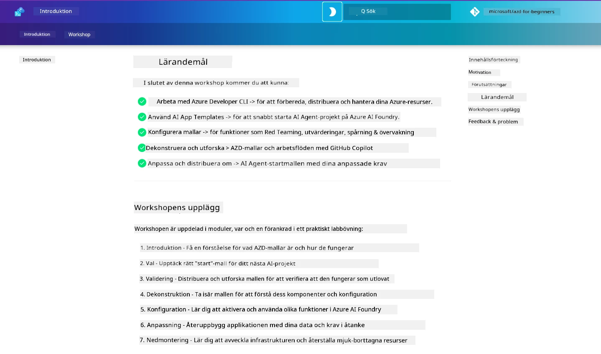

<div align="center">
  <div style="background: linear-gradient(135deg, #0078d4, #106ebe); border-radius: 10px; padding: 20px; margin: 20px 0; box-shadow: 0 4px 15px rgba(0, 120, 212, 0.3); border: 2px solid #005a9e;">
    <h2 style="color: white; margin: 0; font-size: 24px; text-shadow: 1px 1px 2px rgba(0,0,0,0.3);">
      🎯 AZD för AI-utvecklare Workshop
    </h2>
    <p style="color: white; margin: 10px 0 0 0; font-size: 16px; text-shadow: 1px 1px 2px rgba(0,0,0,0.3);">
      <strong>En praktisk workshop för att bygga AI-applikationer med Azure Developer CLI.</strong><br>
      Avsluta 7 moduler för att bemästra AZD-mallar och AI-distributionsarbetsflöden.
    </p>
    <div style="margin-top: 15px;">
      <span style="background: rgba(255,255,255,0.2); padding: 5px 10px; border-radius: 15px; color: white; font-size: 14px;">
        📅 Senast uppdaterad: februari 2026
      </span>
    </div>
  </div>
</div>

# AZD för AI-utvecklare Workshop

Välkommen till den praktiska workshopen för att lära dig Azure Developer CLI (AZD) med fokus på distribution av AI-applikationer. Denna workshop hjälper dig att få en praktisk förståelse för AZD-mallar i 3 steg:

1. **Upptäckt** - hitta den mall som passar dig.
1. **Distribution** - distribuera och validera att det fungerar
1. **Anpassning** - modifiera och iterera för att göra den till din!

Under kursens gång kommer du också att introduceras för kärnverktyg och arbetsflöden för utvecklare, för att hjälpa dig att effektivisera din end-to-end utvecklingsresa.

<br/>

## Webbläsarbaserad guide

Workshopens lektioner är i Markdown. Du kan navigera dem direkt på GitHub - eller starta en webbläsarbaserad förhandsvisning som visas i skärmdumpen nedan.



För att använda det här alternativet - fork:a repositoryt till din profil och starta GitHub Codespaces. När VS Code-terminalen är aktiv, skriv detta kommando:

```bash title="" linenums="0"
mkdocs serve > /dev/null 2>&1 &
```

Om några sekunder kommer du att se en popup-dialog. Välj alternativet att `Öppna i webbläsaren`. Den webbaserade guiden öppnas nu i en ny flik i webbläsaren. Några fördelar med denna förhandsvisning:

1. **Inbyggd sökfunktion** - hitta nyckelord eller lektioner snabbt.
1. **Kopieringsikon** - håll muspekaren över kodblock för att se detta alternativ
1. **Byt tema** - växla mellan mörkt och ljust tema
1. **Få hjälp** - klicka på Discord-ikonen i sidfoten för att gå med!

<br/>

## Översikt över workshopen

**Varaktighet:** 3-4 timmar  
**Nivå:** Nybörjare till Mellannivå  
**Förkunskaper:** Bekantskap med Azure, AI-koncept, VS Code & kommandoradsverktyg.

Detta är en praktisk workshop där du lär dig genom att göra. När du har slutfört övningarna rekommenderar vi att du går igenom AZD För Nybörjare-kursen för att fortsätta din läranderesa in i säkerhets- och produktivitetsbästa praxis.

| Tid| Modul  | Mål |
|:---|:---|:---|
| 15 mins | [Introduktion](docs/instructions/0-Introduction.md) | Sätt scenen, förstå målen |
| 30 mins | [Välj AI-mall](docs/instructions/1-Select-AI-Template.md) | Utforska alternativ och välj startmall | 
| 30 mins | [Validera AI-mall](docs/instructions/2-Validate-AI-Template.md) | Distribuera standardlösning till Azure |
| 30 mins | [Analysera AI-mall](docs/instructions/3-Deconstruct-AI-Template.md) | Utforska struktur och konfiguration |
| 30 mins | [Konfigurera AI-mall](docs/instructions/4-Configure-AI-Template.md) | Aktivera och testa tillgängliga funktioner |
| 30 mins | [Anpassa AI-mall](docs/instructions/5-Customize-AI-Template.md) | Anpassa mallen efter dina behov |
| 30 mins | [Nedmontera infrastruktur](docs/instructions/6-Teardown-Infrastructure.md) | Rensa upp och frigör resurser |
| 15 mins | [Sammanfattning & nästa steg](docs/instructions/7-Wrap-up.md) | Lärresurser, workshoputmaning |

<br/>

## Vad du kommer att lära dig

Tänk på AZD-mallen som en lärandesandbox för att utforska olika möjligheter och verktyg för end-to-end utveckling på Microsoft Foundry. I slutet av denna workshop bör du ha en intuitiv känsla för olika verktyg och koncept i detta sammanhang.

| Koncept  | Mål |
|:---|:---|
| **Azure Developer CLI** | Förstå verktygets kommandon och arbetsflöden |
| **AZD Templates**| Förstå projektstruktur och konfiguration |
| **Azure AI Agent**| Provisionera & distribuera Microsoft Foundry-projekt  |
| **Azure AI Search**| Möjliggör kontextengineering med agenter |
| **Observerbarhet**| Utforska spårning, övervakning och utvärderingar |
| **Red Teaming**| Utforska adversarial tester och motåtgärder |

<br/>

## Workshopstruktur

Workshopen är strukturerad för att ta dig på en resa från mallupptäckt till distribution, dekonstruering och anpassning - med den officiella [Getting Started with AI Agents](https://github.com/Azure-Samples/get-started-with-ai-agents) startmallen som bas.

### [Modul 1: Välj AI-mall](docs/instructions/1-Select-AI-Template.md) (30 mins)

- Vad är AI-mallar?
- Var kan jag hitta AI-mallar?
- Hur kommer jag igång med att bygga AI-agenter?
- **Lab**: Snabbstart med GitHub Codespaces

### [Modul 2: Validera AI-mall](docs/instructions/2-Validate-AI-Template.md) (30 mins)

- Vad är AI-mallens arkitektur?
- Vad är AZD-utvecklingsarbetsflödet?
- Hur får jag hjälp med AZD-utveckling?
- **Lab**: Distribuera & validera AI Agents-mallen

### [Modul 3: Analysera AI-mall](docs/instructions/3-Deconstruct-AI-Template.md) (30 mins)

- Utforska din miljö i `.azure/` 
- Utforska din resursuppsättning i `infra/` 
- Utforska din AZD-konfiguration i `azure.yaml`s
- **Lab**: Modifiera miljövariabler & distribuera igen

### [Modul 4: Konfigurera AI-mall](docs/instructions/4-Configure-AI-Template.md) (30 mins)
- Utforska: Retrieval Augmented Generation
- Utforska: Agentutvärdering & Red Teaming
- Utforska: Spårning & övervakning
- **Lab**: Utforska AI-agent + observerbarhet 

### [Modul 5: Anpassa AI-mall](docs/instructions/5-Customize-AI-Template.md) (30 mins)
- Definiera: PRD med scenariokrav
- Konfigurera: Miljövariabler för AZD
- Implementera: Livscykelkrokar för tillagda uppgifter
- **Lab**: Anpassa mallen för mitt scenario

### [Modul 6: Nedmontera infrastruktur](docs/instructions/6-Teardown-Infrastructure.md) (30 mins)
- Sammanfatta: Vad är AZD-mallar?
- Sammanfatta: Varför använda Azure Developer CLI?
- Nästa steg: Prova en annan mall!
- **Lab**: Avprovisionera infrastruktur & städa upp

<br/>

## Workshoputmaning

Vill du utmana dig själv att göra mer? Här är några projektförslag - eller dela dina idéer med oss!!

| Project | Description |
|:---|:---|
|1. **Dekonstruera en komplex AI-mall** | Använd arbetsflödet och verktygen vi beskrev och se om du kan distribuera, validera och anpassa en annan AI-lösningsmall. _Vad lärde du dig?_|
|2. **Anpassa efter ditt scenario**  | Försök att skriva ett PRD (Produktkravdokument) för ett annat scenario. Använd sedan GitHub Copilot i ditt mall-repo i Agent Model - och be den att generera ett anpassningsarbetsflöde åt dig. _Vad lärde du dig? Hur kan du förbättra dessa förslag?_|
| | |

## Har du feedback?

1. Skapa ett issue i detta repo - tagga det `Workshop` för enkelhetens skull.
1. Gå med i Microsoft Foundry Discord - koppla upp dig med dina kollegor!


| | | 
|:---|:---|
| **📚 Kursöversikt**| [AZD For Beginners](../README.md)|
| **📖 Dokumentation** | [Kom igång med AI-mallar](https://learn.microsoft.com/en-us/azure/ai-foundry/how-to/develop/ai-template-get-started)|
| **🛠️AI-mallar** | [Microsoft Foundry Templates](https://ai.azure.com/templates) |
|**🚀 Nästa steg** | [Börja workshopen](../../../workshop) |
| | |

<br/>

---

**Navigering:** [Huvudkurs](../README.md) | [Introduktion](docs/instructions/0-Introduction.md) | [Modul 1: Välj AI-mall](docs/instructions/1-Select-AI-Template.md)

**Redo att börja bygga AI-applikationer med AZD?**

[Starta workshoppen: Introduktion →](docs/instructions/0-Introduction.md)

---

<!-- CO-OP TRANSLATOR DISCLAIMER START -->
**Ansvarsfriskrivning**:
Detta dokument har översatts med hjälp av AI-översättningstjänsten [Co-op Translator](https://github.com/Azure/co-op-translator). Även om vi strävar efter noggrannhet bör du vara medveten om att automatiska översättningar kan innehålla fel eller brister. Det ursprungliga dokumentet på originalspråket ska anses vara den auktoritativa källan. För viktig information rekommenderas professionell mänsklig översättning. Vi ansvarar inte för några missförstånd eller feltolkningar som uppstår till följd av användningen av denna översättning.
<!-- CO-OP TRANSLATOR DISCLAIMER END -->