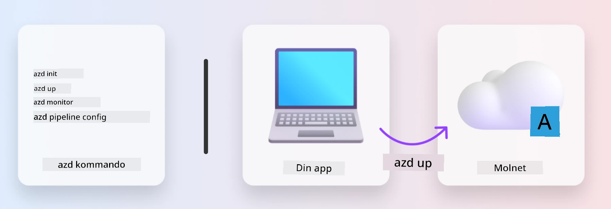
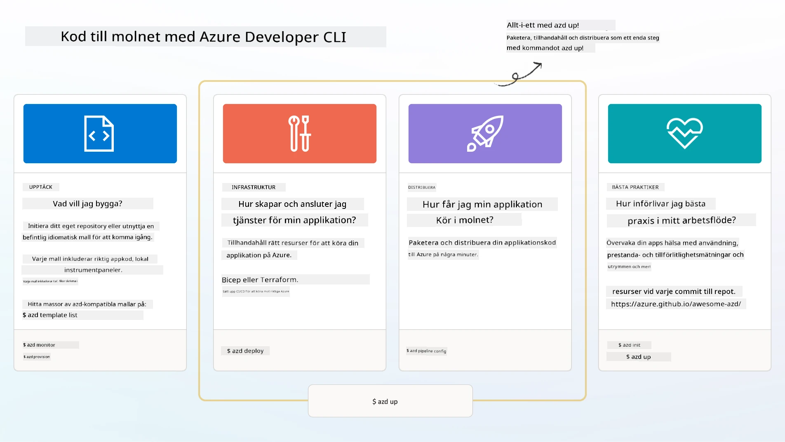

<!--
CO_OP_TRANSLATOR_METADATA:
{
  "original_hash": "06d6207eff634aefcaa41739490a5324",
  "translation_date": "2025-09-24T21:30:02+00:00",
  "source_file": "workshop/docs/instructions/1-Select-AI-Template.md",
  "language_code": "sv"
}
-->
# 1. Välj en Mall

!!! tip "VID SLUTET AV DENNA MODUL KOMMER DU ATT KUNNA"

    - [ ] Beskriva vad AZD-mallar är
    - [ ] Upptäcka och använda AZD-mallar för AI
    - [ ] Komma igång med AI Agents-mallen
    - [ ] **Lab 1:** AZD Snabbstart med GitHub Codespaces

---

## 1. En Byggmästaranalogi

Att bygga en modern AI-applikation för företag _från grunden_ kan kännas överväldigande. Det är lite som att bygga ditt nya hem själv, tegelsten för tegelsten. Ja, det går att göra! Men det är inte det mest effektiva sättet att nå det önskade slutresultatet!

Istället börjar vi ofta med en befintlig _designritning_ och arbetar med en arkitekt för att anpassa den efter våra personliga behov. Och det är precis den metoden vi ska använda när vi bygger intelligenta applikationer. Först, hitta en bra designarkitektur som passar ditt problemområde. Sedan, arbeta med en lösningsarkitekt för att anpassa och utveckla lösningen för ditt specifika scenario.

Men var kan vi hitta dessa designritningar? Och hur hittar vi en arkitekt som är villig att lära oss hur man anpassar och implementerar dessa ritningar på egen hand? I denna workshop besvarar vi dessa frågor genom att introducera dig till tre teknologier:

1. [Azure Developer CLI](https://aka.ms/azd) - ett open-source-verktyg som påskyndar utvecklarens väg från lokal utveckling (bygg) till molnimplementering (leverans).
1. [Azure AI Foundry Templates](https://ai.azure.com/templates) - standardiserade open-source-repositorier som innehåller exempel på kod, infrastruktur och konfigurationsfiler för att implementera en AI-lösningsarkitektur.
1. [GitHub Copilot Agent Mode](https://code.visualstudio.com/docs/copilot/chat/chat-agent-mode) - en kodagent baserad på Azure-kunskap som kan guida oss genom kodbasen och hjälpa oss att göra ändringar med hjälp av naturligt språk.

Med dessa verktyg i handen kan vi nu _upptäcka_ rätt mall, _implementera_ den för att verifiera att den fungerar, och _anpassa_ den för att passa våra specifika scenarier. Låt oss dyka in och lära oss hur dessa fungerar.

---

## 2. Azure Developer CLI

[Azure Developer CLI](https://learn.microsoft.com/en-us/azure/developer/azure-developer-cli/) (eller `azd`) är ett open-source-kommandoradsverktyg som kan snabba upp din resa från kod till moln med en uppsättning utvecklarvänliga kommandon som fungerar konsekvent över din IDE (utveckling) och CI/CD (devops)-miljöer.

Med `azd` kan din implementeringsresa vara så enkel som:

- `azd init` - Initierar ett nytt AI-projekt från en befintlig AZD-mall.
- `azd up` - Tillhandahåller infrastruktur och implementerar din applikation i ett steg.
- `azd monitor` - Få realtidsövervakning och diagnostik för din implementerade applikation.
- `azd pipeline config` - Konfigurera CI/CD-pipelines för att automatisera implementering till Azure.

**🎯 | ÖVNING**: <br/> Utforska `azd`-kommandoradsverktyget i din GitHub Codespaces-miljö nu. Börja med att skriva detta kommando för att se vad verktyget kan göra:

```bash title="" linenums="0"
azd help
```



---

## 3. AZD-mallen

För att `azd` ska kunna uppnå detta behöver det veta vilken infrastruktur som ska tillhandahållas, vilka konfigurationsinställningar som ska tillämpas och vilken applikation som ska implementeras. Det är här [AZD-mallar](https://learn.microsoft.com/en-us/azure/developer/azure-developer-cli/azd-templates?tabs=csharp) kommer in.

AZD-mallar är open-source-repositorier som kombinerar exempel på kod med infrastruktur och konfigurationsfiler som krävs för att implementera lösningsarkitekturen. 
Genom att använda ett _Infrastructure-as-Code_ (IaC)-tillvägagångssätt tillåter de att resursdefinitioner och konfigurationsinställningar i mallen kan versionshanteras (precis som applikationens källkod) - vilket skapar återanvändbara och konsekventa arbetsflöden för användare av det projektet.

När du skapar eller återanvänder en AZD-mall för _ditt_ scenario, överväg dessa frågor:

1. Vad bygger du? → Finns det en mall som har startkod för det scenariot?
1. Hur är din lösning arkitekterad? → Finns det en mall som har de nödvändiga resurserna?
1. Hur implementeras din lösning? → Tänk `azd deploy` med pre/post-processing hooks!
1. Hur kan du optimera den ytterligare? → Tänk inbyggd övervakning och automatiseringspipelines!

**🎯 | ÖVNING**: <br/> 
Besök [Awesome AZD](https://azure.github.io/awesome-azd/) galleriet och använd filtren för att utforska de 250+ mallar som för närvarande finns tillgängliga. Se om du kan hitta en som passar _dina_ scenariokrav.



---

## 4. AI-applikationsmallar

---

