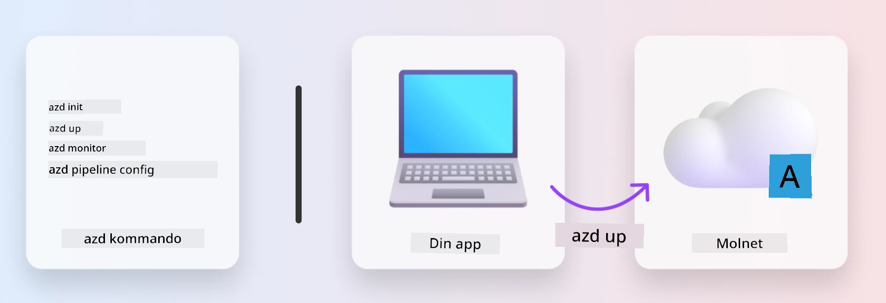
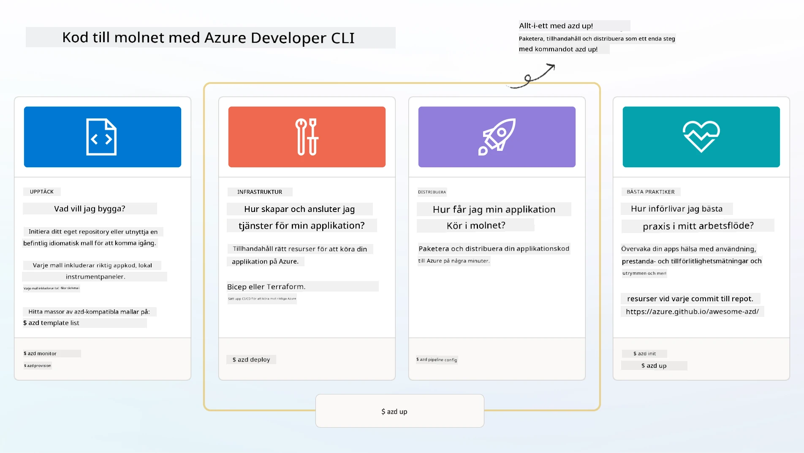

# 1. Välj en mall

!!! tip "I SLUTET AV DENNA MODUL KOMMER DU ATT KUNNA"

    - [ ] Beskriv vad AZD-mallar är
    - [ ] Hitta och använd AZD-mallar för AI
    - [ ] Kom igång med AI Agents-mallen
    - [ ] **Laboration 1:** AZD Quickstart med GitHub Codespaces

---

## 1. En bygganalogi

Att bygga en modern, företagsklar AI-applikation _från grunden_ kan vara skrämmande. Det är lite som att bygga ditt nya hem själv, tegel för tegel. Ja, det går att göra! Men det är inte det mest effektiva sättet att nå det önskade slutresultatet!

Istället börjar vi ofta med en befintlig _designblueprint_ och samarbetar med en arkitekt för att anpassa den efter våra personliga krav. Och det är precis det arbetssättet man bör ta när man bygger intelligenta applikationer. Först hittar du en bra designarkitektur som passar ditt problemområde. Sedan arbetar du med en lösningsarkitekt för att anpassa och utveckla lösningen för ditt specifika scenario.

Men var kan vi hitta dessa designblueprints? Och hur hittar vi en arkitekt som är villig att lära oss hur man anpassar och distribuerar dessa blueprints på egen hand? I den här workshopen besvarar vi dessa frågor genom att introducera dig till tre teknologier:

1. [Azure Developer CLI](https://aka.ms/azd) - ett open-source-verktyg som påskyndar utvecklarens väg från lokal utveckling (build) till molndistribution (ship).
1. [Microsoft Foundry Templates](https://ai.azure.com/templates) - standardiserade open-source-repositorier som innehåller exempelkod, infrastruktur och konfigurationsfiler för att distribuera en AI-lösningsarkitektur.
1. [GitHub Copilot Agent Mode](https://code.visualstudio.com/docs/copilot/chat/chat-agent-mode) - en kodningsagent baserad på Azure-kunskap som kan vägleda oss i att navigera i kodbasen och göra ändringar - med naturligt språk.

Med dessa verktyg i handen kan vi nu _upptäcka_ rätt mall, _distribuera_ den för att verifiera att den fungerar, och _anpassa_ den för att passa våra specifika scenarier. Låt oss dyka in och lära oss hur de fungerar.

---

## 2. Azure Developer CLI

The [Azure Developer CLI](https://learn.microsoft.com/en-us/azure/developer/azure-developer-cli/) (or `azd`) är ett open-source kommandoradsverktyg som kan snabba upp din resa från kod till moln med en uppsättning utvecklarvänliga kommandon som fungerar konsekvent i din IDE (utveckling) och CI/CD (devops) miljöer.

With `azd`, your deployment journey can be as simple as:

- `azd init` - Initierar ett nytt AI-projekt från en befintlig AZD-mall.
- `azd up` - Provisionerar infrastruktur och distribuerar din applikation i ett steg.
- `azd monitor` - Får realtidsövervakning och diagnostik för din distribuerade applikation.
- `azd pipeline config` - Konfigurerar CI/CD-pipelines för att automatisera distribution till Azure.

**🎯 | ÖVNING**: <br/> Utforska `azd`-kommandoradsverktyget i din GitHub Codespaces-miljö nu. Börja med att skriva detta kommando för att se vad verktyget kan göra:

```bash title="" linenums="0"
azd help
```



---

## 3. AZD-mallen

För att `azd` ska kunna göra detta behöver det veta vilken infrastruktur som ska provisioneras, vilka konfigurationsinställningar som ska tillämpas, och vilken applikation som ska distribueras. Här kommer [AZD templates](https://learn.microsoft.com/en-us/azure/developer/azure-developer-cli/azd-templates?tabs=csharp) in i bilden.

AZD-mallar är open-source-repositorier som kombinerar exempelkod med infrastruktur- och konfigurationsfiler som krävs för att distribuera lösningsarkitekturen.
Genom att använda ett _Infrastructure-as-Code_ (IaC)-angreppssätt tillåter de att mallens resursdefinitioner och konfigurationsinställningar versionskontrolleras (precis som appens källkod) - vilket skapar återanvändbara och konsekventa arbetsflöden mellan användare av projektet.

När du skapar eller återanvänder en AZD-mall för _ditt_ scenario, överväg dessa frågor:

1. What are you building? → Finns det en mall som har startkod för det scenariot?
1. How is your solution architected? → Finns det en mall som innehåller de nödvändiga resurserna?
1. How is your solution deployed? → Tänk `azd deploy` med pre-/post-processing hooks!
1. How can you optimize it further? → Tänk inbyggd övervakning och automatiserade pipelines!

**🎯 | ÖVNING**: <br/> 
Besök [Awesome AZD](https://azure.github.io/awesome-azd/) galleriet och använd filtren för att utforska de 250+ mallar som för närvarande finns tillgängliga. Se om du kan hitta en som matchar _dina_ scenariokrav.



---

## 4. AI App Templates

För AI-drivna applikationer tillhandahåller Microsoft specialiserade mallar med **Microsoft Foundry** och **Foundry Agents**. Dessa mallar påskyndar din väg till att bygga intelligenta, produktionsfärdiga applikationer.

### Microsoft Foundry & Foundry Agents Templates

Välj en mall nedan för att distribuera. Varje mall finns tillgänglig på [Awesome AZD](https://azure.github.io/awesome-azd/) och kan initieras med ett enda kommando.

| Template | Description | Deploy Command |
|----------|-------------|----------------|
| **[AI Chat with RAG](https://azure.github.io/awesome-azd/?tags=ai&tags=rag)** | Chattapplikation med Retrieval Augmented Generation med Microsoft Foundry | `azd init -t azure-samples/azure-search-openai-demo` |
| **[Foundry Agent Service Starter](https://azure.github.io/awesome-azd/?tags=ai&tags=agents)** | Bygg AI-agenter med Foundry Agents för autonom uppgiftsutförande | `azd init -t azure-samples/foundry-agent-service-starter` |
| **[Multi-Agent Orchestration](https://azure.github.io/awesome-azd/?tags=ai&tags=agents)** | Samordna flera Foundry Agents för komplexa arbetsflöden | `azd init -t azure-samples/multi-agent-orchestration` |
| **[AI Document Intelligence](https://azure.github.io/awesome-azd/?tags=ai&tags=document)** | Extrahera och analysera dokument med Microsoft Foundry-modeller | `azd init -t azure-samples/ai-document-processing` |
| **[Conversational AI Bot](https://azure.github.io/awesome-azd/?tags=ai&tags=bot)** | Bygg intelligenta chatbots med Microsoft Foundry-integration | `azd init -t azure-samples/ai-chat-protocol` |
| **[AI Image Generation](https://azure.github.io/awesome-azd/?tags=ai&tags=dalle)** | Generera bilder med DALL-E via Microsoft Foundry | `azd init -t azure-samples/ai-image-generation` |
| **[Semantic Kernel Agent](https://azure.github.io/awesome-azd/?tags=ai&tags=semantic-kernel)** | AI-agenter som använder Semantic Kernel med Foundry Agents | `azd init -t azure-samples/semantic-kernel-agent` |
| **[AutoGen Multi-Agent](https://azure.github.io/awesome-azd/?tags=ai&tags=autogen)** | Multi-agent-system med AutoGen-ramverket | `azd init -t azure-samples/autogen-multi-agent` |

### Snabbstart

1. **Bläddra bland mallar**: Besök [https://azure.github.io/awesome-azd/] och filtrera efter `AI`, `Agents`, eller `Microsoft Foundry`
2. **Välj din mall**: Välj en som matchar ditt användningsfall
3. **Initiera**: Kör `azd init`-kommandot för din valda mall
4. **Distribuera**: Kör `azd up` för att provisionera och distribuera

**🎯 | ÖVNING**: <br/>
Välj en av mallarna ovan baserat på ditt scenario:

- **Bygger du en chatbot?** → Börja med **AI Chat with RAG** eller **Conversational AI Bot**
- **Behöver du autonoma agenter?** → Testa **Foundry Agent Service Starter** eller **Multi-Agent Orchestration**
- **Bearbetar du dokument?** → Använd **AI Document Intelligence**
- **Vill du ha AI-assistans i kodning?** → Utforska **Semantic Kernel Agent** eller **AutoGen Multi-Agent**

```bash title="Example: Deploy the AI Chat with RAG template" linenums="0"
azd init -t azure-samples/azure-search-openai-demo
azd up
```

!!! info "Utforska fler mallar"
    The [Awesome AZD Gallery](https://azure.github.io/awesome-azd/) contains 250+ templates. Use the filters to find templates matching your specific requirements for language, framework, and Azure services.

---

<!-- CO-OP TRANSLATOR DISCLAIMER START -->
**Ansvarsfriskrivning**:
Detta dokument har översatts med hjälp av AI-översättningstjänsten Co-op Translator (https://github.com/Azure/co-op-translator). Även om vi strävar efter noggrannhet, var vänlig observera att automatiska översättningar kan innehålla fel eller brister. Det ursprungliga dokumentet på dess ursprungliga språk ska betraktas som den auktoritativa källan. För kritisk information rekommenderas professionell mänsklig översättning. Vi ansvarar inte för några missförstånd eller feltolkningar som uppstår vid användning av denna översättning.
<!-- CO-OP TRANSLATOR DISCLAIMER END -->