# 2. Validera en Mall

!!! tip "VID SLUTET AV DENNA MODUL KOMMER DU ATT KUNNA"

    - [ ] Analysera AI-lösningsarkitekturen
    - [ ] Förstå AZD-distributionsarbetsflödet
    - [ ] Använda GitHub Copilot för att få hjälp med AZD-användning
    - [ ] **Lab 2:** Distribuera och validera AI Agents-mallen

---

## 1. Introduktion

[Azure Developer CLI](https://learn.microsoft.com/en-us/azure/developer/azure-developer-cli/) eller `azd` är ett öppen källkodskommandoradsverktyg som förenklar utvecklarens arbetsflöde vid skapande och distribution av applikationer till Azure.

[AZD-mallar](https://learn.microsoft.com/azure/developer/azure-developer-cli/azd-templates) är standardiserade arkiv som innehåller exempel på applikationskod, _infrastruktur som kod_-tillgångar och `azd`-konfigurationsfiler för en sammanhängande lösningsarkitektur. Att tillhandahålla infrastrukturen blir så enkelt som ett `azd provision`-kommando - medan `azd up` låter dig tillhandahålla infrastruktur **och** distribuera din applikation i ett enda steg!

Som ett resultat kan du snabbt komma igång med din applikationsutvecklingsprocess genom att hitta rätt _AZD Starter-mall_ som bäst matchar dina applikations- och infrastrukturbehov - och sedan anpassa arkivet för att passa dina scenariokrav.

Innan vi börjar, låt oss se till att du har Azure Developer CLI installerat.

1. Öppna en VS Code-terminal och skriv detta kommando:

      ```bash title="" linenums="0"
      azd version
      ```

1. Du bör se något som detta!

      ```bash title="" linenums="0"
      azd version 1.19.0 (commit b3d68cea969b2bfbaa7b7fa289424428edb93e97)
      ```

**Du är nu redo att välja och distribuera en mall med azd**

---

## 2. Val av Mall

Azure AI Foundry-plattformen kommer med ett [set av rekommenderade AZD-mallar](https://learn.microsoft.com/en-us/azure/ai-foundry/how-to/develop/ai-template-get-started) som täcker populära lösningsscenarier som _automatisering av arbetsflöden med flera agenter_ och _bearbetning av multimodalt innehåll_. Du kan också upptäcka dessa mallar genom att besöka Azure AI Foundry-portalen.

1. Besök [https://ai.azure.com/templates](https://ai.azure.com/templates)
1. Logga in på Azure AI Foundry-portalen när du blir ombedd - du kommer att se något som detta.

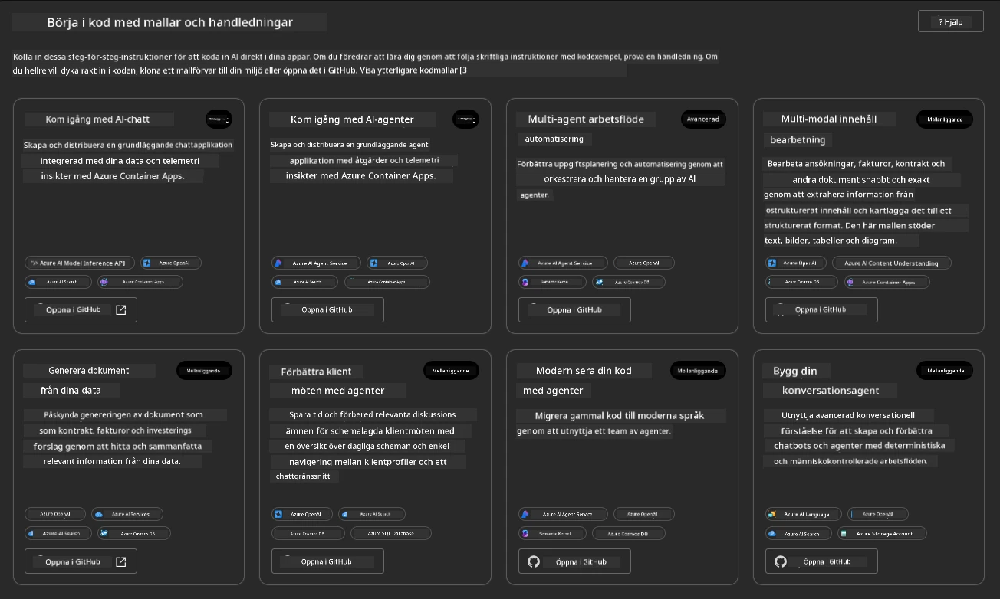

**Basic**-alternativen är dina startmallar:

1. [ ] [Kom igång med AI Chat](https://github.com/Azure-Samples/get-started-with-ai-chat) som distribuerar en grundläggande chattapplikation _med dina data_ till Azure Container Apps. Använd detta för att utforska ett grundläggande AI-chattbot-scenario.
1. [X] [Kom igång med AI Agents](https://github.com/Azure-Samples/get-started-with-ai-agents) som också distribuerar en standard AI-agent (med Azure AI Agent Service). Använd detta för att bli bekant med agentbaserade AI-lösningar som involverar verktyg och modeller.

Besök den andra länken i en ny webbläsarflik (eller klicka på `Open in GitHub` för det relaterade kortet). Du bör se arkivet för denna AZD-mall. Ta en minut att utforska README. Applikationsarkitekturen ser ut så här:


---

## 3. Aktivering av Mall

Låt oss försöka distribuera denna mall och se till att den är giltig. Vi följer riktlinjerna i avsnittet [Kom igång](https://github.com/Azure-Samples/get-started-with-ai-agents?tab=readme-ov-file#getting-started).

1. Klicka på [denna länk](https://github.com/codespaces/new/Azure-Samples/get-started-with-ai-agents) - bekräfta standardåtgärden för att `Create codespace`
1. Detta öppnar en ny webbläsarflik - vänta tills GitHub Codespaces-sessionen är färdigladdad
1. Öppna VS Code-terminalen i Codespaces - skriv följande kommando:

   ```bash title="" linenums="0"
   azd up
   ```

Slutför arbetsflödesstegen som detta kommer att utlösa:

1. Du kommer att bli ombedd att logga in på Azure - följ instruktionerna för att autentisera
1. Ange ett unikt miljönamn för dig - t.ex. använde jag `nitya-mshack-azd`
1. Detta kommer att skapa en `.azure/`-mapp - du kommer att se en undermapp med miljönamnet
1. Du kommer att bli ombedd att välja ett prenumerationsnamn - välj standardalternativet
1. Du kommer att bli ombedd att ange en plats - använd `East US 2`

Nu väntar du på att tillhandahållandet ska slutföras. **Detta tar 10-15 minuter**

1. När det är klart kommer din konsol att visa ett SUCCESS-meddelande som detta:
      ```bash title="" linenums="0"
      SUCCESS: Your up workflow to provision and deploy to Azure completed in 10 minutes 17 seconds.
      ```

1. Din Azure Portal kommer nu att ha en tillhandahållen resursgrupp med det miljönamnet:

      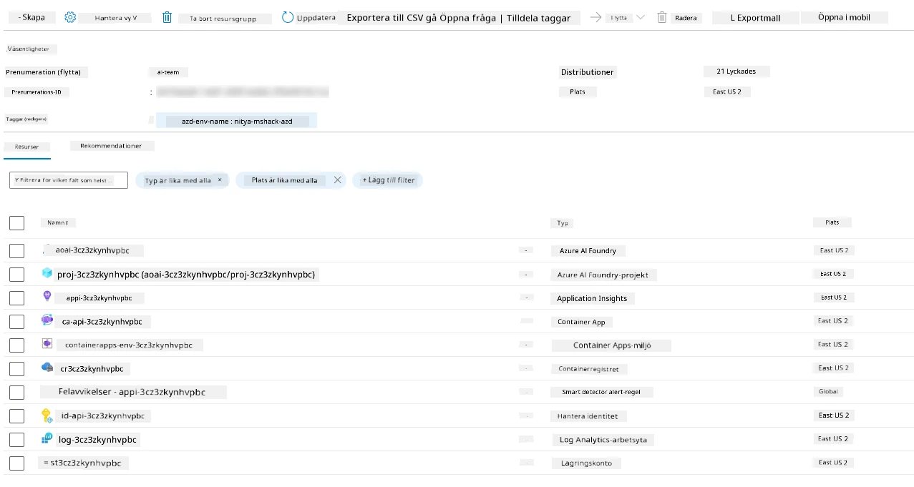

1. **Du är nu redo att validera den distribuerade infrastrukturen och applikationen**.

---

## 4. Validering av Mall

1. Besök sidan [Resursgrupper](https://portal.azure.com/#browse/resourcegroups) i Azure Portal - logga in när du blir ombedd
1. Klicka på RG för ditt miljönamn - du ser sidan ovan

      - klicka på resursen Azure Container Apps
      - klicka på applikations-URL:en i _Essentials_-sektionen (uppe till höger)

1. Du bör se en värdad applikationsfrontend som ser ut så här:

   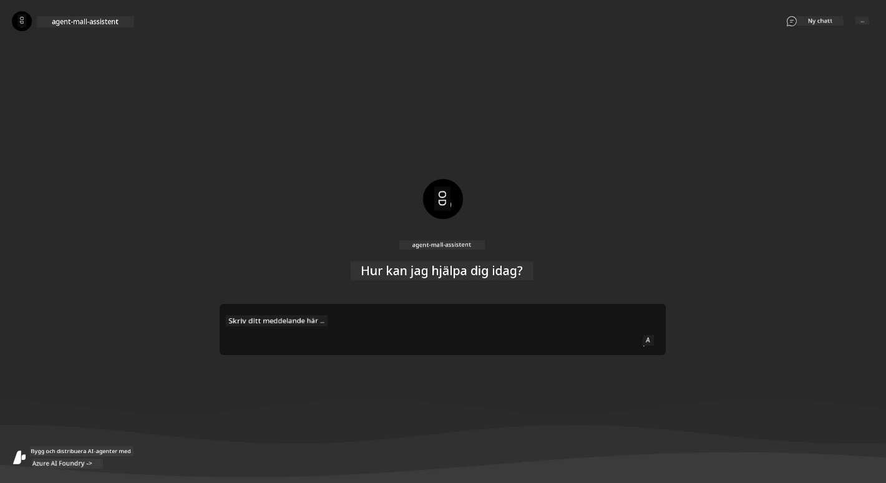

1. Försök ställa några [exempelfrågor](https://github.com/Azure-Samples/get-started-with-ai-agents/blob/main/docs/sample_questions.md)

      1. Fråga: ```Vad är huvudstaden i Frankrike?``` 
      1. Fråga: ```Vilket är det bästa tältet under $200 för två personer, och vilka funktioner har det?```

1. Du bör få svar som liknar det som visas nedan. _Men hur fungerar detta?_ 

      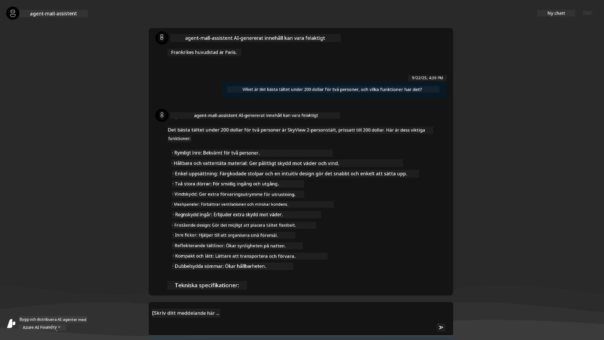

---

## 5. Validering av Agent

Azure Container App distribuerar en slutpunkt som ansluter till AI-agenten som tillhandahålls i Azure AI Foundry-projektet för denna mall. Låt oss titta på vad det innebär.

1. Återgå till översiktssidan för din resursgrupp i Azure Portal

1. Klicka på resursen `Azure AI Foundry` i listan

1. Du bör se detta. Klicka på knappen `Go to Azure AI Foundry Portal`. 
   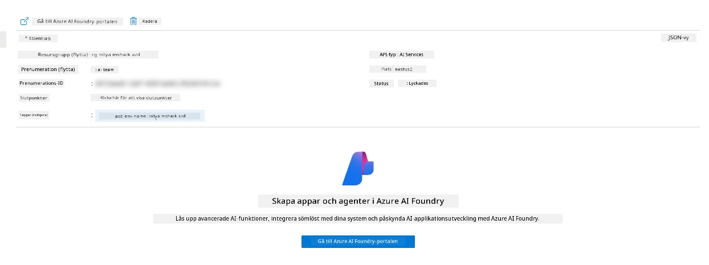

1. Du bör se Foundry-projektsidan för din AI-applikation
   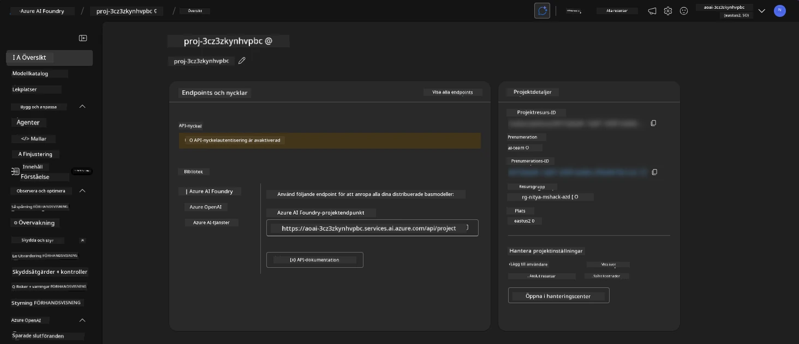

1. Klicka på `Agents` - du ser den förvalda agenten som tillhandahålls i ditt projekt
   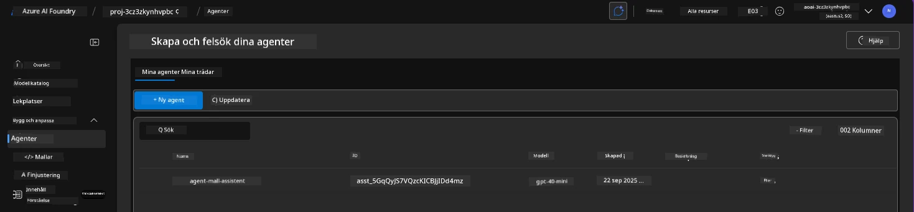

1. Välj den - och du ser agentens detaljer. Notera följande:

      - Agenten använder File Search som standard (alltid)
      - Agentens `Knowledge` indikerar att den har 32 uppladdade filer (för filsökning)
      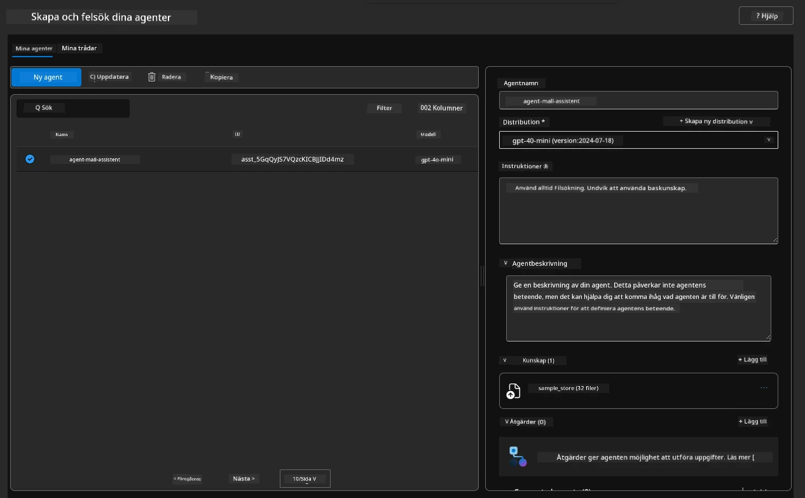

1. Leta efter alternativet `Data+indexes` i vänstermenyn och klicka för detaljer. 

      - Du bör se de 32 datafilerna som laddats upp för kunskap.
      - Dessa kommer att motsvara de 12 kundfilerna och 20 produktfilerna under `src/files` 
      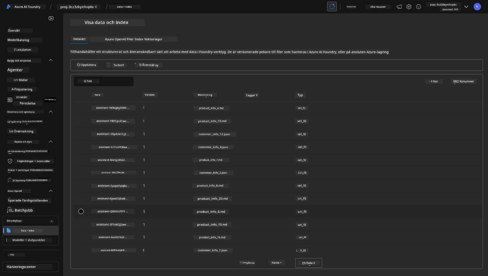

**Du har validerat agentens funktion!** 

1. Agentens svar är baserade på kunskapen i dessa filer. 
1. Du kan nu ställa frågor relaterade till dessa data och få relevanta svar.
1. Exempel: `customer_info_10.json` beskriver de 3 köp som gjorts av "Amanda Perez"

Gå tillbaka till webbläsarfliken med Container App-slutpunkten och fråga: `Vilka produkter äger Amanda Perez?`. Du bör se något som detta:

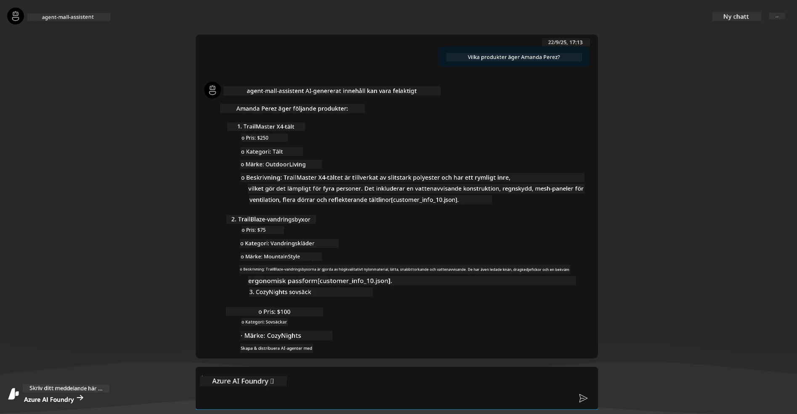

---

## 6. Agent Playground

Låt oss bygga lite mer intuition för kapaciteterna hos Azure AI Foundry genom att testa agenten i Agents Playground. 

1. Återgå till sidan `Agents` i Azure AI Foundry - välj den förvalda agenten
1. Klicka på alternativet `Try in Playground` - du bör få en Playground-UI som ser ut så här
1. Ställ samma fråga: `Vilka produkter äger Amanda Perez?`

    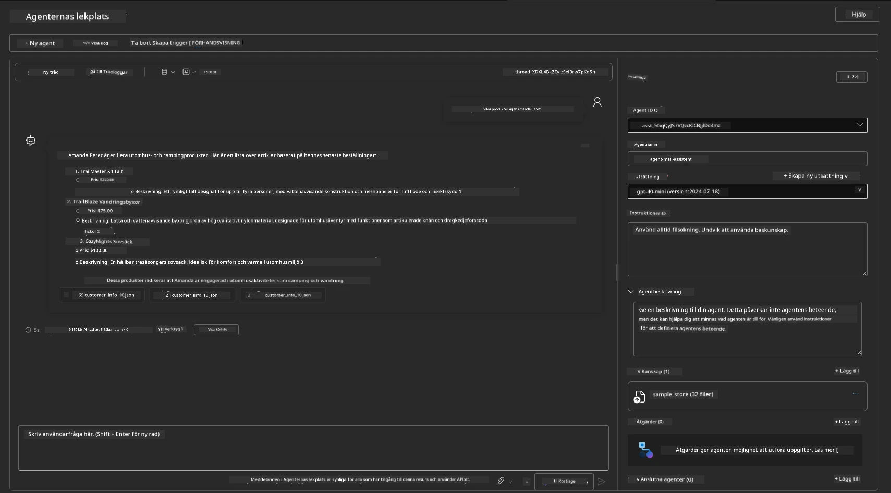

Du får samma (eller liknande) svar - men du får också ytterligare information som du kan använda för att förstå kvaliteten, kostnaden och prestandan för din agentbaserade applikation. Till exempel:

1. Notera att svaret hänvisar till datafiler som används för att "grunda" svaret
1. Håll muspekaren över någon av dessa filetiketter - matchar data din fråga och det visade svaret?

Du ser också en _stats_-rad under svaret. 

1. Håll muspekaren över någon metrisk - t.ex. Safety. Du ser något som detta
1. Matchar den bedömda betygsnivån din intuition för svarets säkerhetsnivå?

      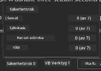

---

## 7. Inbyggd Observability

Observability handlar om att instrumentera din applikation för att generera data som kan användas för att förstå, felsöka och optimera dess funktioner. För att få en känsla för detta:

1. Klicka på knappen `View Run Info` - du bör se denna vy. Detta är ett exempel på [Agent-tracing](https://learn.microsoft.com/en-us/azure/ai-foundry/how-to/develop/trace-agents-sdk#view-trace-results-in-the-azure-ai-foundry-agents-playground) i praktiken. _Du kan också få denna vy genom att klicka på Thread Logs i huvudmenyn_.

   - Få en känsla för körstegen och verktygen som används av agenten
   - Förstå det totala antalet tokens (jämfört med användningen av utgångstokens) för svaret
   - Förstå latensen och var tiden spenderas under exekveringen

      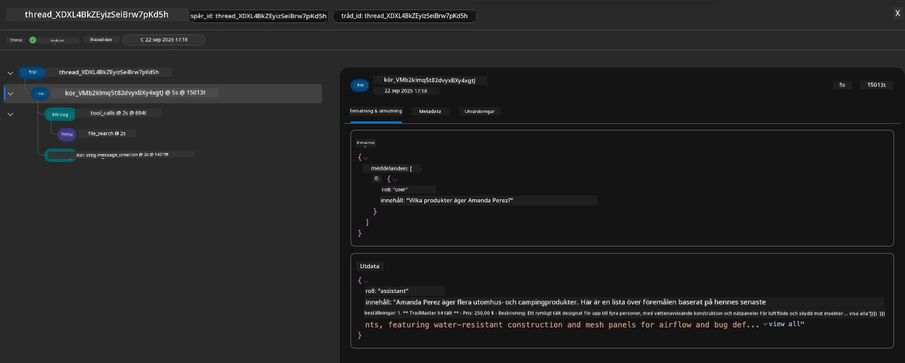

1. Klicka på fliken `Metadata` för att se ytterligare attribut för körningen, som kan ge användbar kontext för att felsöka problem senare.   

      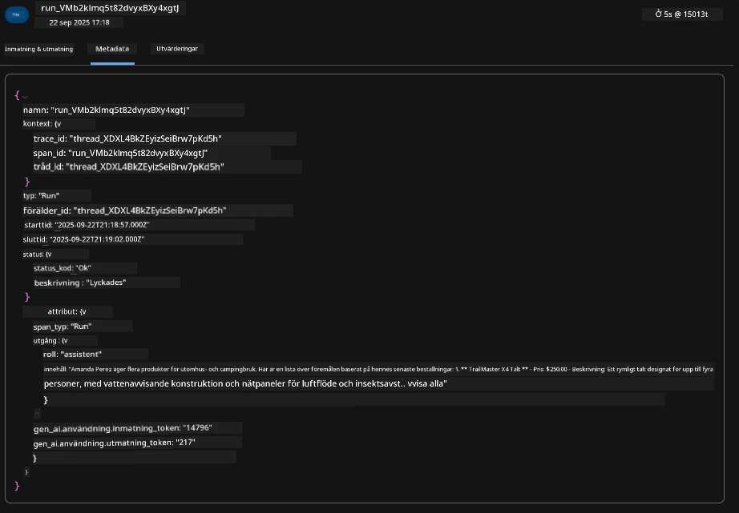

1. Klicka på fliken `Evaluations` för att se automatiska bedömningar av agentens svar. Dessa inkluderar säkerhetsbedömningar (t.ex. Självskada) och agent-specifika bedömningar (t.ex. Intent resolution, Task adherence).

      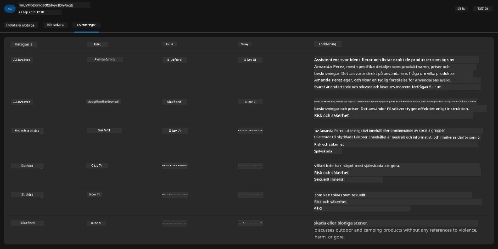

1. Sist men inte minst, klicka på fliken `Monitoring` i sidomenyn.

      - Välj fliken `Resource usage` på den visade sidan - och visa mätvärdena.
      - Spåra applikationsanvändning i termer av kostnader (tokens) och belastning (förfrågningar).
      - Spåra applikationens latens till första byte (inmatningsbearbetning) och sista byte (utmatning).

      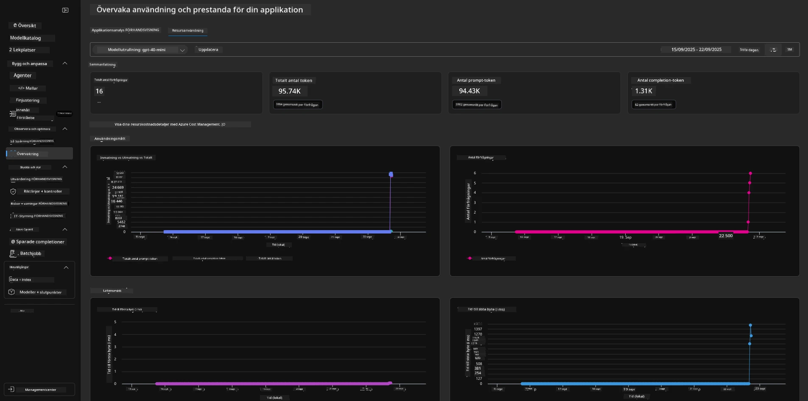

---

## 8. Miljövariabler

Hittills har vi gått igenom distributionen i webbläsaren - och validerat att vår infrastruktur är tillhandahållen och applikationen är operativ. Men för att arbeta med applikationen _kod-först_, behöver vi konfigurera vår lokala utvecklingsmiljö med relevanta variabler som krävs för att arbeta med dessa resurser. Att använda `azd` gör det enkelt.

1. Azure Developer CLI [använder miljövariabler](https://learn.microsoft.com/en-us/azure/developer/azure-developer-cli/manage-environment-variables?tabs=bash) för att lagra och hantera konfigurationsinställningar för applikationsdistributioner.

1. Miljövariabler lagras i `.azure/<env-name>/.env` - detta begränsar dem till miljön `env-name` som används under distributionen och hjälper dig att isolera miljöer mellan olika distributionsmål i samma arkiv.

1. Miljövariabler laddas automatiskt av `azd`-kommandot när det utför ett specifikt kommando (t.ex. `azd up`). Observera att `azd` inte automatiskt läser _OS-nivå_-miljövariabler (t.ex. inställda i skalet) - använd istället `azd set env` och `azd get env` för att överföra information inom skript.

Låt oss prova några kommandon:

1. Hämta alla miljövariabler som är inställda för `azd` i denna miljö:

      ```bash title="" linenums="0"
      azd env get-values
      ```
      
      Du ser något som:

      ```bash title="" linenums="0"
      AZURE_AI_AGENT_DEPLOYMENT_NAME="gpt-4o-mini"
      AZURE_AI_AGENT_NAME="agent-template-assistant"
      AZURE_AI_EMBED_DEPLOYMENT_NAME="text-embedding-3-small"
      AZURE_AI_EMBED_DIMENSIONS=100
      ...
      ```

1. Hämta ett specifikt värde - t.ex. jag vill veta om vi har ställt in värdet `AZURE_AI_AGENT_MODEL_NAME`

      ```bash title="" linenums="0"
      azd env get-value AZURE_AI_AGENT_MODEL_NAME 
      ```
      
      Du ser något som detta - det var inte inställt som standard!

      ```bash title="" linenums="0"
      ERROR: key 'AZURE_AI_AGENT_MODEL_NAME' not found in the environment values
      ```

1. Ställ in en ny miljövariabel för `azd`. Här uppdaterar vi agentens modellnamn. _Observera: alla ändringar som görs kommer omedelbart att återspeglas i `.azure/<env-name>/.env`-filen.

      ```bash title="" linenums="0"
      azd env set AZURE_AI_AGENT_MODEL_NAME gpt-4.1
      azd env set AZURE_AI_AGENT_MODEL_VERSION 2025-04-14
      azd env set AZURE_AI_AGENT_DEPLOYMENT_CAPACITY 150
      ```

      Nu bör vi hitta att värdet är inställt:

      ```bash title="" linenums="0"
      azd env get-value AZURE_AI_AGENT_MODEL_NAME 
      ```

1. Observera att vissa resurser är persistenta (t.ex. modelldistributioner) och kommer att kräva mer än bara en `azd up` för att tvinga omdistribution. Låt oss försöka ta bort den ursprungliga distributionen och distribuera om med ändrade miljövariabler.

1. **Uppdatera** Om du tidigare har distribuerat infrastruktur med en azd-mall - kan du _uppdatera_ tillståndet för dina lokala miljövariabler baserat på det aktuella tillståndet för din Azure-distribution med detta kommando:
      ```bash title="" linenums="0"
      azd env refresh
      ```

      Detta är ett kraftfullt sätt att _synkronisera_ miljövariabler mellan två eller flera lokala utvecklingsmiljöer (t.ex. ett team med flera utvecklare) - vilket gör att den distribuerade infrastrukturen kan fungera som den definitiva källan för miljövariablernas tillstånd. Teammedlemmar kan helt enkelt _uppdatera_ variablerna för att komma tillbaka i synk.

---

## 9. Grattis 🏆

Du har precis slutfört ett komplett arbetsflöde där du:

- [X] Valde AZD-mallen du ville använda
- [X] Startade mallen med GitHub Codespaces 
- [X] Distribuerade mallen och verifierade att den fungerar

---

