# 2. Validate a Template

!!! tip "I SLUTET AV DENNA MODUL KOMMER DU ATT KUNNA"

    - [ ] Analysera AI-lösningens arkitektur
    - [ ] Förstå AZD-distributionsarbetsflödet
    - [ ] Använd GitHub Copilot för att få hjälp med AZD
    - [ ] **Laboration 2:** Distribuera och validera AI Agents-mallen

---


## 1. Introduktion

The [Azure Developer CLI](https://learn.microsoft.com/en-us/azure/developer/azure-developer-cli/) or `azd` är ett öppen källkods kommandoradsverktyg som förenklar utvecklarens arbetsflöde när man bygger och distribuerar applikationer till Azure. 

[AZD Templates](https://learn.microsoft.com/azure/developer/azure-developer-cli/azd-templates) är standardiserade repositorier som inkluderar exempelapplikationskod, _infrastruktur-som-kod_ resurser och `azd` konfigurationsfiler för en sammanhållen lösningsarkitektur. Provisionering av infrastrukturen blir lika enkelt som ett `azd provision`-kommando - medan användning av `azd up` låter dig provisionera infrastrukturen **och** distribuera din applikation i ett svep!

Som ett resultat kan du starta din applikationsutvecklingsprocess genom att hitta rätt _AZD Starter template_ som ligger närmast dina applikations- och infrastrukturbbehov - och sedan anpassa repot för att passa dina scenariokrav.

Innan vi börjar, låt oss försäkra oss om att du har Azure Developer CLI installerat.

1. Öppna en VS Code-terminal och skriv detta kommando:

      ```bash title="" linenums="0"
      azd version
      ```

1. Du bör se något i stil med detta!

      ```bash title="" linenums="0"
      azd version 1.19.0 (commit b3d68cea969b2bfbaa7b7fa289424428edb93e97)
      ```

**Du är nu redo att välja och distribuera en mall med azd**

---

## 2. Template Selection

The Microsoft Foundry platform kommer med ett [set of recommended AZD templates](https://learn.microsoft.com/en-us/azure/ai-foundry/how-to/develop/ai-template-get-started) som täcker populära lösningsscenarier som _multi-agent workflow automation_ och _multi-modal content processing_. Du kan också upptäcka dessa mallar genom att besöka Microsoft Foundry-portalen.

1. Besök [https://ai.azure.com/templates](https://ai.azure.com/templates)
1. Logga in i Microsoft Foundry-portalen när du uppmanas - du kommer att se något i stil med detta.

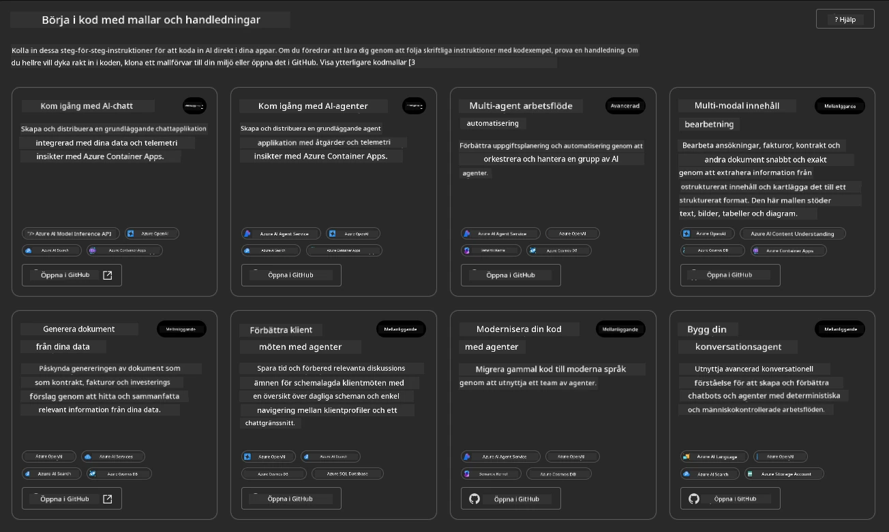


De **Basic** alternativen är dina startmallar:

1. [ ] [Get Started with AI Chat](https://github.com/Azure-Samples/get-started-with-ai-chat) som distribuerar en grundläggande chattapplikation _med dina data_ till Azure Container Apps. Använd denna för att utforska ett grundläggande AI-chattbot-scenario.
1. [X] [Get Started with AI Agents](https://github.com/Azure-Samples/get-started-with-ai-agents) som också distribuerar en standard AI Agent (med Foundry Agents). Använd denna för att bekanta dig med agentiska AI-lösningar som involverar verktyg och modeller.

Öppna den andra länken i en ny webbläsarflik (eller klicka på `Open in GitHub` för det relaterade kortet). Du bör se repot för denna AZD-mall. Ta en minut för att utforska README. Applikationsarkitekturen ser ut så här:

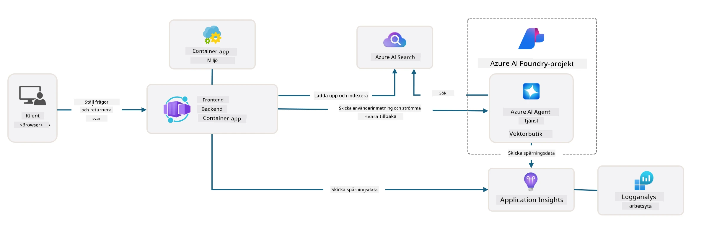

---

## 3. Template Activation

Låt oss försöka distribuera denna mall och se till att den är giltig. Vi följer riktlinjerna i avsnittet [Getting Started](https://github.com/Azure-Samples/get-started-with-ai-agents?tab=readme-ov-file#getting-started).

1. Klicka [denna länk](https://github.com/codespaces/new/Azure-Samples/get-started-with-ai-agents) - bekräfta standardåtgärden för att `Create codespace`
1. Detta öppnar en ny webbläsarflik - vänta på att GitHub Codespaces-sessionen färdigladdas
1. Öppna VS Code-terminalen i Codespaces - skriv följande kommando:

   ```bash title="" linenums="0"
   azd up
   ```

Slutför arbetsflödesstegen som detta kommer att trigga:

1. Du kommer att uppmanas att logga in på Azure - följ instruktionerna för att autentisera
1. Ange ett unikt miljönamn för dig - t.ex., jag använde `nitya-mshack-azd`
1. Detta kommer att skapa en `.azure/`-mapp - du kommer att se en undermapp med miljönamnet
1. Du kommer att uppmanas att välja ett prenumerationsnamn - välj standard
1. Du kommer att uppmanas om en plats - använd `East US 2`

Nu väntar du på att provisioneringen ska slutföras. **Detta tar 10–15 minuter**

1. När det är klart kommer din konsol att visa ett SUCCESS-meddelande som detta:
      ```bash title="" linenums="0"
      SUCCESS: Your up workflow to provision and deploy to Azure completed in 10 minutes 17 seconds.
      ```
1. Din Azure Portal kommer nu att ha en provisionerad resursgrupp med det miljönamnet:

      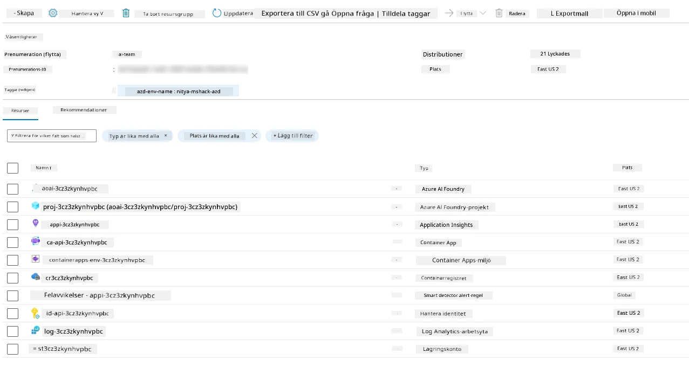

1. **Du är nu redo att validera den distribuerade infrastrukturen och applikationen**.

---

## 4. Template Validation

1. Besök Azure Portal [Resource Groups](https://portal.azure.com/#browse/resourcegroups) - logga in när du uppmanas
1. Klicka på RG för ditt miljönamn - du ser sidan ovan

      - klicka på Azure Container Apps-resursen
      - klicka på Application Url i avsnittet _Essentials_ (uppe till höger)

1. Du bör se ett hostat applikationsfrontend-UI som detta:

   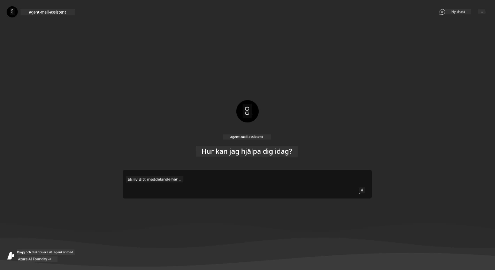

1. Försök att ställa ett par [exempelfrågor](https://github.com/Azure-Samples/get-started-with-ai-agents/blob/main/docs/sample_questions.md)

      1. Fråga: ```What is the capital of France?``` 
      1. Fråga: ```What's the best tent under $200 for two people, and what features does it include?```

1. Du bör få svar liknande det som visas nedan. _Men hur fungerar detta?_ 

      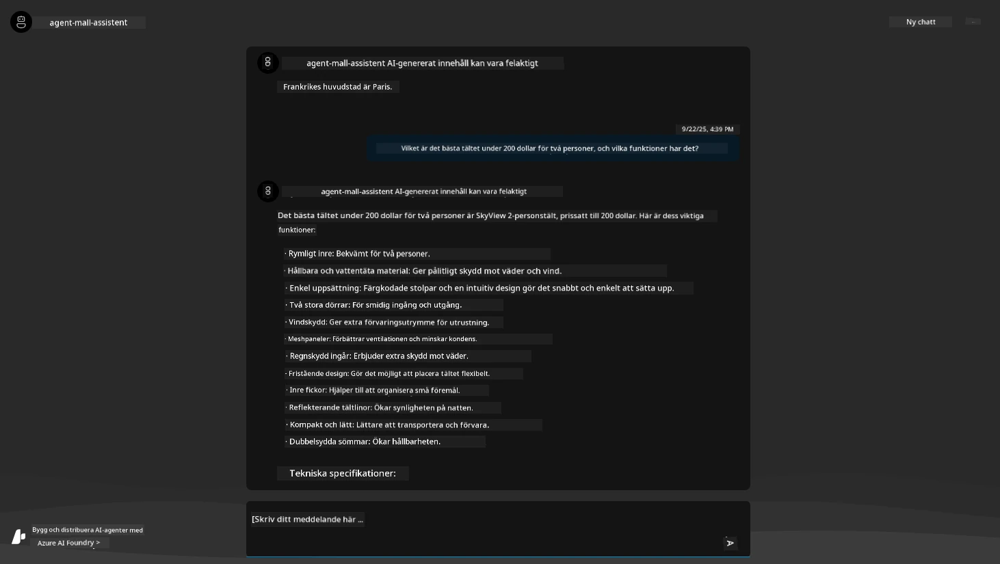

---

## 5.  Agent Validation

Azure Container App distribuerar en endpoint som ansluter till AI Agenten provisionerad i Microsoft Foundry-projektet för denna mall. Låt oss titta närmare på vad det innebär.

1. Återgå till Azure Portal _Overview_-sidan för din resursgrupp

1. Klicka på `Microsoft Foundry`-resursen i den listan

1. Du bör se detta. Klicka på knappen `Go to Microsoft Foundry Portal`. 
   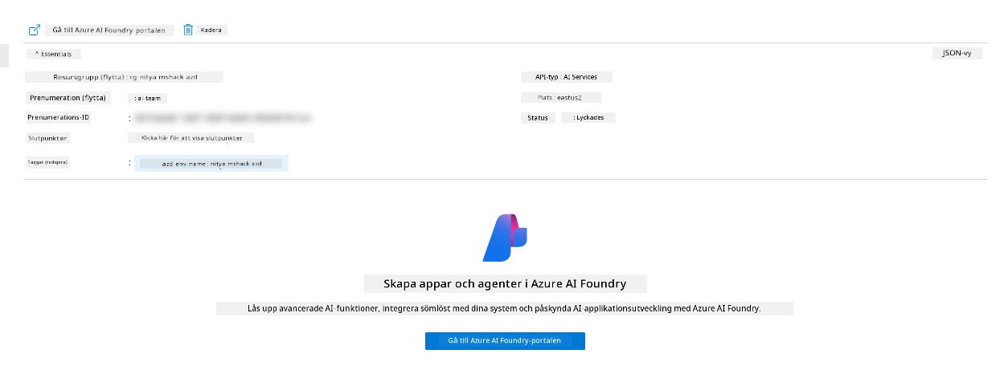

1. Du bör se Foundry-projektsidan för din AI-applikation
   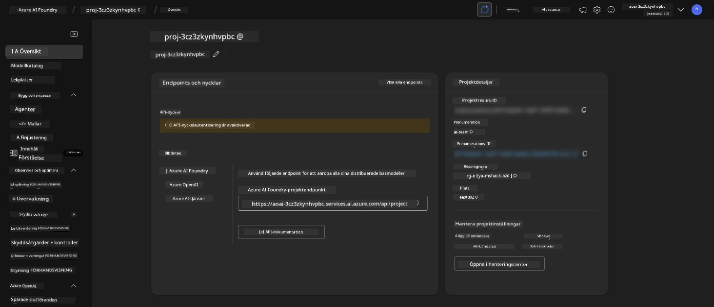

1. Klicka på `Agents` - du ser standardagenten provisionerad i ditt projekt
   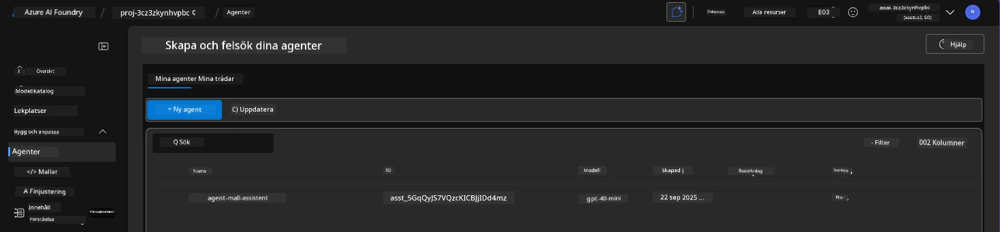

1. Välj den - och du ser Agent-detaljerna. Notera följande:

      - Agenten använder File Search som standard (alltid)
      - Agentens `Knowledge` indikerar att den har 32 filer uppladdade (för fil-sökning)
      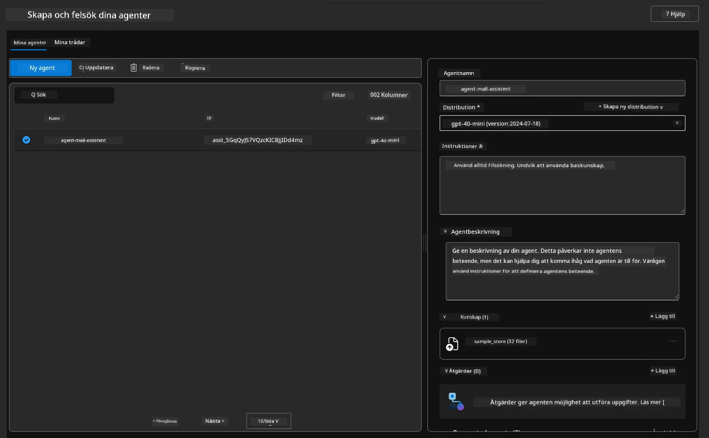

1. Leta efter alternativet `Data+indexes` i vänstermenyn och klicka för detaljer. 

      - Du bör se de 32 datafilerna uppladdade för knowledge.
      - Dessa motsvarar de 12 kundfilerna och 20 produktfilerna under `src/files` 
      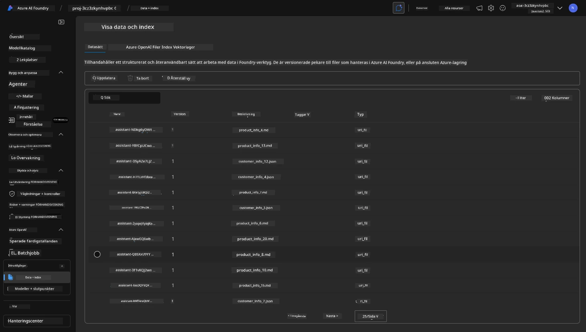

**Du validerade Agentens drift!** 

1. Agentens svar grundar sig i kunskapen i dessa filer. 
1. Du kan nu ställa frågor relaterade till dessa data och få grundade svar.
1. Exempel: `customer_info_10.json` beskriver de 3 köp som "Amanda Perez" gjort

Återgå till webbläsarfliken med Container App-endpointen och fråga: `What products does Amanda Perez own?`. Du bör se något liknande detta:

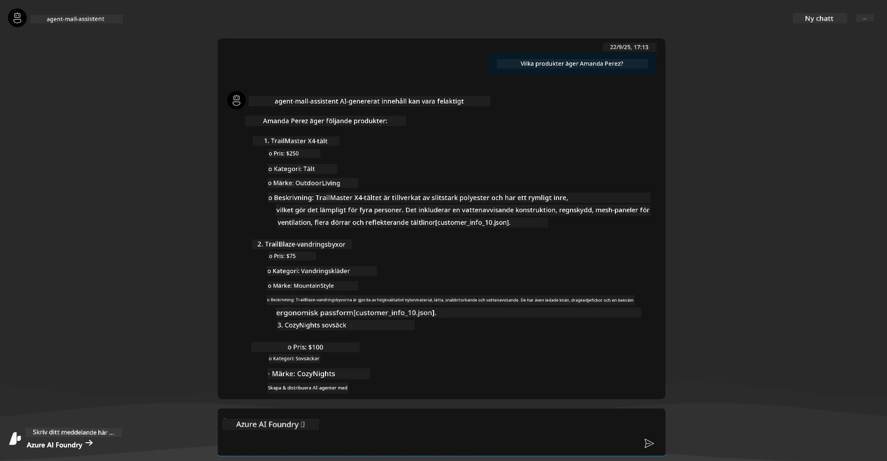

---

## 6. Agent Playground

Låt oss bygga lite mer intuition för Microsoft Foundrys kapabiliteter genom att testa agenten i Agents Playground. 

1. Återgå till sidan `Agents` i Microsoft Foundry - välj standardagenten
1. Klicka på alternativet `Try in Playground` - du bör få ett Playground-UI som detta
1. Ställ samma fråga: `What products does Amanda Perez own?`

    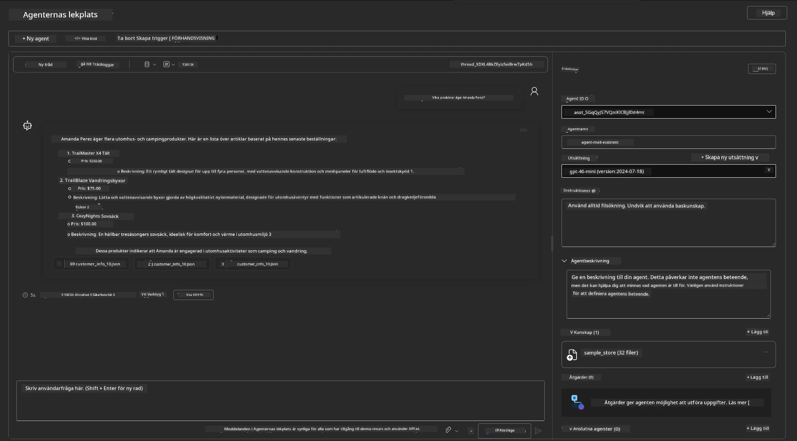

Du får samma (eller liknande) svar - men du får också ytterligare information som du kan använda för att förstå kvaliteten, kostnaden och prestandan för din agentiska app. Till exempel:

1. Notera att svaret citerar datafiler som användes för att "grunda" svaret
1. Hovra över någon av dessa filnamn - matchar datan din fråga och det visade svaret?

Du ser också en _stats_-rad nedanför svaret. 

1. Hovra över någon mätare - t.ex., Safety. Du ser något i stil med detta
1. Matchar den bedömda bedömningen din intuition för svarens säkerhetsnivå?

      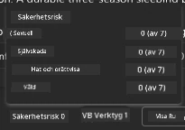

---

## 7. Built-in Observability

Observability handlar om att instrumentera din applikation för att generera data som kan användas för att förstå, felsöka och optimera dess drift. För att få en känsla för detta:

1. Klicka på knappen `View Run Info` - du bör se denna vy. Detta är ett exempel på [Agent tracing](https://learn.microsoft.com/en-us/azure/ai-foundry/how-to/develop/trace-agents-sdk#view-trace-results-in-the-azure-ai-foundry-agents-playground) i aktion. _Du kan också få denna vy genom att klicka på Thread Logs i toppnivå-menyn_.

   - Få en känsla för körstegen och verktyg som agenten använde
   - Förstå total Token-count (vs. output tokens usage) för svaret
   - Förstå latensen och var tiden spenderas i exekveringen

      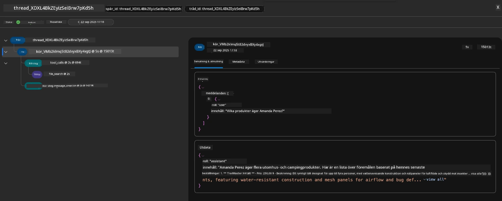

1. Klicka på fliken `Metadata` för att se ytterligare attribut för körningen som kan ge användbar kontext för felsökning senare.   

      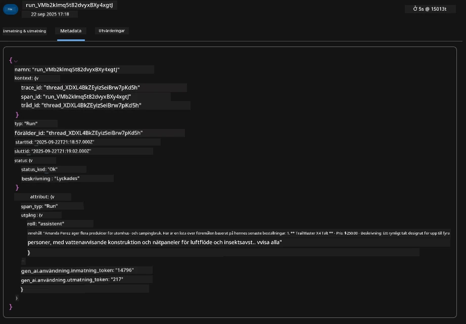


1. Klicka på fliken `Evaluations` för att se automatiska bedömningar gjorda på agentens svar. Dessa inkluderar säkerhetsbedömningar (t.ex., Self-harm) och agent-specifika bedömningar (t.ex., Intent resolution, Task adherence).

      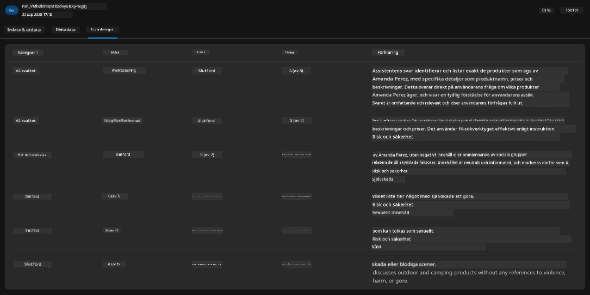

1. Sist men inte minst, klicka på fliken `Monitoring` i sidomenyn.

      - Välj fliken `Resource usage` på den visade sidan - och visa mätvärdena.
      - Spåra applikationsanvändning i termer av kostnader (tokens) och belastning (förfrågningar).
      - Spåra applikationens latens till första byte (inmatningsbearbetning) och sista byte (utdata).

      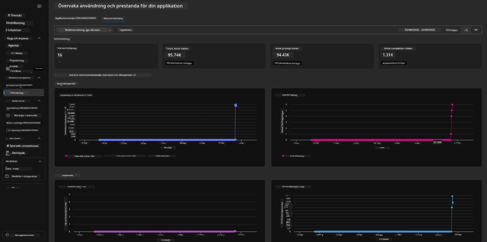

---

## 8. Environment Variables

Hittills har vi gått igenom distributionen i webbläsaren - och validerat att vår infrastruktur är provisionerad och att applikationen är operativ. Men för att arbeta med applikationen _kod-först_ behöver vi konfigurera vår lokala utvecklingsmiljö med relevanta variabler som krävs för att arbeta med dessa resurser. Att använda `azd` gör det enkelt.

1. Azure Developer CLI [uses environment variables](https://learn.microsoft.com/en-us/azure/developer/azure-developer-cli/manage-environment-variables?tabs=bash) för att lagra och hantera konfigurationsinställningar för applikationsdistributioner.

1. Miljövariabler lagras i `.azure/<env-name>/.env` - detta avgränsar dem till den `env-name`-miljö som användes under distributionen och hjälper dig att isolera miljöer mellan olika distributionmål i samma repo.

1. Miljövariabler laddas automatiskt av `azd`-kommandot varje gång det kör ett specifikt kommando (t.ex., `azd up`). Observera att `azd` inte automatiskt läser _OS-nivå_ miljövariabler (t.ex., satta i shell) - använd istället `azd set env` och `azd get env` för att överföra information inom skript.


Låt oss prova några kommandon:

1. Hämta alla miljövariabler som är satta för `azd` i denna miljö:

      ```bash title="" linenums="0"
      azd env get-values
      ```
      
      Du ser något i stil med:

      ```bash title="" linenums="0"
      AZURE_AI_AGENT_DEPLOYMENT_NAME="gpt-4.1-mini"
      AZURE_AI_AGENT_NAME="agent-template-assistant"
      AZURE_AI_EMBED_DEPLOYMENT_NAME="text-embedding-3-small"
      AZURE_AI_EMBED_DIMENSIONS=100
      ...
      ```

1. Hämta ett specifikt värde - t.ex., jag vill veta om vi satte värdet `AZURE_AI_AGENT_MODEL_NAME`

      ```bash title="" linenums="0"
      azd env get-value AZURE_AI_AGENT_MODEL_NAME 
      ```
      
      Du ser något i stil med detta - det var inte satt som standard!

      ```bash title="" linenums="0"
      ERROR: key 'AZURE_AI_AGENT_MODEL_NAME' not found in the environment values
      ```

1. Sätt en ny miljövariabel för `azd`. Här uppdaterar vi agentens modellnamn. _Observera: eventuella ändringar som görs kommer att återspeglas omedelbart i filen `.azure/<env-name>/.env`._

      ```bash title="" linenums="0"
      azd env set AZURE_AI_AGENT_MODEL_NAME gpt-4.1
      azd env set AZURE_AI_AGENT_MODEL_VERSION 2025-04-14
      azd env set AZURE_AI_AGENT_DEPLOYMENT_CAPACITY 150
      ```

      Nu bör vi hitta att värdet är satt:

      ```bash title="" linenums="0"
      azd env get-value AZURE_AI_AGENT_MODEL_NAME 
      ```

1. Observera att vissa resurser är persistenta (t.ex., modelldistributioner) och kommer att kräva mer än bara ett `azd up` för att tvinga omdistribution. Låt oss försöka riva ner den ursprungliga distributionen och distribuera om med ändrade miljövariabler.

1. **Refresh** Om du tidigare har distribuerat infrastruktur med en azd-mall - kan du _refresh_ tillståndet för dina lokala miljövariabler baserat på den aktuella statusen för din Azure-distribution med detta kommando:

      ```bash title="" linenums="0"
      azd env refresh
      ```

      Detta är ett kraftfullt sätt att _synkronisera_ miljövariabler över två eller flera lokala utvecklingsmiljöer (t.ex. team med flera utvecklare) - vilket gör att den distribuerade infrastrukturen kan fungera som den enda källan för miljövariablernas tillstånd. Teammedlemmar behöver bara _uppdatera_ variablerna för att komma i synk.

---

## 9. Grattis 🏆

Du har precis slutfört ett ända-till-ända-arbetsflöde där du:

- [X] Valde den AZD-mall du vill använda
- [X] Startade mallen med GitHub Codespaces 
- [X] Distribuerade mallen och bekräftade att den fungerar

---

<!-- CO-OP TRANSLATOR DISCLAIMER START -->
Ansvarsfriskrivning:
Detta dokument har översatts med AI-översättningstjänsten Co-op Translator (https://github.com/Azure/co-op-translator). Även om vi strävar efter noggrannhet bör du vara medveten om att automatiska översättningar kan innehålla fel eller brister. Originaldokumentet på dess ursprungliga språk ska betraktas som den auktoritativa källan. För kritisk information rekommenderas professionell, mänsklig översättning. Vi ansvarar inte för eventuella missförstånd eller feltolkningar som uppstår vid användning av denna översättning.
<!-- CO-OP TRANSLATOR DISCLAIMER END -->