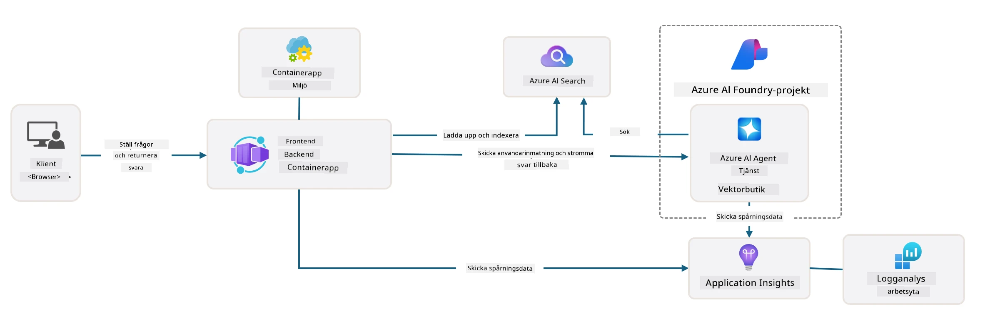

# 3. Dekonstruera en mall

!!! tip "I SLUTET AV DENNA MODUL KOMMER DU ATT KUNNA"

    - [ ] Aktivera GitHub Copilot med MCP-servrar för Azure-assistans
    - [ ] Förstå AZD-mallens mappstruktur och komponenter
    - [ ] Utforska mönster för infrastruktur-som-kod (Bicep)
    - [ ] **Lab 3:** Använd GitHub Copilot för att utforska och förstå repository-arkitekturen 

---


Med AZD-mallar och Azure Developer CLI (`azd`) kan vi snabbt påbörja vår AI‑utvecklingsresa med standardiserade repor som tillhandahåller exempelkod, infrastruktur och konfigurationsfiler - i form av ett färdigt att distribuera _starter_‑projekt.

**Men nu måste vi förstå projektstrukturen och kodbasen - och kunna anpassa AZD‑mallen - utan någon tidigare erfarenhet eller förståelse av AZD!**

---

## 1. Aktivera GitHub Copilot

### 1.1 Installera GitHub Copilot Chat

Det är dags att utforska [GitHub Copilot with Agent Mode](https://code.visualstudio.com/docs/copilot/chat/chat-agent-mode). Nu kan vi använda naturligt språk för att beskriva vår uppgift på en hög nivå och få hjälp med att utföra den. För denna labb kommer vi att använda [Copilot Free plan](https://github.com/github-copilot/signup) som har en månadsbegränsning för completion- och chattinteraktioner.

Tillägget kan installeras från marketplace, och det är ofta redan tillgängligt i Codespaces eller dev container‑miljöer. _Klicka `Open Chat` från Copilot‑ikonens rullgardin - och skriv en prompt som `What can you do?`_ - du kan bli ombedd att logga in. **GitHub Copilot Chat är redo**.

### 1.2. Installera MCP‑servrar

För att Agent‑läge ska vara effektivt behöver det åtkomst till rätt verktyg för att hjälpa det att hämta kunskap eller utföra åtgärder. Här kan MCP‑servrar hjälpa till. Vi kommer att konfigurera följande servrar:

1. [Azure MCP-server](../../../../../workshop/docs/instructions)
1. [Microsoft Docs MCP-server](../../../../../workshop/docs/instructions)

För att aktivera dessa:

1. Skapa en fil som heter `.vscode/mcp.json` om den inte finns
1. Kopiera följande till den filen - och starta servrarna!
   ```json title=".vscode/mcp.json"
   {
      "servers": {
         "Azure MCP Server": {
            "command": "npx",
            "args": [
            "-y",
            "@azure/mcp@latest",
            "server",
            "start"
            ]
         },
         "microsoft.docs.mcp": {
            "type": "http",
            "url": "https://learn.microsoft.com/api/mcp"
         }
      }
   }
   ```

??? warning "Du kan få ett fel att `npx` inte är installerat (klicka för att expandera för fix)"

      För att åtgärda detta, öppna `.devcontainer/devcontainer.json`-filen och lägg till denna rad i features‑sektionen. Bygg sedan om containern. Du bör nu ha `npx` installerat.

      ```title="" linenums="0"
         "features": {
            "ghcr.io/devcontainers/features/node:1": {},
            ...
         },
      ```

---

### 1.3. Testa GitHub Copilot Chat

**Använd först `azd auth login` för att autentisera mot Azure från VS Code‑kommandoraden. Använd även `az login` endast om du planerar att köra Azure CLI‑kommandon direkt.**

Du bör nu kunna fråga om din Azure‑prenumerationsstatus och ställa frågor om distribuerade resurser eller konfiguration. Prova dessa prompts:

1. `List my Azure resource groups`
1. `#foundry list my current deployments`

Du kan också ställa frågor om Azure‑dokumentation och få svar som är grundade i Microsoft Docs MCP‑servern. Prova dessa prompts:

1. `#microsoft_docs_search What is Azure Developer CLI?`
1. `#microsoft_docs_search Show me a Python tutorial to chat with deployed model`

Eller så kan du be om kodsnuttar för att slutföra en uppgift. Prova denna prompt.

1. `Give me a Python code example that uses AAD for an interactive chat client`

I `Ask`‑läge kommer detta att ge kod som du kan kopiera‑klistra in och prova. I `Agent`‑läge kan detta gå ett steg längre och skapa relevanta resurser åt dig - inklusive installationsskript och dokumentation - för att hjälpa dig utföra uppgiften.

**Du är nu rustad för att börja utforska mall‑repositoriet**

---

## 2. Dekonstruera arkitekturen

??? prompt "FRÅGA: Förklara applikationsarkitekturen i docs/images/architecture.png i 1 stycke"

      Den här applikationen är en AI‑driven chattapplikation byggd på Azure som demonstrerar en modern agentbaserad arkitektur. Lösningen kretsar kring en Azure Container App som hostar huvudapplikationskoden, som bearbetar användarinmatning och genererar intelligenta svar via en AI‑agent. 
      
      Arkitekturen utnyttjar Microsoft Foundry Project som grund för AI‑funktionalitet och ansluter till Azure AI‑tjänster som tillhandahåller underliggande språkmodeller (såsom gpt-4.1-mini) och agentfunktionalitet. Användarinteraktioner flödar genom ett React‑baserat frontend till ett FastAPI‑backend som kommunicerar med AI‑agenttjänsten för att generera kontextuella svar. 
      
      Systemet innehåller kunskapsåtervinningskapacitet genom antingen filsökning eller Azure AI Search‑tjänsten, vilket gör att agenten kan komma åt och citera information från uppladdade dokument. För operativ excellens inkluderar arkitekturen omfattande övervakning via Application Insights och Log Analytics Workspace för spårning, loggning och prestandaoptimering. 
      
      Azure Storage tillhandahåller bloblagring för applikationsdata och filuppladdningar, medan Managed Identity säkerställer säker åtkomst mellan Azure‑resurser utan att lagra referenser. Hela lösningen är utformad för skalbarhet och underhållbarhet, med den containeriserade applikationen som automatiskt skalar baserat på efterfrågan samtidigt som den erbjuder inbyggd säkerhet, övervakning och CI/CD‑kapabiliteter genom Azures hanterade tjänsteekosystem.



---

## 3. Repositorystruktur

!!! prompt "FRÅGA: Förklara mallens mappstruktur. Börja med ett visuellt hierarkiskt diagram."

??? info "SVAR: Visuellt hierarkiskt diagram"

      ```bash title="" 
      get-started-with-ai-agents/
      ├── 📋 Konfiguration & installation
      │   ├── azure.yaml                    # Azure Developer CLI-konfiguration
      │   ├── docker-compose.yaml           # Lokala utvecklingscontainrar
      │   ├── pyproject.toml                # Python‑projektkonfiguration
      │   ├── requirements-dev.txt          # Utvecklingsberoenden
      │   └── .devcontainer/                # VS Code devcontainer‑inställningar
      │
      ├── 🏗️ Infrastruktur (infra/)
      │   ├── main.bicep                    # Huvudmall för infrastruktur
      │   ├── api.bicep                     # API‑specifika resurser
      │   ├── main.parameters.json          # Infrastrukturparametrar
      │   └── core/                         # Modulära infrastrukturkomponenter
      │       ├── ai/                       # AI‑tjänstkonfigurationer
      │       ├── host/                     # Hostinginfrastruktur
      │       ├── monitor/                  # Övervakning och loggning
      │       ├── search/                   # Azure AI Search‑installation
      │       ├── security/                 # Säkerhet och identitet
      │       └── storage/                  # Lagringskontokonfigurationer
      │
      ├── 💻 Applikationskällkod (src/)
      │   ├── api/                          # Backend‑API
      │   │   ├── main.py                   # FastAPI‑applikationens ingångspunkt
      │   │   ├── routes.py                 # API‑routedefinitioner
      │   │   ├── search_index_manager.py   # Sökfunktionalitet
      │   │   ├── data/                     # API‑datahantering
      │   │   ├── static/                   # Statiska webbresurser
      │   │   └── templates/                # HTML‑mallar
      │   ├── frontend/                     # React/TypeScript‑frontend
      │   │   ├── package.json              # Node.js‑beroenden
      │   │   ├── vite.config.ts            # Vite‑byggkonfiguration
      │   │   └── src/                      # Frontend‑källkod
      │   ├── data/                         # Exempelfiler
      │   │   └── embeddings.csv            # Förberäknade embeddings
      │   ├── files/                        # Kunskapsbasfiler
      │   │   ├── customer_info_*.json      # Exempel på kunddata
      │   │   └── product_info_*.md         # Produktdokumentation
      │   ├── Dockerfile                    # Containerkonfiguration
      │   └── requirements.txt              # Python‑beroenden
      │
      ├── 🔧 Automatisering & skript (scripts/)
      │   ├── postdeploy.sh/.ps1           # Efter‑distributionsinställningar
      │   ├── setup_credential.sh/.ps1     # Konfigurering av autentiseringsuppgifter
      │   ├── validate_env_vars.sh/.ps1    # Miljövalidering
      │   └── resolve_model_quota.sh/.ps1  # Modellkvothantering
      │
      ├── 🧪 Testning & utvärdering
      │   ├── tests/                        # Enhets‑ och integrationstester
      │   │   └── test_search_index_manager.py
      │   ├── evals/                        # Agentutvärderingsramverk
      │   │   ├── evaluate.py               # Körning av utvärdering
      │   │   ├── eval-queries.json         # Testfrågor
      │   │   └── eval-action-data-path.json
      │   ├── sandbox/                      # Utvecklingslekplats
      │   │   ├── 1-quickstart.py           # Kom igång‑exempel
      │   │   └── aad-interactive-chat.py   # Autentiseringsexempel
      │   └── airedteaming/                 # AI‑säkerhetsutvärdering
      │       └── ai_redteaming.py          # Red team‑testning
      │
      ├── 📚 Dokumentation (docs/)
      │   ├── deployment.md                 # Distributionsguide
      │   ├── local_development.md          # Instruktioner för lokal uppsättning
      │   ├── troubleshooting.md            # Vanliga problem & lösningar
      │   ├── azure_account_setup.md        # Förutsättningar för Azure
      │   └── images/                       # Dokumentationsresurser
      │
      └── 📄 Projektmetadata
         ├── README.md                     # Projektöversikt
         ├── CODE_OF_CONDUCT.md           # Riktlinjer för communityn
         ├── CONTRIBUTING.md              # Bidragsguide
         ├── LICENSE                      # Licensvillkor
         └── next-steps.md                # Vägledning efter distribution
      ```

### 3.1. Kärnappens arkitektur

Denna mall följer ett **full‑stack webbaserat applikationsmönster** med:

- **Backend**: Python FastAPI med Azure AI‑integration
- **Frontend**: TypeScript/React med Vite‑byggsystem
- **Infrastruktur**: Azure Bicep‑mallar för molnresurser
- **Containerisering**: Docker för konsekvent distribution

### 3.2 Infrastruktur som kod (Bicep)

Infrastruktur‑lagret använder **Azure Bicep**‑mallar organiserade modulärt:

   - **`main.bicep`**: Orkestrerar alla Azure‑resurser
   - **`core/` modules**: Återanvändbara komponenter för olika tjänster
      - AI‑tjänster (Microsoft Foundry‑modeller, AI Search)
      - Containerhosting (Azure Container Apps)
      - Övervakning (Application Insights, Log Analytics)
      - Säkerhet (Key Vault, Managed Identity)

### 3.3 Applikationskällkod (`src/`)

**Backend API (`src/api/`)**:

- REST‑API baserat på FastAPI
- Foundry Agents‑integration
- Sökindexhantering för kunskapsåtervinning
- Funktioner för filuppladdning och bearbetning

**Frontend (`src/frontend/`)**:

- Modern React/TypeScript‑SPA
- Vite för snabb utveckling och optimerade byggen
- Chattgränssnitt för agentinteraktioner

**Kunskapsbas (`src/files/`)**:

- Exempeldata för kunder och produkter
- Demonstrerar filbaserad kunskapsåtervinning
- Exempel i JSON‑ och Markdown‑format


### 3.4 DevOps & automatisering

**Skript (`scripts/`)**:

- Plattformsoberoende PowerShell‑ och Bash‑skript
- Miljövalidering och uppsättning
- Efter‑distributionskonfiguration
- Hantering av modellkvoter

**Azure Developer CLI‑integration**:

- `azure.yaml`‑konfiguration för `azd`‑arbetsflöden
- Automatiserad provisioning och distribution
- Hantering av miljövariabler

### 3.5 Testning & kvalitetssäkring

**Utvärderingsramverk (`evals/`)**:

- Utvärdering av agents prestanda
- Kvalitetstestning av fråga‑svar
- Automatiserad bedömningspipeline

**AI‑säkerhet (`airedteaming/`)**:

- Red team‑testning för AI‑säkerhet
- Skanning efter säkerhetsbrister
- Ansvarsfulla AI‑praxis

---

## 4. Grattis 🏆

Du har framgångsrikt använt GitHub Copilot Chat med MCP‑servrar för att utforska repositoryt.

- [X] Aktiverat GitHub Copilot för Azure
- [X] Förstått applikationsarkitekturen
- [X] Utforskat AZD‑mallens struktur

Detta ger dig en känsla för _infrastruktur som kod_-resurserna för denna mall. Nästa steg är att titta på konfigurationsfilen för AZD.

---

<!-- CO-OP TRANSLATOR DISCLAIMER START -->
**Ansvarsfriskrivning**:
Detta dokument har översatts med hjälp av AI-översättningstjänsten [Co-op Translator](https://github.com/Azure/co-op-translator). Även om vi strävar efter noggrannhet bör du vara medveten om att automatiska översättningar kan innehålla fel eller brister. Det ursprungliga dokumentet på dess originalspråk bör anses vara den auktoritativa källan. För kritisk information rekommenderas en professionell mänsklig översättning. Vi ansvarar inte för några missförstånd eller feltolkningar som uppstår till följd av användningen av denna översättning.
<!-- CO-OP TRANSLATOR DISCLAIMER END -->