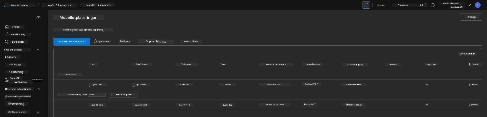
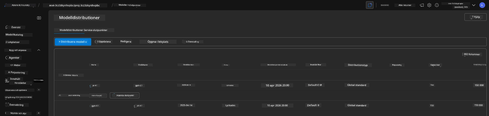

<!--
CO_OP_TRANSLATOR_METADATA:
{
  "original_hash": "6539a34c770f3ceff282370d72ee74dc",
  "translation_date": "2025-09-24T21:30:50+00:00",
  "source_file": "workshop/docs/instructions/6-Teardown-Infrastructure.md",
  "language_code": "sv"
}
-->
# 6. Avveckla Infrastruktur

!!! tip "VID SLUTET AV DETTA AVSNITT KOMMER DU ATT KUNNA"

    - [ ] Punkt
    - [ ] Punkt
    - [ ] Punkt

---

## Bonusövningar

Innan vi avvecklar projektet, ta några minuter för att utforska fritt.

!!! danger "NITYA-TODO: Skapa några förslag att prova"

---

## Avveckla Infrastruktur

1. Att avveckla infrastrukturen är så enkelt som:
      
      ```bash title="" linenums="0"
      azd down --purge
      ```
1. Flaggan `--purge` säkerställer att även mjukraderade Cognitive Service-resurser tas bort, vilket frigör kvoter som hålls av dessa resurser. När processen är klar kommer du att se något liknande detta:
      
      ```bash title="" linenums="0"
      ? Total resources to delete: 11, are you sure you want to continue? Yes
      Deleting your resources can take some time.
      (✓) Done: Deleted resource group rg-nitya-mshack-azd
      (✓) Done: Purging Cognitive Account: aoai-3cz3zkynhvpbc

      SUCCESS: Your application was removed from Azure in 11 minutes 4 seconds.
      ```

1. (Valfritt) Om du nu kör `azd up` igen, kommer du att märka att gpt-4.1-modellen distribueras eftersom miljövariabeln ändrades (och sparades) i den lokala `.azure`-mappen. 

      Här är modellens distributioner **före**:

      

      Och här är den **efter**:
      

---

