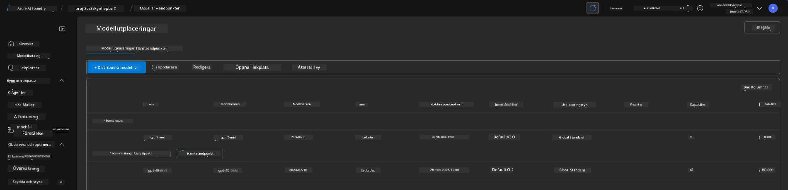
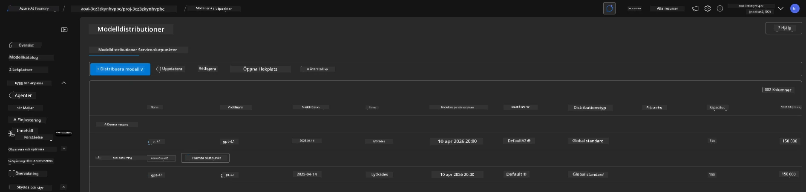

# 6. Avveckla infrastruktur

!!! tip "I slutet av den här modulen kommer du att kunna"

    - [ ] Förstå vikten av resursstädning och kostnadshantering
    - [ ] Använda `azd down` för att avveckla infrastrukturen säkert
    - [ ] Återställa mjukraderade kognitiva tjänster vid behov
    - [ ] **Lab 6:** Rensa Azure-resurser och verifiera borttagning

---

## Bonusövningar

Innan vi tar ner projektet, ta några minuter för att utforska fritt.

!!! info "Prova dessa utforskningsfrågor"

    **Experimentera med GitHub Copilot:**
    
    1. Fråga: `Vilka andra AZD-mallar kan jag prova för fleragent-scenarier?`
    2. Fråga: `Hur kan jag anpassa agentinstruktionerna för ett sjukvårdsfall?`
    3. Fråga: `Vilka miljövariabler styr kostnadsoptimering?`
    
    **Utforska Azure-portalen:**
    
    1. Granska Application Insights-metriker för din distribution
    2. Kontrollera kostnadsanalysen för de resurser som provisionerats
    3. Utforska Microsoft Foundry-portalen agentlekplatsen en gång till

---

## Avveckla infrastruktur

1. Att avveckla infrastrukturen är lika enkelt som:
      
      ```bash title="" linenums="0"
      azd down --purge
      ```
1. Flaggan `--purge` säkerställer att den också rensar mjukraderade kognitiva tjänster, vilket frigör kvoter som innehas av dessa resurser. När det är klart kommer du att se något liknande detta:
      
      ```bash title="" linenums="0"
      ? Total resources to delete: 11, are you sure you want to continue? Yes
      Deleting your resources can take some time.
      (✓) Done: Deleted resource group rg-nitya-mshack-azd
      (✓) Done: Purging Cognitive Account: aoai-3cz3zkynhvpbc

      SUCCESS: Your application was removed from Azure in 11 minutes 4 seconds.
      ```

1. (Valfritt) Om du nu kör `azd up` igen kommer du att märka att modellen gpt-4.1 distribueras eftersom miljövariabeln ändrades (och sparades) i den lokala `.azure`-mappen. 

      Här är modelldistributionerna **före**:

      

      Och här är den **efter**:
      

---

<!-- CO-OP TRANSLATOR DISCLAIMER START -->
**Friskrivning**:
Detta dokument har översatts med hjälp av AI-översättningstjänsten [Co-op Translator](https://github.com/Azure/co-op-translator). Även om vi strävar efter noggrannhet bör du vara medveten om att automatiska översättningar kan innehålla fel eller felaktigheter. Det ursprungliga dokumentet på dess ursprungsspråk bör anses vara den auktoritativa källan. För kritisk information rekommenderas en professionell mänsklig översättning. Vi ansvarar inte för några missförstånd eller feltolkningar som uppstår genom användningen av denna översättning.
<!-- CO-OP TRANSLATOR DISCLAIMER END -->