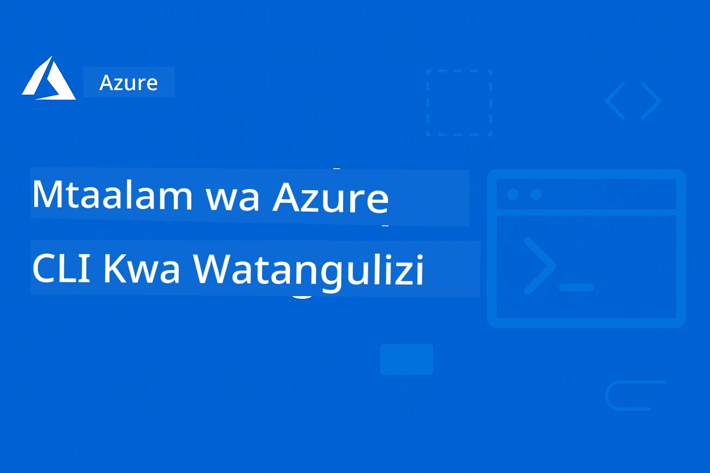

# AZD Kwa Waanzaji: Safari ya Kujifunza Iliyopangwa

 

[](https://GitHub.com/microsoft/azd-for-beginners/watchers/)
[](https://GitHub.com/microsoft/azd-for-beginners/network/)
[](https://GitHub.com/microsoft/azd-for-beginners/stargazers/)

[](https://discord.gg/microsoft-azure)
[](https://discord.gg/nTYy5BXMWG)

## Kuanzia na Kozi Hii

Fuata hatua hizi kuanza safari yako ya kujifunza AZD:

1. **Funika Hifadhi (Fork the Repository)**: Bonyeza [](https://GitHub.com/microsoft/azd-for-beginners/fork)
2. **Nakili Hifadhi (Clone the Repository)**: `git clone https://github.com/microsoft/azd-for-beginners.git`
3. **Jiunge na Jamii**: [Jamii za Azure Discord](https://discord.com/invite/ByRwuEEgH4) kwa msaada wa wataalamu
4. **Chagua Njia Yako ya Kujifunza**: Chagua sura hapa chini inayolingana na kiwango chako cha uzoefu

### Usaidizi wa Lugha Nyingi

#### Tafsiri Zinazofanywa Kifautomata (Daima Zikiwa za Kisasa)

<!-- CO-OP TRANSLATOR LANGUAGES TABLE START -->
[Arabic](../ar/README.md) | [Bengali](../bn/README.md) | [Bulgarian](../bg/README.md) | [Burmese (Myanmar)](../my/README.md) | [Chinese (Simplified)](../zh-CN/README.md) | [Chinese (Traditional, Hong Kong)](../zh-HK/README.md) | [Chinese (Traditional, Macau)](../zh-MO/README.md) | [Chinese (Traditional, Taiwan)](../zh-TW/README.md) | [Croatian](../hr/README.md) | [Czech](../cs/README.md) | [Danish](../da/README.md) | [Dutch](../nl/README.md) | [Estonian](../et/README.md) | [Finnish](../fi/README.md) | [French](../fr/README.md) | [German](../de/README.md) | [Greek](../el/README.md) | [Hebrew](../he/README.md) | [Hindi](../hi/README.md) | [Hungarian](../hu/README.md) | [Indonesian](../id/README.md) | [Italian](../it/README.md) | [Japanese](../ja/README.md) | [Kannada](../kn/README.md) | [Korean](../ko/README.md) | [Lithuanian](../lt/README.md) | [Malay](../ms/README.md) | [Malayalam](../ml/README.md) | [Marathi](../mr/README.md) | [Nepali](../ne/README.md) | [Nigerian Pidgin](../pcm/README.md) | [Norwegian](../no/README.md) | [Persian (Farsi)](../fa/README.md) | [Polish](../pl/README.md) | [Portuguese (Brazil)](../pt-BR/README.md) | [Portuguese (Portugal)](../pt-PT/README.md) | [Punjabi (Gurmukhi)](../pa/README.md) | [Romanian](../ro/README.md) | [Russian](../ru/README.md) | [Serbian (Cyrillic)](../sr/README.md) | [Slovak](../sk/README.md) | [Slovenian](../sl/README.md) | [Spanish](../es/README.md) | [Swahili](./README.md) | [Swedish](../sv/README.md) | [Tagalog (Filipino)](../tl/README.md) | [Tamil](../ta/README.md) | [Telugu](../te/README.md) | [Thai](../th/README.md) | [Turkish](../tr/README.md) | [Ukrainian](../uk/README.md) | [Urdu](../ur/README.md) | [Vietnamese](../vi/README.md)

> **Unapendelea Kufanya Nakala Mitaa?**

> Hifadhi hii ina zaidi ya tafsiri 50 za lugha ambazo huongeza sana ukubwa wa kupakua. Ili kunakili bila tafsiri, tumia sparse checkout:
> ```bash
> git clone --filter=blob:none --sparse https://github.com/microsoft/AZD-for-beginners.git
> cd AZD-for-beginners
> git sparse-checkout set --no-cone '/*' '!translations' '!translated_images'
> ```
> Hii inakupa kila kitu unachohitaji kumaliza kozi kwa kupakua haraka zaidi.
<!-- CO-OP TRANSLATOR LANGUAGES TABLE END -->

## Muhtasari wa Kozi

Jifunze Utangazaji wa Azure Developer CLI (azd) kupitia sura zilizo pangwa kwa kujifunza hatua kwa hatua. **Mwelekeo maalum juu ya usambazaji wa programu za AI kwa ushirikiano wa Microsoft Foundry.**

### Kwa Nini Kozi Hii ni Muhimu kwa Waendelezaji wa Kisasa

Kulingana na maarifa ya jamii ya Microsoft Foundry Discord, **45% ya waendelezaji wanataka kutumia AZD kwa mzigo wa AI** lakini wanakutana na changamoto za:
- Miundo tata ya huduma nyingi za AI
- Mbinu bora za usambazaji wa AI uzalishaji  
- Uunganishaji na usanidi wa huduma za Azure AI
- Uboreshaji wa gharama kwa mizigo ya AI
- Kutatua matatizo maalum ya usambazaji wa AI

### Malengo ya Kujifunza

Kupitia kukamilisha kozi hii iliyopangwa, utaweza:
- **Kuwa Mtaalamu wa Misingi ya AZD**: Dhana kuu, usakinishaji, na usanidi
- **Sambaza Programu za AI**: Tumia AZD na huduma za Microsoft Foundry
- **Tekeleza Miundombinu kama Msimbo (IaC)**: Dhibiti rasilimali za Azure kwa kutumia templeti za Bicep
- **Tatua Matatizo ya Usambazaji**: Rekebisha matatizo ya kawaida na futa mdudu
- **Boresha kwa Uzalishaji**: Usalama, upanuzi, ufuatiliaji, na usimamizi wa gharama
- **Jenga Suluhisho za Mawakala Wengi**: Sambaza miundo tata ya AI

## 📚 Sura za Kujifunza

*Chagua njia yako ya kujifunza kulingana na kiwango cha uzoefu na malengo*

### 🚀 Sura 1: Msingi & Kuanzia Haraka
**Masharti ya awali**: Usajili wa Azure, ujuzi wa msingi wa mstari wa amri  
**Muda**: Dakika 30-45  
**Uchangamfu**: ⭐

#### Unachojifunza
- Kuelewa misingi ya Azure Developer CLI
- Kusakinisha AZD kwenye jukwaa lako
- Usambazaji wako wa kwanza uliopata mafanikio

#### Vyanzo vya Kujifunza
- **🎯 Anza Hapa**: [Azure Developer CLI ni Nini?](../..)
- **📖 Nadharia**: [Misingi ya AZD](docs/getting-started/azd-basics.md) - Dhana na istilahi kuu
- **⚙️ Usanidi**: [Usakinishaji & Usanidi](docs/getting-started/installation.md) - Miongozo ya majukwaa
- **🛠️ Vitendo**: [Mradi Wako wa Kwanza](docs/getting-started/first-project.md) - Mafunzo ya hatua kwa hatua
- **📋 Marejeleo ya Haraka**: [Jadwali la Amri](resources/cheat-sheet.md)

#### Mazoezi ya Vitendo
```bash
# Ukaguzi wa haraka wa usakinishaji
azd version

# Weka programu yako ya kwanza
azd init --template todo-nodejs-mongo
azd up
```

**💡 Matokeo ya Sura**: Sambaza programu rahisi ya wavuti kwa Azure ukitumia AZD kwa mafanikio

**✅ Uthibitishaji wa Mafanikio:**
```bash
# Baada ya kukamilisha Sura ya 1, unapaswa kuwa na uwezo wa:
azd version              # Inaonyesha toleo lililowekwa
azd init --template todo-nodejs-mongo  # Huanzisha mradi
azd up                  # Inaweka kwenye Azure
azd show                # Inaonyesha URL ya programu inayotumika
# Programu inafunguka katika kivinjari na inafanya kazi
azd down --force --purge  # Inasafisha rasilimali
```

**📊 Mkakati wa Muda:** Dakika 30-45  
**📈 Kiwango cha Ujuzi Baada ya Hii:** Unaweza kusambaza programu za msingi kwa kujitegemea

**✅ Uthibitishaji wa Mafanikio:**
```bash
# Baada ya kumaliza Sura ya 1, unapaswa kuwa na uwezo wa:
azd version              # Inaonyesha toleo lililosakinishwa
azd init --template todo-nodejs-mongo  # Inaanzisha mradi
azd up                  # Inaeneza kwenye Azure
azd show                # Inaonyesha URL ya programu inayotumika
# Programu inafunguka kwenye kivinjari na inafanya kazi
azd down --force --purge  # Inasafisha rasilimali
```

**📊 Mkakati wa Muda:** Dakika 30-45  
**📈 Kiwango cha Ujuzi Baada ya Hii:** Unaweza kusambaza programu za msingi kwa kujitegemea

---

### 🤖 Sura 2: Maendeleo ya AI Kwanza (Inapendekezwa kwa Waendelezaji wa AI)
**Masharti ya awali**: Sura 1 imekamilika  
**Muda**: Saa 1-2  
**Uchangamfu**: ⭐⭐

#### Unachojifunza
- Ushirikiano wa Microsoft Foundry na AZD
- Usambazaji wa programu zinazotumia AI
- Kuelewa usanidi wa huduma za AI

#### Vyanzo vya Kujifunza
- **🎯 Anza Hapa**: [Ushirikiano wa Microsoft Foundry](docs/microsoft-foundry/microsoft-foundry-integration.md)
- **📖 Mifumo**: [Usambazaji wa Mfano wa AI](docs/microsoft-foundry/ai-model-deployment.md) - Sambaza na simamia modeli za AI
- **🛠️ Warsha**: [Maabara ya Warsha ya AI](docs/microsoft-foundry/ai-workshop-lab.md) - Fanya suluhisho zako za AI ziwe tayari kwa AZD
- **🎥 Mwongozo wa Kiingiliano**: [Vifaa vya Warsha](workshop/README.md) - Kujifunza kupitia kivinjari na mazingira ya MkDocs * DevContainer
- **📋 Templeti**: [Templeti za Microsoft Foundry](../..)
- **📝 Mifano**: [Mifano ya Usambazaji wa AZD](examples/README.md)

#### Mazoezi ya Vitendo
```bash
# Weka programu yako ya kwanza ya AI
azd init --template azure-search-openai-demo
azd up

# Jaribu mifano ya ziada ya AI
azd init --template openai-chat-app-quickstart
azd init --template agent-openai-python-prompty
```

**💡 Matokeo ya Sura**: Sambaza na usanidi programu ya mazungumzo inayoendeshwa na AI yenye uwezo wa RAG

**✅ Uthibitishaji wa Mafanikio:**
```bash
# Baada ya Sura ya 2, unapaswa kuwa na uwezo wa:
azd init --template azure-search-openai-demo
azd up
# Jaribu kiolesura cha mazungumzo cha AI
# Uliza maswali na upate majibu yanayotolewa na AI yenye vyanzo
# Thibitisha kuwa muunganisho wa utafutaji unafanya kazi
azd monitor  # Angalia Application Insights inaonyesha telemetry
azd down --force --purge
```

**📊 Mkakati wa Muda:** Saa 1-2  
**📈 Kiwango cha Ujuzi Baada ya Hii:** Unaweza kusambaza na kusanidi programu za AI zinazostahili uzalishaji  
**💰 Uelewa wa Gharama:** Fahamu gharama za maendeleo $80-150/mwezi, gharama za uzalishaji $300-3500/mwezi

#### 💰 Mambo ya Kuzingatia Gharama kwa Usambazaji wa AI

**Mazingira ya Maendeleo (Makadirio $80-150/mwezi):**
- Azure OpenAI (Malipo kwa matumizi): $0-50/mwezi (kulingana na matumizi ya tokeni)
- AI Search (Tier ya Msingi): $75/mwezi
- Container Apps (Matumizi): $0-20/mwezi
- Hifadhi (Kawaida): $1-5/mwezi

**Mazingira ya Uzalishaji (Makadirio $300-3,500+/mwezi):**
- Azure OpenAI (PTU kwa utendaji thabiti): $3,000+/mwezi AU Malipo kwa matumizi ya wingi mkubwa
- AI Search (Tier ya Kawaida): $250/mwezi
- Container Apps (Kuwekwa Maalum): $50-100/mwezi
- Application Insights: $5-50/mwezi
- Hifadhi (Premium): $10-50/mwezi

**💡 Vidokezo vya Kuondoa Gharama:**
- Tumia **Tier ya Bure** ya Azure OpenAI kwa kujifunza (tokeni 50,000 kwa mwezi ni pamoja)
- Endesha `azd down` kuondoa rasilimali unapokosa kuendeleza kwa sasa
- Anza na uenezaji wa malipo kulingana na matumizi, boresha hadi PTU tu kwa uzalishaji
- Tumia `azd provision --preview` kukadiria gharama kabla ya usambazaji
- Washa kuongezeka kiotomati: lipa tu kwa matumizi halisi

**Ufuatiliaji wa Gharama:**
```bash
# Angalia makisio ya gharama za kila mwezi
azd provision --preview

# Fuatilia gharama halisi katika Azure Portal
az consumption budget list --resource-group <your-rg>
```

---

### ⚙️ Sura 3: Usanidi na Uthibitishaji
**Masharti ya awali**: Sura 1 imekamilika  
**Muda**: Dakika 45-60  
**Uchangamfu**: ⭐⭐

#### Unachojifunza
- Usanidi na usimamizi wa mazingira
- Mbinu bora za uthibitishaji na usalama
- Jina na upangaji wa rasilimali

#### Vyanzo vya Kujifunza
- **📖 Usanidi**: [Mwongozo wa Usanidi](docs/getting-started/configuration.md) - Usanidi wa mazingira
- **🔐 Usalama**: [Mifumo ya Uthibitishaji na Usimamizi wa Utambulisho](docs/getting-started/authsecurity.md) - Mifano ya uthibitishaji
- **📝 Mifano**: [Mfano wa Programu ya Database](examples/database-app/README.md) - Mifano ya Database ya AZD

#### Mazoezi ya Vitendo
- Sanidi mazingira mengi (dev, staging, prod)
- Weka uthibitishaji wa utambuzi ulioasimiliwa
- Tekeleza usanidi maalum kwa mazingira

**💡 Matokeo ya Sura**: Dhibiti mazingira mengi ukiwa na uthibitishaji na usalama sahihi

---

### 🏗️ Sura 4: Miundombinu kama Msimbo & Usambazaji
**Masharti ya awali**: Sura 1-3 zimekamilika  
**Muda**: Saa 1-1.5  
**Uchangamfu**: ⭐⭐⭐

#### Unachojifunza
- Mifumo ya usambazaji ya hali ya juu
- Miundombinu kama Msimbo kwa Bicep
- Mikakati ya upangaji wa rasilimali

#### Vyanzo vya Kujifunza
- **📖 Usambazaji**: [Mwongozo wa Usambazaji](docs/deployment/deployment-guide.md) - Mchakato kamili
- **🏗️ Upangaji**: [Upangaji wa Rasilimali](docs/deployment/provisioning.md) - Usimamizi wa rasilimali za Azure
- **📝 Mifano**: [Mfano wa Container App](../../examples/container-app) - Usambazaji wa vyombo

#### Mazoezi ya Vitendo
- Tunga templeti za Bicep za kipekee
- Sambaza programu za huduma nyingi
- Tekeleza mikakati ya usambazaji wa blue-green

**💡 Matokeo ya Sura**: Sambaza programu tata za huduma nyingi kwa kutumia templeti za miundombinu za kipekee

---

### 🎯 Sura 5: Suluhisho za AI za Mawakala Wengi (Ngumu)
**Masharti ya awali**: Sura 1-2 zimekamilika  
**Muda**: Saa 2-3  
**Uchangamfu**: ⭐⭐⭐⭐
#### Utakachojifunza
- Mifumo ya usanifu wa mawakala wengi
- Uratibu na usimamizi wa mawakala
- Uwekaji wa AI tayari kwa uzalishaji

#### Rasilimali za Kujifunza
- **🤖 Mradi Uliyoangaziwa**: [Suluhisho la Wakala Wengi kwa Rejareja](examples/retail-scenario.md) - Utekelezaji kamili
- **🛠️ Violezo vya ARM**: [Pakiti ya Kiambatisho cha ARM](../../examples/retail-multiagent-arm-template) - Uwekaji kwa bonyeza moja
- **📖 Usanifu**: [Mifumo ya Uratibu wa Wakala Wengi](/docs/pre-deployment/coordination-patterns.md) - Mifumo

#### Mazoezi ya Kivitendo
```bash
# Tengeneza suluhisho kamili la mawakala wengi wa rejareja
cd examples/retail-multiagent-arm-template
./deploy.sh

# Chunguza muundo wa mawakala
az deployment group show --resource-group <rg-name> --name <deployment-name>
```

**💡 Matokeo ya Sura**: Weka na enda sambamba na suluhisho la AI la mawakala wengi tayari kwa uzalishaji likiwa na mawakala wa Mteja na Hesabu

---

### 🔍 Sura ya 6: Uhakiki na Mipango Kabla ya Utekelezaji
**Mahitaji**: Sura 4 imekamilika  
**Muda**: Saa 1  
**Ugumu**: ⭐⭐

#### Utakachojifunza
- Upangaji uwezo na uhakiki wa rasilimali
- Mikakati ya kuchagua SKU
- Ukaguzi wa awali na uendeshaji wa moja kwa moja

#### Rasilimali za Kujifunza
- **📊 Upangaji**: [Upangaji wa Uwezo](docs/pre-deployment/capacity-planning.md) - Uhakiki wa rasilimali
- **💰 Uchaguzi**: [Uchaguzi wa SKU](docs/pre-deployment/sku-selection.md) - Chaguo la bei nafuu
- **✅ Uhakiki**: [Ukaguzi wa Awali](docs/pre-deployment/preflight-checks.md) - Skiripti za moja kwa moja

#### Mazoezi ya Kivitendo
- Endesha skiripti za uhakiki wa uwezo
- Boresha chaguzi za SKU kwa gharama
- Tekeleza ukaguzi wa awali wa kiajadi

**💡 Matokeo ya Sura**: Hakiki na boresha upangaji kabla ya utekelezaji

---

### 🚨 Sura ya 7: Kutatua Matatizo na Urekebishaji
**Mahitaji**: Sura yoyote ya utekelezaji imekamilika  
**Muda**: Saa 1-1.5  
**Ugumu**: ⭐⭐

#### Utakachojifunza
- Njia za hatua kwa hatua za kutatua matatizo  
- Masuala ya kawaida na suluhisho
- Kutatua matatizo maalum ya AI

#### Rasilimali za Kujifunza
- **🔧 Masuala ya Kawaida**: [Masuala ya Kawaida](docs/troubleshooting/common-issues.md) - Maswali yanayoulizwa mara kwa mara na suluhisho
- **🕵️ Urekebishaji**: [Mwongozo wa Urekebishaji](docs/troubleshooting/debugging.md) - Mikakati ya hatua kwa hatua
- **🤖 Masuala ya AI**: [Kutatua Matatizo ya AI](docs/troubleshooting/ai-troubleshooting.md) - Matatizo ya huduma za AI

#### Mazoezi ya Kivitendo
- Tambua sababu za kushindwa kwa utekelezaji
- Rekebisha matatizo ya uthibitishaji
- Rekebisha muunganisho wa huduma ya AI

**💡 Matokeo ya Sura**: Tambua na tatua matatizo ya kawaida ya utekelezaji kwa kujitegemea

---

### 🏢 Sura ya 8: Mifumo ya Uzalishaji na Biashara
**Mahitaji**: Surah 1-4 zimekamilika  
**Muda**: Saa 2-3  
**Ugumu**: ⭐⭐⭐⭐

#### Utakachojifunza
- Mikakati ya utekelezaji wa uzalishaji
- Mifumo ya usalama wa biashara
- Ufuatiliaji na uboreshaji wa gharama

#### Rasilimali za Kujifunza
- **🏭 Uzalishaji**: [Mazingira Bora ya AI kwa Uzalishaji](docs/microsoft-foundry/production-ai-practices.md) - Mifumo ya biashara
- **📝 Mifano**: [Mfano wa Microservices](../../examples/microservices) - Mifumo tata
- **📊 Ufuatiliaji**: [Uhusiano na Application Insights](docs/pre-deployment/application-insights.md) - Ufuatiliaji

#### Mazoezi ya Kivitendo
- Tekeleza mifumo ya usalama ya biashara
- Anzisha ufuatiliaji wa kina
- Weka kwenye uzalishaji na utawala unaofaa

**💡 Matokeo ya Sura**: Weka programu za biashara tayari kwa uzalishaji na uwezo kamili

---

## 🎓 Muhtasari wa Warsha: Uzoefu wa Kujifunza kwa Vitendo

> **⚠️ HALI YA WARSHA: Maendeleo Hai**  
> Vifaa vya warsha vinaendelezwa na kusafishwa. Moduli kuu zinafanya kazi, lakini baadhi ya maeneo ya juu hayajakamilika. Tunaendelea kwa bidii kukamilisha maudhui yote. [Fuata maendeleo →](workshop/README.md)

### Vifaa vya Warsha vya Kihudumu  
**Uzoefu wa kina wa kujifunza kwa vitendo kwa kutumia zana za kivinjari na mazoezi yaliyoongozwa**

Vifaa vya warsha vinatoa uzoefu uliopangwa, wa maingiliano unaoambatana na mtaala wa sura ulio hapo juu. Warsha imetengenezwa kwa kujifunza kwa kasi yako mwenyewe na vipindi vinavyoongozwa na mwalimu.

#### 🛠️ Sifa za Warsha
- **Kiolesura cha Kivinjari**: Warsha kamili inayotumia MkDocs yenye utafutaji, kunakili, na mandhari
- **Uhusiano na GitHub Codespaces**: Muundo wa mazingira ya maendeleo kwa bonyeza moja
- **Njia ya Kujifunza Iliyopangwa**: Mazoezi 7 yaliyoongozwa (jumla ya saa 3.5)
- **Ugunduzi → Utekelezaji → Urekebishaji**: Mbinu ya maendeleo
- **Mazingira ya DevContainer ya Kihudumu**: Zana na utegemezi uliowekwa kabla

#### 📚 Muundo wa Warsha  
Warsha inafuata mbinu ya **Ugunduzi → Utekelezaji → Urekebishaji**:

1. **Awamu ya Ugunduzi** (dakika 45)  
   - Chunguza viambatisho na huduma za Microsoft Foundry  
   - Elewa mifumo ya usanifu wa mawakala wengi  
   - Pitia mahitaji na masharti ya utekelezaji

2. **Awamu ya Utekelezaji** (saa 2)  
   - Tumia vitendo kuweka programu za AI na AZD  
   - Sanidi huduma za Azure AI na vituo vya huduma  
   - Tekeleza mifumo ya usalama na uthibitishaji

3. **Awamu ya Urekebishaji** (dakika 45)  
   - Badilisha programu kwa matumizi maalum  
   - Boresha kwa ajili ya utekelezaji wa uzalishaji  
   - Tekeleza ufuatiliaji na usimamizi wa gharama

#### 🚀 Jinsi ya Kuanza na Warsha
```bash
# Chaguo 1: GitHub Codespaces (Inapendekezwa)
# Bonyeza "Code" → "Create codespace on main" katika ghala

# Chaguo 2: Maendeleo ya Kwenye Kompyuta Binafsi
git clone https://github.com/microsoft/azd-for-beginners.git
cd azd-for-beginners/workshop
# Fuata maelekezo ya usanidi katika workshop/README.md
```

#### 🎯 Matokeo ya Kujifunza Warsha  
Kwa kumaliza warsha, washiriki wataweza:  
- **Weka Programu za AI kwa Uzalishaji**: Tumia AZD na huduma za Microsoft Foundry  
- **Jifunze Miundo ya Mawakala Wengi**: Tekeleza suluhisho za AI zinazoratibiwa  
- **Tekeleza Mazingira Bora ya Usalama**: Sanidi uthibitishaji na udhibiti wa upatikanaji  
- **Boresha kwa Kiwango Kikubwa**: Tengeneza upangaji wa gharama nafuu na utendaji mzuri  
- **Tatua Matatizo ya Utekelezaji**: Rekebisha matatizo ya kawaida kwa kujitegemea  

#### 📖 Rasilimali za Warsha  
- **🎥 Mwongozo wa Kihudumu**: [Vifaa vya Warsha](workshop/README.md) - Mazingira ya kujifunza kivinjari  
- **📋 Maelekezo ya Hatua kwa Hatua**: [Mazoezi yaliyoongozwa](../../workshop/docs/instructions) - Mwongozo wa kina  
- **🛠️ Maabara ya Warsha ya AI**: [Maabara ya Warsha ya AI](docs/microsoft-foundry/ai-workshop-lab.md) - Mazoezi yanayolenga AI  
- **💡 Anza Haraka**: [Mwongozo wa Usanidi wa Warsha](workshop/README.md#quick-start) - Sanidi mazingira

**Inafaa kwa**: Mafunzo ya kampuni, kozi za chuo, kujifunza binafsi, na mafunzo ya watengenezaji.

---

## 📖 Azure Developer CLI ni Nini?

Azure Developer CLI (azd) ni kiolesura cha mstari wa amri kilicholenga watengenezaji kinachoongeza kasi ya mchakato wa kujenga na kuweka programu kwenye Azure. Kinatoa:

- **Uwekaji kulingana na violezo** - Tumia violezo vilivyotengenezwa kwa mifumo ya kawaida ya programu  
- **Miundombinu kama Msimbo** - Simamia rasilimali za Azure kwa kutumia Bicep au Terraform  
- **Mtiririko uliounganishwa** - Tafuta, weka, na fuatilia programu bila mshono  
- **Rafiki kwa mtengenezaji** - Imeboreshwa kwa uzalishaji na uzoefu wa mtengenezaji

### **AZD + Microsoft Foundry: Kamili kwa Uwekaji wa AI**

**Kwa nini AZD kwa Suluhisho za AI?** AZD inashughulikia changamoto kuu zinazokutana nazo watengenezaji AI:

- **Violezo Tayari kwa AI** - Violezo vilivyosanifiwa tayari kwa Azure OpenAI, Cognitive Services, na mzigo wa ML  
- **Uwekaji Salama wa AI** - Mifumo ya usalama iliyoingizwa kwa huduma za AI, funguo za API, na vituo vya huduma  
- **Mifumo ya AI kwa Uzalishaji** - Mazingira bora kwa programs za AI zinazoweza kupanuka na gharama nafuu  
- **Mtiririko Kamili wa AI** - Kuanzia maendeleo ya mfano hadi uwekaji katika uzalishaji na ufuatiliaji unaofaa  
- **Uboreshaji wa Gharama** - Mikakati ya usambazaji rasilimali na kupanua kazi kwa mzigo wa AI  
- **Muunganisho wa Microsoft Foundry** - Muunganisho usio na mshono na orodha ya mifano ya Microsoft Foundry na vituo vya huduma

---

## 🎯 Maktaba ya Violezo na Mifano

### Violezo Uliyoangaziwa: Microsoft Foundry
**Anza hapa kama unauweka programu za AI!**

> **Kumbuka:** Violezo hivi vinaonyesha mifumo mbalimbali ya AI. Baadhi ni Sampuli za Azure za nje, wengine ni utekelezaji wa ndani.

| Kiolezo | Sura | Ugumu | Huduma | Aina |
|----------|---------|------------|----------|------|
| [**Anza na mazungumzo ya AI**](https://github.com/Azure-Samples/get-started-with-ai-chat) | Sura 2 | ⭐⭐ | AzureOpenAI + Azure AI Model Inference API + Utafutaji AI Azure + Container Apps + Application Insights | Nje |
| [**Anza na mawakala wa AI**](https://github.com/Azure-Samples/get-started-with-ai-agents) | Sura 2 | ⭐⭐ | Azure AI Agent Service + AzureOpenAI + Azure AI Search + Container Apps + Application Insights| Nje |
| [**Demo ya Azure Search + OpenAI**](https://github.com/Azure-Samples/azure-search-openai-demo) | Sura 2 | ⭐⭐ | AzureOpenAI + Azure AI Search + App Service + Hifadhi | Nje |
| [**Mwanzilishi wa Haraka wa OpenAI Chat App**](https://github.com/Azure-Samples/openai-chat-app-quickstart) | Sura 2 | ⭐ | AzureOpenAI + Container Apps + Application Insights | Nje |
| [**Agent OpenAI Python Prompty**](https://github.com/Azure-Samples/agent-openai-python-prompty) | Sura 5 | ⭐⭐⭐ | AzureOpenAI + Azure Functions + Prompty | Nje |
| [**Contoso Chat RAG**](https://github.com/Azure-Samples/contoso-chat) | Sura 8 | ⭐⭐⭐⭐ | AzureOpenAI + AI Search + Cosmos DB + Container Apps | Nje |
| [**Suluhisho la Wakala Wengi kwa Rejareja**](examples/retail-scenario.md) | Sura 5 | ⭐⭐⭐⭐ | AzureOpenAI + AI Search + Hifadhi + Container Apps + Cosmos DB | **Ndani** |

### Mifano Kamili ya Kujifunza
**Violezo vya programu tayari kwa uzalishaji vilivyoainishwa kwa sura za kujifunza**

| Kiolezo | Sura ya Kujifunza | Ugumu | Kujifunza Muhimu |
|----------|------------------|------------|--------------|
| [**openai-chat-app-quickstart**](https://github.com/Azure-Samples/openai-chat-app-quickstart) | Sura 2 | ⭐ | Mifumo ya msingi ya uwekaji AI |
| [**azure-search-openai-demo**](https://github.com/Azure-Samples/azure-search-openai-demo) | Sura 2 | ⭐⭐ | Utekelezaji wa RAG kwa Azure AI Search |
| [**ai-document-processing**](https://github.com/Azure-Samples/ai-document-processing) | Sura 4 | ⭐⭐ | Uunganishaji wa Akili ya Hati |
| [**agent-openai-python-prompty**](https://github.com/Azure-Samples/agent-openai-python-prompty) | Sura 5 | ⭐⭐⭐ | Mfumo wa wakala na simu za kazi |
| [**contoso-chat**](https://github.com/Azure-Samples/contoso-chat) | Sura 8 | ⭐⭐⭐ | Uratibu wa AI wa biashara |
| [**retail-multi-agent-solution**](examples/retail-scenario.md) | Sura 5 | ⭐⭐⭐⭐ | Usanifu wa mawakala wengi na mawakala wa Mteja na Hesabu |

### Kujifunza kwa Aina ya Mfano

> **📌 Mifano ya Ndani vs. Nje:**  
> **Mifano ya Ndani** (katika reposti hii) = Tayari kwa matumizi mara moja  
> **Mifano ya Nje** (Sampuli za Azure) = Nakili kutoka kwa reposti zilizounganishwa

#### Mifano ya Ndani (Tayari kwa Matumizi)
- [**Suluhisho la Wakala Wengi kwa Rejareja**](examples/retail-scenario.md) - Utekelezaji kamili tayari kwa uzalishaji na violezo vya ARM  
  - Usanifu wa mawakala wengi (Mteja + mawakala wa Hesabu)  
  - Ufuatiliaji na tathmini ya kina  
  - Uwekaji kwa bonyeza moja kupitia kiolezo cha ARM

#### Mifano ya Ndani - Programu za Kontena (Sura 2-5)
**Mifano kamili ya uwekaji programu za kontena katika reposti hii:**  
- [**Mifano ya Programu za Kontena**](examples/container-app/README.md) - Mwongozo kamili wa uwekaji wa kontena  
  - [API Rahisi ya Flask](../../examples/container-app/simple-flask-api) - API ya REST ya msingi yenye upanuzi hadi sifuri  
  - [Usanifu wa Microservices](../../examples/container-app/microservices) - Uwekaji wa huduma nyingi tayari kwa uzalishaji  
  - Mwanzishaji, Uzalishaji, na mifumo ya juu ya utekelezaji  
  - Mwongozo wa ufuatiliaji, usalama, na uboreshaji wa gharama

#### Mifano ya Nje - Programu Rahisi (Sura 1-2)
**Nakili reposti hizi za Sampuli za Azure kuanza:**
- [Programu Rahisi ya Mtandao - Node.js + MongoDB](https://github.com/Azure-Samples/todo-nodejs-mongo) - Mifumo ya msingi ya uwekaji  
- [Tovuti ya Static - React SPA](https://github.com/Azure-Samples/todo-csharp-sql-swa-func) - Uwekaji wa maudhui ya static  
- [Programu ya Kontena - Python Flask](https://github.com/Azure-Samples/container-apps-store-api-microservice) - Uwekaji wa API ya REST

#### Mifano ya Nje - Uunganishaji wa Hifadhidata (Sura 3-4)  
- [Programu ya Hifadhidata - C# + SQL](https://github.com/Azure-Samples/todo-csharp-sql) - Mifumo ya uunganishaji wa hifadhidata  
- [Functions + Cosmos DB](https://github.com/Azure-Samples/todo-python-mongo-swa-func) - Mtiririko wa data usiovaa server

#### Mifano ya Nje - Mifumo ya Juu (Sura 4-8)
- [Microservices za Java](https://github.com/Azure-Samples/java-microservices-aca-lab) - Mifumo ya huduma nyingi  
- [Kazi za Container Apps](https://github.com/Azure-Samples/container-apps-jobs) - Usindikaji wa nyuma  
- [Mtiririko wa ML wa Biashara](https://github.com/Azure-Samples/mlops-v2) - Mifumo ya ML tayari kwa uzalishaji

### Makusanyo ya Violezo vya Nje
- [**Matunzio Rasmi ya Violezo vya AZD**](https://azure.github.io/awesome-azd/) - Makusanyo yaliyotayarishwa ya violezo vya rasmi na jumuiya
- [**Mifano ya Azure Developer CLI**](https://learn.microsoft.com/en-us/azure/developer/azure-developer-cli/azd-templates) - Nyaraka za templeti za Microsoft Learn
- [**Kabrasha la Mifano**](examples/README.md) - Mifano ya kujifunza ya ndani na maelezo ya kina

---

## 📚 Rasilimali za Kujifunza & Marejeleo

### Marejeleo ya Haraka
- [**Karatasi ya Amri**](resources/cheat-sheet.md) - Amri muhimu za azd zilizoandaliwa kwa sura
- [**Kamusi**](resources/glossary.md) - Neno la Azure na azd  
- [**Maswali Yanayoulizwa Mara kwa Mara (FAQ)**](resources/faq.md) - Maswali ya kawaida yaliyopangwa kwa sura ya kujifunza
- [**Mwongozo wa Kusoma**](resources/study-guide.md) - Mazoezi ya kina ya mazoezi

### Warsha za Vitendo
- [**Maabara ya Warsha ya AI**](docs/microsoft-foundry/ai-workshop-lab.md) - Fanya suluhisho lako la AI lifae kwa kuanzishwa na AZD (saa 2-3)
- [**Mwongozo wa Warsha ya Kuwezesha**](workshop/README.md) - Warsha inayoendeshwa kupitia kivinjari na mazingira ya MkDocs na DevContainer
- [**Njia Iliyoanzishwa ya Kujifunza**](../../workshop/docs/instructions) - Mazoezi ya hatua 7 (Utafutaji → Uanzishaji → Kurekebisha)
- [**Warsha ya AZD kwa Waanzilishi**](workshop/README.md) - Vifaa kamili vya warsha ya vitendo na ujumuishaji wa GitHub Codespaces

### Rasilimali Nje za Kujifunza
- [Nyaraka za Azure Developer CLI](https://learn.microsoft.com/en-us/azure/developer/azure-developer-cli/)
- [Kituo cha Miundo ya Azure](https://learn.microsoft.com/en-us/azure/architecture/)
- [Kalkuleta ya Bei ya Azure](https://azure.microsoft.com/pricing/calculator/)
- [Hali ya Azure](https://status.azure.com/)

---

## 🔧 Mwongozo wa Haraka wa Utatuzi wa Matatizo

**Masuala ya kawaida wanayokumbana nayo waanzilishi na suluhisho za haraka:**

### ❌ "azd: amri haipatikani"

```bash
# Sanidi AZD kwanza
# Windows (PowerShell):
winget install microsoft.azd

# macOS:
brew tap azure/azd && brew install azd

# Linux:
curl -fsSL https://aka.ms/install-azd.sh | bash

# Thibitisha usakinishaji
azd version
```

### ❌ "Hakuna usajili ulioheshimiwa" au "Usajili haujawekwa"

```bash
# Orodhesha usajili unaopatikana
az account list --output table

# Weka usajili wa chaguo-msingi
az account set --subscription "<subscription-id-or-name>"

# Weka kwa mazingira ya AZD
azd env set AZURE_SUBSCRIPTION_ID "<subscription-id>"

# Thibitisha
az account show
```

### ❌ "InsufficientQuota" au "Kiasi kimezidiwa"

```bash
# Jaribu eneo tofauti la Azure
azd env set AZURE_LOCATION "westus2"
azd up

# Au tumia SKUs ndogo zaidi katika maendeleo
# Hariri infra/main.parameters.json:
{
  "sku": "B1"  // Instead of "P1V2"
}
```

### ❌ "azd up" imeshindikana katikati

```bash
# Chaguo 1: Safisha na jaribu tena
azd down --force --purge
azd up

# Chaguo 2: Rekebisha miundombinu tu
azd provision

# Chaguo 3: Angalia kumbukumbu za kina
azd show
azd logs
```

### ❌ "Uthibitishaji umefeli" au "Tokeni imeisha muda wake"

```bash
# Thibitisha tena
az logout
az login

azd auth logout
azd auth login

# Thibitisha uthibitishaji
az account show
```

### ❌ "Rasilimali tayari ipo" au migogoro ya majina

```bash
# AZD hutoa majina ya kipekee, lakini kama kutatokea mgongano:
azd down --force --purge

# Kisha jaribu tena kwa mazingira mapya
azd env new dev-v2
azd up
```

### ❌ Uanzishaji wa templeti unachukua muda mrefu sana

**Muda wa kawaida wa kusubiri:**
- Programu rahisi ya wavuti: dakika 5-10
- Programu yenye hifadhidata: dakika 10-15
- Programu za AI: dakika 15-25 (Usambazaji wa OpenAI ni polepole)

```bash
# Angalia maendeleo
azd show

# Ikiwa umekwama kwa zaidi ya dakika 30, angalia Azure Portal:
azd monitor
# Tafuta usambazaji uliofariki
```

### ❌ "Ruhusa imeruhusiwa" au "Inakataa"

```bash
# Angalia jukumu lako la Azure
az role assignment list --assignee $(az account show --query user.name -o tsv)

# Unahitaji angalau jukumu la "Mchangiaji"
# Muombe msimamizi wako wa Azure atoe:
# - Mchangiaji (kwa rasilimali)
# - Msimamizi wa Ufikiaji wa Mtumiaji (kwa uteuzi wa majukumu)
```

### ❌ Haiwezi kupata URL ya programu iliyosanifiwa

```bash
# Onyesha vituo vyote vya huduma
azd show

# Au fungua Azure Portal
azd monitor

# Angalia huduma maalum
azd env get-values
# Tafuta vigezo vya *_URL
```

### 📚 Rasilimali Kamili za Utatuzi wa Matatizo

- **Mwongozo wa Masuala ya Kawaida:** [Suluhisho za Kina](docs/troubleshooting/common-issues.md)
- **Masuala Maalum ya AI:** [Utatuzi wa AI](docs/troubleshooting/ai-troubleshooting.md)
- **Mwongozo wa Kurekebisha Kasoro:** [Kurekebisha Kasoro kwa Hatua-hatua](docs/troubleshooting/debugging.md)
- **Pata Msaada:** [Azure Discord](https://discord.gg/microsoft-azure) #azure-developer-cli

---

## 🔧 Mwongozo wa Haraka wa Utatuzi wa Matatizo

**Masuala ya kawaida wanayokumbana nayo waanzilishi na suluhisho za haraka:**

<details>
<summary><strong>❌ "azd: amri haipatikani"</strong></summary>

```bash
# Sakinisha AZD kwanza
# Windows (PowerShell):
winget install microsoft.azd

# macOS:
brew tap azure/azd && brew install azd

# Linux:
curl -fsSL https://aka.ms/install-azd.sh | bash

# Thibitisha usakinishaji
azd version
```
</details>

<details>
<summary><strong>❌ "Hakuna usajili ulioheshimiwa" au "Usajili haujawekwa"</strong></summary>

```bash
# Orodhesha usajili uliopo
az account list --output table

# Weka usajili wa kawaida
az account set --subscription "<subscription-id-or-name>"

# Weka kwa mazingira ya AZD
azd env set AZURE_SUBSCRIPTION_ID "<subscription-id>"

# Thibitisha
az account show
```
</details>

<details>
<summary><strong>❌ "InsufficientQuota" au "Kiasi kimezidiwa"</strong></summary>

```bash
# Jaribu eneo tofauti la Azure
azd env set AZURE_LOCATION "westus2"
azd up

# Au tumia SKUs ndogo katika maendeleo
# Hariri infra/main.parameters.json:
{
  "sku": "B1"  // Instead of "P1V2"
}
```
</details>

<details>
<summary><strong>❌ "azd up" imeshindikana katikati</strong></summary>

```bash
# Chaguo 1: Safisha na jaribu tena
azd down --force --purge
azd up

# Chaguo 2: Rekebisha miundombinu tu
azd provision

# Chaguo 3: Angalia kumbukumbu za kina
azd show
azd logs
```
</details>

<details>
<summary><strong>❌ "Uthibitishaji umefeli" au "Tokeni imeisha muda wake"</strong></summary>

```bash
# Thibitisha tena
az logout
az login

azd auth logout
azd auth login

# Thibitisha uthibitisho
az account show
```
</details>

<details>
<summary><strong>❌ "Rasilimali tayari ipo" au migogoro ya majina</strong></summary>

```bash
# AZD hutoa majina ya kipekee, lakini ikiwa kuna mgongano:
azd down --force --purge

# Kisha jaribu tena na mazingira mapya
azd env new dev-v2
azd up
```
</details>

<details>
<summary><strong>❌ Uanzishaji wa templeti unachukua muda mrefu sana</strong></summary>

**Muda wa kawaida wa kusubiri:**
- Programu rahisi ya wavuti: dakika 5-10
- Programu yenye hifadhidata: dakika 10-15
- Programu za AI: dakika 15-25 (Usambazaji wa OpenAI ni polepole)

```bash
# Angalia maendeleo
azd show

# Ikiwa umekwama zaidi ya dakika 30, angalia Azure Portal:
azd monitor
# Tafuta usambazaji uliofeli
```
</details>

<details>
<summary><strong>❌ "Ruhusa imeruhusiwa" au "Inakataa"</strong></summary>

```bash
# Angalia nafasi yako ya Azure
az role assignment list --assignee $(az account show --query user.name -o tsv)

# Unahitaji angalau nafasi ya "Contributor"
# Muulize msimamizi wako wa Azure kutoa:
# - Contributor (kwa rasilimali)
# - Msimamizi wa Ufikiaji wa Mtumiaji (kwa ugawaji wa kazi)
```
</details>

<details>
<summary><strong>❌ Haiwezi kupata URL ya programu iliyosanifiwa</strong></summary>

```bash
# Onyesha maeneo yote ya huduma
azd show

# Au fungua Azure Portal
azd monitor

# Angalia huduma maalum
azd env get-values
# Tafuta vilele vya *_URL
```
</details>

### 📚 Rasilimali Kamili za Utatuzi wa Matatizo

- **Mwongozo wa Masuala ya Kawaida:** [Suluhisho za Kina](docs/troubleshooting/common-issues.md)
- **Masuala Maalum ya AI:** [Utatuzi wa AI](docs/troubleshooting/ai-troubleshooting.md)
- **Mwongozo wa Kurekebisha Kasoro:** [Kurekebisha Kasoro kwa Hatua-hatua](docs/troubleshooting/debugging.md)
- **Pata Msaada:** [Azure Discord](https://discord.gg/microsoft-azure) #azure-developer-cli

---

## 🎓 Kukamilisha Kozi & Cheti

### Ufuatiliaji wa Maendeleo
Fuata maendeleo yako ya kujifunza kupitia kila sura:

- [ ] **Sura ya 1**: Msingi & Mwanzo wa Haraka ✅
- [ ] **Sura ya 2**: Maendeleo ya Kwanza ya AI ✅  
- [ ] **Sura ya 3**: Mipangilio & Uthibitishaji ✅
- [ ] **Sura ya 4**: Miundombinu kama Msimbo & Uanzishaji ✅
- [ ] **Sura ya 5**: Suluhisho za AI za Wakili Wengi ✅
- [ ] **Sura ya 6**: Ukaguzi & Mipango Kabla ya Uanzishaji ✅
- [ ] **Sura ya 7**: Utatuzi wa Matatizo & Kurekebisha Kasoro ✅
- [ ] **Sura ya 8**: Mtindo wa Uzalishaji & Biashara ✅

### Uthibitishaji wa Kujifunza
Baada ya kukamilisha kila sura, thibitisha maarifa yako kwa:
1. **Mazoezi ya Vitendo**: Kamilisha uanzishaji wa vitendo wa sura
2. **Ukaguzi wa Maarifa**: Pitia sehemu ya Maswali Yanayoulizwa Mara kwa Mara kwa sura yako
3. **Majadiliano ya Jamii**: Shiriki uzoefu wako katika Azure Discord
4. **Sura Ifuatayo**: Hudhuria kiwango kinachofuata cha ugumu

### Manufaa ya Kukamilisha Kozi
Baada ya kukamilisha sura zote, utakuwa na:
- **Uzoefu wa Uzalishaji**: Umeanzisha programu halisi za AI kwa Azure
- **Ujuzi wa Kitaalamu**: Uwezo wa uanzishaji wa hali ya biashara  
- **Utambuzi wa Jamii**: Mwanachama hai wa jamii ya waendelezaji wa Azure
- **Kuendeleza Kazi**: Utaalamu unaotakiwa wa AZD na uanzishaji wa AI

---

## 🤝 Jamii & Msaada

### Pata Msaada & Usaidizi
- **Masuala ya Kiufundi**: [Ripoti hitilafu na omba vipengele](https://github.com/microsoft/azd-for-beginners/issues)
- **Maswali ya Kujifunza**: [Jumuiya ya Microsoft Azure Discord](https://discord.gg/microsoft-azure) na [](https://discord.gg/nTYy5BXMWG)
- **Msaada Maalum wa AI**: Jiunge na [](https://discord.gg/nTYy5BXMWG)
- **Nyaraka**: [Nyaraka Rasmi za Azure Developer CLI](https://learn.microsoft.com/en-us/azure/developer/azure-developer-cli/)

### Mawazo ya Jamii kutoka Microsoft Foundry Discord

**Matokeo ya Utafiti wa Hivi Karibuni kutoka Kituo cha #Azure:**
- **45%** ya waendelezaji wanataka kutumia AZD kwa mizigo ya AI
- **Changamoto Kuu**: Uanzishaji wa huduma nyingi, usimamizi wa sifa, utayarifu wa uzalishaji  
- **Mahitaji Makubwa**: Templeti maalum za AI, miongozo ya utatuzi, mbinu bora zaidi

**Jiunge na jamii yetu ili:**
- Kushiriki uzoefu wako wa AZD + AI na kupata msaada
- Kupata maonyesho ya mapema ya templeti mpya za AI
- Kuchangia mbinu bora za uanzishaji wa AI
- Kuathiri maendeleo ya vipengele vya AI + AZD ya baadaye

### Kuchangia katika Kozi
Tunakaribisha michango! Tafadhali soma [Mwongozo wa Kuchangia](CONTRIBUTING.md) kwa maelezo kuhusu:
- **Kuboresha Yaliyomo**: Boresha sura zilizopo na mifano
- **Mifano Mpya**: Ongeza hali halisi na templeti  
- **Ufasiri**: Saidia kudumisha msaada wa lugha nyingi
- **Ripoti za Hitilafu**: Boresha usahihi na uwazi
- **Viwango vya Jamii**: Fuata miongozo yetu ya jamii jumuishi

---

## 📄 Taarifa za Kozi

### Leseni
Mradi huu umepewa leseni chini ya Leseni ya MIT - angalia faili ya [LICENSE](../../LICENSE) kwa maelezo.

### Rasilimali Zingine za Microsoft Learning

Timu yetu hutengeneza kozi zingine za kina za kujifunza:

<!-- CO-OP TRANSLATOR OTHER COURSES START -->
### LangChain
[](https://aka.ms/langchain4j-for-beginners)
[](https://aka.ms/langchainjs-for-beginners?WT.mc_id=m365-94501-dwahlin)
[](https://github.com/microsoft/langchain-for-beginners?WT.mc_id=m365-94501-dwahlin)
---

### Azure / Edge / MCP / Wakili
[](https://github.com/microsoft/AZD-for-beginners?WT.mc_id=academic-105485-koreyst)
[](https://github.com/microsoft/edgeai-for-beginners?WT.mc_id=academic-105485-koreyst)
[](https://github.com/microsoft/mcp-for-beginners?WT.mc_id=academic-105485-koreyst)
[](https://github.com/microsoft/ai-agents-for-beginners?WT.mc_id=academic-105485-koreyst)

---
 
### Mfululizo wa AI Inayozalisha
[](https://github.com/microsoft/generative-ai-for-beginners?WT.mc_id=academic-105485-koreyst)
[-9333EA?style=for-the-badge&labelColor=E5E7EB&color=9333EA)](https://github.com/microsoft/Generative-AI-for-beginners-dotnet?WT.mc_id=academic-105485-koreyst)
[-C084FC?style=for-the-badge&labelColor=E5E7EB&color=C084FC)](https://github.com/microsoft/generative-ai-for-beginners-java?WT.mc_id=academic-105485-koreyst)
[-E879F9?style=for-the-badge&labelColor=E5E7EB&color=E879F9)](https://github.com/microsoft/generative-ai-with-javascript?WT.mc_id=academic-105485-koreyst)

---
 
### Kujifunza Msingi
[](https://aka.ms/ml-beginners?WT.mc_id=academic-105485-koreyst)
[](https://aka.ms/datascience-beginners?WT.mc_id=academic-105485-koreyst)
[](https://aka.ms/ai-beginners?WT.mc_id=academic-105485-koreyst)
[](https://github.com/microsoft/Security-101?WT.mc_id=academic-96948-sayoung)
[](https://aka.ms/webdev-beginners?WT.mc_id=academic-105485-koreyst)
[](https://aka.ms/iot-beginners?WT.mc_id=academic-105485-koreyst)
[](https://github.com/microsoft/xr-development-for-beginners?WT.mc_id=academic-105485-koreyst)

---
 
### Mfululizo wa Copilot
[](https://aka.ms/GitHubCopilotAI?WT.mc_id=academic-105485-koreyst)
[](https://github.com/microsoft/mastering-github-copilot-for-dotnet-csharp-developers?WT.mc_id=academic-105485-koreyst)
[](https://github.com/microsoft/CopilotAdventures?WT.mc_id=academic-105485-koreyst)
<!-- CO-OP TRANSLATOR OTHER COURSES END -->

---

## 🗺️ Urambazaji wa Kozi

**🚀 Tayari kuanza kujifunza?**

**Waanzilishi**: Anza na [Sura ya 1: Msingi & Mwanzoni Haraka](../..)  
**Waendelezaji wa AI**: Ruka hadi [Sura ya 2: Uendelezaji wa Awali wa AI](../..)  
**Waendelezaji Wenye Uzoefu**: Anza na [Sura ya 3: Usanidi & Uthibitishaji](../..)

**Hatua Inayofuata**: [Anza Sura 1 - Misingi ya AZD](docs/getting-started/azd-basics.md) →

---

<!-- CO-OP TRANSLATOR DISCLAIMER START -->
**Kenywa ya Dhima**:  
Hati hii imetafsiriwa kwa kutumia huduma ya tafsiri ya AI [Co-op Translator](https://github.com/Azure/co-op-translator). Wakati tunajitahidi kuwa sahihi, tafadhali fahamu kwamba tafsiri za moja kwa moja zinaweza kuwa na makosa au kasoro. Hati ya awali katika lugha yake ya asili inapaswa kuzingatiwa kama chanzo halali. Kwa habari muhimu, tafsiri ya kitaalamu inayofanywa na binadamu inapendekezwa. Hatubebeki dhima kwa mchanganyiko wowote wa maana au tafsiri potofu zinazotokana na matumizi ya tafsiri hii.
<!-- CO-OP TRANSLATOR DISCLAIMER END -->