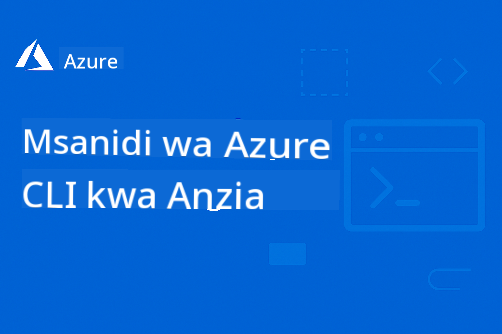

<!--
CO_OP_TRANSLATOR_METADATA:
{
  "original_hash": "068c87cc2641a81ca353ad7064ff326a",
  "translation_date": "2026-01-01T18:31:57+00:00",
  "source_file": "README.md",
  "language_code": "sw"
}
-->
# AZD Kwa Waanza: Safari ya Kujifunza Iliyopangwa

 

[](https://GitHub.com/microsoft/azd-for-beginners/watchers/)
[](https://GitHub.com/microsoft/azd-for-beginners/network/)
[](https://GitHub.com/microsoft/azd-for-beginners/stargazers/)

[](https://discord.gg/microsoft-azure)
[](https://discord.gg/nTYy5BXMWG)

## Kuanzia na Kozi Hii

Fuata hatua hizi kuanza safari yako ya kujifunza AZD:

1. **Forka Hazina**: Bonyeza [](https://GitHub.com/microsoft/azd-for-beginners/fork)
2. **Nakili Hazina (Clone)**: `git clone https://github.com/microsoft/azd-for-beginners.git`
3. **Jiunge na Jamii**: [Jamii za Discord za Azure](https://discord.com/invite/ByRwuEEgH4) kwa msaada wa wataalamu
4. **Chagua Njia Yako ya Kujifunza**: Chagua sura hapa chini inayolingana na kiwango chako cha uzoefu

### Msaada wa Lugha Nyingi

#### Tafsiri za Kiotomatiki (Zilizosasishwa Daima)

<!-- CO-OP TRANSLATOR LANGUAGES TABLE START -->
[Arabic](../ar/README.md) | [Bengali](../bn/README.md) | [Bulgarian](../bg/README.md) | [Burmese (Myanmar)](../my/README.md) | [Chinese (Simplified)](../zh/README.md) | [Chinese (Traditional, Hong Kong)](../hk/README.md) | [Chinese (Traditional, Macau)](../mo/README.md) | [Chinese (Traditional, Taiwan)](../tw/README.md) | [Croatian](../hr/README.md) | [Czech](../cs/README.md) | [Danish](../da/README.md) | [Dutch](../nl/README.md) | [Estonian](../et/README.md) | [Finnish](../fi/README.md) | [French](../fr/README.md) | [German](../de/README.md) | [Greek](../el/README.md) | [Hebrew](../he/README.md) | [Hindi](../hi/README.md) | [Hungarian](../hu/README.md) | [Indonesian](../id/README.md) | [Italian](../it/README.md) | [Japanese](../ja/README.md) | [Kannada](../kn/README.md) | [Korean](../ko/README.md) | [Lithuanian](../lt/README.md) | [Malay](../ms/README.md) | [Malayalam](../ml/README.md) | [Marathi](../mr/README.md) | [Nepali](../ne/README.md) | [Nigerian Pidgin](../pcm/README.md) | [Norwegian](../no/README.md) | [Persian (Farsi)](../fa/README.md) | [Polish](../pl/README.md) | [Portuguese (Brazil)](../br/README.md) | [Portuguese (Portugal)](../pt/README.md) | [Punjabi (Gurmukhi)](../pa/README.md) | [Romanian](../ro/README.md) | [Russian](../ru/README.md) | [Serbian (Cyrillic)](../sr/README.md) | [Slovak](../sk/README.md) | [Slovenian](../sl/README.md) | [Spanish](../es/README.md) | [Swahili](./README.md) | [Swedish](../sv/README.md) | [Tagalog (Filipino)](../tl/README.md) | [Tamil](../ta/README.md) | [Telugu](../te/README.md) | [Thai](../th/README.md) | [Turkish](../tr/README.md) | [Ukrainian](../uk/README.md) | [Urdu](../ur/README.md) | [Vietnamese](../vi/README.md)
<!-- CO-OP TRANSLATOR LANGUAGES TABLE END -->

## Muhtasari wa Kozi

Pata ujuzi wa Azure Developer CLI (azd) kupitia sura zilizopangwa kwa kujifunza hatua kwa hatua. **Kipaumbele maalum kwa uenezaji wa programu za AI kwa ujumuishaji na Microsoft Foundry.**

### Kwa Nini Kozi Hii ni Muhimu kwa Waendelezaji wa Kisasa

Kulingana na uelewa wa jamii ya Discord ya Microsoft Foundry, **45% ya waendelezaji wanataka kutumia AZD kwa mzigo wa AI** lakini wanakutana na changamoto zifuatazo:
- Miundo tata ya huduma nyingi za AI
- Mbinu bora za uenezaji wa AI kwa uzalishaji  
- Ujumuishaji na usanidi wa huduma za Azure AI
- Uboreshaji wa gharama kwa mzigo wa AI
- Utatuzi wa matatizo maalumu ya uenezaji wa AI

### Malengo ya Kujifunza

Kwa kukamilisha kozi hii iliyopangwa, utafikia:
- **Kuwa mtaalamu wa Misingi ya AZD**: dhana kuu, usakinishaji, na usanidi
- **Sambaza Programu za AI**: Tumia AZD pamoja na huduma za Microsoft Foundry
- **Tekeleza Miundombinu kama Msimbo**: Dhibiti rasilimali za Azure kwa kutumia templeti za Bicep
- **Tatua Usambazaji**: Tatua matatizo ya kawaida na fanya utatuzi
- **Boresha kwa Uzalishaji**: Usalama, upanuzi, ufuatiliaji, na usimamizi wa gharama
- **Jenga Suluhisho za Wakala-Wengi**: Sambaza miundombinu tata ya AI

## 📚 Sura za Kujifunza

*Chagua njia yako ya kujifunza kulingana na kiwango chako cha uzoefu na malengo*

### 🚀 Sura 1: Misingi & Mwanzo wa Haraka
**Masharti ya Awali**: Usajili wa Azure, maarifa ya msingi ya mstari wa amri  
**Muda**: 30-45 dakika  
**Ugumu**: ⭐

#### Utakachojifunza
- Kuelewa misingi ya Azure Developer CLI
- Kusakinisha AZD kwenye jukwaa lako
- Usambazaji wako wa kwanza uliokuwa na mafanikio

#### Vyanzo vya Kujifunza
- **🎯 Anza Hapa**: [Azure Developer CLI ni Nini?](../..)
- **📖 Nadharia**: [Misingi ya AZD](docs/getting-started/azd-basics.md) - Dhana kuu na istilahi
- **⚙️ Usanidi**: [Usakinishaji & Usanidi](docs/getting-started/installation.md) - Mwongozo wa majukwaa maalum
- **🛠️ Kazi ya Vitendo**: [Mradi Wako wa Kwanza](docs/getting-started/first-project.md) - Mafunzo hatua kwa hatua
- **📋 Marejeo ya Haraka**: [Karatasi ya Amri](resources/cheat-sheet.md)

#### Mazoezi ya Vitendo
```bash
# Ukaguzi wa haraka wa usakinishaji
azd version

# Sambaza programu yako ya kwanza
azd init --template todo-nodejs-mongo
azd up
```

**💡 Matokeo ya Sura**: Sambaza kwa mafanikio programu rahisi ya wavuti kwenye Azure kwa kutumia AZD

**✅ Uthibitisho wa Mafanikio:**
```bash
# Baada ya kumaliza Sura ya 1, unapaswa kuwa na uwezo wa:
azd version              # Inaonyesha toleo lililosakinishwa
azd init --template todo-nodejs-mongo  # Inaanzisha mradi
azd up                  # Inaweka kwenye Azure
azd show                # Inaonyesha URL ya programu inayokimbia
# Programu inafunguka kwenye kivinjari na inafanya kazi
azd down --force --purge  # Inasafisha rasilimali
```

**📊 Uwekezaji wa Muda:** 30-45 dakika  
**📈 Kiwango cha Ujuzi Baada:** Unaweza kusambaza programu za msingi kwa uhuru

**✅ Uthibitisho wa Mafanikio:**
```bash
# Baada ya kumaliza Sura ya 1, utapaswa kuwa na uwezo wa:
azd version              # Inaonyesha toleo lililosakinishwa
azd init --template todo-nodejs-mongo  # Inaanzisha mradi
azd up                  # Inaweka kwenye Azure
azd show                # Inaonyesha URL ya programu inayokimbia
# Programu inafunguka katika kivinjari na inafanya kazi
azd down --force --purge  # Inasafisha rasilimali
```

**📊 Uwekezaji wa Muda:** 30-45 dakika  
**📈 Kiwango cha Ujuzi Baada:** Unaweza kusambaza programu za msingi kwa uhuru

---

### 🤖 Sura 2: Maendeleo kwa Kuanzia na AI (Inayopendekezwa kwa Waendelezaji wa AI)
**Masharti ya Awali**: Sura 1 imekamilika  
**Muda**: 1-2 saa  
**Ugumu**: ⭐⭐

#### Utakachojifunza
- Ushirikiano wa Microsoft Foundry na AZD
- Kusambaza programu zinazotumia AI
- Kuelewa usanidi wa huduma za AI

#### Vyanzo vya Kujifunza
- **🎯 Anza Hapa**: [Ushirikiano wa Microsoft Foundry](docs/microsoft-foundry/microsoft-foundry-integration.md)
- **📖 Mifumo**: [Uenezaji wa Mfano wa AI](docs/microsoft-foundry/ai-model-deployment.md) - Sambaza na kusimamia mifano ya AI
- **🛠️ Warsha**: [Warsha ya AI](docs/microsoft-foundry/ai-workshop-lab.md) - Fanya suluhisho zako za AI ziwe tayari kwa AZD
- **🎥 Mwongozo wa Kimfumo**: [Vifaa vya Warsha](workshop/README.md) - Kujifunza kupitia kivinjari kwa MkDocs * DevContainer Environment
- **📋 Templeti**: [Microsoft Foundry Templates](../..)
- **📝 Mifano**: [Mifano ya Uenezaji wa AZD](examples/README.md)

#### Mazoezi ya Vitendo
```bash
# Weka programu yako ya kwanza ya AI
azd init --template azure-search-openai-demo
azd up

# Jaribu violezo vya AI vya ziada
azd init --template openai-chat-app-quickstart
azd init --template agent-openai-python-prompty
```

**💡 Matokeo ya Sura**: Sambaza na kusanidi programu ya mazungumzo inayotumia AI yenye uwezo wa RAG

**✅ Uthibitisho wa Mafanikio:**
```bash
# Baada ya Sura ya 2, unapaswa kuweza:
azd init --template azure-search-openai-demo
azd up
# Jaribu kiolesura cha mazungumzo cha AI
# Uliza maswali na upate majibu yanayotolewa na AI yenye vyanzo
# Thibitisha kuwa ujumuishaji wa utafutaji unafanya kazi
azd monitor  # Angalia kwamba Application Insights inaonyesha telemetri
azd down --force --purge
```

**📊 Uwekezaji wa Muda:** 1-2 saa  
**📈 Kiwango cha Ujuzi Baada:** Unaweza kusambaza na kusanidi programu za AI zilizo tayari kwa uzalishaji  
**💰 Uelewa wa Gharama:** Elewa gharama za maendeleo $80-150/mwezi, gharama za uzalishaji $300-3500/mwezi

#### 💰 Mambo ya Kuzingatia Kuhusu Gharama kwa Uenezaji wa AI

**Mazingira ya Maendeleo (Makadirio $80-150/mwezi):**
- Azure OpenAI (Lipa-kama-unavyo-tumia): $0-50/mwezi (kutegemea matumizi ya tokeni)
- AI Search (Ngazi ya Msingi): $75/mwezi
- Container Apps (Matumizi): $0-20/mwezi
- Uhifadhi (Kawaida): $1-5/mwezi

**Mazingira ya Uzalishaji (Makadirio $300-3,500+/mwezi):**
- Azure OpenAI (PTU kwa utendaji wa uthabiti): $3,000+/mwezi AU Lipa-kama-unavyo-tumia kwa wingi mkubwa
- AI Search (Ngazi ya Kawaida): $250/mwezi
- Container Apps (Iliyotengwa): $50-100/mwezi
- Application Insights: $5-50/mwezi
- Uhifadhi (Premium): $10-50/mwezi

**💡 Vidokezo vya Kupunguza Gharama:**
- Tumia **Ngazi ya Bure** Azure OpenAI kwa kujifunza (50,000 tokeni/mwezi zilijumuishwa)
- Endesha `azd down` kuondoa ugawaji wa rasilimali wakati hauko katika maendeleo kwa ufanisi
- Anza kwa bili ya kulingana na matumizi, boresha hadi PTU tu kwa uzalishaji
- Tumia `azd provision --preview` kukadiria gharama kabla ya usambazaji
- Washa uanzishaji wa uenezaji wa moja kwa moja: lipa tu kwa matumizi halisi

**Ufuatiliaji wa Gharama:**
```bash
# Angalia makadirio ya gharama za kila mwezi
azd provision --preview

# Fuatilia gharama halisi katika Portal ya Azure
az consumption budget list --resource-group <your-rg>
```

---

### ⚙️ Sura 3: Usanidi & Uthibitishaji
**Masharti ya Awali**: Sura 1 imekamilika  
**Muda**: 45-60 dakika  
**Ugumu**: ⭐⭐

#### Utakachojifunza
- Usanidi na usimamizi wa mazingira
- Mazoea bora ya uthibitishaji na usalama
- Ujina wa rasilimali na upangaji

#### Vyanzo vya Kujifunza
- **📖 Usanidi**: [Mwongozo wa Usanidi](docs/getting-started/configuration.md) - Usanidi wa mazingira
- **🔐 Usalama**: [Mifumo ya uthibitishaji na utambulisho uliosimamiwa](docs/getting-started/authsecurity.md) - Mifumo ya uthibitishaji
- **📝 Mifano**: [Mfano wa Programu ya Hifadhidata](examples/database-app/README.md) - Mifano ya Hifadhidata za AZD

#### Mazoezi ya Vitendo
- Sanidi mazingira mengi (dev, staging, prod)
- Weka uthibitishaji wa utambulisho uliosimamiwa
- Tekeleza usanidi maalum kwa mazingira

**💡 Matokeo ya Sura**: Dhibiti mazingira mengi kwa uthibitishaji na usalama sahihi

---

### 🏗️ Sura 4: Miundombinu kama Msimbo & Uenezaji
**Masharti ya Awali**: Suras 1-3 zimekamilika  
**Muda**: 1-1.5 saa  
**Ugumu**: ⭐⭐⭐

#### Utakachojifunza
- Mifumo ya juu ya uenezaji
- Miundombinu kama Msimbo kwa kutumia Bicep
- Mikakati ya utoaji wa rasilimali

#### Vyanzo vya Kujifunza
- **📖 Uenezaji**: [Mwongozo wa Uenezaji](docs/deployment/deployment-guide.md) - Mchakato kamili wa kazi
- **🏗️ Upangaji**: [Upangaji wa Rasilimali](docs/deployment/provisioning.md) - Usimamizi wa rasilimali za Azure
- **📝 Mifano**: [Mfano wa Programu ya Kontena](../../examples/container-app) - Usambazaji wa programu zilizokatwakatwa kwenye kontena

#### Mazoezi ya Vitendo
- Tengeneza templeti za Bicep za kawaida
- Sambaza programu zilizo na huduma nyingi
- Tekeleza mikakati ya uenezaji ya blue-green

**💡 Matokeo ya Sura**: Sambaza programu tata zenye huduma nyingi kwa kutumia templeti za miundombinu zilizobinafsishwa

---

### 🎯 Sura 5: Suluhisho za AI za Wakala-Wengi (Kibobea)
**Masharti ya Awali**: Suras 1-2 zimekamilika  
**Muda**: 2-3 saa  
**Ugumu**: ⭐⭐⭐⭐

#### Utakachojifunza
- Mifumo ya usanifu wa wakala-wengi
- Uratibu na usakinishaji wa wakala
- Uenezaji wa AI uliokamilishwa kwa uzalishaji

#### Vyanzo vya Kujifunza
- **🤖 Mradi Uliotajwa**: [Suluhisho la Wakala-Wengi kwa Rejareja](examples/retail-scenario.md) - Utekelezaji kamili
- **🛠️ ARM Templates**: [ARM Template Package](../../examples/retail-multiagent-arm-template) - Utekelezaji kwa bonyeza moja
- **📖 Architecture**: [Mifumo ya uratibu wa mawakala wengi](/docs/pre-deployment/coordination-patterns.md) - Mifumo

#### Mazoezi ya Vitendo
```bash
# Sambaza suluhisho kamili la rejareja lenye mawakala wengi
cd examples/retail-multiagent-arm-template
./deploy.sh

# Chunguza usanidi wa mawakala
az deployment group show --resource-group <rg-name> --name <deployment-name>
```

**💡 Matokeo ya Sura**: Tumia na usimamishe suluhisho la AI la mawakala wengi linalostahiki uzalishaji na mawakala wa Mteja na Hisa

---

### 🔍 Sura 6: Uthibitishaji na Upangaji Kabla ya Utekelezaji
**Mahitaji ya awali**: Sura 4 imekamilika  
**Muda**: 1 saa  
**Ugumu**: ⭐⭐

#### Unachokitajifunza
- Upangaji wa uwezo na uthibitishaji wa rasilimali
- Mikakati ya uchagua SKU
- Ukaguzi wa kabla ya uzinduzi na uendeshaji wa moja kwa moja

#### Rasilimali za Kujifunza
- **📊 Upangaji**: [Mipango ya Uwezo](docs/pre-deployment/capacity-planning.md) - Uthibitishaji wa rasilimali
- **💰 Uchaguzi**: [Uchaguzi wa SKU](docs/pre-deployment/sku-selection.md) - Chaguo nafuu za gharama
- **✅ Uthibitisho**: [Ukaguzi wa kabla ya uzinduzi](docs/pre-deployment/preflight-checks.md) - Skripti za kuendesha moja kwa moja

#### Mazoezi ya Vitendo
- Endesha skripti za uthibitishaji wa uwezo
- Boresha uchaguzi wa SKU kwa gharama
- Tekeleza ukaguzi wa kabla ya utekelezaji kwa njia ya moja kwa moja

**💡 Matokeo ya Sura**: Thibitisha na boresha utekelezaji kabla ya kutekeleza

---

### 🚨 Sura 7: Utatuzi wa Matatizo na Urekebishaji
**Mahitaji ya awali**: Sura yoyote ya utekelezaji ikikamilika  
**Muda**: 1-1.5 saa  
**Ugumu**: ⭐⭐

#### Unachokitajifunza
- Mbinu za kimfumo za urekebishaji
- Masuala ya kawaida na suluhisho
- Utatuzi maalum kwa AI

#### Rasilimali za Kujifunza
- **🔧 Masuala ya Kawaida**: [Masuala ya Kawaida](docs/troubleshooting/common-issues.md) - Maswali ya Mara kwa Mara na suluhisho
- **🕵️ Urekebishaji**: [Mwongozo wa Urekebishaji](docs/troubleshooting/debugging.md) - Mikakati hatua kwa hatua
- **🤖 Masuala ya AI**: [Utatuzi wa Matatizo maalum kwa AI](docs/troubleshooting/ai-troubleshooting.md) - Matatizo ya huduma za AI

#### Mazoezi ya Vitendo
- Tambua kwa uchungu makosa ya utekelezaji
- Rekebisha matatizo ya uthibitishaji
- Rekebisha muunganisho wa huduma za AI

**💡 Matokeo ya Sura**: Tambua na rekebisha matatizo ya kawaida ya utekelezaji kwa uhuru

---

### 🏢 Sura 8: Mifumo ya Uzalishaji & ya Shirika
**Mahitaji ya awali**: Sura 1-4 zimekamilika  
**Muda**: 2-3 saa  
**Ugumu**: ⭐⭐⭐⭐

#### Unachokitajifunza
- Mikakati ya utekelezaji wa uzalishaji
- Mifumo ya usalama ya shirika
- Ufuatiliaji na uboreshaji wa gharama

#### Rasilimali za Kujifunza
- **🏭 Uzalishaji**: [Mbinu Bora za AI kwa Uzalishaji](docs/microsoft-foundry/production-ai-practices.md) - Mifumo ya shirika
- **📝 Mifano**: [Mfano wa Microservices](../../examples/microservices) - Mifumo tata
- **📊 Ufuatiliaji**: [Uunganisho wa Application Insights](docs/pre-deployment/application-insights.md) - Ufuatiliaji

#### Mazoezi ya Vitendo
- Tekeleza mifumo ya usalama ya shirika
- Weka ufuatiliaji kamili
- Tekeleza kwenye uzalishaji kwa uratibu sahihi

**💡 Matokeo ya Sura**: Tekeleza programu zinazostahiki uzalishaji na uwezo kamili wa uzalishaji

---

## 🎓 Muhtasari wa Warsha: Uzoefu wa Kujifunza kwa Vitendo

> **⚠️ HALI YA WARSHA: Maendeleo Yanayofanyika**  
> Vifaa vya warsha vinaendelezwa na kuboreshwa kwa sasa. Moduli kuu zinafanya kazi, lakini baadhi ya sehemu za juu hazijakamilika. Tunaendelea kufanya kazi ili kukamilisha maudhui yote. [Fuata maendeleo →](workshop/README.md)

### Vifaa vya Warsha vya Kihusishwa
**Mafunzo ya vitendo yaliyopangwa, yanayotumia zana za kivinjari na mazoezi yaliyoongozwa**

Vifaa vya warsha vinatoa uzoefu wa kujifunza ulioratibiwa na wa kuingiliana unaoendana na mtaala wa sura ulio hapo juu. Warsha imeundwa kwa kujifunza kwa mwendo wa kibinafsi na pia kwa vikao vinavyoongozwa na mwalimu.

#### 🛠️ Sifa za Warsha
- **Kiolesura cha Kivinjari**: Warsha kamili inayoendeshwa na MkDocs yenye utafutaji, nakili, na vipengele vya mandhari
- **Uunganisho wa GitHub Codespaces**: Kuanzisha mazingira ya maendeleo kwa bonyeza moja
- **Njia ya Kujifunza Iliyo Pangiliwa**: Mazoezi 7 yaliyoongozwa (jumla saa 3.5)
- **Gundua → Tekeleza → Badilisha**: Mbinu ya hatua kwa hatua
- **Mazingira ya DevContainer ya Kuingiliana**: Zana na utegemezi vilivyowekwa awali

#### 📚 Muundo wa Warsha
Warsha inafuata mbinu ya **Gundua → Tekeleza → Badilisha**:

1. **Awamu ya Ugunduzi** (dakika 45)
   - Chunguza templeti na huduma za Microsoft Foundry
   - Elewa mifumo ya mawakala wengi
   - Pitia mahitaji ya utekelezaji na masharti ya awali

2. **Awamu ya Utekelezaji** (saa 2)
   - Mazoezi ya kutekeleza programu za AI kwa AZD
   - Sanidi huduma za Azure AI na pointi za mwisho
   - Tekeleza mifumo ya usalama na uthibitishaji

3. **Awamu ya Urekebishaji** (dakika 45)
   - Badilisha programu kwa matumizi maalum
   - Boresha kwa ajili ya utekelezaji wa uzalishaji
   - Tekeleza ufuatiliaji na usimamizi wa gharama

#### 🚀 Kuanzisha na Warsha
```bash
# Chaguo 1: GitHub Codespaces (Inayopendekezwa)
# Bofya "Msimbo" → "Unda codespace kwenye main" kwenye hazina

# Chaguo 2: Maendeleo ya ndani
git clone https://github.com/microsoft/azd-for-beginners.git
cd azd-for-beginners/workshop
# Fuata maelekezo ya usanidi katika workshop/README.md
```

#### 🎯 Matokeo ya Kujifunza ya Warsha
Kwa kukamilisha warsha, washiriki watakuwa:
- **Kutekeleza Programu za AI za Uzalishaji**: Tumia AZD na huduma za Microsoft Foundry
- **Mtaalamu wa Mifumo ya Mawakala Wengi**: Tekeleza suluhisho za kuratibu mawakala wa AI
- **Tekeleza Mbinu Bora za Usalama**: Sanidi uthibitishaji na udhibiti wa upatikanaji
- **Boresha kwa Upana**: Unda utekelezaji wa gharama nafuu na wenye utendakazi mzuri
- **Tatua Matatizo ya Utekelezaji**: Rekebisha matatizo ya kawaida kwa uhuru

#### 📖 Rasilimali za Warsha
- **🎥 Mwongozo wa Maingiliano**: [Vifaa vya Warsha](workshop/README.md) - Mazingira ya kujifunzia yanayotumika kupitia kivinjari
- **📋 Maelekezo Hatua kwa Hatua**: [Mazoezi yaliyoongozwa](../../workshop/docs/instructions) - Mwongozo wa kina
- **🛠️ Maabara ya Warsha ya AI**: [AI Workshop Lab](docs/microsoft-foundry/ai-workshop-lab.md) - Mazoezi yanayolenga AI
- **💡 Mwanzo wa Haraka**: [Mwongozo wa Usanidi wa Warsha](workshop/README.md#quick-start) - Usanidi wa mazingira

**Inafaa kwa**: Mafunzo ya kampuni, kozi za vyuo vikuu, kujifunza kwa mwendo wa kibinafsi, na mafunzo ya watengenezaji.

---

## 📖 Azure Developer CLI ni Nini?

Azure Developer CLI (azd) ni kiolesura cha mstari wa amri kilicholenga watengenezaji kinachokazia mchakato wa kujenga na kutekeleza programu kwenye Azure. Kinatoa:

- **Utekelezaji unaotegemea templeti** - Tumia templeti zilizojengwa tayari kwa mifumo ya kawaida ya programu
- **Miundombinu kama Msimbo** - Simamia rasilimali za Azure ukitumia Bicep au Terraform  
- **Mtiririko umeunganishwa** - Toa, tekekeza, na fuatilia programu kwa urahisi
- **Rafiki kwa mtengenezaji** - Imeboreshwa kwa tija na uzoefu wa mtengenezaji

### **AZD + Microsoft Foundry: Inafaa kwa Utekelezaji wa AI**

**Kwa Nini AZD kwa Suluhisho za AI?** AZD inashughulikia changamoto kuu zinazokabiliwa na watengenezaji wa AI:

- **Violezo Vilivyoandaliwa kwa AI** - Templeti zilizosetwa awali kwa Azure OpenAI, Cognitive Services, na mzigo wa kazi wa ML
- **Utekelezaji wa AI salama** - Mifumo ya usalama iliyojengwa kwa huduma za AI, funguo za API, na pointi za mwisho za modeli  
- **Mifumo ya AI kwa Uzalishaji** - Mbinu bora kwa utekelezaji wenye uwezo wa kupanuka na gharama nafuu
- **Mtiririko wa AI kutoka Mwanzo hadi Uzalishaji** - Kuanzia maendeleo ya modeli hadi utekelezaji wa uzalishaji na ufuatiliaji sahihi
- **Uboreshaji wa Gharama** - Ugawaji wa rasilimali na mikakati ya kujipima kwa weledi kwa mzigo wa kazi wa AI
- **Uunganisho na Microsoft Foundry** - Muunganisho laini na katalogi ya modeli na pointi za mwisho za Microsoft Foundry

---

## 🎯 Maktaba ya Violezo & Mifano

### Iliyotajwa: Violezo vya Microsoft Foundry
**Anza hapa ikiwa unatekeleza programu za AI!**

> **Kumbuka:** Templeti hizi zinaonyesha mifumo mbalimbali ya AI. Baadhi ni Azure Samples za nje, wengine ni utekelezaji wa ndani.

| Template | Sura | Ugumu | Huduma | Aina |
|----------|---------|------------|----------|------|
| [**Get started with AI chat**](https://github.com/Azure-Samples/get-started-with-ai-chat) | Sura 2 | ⭐⭐ | AzureOpenAI + Azure AI Model Inference API + Azure AI Search + Azure Container Apps + Application Insights | Nje |
| [**Get started with AI agents**](https://github.com/Azure-Samples/get-started-with-ai-agents) | Sura 2 | ⭐⭐ | Azure AI Agent Service + AzureOpenAI + Azure AI Search + Azure Container Apps + Application Insights| Nje |
| [**Azure Search + OpenAI Demo**](https://github.com/Azure-Samples/azure-search-openai-demo) | Sura 2 | ⭐⭐ | AzureOpenAI + Azure AI Search + App Service + Storage | Nje |
| [**OpenAI Chat App Quickstart**](https://github.com/Azure-Samples/openai-chat-app-quickstart) | Sura 2 | ⭐ | AzureOpenAI + Container Apps + Application Insights | Nje |
| [**Agent OpenAI Python Prompty**](https://github.com/Azure-Samples/agent-openai-python-prompty) | Sura 5 | ⭐⭐⭐ | AzureOpenAI + Azure Functions + Prompty | Nje |
| [**Contoso Chat RAG**](https://github.com/Azure-Samples/contoso-chat) | Sura 8 | ⭐⭐⭐⭐ | AzureOpenAI + AI Search + Cosmos DB + Container Apps | Nje |
| [**Retail Multi-Agent Solution**](examples/retail-scenario.md) | Sura 5 | ⭐⭐⭐⭐ | AzureOpenAI + AI Search + Storage + Container Apps + Cosmos DB | **Ndani** |

### Iliyotajwa: Mifano Kamili ya Kujifunza
**Templeti za programu zimetayarishwa kwa uzalishaji zimetengwa kwa sura za kujifunzia**

| Template | Sura ya Kujifunza | Ugumu | Mafunzo Muhimu |
|----------|------------------|------------|--------------|
| [**openai-chat-app-quickstart**](https://github.com/Azure-Samples/openai-chat-app-quickstart) | Sura 2 | ⭐ | Mifumo ya msingi ya utekelezaji wa AI |
| [**azure-search-openai-demo**](https://github.com/Azure-Samples/azure-search-openai-demo) | Sura 2 | ⭐⭐ | Utekelezaji wa RAG kwa Azure AI Search |
| [**ai-document-processing**](https://github.com/Azure-Samples/ai-document-processing) | Sura 4 | ⭐⭐ | Uunganishaji wa Document Intelligence |
| [**agent-openai-python-prompty**](https://github.com/Azure-Samples/agent-openai-python-prompty) | Sura 5 | ⭐⭐⭐ | Mfumo wa mawakala na upigaji wa simu za kazi |
| [**contoso-chat**](https://github.com/Azure-Samples/contoso-chat) | Sura 8 | ⭐⭐⭐ | Uratibu wa AI kwa shirika |
| [**retail-multi-agent-solution**](examples/retail-scenario.md) | Sura 5 | ⭐⭐⭐⭐ | Mifumo ya mawakala wengi na mawakala wa Mteja na Hisa |

### Kujifunza kwa Aina ya Mfano

> **📌 Mifano ya Ndani vs. Nje:**  
> **Mifano ya Ndani** (katika repo hii) = Tayari kutumika mara moja  
> **Mifano ya Nje** (Azure Samples) = Nakili kutoka kwenye repositori zilizounganishwa

#### Mifano ya Ndani (Tayari Kutumika)
- [**Retail Multi-Agent Solution**](examples/retail-scenario.md) - Utekelezaji kamili unaostahiki uzalishaji na templeti za ARM
  - Mifumo ya mawakala wengi (Mteja + Hisa)
  - Ufuatiliaji kamili na tathmini
  - Utekelezaji kwa bonyeza moja kupitia templeti za ARM

#### Mifano ya Ndani - Programu za Container (Sura 2-5)
**Mifano kamili ya utekelezaji wa kontena katika repo hii:**
- [**Container App Examples**](examples/container-app/README.md) - Mwongozo kamili wa utekelezaji wa kontena
  - [Simple Flask API](../../examples/container-app/simple-flask-api) - API ya msingi ya REST yenye scale-to-zero
  - [Microservices Architecture](../../examples/container-app/microservices) - Utekelezaji wa huduma nyingi unaostahiki uzalishaji
  - Mwanzo wa Haraka, Uzalishaji, na mifumo ya juu ya utekelezaji
  - Mwongozo wa ufuatiliaji, usalama, na uboreshaji wa gharama

#### Mifano ya Nje - Programu Rahisi (Sura 1-2)
**Nakili repositori hizi za Azure Samples ili kuanza:**
- [Simple Web App - Node.js + MongoDB](https://github.com/Azure-Samples/todo-nodejs-mongo) - Mifumo ya msingi ya utekelezaji
- [Static Website - React SPA](https://github.com/Azure-Samples/todo-csharp-sql-swa-func) - Utekelezaji wa tovuti ya yaliyomo thabiti
- [Container App - Python Flask](https://github.com/Azure-Samples/container-apps-store-api-microservice) - Utekelezaji wa API ya REST

#### Mifano ya Nje - Uunganishaji wa Database (Sura 3-4)  
- [Database App - C# + SQL](https://github.com/Azure-Samples/todo-csharp-sql) - Mifumo ya uunganishaji wa database
- [Functions + Cosmos DB](https://github.com/Azure-Samples/todo-python-mongo-swa-func) - Mtiririko wa data usio na seva

#### Mifano ya Nje - Mifumo ya Juu (Sura 4-8)
- [Java Microservices](https://github.com/Azure-Samples/java-microservices-aca-lab) - Mifumo ya huduma nyingi
- [Container Apps Jobs](https://github.com/Azure-Samples/container-apps-jobs) - Usindikaji wa nyuma  
- [Enterprise ML Pipeline](https://github.com/Azure-Samples/mlops-v2) - Mifumo ya ML inayostahiki uzalishaji

### Mkusanyiko wa Violezo vya Nje
- [**Galari Rasmi ya Violezo za AZD**](https://azure.github.io/awesome-azd/) - Ukusanyaji ulihifadhiwa wa violezo rasmi na vya jumuiya
- [**Violezo vya Azure Developer CLI**](https://learn.microsoft.com/en-us/azure/developer/azure-developer-cli/azd-templates) - Nyaraka za templeti za Microsoft Learn
- [**Directori ya Mifano**](examples/README.md) - Mifano ya kujifunzia ya ndani yenye maelezo ya kina

---

## 📚 Rasilimali za Kujifunza & Marejeo

### Marejeo ya Haraka
- [**Kifupisho cha Amri**](resources/cheat-sheet.md) - Amri muhimu za azd zilizo pangiliwa kwa sura
- [**Kamusi**](resources/glossary.md) - Terminolojia ya Azure na azd  
- [**Maswali Yanayoulizwa Mara kwa Mara (FAQ)**](resources/faq.md) - Maswali ya kawaida zilizo pangiliwa kwa sura za kujifunza
- [**Mwongozo wa Kujifunza**](resources/study-guide.md) - Mazoezi ya kina ya vitendo

### Warsha za Vitendo
- [**Maabara ya Warsha ya AI**](docs/microsoft-foundry/ai-workshop-lab.md) - Fanya suluhisho zako za AI ziweze kutumwa kwa AZD (masaa 2-3)
- [**Mwongozo wa Warsha ya Mwingiliano**](workshop/README.md) - Warsha inayotekelezeka kwa kivinjari na MkDocs na Mazingira ya DevContainer
- [**Njia ya Kujifunza Iliyopangwa**](../../workshop/docs/instructions) -7 hatua za mazoezi yaliyoongozwa (Ugunduzi → Utekelezaji → Urekebishaji)
- [**Warsha ya AZD kwa Waanzilishi**](workshop/README.md) - Vifaa vya warsha vya vitendo vilivyokamilishwa na muunganiko wa GitHub Codespaces

### Vyanzo vya Kujifunza Nje
- [Nyaraka za Azure Developer CLI](https://learn.microsoft.com/en-us/azure/developer/azure-developer-cli/)
- [Kituo cha Usanifu wa Azure](https://learn.microsoft.com/en-us/azure/architecture/)
- [Kalkuleta ya Bei ya Azure](https://azure.microsoft.com/pricing/calculator/)
- [Hali ya Azure](https://status.azure.com/)

---

## 🔧 Mwongozo wa Haraka wa Utatuzi wa Matatizo

**Masuala ya kawaida waanzilishi wanayokutana nayo na suluhisho za haraka:**

### ❌ "azd: command not found"

```bash
# Sakinisha AZD kwanza
# Windows (PowerShell):
winget install microsoft.azd

# macOS:
brew tap azure/azd && brew install azd

# Linux:
curl -fsSL https://aka.ms/install-azd.sh | bash

# Thibitisha usakinishaji
azd version
```

### ❌ "No subscription found" or "Subscription not set"

```bash
# Orodhesha usajili zinazopatikana
az account list --output table

# Weka usajili wa chaguo-msingi
az account set --subscription "<subscription-id-or-name>"

# Weka kwa mazingira ya AZD
azd env set AZURE_SUBSCRIPTION_ID "<subscription-id>"

# Thibitisha
az account show
```

### ❌ "InsufficientQuota" or "Quota exceeded"

```bash
# Jaribu eneo tofauti la Azure
azd env set AZURE_LOCATION "westus2"
azd up

# Au tumia SKUs ndogo wakati wa maendeleo
# Hariri infra/main.parameters.json:
{
  "sku": "B1"  // Instead of "P1V2"
}
```

### ❌ "azd up" fails halfway through

```bash
# Chaguo 1: Safisha na jaribu tena
azd down --force --purge
azd up

# Chaguo 2: Rekebisha tu miundombinu
azd provision

# Chaguo 3: Angalia kumbukumbu za kina
azd show
azd logs
```

### ❌ "Authentication failed" or "Token expired"

```bash
# Fanya upya uthibitishaji
az logout
az login

azd auth logout
azd auth login

# Thibitisha uthibitishaji
az account show
```

### ❌ "Resource already exists" or naming conflicts

```bash
# AZD inazalisha majina ya kipekee, lakini ikiwa kuna mgongano:
azd down --force --purge

# Kisha jaribu tena kwa mazingira mapya
azd env new dev-v2
azd up
```

### ❌ Template deployment taking too long

**Muda wa kawaida wa kusubiri:**
- Programu ya wavuti rahisi: dakika 5-10
- Programu yenye hifadhidata: dakika 10-15
- Programu za AI: dakika 15-25 (Utoaji wa OpenAI ni polepole)

```bash
# Angalia maendeleo
azd show

# Iwapo umekwama kwa zaidi ya dakika 30, angalia Azure Portal:
azd monitor
# Tafuta utekelezaji ulioshindwa
```

### ❌ "Permission denied" or "Forbidden"

```bash
# Angalia jukumu lako la Azure
az role assignment list --assignee $(az account show --query user.name -o tsv)

# Unahitaji angalau jukumu la "Contributor"
# Omba msimamizi wako wa Azure akupe:
# - Contributor (kwa rasilimali)
# - User Access Administrator (kwa ugawaji wa majukumu)
```

### ❌ Can't find deployed application URL

```bash
# Onyesha anwani zote za mwisho za huduma
azd show

# Au fungua Portal ya Azure
azd monitor

# Angalia huduma maalum
azd env get-values
# Tafuta vigezo vya *_URL
```

### 📚 Full Troubleshooting Resources

- **Mwongozo wa Masuala ya Kawaida:** [Suluhisho za Kina](docs/troubleshooting/common-issues.md)
- **Masuala Maalum ya AI:** [Utatuzi wa Matatizo wa AI](docs/troubleshooting/ai-troubleshooting.md)
- **Mwongozo wa Utafutaji Kasoro:** [Utafutaji Kasoro hatua kwa hatua](docs/troubleshooting/debugging.md)
- **Pata Msaada:** [Azure Discord](https://discord.gg/microsoft-azure) #azure-developer-cli

---

## 🔧 Mwongozo wa Haraka wa Utatuzi wa Matatizo

**Masuala ya kawaida waanzilishi wanayokutana nayo na suluhisho za haraka:**

<details>
<summary><strong>❌ "azd: command not found"</strong></summary>

```bash
# Sakinisha AZD kwanza
# Windows (PowerShell):
winget install microsoft.azd

# macOS:
brew tap azure/azd && brew install azd

# Linux:
curl -fsSL https://aka.ms/install-azd.sh | bash

# Thibitisha usakinishaji
azd version
```
</details>

<details>
<summary><strong>❌ "No subscription found" or "Subscription not set"</strong></summary>

```bash
# Orodhesha usajili zinazopatikana
az account list --output table

# Weka usajili wa chaguo-msingi
az account set --subscription "<subscription-id-or-name>"

# Weka kwa mazingira ya AZD
azd env set AZURE_SUBSCRIPTION_ID "<subscription-id>"

# Thibitisha
az account show
```
</details>

<details>
<summary><strong>❌ "InsufficientQuota" or "Quota exceeded"</strong></summary>

```bash
# Jaribu mkoa tofauti wa Azure
azd env set AZURE_LOCATION "westus2"
azd up

# Au tumia SKUs ndogo katika maendeleo
# Hariri infra/main.parameters.json:
{
  "sku": "B1"  // Instead of "P1V2"
}
```
</details>

<details>
<summary><strong>❌ "azd up" fails halfway through</strong></summary>

```bash
# Chaguo 1: Safisha na jaribu tena
azd down --force --purge
azd up

# Chaguo 2: Rekebisha miundombinu tu
azd provision

# Chaguo 3: Angalia kumbukumbu za kina
azd show
azd logs
```
</details>

<details>
<summary><strong>❌ "Authentication failed" or "Token expired"</strong></summary>

```bash
# Thibitisha tena
az logout
az login

azd auth logout
azd auth login

# Thibitisha uthibitisho
az account show
```
</details>

<details>
<summary><strong>❌ "Resource already exists" or naming conflicts</strong></summary>

```bash
# AZD inazalisha majina ya kipekee, lakini ikiwa kuna mgongano:
azd down --force --purge

# Kisha jaribu tena kwa mazingira mapya
azd env new dev-v2
azd up
```
</details>

<details>
<summary><strong>❌ Template deployment taking too long</strong></summary>

**Muda wa kawaida wa kusubiri:**
- Programu ya wavuti rahisi: dakika 5-10
- Programu yenye hifadhidata: dakika 10-15
- Programu za AI: dakika 15-25 (Utoaji wa OpenAI ni polepole)

```bash
# Angalia maendeleo
azd show

# Kama umekwama kwa zaidi ya dakika 30, angalia Azure Portal:
azd monitor
# Tafuta uanzishaji ulioshindwa
```
</details>

<details>
<summary><strong>❌ "Permission denied" or "Forbidden"</strong></summary>

```bash
# Angalia jukumu lako la Azure
az role assignment list --assignee $(az account show --query user.name -o tsv)

# Unahitaji angalau jukumu la "Contributor"
# Omba msimamizi wako wa Azure atoe:
# - Contributor (kwa rasilimali)
# - User Access Administrator (kwa uteuzi wa majukumu)
```
</details>

<details>
<summary><strong>❌ Can't find deployed application URL</strong></summary>

```bash
# Onyesha miisho yote ya huduma
azd show

# Au fungua Portal ya Azure
azd monitor

# Angalia huduma maalum
azd env get-values
# Tafuta vibadilishi vya *_URL
```
</details>

### 📚 Full Troubleshooting Resources

- **Mwongozo wa Masuala ya Kawaida:** [Suluhisho za Kina](docs/troubleshooting/common-issues.md)
- **Masuala Maalum ya AI:** [Utatuzi wa Matatizo wa AI](docs/troubleshooting/ai-troubleshooting.md)
- **Mwongozo wa Utafutaji Kasoro:** [Utafutaji Kasoro hatua kwa hatua](docs/troubleshooting/debugging.md)
- **Pata Msaada:** [Azure Discord](https://discord.gg/microsoft-azure) #azure-developer-cli

---

## 🎓 Kukamilika kwa Kozi na Uthibitisho

### Ufuatiliaji wa Maendeleo
Fuata maendeleo yako ya kujifunza kupitia kila sura:

- [ ] **Sura 1**: Msingi & Anza Haraka ✅
- [ ] **Sura 2**: Maendeleo yaliyozingatia AI ✅  
- [ ] **Sura 3**: Usanidi & Uthibitishaji ✅
- [ ] **Sura 4**: Miundombinu kama Kanuni & Utekelezaji ✅
- [ ] **Sura 5**: Suluhisho za AI za Wakala Wengi ✅
- [ ] **Sura 6**: Uthibitisho kabla ya Utoaji & Mipango ✅
- [ ] **Sura 7**: Utatuzi wa Matatizo & Utafutaji Kasoro ✅
- [ ] **Sura 8**: Uzalishaji & Mifumo ya Kampuni ✅

### Uthibitisho wa Kujifunza
Baada ya kukamilisha kila sura, thibitisha maarifa yako kwa:
1. **Mazoezi ya Vitendo**: Kamilisha utekelezaji wa vitendo wa sura
2. **Ukaguzi wa Maarifa**: Pitia sehemu ya FAQ ya sura yako
3. **Mjadala wa Jamii**: Shiriki uzoefu wako kwenye Azure Discord
4. **Sura Inayofuata**: Hamia kwenye ngazi inayofuata ya ugumu

### Manufaa ya Kukamilisha Kozi
Baada ya kukamilisha sura zote, utakuwa na:
- **Uzoefu wa Uzalishaji**: Umeweka programu halisi za AI kwenye Azure
- **Ujuzi wa Kitaalamu**: Uwezo wa utoaji unaokidhi mahitaji ya kampuni  
- **Kutambuliwa ndani ya Jamii**: Mwanachama hai wa jumuiya ya waendelezaji wa Azure
- **Maendeleo ya Kazi**: Utaalamu unaotakiwa wa AZD na utekelezaji wa AI

---

## 🤝 Jamii & Msaada

### Pata Msaada & Usaidizi
- **Masuala ya Kiufundi:** [Ripoti hitilafu na omba vipengele vipya](https://github.com/microsoft/azd-for-beginners/issues)
- **Maswali ya Kujifunza:** [Jamii ya Microsoft Azure kwenye Discord](https://discord.gg/microsoft-azure) and [](https://discord.gg/nTYy5BXMWG)
- **Msaada Maalum wa AI:** Jiunge na [](https://discord.gg/nTYy5BXMWG)
- **Nyaraka:** [Nyaraka Rasmi za Azure Developer CLI](https://learn.microsoft.com/en-us/azure/developer/azure-developer-cli/)

### Maarifa ya Jamii kutoka Discord ya Microsoft Foundry

**Matokeo ya Utafiti wa Hivi Karibuni kutoka Kituo cha #Azure:**
- **45%** ya waendelezaji wanataka kutumia AZD kwa kazi za AI
- **Changamoto kuu**: Utekelezaji wa huduma nyingi, usimamizi wa vitambulisho, utayari wa uzalishaji  
- **Zilizohitajika zaidi**: Violezo maalum vya AI, mwongozo wa utatuzi wa matatizo, mbinu bora

**Jiunge na jamii yetu ili:**
- Shiriki uzoefu wako wa AZD + AI na pata msaada
- Pata mapitio ya awali ya violezo mpya vya AI
- Changia kwenye mbinu bora za utekelezaji wa AI
- Kuathiri maendeleo ya vipengele vya AI + AZD vya baadaye

### Kuchangia kwenye Kozi
Tunakaribisha michango! Tafadhali soma [Mwongozo wa Kuchangia](CONTRIBUTING.md) kwa maelezo kuhusu:
- **Uboreshaji wa Maudhui**: Boresha sura na mifano iliyopo
- **Mifano Mpya**: Ongeza matukio halisi na violezo  
- **Tafsiri**: Saidia kudumisha msaada wa lugha nyingi
- **Ripoti za Mende**: Boresha usahihi na uwazi
- **Viwango vya Jamii**: Fuata miongozo yetu ya jamii yenye ujumuaji

---

## 📄 Taarifa za Kozi

### Leseni
Mradi huu umepewa leseni chini ya Leseni ya MIT - angalia faili ya [LICENSE](../../LICENSE) kwa maelezo.

### Vyanzo vingine vya kujifunza vya Microsoft

Timu yetu hutengeneza kozi nyingine za kujifunza kwa kina:

<!-- CO-OP TRANSLATOR OTHER COURSES START -->
### LangChain
[](https://aka.ms/langchain4j-for-beginners)
[](https://aka.ms/langchainjs-for-beginners?WT.mc_id=m365-94501-dwahlin)

---

### Azure / Edge / MCP / Agents
[](https://github.com/microsoft/AZD-for-beginners?WT.mc_id=academic-105485-koreyst)
[](https://github.com/microsoft/edgeai-for-beginners?WT.mc_id=academic-105485-koreyst)
[](https://github.com/microsoft/mcp-for-beginners?WT.mc_id=academic-105485-koreyst)
[](https://github.com/microsoft/ai-agents-for-beginners?WT.mc_id=academic-105485-koreyst)

---
 
### Generative AI Series
[](https://github.com/microsoft/generative-ai-for-beginners?WT.mc_id=academic-105485-koreyst)
[-9333EA?style=for-the-badge&labelColor=E5E7EB&color=9333EA)](https://github.com/microsoft/Generative-AI-for-beginners-dotnet?WT.mc_id=academic-105485-koreyst)
[-C084FC?style=for-the-badge&labelColor=E5E7EB&color=C084FC)](https://github.com/microsoft/generative-ai-for-beginners-java?WT.mc_id=academic-105485-koreyst)
[-E879F9?style=for-the-badge&labelColor=E5E7EB&color=E879F9)](https://github.com/microsoft/generative-ai-with-javascript?WT.mc_id=academic-105485-koreyst)

---
 
### Core Learning
[](https://aka.ms/ml-beginners?WT.mc_id=academic-105485-koreyst)
[](https://aka.ms/datascience-beginners?WT.mc_id=academic-105485-koreyst)
[](https://aka.ms/ai-beginners?WT.mc_id=academic-105485-koreyst)
[](https://github.com/microsoft/Security-101?WT.mc_id=academic-96948-sayoung)
[](https://aka.ms/webdev-beginners?WT.mc_id=academic-105485-koreyst)
[](https://aka.ms/iot-beginners?WT.mc_id=academic-105485-koreyst)
[](https://github.com/microsoft/xr-development-for-beginners?WT.mc_id=academic-105485-koreyst)

---
 
### Mfululizo wa Copilot
[](https://aka.ms/GitHubCopilotAI?WT.mc_id=academic-105485-koreyst)
[](https://github.com/microsoft/mastering-github-copilot-for-dotnet-csharp-developers?WT.mc_id=academic-105485-koreyst)
[](https://github.com/microsoft/CopilotAdventures?WT.mc_id=academic-105485-koreyst)
<!-- CO-OP TRANSLATOR OTHER COURSES END -->

---

## 🗺️ Utaratibu wa Kozi

**🚀 Tayari Kuanzia Kujifunza?**

**Waanzilishi**: Anza na [Sura 1: Msingi & Mwanzisho wa Haraka](../..)  
**Waendelezaji wa AI**: Nenda kwa [Sura 2: Uendelezaji wa AI-Kwanza](../..)  
**Waendelezaji Wenye Uzoefu**: Anza na [Sura 3: Usanidi & Uthibitishaji](../..)

**Hatua Zifuatazo**: [Anza Sura 1 - Misingi ya AZD](docs/getting-started/azd-basics.md) →

---

<!-- CO-OP TRANSLATOR DISCLAIMER START -->
Taarifa ya kutokuwajibika:
Hati hii imetafsiriwa kwa kutumia huduma ya tafsiri ya AI [Co-op Translator](https://github.com/Azure/co-op-translator). Ingawa tunajitahidi kuhakikisha usahihi, tafadhali fahamu kwamba tafsiri za kiotomatiki zinaweza kuwa na makosa au upungufu. Waraka asilia kwa lugha yake ya asili unapaswa kuchukuliwa kama chanzo cha mamlaka. Kwa taarifa muhimu, inapendekezwa kutumia huduma ya mtafsiri mtaalamu wa kibinadamu. Hatutawajibika kwa kutoelewana au tafsiri potofu zitokanazo na matumizi ya tafsiri hii.
<!-- CO-OP TRANSLATOR DISCLAIMER END -->