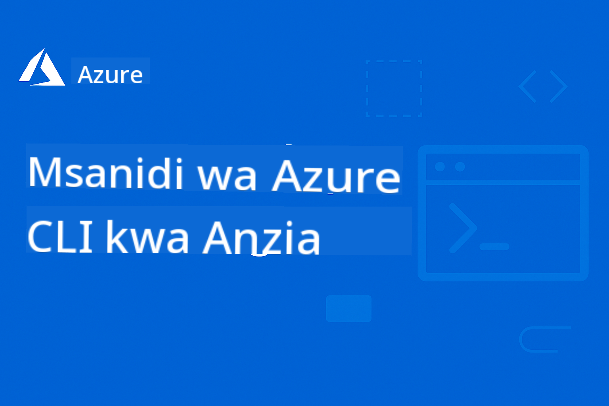

<!--
CO_OP_TRANSLATOR_METADATA:
{
  "original_hash": "6c3d0f9ef66c2cd692a55a2811d9c3e5",
  "translation_date": "2025-09-15T15:26:28+00:00",
  "source_file": "README.md",
  "language_code": "sw"
}
-->
# AZD Kwa Kompyuta

 

[](https://GitHub.com/microsoft/azd-for-beginners/watchers/)
[](https://GitHub.com/microsoft/azd-for-beginners/network/)
[](https://GitHub.com/microsoft/azd-for-beginners/stargazers/)

[](https://discord.gg/microsoft-azure)

[](https://discord.gg/kzRShWzttr)

Fuata hatua hizi kuanza kutumia rasilimali hizi:
1. **Fork Hifadhi**: Bonyeza [](https://GitHub.com/microsoft/azd-for-beginners/fork)
2. **Clone Hifadhi**:   `git clone https://github.com/microsoft/azd-for-beginners.git`
3. [**Jiunge na Jamii za Azure Discord na kutana na wataalamu na watengenezaji wenzako**](https://discord.com/invite/ByRwuEEgH4)

### Msaada wa Lugha Nyingi

#### Inasaidiwa kupitia GitHub Action (Imefanywa Kiotomatiki & Daima Imeboreshwa)

[French](../fr/README.md) | [Spanish](../es/README.md) | [German](../de/README.md) | [Russian](../ru/README.md) | [Arabic](../ar/README.md) | [Persian (Farsi)](../fa/README.md) | [Urdu](../ur/README.md) | [Chinese (Simplified)](../zh/README.md) | [Chinese (Traditional, Macau)](../mo/README.md) | [Chinese (Traditional, Hong Kong)](../hk/README.md) | [Chinese (Traditional, Taiwan)](../tw/README.md) | [Japanese](../ja/README.md) | [Korean](../ko/README.md) | [Hindi](../hi/README.md) | [Bengali](../bn/README.md) | [Marathi](../mr/README.md) | [Nepali](../ne/README.md) | [Punjabi (Gurmukhi)](../pa/README.md) | [Portuguese (Portugal)](../pt/README.md) | [Portuguese (Brazil)](../br/README.md) | [Italian](../it/README.md) | [Polish](../pl/README.md) | [Turkish](../tr/README.md) | [Greek](../el/README.md) | [Thai](../th/README.md) | [Swedish](../sv/README.md) | [Danish](../da/README.md) | [Norwegian](../no/README.md) | [Finnish](../fi/README.md) | [Dutch](../nl/README.md) | [Hebrew](../he/README.md) | [Vietnamese](../vi/README.md) | [Indonesian](../id/README.md) | [Malay](../ms/README.md) | [Tagalog (Filipino)](../tl/README.md) | [Swahili](./README.md) | [Hungarian](../hu/README.md) | [Czech](../cs/README.md) | [Slovak](../sk/README.md) | [Romanian](../ro/README.md) | [Bulgarian](../bg/README.md) | [Serbian (Cyrillic)](../sr/README.md) | [Croatian](../hr/README.md) | [Slovenian](../sl/README.md) | [Ukrainian](../uk/README.md) | [Burmese (Myanmar)](../my/README.md)

**Ikiwa unataka lugha za ziada ziongezwe, orodha ya lugha zinazosaidiwa inapatikana [hapa](https://github.com/Azure/co-op-translator/blob/main/getting_started/supported-languages.md)**

## Utangulizi

Karibu kwenye mwongozo wa kina wa Azure Developer CLI (azd). Hifadhi hii imeundwa kusaidia watengenezaji wa viwango vyote, kuanzia wanafunzi hadi wataalamu, kujifunza na kufahamu Azure Developer CLI kwa ajili ya usambazaji wa wingu kwa ufanisi, **kwa mkazo maalum kwenye usambazaji wa programu za AI kwa kutumia Azure AI Foundry**. Rasilimali hii ya kujifunza iliyopangwa inatoa uzoefu wa vitendo na usambazaji wa wingu la Azure, kutatua masuala ya kawaida, na kutekeleza mbinu bora kwa usambazaji wa templeti za AZD.

### **Kwa Nini Mwongozo Huu Ni Muhimu kwa Watengenezaji wa AI**
Kulingana na kura ya maoni ya jamii ya Azure AI Foundry Discord, **asilimia 45 ya watengenezaji wanavutiwa kutumia AZD kwa kazi za AI** lakini wanakumbana na changamoto zifuatazo:
- Miundombinu ya AI yenye huduma nyingi
- Mbinu bora za usambazaji wa AI kwa uzalishaji
- Ujumuishaji na usanidi wa huduma za Azure AI
- Uboreshaji wa gharama kwa kazi za AI
- Kutatua masuala maalum ya usambazaji wa AI

## Malengo ya Kujifunza

Kwa kufanya kazi kupitia hifadhi hii, utaweza:
- Kufahamu misingi ya Azure Developer CLI na dhana zake kuu
- Kujifunza kusambaza na kuandaa rasilimali za Azure kwa kutumia Infrastructure as Code
- Kuendeleza ujuzi wa kutatua masuala ya kawaida ya usambazaji wa AZD
- Kuelewa uthibitishaji kabla ya usambazaji na upangaji wa uwezo
- Kutekeleza mbinu bora za usalama na uboreshaji wa gharama
- Kujenga ujasiri wa kusambaza programu tayari kwa uzalishaji kwenye Azure

## Matokeo ya Kujifunza

Baada ya kukamilisha kozi hii, utaweza:
- Kufanikiwa kusakinisha, kusanidi, na kutumia Azure Developer CLI
- Kuunda na kusambaza programu kwa kutumia templeti za AZD
- Kutatua masuala ya uthibitishaji, miundombinu, na usambazaji
- Kufanya ukaguzi kabla ya usambazaji ikiwa ni pamoja na upangaji wa uwezo na uteuzi wa SKU
- Kutekeleza mbinu bora za ufuatiliaji, usalama, na usimamizi wa gharama
- Kujumuisha mtiririko wa kazi wa AZD kwenye mabomba ya CI/CD

## Jedwali la Maudhui

- [Azure Developer CLI ni Nini?](../..)
- [Kuanza Haraka](../..)
- [Njia ya Kujifunza](../..)
  - [Kwa Watengenezaji wa AI (Anza Hapa!)](../..)
  - [Kwa Wanafunzi & Kompyuta](../..)
  - [Kwa Watengenezaji](../..)
  - [Kwa Wahandisi wa DevOps](../..)
- [Nyaraka](../..)
  - [Kuanza](../..)
  - [Usambazaji & Uandaaji](../..)
  - [Ukaguzi Kabla ya Usambazaji](../..)
  - [AI & Azure AI Foundry](../..)
  - [Kutatua Masuala](../..)
- [Mifano & Templeti](../..)
  - [Iliyopendekezwa: Templeti za Azure AI Foundry](../..)
  - [Iliyopendekezwa: Matukio ya Azure AI Foundry E2E](../..)
  - [Templeti za Ziada za AZD](../..)
  - [Maabara ya Vitendo & Warsha](../..)
- [Rasilimali](../..)
- [Kuchangia](../..)
- [Msaada](../..)
- [Jamii](../..)

## Azure Developer CLI ni Nini?

Azure Developer CLI (azd) ni kiolesura cha mstari wa amri kinacholenga watengenezaji ambacho huongeza kasi ya mchakato wa kujenga na kusambaza programu kwenye Azure. Inatoa:

- **Usambazaji wa msingi wa templeti** - Tumia templeti zilizojengwa awali kwa mifumo ya kawaida ya programu
- **Infrastructure as Code** - Simamia rasilimali za Azure kwa kutumia Bicep au Terraform
- **Mtiririko wa kazi uliounganishwa** - Andaa, sambaza, na fuatilia programu kwa urahisi
- **Rafiki kwa watengenezaji** - Imeboreshwa kwa tija na uzoefu wa watengenezaji

### **AZD + Azure AI Foundry: Bora kwa Usambazaji wa AI**

**Kwa Nini AZD kwa Suluhisho za AI?** AZD hushughulikia changamoto kuu zinazowakumba watengenezaji wa AI:

- **Templeti Tayari kwa AI** - Templeti zilizosanidiwa awali kwa Azure OpenAI, Cognitive Services, na kazi za ML
- **Usambazaji Salama wa AI** - Mifumo ya usalama iliyojengwa ndani kwa huduma za AI, funguo za API, na vituo vya modeli
- **Mifumo ya AI kwa Uzalishaji** - Mbinu bora kwa usambazaji wa programu za AI zinazoweza kupanuka na za gharama nafuu
- **Mtiririko wa Kazi wa AI wa Mwisho hadi Mwisho** - Kuanzia maendeleo ya modeli hadi usambazaji wa uzalishaji na ufuatiliaji sahihi
- **Uboreshaji wa Gharama** - Mikakati ya ugawaji wa rasilimali na upanuzi wa akili kwa kazi za AI
- **Ujumuishaji wa Azure AI Foundry** - Muunganisho wa moja kwa moja na katalogi ya modeli ya AI Foundry na vituo vya mwisho

## Kuanza Haraka

### Mahitaji
- Usajili wa Azure
- Azure CLI imewekwa
- Git (kwa kuiga templeti)

### Usakinishaji
```bash
# Windows (PowerShell)
powershell -ex AllSigned -c "Invoke-RestMethod 'https://aka.ms/install-azd.ps1' | Invoke-Expression"

# macOS/Linux
curl -fsSL https://aka.ms/install-azd.sh | bash
```

### Usambazaji Wako wa Kwanza
```bash
# Initialize a new project
azd init --template todo-nodejs-mongo

# Provision Azure resources and deploy
azd up
```

### Usambazaji Wako wa Kwanza wa AI
```bash
# Initialize an AI-powered chat application with Azure OpenAI
azd init --template azure-search-openai-demo

# Configure AI services and deploy
azd up

# Or try other AI templates:
azd init --template openai-chat-app-quickstart
azd init --template ai-document-processing
azd init --template contoso-chat
```

## Njia ya Kujifunza

### Kwa Watengenezaji wa AI (Anza Hapa!)
1. **Kuanza Haraka**: Jaribu templeti ya [azure-search-openai-demo](https://github.com/Azure-Samples/azure-search-openai-demo)
2. **Jifunze Misingi**: [AZD Basics](docs/getting-started/azd-basics.md) + [Azure AI Foundry Integration](docs/ai-foundry/azure-ai-foundry-integration.md)
3. **Mazoezi ya Vitendo**: Kamilisha [AI Workshop Lab](docs/ai-foundry/ai-workshop-lab.md)
4. **Tayari kwa Uzalishaji**: Pitia [Production AI Best Practices](docs/ai-foundry/production-ai-practices.md)
5. **Ya Juu**: Sambaza templeti ya [contoso-chat](https://github.com/Azure-Samples/contoso-chat) ya biashara

### Kwa Wanafunzi & Kompyuta
1. Anza na [AZD Basics](docs/getting-started/azd-basics.md)
2. Fuata [Mwongozo wa Usakinishaji](docs/getting-started/installation.md)
3. Kamilisha [Mradi Wako wa Kwanza](docs/getting-started/first-project.md)
4. Fanya mazoezi na [Mfano Rahisi wa Programu ya Wavuti](../../examples/simple-web-app)

### Kwa Watengenezaji
1. Pitia [Mwongozo wa Usanidi](docs/getting-started/configuration.md)
2. Soma [Mwongozo wa Usambazaji](docs/deployment/deployment-guide.md)
3. Fanya kazi kupitia [Mfano wa Programu ya Hifadhidata](../../examples/database-app)
4. Chunguza [Mfano wa Programu ya Kontena](../../examples/container-app)

### Kwa Wahandisi wa DevOps
1. Fahamu [Uandaaji wa Rasilimali](docs/deployment/provisioning.md)
2. Tekeleza [Ukaguzi Kabla ya Usambazaji](docs/pre-deployment/preflight-checks.md)
3. Fanya mazoezi ya [Upangaji wa Uwezo](docs/pre-deployment/capacity-planning.md)
4. Ya Juu [Mfano wa Huduma Ndogo](../../examples/microservices)

## Nyaraka

### Kuanza
- [**AZD Basics**](docs/getting-started/azd-basics.md) - Dhana kuu na istilahi
- [**Usakinishaji & Usanidi**](docs/getting-started/installation.md) - Mwongozo wa usakinishaji maalum kwa jukwaa
- [**Usanidi**](docs/getting-started/configuration.md) - Usanidi wa mazingira na uthibitishaji
- [**Mradi Wako wa Kwanza**](docs/getting-started/first-project.md) - Mafunzo ya hatua kwa hatua

### Usambazaji & Uandaaji
- [**Mwongozo wa Usambazaji**](docs/deployment/deployment-guide.md) - Mtiririko kamili wa usambazaji
- [**Uandaaji wa Rasilimali**](docs/deployment/provisioning.md) - Usimamizi wa rasilimali za Azure

### Ukaguzi Kabla ya Usambazaji
- [**Upangaji wa Uwezo**](docs/pre-deployment/capacity-planning.md) - Uthibitishaji wa uwezo wa rasilimali za Azure
- [**Uteuzi wa SKU**](docs/pre-deployment/sku-selection.md) - Kuchagua SKU sahihi za Azure
- [**Ukaguzi Kabla ya Usambazaji**](docs/pre-deployment/preflight-checks.md) - Hati za uthibitishaji kiotomatiki

### AI & Azure AI Foundry
- [**Ujumuishaji wa Azure AI Foundry**](docs/ai-foundry/azure-ai-foundry-integration.md) - Unganisha AZD na huduma za Azure AI Foundry
- [**Mifumo ya Usambazaji wa Modeli za AI**](docs/ai-foundry/ai-model-deployment.md) - Sambaza na simamia modeli za AI kwa AZD
- [**Maabara ya Warsha ya AI**](docs/ai-foundry/ai-workshop-lab.md) - Maabara ya vitendo: Kufanya suluhisho za AI ziwe tayari kwa AZD
- [**Mbinu Bora za AI kwa Uzalishaji**](docs/ai-foundry/production-ai-practices.md) - Usalama, upanuzi, na ufuatiliaji wa kazi za AI

### Kutatua Masuala
- [**Masuala ya Kawaida**](docs/troubleshooting/common-issues.md) - Masuala yanayokutana mara kwa mara na suluhisho zake
- [**Mwongozo wa Kutatua Hitilafu**](docs/troubleshooting/debugging.md) - Mikakati ya hatua kwa hatua ya kutatua hitilafu  
- [**Kutatua Hitilafu za AI**](docs/troubleshooting/ai-troubleshooting.md) - Masuala ya huduma za AI na usambazaji wa mifano  

## Mifano na Violezo  

### [Kipengele: Violezo vya Azure AI Foundry](https://ai.azure.com/resource/build/templates)  
**Anza hapa ikiwa unapeleka programu za AI!**  

| Kiolezo | Maelezo | Ugumu | Huduma |  
|----------|-------------|------------|----------|  
| [**Anza na mazungumzo ya AI**](https://github.com/Azure-Samples/get-started-with-ai-chat) | Tengeneza na peleka programu ya msingi ya mazungumzo iliyojumuishwa na data yako na maarifa ya telemetry kwa kutumia Azure Container Apps |⭐⭐ | AzureOpenAI + Azure AI Model Inference API + Azure AI Search + Azure Container Apps + Application Insights |  
| [**Anza na mawakala wa AI**](https://github.com/Azure-Samples/get-started-with-ai-agents) | Tengeneza na peleka programu ya msingi ya wakala yenye vitendo na maarifa ya telemetry kwa kutumia Azure Container Apps. |⭐⭐ | Azure AI Agent Service + AzureOpenAI + Azure AI Search + Azure Container Apps + Application Insights|  
| [**Uendeshaji wa kazi wa mawakala wengi**](https://github.com/Azure-Samples/get-started-with-ai-chat) | Boresha upangaji wa kazi na uendeshaji kwa kuratibu na kusimamia kundi la mawakala wa AI.|⭐⭐⭐ | AzureOpenAI + Azure AI Agent Service + Semantic Kernel + Azure CosmosDB + Azure Container Apps|  
| [**Tengeneza nyaraka kutoka kwa data yako**](https://github.com/Azure-Samples/get-started-with-ai-chat) | Harakisha utayarishaji wa nyaraka kama mikataba, ankara na mapendekezo ya uwekezaji kwa kupata na kufupisha taarifa muhimu kutoka kwa data yako. |⭐⭐⭐  | AzureOpenAI + Azure AI Search + Azure AI Services + Azure CosmosDB|  
| [**Boresha mikutano ya wateja kwa mawakala**](https://github.com/Azure-Samples/get-started-with-ai-chat) | Hamisha msimbo wa zamani kwenda lugha za kisasa kwa kutumia timu ya mawakala. |⭐⭐⭐| AzureOpenAI + Azure AI Search + Azure CosmosDB + Azure SQL Database |  
| [**Boresha msimbo wako kwa mawakala**](https://github.com/Azure-Samples/get-started-with-ai-chat) | Tengeneza na peleka programu ya msingi ya mazungumzo iliyojumuishwa na data yako na maarifa ya telemetry kwa kutumia Azure Container Apps |⭐⭐⭐ | AzureOpenAI + Azure Agent Service + Semantic Kernel + Azure CosmosDB + Azure Container Apps|  
| [**Tengeneza wakala wako wa mazungumzo**](https://github.com/Azure-Samples/get-started-with-ai-chat) | Tumia uelewa wa hali ya juu wa mazungumzo kutengeneza na kuboresha chatbots na mawakala wenye mifumo inayodhibitiwa na binadamu. |⭐⭐⭐ | AI Language + AzureOpenAI + AI Search + Azure Storage + Azure Container Registry|  
| [**Fungua maarifa kutoka kwa data ya mazungumzo**](https://github.com/Azure-Samples/get-started-with-ai-chat) | Boresha ufanisi wa kituo cha mawasiliano kwa kugundua maarifa kutoka kwa seti kubwa za data za sauti na maandishi kwa kutumia uwezo wa hali ya juu wa uelewa wa maudhui. |⭐⭐⭐ | AzureOpenAI + AI Search + Semantic Kernel + Azure Agent Service + AI AI Content Understanding|  
| [**Usindikaji wa maudhui ya aina nyingi**](https://github.com/Azure-Samples/get-started-with-ai-chat) | Shughulikia madai, ankara, mikataba na nyaraka nyingine haraka na kwa usahihi kwa kutoa taarifa kutoka kwa maudhui yasiyo na muundo na kuyapanga katika muundo uliopangwa. Kiolezo hiki kinaunga mkono maandishi, picha, meza na grafu. |⭐⭐⭐⭐ | AzureOpenAI + Azure Content Understanding + Azure CosmosDB + Azure Container Apps|  

### Kipengele: Matukio ya Mwisho hadi Mwisho ya Azure AI Foundry  
**Anza hapa ikiwa unapeleka programu za AI!**  

| Kiolezo | Maelezo | Ugumu | Huduma |  
|----------|-------------|------------|----------|  
| [**openai-chat-app-quickstart**](https://github.com/Azure-Samples/openai-chat-app-quickstart) | Kiolesura rahisi cha mazungumzo na Azure OpenAI | ⭐ | AzureOpenAI + Container Apps |  
| [**azure-search-openai-demo**](https://github.com/Azure-Samples/azure-search-openai-demo) | Programu ya mazungumzo yenye RAG na Azure OpenAI | ⭐⭐ | AzureOpenAI + Search + App Service |  
| [**ai-document-processing**](https://github.com/Azure-Samples/ai-document-processing) | Uchambuzi wa nyaraka kwa huduma za AI | ⭐⭐ | Azure Document Intelligence + Functions |  
| [**agent-openai-python-prompty**](https://github.com/Azure-Samples/agent-openai-python-prompty) | Mfumo wa wakala wa AI na kupiga kazi | ⭐⭐⭐ | AzureOpenAI + Azure Container Apps + Functions |  
| [**contoso-chat**](https://github.com/Azure-Samples/contoso-chat) | Mazungumzo ya biashara na uratibu wa AI | ⭐⭐⭐ | AzureOpenAI + Azure AI Search + Container Apps |  

### Violezo vya Ziada vya AZD  
- [**Orodha ya Mifano**](examples/README.md) - Mifano ya vitendo, violezo, na matukio halisi  
- [**Violezo vya Azure-Samples AZD**](https://github.com/Azure-Samples/azd-templates) - Violezo rasmi vya sampuli za Microsoft  
- [**Jumba la Maonyesho la Awesome AZD**](https://azure.github.io/awesome-azd/) - Violezo vilivyotolewa na jamii  

### Maabara ya Vitendo na Warsha  
- [**Maabara ya Warsha ya AI**](docs/ai-foundry/ai-workshop-lab.md) - **MPYA**: Fanya suluhisho zako za AI ziweze kupelekwa na AZD  
- [**Warsha ya AZD kwa Kompyuta**](workshop/README.md) - Lenga usambazaji wa violezo vya wakala wa AI kwa AZD  

## Rasilimali  

### Marejeleo ya Haraka  
- [**Karatasi ya Amri**](resources/cheat-sheet.md) - Amri muhimu za azd  
- [**Kamusi**](resources/glossary.md) - Istilahi za Azure na azd  
- [**Maswali Yanayoulizwa Mara kwa Mara**](resources/faq.md) - Maswali yanayoulizwa mara kwa mara  
- [**Mwongozo wa Kujifunza**](resources/study-guide.md) - Malengo ya kina ya kujifunza na mazoezi ya vitendo  

### Rasilimali za Nje  
- [Hati za Azure Developer CLI](https://learn.microsoft.com/en-us/azure/developer/azure-developer-cli/)  
- [Kituo cha Usanifu wa Azure](https://learn.microsoft.com/en-us/azure/architecture/)  
- [Kikokotoo cha Bei za Azure](https://azure.microsoft.com/pricing/calculator/)  
- [Hali ya Azure](https://status.azure.com/)  

## Kuchangia  

Tunakaribisha michango! Tafadhali soma [Mwongozo wa Kuchangia](CONTRIBUTING.md) kwa maelezo kuhusu:  
- Jinsi ya kuwasilisha masuala na maombi ya vipengele  
- Miongozo ya kuchangia msimbo  
- Uboreshaji wa nyaraka  
- Viwango vya jamii  

## Usaidizi  

- **Masuala**: [Ripoti hitilafu na omba vipengele](https://github.com/microsoft/azd-for-beginners/issues)  
- **Mijadala**: [Maswali na majadiliano ya Jumuiya ya Microsoft Azure Discord](https://discord.gg/microsoft-azure)  
- **Usaidizi Maalum wa AI**: Jiunge na [#Azure channel](https://discord.gg/microsoft-azure) kwa mijadala ya AZD + AI Foundry  
- **Barua pepe**: Kwa maswali ya faragha  
- **Microsoft Learn**: [Hati rasmi za Azure Developer CLI](https://learn.microsoft.com/en-us/azure/developer/azure-developer-cli/)  

### Maarifa ya Jamii kutoka Discord ya Azure AI Foundry  

**Matokeo ya Kura kutoka #Azure Channel:**  
- **45%** ya wasanidi wanataka kutumia AZD kwa kazi za AI  
- **Changamoto kuu**: Usambazaji wa huduma nyingi, usimamizi wa sifa, utayari wa uzalishaji  
- **Ombi lililoombwa zaidi**: Violezo maalum vya AI, miongozo ya kutatua hitilafu, mbinu bora  

**Jiunge na jamii yetu ili:**  
- Kushiriki uzoefu wako wa AZD + AI na kupata msaada  
- Kupata hakikisho la mapema la violezo vipya vya AI  
- Kuchangia mbinu bora za usambazaji wa AI  
- Kushawishi maendeleo ya vipengele vya baadaye vya AI + AZD  

## Leseni  

Mradi huu umepewa leseni chini ya Leseni ya MIT - angalia faili ya [LICENSE](../../LICENSE) kwa maelezo.  

## Kozi Nyingine  

Timu yetu inazalisha kozi nyingine! Angalia:  

- [**MPYA** Itifaki ya Muktadha wa Mfano (MCP) kwa Kompyuta](https://github.com/microsoft/mcp-for-beginners?WT.mc_id=academic-105485-koreyst)  
- [Mawakala wa AI kwa Kompyuta](https://github.com/microsoft/ai-agents-for-beginners?WT.mc_id=academic-105485-koreyst)  
- [AI Jenereta kwa Kompyuta kwa kutumia .NET](https://github.com/microsoft/Generative-AI-for-beginners-dotnet?WT.mc_id=academic-105485-koreyst)  
- [AI Jenereta kwa Kompyuta](https://github.com/microsoft/generative-ai-for-beginners?WT.mc_id=academic-105485-koreyst)  
- [AI Jenereta kwa Kompyuta kwa kutumia Java](https://github.com/microsoft/generative-ai-for-beginners-java?WT.mc_id=academic-105485-koreyst)  
- [ML kwa Kompyuta](https://aka.ms/ml-beginners?WT.mc_id=academic-105485-koreyst)  
- [Sayansi ya Data kwa Kompyuta](https://aka.ms/datascience-beginners?WT.mc_id=academic-105485-koreyst)  
- [AI kwa Kompyuta](https://aka.ms/ai-beginners?WT.mc_id=academic-105485-koreyst)  
- [Usalama wa Mtandao kwa Kompyuta](https://github.com/microsoft/Security-101??WT.mc_id=academic-96948-sayoung)  
- [Maendeleo ya Wavuti kwa Kompyuta](https://aka.ms/webdev-beginners?WT.mc_id=academic-105485-koreyst)  
- [IoT kwa Kompyuta](https://aka.ms/iot-beginners?WT.mc_id=academic-105485-koreyst)  
- [Maendeleo ya XR kwa Kompyuta](https://github.com/microsoft/xr-development-for-beginners?WT.mc_id=academic-105485-koreyst)  
- [Kumudu GitHub Copilot kwa Uandishi wa Programu wa Pamoja wa AI](https://aka.ms/GitHubCopilotAI?WT.mc_id=academic-105485-koreyst)  
- [Kumudu GitHub Copilot kwa Wasanidi wa C#/.NET](https://github.com/microsoft/mastering-github-copilot-for-dotnet-csharp-developers?WT.mc_id=academic-105485-koreyst)  
- [Chagua Safari Yako ya Copilot](https://github.com/microsoft/CopilotAdventures?WT.mc_id=academic-105485-koreyst)  

---

**Urambazaji**  
- **Somo Linalofuata**: [Misingi ya AZD](docs/getting-started/azd-basics.md)  

---

**Kanusho**:  
Hati hii imetafsiriwa kwa kutumia huduma ya tafsiri ya AI [Co-op Translator](https://github.com/Azure/co-op-translator). Ingawa tunajitahidi kuhakikisha usahihi, tafsiri za kiotomatiki zinaweza kuwa na makosa au kutokuwa sahihi. Hati ya asili katika lugha yake ya awali inapaswa kuchukuliwa kama chanzo cha mamlaka. Kwa taarifa muhimu, tafsiri ya kitaalamu ya binadamu inapendekezwa. Hatutawajibika kwa kutoelewana au tafsiri zisizo sahihi zinazotokana na matumizi ya tafsiri hii.