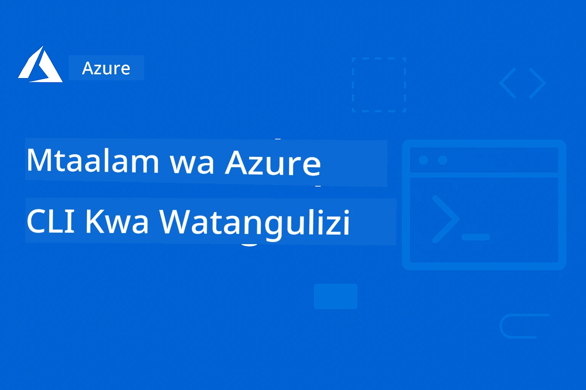

# AZD Kwa Waanzaji: Safari ya Kujifunza Iliyopangwa

 

[](https://GitHub.com/microsoft/azd-for-beginners/watchers/)
[](https://GitHub.com/microsoft/azd-for-beginners/network/)
[](https://GitHub.com/microsoft/azd-for-beginners/stargazers/)

[](https://discord.gg/microsoft-azure)
[](https://discord.gg/nTYy5BXMWG)

---

### Tafsiri za Kiotomatiki (Daima Zinazosasishwa)

<!-- CO-OP TRANSLATOR LANGUAGES TABLE START -->
[Arabic](../ar/README.md) | [Bengali](../bn/README.md) | [Bulgarian](../bg/README.md) | [Burmese (Myanmar)](../my/README.md) | [Chinese (Simplified)](../zh-CN/README.md) | [Chinese (Traditional, Hong Kong)](../zh-HK/README.md) | [Chinese (Traditional, Macau)](../zh-MO/README.md) | [Chinese (Traditional, Taiwan)](../zh-TW/README.md) | [Croatian](../hr/README.md) | [Czech](../cs/README.md) | [Danish](../da/README.md) | [Dutch](../nl/README.md) | [Estonian](../et/README.md) | [Finnish](../fi/README.md) | [French](../fr/README.md) | [German](../de/README.md) | [Greek](../el/README.md) | [Hebrew](../he/README.md) | [Hindi](../hi/README.md) | [Hungarian](../hu/README.md) | [Indonesian](../id/README.md) | [Italian](../it/README.md) | [Japanese](../ja/README.md) | [Kannada](../kn/README.md) | [Korean](../ko/README.md) | [Lithuanian](../lt/README.md) | [Malay](../ms/README.md) | [Malayalam](../ml/README.md) | [Marathi](../mr/README.md) | [Nepali](../ne/README.md) | [Nigerian Pidgin](../pcm/README.md) | [Norwegian](../no/README.md) | [Persian (Farsi)](../fa/README.md) | [Polish](../pl/README.md) | [Portuguese (Brazil)](../pt-BR/README.md) | [Portuguese (Portugal)](../pt-PT/README.md) | [Punjabi (Gurmukhi)](../pa/README.md) | [Romanian](../ro/README.md) | [Russian](../ru/README.md) | [Serbian (Cyrillic)](../sr/README.md) | [Slovak](../sk/README.md) | [Slovenian](../sl/README.md) | [Spanish](../es/README.md) | [Kiswahili](./README.md) | [Swedish](../sv/README.md) | [Tagalog (Filipino)](../tl/README.md) | [Tamil](../ta/README.md) | [Telugu](../te/README.md) | [Thai](../th/README.md) | [Turkish](../tr/README.md) | [Ukrainian](../uk/README.md) | [Urdu](../ur/README.md) | [Vietnamese](../vi/README.md)

> **Unapendelea Kukopa Kwenye Mkononi?**
>
> Hazina hii ina tafsiri zaidi ya lugha 50, ambazo zinaongeza kiasi cha kupakua. Ili kukopa bila tafsiri, tumia sparse checkout:
>
> **Bash / macOS / Linux:**
> ```bash
> git clone --filter=blob:none --sparse https://github.com/microsoft/AZD-for-beginners.git
> cd AZD-for-beginners
> git sparse-checkout set --no-cone '/*' '!translations' '!translated_images'
> ```
>
> **CMD (Windows):**
> ```cmd
> git clone --filter=blob:none --sparse https://github.com/microsoft/AZD-for-beginners.git
> cd AZD-for-beginners
> git sparse-checkout set --no-cone "/*" "!translations" "!translated_images"
> ```
>
> Hii inakupa kila kitu unachohitaji kumaliza kozi kwa upakuaji wa haraka zaidi.
<!-- CO-OP TRANSLATOR LANGUAGES TABLE END -->

## 🆕 Nini Kipya katika azd Leo

Azure Developer CLI imekua zaidi ya programu za wavuti za jadi na API. Leo, azd ni chombo kimoja cha kupeleka programu yoyote kwa Azure—ikiwa ni pamoja na programu zilizoendeshwa na AI na maajenti wenye akili.

Hapa ni nini inamaanisha kwako:

- **Maajenti ya AI sasa ni mizigo za kwanza-class kwa azd.** Unaweza kuanzisha, kupeleka, na kusimamia miradi ya maajenti ya AI ukitumia mchakato ule ule wa `azd init` → `azd up` ambao tayari unaufahamu.
- **Uunganisho wa Microsoft Foundry** unaleta uzinduzi wa modeli, uendeshaji/hosting wa maajenti, na usanidi wa huduma za AI moja kwa moja ndani ya ekosistimu ya templeti za azd.
- **Mchakato wa msingi haujabadilika.** Iwe unapeleka programu ya todo, microservice, au suluhisho la AI lenye maajenti wengi, amri zinaendelea kuwa zile zile.

Kama umewahi kutumia azd kabla, msaada wa AI ni nyongeza ya kiasili—si chombo tofauti au njia ya hali ya juu. Ukiwa unaanza mpya, utajifunza mchakato mmoja unaofanya kazi kwa kila kitu.

---

## 🚀 Azure Developer CLI (azd) ni nini?

**Azure Developer CLI (azd)** ni chombo cha mstari wa amri kinachofaa kwa waendelezaji ambacho kinafanya iwe rahisi kupeleka programu kwenye Azure. Badala ya kuunda na kuunganisha kwa mikono rasilimali nyingi za Azure, unaweza kupeleka programu nzima kwa amri moja.

### Uchawi wa `azd up`

```bash
# Amri hii moja hufanya kila kitu:
# ✅ Inaunda rasilimali zote za Azure
# ✅ Inapanga mtandao na usalama
# ✅ Inajenga msimbo wa programu yako
# ✅ Inawekwa kwenye Azure
# ✅ Inakupa URL inayofanya kazi
azd up
```

**Hivyo ndivyo!** Hakuna kubofya kwenye Azure Portal, hakuna templeti tata za ARM za kujifunza kwanza, hakuna usanidi wa mkono - programu zinazofanya kazi tu kwenye Azure.

---

## ❓ Azure Developer CLI dhidi ya Azure CLI: Je, Tofauti Iko Nini?

Hili ndilo swali linaloulizwa zaidi na wanaoanza. Hapa ni jibu rahisi:

| Kipengele | **Azure CLI (`az`)** | **Azure Developer CLI (`azd`)** |
|---------|---------------------|--------------------------------|
| **Madhumuni** | Dhibiti rasilimali za Azure mmoja mmoja | Zindua programu kamili |
| **Mtazamo** | Inajikita kwenye miundombinu | Inajikita kwenye programu |
| **Mfano** | `az webapp create --name myapp...` | `azd up` |
| **Muda wa Kujifunza** | Inahitaji kujua huduma za Azure | Jua tu programu yako |
| **Bora Kwa** | DevOps, Miundombinu | Waendelezaji, Uundaji wa mifano |

### Mfano Rahisi

- **Azure CLI** ni kama kuwa na zana zote za kujenga nyumba - nyundo, msumari, msumeno. Unaweza kujenga chochote, lakini unahitaji kujua ujenzi.
- **Azure Developer CLI** ni kama kumtumia mkandarasi - unaelezea unachotaka, na wao wanashughulikia ujenzi.

### Wakati wa Kutumia Kila Moja

| Senario | Tumia Hili |
|----------|----------|
| "Nataka kupeleka app yangu ya wavuti haraka" | `azd up` |
| "Nahitaji kuunda akaunti ya kuhifadhi tu" | `az storage account create` |
| "Ninaunda programu kamili ya AI" | `azd init --template azure-search-openai-demo` |
| "Nahitaji kufuatilia rasilimali maalum ya Azure" | `az resource show` |
| "Nataka uenezaji tayari kwa uzalishaji kwa dakika" | `azd up --environment production` |

### Hufanya Kazi Pamoja!

AZD inatumia Azure CLI nyuma ya pazia. Unaweza kutumia zote mbili:
```bash
# Tuma programu yako kwa AZD
azd up

# Kisha rekebisha rasilimali maalum kwa Azure CLI
az webapp config set --name myapp --always-on true
```

---

## 🌟 Pata Templeti katika Awesome AZD

Usianze kutoka mwanzo! **Awesome AZD** ni mkusanyiko wa jumuiya wa templeti zilizotayarishwa kwa ajili ya kupelekwa mara moja:

| Rasilimali | Maelezo |
|----------|-------------|
| 🔗 [**Awesome AZD Gallery**](https://azure.github.io/awesome-azd/) | Pitia templeti 200+ na uendeleze kwa bonyeza moja |
| 🔗 [**Submit a Template**](https://github.com/Azure/awesome-azd/issues) | Changia templeti yako mwenyewe kwa jamii |
| 🔗 [**GitHub Repository**](https://github.com/Azure/awesome-azd) | Weka nyota na chunguza chanzo |

### Templeti Maarufu za AI kutoka Awesome AZD

```bash
# Mazungumzo ya RAG na Miundo ya Microsoft Foundry + Utafutaji wa AI
azd init --template azure-search-openai-demo

# Programu ya Mazungumzo ya AI ya Haraka
azd init --template openai-chat-app-quickstart

# Wakala wa AI na Wakala wa Foundry
azd init --template get-started-with-ai-agents
```

---

## 🎯 Kuanzia katika Hatua 3

### Hatua ya 1: Sakinisha AZD (dakika 2)

**Windows:**
```powershell
winget install microsoft.azd
```

**macOS:**
```bash
brew tap azure/azd && brew install azd
```

**Linux:**
```bash
curl -fsSL https://aka.ms/install-azd.sh | bash
```

### Hatua ya 2: Ingia kwenye Azure

```bash
azd auth login
```

### Hatua ya 3: Zindua Programu Yako ya Kwanza

```bash
# Anzisha kutoka kwa kiolezo
azd init --template todo-nodejs-mongo

# Tuma kwenye Azure (huunda kila kitu!)
azd up
```

**🎉 Hivyo ndivyo!** Programu yako sasa iko mtandaoni kwenye Azure.

### Safisha (Usisahau!)

```bash
# Remove all resources when done experimenting
azd down --force --purge
```

---

## 📚 Jinsi ya Kutumia Kozi Hii

Kozi hii imeundwa kwa ajili ya **ujifunzaji wa hatua kwa hatua** - anza mahali unapojisikia vizuri na endelea hadi juu:

| Uzoefu Wako | Anza Hapa |
|-----------------|------------|
| **Mpya kabisa kwa Azure** | [Chapter 1: Foundation](#-chapter-1-foundation--quick-start) |
| **Unajua Azure, mpya kwa AZD** | [Chapter 1: Foundation](#-chapter-1-foundation--quick-start) |
| **Unataka kupeleka programu za AI** | [Chapter 2: AI-First Development](#-chapter-2-ai-first-development-recommended-for-ai-developers) |
| **Unataka mazoezi ya vitendo** | [🎓 Interactive Workshop](workshop/README.md) - maabara ya kuongozwa ya masaa 3-4 |
| **Unahitaji mifumo ya uzalishaji** | [Chapter 8: Production & Enterprise](#-chapter-8-production--enterprise-patterns) |

### Usanidi wa Haraka

1. **Fanya fork ya hazina hii**: [](https://GitHub.com/microsoft/azd-for-beginners/fork)
2. **Nakili (Clone):** `git clone https://github.com/YOUR-USERNAME/azd-for-beginners.git`
3. **Pata Msaada:** [Azure Discord Community](https://discord.com/invite/ByRwuEEgH4)

> **Unapendelea Kukopa Kwenye Mkononi?**

> Hazina hii ina tafsiri zaidi ya lugha 50, ambazo zinaongeza kiasi cha kupakua. Ili kukopa bila tafsiri, tumia sparse checkout:
> ```bash
> git clone --filter=blob:none --sparse https://github.com/microsoft/AZD-for-beginners.git
> cd AZD-for-beginners
> git sparse-checkout set --no-cone '/*' '!translations' '!translated_images'
> ```
> Hii inakupa kila kitu unachohitaji kumaliza kozi kwa upakuaji wa haraka zaidi.


## Muhtasari wa Kozi

Tawala Azure Developer CLI (azd) kupitia sura zilizopangwa kwa kujifunza hatua kwa hatua. **Mkazo maalum kwenye uenezaji wa programu za AI kwa ushirikiano wa Microsoft Foundry.**

### Kwa Nini Kozi Hii ni Muhimu kwa Waendelezaji wa Kisasa

Kulingana na maoni ya jumuiya ya Discord ya Microsoft Foundry, **45% ya waendelezaji wanataka kutumia AZD kwa mzigo wa AI** lakini wanakutana na changamoto za:
- Mimarisha tata ya huduma nyingi za AI
- Mazoezi bora ya uenezaji wa AI kwa uzalishaji  
- Uunganishaji na usanidi wa huduma za AI za Azure
- Uboreshaji wa gharama kwa mzigo wa AI
- Utatuzi wa matatizo maalum ya uenezaji wa AI

### Malengo ya Kujifunza

Baada ya kumaliza kozi hii iliyopangwa, utakuwa na uwezo wa:
- **Tawala Misingi ya AZD**: Dhana za msingi, usakinishaji, na usanidi
- **Zindua Programu za AI**: Tumia AZD na huduma za Microsoft Foundry
- **Tekeleza Miundombinu kama Msimbo**: Dhibiti rasilimali za Azure kwa templeti za Bicep
- **Tatua Matatizo ya Uenezaji**: Rekebisha masuala ya kawaida na debug
- **Boresha kwa Uzalishaji**: Usalama, upanuzi, ufuatiliaji, na usimamizi wa gharama
- **Jenga Suluhisho za Maajenti Wengi**: Zindua miundo tata ya AI

## 🗺️ Ramani ya Kozi: Urambazaji wa Haraka kwa Sura

Kila sura ina README ya kujitolea yenye malengo ya kujifunza, kuanza haraka, na mazoezi:

| Sura | Mada | Masomo | Muda | Ugumu |
|---------|-------|---------|----------|------------|
| **[Ch 1: Foundation](docs/chapter-01-foundation/README.md)** | Kuanzia | [AZD Basics](docs/chapter-01-foundation/azd-basics.md) &#124; [Installation](docs/chapter-01-foundation/installation.md) &#124; [First Project](docs/chapter-01-foundation/first-project.md) | 30-45 min | ⭐ |
| **[Sura 2: Maendeleo ya AI](docs/chapter-02-ai-development/README.md)** | Programu za Kwanza za AI | [Uunganishaji wa Foundry](docs/chapter-02-ai-development/microsoft-foundry-integration.md) &#124; [Wakala za AI](docs/chapter-02-ai-development/agents.md) &#124; [Utekelezaji wa Modeli](docs/chapter-02-ai-development/ai-model-deployment.md) &#124; [Warsha](docs/chapter-02-ai-development/ai-workshop-lab.md) | 1-2 saa | ⭐⭐ |
| **[Sura 3: Usanidi](docs/chapter-03-configuration/README.md)** | Uthibitishaji & Usalama | [Usanidi](docs/chapter-03-configuration/configuration.md) &#124; [Uthibitishaji & Usalama](docs/chapter-03-configuration/authsecurity.md) | 45-60 dakika | ⭐⭐ |
| **[Sura 4: Miundombinu](docs/chapter-04-infrastructure/README.md)** | IaC & Utekelezaji | [Mwongozo wa Utekelezaji](docs/chapter-04-infrastructure/deployment-guide.md) &#124; [Upangaji Rasilimali](docs/chapter-04-infrastructure/provisioning.md) | 1-1.5 saa | ⭐⭐⭐ |
| **[Sura 5: Wakala Wengi](docs/chapter-05-multi-agent/README.md)** | Suluhisho za Wakala wa AI | [Mfano wa Rejareja](examples/retail-scenario.md) &#124; [Mifumo ya Uratibu](docs/chapter-06-pre-deployment/coordination-patterns.md) | 2-3 saa | ⭐⭐⭐⭐ |
| **[Sura 6: Kabla ya Utekelezaji](docs/chapter-06-pre-deployment/README.md)** | Mipango & Uthibitishaji | [Vikaguzi vya Kabla ya Uzinduzi](docs/chapter-06-pre-deployment/preflight-checks.md) &#124; [Mipango ya Uwezo](docs/chapter-06-pre-deployment/capacity-planning.md) &#124; [Uteuzi wa SKU](docs/chapter-06-pre-deployment/sku-selection.md) &#124; [App Insights](docs/chapter-06-pre-deployment/application-insights.md) | 1 saa | ⭐⭐ |
| **[Sura 7: Utatuzi wa Matatizo](docs/chapter-07-troubleshooting/README.md)** | Kukagua & Rekebisha | [Masuala ya Kawaida](docs/chapter-07-troubleshooting/common-issues.md) &#124; [Uchambuzi wa Hitilafu](docs/chapter-07-troubleshooting/debugging.md) &#124; [Masuala ya AI](docs/chapter-07-troubleshooting/ai-troubleshooting.md) | 1-1.5 saa | ⭐⭐ |
| **[Sura 8: Uzalishaji](docs/chapter-08-production/README.md)** | Mifumo ya Kampuni | [Mazingira ya Uzalishaji](docs/chapter-08-production/production-ai-practices.md) | 2-3 saa | ⭐⭐⭐⭐ |
| **[🎓 Warsha](workshop/README.md)** | Maabara ya Vitendo | [Utangulizi](workshop/docs/instructions/0-Introduction.md) &#124; [Uchaguzi](workshop/docs/instructions/1-Select-AI-Template.md) &#124; [Uthibitishaji](workshop/docs/instructions/2-Validate-AI-Template.md) &#124; [Uchambuzi](workshop/docs/instructions/3-Deconstruct-AI-Template.md) &#124; [Usanidi](workshop/docs/instructions/4-Configure-AI-Template.md) &#124; [Marekebisho](workshop/docs/instructions/5-Customize-AI-Template.md) &#124; [Kuvunja Miundombinu](workshop/docs/instructions/6-Teardown-Infrastructure.md) &#124; [Hitimisho](workshop/docs/instructions/7-Wrap-up.md) | 3-4 saa | ⭐⭐ |

**Jumla ya Muddo wa Kozi:** ~10-14 saa | **Maendeleo ya Ujuzi:** Mwanzo → Tayari kwa Uzalishaji

---

## 📚 Sura za Kujifunza

*Chagua njia yako ya kujifunza kulingana na kiwango cha uzoefu na malengo*

### 🚀 Sura 1: Msingi & Anza kwa Haraka
**Masharti ya awali**: Usajili wa Azure, ujuzi wa msingi wa mistari ya amri  
**Muda**: 30-45 dakika  
**Ugumu**: ⭐

#### Utajifunza
- Kuelewa misingi ya Azure Developer CLI
- Kufunga AZD kwenye jukwaa lako
- Utekelezaji wako wa kwanza uliofanikiwa

#### Rasilimali za Kujifunza
- **🎯 Anza Hapa**: [Nini ni Azure Developer CLI?](#what-is-azure-developer-cli)
- **📖 Nadharia**: [Misingi ya AZD](docs/chapter-01-foundation/azd-basics.md) - Dhana kuu na istilahi
- **⚙️ Utekelezaji**: [Usakinishaji & Usanidi](docs/chapter-01-foundation/installation.md) - Mwongozo maalum kwa jukwaa
- **🛠️ Vitendo**: [Mradi Wako wa Kwanza](docs/chapter-01-foundation/first-project.md) - Mwongozo hatua kwa hatua
- **📋 Marejeo ya Haraka**: [Karatasi ya Amri](resources/cheat-sheet.md)

#### Mazoezi ya Vitendo
```bash
# Uhakiki wa haraka wa usakinishaji
azd version

# Sambaza programu yako ya kwanza
azd init --template todo-nodejs-mongo
azd up
```

**💡 Matokeo ya Sura**: Kufanikiwa kupeleka programu rahisi ya wavuti kwenye Azure ukitumia AZD

**✅ Uthibitisho wa Mafanikio:**
```bash
# Baada ya kumaliza Sura ya 1, unapaswa kuwa na uwezo wa:
azd version              # Inaonyesha toleo lililosakinishwa
azd init --template todo-nodejs-mongo  # Inaanzisha mradi
azd up                  # Inaweka kwenye Azure
azd show                # Inaonyesha URL ya programu inayokimbia
# Programu inafunguka kwenye kivinjari na inafanya kazi
azd down --force --purge  # Inafuta rasilimali
```

**📊 Muda unaohitajika:** 30-45 dakika  
**📈 Kiwango cha Ujuzi Baada:** Inaweza kupeleka programu za msingi kwa kujitegemea
**📈 Kiwango cha Ujuzi Baada:** Inaweza kupeleka programu za msingi kwa kujitegemea

---

### 🤖 Sura 2: Maendeleo ya AI-Kwanza (Inayopendekezwa kwa Waendelezaji wa AI)
**Masharti ya awali**: Sura ya 1 imekamilika  
**Muda**: 1-2 saa  
**Ugumu**: ⭐⭐

#### Utajifunza
- Uunganishaji wa Microsoft Foundry na AZD
- Kupeleka programu zinazoendeshwa na AI
- Kuelewa usanidi wa huduma za AI

#### Rasilimali za Kujifunza
- **🎯 Anza Hapa**: [Uunganishaji wa Microsoft Foundry](docs/chapter-02-ai-development/microsoft-foundry-integration.md)
- **🤖 Wakala za AI**: [Mwongozo wa Wakala za AI](docs/chapter-02-ai-development/agents.md) - Peleka wakaala wenye akili kwa kutumia AZD
- **📖 Mifano**: [Utekelezaji wa Modeli za AI](docs/chapter-02-ai-development/ai-model-deployment.md) - Peleka na simamia modeli za AI
- **🛠️ Warsha**: [AI Workshop Lab](docs/chapter-02-ai-development/ai-workshop-lab.md) - Fanya suluhisho zako za AI ziwe tayari kwa AZD
- **🎥 Mwongozo wa Intaraksheni**: [Workshop Materials](workshop/README.md) - Kujifunza kupitia kivinjari na MkDocs * DevContainer Environment
- **📋 Violezo**: [Microsoft Foundry Templates](#rasilimali-za-warsha)
- **📝 Mifano**: [AZD Deployment Examples](examples/README.md)

#### Mazoezi ya Vitendo
```bash
# Zindua programu yako ya kwanza ya AI
azd init --template azure-search-openai-demo
azd up

# Jaribu templeti za ziada za AI
azd init --template openai-chat-app-quickstart
azd init --template agent-openai-python-prompty
```

**💡 Matokeo ya Sura**: Peleka na sanidi programu ya mazungumzo inayotumia AI yenye uwezo wa RAG

**✅ Uthibitisho wa Mafanikio:**
```bash
# Baada ya Sura ya 2, unapaswa kuwa na uwezo wa:
azd init --template azure-search-openai-demo
azd up
# Kujaribu kiolesura cha mazungumzo cha AI
# Uliza maswali na upate majibu ya AI yanayojumuisha vyanzo
# Thibitisha kuwa ujumuishaji wa utafutaji unafanya kazi
azd monitor  # Angalia Application Insights inaonyesha telemetry
azd down --force --purge
```

**📊 Muda unaohitajika:** 1-2 saa  
**📈 Kiwango cha Ujuzi Baada:** Inaweza kupeleka na kusanidi programu za AI zenye ufanisi kwa uzalishaji  
**💰 Ufahamu wa Gharama:** Elewa gharama za maendeleo $80-150/month, gharama za uzalishaji $300-3500/month

#### 💰 Mambo ya Gharama kwa Utekelezaji wa AI

**Mazingira ya Maendeleo (Kadiria $80-150/month):**
- Microsoft Foundry Models (Lipa-kama-unavyotumia): $0-50/month (based on token usage)
- AI Search (Basic tier): $75/month
- Container Apps (Consumption): $0-20/month
- Storage (Standard): $1-5/month

**Mazingira ya Uzalishaji (Kadiria $300-3,500+/month):**
- Microsoft Foundry Models (PTU for consistent performance): $3,000+/month OR Pay-as-go with high volume
- AI Search (Standard tier): $250/month
- Container Apps (Dedicated): $50-100/month
- Application Insights: $5-50/month
- Storage (Premium): $10-50/month

**💡 Vidokezo vya Kupunguza Gharama:**
- Tumia **Free Tier** Microsoft Foundry Models kwa kujifunza (Azure OpenAI 50,000 tokens/month included)
- Endesha `azd down` ili kuondoa rasilimali wakati hauko katika maendeleo
- Anza na bili inayotegemea matumizi, boresha hadi PTU tu kwa uzalishaji
- Tumia `azd provision --preview` kukisia gharama kabla ya utekelezaji
- Washa auto-scaling: lipa tu kwa matumizi halisi

**Ufuatiliaji wa Gharama:**
```bash
# Angalia makadirio ya gharama za kila mwezi
azd provision --preview

# Fuatilia gharama halisi katika Portal ya Azure
az consumption budget list --resource-group <your-rg>
```

---

### ⚙️ Sura 3: Usanidi & Uthibitishaji
**Masharti ya awali**: Sura ya 1 imekamilika  
**Muda**: 45-60 dakika  
**Ugumu**: ⭐⭐

#### Utajifunza
- Usanidi na usimamizi wa mazingira
- Mbinu bora za uthibitishaji na usalama
- Ujina wa rasilimali na upangaji

#### Rasilimali za Kujifunza
- **📖 Usanidi**: [Mwongozo wa Usanidi](docs/chapter-03-configuration/configuration.md) - Upangaji wa mazingira
- **🔐 Usalama**: [Mifumo ya uthibitishaji na utambulisho uliosimamiwa](docs/chapter-03-configuration/authsecurity.md) - Mifumo ya uthibitishaji
- **📝 Mifano**: [Mfano wa Programu ya Hifadhidata](examples/database-app/README.md) - Mifano ya Hifadhidata za AZD

#### Mazoezi ya Vitendo
- Sanidi mazingira mengi (dev, staging, prod)
- Tengeneza uthibitishaji kwa utambulisho uliosimamiwa
- Tekeleza usanidi maalum kwa mazingira

**💡 Matokeo ya Sura**: Dhibiti mazingira mengi kwa uthibitishaji na usalama sahihi

---

### 🏗️ Sura 4: Miundombinu kama Msimbo & Utekelezaji
**Masharti ya awali**: Sura 1-3 zimekamilika  
**Muda**: 1-1.5 saa  
**Ugumu**: ⭐⭐⭐

#### Utajifunza
- Mifumo ya juu ya utekelezaji
- Miundombinu kama Msimbo kwa kutumia Bicep
- Mikakati ya upangaji rasilimali

#### Rasilimali za Kujifunza
- **📖 Utekelezaji**: [Mwongozo wa Utekelezaji](docs/chapter-04-infrastructure/deployment-guide.md) - Mipangilio kamili ya kazi
- **🏗️ Upangaji Rasilimali**: [Provisioning Resources](docs/chapter-04-infrastructure/provisioning.md) - Usimamizi wa rasilimali za Azure
- **📝 Mifano**: [Container App Example](../../examples/container-app) - Utekelezaji uliowekwa ndani ya kontena

#### Mazoezi ya Vitendo
- Tengeneza templeti maalum za Bicep
- Peleka programu zenye huduma nyingi
- Tekeleza mikakati ya ueneaji wa blue-green

**💡 Matokeo ya Sura**: Peleka programu changamano zenye huduma nyingi kwa kutumia templeti za miundombinu zilizobinafsishwa

---

### 🎯 Sura 5: Suluhisho za AI za Wakala Wengi (Kiwango cha Juu)
**Masharti ya awali**: Sura 1-2 zimekamilika  
**Muda**: 2-3 saa  
**Ugumu**: ⭐⭐⭐⭐

#### Utajifunza
- Mifumo ya usanifu wa wakala wengi
- Uratibu na upangaji wa wakala
- Utekelezaji wa AI uliotayarishwa kwa uzalishaji

#### Rasilimali za Kujifunza
- **🤖 Mradi Ulioangaziwa**: [Retail Multi-Agent Solution](examples/retail-scenario.md) - Utekelezaji kamili
- **🛠️ Templeti za ARM**: [ARM Template Package](../../examples/retail-multiagent-arm-template) - Utekelezaji kwa bonyeza moja
- **📖 Usanifu**: [Multi-agent coordination patterns](docs/chapter-06-pre-deployment/coordination-patterns.md) - Mifano

#### Mazoezi ya Vitendo
```bash
# Sambaza suluhisho kamili la rejareja la mawakala wengi
cd examples/retail-multiagent-arm-template
./deploy.sh

# Chunguza usanidi wa mawakala
az deployment group show --resource-group <rg-name> --name <deployment-name>
```

**💡 Matokeo ya Sura**: Peleka na simamia suluhisho la AI la wakala wengi linalotayarishwa kwa uzalishaji lenye wakala wa Mteja na Hifadhi

---

### 🔍 Sura 6: Uthibitishaji & Mipango kabla ya Utekelezaji
**Masharti ya awali**: Sura 4 imekamilika  
**Muda**: 1 saa  
**Ugumu**: ⭐⭐

#### Utajifunza
- Mipango ya uwezo na uthibitishaji wa rasilimali
- Mikakati ya uchaguzi wa SKU
- Vikaguzi vya kabla ya uzinduzi na uendeshaji wa otomatiki

#### Rasilimali za Kujifunza
- **📊 Mipango**: [Capacity Planning](docs/chapter-06-pre-deployment/capacity-planning.md) - Uthibitishaji wa rasilimali
- **💰 Uchaguzi**: [SKU Selection](docs/chapter-06-pre-deployment/sku-selection.md) - Chaguo za gharama nafuu
- **✅ Uthibitishaji**: [Pre-flight Checks](docs/chapter-06-pre-deployment/preflight-checks.md) - Skiripti za otomatiki

#### Mazoezi ya Vitendo
- Endesha skiripti za uthibitishaji wa uwezo
- Boresha uchaguzi wa SKU kwa gharama
- Tekeleza vikaguzi vya otomatiki kabla ya utekelezaji

**💡 Matokeo ya Sura**: Thibitisha na boresha utekelezaji kabla ya kutekeleza

---

### 🚨 Sura 7: Utatuzi wa Matatizo & Uchambuzi wa Hitilafu
**Masharti ya awali**: Ibara yoyote ya utekelezaji imekamilika  
**Muda**: 1-1.5 saa  
**Ugumu**: ⭐⭐

#### Utajifunza
- Mbinu za kimfumo za uchambuzi wa hitilafu
- Masuala ya kawaida na suluhisho
- Utatuzi wa matatizo maalum ya AI

#### Rasilimali za Kujifunza
- **🔧 Masuala ya Kawaida**: [Common Issues](docs/chapter-07-troubleshooting/common-issues.md) - Maswali yanayoulizwa mara kwa mara na suluhisho
- **🕵️ Uchambuzi wa Hitilafu**: [Debugging Guide](docs/chapter-07-troubleshooting/debugging.md) - Mikakati hatua kwa hatua
- **🤖 Masuala ya AI**: [AI-Specific Troubleshooting](docs/chapter-07-troubleshooting/ai-troubleshooting.md) - Matatizo ya huduma za AI

#### Mazoezi ya Vitendo
- Tambua kushindwa kwa utekelezaji
- Rekebisha masuala ya uthibitishaji
- Fanyia uchambuzi matatizo ya muunganisho wa huduma za AI

**💡 Matokeo ya Sura**: Tambua na rekebisha masuala ya utekelezaji ya kawaida kwa uhuru

---

### 🏢 Sura 8: Uzalishaji & Mifumo ya Kampuni
**Masharti ya awali**: Sura 1-4 zimekamilika  
**Muda**: 2-3 saa  
**Ugumu**: ⭐⭐⭐⭐

#### Utajifunza
- Mikakati ya utekelezaji kwa uzalishaji
- Mifumo ya usalama kwa kampuni
- Ufuatiliaji na kuboresha gharama

#### Rasilimali za Kujifunza
- **🏭 Uzalishaji**: [Mbinu Bora za AI kwa Uzalishaji](docs/chapter-08-production/production-ai-practices.md) - Miundo ya Shirika
- **📝 Mifano**: [Mfano wa Microservices](../../examples/microservices) - Miundo tata
- **📊 Ufuatiliaji**: [Uunganisho wa Application Insights](docs/chapter-06-pre-deployment/application-insights.md) - Ufuatiliaji

#### Mazoezi ya Kivitendo
- Tekeleza mifumo ya usalama ya shirika
- Sanidi ufuatiliaji kamili
- Toa kwenye uzalishaji ukiwa na utawala unaofaa

**💡 Matokeo ya Sura**: Tumia programu zilizo tayari kwa shirika zenye uwezo kamili wa uzalishaji

---

## 🎓 Muhtasari wa Warsha: Uzoefu wa Kujifunza kwa Vitendo

> **⚠️ HALI YA WARSHA: Maendeleo Yanayoendelea**  
> Vifaa vya warsha vinaendelea kutengenezwa na kuboreshwa. Moduli kuu zinafanya kazi, lakini baadhi ya sehemu za juu hazijakamilika. Tunafanya kazi kwa bidii kukamilisha yaliyomo yote. [Fuata maendeleo →](workshop/README.md)

### Vifaa vya Warsha vya Kuingiliana
**Mafunzo kamili ya vitendo kwa kutumia zana za kivinjari na mazoezi yaliyoongozwa**

Vifaa vya warsha vinatoa uzoefu wa kujifunza uliopangwa, wa kuingiliana unaoendana na mitaala ya sura hapo juu. Warsha imebuniwa kwa ajili ya kujifunza kwa mwendo wa mtu binafsi na pia vikao vinavyofundishwa na mwalimu.

#### 🛠️ Sifa za Warsha
- **Kiolesura kinachotegemea kivinjari**: Warsha kamili inayotumia MkDocs yenye uwezo wa utafutaji, kunakili, na vipengele vya mandhari
- **Uunganisho wa GitHub Codespaces**: Ufungaji wa mazingira ya maendeleo kwa bonyeza moja
- **Njia ya Kujifunza Iliyopangwa**: Mazoezi yaliyoongozwa ya moduli 8 (saa 3-4 jumla)
- **Mbinu ya hatua kwa hatua**: Utangulizi → Uchaguzi → Uthibitishaji → Uchambuzi wa muundo → Usanidi → Urekebishaji → Kuondoa miundombinu → Muhtasari
- **Mazingira ya DevContainer ya Kuingiliana**: Zana na utegemezi zilizopangwa mapema

#### 📚 Muundo wa Moduli za Warsha
Warsha inafuata **mbinu ya hatua kwa hatua yenye moduli 8** inayokuchukua kutoka ugunduzi hadi umahiri wa utoaji:

| Moduli | Mada | Kile Utakachofanya | Muda |
|--------|-------|----------------|----------|
| **0. Utangulizi** | Muhtasari wa Warsha | Elewa malengo ya kujifunza, mahitaji ya awali, na muundo wa warsha | dakika 15 |
| **1. Uchaguzi** | Ugunduzi wa Violezo | Chunguza violezo vya AZD na chagua kiolezo sahihi cha AI kwa mazingira yako | dakika 20 |
| **2. Uthibitishaji** | Sambaza & Thibitisha | Sambaza kiolezo kwa `azd up` na thibitisha miundombinu inafanya kazi | dakika 30 |
| **3. Uchambuzi wa muundo** | Elewa Muundo | Tumia GitHub Copilot kuchunguza usanifu wa kiolezo, mafaili ya Bicep, na upangaji wa msimbo | dakika 30 |
| **4. Usanidi** | Kuzama kwa azure.yaml | Tumia ujuzi wa usanidi wa `azure.yaml`, lifecycle hooks, na vigezo vya mazingira | dakika 30 |
| **5. Urekebishaji** | Ifanye Iwe Yako | Wezesha AI Search, ufuatiliaji, tathmini, na urekebishe kwa tukio lako | dakika 45 |
| **6. Ufutaji** | Safisha | Ondoa rasilimali kwa usalama kwa `azd down --purge` | dakika 15 |
| **7. Muhtasari** | Hatua Zifuatazo | Rudia mafanikio, dhana muhimu, na endelea safari yako ya kujifunza | dakika 15 |

**Workshop Flow:**
```
Introduction → Selection → Validation → Deconstruction → Configuration → Customization → Teardown → Wrap-up
     ↓            ↓           ↓              ↓               ↓              ↓            ↓           ↓
  Overview    Find the     Deploy &      Explore        Master         Customize     Clean up    Review &
             right        verify        code &        azure.yaml      for your      resources   next steps
             template                   structure                     scenario
```

#### 🚀 Kuanzia na Warsha
```bash
# Chaguo 1: GitHub Codespaces (Inayopendekezwa)
# Bofya "Code" → "Create codespace on main" katika hazina

# Chaguo 2: Maendeleo ya ndani
git clone https://github.com/microsoft/azd-for-beginners.git
cd azd-for-beginners/workshop
# Fuata maelekezo ya usanidi katika workshop/README.md
```

#### 🎯 Malengo ya Kujifunza ya Warsha
Kwa kumaliza warsha, washiriki watakuwa:
- **Tumia Programu za AI kwa Uzalishaji**: Tumia AZD pamoja na huduma za Microsoft Foundry
- **Pata Ujuzi wa Miundo ya Wakala Wengi**: Tekeleza suluhisho za wakala wa AI zinazoendeshwa kwa pamoja
- **Tekeleza Mbinu Bora za Usalama**: Sanidi uthibitisho na udhibiti wa upatikanaji
- **Boresha kwa Ukuaji**: Buni utoaji wa gharama nafuu na wenye utendaji mzuri
- **Kutatua Matatizo ya Utoaji**: Rekebisha masuala ya kawaida kwa uhuru

#### 📖 Rasilimali za Warsha
- **🎥 Mwongozo wa Kuingiliana**: [Vifaa vya Warsha](workshop/README.md) - Mazingira ya kujifunza yanayotegemea kivinjari
- **📋 Maelekezo kwa kila Moduli**:
  - [0. Utangulizi](workshop/docs/instructions/0-Introduction.md) - Muhtasari wa warsha na malengo
  - [1. Uchaguzi](workshop/docs/instructions/1-Select-AI-Template.md) - Tafuta na chagua violezo vya AI
  - [2. Uthibitishaji](workshop/docs/instructions/2-Validate-AI-Template.md) - Sambaza na thibitisha violezo
  - [3. Uchambuzi wa muundo](workshop/docs/instructions/3-Deconstruct-AI-Template.md) - Chunguza usanifu wa kiolezo
  - [4. Usanidi](workshop/docs/instructions/4-Configure-AI-Template.md) - Pata ujuzi wa `azure.yaml`
  - [5. Urekebishaji](workshop/docs/instructions/5-Customize-AI-Template.md) - Rekebisha kwa tukio lako
  - [6. Ufutaji](workshop/docs/instructions/6-Teardown-Infrastructure.md) - Safisha rasilimali
  - [7. Muhtasari](workshop/docs/instructions/7-Wrap-up.md) - Kagua na hatua zinazofuata
- **🛠️ Maabara ya Warsha ya AI**: [AI Workshop Lab](docs/chapter-02-ai-development/ai-workshop-lab.md) - Mazoezi yanayolenga AI
- **💡 Anza Haraka**: [Mwongozo wa Usanidi wa Warsha](workshop/README.md#quick-start) - Usanidi wa mazingira

**Inafaa kwa**: Mafunzo ya kampuni, kozi za chuo, kujifunza kwa mwendo wako, na bootcamps za watengenezaji.

---

## 📖 Kuzama kwa Kina: Uwezo wa AZD

Zaidi ya vitu vya msingi, AZD inatoa vipengele vyenye nguvu kwa utoaji wa uzalishaji:

- **Utoaji unaotegemea kiolezo** - Tumia violezo vilivyotengenezwa mapema kwa mifumo ya kawaida ya programu
- **Miundombinu kama Msimbo** - Dhibiti rasilimali za Azure kwa kutumia Bicep au Terraform  
- **Mifumo ya kazi iliyounganishwa** - Panga, sambaza, na fuatilia programu kwa urahisi bila matatizo
- **Nafuu kwa waendelezaji** - Imeboreshwa kwa uzalishaji kazi na uzoefu wa waendelezaji

### **AZD + Microsoft Foundry: Inafaa kwa Utoaji wa AI**

**Kwa nini AZD kwa Suluhisho za AI?** AZD inashughulikia changamoto kuu wanazokabiliwa nazo waendelezaji wa AI:

- **Violezo Tayari kwa AI** - Violezo vilivyosanifiwa kwa ajili ya Modeli za Microsoft Foundry, Cognitive Services, na mzigo wa ML
- **Utoaji Salama wa AI** - Mifumo ya usalama iliyojengwa kwa huduma za AI, funguo za API, na njia za mwisho za modeli  
- **Mifumo ya AI kwa Uzalishaji** - Mbinu bora za utoaji wa programu za AI zinazoweza kupanuka na kuwa za gharama nafuu
- **Mifumo ya Kazi ya AI Kuanzia Mwisho hadi Mwisho** - Kuanzia maendeleo ya modeli hadi utoaji wa uzalishaji pamoja na ufuatiliaji unaofaa
- **Uboreshaji wa Gharama** - Ugawaji wa rasilimali kwa busara na mikakati ya kupanua kwa kazi za AI
- **Uunganisho wa Microsoft Foundry** - Muunganisho usio na mshono kwa orodha ya modeli ya Microsoft Foundry na njia za mwisho

---

## 🎯 Maktaba ya Violezo & Mifano

### Imechaguliwa: Violezo za Microsoft Foundry
**Anza hapa ikiwa unasambaza programu za AI!**

> **Kumbuka:** Violezo hivi vinaonyesha mifumo mbalimbali ya AI. Baadhi ni Sampuli za Azure za nje, wengine ni utekelezaji za ndani.

| Kiolezo | Sura | Ugumu | Huduma | Aina |
|----------|---------|------------|----------|------|
| [**Anza na mazungumzo ya AI**](https://github.com/Azure-Samples/get-started-with-ai-chat) | Sura 2 | ⭐⭐ | AzureOpenAI + Azure AI Model Inference API + Azure AI Search + Azure Container Apps + Application Insights | Nje |
| [**Anza na mawakala wa AI**](https://github.com/Azure-Samples/get-started-with-ai-agents) | Sura 2 | ⭐⭐ | Foundry Agents + AzureOpenAI + Azure AI Search + Azure Container Apps + Application Insights| Nje |
| [**Azure Search + Demo ya OpenAI**](https://github.com/Azure-Samples/azure-search-openai-demo) | Sura 2 | ⭐⭐ | AzureOpenAI + Azure AI Search + App Service + Storage | Nje |
| [**Anza Haraka - OpenAI Chat App**](https://github.com/Azure-Samples/openai-chat-app-quickstart) | Sura 2 | ⭐ | AzureOpenAI + Container Apps + Application Insights | Nje |
| [**Agent OpenAI Python Prompty**](https://github.com/Azure-Samples/agent-openai-python-prompty) | Sura 5 | ⭐⭐⭐ | AzureOpenAI + Azure Functions + Prompty | Nje |
| [**Contoso Chat RAG**](https://github.com/Azure-Samples/contoso-chat) | Sura 8 | ⭐⭐⭐⭐ | AzureOpenAI + AI Search + Cosmos DB + Container Apps | Nje |
| [**Suluhisho la Wakala Wengi kwa Rejareja**](examples/retail-scenario.md) | Sura 5 | ⭐⭐⭐⭐ | AzureOpenAI + AI Search + Storage + Container Apps + Cosmos DB | **Ndani** |

### Imechaguliwa: Mifano Kamili ya Kujifunza
**Violezo vya programu zilizo tayari kwa uzalishaji zinazoendana na sura za kujifunza**

| Template | Learning Chapter | Complexity | Key Learning |
|----------|------------------|------------|--------------|
| [**openai-chat-app-quickstart**](https://github.com/Azure-Samples/openai-chat-app-quickstart) | Sura 2 | ⭐ | Mifumo ya msingi ya utoaji wa AI |
| [**azure-search-openai-demo**](https://github.com/Azure-Samples/azure-search-openai-demo) | Sura 2 | ⭐⭐ | Utekelezaji wa RAG na Azure AI Search |
| [**ai-document-processing**](https://github.com/Azure-Samples/ai-document-processing) | Sura 4 | ⭐⭐ | Uunganishaji wa Document Intelligence |
| [**agent-openai-python-prompty**](https://github.com/Azure-Samples/agent-openai-python-prompty) | Sura 5 | ⭐⭐⭐ | Fremu ya wakala na function calling |
| [**contoso-chat**](https://github.com/Azure-Samples/contoso-chat) | Sura 8 | ⭐⭐⭐ | Uendeshaji wa AI kwa Shirika |
| [**retail-multi-agent-solution**](examples/retail-scenario.md) | Sura 5 | ⭐⭐⭐⭐ | Miundo ya wakala wengi na Wakala wa Mteja na Wakala wa Hisa |

### Kujifunza kwa Aina ya Mfano

> **📌 Mifano ya Ndani vs. Nje:**  
> **Mifano za Ndani** (in this repo) = Tayari kutumika mara moja  
> **Mifano za Nje** (Azure Samples) = Nakili (clone) kutoka kwa hazina zilizounganishwa

#### Mifano za Ndani (Tayari Kutumika)
- [**Suluhisho la Wakala Wengi kwa Rejareja**](examples/retail-scenario.md) - Utekelezaji kamili uliotayarishwa kwa uzalishaji kwa kutumia templates za ARM
  - Miundo ya wakala wengi (Wakala wa Mteja + Wakala wa Hisa)
  - Ufuatiliaji na tathmini kamili
  - Utoaji kwa bonyeza moja kupitia kiolezo cha ARM

#### Mifano za Ndani - Programu za Container (Sura 2-5)
**Mifano kamili ya utoaji wa container katika hazina hii:**
- [**Mifano za Programu za Container**](examples/container-app/README.md) - Mwongozo kamili wa utoaji wa container
  - [API Rahisi ya Flask](../../examples/container-app/simple-flask-api) - API ya REST ya msingi yenye scale-to-zero
  - [Usanifu wa Microservices](../../examples/container-app/microservices) - Utoaji wa huduma nyingi tayari kwa uzalishaji
  - Kuanzia Haraka, Uzalishaji, na mifumo ya utoaji ya juu
  - Mwongozo wa ufuatiliaji, usalama, na uboreshaji wa gharama

#### Mifano za Nje - Programu Rahisi (Sura 1-2)
**Nakili hazina hizi za Azure Samples ili kuanza:**
- [Programu Rahisi ya Wavuti - Node.js + MongoDB](https://github.com/Azure-Samples/todo-nodejs-mongo) - Mifumo ya msingi ya utoaji
- [Tovuti Tulivu - React SPA](https://github.com/Azure-Samples/todo-csharp-sql-swa-func) - Utoaji wa maudhui tulivu
- [Programu ya Container - Python Flask](https://github.com/Azure-Samples/container-apps-store-api-microservice) - Utoaji wa API ya REST

#### Mifano za Nje - Uunganishaji wa Hifadhidata (Sura 3-4)  
- [Programu ya Hifadhidata - C# + SQL](https://github.com/Azure-Samples/todo-csharp-sql) - Mifumo ya muunganisho wa hifadhidata
- [Functions + Cosmos DB](https://github.com/Azure-Samples/todo-python-mongo-swa-func) - Mtiririko wa data wa serverless

#### Mifano za Nje - Mifumo ya Juu (Sura 4-8)
- [Java Microservices](https://github.com/Azure-Samples/java-microservices-aca-lab) - Miundo ya huduma nyingi
- [Container Apps Jobs](https://github.com/Azure-Samples/container-apps-jobs) - Usindikaji wa nyuma  
- [Enterprise ML Pipeline](https://github.com/Azure-Samples/mlops-v2) - Mifumo ya ML tayari kwa uzalishaji

### Mkusanyiko wa Violezo vya Nje
- [**Jukwaa Rasmi la Violezo za AZD**](https://azure.github.io/awesome-azd/) - Mkusanyiko uliochaguliwa wa violezo rasmi na vya jamii
- [**Violezo vya Azure Developer CLI**](https://learn.microsoft.com/en-us/azure/developer/azure-developer-cli/azd-templates) - Nyaraka za kiolezo za Microsoft Learn
- [**Direktori ya Mifano**](examples/README.md) - Mifano ya kujifunzia ya ndani yenye maelezo ya kina

---

## 📚 Rasilimali za Kujifunza & Marejeleo

### Marejeleo ya Haraka
- [**Cheat Sheet ya Amri**](resources/cheat-sheet.md) - Amri muhimu za azd zimesanifiwa kwa sura
- [**Kamusi**](resources/glossary.md) - Terminolojia ya Azure na azd  
- [**Maswali Yanayoulizwa Mara kwa Mara (FAQ)**](resources/faq.md) - Maswali ya kawaida yamepangwa kwa sura za kujifunza
- [**Mwongozo wa Masomo**](resources/study-guide.md) - Mazoezi kamili ya vitendo

### Warsha za Vitendo
- [**Maabara ya Warsha ya AI**](docs/chapter-02-ai-development/ai-workshop-lab.md) - Fanya suluhisho zako za AI ziweze kusambazwa kwa AZD (saa 2-3)
- [**Warsha ya Kuingiliana**](workshop/README.md) - Mazoezi yaliyoongozwa ya moduli 8 na MkDocs na GitHub Codespaces
  - Inafuata: Utangulizi → Uchaguzi → Uthibitishaji → Uchambuzi wa muundo → Usanidi → Urekebishaji → Kuondoa miundombinu → Muhtasari

### Rasilimali za Kujifunza Nje
- [Nyaraka za Azure Developer CLI](https://learn.microsoft.com/en-us/azure/developer/azure-developer-cli/)
- [Kituo cha Miundo cha Azure](https://learn.microsoft.com/en-us/azure/architecture/)
- [Kalkuleta ya Bei ya Azure](https://azure.microsoft.com/pricing/calculator/)
- [Hali ya Azure](https://status.azure.com/)

### Ujuzi wa Wakala wa AI kwa Mhariri Wako
- [**Ujuzi wa Microsoft Azure kwenye skills.sh**](https://skills.sh/microsoft/github-copilot-for-azure) - 37 ujuzi wazi wa wakala kwa Azure AI, Foundry, ueneaji, uchunguzi wa dosari, uboreshaji wa gharama, na zaidi. Sakinisha kwenye GitHub Copilot, Cursor, Claude Code, au wakala wowote unaounga mkono:
  ```bash
  npx skills add microsoft/github-copilot-for-azure
  ```

---

## 🔧 Mwongozo wa Haraka wa Utatuzi wa Matatizo

**Matatizo ya kawaida yanayowakumba waanzilishi na suluhisho za haraka:**

<details>
<summary><strong>❌ "azd: command not found"</strong></summary>

```bash
# Sakinisha AZD kwanza
# Windows (PowerShell):
winget install microsoft.azd

# macOS:
brew tap azure/azd && brew install azd

# Linux:
curl -fsSL https://aka.ms/install-azd.sh | bash

# Thibitisha usakinishaji
azd version
```
</details>

<details>
<summary><strong>❌ "No subscription found" or "Subscription not set"</strong></summary>

```bash
# Orodhesha usajili zinazopatikana
az account list --output table

# Weka usajili wa chaguo-msingi
az account set --subscription "<subscription-id-or-name>"

# Weka kwa mazingira ya AZD
azd env set AZURE_SUBSCRIPTION_ID "<subscription-id>"

# Thibitisha
az account show
```
</details>

<details>
<summary><strong>❌ "InsufficientQuota" or "Quota exceeded"</strong></summary>

```bash
# Jaribu eneo tofauti la Azure
azd env set AZURE_LOCATION "westus2"
azd up

# Au tumia SKUs ndogo zaidi katika maendeleo
# Hariri infra/main.parameters.json:
{
  "sku": "B1"  // Instead of "P1V2"
}
```
</details>

<details>
<summary><strong>❌ "azd up" fails halfway through</strong></summary>

```bash
# Chaguo 1: Safisha na jaribu tena
azd down --force --purge
azd up

# Chaguo 2: Rekebisha tu miundombinu
azd provision

# Chaguo 3: Angalia hali ya kina
azd show

# Chaguo 4: Angalia logi katika Azure Monitor
azd monitor --logs
```
</details>

<details>
<summary><strong>❌ "Authentication failed" or "Token expired"</strong></summary>

```bash
# Thibitisha tena
az logout
az login

azd auth logout
azd auth login

# Thibitisha uthibitisho
az account show
```
</details>

<details>
<summary><strong>❌ "Resource already exists" or naming conflicts</strong></summary>

```bash
# AZD inazalisha majina ya kipekee, lakini ikiwa kuna mgongano:
azd down --force --purge

# Kisha jaribu tena kwa mazingira mapya
azd env new dev-v2
azd up
```
</details>

<details>
<summary><strong>❌ Utekelezaji wa templeti unachukua muda mrefu</strong></summary>

**Muda wa kawaida wa kusubiri:**
- App ya wavuti rahisi: 5-10 dakika
- App yenye hifadhidata: 10-15 dakika
- Programu za AI: 15-25 dakika (OpenAI provisioning is slow)

```bash
# Angalia maendeleo
azd show

# Ikiwa umekwama kwa zaidi ya dakika 30, angalia Azure Portal:
azd monitor
# Tafuta usambazaji ulioshindwa
```
</details>

<details>
<summary><strong>❌ "Permission denied" or "Forbidden"</strong></summary>

```bash
# Angalia nafasi yako ya Azure
az role assignment list --assignee $(az account show --query user.name -o tsv)

# Unahitaji angalau nafasi ya 'Contributor'
# Muulize msimamizi wako wa Azure akupe:
# - Contributor (kwa rasilimali)
# - User Access Administrator (kwa ugawaji wa majukumu)
```
</details>

<details>
<summary><strong>❌ Haiwezi kupata URL ya programu iliyowekwa</strong></summary>

```bash
# Onyesha vituo vyote vya huduma
azd show

# Au fungua Portal ya Azure
azd monitor

# Angalia huduma maalum
azd env get-values
# Tafuta vigezo *_URL
```
</details>

### 📚 Vyanzo Kamili vya Utatuzi wa Matatizo

- **Mwongozo wa Matatizo ya Kawaida:** [Suluhisho Za Kina](docs/chapter-07-troubleshooting/common-issues.md)
- **Matatizo Maalum ya AI:** [Utatuzi wa AI](docs/chapter-07-troubleshooting/ai-troubleshooting.md)
- **Mwongozo wa Kuchunguza Hitilafu:** [Kuchunguza Hatua kwa Hatua](docs/chapter-07-troubleshooting/debugging.md)
- **Pata Msaada:** [Azure Discord](https://discord.gg/microsoft-azure) #azure-developer-cli

---

## 🎓 Kukamilika kwa Kozi & Cheti

### Ufuatiliaji wa Maendeleo
Fuata maendeleo yako ya kujifunza kupitia kila sura:

- [ ] **Sura 1**: Msingi & Anza Haraka ✅
- [ ] **Sura 2**: Maendeleo ya AI Kwanza ✅  
- [ ] **Sura 3**: Usanidi & Uthibitishaji ✅
- [ ] **Sura 4**: Miundombinu kama Msimbo & Utekelezaji ✅
- [ ] **Sura 5**: Suluhisho za AI zenye Wakala Wengi ✅
- [ ] **Sura 6**: Uhakikisho na Mipango kabla ya Utekelezaji ✅
- [ ] **Sura 7**: Utatuzi wa Matatizo & Kuchunguza Hitilafu ✅
- [ ] **Sura 8**: Uzalishaji & Mifumo ya Kampuni ✅

### Uthibitisho wa Kujifunza
Baada ya kumaliza kila sura, thibitisha maarifa yako kwa:
1. **Mazoezi ya Vitendo**: Kamilisha utekelezaji wa vitendo wa sura
2. **Kagua Maarifa**: Pitia sehemu ya Maswali Yanayoulizwa (FAQ) ya sura yako
3. **Majadiliano ya Jamii**: Shiriki uzoefu wako katika Azure Discord
4. **Sura Inayofuata**: Hamia kwenye ngazi inayofuata ya ugumu

### Manufaa ya Kukamilisha Kozi
Baada ya kukamilisha sura zote, utakuwa na:
- **Uzoefu wa Uzalishaji**: Umeweka programu halisi za AI kwenye Azure
- **Ujuzi wa Kitaalamu**: Uwezo wa kupeleka kwa mazingira ya kampuni  
- **Utambuzi wa Jamii**: Mwanachama hai wa jumuiya ya waendelezaji wa Azure
- **Maendeleo ya Kazi**: Ujuzi unaohitajika wa AZD na ueneaji wa AI

---

## 🤝 Jamii & Msaada

### Pata Msaada & Usaidizi
- **Masuala ya Kiufundi**: [Ripoti mende na omba vipengele vipya](https://github.com/microsoft/azd-for-beginners/issues)
- **Maswali ya Kujifunza**: [Jamii ya Microsoft Azure kwenye Discord](https://discord.gg/microsoft-azure) na [](https://discord.gg/nTYy5BXMWG)
- **Msaada Maalumu wa AI**: Jiunge na [](https://discord.gg/nTYy5BXMWG)
- **Nyaraka**: [Nyaraka Rasmi za Azure Developer CLI](https://learn.microsoft.com/en-us/azure/developer/azure-developer-cli/)

### Maarifa ya Jamii kutoka Discord ya Microsoft Foundry

**Matokeo ya Uchaguzi wa Hivi Punde kutoka Kituo cha #Azure:**
- **45%** ya waendelezaji wanataka kutumia AZD kwa kazi za AI
- **Changamoto kuu**: Ueneaji wa huduma nyingi, usimamizi wa vibali, utayari wa uzalishaji  
- **Inayoombwa zaidi**: templeti maalumu za AI, miongozo ya utatuzi wa matatizo, mbinu bora

### Jiunge na jamii yetu ili:
- Shiriki uzoefu wako wa AZD + AI na upokee msaada
- Pata matoleo ya awali ya templeti mpya za AI
- Changia mbinu bora za ueneaji wa AI
- Acha ushawishi kwenye ukuzaji wa vipengele vya AI + AZD zitakazoja

### Kuchangia kwa Kozi
Tunakukaribisha uchangiaji! Tafadhali soma [Mwongozo wa Kuchangia](CONTRIBUTING.md) kwa maelezo kuhusu:
- **Kuboresha Yaliyomo**: Boreshsha sura zilizopo na mifano
- **Mifano Mpya**: Ongeza matukio halisi na templeti  
- **Tafsiri**: Saidia kudumisha msaada wa lugha nyingi
- **Ripoti za Mende**: Boresha usahihi na uwazi
- **Viwango vya Jamii**: Fuata mwongozo wetu wa jamii wenye ujumuishaji

---

## 📄 Taarifa za Kozi

### Leseni
Mradi huu umepewa leseni chini ya Leseni ya MIT - angalia faili ya [LICENSE](../../LICENSE) kwa maelezo.

### Vyanzo vingine vya Kujifunza vya Microsoft

Timu yetu inazalisha kozi zingine za kina za kujifunza:

<!-- CO-OP TRANSLATOR OTHER COURSES START -->
### LangChain
[](https://aka.ms/langchain4j-for-beginners)
[](https://aka.ms/langchainjs-for-beginners?WT.mc_id=m365-94501-dwahlin)
[](https://github.com/microsoft/langchain-for-beginners?WT.mc_id=m365-94501-dwahlin)
---

### Azure / Edge / MCP / Wakala
[](https://github.com/microsoft/AZD-for-beginners?WT.mc_id=academic-105485-koreyst)
[](https://github.com/microsoft/edgeai-for-beginners?WT.mc_id=academic-105485-koreyst)
[](https://github.com/microsoft/mcp-for-beginners?WT.mc_id=academic-105485-koreyst)
[](https://github.com/microsoft/ai-agents-for-beginners?WT.mc_id=academic-105485-koreyst)

---
 
### Generative AI Series
[](https://github.com/microsoft/generative-ai-for-beginners?WT.mc_id=academic-105485-koreyst)
[-9333EA?style=for-the-badge&labelColor=E5E7EB&color=9333EA)](https://github.com/microsoft/Generative-AI-for-beginners-dotnet?WT.mc_id=academic-105485-koreyst)
[-C084FC?style=for-the-badge&labelColor=E5E7EB&color=C084FC)](https://github.com/microsoft/generative-ai-for-beginners-java?WT.mc_id=academic-105485-koreyst)
[-E879F9?style=for-the-badge&labelColor=E5E7EB&color=E879F9)](https://github.com/microsoft/generative-ai-with-javascript?WT.mc_id=academic-105485-koreyst)

---
 
### Kujifunza Msingi
[](https://aka.ms/ml-beginners?WT.mc_id=academic-105485-koreyst)
[](https://aka.ms/datascience-beginners?WT.mc_id=academic-105485-koreyst)
[](https://aka.ms/ai-beginners?WT.mc_id=academic-105485-koreyst)
[](https://github.com/microsoft/Security-101?WT.mc_id=academic-96948-sayoung)
[](https://aka.ms/webdev-beginners?WT.mc_id=academic-105485-koreyst)
[](https://aka.ms/iot-beginners?WT.mc_id=academic-105485-koreyst)
[](https://github.com/microsoft/xr-development-for-beginners?WT.mc_id=academic-105485-koreyst)

---
 
### Mfululizo wa Copilot
[](https://aka.ms/GitHubCopilotAI?WT.mc_id=academic-105485-koreyst)
[](https://github.com/microsoft/mastering-github-copilot-for-dotnet-csharp-developers?WT.mc_id=academic-105485-koreyst)
[](https://github.com/microsoft/CopilotAdventures?WT.mc_id=academic-105485-koreyst)
<!-- CO-OP TRANSLATOR OTHER COURSES END -->

---

## 🗺️ Uelekezaji wa Kozi

**🚀 Uko Tayari Kuanza Kujifunza?**

**Waanzilishi**: Anza na [Sura 1: Misingi & Anza Haraka](#-chapter-1-foundation--quick-start)  
**Waendelezaji wa AI**: Ruka kwa [Sura 2: Maendeleo ya AI-Kwanza](#-chapter-2-ai-first-development-recommended-for-ai-developers)  
**Waendelezaji Wenye Uzoefu**: Anza na [Sura 3: Usanidi & Uthibitishaji](#️-chapter-3-configuration--authentication)

**Hatua Zifuatazo**: [Anza Sura 1 - Misingi ya AZD](docs/chapter-01-foundation/azd-basics.md) →

---

<!-- CO-OP TRANSLATOR DISCLAIMER START -->
**Tamko la kutolea dhamana**:
Hati hii imekutafsiriwa kwa kutumia huduma ya utafsiri wa AI [Co-op Translator](https://github.com/Azure/co-op-translator). Ingawa tunajitahidi kuwa sahihi, tafadhali fahamu kuwa tafsiri za kiotomatiki zinaweza kuwa na makosa au kutokukamilika. Nyaraka ya asili katika lugha yake inapaswa kuchukuliwa kama chanzo cha mamlaka. Kwa taarifa muhimu, tafsiri ya kitaalamu ya binadamu inapendekezwa. Hatuwajibiki kwa kutoelewana au tafsiri potofu zinazotokana na matumizi ya tafsiri hii.
<!-- CO-OP TRANSLATOR DISCLAIMER END -->