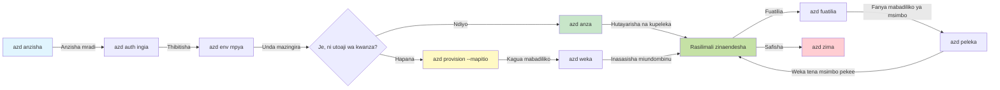

# AZD Misingi - Kuelewa Azure Developer CLI

# AZD Misingi - Dhana za Msingi na Mambo Muhimu

**Navigation ya Sura:**
- **📚 Nyumbani kwa Kozi**: [AZD For Beginners](../../README.md)
- **📖 Sura ya Sasa**: Sura 1 - Msingi & Kuanzia Haraka
- **⬅️ Iliyopita**: [Course Overview](../../README.md#-chapter-1-foundation--quick-start)
- **➡️ Ifuatayo**: [Installation & Setup](installation.md)
- **🚀 Sura Ifuatayo**: [Chapter 2: AI-First Development](../chapter-02-ai-development/microsoft-foundry-integration.md)

## Utangulizi

Somo hili linakujuza kuhusu Azure Developer CLI (azd), zana yenye nguvu ya mstari wa amri inayochochea safari yako kutoka kwenye maendeleo ya ndani hadi utoaji kwa Azure. Utajifunza dhana za msingi, vipengele vya msingi, na kuelewa jinsi azd inavyorahisisha utoaji wa programu za cloud-native.

## Malengo ya Kujifunza

Mwisho wa somo hili, utakuwa umeweza:
- Kuelewa ni nini Azure Developer CLI na kusudi lake kuu
- Kujifunza dhana msingi za templates, environments, na services
- Kuchunguza vipengele muhimu vikiwemo maendeleo kwa kutumia templates na Miundombinu kama Msimbo
- Kuelewa muundo wa mradi wa azd na mtiririko wa kazi
- Kuwa tayari kusakinisha na kusanidi azd kwa mazingira yako ya maendeleo

## Matokeo ya Kujifunza

Baada ya kumaliza somo hili, utaweza:
- Kuelezea jukumu la azd katika mtiririko wa kazi wa maendeleo ya wingu za kisasa
- Kutambua vipengele vya muundo wa mradi wa azd
- Kuelezea jinsi templates, environments, na services zinavyofanya kazi pamoja
- Kuelewa faida za Miundombinu kama Msimbo kwa azd
- Kutambua amri tofauti za azd na madhumuni yao

## Azure Developer CLI (azd) ni Nini?

Azure Developer CLI (azd) ni zana ya mstari wa amri iliyoundwa kuharakisha safari yako kutoka katika maendeleo ya ndani hadi utoaji kwa Azure. Inarahisisha mchakato wa kujenga, kutoa, na kusimamia programu za cloud-native kwenye Azure.

### 🎯 Kwa Nini Utumie AZD? Ulinganisho wa Uhalisia

Tufananishe utoaji wa tovuti rahisi yenye hifadhidata:

#### ❌ BILA AZD: Utoaji wa Azure kwa Mkono (dakika 30+)

```bash
# Hatua 1: Unda kundi la rasilimali
az group create --name myapp-rg --location eastus

# Hatua 2: Unda Mpango wa Huduma ya App
az appservice plan create --name myapp-plan \
  --resource-group myapp-rg \
  --sku B1 --is-linux

# Hatua 3: Unda App ya Wavuti
az webapp create --name myapp-web-unique123 \
  --resource-group myapp-rg \
  --plan myapp-plan \
  --runtime "NODE:18-lts"

# Hatua 4: Unda akaunti ya Cosmos DB (dakika 10-15)
az cosmosdb create --name myapp-cosmos-unique123 \
  --resource-group myapp-rg \
  --kind MongoDB

# Hatua 5: Unda hifadhidata
az cosmosdb mongodb database create \
  --account-name myapp-cosmos-unique123 \
  --resource-group myapp-rg \
  --name tododb

# Hatua 6: Unda mkusanyiko
az cosmosdb mongodb collection create \
  --account-name myapp-cosmos-unique123 \
  --resource-group myapp-rg \
  --database-name tododb \
  --name todos

# Hatua 7: Pata mnyororo wa muunganisho
CONN_STR=$(az cosmosdb keys list \
  --name myapp-cosmos-unique123 \
  --resource-group myapp-rg \
  --type connection-strings \
  --query "connectionStrings[0].connectionString" -o tsv)

# Hatua 8: Sanidi mipangilio ya app
az webapp config appsettings set \
  --name myapp-web-unique123 \
  --resource-group myapp-rg \
  --settings MONGODB_URI="$CONN_STR"

# Hatua 9: Washa uandishi wa kumbukumbu
az webapp log config --name myapp-web-unique123 \
  --resource-group myapp-rg \
  --application-logging filesystem \
  --detailed-error-messages true

# Hatua 10: Sanidi Application Insights
az monitor app-insights component create \
  --app myapp-insights \
  --location eastus \
  --resource-group myapp-rg

# Hatua 11: Unganisha App Insights na App ya Wavuti
INSTRUMENTATION_KEY=$(az monitor app-insights component show \
  --app myapp-insights \
  --resource-group myapp-rg \
  --query "instrumentationKey" -o tsv)

az webapp config appsettings set \
  --name myapp-web-unique123 \
  --resource-group myapp-rg \
  --settings APPINSIGHTS_INSTRUMENTATIONKEY="$INSTRUMENTATION_KEY"

# Hatua 12: Jenga programu kwa ndani kwenye mashine yako
npm install
npm run build

# Hatua 13: Unda kifurushi cha utekelezaji
zip -r app.zip . -x "*.git*" "node_modules/*"

# Hatua 14: Sambaza programu
az webapp deployment source config-zip \
  --resource-group myapp-rg \
  --name myapp-web-unique123 \
  --src app.zip

# Hatua 15: Subiri na ombea kwamba itafanya kazi 🙏
# (Hakuna uthibitishaji wa moja kwa moja, upimaji wa mkono unahitajika)
```

**Matatizo:**
- ❌ amri 15+ za kukumbuka na kutekeleza kwa mpangilio
- ❌ kazi ya mkono ya dakika 30-45
- ❌ Rahisi kufanya makosa (makosa ya kuandika, vigezo visivyo sahihi)
- ❌ Mifumo ya kuunganisha inaonekana katika historia ya terminal
- ❌ Hakuna kugeuza kwa moja kwa moja ikiwa kitu kinashindikana
- ❌ Ngumu kurudia kwa wanachama wa timu
- ❌ Tofauti kila mara (haiwezi kutendeka tena kwa usahihi)

#### ✅ KWA AZD: Utoaji wa Kisimamia (amri 5, dakika 10-15)

```bash
# Hatua 1: Anzisha kutoka kwenye kiolezo
azd init --template todo-nodejs-mongo

# Hatua 2: Thibitisha
azd auth login

# Hatua 3: Unda mazingira
azd env new dev

# Hatua 4: Tazama awali mabadiliko (hiari lakini inashauriwa)
azd provision --preview

# Hatua 5: Sambaza kila kitu
azd up

# ✨ Imekamilika! Kila kitu kimesambazwa, kimepangiliwa, kimefuatiliwa.
```

**Faida:**
- ✅ **amri 5** dhidi ya hatua 15+ za mkono
- ✅ **dakika 10-15** jumla (kile kikubwa ni kusubiri Azure)
- ✅ **Hakuna makosa** - imefanywa otomatiki na imethibitishwa
- ✅ **Siri zimedeshiwa kwa usalama** kupitia Key Vault
- ✅ **Ukurudisho wa moja kwa moja** wakati wa kushindwa
- ✅ **Inayotendeka kwa njia sawa** - matokeo yale yale kila wakati
- ✅ **Tayari kwa timu** - yeyote anaweza kutoa kwa amri zile zile
- ✅ **Miundombinu kama Msimbo** - templates za Bicep zikiwa chini ya udhibiti wa toleo
- ✅ **Ufuatiliaji uliojengwa** - Application Insights imewekwa kiotomatiki

### 📊 Kupunguza Muda & Makosa

| Metric | Manual Deployment | AZD Deployment | Improvement |
|:-------|:------------------|:---------------|:------------|
| **Commands** | 15+ | 5 | 67% fewer |
| **Time** | 30-45 min | 10-15 min | 60% faster |
| **Error Rate** | ~40% | <5% | 88% reduction |
| **Consistency** | Low (manual) | 100% (automated) | Perfect |
| **Team Onboarding** | 2-4 hours | 30 minutes | 75% faster |
| **Rollback Time** | 30+ min (manual) | 2 min (automated) | 93% faster |

## Dhana za Msingi

### Templates
Templates ni msingi wa azd. Zina:
- **Msimbo wa programu** - Chanzo chako cha msimbo na utegemezi
- **Maelezo ya miundombinu** - Rasilimali za Azure zilibainishwa katika Bicep au Terraform
- **Faili za usanidi** - Mipangilio na vigezo vya mazingira
- **Skripti za utoaji** - Mtiririko wa kazi wa utoaji uliosudiwa kiotomatiki

### Environments
Environments zinawakilisha malengo tofauti ya utoaji:
- **Development** - Kwa upimaji na maendeleo
- **Staging** - Mazingira ya kabla ya uzalishaji
- **Production** - Mazingira ya uzalishaji wa moja kwa moja

Kila environment ina:
- kikundi cha rasilimali cha Azure
- mipangilio ya usanidi
- hali ya utoaji

### Services
Services ni vitatu vinavyojenga programu yako:
- **Frontend** - Programu za wavuti, SPA
- **Backend** - API, microservices
- **Database** - Suluhisho za uhifadhi wa data
- **Storage** - Hifadhi za faili na blob

## Vipengele Muhimu

### 1. Maendeleo Yanayotegemea Template
```bash
# Pitia violezo vinavyopatikana
azd template list

# Anzisha kutoka kwa kiolezo
azd init --template <template-name>
```

### 2. Miundombinu kama Msimbo
- **Bicep** - Lugha maalum ya Azure
- **Terraform** - Zana ya miundombinu kwa wingu nyingi
- **ARM Templates** - templates za Azure Resource Manager

### 3. Mitiririko Imeunganishwa
```bash
# Mtiririko kamili wa usambazaji
azd up            # Toa rasilimali + Tekeleza; hii ni isiyohitaji uingiliaji kwa usanidi wa mara ya kwanza

# 🧪 MPYA: Tazama mabadiliko ya miundombinu kabla ya uanzishaji (SALAMA)
azd provision --preview    # Kuiga uanzishaji wa miundombinu bila kufanya mabadiliko

azd provision     # Unda rasilimali za Azure; ikiwa unasasisha miundombinu, tumia hii
azd deploy        # Tekeleza msimbo wa programu au uweke upya msimbo wa programu mara baada ya sasisho
azd down          # Safisha rasilimali
```

#### 🛡️ Upangaji Salama wa Miundombinu kwa kupitia Preview
Amri `azd provision --preview` ni mabadiliko makubwa kwa utoaji salama:
- **Uchambuzi wa kuendesha kavu** - Inaonyesha kile kitakachoundwa, kubadilishwa, au kufutwa
- **Hatari sifuri** - Hakuna mabadiliko ya kweli yanayofanyika kwenye mazingira yako ya Azure
- **Ushirikiano wa timu** - Sambaza matokeo ya preview kabla ya utoaji
- **Makadirio ya gharama** - Elewa gharama za rasilimali kabla ya kujitolea

```bash
# Mfano wa mtiririko wa mapitio
azd provision --preview           # Angalia kile kitakachobadilika
# Pitia matokeo, jadili na timu
azd provision                     # Tekeleza mabadiliko kwa kujiamini
```

### 📊 Mchoro: Mtiririko wa Maendeleo wa AZD


**Ufafanuzi wa Mtiririko wa Kazi:**
1. **Init** - Anza na template au mradi mpya
2. **Auth** - Jithibitisha na Azure
3. **Environment** - Tengeneza mazingira ya utoaji yaliyotengwa
4. **Preview** - 🆕 Daima angalia mabadiliko ya miundombinu kwanza (tabia salama)
5. **Provision** - Unda/sasisha rasilimali za Azure
6. **Deploy** - Tuma msimbo wa programu yako
7. **Monitor** - Angalia utendaji wa programu
8. **Iterate** - Fanya mabadiliko na utoe tena msimbo
9. **Cleanup** - Ondoa rasilimali wakati umemaliza

### 4. Usimamizi wa Mazingira
```bash
# Unda na kusimamia mazingira
azd env new <environment-name>
azd env select <environment-name>
azd env list
```

## 📁 Muundo wa Mradi

Muundo wa kawaida wa mradi wa azd:
```
my-app/
├── .azd/                    # azd configuration
│   └── config.json
├── .azure/                  # Azure deployment artifacts
├── .devcontainer/          # Development container config
├── .github/workflows/      # GitHub Actions
├── .vscode/               # VS Code settings
├── infra/                 # Infrastructure code
│   ├── main.bicep        # Main infrastructure template
│   ├── main.parameters.json
│   └── modules/          # Reusable modules
├── src/                  # Application source code
│   ├── api/             # Backend services
│   └── web/             # Frontend application
├── azure.yaml           # azd project configuration
└── README.md
```

## 🔧 Faili za Usanidi

### azure.yaml
Faili kuu ya usanidi wa mradi:
```yaml
name: my-awesome-app
metadata:
  template: my-template@1.0.0

services:
  web:
    project: ./src/web
    language: js
    host: appservice
  api:
    project: ./src/api
    language: js
    host: appservice

hooks:
  preprovision:
    shell: pwsh
    run: echo "Preparing to provision..."
```

### .azure/config.json
Usanidi maalum wa mazingira:
```json
{
  "version": 1,
  "defaultEnvironment": "dev",
  "environments": {
    "dev": {
      "subscriptionId": "your-subscription-id",
      "location": "eastus"
    }
  }
}
```

## 🎪 Mitiririko ya Kazi ya Kawaida na Mazoezi ya Vitendo

> **💡 Mwongozo wa Kujifunza:** Fuata mazoezi haya kwa mpangilio ili kujenga ujuzi wako wa AZD kwa taratibu.

### 🎯 Zoefisho 1: Anzisha Mradi Wako wa Kwanza

**Lengo:** Tengeneza mradi wa AZD na uchunguze muundo wake

**Hatua:**
```bash
# Tumia kiolezo kilichothibitishwa
azd init --template todo-nodejs-mongo

# Chunguza faili zilizotengenezwa
ls -la  # Tazama faili zote ikiwemo zilizofichwa

# Faili muhimu zilizotengenezwa:
# - azure.yaml (usanidi mkuu)
# - infra/ (msimbo wa miundombinu)
# - src/ (msimbo wa programu)
```

**✅ Mafanikio:** Una azure.yaml, infra/, na saraka za src/

---

### 🎯 Zoefisho 2: Toa kwa Azure

**Lengo:** Kamilisha utoaji wa mwisho hadi mwisho

**Hatua:**
```bash
# 1. Thibitisha
az login && azd auth login

# 2. Unda mazingira
azd env new dev
azd env set AZURE_LOCATION eastus

# 3. Angalia mabadiliko (INAPENDEKEZWA)
azd provision --preview

# 4. Sambaza kila kitu
azd up

# 5. Thibitisha usambazaji
azd show    # Tazama URL ya programu yako
```

**Muda Unaotegemewa:** dakika 10-15  
**✅ Mafanikio:** URL ya programu inafunguka kwa kivinjari

---

### 🎯 Zoefisho 3: Mazingira Mengi

**Lengo:** Toa kwa dev na staging

**Hatua:**
```bash
# Tayari kuna dev, unda staging
azd env new staging
azd env set AZURE_LOCATION westus2
azd up

# Badilisha kati yao
azd env list
azd env select dev
```

**✅ Mafanikio:** Vikundi viwili tofauti vya rasilimali kwenye Azure Portal

---

### 🛡️ Usiangalie Chini: `azd down --force --purge`

Unapohitaji kuanza upya kabisa:

```bash
azd down --force --purge
```

**Inafanya Nini:**
- `--force`: Hakuna vidokezo vya uthibitisho
- `--purge`: Inafuta hali yote ya ndani na rasilimali za Azure

**Tumia wakati:**
- Utoaji ulishindwa katikati
- Kubadilisha miradi
- Unahitaji mwanzo safi

---

## 🎪 Marejeleo ya Mtiririko wa Asili

### Kuanza Mradi Mpya
```bash
# Njia 1: Tumia kiolezo kilichopo
azd init --template todo-nodejs-mongo

# Njia 2: Anza kutoka mwanzo
azd init

# Njia 3: Tumia saraka ya sasa
azd init .
```

### Mzunguko wa Maendeleo
```bash
# Sanidi mazingira ya maendeleo
azd auth login
azd env new dev
azd env select dev

# Sambaza kila kitu
azd up

# Fanya mabadiliko na usambaze tena
azd deploy

# Safisha unapomaliza
azd down --force --purge # amri katika Azure Developer CLI ni **upya kamili** kwa mazingira yako—hasa inafaa wakati unapotatua matatizo ya usambazaji yaliyoshindwa, unaposafisha rasilimali zilizotelekezwa, au kujiandaa kwa usambazaji upya
```

## Kuelewa `azd down --force --purge`
Amri `azd down --force --purge` ni njia yenye nguvu ya kuvunja kabisa mazingira yako ya azd na rasilimali zote zinazohusiana. Hapa kuna ufafanuzi wa kila bendera inavyofanya:
```
--force
```
- Huacha ombi la uthibitisho.
- Inafaa kwa uendeshaji otomatiki au kutekeleza skripti ambapo ingia ya mwongozo siyo yawezekana.
- Inahakikisha kuharibu kunaendelea bila kusitishwa, hata kama CLI inagundua kutolingana.

```
--purge
```
Inafuta **metadata zote zinazohusiana**, ikijumuisha:
Hali ya environment
Folda ya ndani `.azure`
Taarifa zilizohifadhiwa za utoaji
Inazuia azd "kukumbuka" utoaji wa awali, ambao unaweza kusababisha matatizo kama vikundi vya rasilimali vilivyopangwa vibaya au marejeleo ya rejista yaliyosimama.

### Kwa Nini kutumia zote mbili?
Unapokutana na kizuizi kwa `azd up` kutokana na hali iliyobaki au utoaji wa sehemu, mseto huu unahakikisha **mwanzo safi**.

Inasaidia hasa baada ya ufutaji wa rasilimali kwa mkono katika Azure portal au wakati wa kubadilisha templates, environments, au kanuni za uandishi wa majina ya vikundi vya rasilimali.

### Kusimamia Mazingira Mengi
```bash
# Unda mazingira ya kujaribu
azd env new staging
azd env select staging
azd up

# Rudi kwenye mazingira ya maendeleo
azd env select dev

# Linganisha mazingira
azd env list
```

## 🔐 Uthibitishaji na Cheti

Kuelewa uthibitishaji ni muhimu kwa utoaji wa azd uliofanikiwa. Azure inatumia mbinu nyingi za uthibitishaji, na azd inatumia mnyororo ule ule wa cheti unaotumika na zana nyingine za Azure.

### Uthibitishaji wa Azure CLI (`az login`)

Kabla ya kutumia azd, unahitaji kuthibitisha na Azure. Njia ya kawaida ni kutumia Azure CLI:

```bash
# Ingia kwa muingiliano (huifungua kivinjari)
az login

# Ingia kwa mpangaji maalum
az login --tenant <tenant-id>

# Ingia kwa mwakilishi wa huduma
az login --service-principal -u <app-id> -p <password> --tenant <tenant-id>

# Angalia hali ya uingizaji sasa
az account show

# Orodhesha usajili unaopatikana
az account list --output table

# Weka usajili wa chaguo-msingi
az account set --subscription <subscription-id>
```

### Mtiririko wa Uthibitishaji
1. **Ingia kwa Interakti**: Inafungua kivinjari chako chaguo-msingi kwa uthibitishaji
2. **Device Code Flow**: Kwa mazingira yasiyo na upatikanaji wa kivinjari
3. **Service Principal**: Kwa ulimwengu wa uendeshaji otomatiki na CI/CD
4. **Managed Identity**: Kwa programu zinazoendeshwa kwenye rasilimali za Azure

### Mnyororo wa DefaultAzureCredential

`DefaultAzureCredential` ni aina ya cheti inayotoa uzoefu rahisi wa uthibitishaji kwa kujaribu vyanzo vingi vya cheti kwa mpangilio maalum:

#### Mpangilio wa Mnyororo wa Cheti
```mermaid
graph TD
    A[Uidhinishaji wa Azure (Chaguo-msingi)] --> B[Vigezo vya Mazingira]
    B --> C[Utambulisho wa Mizigo ya Kazi]
    C --> D[Utambulisho uliosimamiwa]
    D --> E[Studio ya Visual]
    E --> F[Studio ya Visual Code]
    F --> G[CLI ya Azure]
    G --> H[PowerShell ya Azure]
    H --> I[Kivinjari cha Kuingiliana]
```
#### 1. Vigezo vya Mazingira
```bash
# Weka vigezo vya mazingira kwa wakala wa huduma
export AZURE_CLIENT_ID="<app-id>"
export AZURE_CLIENT_SECRET="<password>"
export AZURE_TENANT_ID="<tenant-id>"
```

#### 2. Workload Identity (Kubernetes/GitHub Actions)
Inatumika moja kwa moja katika:
- Azure Kubernetes Service (AKS) na Workload Identity
- GitHub Actions na OIDC federation
- Matukio mengine ya utambulisho wa udhibiti

#### 3. Managed Identity
Kwa rasilimali za Azure kama:
- Virtual Machines
- App Service
- Azure Functions
- Container Instances

```bash
# Angalia ikiwa inakimbia kwenye rasilimali ya Azure yenye utambulisho uliosimamiwa
az account show --query "user.type" --output tsv
# Inarudisha: "servicePrincipal" ikiwa inatumia utambulisho uliosimamiwa
```

#### 4. Uingiliano na Zana za Mwandishi
- **Visual Studio**: Inatumia akaunti iliyosainiwa moja kwa moja
- **VS Code**: Inatumia cheti za ugani wa Azure Account
- **Azure CLI**: Inatumia cheti za `az login` (njia ya kawaida kwa maendeleo ya ndani)

### Usanidi wa Uthibitishaji wa AZD

```bash
# Njia ya 1: Tumia Azure CLI (Inapendekezwa kwa maendeleo)
az login
azd auth login  # Inatumia vyeti vilivyopo vya Azure CLI

# Njia ya 2: Uthibitishaji wa azd wa moja kwa moja
azd auth login --use-device-code  # Kwa mazingira yasiyo na kiolesura cha mtumiaji

# Njia ya 3: Angalia hali ya uthibitishaji
azd auth login --check-status

# Njia ya 4: Toka na uthibitisha upya
azd auth logout
azd auth login
```

### Mambo Bora ya Uthibitishaji

#### Kwa Maendeleo ya Ndani
```bash
# 1. Ingia kwa kutumia Azure CLI
az login

# 2. Thibitisha usajili sahihi
az account show
az account set --subscription "Your Subscription Name"

# 3. Tumia azd na vitambulisho vilivyopo
azd auth login
```

#### Kwa Mifumo ya CI/CD
```yaml
# GitHub Actions example
- name: Azure Login
  uses: azure/login@v1
  with:
    creds: ${{ secrets.AZURE_CREDENTIALS }}

- name: Deploy with azd
  run: |
    azd auth login --client-id ${{ secrets.AZURE_CLIENT_ID }} \
                    --client-secret ${{ secrets.AZURE_CLIENT_SECRET }} \
                    --tenant-id ${{ secrets.AZURE_TENANT_ID }}
    azd up --no-prompt
```

#### Kwa Mazingira ya Uzalishaji
- Tumia **Managed Identity** unapokimbia kwenye rasilimali za Azure
- Tumia **Service Principal** kwa matukio ya uendeshaji otomatiki
- Epuka kuhifadhi cheti kwenye msimbo au faili za usanidi
- Tumia **Azure Key Vault** kwa usanidi nyeti

### Masuala ya Kawaida ya Uthibitishaji na Suluhu

#### Tatizo: "No subscription found"
```bash
# Suluhisho: Weka usajili wa chaguo-msingi
az account list --output table
az account set --subscription "<subscription-id>"
azd env set AZURE_SUBSCRIPTION_ID "<subscription-id>"
```

#### Tatizo: "Insufficient permissions"
```bash
# Suluhisho: Angalia na uteue majukumu yanayohitajika
az role assignment list --assignee $(az account show --query user.name --output tsv)

# Majukumu yanayohitajika kwa kawaida:
# - Mchangiaji (kwa usimamizi wa rasilimali)
# - Msimamizi wa Ufikiaji wa Watumiaji (kwa uteuzi wa majukumu)
```

#### Tatizo: "Token expired"
```bash
# Suluhisho: Thibitisha tena
az logout
az login
azd auth logout
azd auth login
```

### Uthibitishaji katika Matukio Mbalimbali

#### Maendeleo ya Ndani
```bash
# Akaunti ya maendeleo ya kibinafsi
az login
azd auth login
```

#### Maendeleo ya Timu
```bash
# Tumia tenanti maalum kwa shirika
az login --tenant contoso.onmicrosoft.com
azd auth login
```

#### Matukio ya Multi-tenant
```bash
# Badilisha kati ya wapangaji
az login --tenant tenant1.onmicrosoft.com
# Sambaza kwa mpangaji 1
azd up

az login --tenant tenant2.onmicrosoft.com  
# Sambaza kwa mpangaji 2
azd up
```

### Mambo ya Usalama

1. **Uhifadhi wa Cheti**: Usihifadhi cheti katika msimbo wa chanzo
2. **Kuzuia Nafasi**: Tumia kanuni ya udhaifu wa ardhi kwa service principals
3. **Mzunguko wa Tokeni**: Badilisha siri za service principal mara kwa mara
4. **Mwendo wa Ukaguzi**:,Fuatilia shughuli za uthibitishaji na utoaji
5. **Usalama wa Mtandao**: Tumia endpoints binafsi pale inapowezekana

### Utatuzi wa Matatizo ya Uthibitishaji

```bash
# Chunguza matatizo ya uthibitishaji
azd auth login --check-status
az account show
az account get-access-token

# Amri za uchunguzi za kawaida
whoami                          # Muktadha wa mtumiaji wa sasa
az ad signed-in-user show      # Maelezo ya mtumiaji wa Azure AD
az group list                  # Jaribu upatikanaji wa rasilimali
```

## Kuelewa `azd down --force --purge`

### Ugunduzi
```bash
azd template list              # Vinjari kiolezo
azd template show <template>   # Maelezo ya kiolezo
azd init --help               # Chaguzi za uanzishaji
```

### Usimamizi wa Mradi
```bash
azd show                     # Muhtasari wa mradi
azd env show                 # Mazingira ya sasa
azd config list             # Mipangilio ya usanidi
```

### Ufuatiliaji
```bash
azd monitor                  # Fungua ufuatiliaji wa portal ya Azure
azd monitor --logs           # Tazama kumbukumbu za programu
azd monitor --live           # Tazama vipimo vya moja kwa moja
azd pipeline config          # Sanidi CI/CD
```

## Mibinu Bora

### 1. Tumia Majina Yenye Maana
```bash
# Nzuri
azd env new production-east
azd init --template web-app-secure

# Epuka
azd env new env1
azd init --template template1
```

### 2. Tumia Templates
- Anza na templates zilizopo
- Boresha kwa mahitaji yako
- Tengeneza templates zinazorudiwa kwa shirika lako

### 3. Kutengwa kwa Mazingira
- Tumia mazingira tofauti kwa dev/staging/prod
- Usitoe moja kwa moja kwa uzalishaji kutoka kwa mashine ya ndani
- Tumia pipelines za CI/CD kwa utoaji wa uzalishaji

### 4. Usimamizi wa Usanidi
- Tumia vigezo vya mazingira kwa data nyeti
- Weka usanidi katika udhibiti wa toleo
- Andika mipangilio maalum kwa mazingira

## Maendeleo ya Kujifunza

### Mwanzo (Wiki 1-2)
1. Sakinisha azd na jithibitishe
2. Toa template rahisi
3. Elewa muundo wa mradi
4. Jifunze amri za msingi (up, down, deploy)

### Wastani (Wiki 3-4)
1. Boresha templates
2. Simamia mazingira mengi
3. Elewa msimbo wa miundombinu
4. Weka pipelines za CI/CD

### Wa juu (Wiki 5+)
1. Tengeneza templates za kawaida
2. Mfumo wa juu wa miundombinu
3. Utoaji wa mikoa mingi
4. Usanidi wa kiwango cha biashara

## Hatua Zifuatazo

**📖 Endelea Kujifunza Sura 1:**
- [Usakinishaji na Usanidi](installation.md) - Pata azd imewekwa na kusanidiwa
- [Mradi Wako wa Kwanza](first-project.md) - Mafunzo ya vitendo kamili
- [Mwongozo wa Usanidi](configuration.md) - Chaguzi za usanidi za kiwango cha juu

**🎯 Tayari kwa Sura Ifuatayo?**
- [Sura 2: Uundaji wa AI Kwanza](../chapter-02-ai-development/microsoft-foundry-integration.md) - Anza kujenga programu za AI

## Rasilimali za Ziada

- [Azure Developer CLI Overview](https://learn.microsoft.com/en-us/azure/developer/azure-developer-cli/)
- [Template Gallery](https://azure.github.io/awesome-azd/)
- [Community Samples](https://github.com/Azure-Samples)

---

## 🙋 Maswali Yanayoulizwa Mara kwa Mara

### Maswali ya Jumla

**Q: Nini tofauti kati ya AZD na Azure CLI?**

A: Azure CLI (`az`) ni kwa kusimamia rasilimali za Azure mmoja mmoja. AZD (`azd`) ni kwa kusimamia programu nzima:

```bash
# Azure CLI - Usimamizi wa rasilimali za ngazi ya chini
az webapp create --name myapp --resource-group rg
az sql server create --name myserver --resource-group rg
# ... amri nyingi zaidi zinahitajika

# AZD - Usimamizi wa kiwango cha programu
azd up  # Inaweka programu nzima pamoja na rasilimali zote
```

**Fikiria kwa njia hii:**
- `az` = Kufanya kazi na vipande vya Lego mmoja mmoja
- `azd` = Kufanya kazi na seti kamili za Lego

---

**Q: Je, nahitaji kujua Bicep au Terraform ili kutumia AZD?**

A: Hapana! Anza na violezo:
```bash
# Tumia kiolezo kilichopo - hakuna haja ya ujuzi wa IaC
azd init --template todo-nodejs-mongo
azd up
```

Unaweza kujifunza Bicep baadaye ili kubadilisha miundombinu. Violezo vinatoa mifano zinazofanya kazi ili kujifunzia.

---

**Q: Gharama ni kiasi gani kuendesha templeti za AZD?**

A: Gharama zinatofautiana kulingana na templeti. Templeti nyingi za maendeleo gharama $50-150/mwezi:

```bash
# Angalia gharama kabla ya kupeleka
azd provision --preview

# Daima safisha wakati hauzitumia
azd down --force --purge  # Inaondoa rasilimali zote
```

**Ushauri wa kitaalamu:** Tumia ngazi za bure inapowezekana:
- App Service: ngazi ya F1 (Bure)
- Azure OpenAI: 50,000 tokens/mwezi bure
- Cosmos DB: ngazi ya bure ya 1000 RU/s

---

**Q: Je, naweza kutumia AZD na rasilimali za Azure zilizopo?**

A: Ndiyo, lakini ni rahisi kuanza upya. AZD inafanya kazi vizuri zaidi inapodhibiti mchakato mzima wa maisha. Kwa rasilimali zilizopo:

```bash
# Chaguo 1: Ingiza rasilimali zilizopo (kwa wataalamu)
azd init
# Kisha badilisha infra/ ili kurejelea rasilimali zilizopo

# Chaguo 2: Anza upya (inayopendekezwa)
azd init --template matching-your-stack
azd up  # Inaunda mazingira mapya
```

---

**Q: Jinsi gani ninaweza kushiriki mradi wangu na wenzangu?**

A: Fanya commit ya mradi wa AZD kwenye Git (lakini SI kabrasha `.azure`):

```bash
# Tayari iko kwenye .gitignore kwa chaguo-msingi
.azure/        # Inajumuisha siri na data za mazingira
*.env          # Vigezo vya mazingira

# Wanachama wa timu kisha:
git clone <your-repo>
azd auth login
azd env new <their-name>-dev
azd up
```

Kila mtu anapata miundombinu ileile kutoka kwa violezo sawa.

---

### Maswali ya Utatuzi

**Q: "azd up" ilishindwa katikati. Nifanye nini?**

A: Angalia kosa, lifanyie marekebisho, kisha jaribu tena:

```bash
# Angalia kumbukumbu za kina
azd show

# Marekebisho ya kawaida:

# 1. Ikiwa kikomo cha rasilimali kimezidi:
azd env set AZURE_LOCATION "westus2"  # Jaribu mkoa tofauti

# 2. Ikiwa kuna mgongano wa majina ya rasilimali:
azd down --force --purge  # Anzisha upya
azd up  # Jaribu tena

# 3. Ikiwa uthibitisho limeisha:
az login
azd auth login
azd up
```

**Tatizo la kawaida zaidi:** Usajili wa Azure ulioteuliwa si sahihi
```bash
az account list --output table
az account set --subscription "<correct-subscription>"
```

---

**Q: Jinsi gani ninaweza kupeleka mabadiliko ya msimbo tu bila kuanzisha upya miundombinu?**

A: Tumia `azd deploy` badala ya `azd up`:

```bash
azd up          # Mara ya kwanza: kutayarisha + kupeleka (polepole)

# Fanya mabadiliko ya msimbo...

azd deploy      # Mara zinazofuata: kupeleka tu (haraka)
```

Mlinganisho wa kasi:
- `azd up`: 10-15 minutes (huandaa miundombinu)
- `azd deploy`: 2-5 minutes (msimbo tu)

---

**Q: Je, naweza kubinafsisha templeti za miundombinu?**

A: Ndiyo! Hariri faili za Bicep katika `infra/`:

```bash
# Baada ya azd init
cd infra/
code main.bicep  # Hariri katika VS Code

# Angalia awali mabadiliko
azd provision --preview

# Tekeleza mabadiliko
azd provision
```

**Ushauri:** Anza kwa ndogo - badilisha SKUs kwanza:
```bicep
// infra/main.bicep
sku: {
  name: 'B1'  // Change to 'P1V2' for production
}
```

---

**Q: Jinsi gani ninafuta kila kitu AZD kilichotengeneza?**

A: Amri moja inafuta rasilimali zote:

```bash
azd down --force --purge

# Hii inaondoa:
# - Rasilimali zote za Azure
# - Kikundi cha rasilimali
# - Hali ya mazingira ya ndani
# - Taarifa za utekelezaji zilizohifadhiwa kwenye cache
```

**Kimbia hili kila wakati:**
- Umeisha kumaliza kujaribu templeti
- Unapobadilisha kwenda mradi tofauti
- Unapotaka kuanza upya

**Akiba ya gharama:** Kufuta rasilimali zisizotumika = malipo $0

---

**Q: Nifanye nini ikiwa nisitaki niliuone rasilimali katika Azure Portal?**

A: Hali ya AZD inaweza kupotoka. Njia ya kuanza upya kabisa:

```bash
# 1. Ondoa hali ya ndani
azd down --force --purge

# 2. Anza upya
azd up

# Chaguo mbadala: Ruhusu AZD kugundua na kurekebisha
azd provision  # Itaunda rasilimali zilizokosekana
```

---

### Maswali ya Juu

**Q: Je, naweza kutumia AZD katika mabomba ya CI/CD?**

A: Ndiyo! Mfano wa GitHub Actions:

```yaml
# .github/workflows/deploy.yml
name: Deploy with AZD

on:
  push:
    branches: [main]

jobs:
  deploy:
    runs-on: ubuntu-latest
    steps:
      - uses: actions/checkout@v2
      
      - name: Install azd
        run: curl -fsSL https://aka.ms/install-azd.sh | bash
      
      - name: Azure Login
        run: |
          azd auth login \
            --client-id ${{ secrets.AZURE_CLIENT_ID }} \
            --client-secret ${{ secrets.AZURE_CLIENT_SECRET }} \
            --tenant-id ${{ secrets.AZURE_TENANT_ID }}
      
      - name: Deploy
        run: azd up --no-prompt
```

---

**Q: Jinsi gani nashughulikia siri na data nyeti?**

A: AZD inaunganishwa na Azure Key Vault moja kwa moja:

```bash
# Siri zinahifadhiwa katika Key Vault, sio katika msimbo
azd env set DATABASE_PASSWORD "$(openssl rand -base64 32)"

# AZD kwa kiotomatiki:
# 1. Inaunda Key Vault
# 2. Inahifadhi siri
# 3. Inamruhusu programu kupata ufikaji kwa kutumia Managed Identity
# 4. Inaingiza wakati wa utekelezaji
```

**Usisajili kamwe:**
- `.azure/` folder (inajumuisha data za mazingira)
- `.env` files (siri za ndani)
- Connection strings

---

**Q: Je, naweza kupeleka kwenye maeneo mengi?**

A: Ndiyo, tengeneza mazingira kwa kila eneo:

```bash
# mazingira ya Mashariki ya Marekani
azd env new prod-eastus
azd env set AZURE_LOCATION eastus
azd up

# mazingira ya Magharibi ya Ulaya
azd env new prod-westeurope
azd env set AZURE_LOCATION westeurope
azd up

# Kila mazingira ni ya kujitegemea
azd env list
```

Kwa programu za kweli zenye maeneo mengi, badilisha templeti za Bicep ili kupeleka kwenye maeneo mengi kwa wakati mmoja.

---

**Q: Ninaweza kupata msaada wapi ikiwa nimekwama?**

1. **AZD Documentation:** https://learn.microsoft.com/azure/developer/azure-developer-cli/
2. **GitHub Issues:** https://github.com/Azure/azure-dev/issues
3. **Discord:** [Discord ya Azure](https://discord.gg/microsoft-azure) - #azure-developer-cli chaneli
4. **Stack Overflow:** Tag `azure-developer-cli`
5. **Kozi Hii:** [Mwongozo wa Utatuzi wa Matatizo](../chapter-07-troubleshooting/common-issues.md)

**Ushauri wa kitaalamu:** Kabla ya kuuliza, endesha:
```bash
azd show       # Inaonyesha hali ya sasa
azd version    # Inaonyesha toleo lako
```
Jumuisha taarifa hizi katika swali lako kwa msaada wa haraka.

---

## 🎓 Nini Ifuatayo?

Sasa unaelewa misingi ya AZD. Chagua njia yako:

### 🎯 Kwa Waanzilishi:
1. **Ifuatayo:** [Usakinishaji na Usanidi](installation.md) - Sakinisha AZD kwenye mashine yako
2. **Kisha:** [Mradi Wako wa Kwanza](first-project.md) - Zindua programu yako ya kwanza
3. **Mazoezi:** Kamilisha mazoezi 3 yote katika somo hili

### 🚀 Kwa Waendelezaji wa AI:
1. **Ruka hadi:** [Sura 2: Uundaji wa AI Kwanza](../chapter-02-ai-development/microsoft-foundry-integration.md)
2. **Deploy:** Anza na `azd init --template get-started-with-ai-chat`
3. **Jifunze:** Jenga wakati unavyopeleka

### 🏗️ Kwa Waendelezaji Wenye Uzoefu:
1. **Kagua:** [Mwongozo wa Usanidi](configuration.md) - Mipangilio ya kiwango cha juu
2. **Chunguza:** [Infrastructure as Code](../chapter-04-infrastructure/provisioning.md) - Uchunguzi wa kina wa Bicep
3. **Jenga:** Tengeneza templeti maalum kwa stack yako

---

**Uelekezaji wa Sura:**
- **📚 Mwanzo wa Kozi**: [AZD Kwa Waanzilishi](../../README.md)
- **📖 Sura ya Sasa**: Sura 1 - Msingi na Anza Haraka  
- **⬅️ Iliyopita**: [Muhtasari wa Kozi](../../README.md#-chapter-1-foundation--quick-start)
- **➡️ Ifuatayo**: [Usakinishaji na Usanidi](installation.md)
- **🚀 Sura Ifuatayo**: [Sura 2: Uundaji wa AI Kwanza](../chapter-02-ai-development/microsoft-foundry-integration.md)

---

<!-- CO-OP TRANSLATOR DISCLAIMER START -->
Taarifa ya kutokuwajibika:
Nyaraka hii imetafsiriwa kwa kutumia huduma ya utafsiri ya AI [Co-op Translator](https://github.com/Azure/co-op-translator). Ingawa tunajitahidi kuhakikisha usahihi, tafadhali fahamu kwamba tafsiri za kiotomatiki zinaweza kuwa na makosa au zisizo sahihi. Nyaraka ya awali katika lugha yake ya asili inapaswa kuchukuliwa kama chanzo cha mamlaka. Kwa taarifa muhimu, tunashauri kutumia utafsiri wa kitaalamu unaofanywa na binadamu. Hatutawajibika kwa uelewano au tafsiri potofu zinazotokana na matumizi ya tafsiri hii.
<!-- CO-OP TRANSLATOR DISCLAIMER END -->