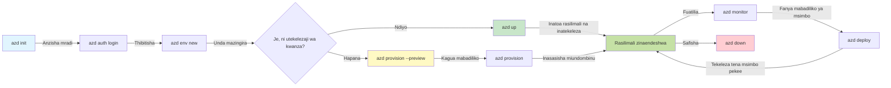
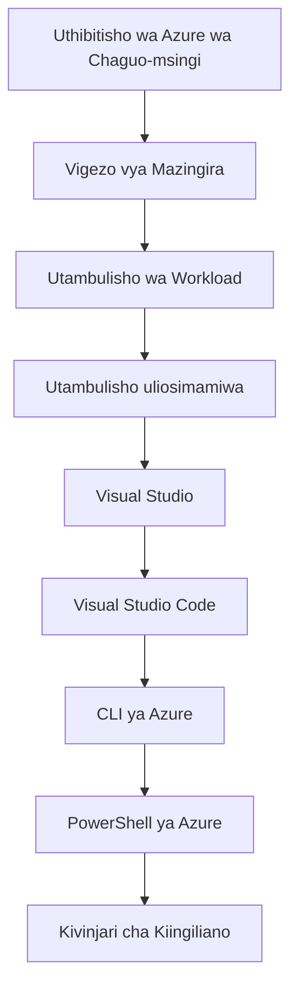

# AZD Misingi - Kuelewa Azure Developer CLI

# AZD Misingi - Dhana za Msingi na Misingi

**Uvinjari wa Sura:**
- **📚 Nyumbani kwa Kozi**: [AZD Kwa Waanzilishi](../../README.md)
- **📖 Sura ya Sasa**: Sura ya 1 - Msingi & Anza Haraka
- **⬅️ Iliyotangulia**: [Muhtasari wa Kozi](../../README.md#-chapter-1-foundation--quick-start)
- **➡️ Inayofuata**: [Ufungaji & Usanidi](installation.md)
- **🚀 Sura Inayofuata**: [Sura 2: Maendeleo ya Kwanza ya AI](../chapter-02-ai-development/microsoft-foundry-integration.md)

## Utangulizi

Somo hili linakuletea Azure Developer CLI (azd), zana yenye nguvu ya mstari wa amri inayokuzidisha safari yako kutoka maendeleo ya ndani hadi upelekezaji wa Azure. Utajifunza dhana za msingi, vipengele vikuu, na kuelewa jinsi azd inavyorahisisha uwasilishaji wa programu zinazoendeshwa wingu.

## Malengo ya Kujifunza

Mwisho wa somo hili, utakuwa umeweza:
- Kuelewa Azure Developer CLI ni nini na kusudi lake kuu
- Kujifunza dhana za msingi za violezo, mazingira, na huduma
- Kuchunguza vipengele muhimu ikiwemo maendeleo yanayoendeshwa na violezo na Miundombinu kama Msimbo
- Kuelewa muundo wa mradi wa azd na mtiririko wa kazi
- Kujiandaa kusanifu na kufunga azd kwa mazingira yako ya maendeleo

## Matokeo ya Kujifunza

Baada ya kumaliza somo hili, utaweza:
- Eleza jukumu la azd katika mtiririko wa maendeleo ya wingu wa kisasa
- Tambua vipengele vya muundo wa mradi wa azd
- Eleza jinsi violezo, mazingira, na huduma zinavyofanya kazi pamoja
- Kuelewa faida za Miundombinu kama Msimbo kwa kutumia azd
- Tambua amri mbalimbali za azd na madhumuni yao

## Azure Developer CLI (azd) ni nini?

Azure Developer CLI (azd) ni zana ya mstari wa amri iliyoundwa kuharakisha safari yako kutoka maendeleo ya ndani hadi upelekezaji wa Azure. Inarahisisha mchakato wa kujenga, kupeleka, na kusimamia programu zinazoendeshwa wingu kwenye Azure.

### Unaweza kupeleka nini kwa azd?

azd inaunga mkono aina nyingi za mzigo wa kazi—na orodha inaendelea kukua. Leo, unaweza kutumia azd kupeleka:

| Workload Type | Examples | Same Workflow? |
|---------------|----------|----------------|
| **Programu za jadi** | Programu za wavuti, REST APIs, tovuti zisizobadilika (static sites) | ✅ `azd up` |
| **Huduma na microservices** | Container Apps, Function Apps, backend zenye huduma nyingi | ✅ `azd up` |
| **Programu zinazoendeshwa na AI** | Programu za mazungumzo zenye Microsoft Foundry Models, suluhisho za RAG na AI Search | ✅ `azd up` |
| **Wakala wenye akili** | Wakala waliohifadhiwa kwenye Foundry, orkestresheni za wakala wengi | ✅ `azd up` |

Ufahamu muhimu ni kwamba **mzunguko wa maisha wa azd unabaki uleule bila kujali unachopeleka**. Unaanzisha mradi, unatafsiri miundombinu, unaweka msimbo wako, unatilia ufuatiliaji programu yako, na kusafisha—iwe ni tovuti rahisi au wakala wa AI wenye urahisi wa hali ya juu.

Uendelevu huu umewekwa kwa kusudi. azd inachukulia uwezo wa AI kama aina nyingine ya huduma programu yako inaweza kutumia, sio kitu tofauti kabisa. Kituo cha mazungumzo kinachotegemea Microsoft Foundry Models kutoka kwa mtazamo wa azd ni huduma nyingine tu ya kusanidi na kupeleka.

### 🎯 Kwa Nini Kutumia AZD? Ulinganisho wa Uhalisia

Tufuate kulinganisha kupeleka programu rahisi ya wavuti yenye hifadhidata:

#### ❌ BILA AZD: Utekelezaji wa Azure kwa Mkono (30+ dakika)

```bash
# Hatua 1: Unda kikundi cha rasilimali
az group create --name myapp-rg --location eastus

# Hatua 2: Unda Mpango wa Huduma ya App
az appservice plan create --name myapp-plan \
  --resource-group myapp-rg \
  --sku B1 --is-linux

# Hatua 3: Unda App ya Wavuti
az webapp create --name myapp-web-unique123 \
  --resource-group myapp-rg \
  --plan myapp-plan \
  --runtime "NODE:18-lts"

# Hatua 4: Unda akaunti ya Cosmos DB (dakika 10-15)
az cosmosdb create --name myapp-cosmos-unique123 \
  --resource-group myapp-rg \
  --kind MongoDB

# Hatua 5: Unda hifadhidata
az cosmosdb mongodb database create \
  --account-name myapp-cosmos-unique123 \
  --resource-group myapp-rg \
  --name tododb

# Hatua 6: Unda mkusanyiko
az cosmosdb mongodb collection create \
  --account-name myapp-cosmos-unique123 \
  --resource-group myapp-rg \
  --database-name tododb \
  --name todos

# Hatua 7: Pata mnyororo wa muunganisho
CONN_STR=$(az cosmosdb keys list \
  --name myapp-cosmos-unique123 \
  --resource-group myapp-rg \
  --type connection-strings \
  --query "connectionStrings[0].connectionString" -o tsv)

# Hatua 8: Sanidi mipangilio ya app
az webapp config appsettings set \
  --name myapp-web-unique123 \
  --resource-group myapp-rg \
  --settings MONGODB_URI="$CONN_STR"

# Hatua 9: Wezesha ufuatiliaji wa kumbukumbu
az webapp log config --name myapp-web-unique123 \
  --resource-group myapp-rg \
  --application-logging filesystem \
  --detailed-error-messages true

# Hatua 10: Sanidi Application Insights
az monitor app-insights component create \
  --app myapp-insights \
  --location eastus \
  --resource-group myapp-rg

# Hatua 11: Unganisha App Insights na App ya Wavuti
INSTRUMENTATION_KEY=$(az monitor app-insights component show \
  --app myapp-insights \
  --resource-group myapp-rg \
  --query "instrumentationKey" -o tsv)

az webapp config appsettings set \
  --name myapp-web-unique123 \
  --resource-group myapp-rg \
  --settings APPINSIGHTS_INSTRUMENTATIONKEY="$INSTRUMENTATION_KEY"

# Hatua 12: Jenga programu ndani ya kompyuta yako
npm install
npm run build

# Hatua 13: Unda kifurushi cha usambazaji
zip -r app.zip . -x "*.git*" "node_modules/*"

# Hatua 14: Sambaza programu
az webapp deployment source config-zip \
  --resource-group myapp-rg \
  --name myapp-web-unique123 \
  --src app.zip

# Hatua 15: Subiri na omba iweze kufanya kazi 🙏
# (Hakuna uhakiki wa otomatiki, inahitaji upimaji wa mwongozo)
```

**Matatizo:**
- ❌ Amri 15+ za kukumbuka na kutekeleza kwa mpangilio
- ❌ Kufanya kazi kwa dakika 30-45 kwa mkono
- ❌ Rahisi kufanya makosa (makosa ya tahajia, vigezo vibaya)
- ❌ Mifumo ya muunganisho inaonekana katika historia ya terminali
- ❌ Hakuna urejeshaji wa moja kwa moja ikiwa jambo linaloenda vibaya
- ❌ Vigumu kurudia kwa wanachama wa timu
- ❌ Tofauti kila wakati (haiwezi kurudiwa)

#### ✅ NA AZD: Utekelezaji Uliootomatishwa (amri 5, dakika 10-15)

```bash
# Hatua 1: Anzisha kutoka kwa kiolezo
azd init --template todo-nodejs-mongo

# Hatua 2: Thibitisha
azd auth login

# Hatua 3: Tengeneza mazingira
azd env new dev

# Hatua 4: Angalia mabadiliko (hiari lakini inashauriwa)
azd provision --preview

# Hatua 5: Sambaza kila kitu
azd up

# ✨ Imekamilika! Kila kitu kimesambazwa, kimewekwa usanidi, na kinafuatiliwa
```

**Manufaa:**
- ✅ **Amri 5** dhidi ya hatua 15+ za mkono
- ✅ **Dakika 10-15** jumla ya muda (kawaida kusubiri Azure)
- ✅ **Makosa ya mkono kidogo** - mtiririko thabiti unaotegemea violezo
- ✅ **Ushughulikiaji wa siri salama** - violezo vingi vinatumia uhifadhi wa siri unaosimamiwa na Azure
- ✅ **Utekelezaji unaorudiwa** - mchakato uleule kila wakati
- ✅ **Matokeo yanayoweza kuzalishwa tena** - matokeo yale yale kila wakati
- ✅ **Tayari kwa timu** - mtu yeyote anaweza kupeleka kwa amri zile zile
- ✅ **Miundombinu kama Msimbo** - violezo vya Bicep vinavyodhibitiwa kwa toleo
- ✅ **Ufuatiliaji uliowekwa ndani** - Application Insights imesanidiwa kiotomatiki

### 📊 Kupungua kwa Muda na Makosa

| Metric | Manual Deployment | AZD Deployment | Improvement |
|:-------|:------------------|:---------------|:------------|
| **Commands** | 15+ | 5 | 67% chini |
| **Time** | 30-45 min | 10-15 min | 60% haraka |
| **Error Rate** | ~40% | <5% | Kupunguzwa kwa 88% |
| **Consistency** | Low (manual) | 100% (automated) | Kamili |
| **Team Onboarding** | 2-4 hours | 30 minutes | 75% haraka |
| **Rollback Time** | 30+ min (manual) | 2 min (automated) | 93% haraka |

## Dhana za Msingi

### Violezo
Violezo ni msingi wa azd. Vinajumuisha:
- **Msimbo wa programu** - Msimbo wako wa chanzo na utegemezi
- **Ufafanuzi wa miundombinu** - Rasilimali za Azure zilizofafanuliwa katika Bicep au Terraform
- **Faili za usanidi** - Mipangilio na vigezo vya mazingira
- **Skripti za uenezaji** - Taratibu za uenezaji za kiotomatiki

### Mazingira
Mazingira yanawakilisha malengo tofauti ya uenezaji:
- **Development** - Kwa upimaji na maendeleo
- **Staging** - Mazingira kabla ya uzalishaji
- **Production** - Mazingira ya uzalishaji hai

Kila mazingira yanadumisha yake:
- Kundi la rasilimali la Azure
- Mipangilio ya usanidi
- Hali ya uenezaji

### Huduma
Huduma ni vijenzi vya msingi vya programu yako:
- **Frontend** - Programu za wavuti, SPA
- **Backend** - APIs, microservices
- **Database** - Suluhisho za uhifadhi wa data
- **Storage** - Uhifadhi wa faili na blob

## Vipengele Muhimu

### 1. Maendeleo Yanayoendeshwa na Violezo
```bash
# Pitia templeti zinazopatikana
azd template list

# Anzisha kutoka kwenye templeti
azd init --template <template-name>
```

### 2. Miundombinu Kama Msimbo
- **Bicep** - lugha maalum ya Azure
- **Terraform** - zana ya miundombinu ya multi-cloud
- **ARM Templates** - violezo vya Azure Resource Manager

### 3. Taratibu Zilizounganishwa
```bash
# Mtiririko kamili wa utoaji
azd up            # Kutayarisha na Kuweka: hii ni bila uingiliaji wa mikono kwa usanidi wa kwanza

# 🧪 MPYA: Tazama mabadiliko ya miundombinu kabla ya uenezaji (SALAMA)
azd provision --preview    # Kuiga uenezaji wa miundombinu bila kufanya mabadiliko

azd provision     # Unda rasilimali za Azure—ikiwa unasasisha miundombinu, tumia hii
azd deploy        # Sambaza msimbo wa programu au usambaze tena msimbo wa programu mara baada ya sasisho
azd down          # Ondoa rasilimali
```

#### 🛡️ Mipango Salama ya Miundombinu kwa Kutangazwa Awali
Amri ya `azd provision --preview` ni mabadiliko makubwa kwa uenezaji salama:
- **Uchambuzi wa kuendesha kavu** - Unaonyesha nini kitatengenezwa, kubadilishwa, au kufutwa
- **Hakuna hatari** - Hakuna mabadiliko halisi yanayotokea katika mazingira yako ya Azure
- **Ushirikiano wa timu** - Shiriki matokeo ya preview kabla ya uenezaji
- **Makadirio ya gharama** - Elewa gharama za rasilimali kabla ya kujitolea

```bash
# Mfano wa mtiririko wa mapitio
azd provision --preview           # Tazama kile kitakachobadilika
# Kagua matokeo, jadili na timu
azd provision                     # Tekeleza mabadiliko kwa ujasiri
```

### 📊 Maono: Mtiririko wa Maendeleo wa AZD


**Maelezo ya Mtiririko:**
1. **Init** - Anza na kiolezo au mradi mpya
2. **Auth** - Thibitisha na Azure
3. **Environment** - Unda mazingira ya uenezaji yaliyotengwa
4. **Preview** - 🆕 Daima angalia mabadiliko ya miundombinu kwanza (desturi salama)
5. **Provision** - Unda/sasisha rasilimali za Azure
6. **Deploy** - Sambaza msimbo wa programu yako
7. **Monitor** - Tazama utendaji wa programu
8. **Iterate** - Fanya mabadiliko na uenezaji upya wa msimbo
9. **Cleanup** - Ondoa rasilimali wakati umeisha

### 4. Usimamizi wa Mazingira
```bash
# Unda na simamia mazingira
azd env new <environment-name>
azd env select <environment-name>
azd env list
```

### 5. Nyongeza na Amri za AI

azd inatumia mfumo wa nyongeza kuongeza uwezo zaidi ya CLI kuu. Hii ni muhimu hasa kwa mzigo wa kazi wa AI:

```bash
# Orodhesha nyongeza zinazopatikana
azd extension list

# Sakinisha nyongeza ya mawakala ya Foundry
azd extension install azure.ai.agents

# Anzisha mradi wa wakala wa AI kutoka kwenye manifesti
azd ai agent init -m agent-manifest.yaml

# Anzisha seva ya MCP kwa maendeleo yanayosaidiwa na AI (Alpha)
azd mcp start
```

> Nyongeza zinashughulikiwa kwa undani katika [Sura 2: Maendeleo ya Kwanza ya AI](../chapter-02-ai-development/agents.md) na rejeleo la [AZD AI CLI Commands](../chapter-08-production/production-ai-practices.md#azd-ai-cli-commands-and-extensions).

## 📁 Muundo wa Mradi

Muundo wa kawaida wa mradi wa azd:
```
my-app/
├── .azd/                    # azd configuration
│   └── config.json
├── .azure/                  # Azure deployment artifacts
├── .devcontainer/          # Development container config
├── .github/workflows/      # GitHub Actions
├── .vscode/               # VS Code settings
├── infra/                 # Infrastructure code
│   ├── main.bicep        # Main infrastructure template
│   ├── main.parameters.json
│   └── modules/          # Reusable modules
├── src/                  # Application source code
│   ├── api/             # Backend services
│   └── web/             # Frontend application
├── azure.yaml           # azd project configuration
└── README.md
```

## 🔧 Faili za Usanidi

### azure.yaml
Faili kuu ya usanidi wa mradi:
```yaml
name: my-awesome-app
metadata:
  template: my-template@1.0.0

services:
  web:
    project: ./src/web
    language: js
    host: appservice
  api:
    project: ./src/api
    language: js
    host: appservice

hooks:
  preprovision:
    shell: pwsh
    run: echo "Preparing to provision..."
```

### .azure/config.json
Usanidi maalum kwa mazingira:
```json
{
  "version": 1,
  "defaultEnvironment": "dev",
  "environments": {
    "dev": {
      "subscriptionId": "your-subscription-id",
      "location": "eastus"
    }
  }
}
```

## 🎪 Taratibu za Kawaida na Mazoezi ya Vitendo

> **💡 Vidokezo vya Kujifunza:** Fuata mazoezi haya kwa mpangilio kujenga ujuzi wako wa AZD hatua kwa hatua.

### 🎯 Mazoezi 1: Anzisha Mradi Wako wa Kwanza

**Lengo:** Unda mradi wa AZD na chunguza muundo wake

**Hatua:**
```bash
# Tumia kiolezo kilichothibitishwa
azd init --template todo-nodejs-mongo

# Chunguza faili zilizotengenezwa
ls -la  # Tazama faili zote ikiwemo zilizofichwa

# Faili muhimu zilizotengenezwa:
# - azure.yaml (usanidi mkuu)
# - infra/ (msimbo wa miundombinu)
# - src/ (msimbo wa programu)
```

**✅ Mafanikio:** Una azure.yaml, infra/, na saraka za src/

---

### 🎯 Mazoezi 2: Peleka kwa Azure

**Lengo:** Kamilisha uenezaji wa mwisho hadi mwisho

**Hatua:**
```bash
# 1. Thibitisha utambulisho
az login && azd auth login

# 2. Unda mazingira
azd env new dev
azd env set AZURE_LOCATION eastus

# 3. Tazama awali mabadiliko (INAPENDEKEZWA)
azd provision --preview

# 4. Sambaza kila kitu
azd up

# 5. Thibitisha usambazaji
azd show    # Angalia URL ya programu yako
```

**Muda Uliotarajiwa:** 10-15 dakika  
**✅ Mafanikio:** URL ya programu inafunguka katika kivinjari

---

### 🎯 Mazoezi 3: Mazingira Nyingi

**Lengo:** Peleka kwa dev na staging

**Hatua:**
```bash
# Tayari kuna dev, unda staging
azd env new staging
azd env set AZURE_LOCATION westus2
azd up

# Badilisha kati yao
azd env list
azd env select dev
```

**✅ Mafanikio:** Makundi mawili tofauti ya rasilimali katika Azure Portal

---

### 🛡️ Kuanza Upya: `azd down --force --purge`

Unapohitaji kuanzisha upya kabisa:

```bash
azd down --force --purge
```

**Inafanya nini:**
- `--force`: Hakuna vidokezo vya uthibitisho
- `--purge`: Inafuta hali zote za ndani na rasilimali za Azure

**Tumia wakati:**
- Utekelezaji ulishindikana katikati
- Kubadilisha miradi
- Unahitaji kuanza upya

---

## 🎪 Marejeleo ya Mtiririko wa Asili

### Kuanza Mradi Mpya
```bash
# Njia 1: Tumia kiolezo kilichopo
azd init --template todo-nodejs-mongo

# Njia 2: Anza kutoka mwanzo
azd init

# Njia 3: Tumia saraka ya sasa
azd init .
```

### Mzunguko wa Maendeleo
```bash
# Sanidi mazingira ya maendeleo
azd auth login
azd env new dev
azd env select dev

# Sambaza kila kitu
azd up

# Fanya mabadiliko na usambaze tena
azd deploy

# Safisha baada ya kumaliza
azd down --force --purge # Amri katika Azure Developer CLI ni **upya kabisa** kwa mazingira yako—hasa inafaa wakati unatatua utoaji uliofeli, unasafisha rasilimali zisizo na mwenyewe, au kujiandaa kwa usambazaji mpya
```

## Kuelewa `azd down --force --purge`
Amri ya `azd down --force --purge` ni njia yenye nguvu ya kuvunja kabisa mazingira yako ya azd na rasilimali zote zinazohusiana. Hapa kuna mgawanyiko wa kile kila bendera inafanya:
```
--force
```
- Inapita maonyo ya uthibitisho.
- Inafaa kwa uotomatishaji au uandishi wa skripti ambapo ingizo la mwongozo halitowezekana.
- Inahakikisha ufutaji unaendelea bila kusitishwa, hata kama CLI inagundua kutokufanana.

```
--purge
```
Inafuta **metadata zote zinazohusiana**, ikijumuisha:
- Hali ya mazingira
- Folda ya ndani `.azure`
- Taarifa za uenezaji zilizohifadhiwa
- Inazuia azd kutoka "kukumbuka" utekelezaji wa awali, ambao unaweza kusababisha matatizo kama makundi ya rasilimali yasiyolingana au marejeleo ya rejista yaliyopitwa na wakati.

### Kwa nini kutumia zote?
Unapokutana na tatizo na `azd up` kutokana na hali iliyobaki au uenezaji wa sehemu, mchanganyiko huu unahakikisha **uanzo safi**.

Inasaidia hasa baada ya kufutwa kwa rasilimali kwa mkono katika Azure portal au wakati wa kubadilisha violezo, mazingira, au kanuni za uandishi wa majina ya kundi la rasilimali.

### Kusimamia Mazingira Nyingi
```bash
# Tengeneza mazingira ya staging
azd env new staging
azd env select staging
azd up

# Rudi kwenye dev
azd env select dev

# Linganisha mazingira
azd env list
```

## 🔐 Uthibitishaji na Vyeti

Kuelewa uthibitishaji ni muhimu kwa uenezaji wa mafanikio kwa azd. Azure inatumia njia nyingi za uthibitishaji, na azd inatumia mnyororo uleule wa vyeti unaotumika na zana nyingine za Azure.

### Uthibitishaji wa Azure CLI (`az login`)

Kabla ya kutumia azd, unahitaji kuthibitisha na Azure. Njia ya kawaida zaidi ni kutumia Azure CLI:

```bash
# Ingia kwa mwingiliano (inafungua kivinjari)
az login

# Ingia kwa mpangaji maalum
az login --tenant <tenant-id>

# Ingia kwa mwakilishi wa huduma
az login --service-principal -u <app-id> -p <password> --tenant <tenant-id>

# Angalia hali ya kuingia ya sasa
az account show

# Orodhesha usajili zilizopo
az account list --output table

# Weka usajili wa chaguo-msingi
az account set --subscription <subscription-id>
```

### Mtiririko wa Uthibitishaji
1. **Interactive Login**: Inaongeza kivinjari chako chaguomsingi kwa uthibitishaji
2. **Device Code Flow**: Kwa mazingira bila ufikiaji wa kivinjari
3. **Service Principal**: Kwa uotomatishaji na mazingira ya CI/CD
4. **Managed Identity**: Kwa programu zinazohifadhiwa kwenye Azure

### DefaultAzureCredential Chain

DefaultAzureCredential ni aina ya cheti inayotoa uzoefu rahisi wa uthibitishaji kwa kujaribu kiotomatiki vyanzo vingi vya vyeti kwa mpangilio maalum:

#### Mpangilio wa Mnyororo wa Vyeti

#### 1. Vigezo vya Mazingira
```bash
# Weka vigezo vya mazingira kwa mwakilishi wa huduma
export AZURE_CLIENT_ID="<app-id>"
export AZURE_CLIENT_SECRET="<password>"
export AZURE_TENANT_ID="<tenant-id>"
```

#### 2. Workload Identity (Kubernetes/GitHub Actions)
Inatumiwa kiotomatiki katika:
- Azure Kubernetes Service (AKS) na Workload Identity
- GitHub Actions na OIDC federation
- Hali nyingine za kitambulisho kinachounganishwa

#### 3. Managed Identity
Kwa rasilimali za Azure kama:
- Mashine Pepe (Virtual Machines)
- App Service
- Azure Functions
- Container Instances

```bash
# Angalia ikiwa inaendeshwa kwenye rasilimali ya Azure yenye utambulisho uliosimamiwa
az account show --query "user.type" --output tsv
# Inarudisha: "servicePrincipal" ikiwa inatumia utambulisho uliosimamiwa
```

#### 4. Muunganiko wa Zana za Waendelezaji
- **Visual Studio**: Inatumia akaunti iliyosajiliwa kiotomatiki
- **VS Code**: Inatumia vyeti vya ugani wa Azure Account
- **Azure CLI**: Inatumia vyeti vya `az login` (njia ya kawaida kwa maendeleo ya ndani)

### Usanidi wa Uthibitishaji wa AZD

```bash
# Njia 1: Tumia Azure CLI (Inapendekezwa kwa maendeleo)
az login
azd auth login  # Inatumia kredenshiali zilizopo za Azure CLI

# Njia 2: Uthibitishaji wa moja kwa moja wa azd
azd auth login --use-device-code  # Kwa mazingira bila GUI

# Njia 3: Angalia hali ya uthibitishaji
azd auth login --check-status

# Njia 4: Toka na uthibitisha upya
azd auth logout
azd auth login
```

### Mifano Bora ya Uthibitishaji

#### Kwa Maendeleo ya Ndani
```bash
# 1. Ingia kwa kutumia Azure CLI
az login

# 2. Thibitisha usajili sahihi
az account show
az account set --subscription "Your Subscription Name"

# 3. Tumia azd kwa kutumia nyaraka za uthibitisho zilizopo
azd auth login
```

#### Kwa Misingi ya CI/CD
```yaml
# GitHub Actions example
- name: Azure Login
  uses: azure/login@v1
  with:
    creds: ${{ secrets.AZURE_CREDENTIALS }}

- name: Deploy with azd
  run: |
    azd auth login --client-id ${{ secrets.AZURE_CLIENT_ID }} \
                    --client-secret ${{ secrets.AZURE_CLIENT_SECRET }} \
                    --tenant-id ${{ secrets.AZURE_TENANT_ID }}
    azd up --no-prompt
```

#### Kwa Mazingira ya Uzalishaji
- Tumia **Managed Identity** unapotekeleza kwenye rasilimali za Azure
- Tumia **Service Principal** kwa hali za automatisation
- Epuka kuhifadhi vyeti ndani ya msimbo au faili za usanidi
- Tumia **Azure Key Vault** kwa usanidi nyeti

### Masuala ya Kawaida ya Uthibitishaji na Suluhisho

#### Tatizo: "No subscription found"
```bash
# Suluhisho: Weka usajili wa chaguo-msingi
az account list --output table
az account set --subscription "<subscription-id>"
azd env set AZURE_SUBSCRIPTION_ID "<subscription-id>"
```

#### Tatizo: "Insufficient permissions"
```bash
# Suluhisho: Kagua na uteue majukumu yanayohitajika
az role assignment list --assignee $(az account show --query user.name --output tsv)

# Majukumu yanayohitajika kwa kawaida:
# - Mchangiaji (kwa usimamizi wa rasilimali)
# - Msimamizi wa Upatikanaji wa Watumiaji (kwa uteuzi wa majukumu)
```

#### Tatizo: "Token expired"
```bash
# Suluhisho: Thibitisha upya
az logout
az login
azd auth logout
azd auth login
```

### Uthibitishaji katika Hali Tofauti

#### Local Development
```bash
# Akaunti ya maendeleo ya kibinafsi
az login
azd auth login
```

#### Team Development
```bash
# Tumia tenanti maalum kwa shirika
az login --tenant contoso.onmicrosoft.com
azd auth login
```

#### Multi-tenant Scenarios
```bash
# Badilisha kati ya wapangaji
az login --tenant tenant1.onmicrosoft.com
# Sambaza kwa mpangaji 1
azd up

az login --tenant tenant2.onmicrosoft.com  
# Sambaza kwa mpangaji 2
azd up
```

### Mambo ya Usalama
1. **Uhifadhi wa Cheti**: Usihifadhi nywila au siri za kuingia ndani ya msimbo wa chanzo
2. **Kuzuia Wigo**: Tumia kanuni ya haki ndogo kwa service principals
3. **Mzunguko wa Token**: Badilisha siri za service principal mara kwa mara
4. **Rekodi za Ukaguzi**: Angalia shughuli za uthibitishaji na za utekelezaji
5. **Usalama wa Mtandao**: Tumia endpoints binafsi inapowezekana

### Utatuzi wa Tatizo la Uthibitishaji

```bash
# Tatua matatizo ya uthibitishaji
azd auth login --check-status
az account show
az account get-access-token

# Amri za kawaida za uchunguzi
whoami                          # Muktadha wa mtumiaji wa sasa
az ad signed-in-user show      # Maelezo ya mtumiaji wa Azure AD
az group list                  # Jaribu ufikaji wa rasilimali
```

## Kuelewa `azd down --force --purge`

### Ugunduzi
```bash
azd template list              # Vinjari templeti
azd template show <template>   # Maelezo ya templeti
azd init --help               # Chaguzi za uanzishaji
```

### Usimamizi wa Mradi
```bash
azd show                     # Muhtasari wa mradi
azd env list                # Mazingira yanayopatikana na chaguo-msingi kilichoteuliwa
azd config show            # Mipangilio ya usanidi
```

### Ufuatiliaji
```bash
azd monitor                  # Fungua ufuatiliaji wa Portal ya Azure
azd monitor --logs           # Tazama kumbukumbu za programu
azd monitor --live           # Tazama vipimo kwa wakati halisi
azd pipeline config          # Sanidi CI/CD
```

## Mazoea Bora

### 1. Tumia Majina Yenye Maana
```bash
# Nzuri
azd env new production-east
azd init --template web-app-secure

# Epuka
azd env new env1
azd init --template template1
```

### 2. Tumia Violezo
- Anza na violezo vilivyopo
- Boresha kulingana na mahitaji yako
- Tengeneza violezo vinavyoweza kutumika tena kwa shirika lako

### 3. Kutenganisha Mazingira
- Tumia mazingira tofauti kwa dev/staging/prod
- Usitoe moja kwa moja kwenye uzalishaji kutoka kwa kompyuta ya ndani
- Tumia mitiririko ya CI/CD kwa uenezaji wa uzalishaji

### 4. Usimamizi wa Mipangilio
- Tumia vigezo vya mazingira kwa data nyeti
- Weka mipangilio katika udhibiti wa toleo
- Andika mipangilio maalum ya kila mazingira

## Maendeleo ya Kujifunza

### Mwanzo (Wiki 1-2)
1. Sakinisha azd na uthibitike
2. Weka kiolezo rahisi
3. Elewa muundo wa mradi
4. Jifunze amri za msingi (up, down, deploy)

### Wastani (Wiki 3-4)
1. Boresha violezo
2. Simamia mazingira mengi
3. Elewa msimbo wa miundombinu
4. Sanidi mitiririko ya CI/CD

### Mtaalamu (Wiki 5+)
1. Unda violezo maalum
2. Mifumo ya juu ya miundombinu
3. Utekelezaji katika mikoa mingi
4. Mipangilio ya kiwango cha biashara

## Hatua Zifuatazo

**📖 Endelea Kujifunza Sura ya 1:**
- [Installation & Setup](installation.md) - Sakinisha azd na uupange
- [Your First Project](first-project.md) - Kamilisha mafunzo ya vitendo
- [Configuration Guide](configuration.md) - Chaguzi za mipangilio za juu

**🎯 Tayari kwa Sura Ifuatayo?**
- [Chapter 2: AI-First Development](../chapter-02-ai-development/microsoft-foundry-integration.md) - Anza kujenga programu za AI

## Vyanzo vya Ziada

- [Azure Developer CLI Overview](https://learn.microsoft.com/en-us/azure/developer/azure-developer-cli/)
- [Template Gallery](https://azure.github.io/awesome-azd/)
- [Community Samples](https://github.com/Azure-Samples)

---

## 🙋 Maswali Yanayoulizwa Mara kwa Mara

### Maswali ya Jumla

**Q: Nini tofauti kati ya AZD na Azure CLI?**

A: Azure CLI (`az`) ni kwa kusimamia rasilimali za Azure kwa mtu mmoja mmoja. AZD (`azd`) ni kwa kusimamia programu nzima:

```bash
# Azure CLI - Usimamizi wa rasilimali wa ngazi ya chini
az webapp create --name myapp --resource-group rg
az sql server create --name myserver --resource-group rg
# ...amri nyingi zaidi zinahitajika

# AZD - Usimamizi wa ngazi ya programu
azd up  # Inaweka programu yote pamoja na rasilimali zote
```

**Fikiri kwa njia hii:**
- `az` = Kufanya kazi na kipande cha Lego mmoja mmoja
- `azd` = Kufanya kazi na seti kamili za Lego

---

**Q: Je, ninahitaji kujua Bicep au Terraform ili kutumia AZD?**

A: Hapana! Anza na violezo:
```bash
# Tumia kiolezo kilichopo - hakuna ujuzi wa IaC unaohitajika
azd init --template todo-nodejs-mongo
azd up
```

Unaweza kujifunza Bicep baadaye ili kuboresha miundombinu. Violezo vinatoa mifano inayofanya kazi kwa kujifunza.

---

**Q: Gharama ya kuendesha violezo vya AZD ni kiasi gani?**

A: Gharama zinatofautiana kulingana na kiolezo. Violezo vingi vya maendeleo gharama ni $50-150/mwezi:

```bash
# Angalia makadirio ya gharama kabla ya kupeleka
azd provision --preview

# Daima safisha wakati usipotumia
azd down --force --purge  # Inaondoa rasilimali zote
```

**Ushauri wa kitaalamu:** Tumia ngazi za bure pale zinapopatikana:
- App Service: F1 (ngazi ya Bure)
- Microsoft Foundry Models: Azure OpenAI 50,000 tokens/mwezi bure
- Cosmos DB: 1000 RU/s ngazi ya bure

---

**Q: Je, ninaweza kutumia AZD na rasilimali za Azure zilizopo?**

A: Ndiyo, lakini ni rahisi kuanza mpya. AZD inafanya kazi vizuri zaidi inapousimamia mzunguko mzima wa maisha. Kwa rasilimali zilizopo:

```bash
# Chaguo 1: Ingiza rasilimali zilizopo (kwa wataalamu)
azd init
# Kisha badilisha infra/ ili kurejelea rasilimali zilizopo

# Chaguo 2: Anza upya (inayopendekezwa)
azd init --template matching-your-stack
azd up  # Inaunda mazingira mapya
```

---

**Q: Ninaweza kushirikisha mradi wangu vipi na wenzangu?**

A: Weka mradi wa AZD kwenye Git (lakini SIO folda .azure):

```bash
# Tayari iko katika .gitignore kwa chaguo-msingi
.azure/        # Ina siri na data za mazingira
*.env          # Vigezo vya mazingira

# Wanachama wa timu kisha:
git clone <your-repo>
azd auth login
azd env new <their-name>-dev
azd up
```

Kila mtu anapata miundombinu ile ile kutoka kwenye violezo vya pamoja.

---

### Maswali ya Utatuzi wa Tatizo

**Q: "azd up" ilishindwa nusu njia. Nifanye nini?**

A: Angalia kosa, liweke sawa, kisha jaribu tena:

```bash
# Tazama kumbukumbu za kina
azd show

# Marekebisho ya kawaida:

# 1. Ikiwa kikomo kimezidiwa:
azd env set AZURE_LOCATION "westus2"  # Jaribu eneo lingine

# 2. Ikiwa kuna mgongano wa jina la rasilimali:
azd down --force --purge  # Anza kwa safi
azd up  # Jaribu tena

# 3. Ikiwa uthibitisho umekwisha:
az login
azd auth login
azd up
```

**Tatizo linalojirudia mara nyingi:** Umechagua usajili wa Azure usio sahihi
```bash
az account list --output table
az account set --subscription "<correct-subscription>"
```

---

**Q: Ninawezaje kuweka mabadiliko ya msimbo tu bila kuanzisha upya rasilimali?**

A: Tumia `azd deploy` badala ya `azd up`:

```bash
azd up          # Mara ya kwanza: kuandaa + kupeleka (polepole)

# Fanya mabadiliko ya msimbo...

azd deploy      # Mara za baadaye: kupeleka tu (haraka)
```

Ulinganisho wa kasi:
- `azd up`: dakika 10-15 (huweka miundombinu)
- `azd deploy`: dakika 2-5 (msimbo tu)

---

**Q: Je, naweza kuboresha violezo vya miundombinu?**

A: Ndiyo! Hariri faili za Bicep katika `infra/`:

```bash
# Baada ya azd init
cd infra/
code main.bicep  # Hariri katika VS Code

# Tazama mabadiliko
azd provision --preview

# Tekeleza mabadiliko
azd provision
```

**Ushauri:** Anza kwa kitu kidogo - badilisha SKUs kwanza:
```bicep
// infra/main.bicep
sku: {
  name: 'B1'  // Change to 'P1V2' for production
}
```

---

**Q: Ninaondoa vipi kila kitu AZD ilichotengeneza?**

A: Amri moja inaondoa rasilimali zote:

```bash
azd down --force --purge

# Hii inafuta:
# - Rasilimali zote za Azure
# - Kikundi cha rasilimali
# - Hali ya mazingira ya ndani
# - Taarifa za utekelezaji zilizohifadhiwa kwenye cache
```

**Daima endesha hili wakati:**
- Umemaliza kujaribu kiolezo
- Unabadilisha kwenda mradi tofauti
- Unataka kuanza upya

**Kuokoa gharama:** Kuondoa rasilimali zisizotumika = malipo $0

---

**Q: Ikiwa kwa bahati nasibu nilifuta rasilimali katika Azure Portal?**

A: Hali ya AZD inaweza isiwe imesawazishwa. Njia ya kuanza kwa safi:
```bash
# 1. Ondoa hali ya ndani
azd down --force --purge

# 2. Anza upya
azd up

# Mbadala: Ruhusu AZD itambue na kurekebisha
azd provision  # Itaunda rasilimali zilizokosekana
```

---

### Maswali ya Juu

**Q: Je, ninaweza kutumia AZD katika mitiririko ya CI/CD?**

A: Ndiyo! Mfano wa GitHub Actions:
```yaml
# .github/workflows/deploy.yml
name: Deploy with AZD

on:
  push:
    branches: [main]

jobs:
  deploy:
    runs-on: ubuntu-latest
    steps:
      - uses: actions/checkout@v2
      
      - name: Install azd
        run: curl -fsSL https://aka.ms/install-azd.sh | bash
      
      - name: Azure Login
        run: |
          azd auth login \
            --client-id ${{ secrets.AZURE_CLIENT_ID }} \
            --client-secret ${{ secrets.AZURE_CLIENT_SECRET }} \
            --tenant-id ${{ secrets.AZURE_TENANT_ID }}
      
      - name: Deploy
        run: azd up --no-prompt
```

---

**Q: Ninafanyaje na siri na data nyeti?**

A: AZD inaunganisha na Azure Key Vault moja kwa moja:
```bash
# Siri zinahifadhiwa kwenye Key Vault, sio kwenye msimbo
azd env set DATABASE_PASSWORD "$(openssl rand -base64 32)"

# AZD kwa kiotomatiki:
# 1. Inaunda Key Vault
# 2. Inahifadhi siri
# 3. Inampa programu ruhusa ya ufikiaji kupitia Managed Identity
# 4. Inaingiza wakati wa utekelezaji
```

**Usiweke kamwe:**
- `.azure/` folda (ina data za mazingira)
- `.env` faili (siri za eneo la ndani)
- Connection strings

---

**Q: Je, ninaweza kuweka kwenye mikoa mingi?**

A: Ndiyo, tengeneza mazingira kwa kila mkoa:
```bash
# Mazingira ya Mashariki ya Marekani
azd env new prod-eastus
azd env set AZURE_LOCATION eastus
azd up

# Mazingira ya Ulaya Magharibi
azd env new prod-westeurope
azd env set AZURE_LOCATION westeurope
azd up

# Kila mazingira ni ya kujitegemea
azd env list
```

Kwa programu za kweli za mikoa mingi, boresha violezo vya Bicep ili kuzitekeleza katika mikoa mingi sambamba.

---

**Q: Ninaweza kupata msaada wapi ikiwa nimekwama?**

1. **Nyaraka za AZD:** https://learn.microsoft.com/azure/developer/azure-developer-cli/
2. **Masuala ya GitHub:** https://github.com/Azure/azure-dev/issues
3. **Discord:** [Azure Discord](https://discord.gg/microsoft-azure) - chaneli #azure-developer-cli
4. **Stack Overflow:** Tag `azure-developer-cli`
5. **Kozi Hii:** [Troubleshooting Guide](../chapter-07-troubleshooting/common-issues.md)

**Ushauri wa mtaalamu:** Kabla ya kuuliza, endesha:
```bash
azd show       # Inaonyesha hali ya sasa
azd version    # Inaonyesha toleo lako
```
Jumlisha taarifa hizi katika swali lako ili kupata msaada haraka.

---

## 🎓 Nini Ifuatayo?

Sasa unaelewa misingi ya AZD. Chagua njia yako:

### 🎯 Kwa Waanzilishi:
1. **Ifuatayo:** [Ufungaji & Usanidi](installation.md) - Sakinisha AZD kwenye mashine yako
2. **Kisha:** [Mradi Wako wa Kwanza](first-project.md) - Weka programu yako ya kwanza
3. **Fanya Mazoezi:** Kamilisha mazoezi yote 3 katika somo hili

### 🚀 Kwa Waendelezaji wa AI:
1. **Ruka hadi:** [Sura 2: Maendeleo ya AI-Kwanza](../chapter-02-ai-development/microsoft-foundry-integration.md)
2. **Wezesha:** Anza na `azd init --template get-started-with-ai-chat`
3. **Jifunze:** Jenga wakati unavyoweka

### 🏗️ Kwa Waendelezaji Wenye Uzoefu:
1. **Kagua:** [Mwongozo wa Mipangilio](configuration.md) - Mipangilio ya juu
2. **Chunguza:** [Miundombinu kama Msimbo](../chapter-04-infrastructure/provisioning.md) - Uchunguzi wa kina wa Bicep
3. **Jenga:** Unda violezo maalum kwa stack yako

---

**Utaratibu wa Sura:**
- **📚 Mwanzo wa Kozi**: [AZD Kwa Waanzilishi](../../README.md)
- **📖 Sura ya Sasa**: Sura 1 - Msingi & Mwanzo wa Haraka  
- **⬅️ Iliyopita**: [Muhtasari wa Kozi](../../README.md#-chapter-1-foundation--quick-start)
- **➡️ Ifuatayo**: [Ufungaji & Usanidi](installation.md)
- **🚀 Sura Ifuatayo**: [Sura 2: Maendeleo ya AI-Kwanza](../chapter-02-ai-development/microsoft-foundry-integration.md)

---

<!-- CO-OP TRANSLATOR DISCLAIMER START -->
**Taarifa ya kutohusika**:
Nyaraka hii imetafsiriwa kwa kutumia huduma ya utafsiri ya AI [Co-op Translator](https://github.com/Azure/co-op-translator). Wakati tunajitahidi kuhakikisha usahihi, tafadhali fahamu kwamba tafsiri za kiotomatiki zinaweza kuwa na makosa au zisizo sahihi. Nyaraka ya asili katika lugha yake ya asili inapaswa kuchukuliwa kama chanzo rasmi. Kwa taarifa muhimu, tafsiri ya kitaalamu inayotolewa na mtafsiri wa kibinadamu inashauriwa. Hatutawajibiki kwa uelewa usio sahihi au tafsiri potofu zitokanazo na matumizi ya tafsiri hii.
<!-- CO-OP TRANSLATOR DISCLAIMER END -->