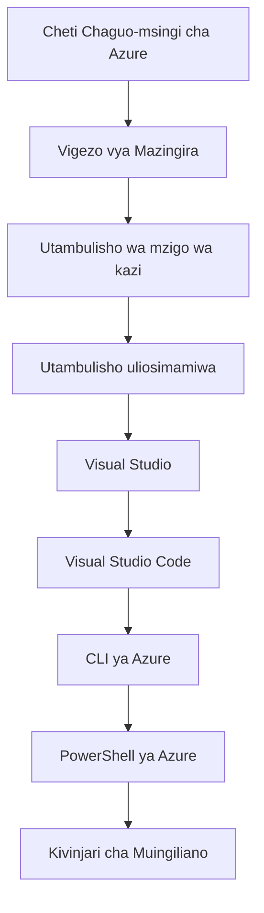

# AZD Basics - Kuelewa Azure Developer CLI

# AZD Basics - Dhana za Msingi na Misingi

**Chapter Navigation:**
- **📚 Course Home**: [AZD For Beginners](../../README.md)
- **📖 Current Chapter**: Chapter 1 - Foundation & Quick Start
- **⬅️ Previous**: [Course Overview](../../README.md#-chapter-1-foundation--quick-start)
- **➡️ Next**: [Installation & Setup](installation.md)
- **🚀 Next Chapter**: [Chapter 2: AI-First Development](../chapter-02-ai-development/microsoft-foundry-integration.md)

## Utangulizi

Somo hili linakujuza kwa Azure Developer CLI (azd), chombo cha nguvu cha mstari wa amri kinachokuongezea kasi kutoka kwa maendeleo ya ndani hadi ueneaji kwenye Azure. Utajifunza dhana za msingi, vipengele vya msingi, na kuelewa jinsi azd inavyorahisisha uenezaji wa programu za wingu-asili.

## Malengo ya Kujifunza

Mwisho wa somo hili, utakuwa umeweza:
- Kuelewa ni nini Azure Developer CLI na kusudi lake kuu
- Kujifunza dhana za msingi za violezo, mazingira, na huduma
- Kuchunguza vipengele muhimu ikiwa ni pamoja na maendeleo yanayoongozwa na violezo na Miundombinu kama Msimbo
- Kuelewa muundo wa mradi wa azd na mtiririko wa kazi
- Kuwa tayari kusakinisha na kusanidi azd kwa mazingira yako ya maendeleo

## Matokeo ya Kujifunza

Baada ya kukamilisha somo hili, utaweza:
- Kuelezea jukumu la azd katika taratibu za maendeleo za wingu za kisasa
- Kutambua vipengele vya muundo wa mradi wa azd
- Kuelezea jinsi violezo, mazingira, na huduma zinavyofanya kazi pamoja
- Kuelewa faida za Miundombinu kama Msimbo na azd
- Kutambua amri tofauti za azd na madhumuni yao

## Azure Developer CLI (azd) ni Nini?

Azure Developer CLI (azd) ni chombo cha mstari wa amri kilichoundwa kuharakisha safari yako kutoka kwa maendeleo ya ndani hadi ueneaji kwenye Azure. Inarahisisha mchakato wa kujenga, kueneza, na kusimamia programu za wingu-asili kwenye Azure.

### Unaweza Kuweka Nini kwa azd?

azd inaunga mkono aina nyingi za mzigo wa kazi—na orodha inaendelea kukua. Leo, unaweza kutumia azd kuweka:

| Workload Type | Examples | Same Workflow? |
|---------------|----------|----------------|
| **Traditional applications** | Web apps, REST APIs, static sites | ✅ `azd up` |
| **Services and microservices** | Container Apps, Function Apps, multi-service backends | ✅ `azd up` |
| **AI-powered applications** | Chat apps with Microsoft Foundry Models, RAG solutions with AI Search | ✅ `azd up` |
| **Intelligent agents** | Foundry-hosted agents, multi-agent orchestrations | ✅ `azd up` |

Mtazamo muhimu ni kwamba **mzunguko wa maisha wa azd unabaki ule ule bila kujali unachoeneza**. Unaanzisha mradi, unatoa miundombinu, unaweka msimbo wako, unatilia moni programu yako, na kufuta—iwe ni tovuti rahisi au wakala wa akili wa hali ya juu.

Mfululizo huu ni kwa sababu ya muundo. azd inachukulia uwezo wa AI kama aina nyingine ya huduma programu yako inaweza kutumia, si kitu tofauti kabisa. Kituo cha mazungumzo kinachotegemea Microsoft Foundry Models, kwa mtazamo wa azd, ni huduma nyingine tu ya kusanidi na kueneza.

### 🎯 Kwa Nini Kutumia AZD? Kulinganisha kwa Maisha Halisi

Tuchukulie kueneza tovuti rahisi pamoja na hifadhidata:

#### ❌ BILA AZD: Uenezaji wa Azure Kwa Mikono (dakika 30+)

```bash
# Hatua 1: Unda kundi la rasilimali
az group create --name myapp-rg --location eastus

# Hatua 2: Unda Mpango wa Huduma ya App
az appservice plan create --name myapp-plan \
  --resource-group myapp-rg \
  --sku B1 --is-linux

# Hatua 3: Unda App ya wavuti
az webapp create --name myapp-web-unique123 \
  --resource-group myapp-rg \
  --plan myapp-plan \
  --runtime "NODE:18-lts"

# Hatua 4: Unda akaunti ya Cosmos DB (dakika 10-15)
az cosmosdb create --name myapp-cosmos-unique123 \
  --resource-group myapp-rg \
  --kind MongoDB

# Hatua 5: Unda hifadhidata
az cosmosdb mongodb database create \
  --account-name myapp-cosmos-unique123 \
  --resource-group myapp-rg \
  --name tododb

# Hatua 6: Unda mkusanyiko
az cosmosdb mongodb collection create \
  --account-name myapp-cosmos-unique123 \
  --resource-group myapp-rg \
  --database-name tododb \
  --name todos

# Hatua 7: Pata mnyororo wa muunganisho
CONN_STR=$(az cosmosdb keys list \
  --name myapp-cosmos-unique123 \
  --resource-group myapp-rg \
  --type connection-strings \
  --query "connectionStrings[0].connectionString" -o tsv)

# Hatua 8: Sanidi mipangilio ya app
az webapp config appsettings set \
  --name myapp-web-unique123 \
  --resource-group myapp-rg \
  --settings MONGODB_URI="$CONN_STR"

# Hatua 9: Washa kurekodi kumbukumbu
az webapp log config --name myapp-web-unique123 \
  --resource-group myapp-rg \
  --application-logging filesystem \
  --detailed-error-messages true

# Hatua 10: Sanidi Application Insights
az monitor app-insights component create \
  --app myapp-insights \
  --location eastus \
  --resource-group myapp-rg

# Hatua 11: Unganisha Application Insights na App ya wavuti
INSTRUMENTATION_KEY=$(az monitor app-insights component show \
  --app myapp-insights \
  --resource-group myapp-rg \
  --query "instrumentationKey" -o tsv)

az webapp config appsettings set \
  --name myapp-web-unique123 \
  --resource-group myapp-rg \
  --settings APPINSIGHTS_INSTRUMENTATIONKEY="$INSTRUMENTATION_KEY"

# Hatua 12: Jenga programu kwa kompyuta ya ndani
npm install
npm run build

# Hatua 13: Unda kifurushi cha utoaji
zip -r app.zip . -x "*.git*" "node_modules/*"

# Hatua 14: Sambaza programu
az webapp deployment source config-zip \
  --resource-group myapp-rg \
  --name myapp-web-unique123 \
  --src app.zip

# Hatua 15: Subiri na omba iweze kufanya kazi 🙏
# (Hakuna uhakikisho wa kiotomatiki, majaribio kwa mikono yanahitajika)
```

**Matatizo:**
- ❌ Amri 15+ za kukumbuka na kutekeleza kwa mpangilio
- ❌ Dakika 30-45 za kazi ya mikono
- ❌ Rahisi kufanya makosa (kukiwa na mistari, vigezo vibaya)
- ❌ Misururu ya muunganisho inaonekana katika historia ya terminal
- ❌ Hakuna urejeshaji wa kiotomatiki ikiwa kitu kitashindwa
- ❌ Ngumu kurudia kwa wanachama wa timu
- ❌ Tofauti kila wakati (hairejelewi)

#### ✅ KWA AZD: Uenezaji wa Kiotomatiki (amri 5, dakika 10-15)

```bash
# Hatua 1: Anzisha kutoka kwenye kiolezo
azd init --template todo-nodejs-mongo

# Hatua 2: Thibitisha
azd auth login

# Hatua 3: Unda mazingira
azd env new dev

# Hatua 4: Tazama awali mabadiliko (hiari lakini inapendekezwa)
azd provision --preview

# Hatua 5: Sambaza kila kitu
azd up

# ✨ Imekamilika! Kila kitu kimesambazwa, kimewekwa, na kinafuatiliwa
```

**Faida:**
- ✅ **Amri 5** dhidi ya hatua 15+ za mkono
- ✅ **Dakika 10-15** jumla (sehemu kubwa ni kusubiri Azure)
- ✅ **Makosa ya mkono yanayopunguzwa** - mtiririko thabiti unaoungwa mkono na violezo
- ✅ **Ushughulikiaji salama wa siri** - violezo vingi vinatumia uhifadhi wa siri unaosimamiwa na Azure
- ✅ **Uenezaji unaorudiwa** - mtiririko ule ule kila wakati
- ✅ **Matokeo yanayoweza kurudiwa kabisa** - matokeo yale yale kila mara
- ✅ **Tayari kwa timu** - mtu yeyote anaweza kueneza kwa amri zile zile
- ✅ **Miundombinu kama Msimbo** - violezo vya Bicep vinadhibitiwa toleo
- ✅ **Ufuatiliaji uliowekwa ndani** - Application Insights imewekwa moja kwa moja

### 📊 Upunguzaji wa Muda na Makosa

| Metric | Manual Deployment | AZD Deployment | Improvement |
|:-------|:------------------|:---------------|:------------|
| **Commands** | 15+ | 5 | 67% fewer |
| **Time** | 30-45 min | 10-15 min | 60% faster |
| **Error Rate** | ~40% | <5% | 88% reduction |
| **Consistency** | Low (manual) | 100% (automated) | Perfect |
| **Team Onboarding** | 2-4 hours | 30 minutes | 75% faster |
| **Rollback Time** | 30+ min (manual) | 2 min (automated) | 93% faster |

## Dhana za Msingi

### Violezo
Violezo ni msingi wa azd. Vinajumuisha:
- **Msimbo wa programu** - Msimbo wako wa chanzo na utegemezi
- **Ufafanuzi wa miundombinu** - Rasilimali za Azure zilizounganishwa kwa Bicep au Terraform
- **Faili za usanidi** - Mipangilio na vigezo vya mazingira
- **Skripti za utoaji** - Mtiririko wa kazi wa utoaji wa kiotomatiki

### Mazingira
Mazingira yanawakilisha malengo tofauti ya uenezaji:
- **Development** - Kwa majaribio na maendeleo
- **Staging** - Mazingira kabla ya uzalishaji
- **Production** - Mazingira ya uzalishaji ya moja kwa moja

Kila mazingira yanahifadhi yake mwenyewe:
- kikundi cha rasilimali cha Azure
- mipangilio ya usanidi
- hali ya uenezaji

### Huduma
Huduma ni vipande vya msingi vya programu yako:
- **Frontend** - Programu za wavuti, SPA
- **Backend** - APIs, microservices
- **Database** - Suluhisho za uhifadhi wa data
- **Storage** - Uhifadhi wa faili na blob

## Vipengele Muhimu

### 1. Maendeleo Yanayoongozwa na Violezo
```bash
# Vinjari templeti zinazopatikana
azd template list

# Anzisha kutoka kwa templeti
azd init --template <template-name>
```

### 2. Miundombinu kama Msimbo
- **Bicep** - lugha maalum ya Azure
- **Terraform** - chombo cha miundombinu kwa wingu nyingi
- **ARM Templates** - violezo vya Azure Resource Manager

### 3. Mifumo ya Kazi Iliyoingiliana
```bash
# Mtiririko kamili wa utoaji
azd up            # Kutoa rasilimali na kupeleka; hii hufanyika bila ushiriki kwa usanidi wa mara ya kwanza

# 🧪 MPYA: Angalia awali mabadiliko ya miundombinu kabla ya kupeleka (SALAMA)
azd provision --preview    # Iga utekelezaji wa miundombinu bila kufanya mabadiliko

azd provision     # Tengeneza rasilimali za Azure; tumia hii ikiwa unasasisha miundombinu
azd deploy        # Peleka msimbo wa programu au uweke tena msimbo wa programu baada ya kusasisha
azd down          # Safisha rasilimali
```

#### 🛡️ Kupanga Miundombinu kwa Usalama kwa Kutazama Mapema
Amri ya `azd provision --preview` ni mabadiliko makubwa kwa uenezaji salama:
- **Uchambuzi wa majaribio (dry-run)** - Inaonyesha kile kitakachoundwa, kubadilishwa, au kufutwa
- **Hatari sifuri** - Hakuna mabadiliko ya kweli yafanywayo kwa mazingira yako ya Azure
- **Ushirikiano wa timu** - Shiriki matokeo ya preview kabla ya uenezaji
- **Makadirio ya gharama** - Elewa gharama za rasilimali kabla ya kujitolea

```bash
# Mfano wa mtiririko wa mapitio
azd provision --preview           # Angalia yatakayobadilika
# Kagua matokeo, jadili na timu
azd provision                     # Tekeleza mabadiliko kwa ujasiri
```

### 📊 Mwonekano: Mchakato wa Maendeleo wa AZD

```mermaid
graph LR
    A[Anzisha azd (azd init)] -->|Anzisha mradi| B[Ingia (azd auth login)]
    B -->|Thibitisha| C[Unda mazingira (azd env new)]
    C -->|Tengeneza mazingira| D{Je, ni utekelezaji wa kwanza?}
    D -->|Ndiyo| E[Anzisha huduma (azd up)]
    D -->|Hapana| F[Toa miundombinu --hakiki awali (azd provision --preview)]
    F -->|Kagua mabadiliko| G[Toa miundombinu (azd provision)]
    E -->|Hupanga na hupakia| H[Rasilimali zinaendesha]
    G -->|Inasasisha miundombinu| H
    H -->|Fuatilia| I[Fuatilia (azd monitor)]
    I -->|Fanya mabadiliko ya msimbo| J[Pakia msimbo (azd deploy)]
    J -->|Pakia tena msimbo tu| H
    H -->|Safisha| K[Ondoa miundombinu (azd down)]
    
    style A fill:#e1f5fe
    style E fill:#c8e6c9
    style F fill:#fff9c4
    style H fill:#c5e1a5
    style K fill:#ffcdd2
```

**Ufafanuzi wa Mchakato:**
1. **Init** - Start with template or new project
2. **Auth** - Authenticate with Azure
3. **Environment** - Create isolated deployment environment
4. **Preview** - 🆕 Daima hakiki mabadiliko ya miundombinu kwanza (vitendo salama)
5. **Provision** - Unda/boresha rasilimali za Azure
6. **Deploy** - Sogeza msimbo wa programu yako
7. **Monitor** - Angalia utendaji wa programu
8. **Iterate** - Fanya mabadiliko na uweke tena msimbo
9. **Cleanup** - Ondoa rasilimali ukimaliza

### 4. Usimamizi wa Mazingira
```bash
# Unda na simamia mazingira
azd env new <environment-name>
azd env select <environment-name>
azd env list
```

### 5. Nyongeza na Amri za AI

azd inatumia mfumo wa nyongeza kuongeza uwezo zaidi ya CLI kuu. Hii ni muhimu sana kwa mzigo wa kazi za AI:

```bash
# Orodhesha nyongeza zinazopatikana
azd extension list

# Sakinisha nyongeza ya wakala wa Foundry
azd extension install azure.ai.agents

# Anzisha mradi wa wakala wa AI kutoka kwenye manifesi
azd ai agent init -m agent-manifest.yaml

# Jaribu wakala aliyewekwa (inaonyesha ucheleweshaji na muda hadi byte ya kwanza)
azd ai agent invoke

# Anzisha seva ya MCP kwa ajili ya maendeleo yanayosaidiwa na AI (Alfa)
azd mcp start
```

**Mzunguko wa maisha wa wakala, kutoka mwanzo hadi mwisho.** Mara tu utaweka `azure.ai.agents`, mtiririko mmoja unakupeleka kutoka wazo hadi wakala anayeendesha na kufuatiliwa. Haufai kuwa na haya yote siku ya kwanza—jua tu kwamba yapo:

| Stage | Command | What it does |
|-------|---------|--------------|
| **Scaffold** | `azd ai agent init -m <manifest>` | Generate an agent project from a manifest |
| **Test** | `azd ai agent invoke` | Call the agent and view response timing |
| **Measure** | `azd ai agent eval generate` | Create an evaluation dataset for the agent |
| **Improve** | `azd ai agent optimize` | Optimize agent instructions against your data |
| **Inspect** | `azd ai agent endpoint show` | View the live endpoint configuration |
| **Clean up** | `azd ai agent delete` | Delete a hosted agent and all its versions |

> Nyongeza zinashughulikiwa kwa kina katika [Chapter 2: AI-First Development](../chapter-02-ai-development/agents.md) na rejea ya [AZD AI CLI Commands](../chapter-08-production/production-ai-practices.md#azd-ai-cli-commands-and-extensions).

## 📁 Muundo wa Mradi

Muundo wa kawaida wa mradi wa azd:
```
my-app/
├── .azd/                    # azd configuration
│   └── config.json
├── .azure/                  # Azure deployment artifacts
├── .devcontainer/          # Development container config
├── .github/workflows/      # GitHub Actions
├── .vscode/               # VS Code settings
├── infra/                 # Infrastructure code
│   ├── main.bicep        # Main infrastructure template
│   ├── main.parameters.json
│   └── modules/          # Reusable modules
├── src/                  # Application source code
│   ├── api/             # Backend services
│   └── web/             # Frontend application
├── azure.yaml           # azd project configuration
└── README.md
```

## 🔧 Faili za Usanidi

### azure.yaml
The main project configuration file:
```yaml
name: my-awesome-app
metadata:
  template: my-template@1.0.0

services:
  web:
    project: ./src/web
    language: js
    host: appservice
  api:
    project: ./src/api
    language: js
    host: appservice

hooks:
  preprovision:
    shell: pwsh
    run: echo "Preparing to provision..."
```

### .azure/config.json
Usanidi maalum wa mazingira:
```json
{
  "version": 1,
  "defaultEnvironment": "dev",
  "environments": {
    "dev": {
      "subscriptionId": "your-subscription-id",
      "location": "eastus"
    }
  }
}
```

## 🎪 Mifumo ya Kawaida ya Kazi na Mazoezi ya Vitendo

> **💡 Vidokezo vya Kujifunza:** Fuata mazoezi haya kwa mpangilio ili kujenga ujuzi wako wa AZD hatua kwa hatua.

### 🎯 Mazoezi 1: Anzisha Mradi Wako wa Kwanza

**Lengo:** Tengeneza mradi wa AZD na uchunguze muundo wake

**Hatua:**
```bash
# Tumia kiolezo kilichothibitishwa
azd init --template todo-nodejs-mongo

# Chunguza faili zilizotengenezwa
ls -la  # Tazama faili zote ikijumuisha zile zilizofichwa

# Faili muhimu zilizotengenezwa:
# - azure.yaml (usanidi mkuu)
# - infra/ (msimbo wa miundombinu)
# - src/ (msimbo wa programu)
```

**✅ Mafanikio:** Una azure.yaml, infra/, na saraka za src/

---

### 🎯 Mazoezi 2: Weka kwenye Azure

**Lengo:** Kamilisha uenezaji kutoka mwanzo hadi mwisho

**Hatua:**
```bash
# 1. Thibitisha
az login && azd auth login

# 2. Unda mazingira
azd env new dev
azd env set AZURE_LOCATION eastus

# 3. Pitia mabadiliko (INAPENDEKEZWA)
azd provision --preview

# 4. Sambaza kila kitu
azd up

# 5. Hakiki usambazaji
azd show    # Tazama URL ya programu yako
```

**Muda Unaotarajiwa:** 10-15 dakika  
**✅ Mafanikio:** URL ya programu inafunguka katika kivinjari

---

### 🎯 Mazoezi 3: Mazingira Mengi

**Lengo:** Weka kwenye dev na staging

**Hatua:**
```bash
# Tayari kuna dev, tengeneza staging
azd env new staging
azd env set AZURE_LOCATION westus2
azd up

# Badilisha kati yao
azd env list
azd env select dev
```

**✅ Mafanikio:** Vikundi viwili tofauti vya rasilimali kwenye Azure Portal

---

### 🛡️ Safi Kabisa: `azd down --force --purge`

Unapohitaji kuanzisha tena kabisa:

```bash
azd down --force --purge
```

**Inayofanya:**
- `--force`: Hakuna maswali ya uthibitisho
- `--purge`: Inafuta hali zote za ndani na rasilimali za Azure

**Tumia wakati:**
- Uenezaji ulishindwa katikati
- Kubadilisha miradi
- Unahitaji kuanza upya

---

## 🎪 Rejea ya Mchakato wa Asili

### Kuanzisha Mradi Mpya
```bash
# Njia 1: Tumia kiolezo kilicho tayari
azd init --template todo-nodejs-mongo

# Njia 2: Anza kutoka mwanzo
azd init

# Njia 3: Tumia saraka ya sasa
azd init .
```

### Mzunguko wa Maendeleo
```bash
# Sanidi mazingira ya maendeleo
azd auth login
azd env new dev
azd env select dev

# Sambaza kila kitu
azd up

# Fanya mabadiliko na sambaza tena
azd deploy

# Safisha baada ya kumaliza
azd down --force --purge # amri katika Azure Developer CLI ni **uanzishaji upya mkali** kwa mazingira yako—hasa inavyosaidia unapokuwa unatatua matatizo ya utoaji ulioshindwa, unaposafisha rasilimali zisizo na mmiliki, au unajiandaa kwa utoaji upya safi.
```

## Kuelewa `azd down --force --purge`
Amri ya `azd down --force --purge` ni njia yenye nguvu ya kuvunja kabisa mazingira yako ya azd na rasilimali zote zinazohusiana. Hapa kuna muhtasari wa kile kila bendera inafanya:
```
--force
```
- Inaruka maombi ya uthibitisho.
- Inafaa kwa otomatiki au uandishi wa skripti ambapo ingizo la mkono haliwezekani.
- Inahakikisha kuvunjwa kunaendelea bila kuingiliwa, hata kama CLI inagundua kutolingana.

```
--purge
```
Futa **metadata zote zinazohusiana**, ikijumuisha:
Environment state
Local `.azure` folder
Cached deployment info
Inazuia azd "kukumbuka" uenezaji wa awali, ambao unaweza kusababisha masuala kama vikundi vya rasilimali visivyolingana au marejeo ya rejista ambayo hayajasasishwa.


### Kwa Nini kutumia zote mbili?
Unapopata block na `azd up` kutokana na hali ya hali au uenezaji uliokwishabakia, mchanganyiko huu unahakikisha **ukurasa safi kabisa**.

Inasaidia hasa baada ya kufuta rasilimali kwa mkono kwenye Azure portal au unapobadilisha violezo, mazingira, au kanuni za kuitwa kwa vikundi vya rasilimali.


### Kusimamia Mazingira Mingi
```bash
# Tengeneza mazingira ya maandalizi
azd env new staging
azd env select staging
azd up

# Rudi kwenye mazingira ya maendeleo
azd env select dev

# Linganisha mazingira
azd env list
```

## 🔐 Uthibitishaji na Vyeti

Kuelewa uthibitishaji ni muhimu kwa uenezaji wenye mafanikio wa azd. Azure inatumia mbinu nyingi za uthibitishaji, na azd inatumia mnyororo ule ule wa vyeti unaotumika na zana nyingine za Azure.

### Uthibitishaji wa Azure CLI (`az login`)

Kabla ya kutumia azd, unahitaji kuthibitisha kwa Azure. Njia ya kawaida zaidi ni kutumia Azure CLI:

```bash
# Ingia kwa mwingiliano (huifungua kivinjari)
az login

# Ingia kwa tenanti maalum
az login --tenant <tenant-id>

# Ingia kwa wakala wa huduma
az login --service-principal -u <app-id> -p <password> --tenant <tenant-id>

# Angalia hali ya sasa ya kuingia
az account show

# Orodhesha usajili zinazopatikana
az account list --output table

# Weka usajili wa chaguo-msingi
az account set --subscription <subscription-id>
```

### Mtiririko wa Uthibitishaji
1. **Interactive Login**: Hufungua kivinjari chako chaguo-msingi kwa uthibitishaji
2. **Device Code Flow**: Kwa mazingira bila upatikanaji wa kivinjari
3. **Service Principal**: Kwa otomatiki na hali za CI/CD
4. **Managed Identity**: Kwa programu zinazohifadhiwa kwenye Azure

### DefaultAzureCredential Chain

DefaultAzureCredential ni aina ya cheti inayotoa uzoefu uliorahisishwa wa uthibitishaji kwa kujaribu vyanzo vingi vya vyeti kwa mpangilio maalum moja kwa moja:

#### Mpangilio wa Mnyororo wa Vyeti


#### 1. Environment Variables
```bash
# Weka vigezo vya mazingira kwa kitambulisho cha huduma
export AZURE_CLIENT_ID="<app-id>"
export AZURE_CLIENT_SECRET="<password>"
export AZURE_TENANT_ID="<tenant-id>"
```

#### 2. Workload Identity (Kubernetes/GitHub Actions)
Inatumiwa moja kwa moja katika:
- Azure Kubernetes Service (AKS) na Workload Identity
- GitHub Actions na uunganisho wa OIDC
- Matukio mengine ya utambulisho uliounganishwa

#### 3. Managed Identity
Kwa rasilimali za Azure kama:
- Virtual Machines
- App Service
- Azure Functions
- Container Instances

```bash
# Angalia ikiwa inakimbia kwenye rasilimali ya Azure yenye utambulisho uliosimamiwa
az account show --query "user.type" --output tsv
# Inarudisha: "servicePrincipal" ikiwa inatumia utambulisho uliosimamiwa
```

#### 4. Developer Tools Integration
- **Visual Studio**: Inatumia moja kwa moja akaunti iliyoingia
- **VS Code**: Inatumia vyeti vya nyongeza ya Azure Account
- **Azure CLI**: Inatumia vyeti vya `az login` (njia ya kawaida kwa maendeleo ya eneo)

### AZD Authentication Setup

```bash
# Njia 1: Tumia Azure CLI (Inapendekezwa kwa ajili ya maendeleo)
az login
azd auth login  # Inatumia taarifa za kuingia za Azure CLI zilizopo

# Njia 2: Uthibitishaji wa moja kwa moja wa azd
azd auth login --use-device-code  # Kwa mazingira yasiyo na kiolesura cha mtumiaji

# Njia 3: Angalia hali ya uthibitishaji
azd auth login --check-status

# Njia 4: Toka na uthibitisha tena
azd auth logout
azd auth login
```

### Mbinu Bora za Uthibitishaji

#### Kwa Maendeleo ya Ndani
```bash
# 1. Ingia kwa kutumia Azure CLI
az login

# 2. Thibitisha usajili sahihi
az account show
az account set --subscription "Your Subscription Name"

# 3. Tumia azd na nyaraka za kuingia zilizopo
azd auth login
```

#### Kwa Mipangilio ya CI/CD
```yaml
# GitHub Actions example
- name: Azure Login
  uses: azure/login@v1
  with:
    creds: ${{ secrets.AZURE_CREDENTIALS }}

- name: Deploy with azd
  run: |
    azd auth login --client-id ${{ secrets.AZURE_CLIENT_ID }} \
                    --client-secret ${{ secrets.AZURE_CLIENT_SECRET }} \
                    --tenant-id ${{ secrets.AZURE_TENANT_ID }}
    azd up --no-prompt
```

#### Kwa Mazingira ya Uzalishaji
- Tumia **Managed Identity** unapoendesha kwenye rasilimali za Azure
- Tumia **Service Principal** kwa senario za otomatiki
- Epuka kuhifadhi nywila ndani ya msimbo au faili za usanidi
- Tumia **Azure Key Vault** kwa usanidi nyeti

### Masuala ya Kawaida ya Uthibitishaji na Suluhisho

#### Tatizo: "No subscription found"
```bash
# Suluhisho: Weka usajili wa chaguo-msingi
az account list --output table
az account set --subscription "<subscription-id>"
azd env set AZURE_SUBSCRIPTION_ID "<subscription-id>"
```

#### Tatizo: "Insufficient permissions"
```bash
# Suluhisho: Kagua na uteue majukumu yanayohitajika
az role assignment list --assignee $(az account show --query user.name --output tsv)

# Majukumu yanayohitajika ya kawaida:
# - Mchangiaji (kwa usimamizi wa rasilimali)
# - Msimamizi wa Ufikiaji wa Mtumiaji (kwa uteuzi wa majukumu)
```

#### Tatizo: "Token expired"
```bash
# Suluhisho: Thibitisha upya
az logout
az login
azd auth logout
azd auth login
```

### Uthibitishaji katika Senario Tofauti

#### Maendeleo ya Ndani
```bash
# Akaunti ya maendeleo ya kibinafsi
az login
azd auth login
```

#### Maendeleo ya Timu
```bash
# Tumia tenanti maalum kwa shirika
az login --tenant contoso.onmicrosoft.com
azd auth login
```

#### Senario za Multi-tenant
```bash
# Badilisha kati ya wapangaji
az login --tenant tenant1.onmicrosoft.com
# Sambaza kwa mpangaji 1
azd up

az login --tenant tenant2.onmicrosoft.com  
# Sambaza kwa mpangaji 2
azd up
```

### Mambo ya Usalama

1. **Uhifadhi wa Vyeti**: Kamwe usihifadhi vyeti katika msimbo wa chanzo
2. **Kuzuia Wigo**: Tumia kanuni ya uwezo mdogo (least-privilege) kwa service principals
3. **Mzunguko wa Tokeni**: Badilisha siri za service principal mara kwa mara
4. **Mfumo wa Ukaguzi**: Angalia shughuli za uthibitishaji na za utekelezaji
5. **Usalama wa Mtandao**: Tumia private endpoints pale inapowezekana

### Utatuzi wa Tatizo la Uthibitishaji

```bash
# Tatua matatizo ya uthibitishaji
azd auth login --check-status
az account show
az account get-access-token

# Amri za kawaida za uchunguzi
whoami                          # Muktadha wa mtumiaji wa sasa
az ad signed-in-user show      # Maelezo ya mtumiaji wa Microsoft Entra ID
az group list                  # Jaribu upatikanaji wa rasilimali
```

## Kuelewa `azd down --force --purge`

### Ugunduzi
```bash
azd template list              # Vinjari violezo
azd template show <template>   # Maelezo ya kiolezo
azd init --help               # Chaguzi za uanzishaji
```

### Usimamizi wa Mradi
```bash
azd show                     # Muhtasari wa mradi
azd env list                # Mazingira yanayopatikana na chaguo-msingi kilichochaguliwa
azd config show            # Mipangilio ya usanidi
```

### Ufuatiliaji
```bash
azd monitor                  # Fungua ufuatiliaji wa portal ya Azure
azd monitor --logs           # Tazama kumbukumbu za programu
azd monitor --live           # Tazama vipimo vya wakati halisi
azd pipeline config          # Sanidi CI/CD
```

## Mbinu Bora

### 1. Tumia Majina Yenye Maana
```bash
# Nzuri
azd env new production-east
azd init --template web-app-secure

# Epuka
azd env new env1
azd init --template template1
```

### 2. Tumia Violezo
- Anza na violezo vilivyopo
- Badilisha kwa mahitaji yako
- Unda violezo vinavyoweza kutumika tena kwa shirika lako

### 3. Kutenganisha Mazingira
- Tumia mazingira tofauti kwa dev/staging/prod
- Usiweke moja kwa moja kwenye uzalishaji kutoka kwa kompyuta ya ndani
- Tumia CI/CD pipelines kwa deployments za uzalishaji

### 4. Usimamizi wa Usanidi
- Tumia vigezo vya mazingira kwa data nyeti
- Weka usanidi katika udhibiti wa toleo
- Andika nyaraka za mipangilio maalum kwa mazingira

## Mpangilio wa Kujifunza

### Mwanzo (Week 1-2)
1. Sakinisha azd na ufanye uthibitisho
2. Weka template rahisi
3. Elewa muundo wa mradi
4. Jifunze amri za msingi (up, down, deploy)

### Wastani (Week 3-4)
1. Badilisha violezo
2. Simamia mazingira mengi
3. Elewa msimbo wa miundombinu
4. Sanidi CI/CD pipelines

### Wa Juu (Week 5+)
1. Unda violezo maalum
2. Mifumo ya miundombinu ya kiwango cha juu
3. Uwekaji katika maeneo mengi
4. Usanidi wa kiwango cha shirika

## Hatua Zifuatazo

**📖 Endelea Kujifunza Sura ya 1:**
- [Usakinishaji & Usanidi](installation.md) - Sakinisha azd na usanidi
- [Mradi Wako wa Kwanza](first-project.md) - Kamilisha mafunzo ya vitendo
- [Mwongozo wa Usanidi](configuration.md) - Chaguzi za usanidi za juu

**🎯 Tayari kwa Sura Inayofuata?**
- [Sura ya 2: Maendeleo ya AI-Kwanza](../chapter-02-ai-development/microsoft-foundry-integration.md) - Anza kujenga programu za AI

## Marejeo ya Ziada

- [Muhtasari wa Azure Developer CLI](https://learn.microsoft.com/en-us/azure/developer/azure-developer-cli/)
- [Makusanyo ya Violezo](https://azure.github.io/awesome-azd/)
- [Mifano ya Jamii](https://github.com/Azure-Samples)

---

## 🙋 Maswali Yanayoulizwa Mara kwa Mara

### Maswali ya Jumla

**Q: Ni tofauti gani kati ya AZD na Azure CLI?**

A: Azure CLI (`az`) ni kwa kusimamia rasilimali binafsi za Azure. AZD (`azd`) ni kwa kusimamia programu nzima:

```bash
# Azure CLI - Usimamizi wa rasilimali wa kiwango cha chini
az webapp create --name myapp --resource-group rg
az sql server create --name myserver --resource-group rg
# ...amri nyingi zaidi zinahitajika

# AZD - Usimamizi wa kiwango cha programu
azd up  # Inaweka programu nzima pamoja na rasilimali zote
```

**Fikiria kwa njia hii:**
- `az` = Kufanya kazi na tofali za Lego mmoja mmoja
- `azd` = Kufanya kazi na seti kamili za Lego

---

**Q: Je, nahitaji kujua Bicep au Terraform ili kutumia AZD?**

A: Hapana! Anza na violezo:
```bash
# Tumia kiolezo kilichopo - ujuzi wa IaC hauhitajiki
azd init --template todo-nodejs-mongo
azd up
```

Unaweza kujifunza Bicep baadaye ili kubadilisha miundombinu. Violezo vinatoa mifano inayofanya kazi kwa kujifunza.

---

**Q: Ni gharama gani kuendesha violezo vya AZD?**

A: Gharama zinatofautiana kulingana na template. Violezo vingi vya maendeleo vinagharimu $50-150/mwezi:

```bash
# Angalia gharama kabla ya kupeleka
azd provision --preview

# Daima safisha unapokuwa hautumii
azd down --force --purge  # Inaondoa rasilimali zote
```

**Ushauri wa mtaalam:** Tumia ngazi za bure pale zinapopatikana:
- App Service: F1 (Free) tier
- Microsoft Foundry Models: Azure OpenAI 50,000 tokens/month free
- Cosmos DB: 1000 RU/s free tier

---

**Q: Je, ninaweza kutumia AZD na rasilimali za Azure zilizopo?**

A: Ndiyo, lakini ni rahisi kuanza mpya. AZD inafanya kazi vizuri zaidi inapodhibiti mzunguko mzima wa maisha. Kwa rasilimali zilizopo:
```bash
# Chaguo 1: Ingiza rasilimali zilizopo (kwa wataalamu)
azd init
# Kisha badilisha infra/ ili kurejelea rasilimali zilizopo

# Chaguo 2: Anza kutoka mwanzo (inayopendekezwa)
azd init --template matching-your-stack
azd up  # Inaunda mazingira mapya
```

---

**Q: Ninawezaje kushirikisha mradi wangu na wenzangu?**

A: Weka (commit) mradi wa AZD kwenye Git (lakini SI folda .azure):
```bash
# Tayari imewekwa katika .gitignore kwa chaguo-msingi
.azure/        # Inajumuisha siri na data za mazingira
*.env          # Vigezo vya mazingira

# Wanachama wa timu kisha:
git clone <your-repo>
azd auth login
azd env new <their-name>-dev
azd up
```

Kila mtu anapata miundombinu sawa kutoka kwa violezo vile vile.

---

### Maswali ya Utatuzi wa Matatizo

**Q: "azd up" ilishindwa nusu njia. Nifanye nini?**

A: Kagua kosa, liweke sawa, kisha jaribu tena:
```bash
# Tazama kumbukumbu za kina
azd show

# Marekebisho ya kawaida:

# 1. Ikiwa kikomo kimevuka:
azd env set AZURE_LOCATION "westus2"  # Jaribu eneo tofauti

# 2. Ikiwa kuna mgongano wa majina ya rasilimali:
azd down --force --purge  # Anza upya kwa safi
azd up  # Jaribu tena

# 3. Ikiwa uthibitisho umeisha:
az login
azd auth login
azd up
```

**Tatizo la kawaida:** Usajili wa Azure ulioteuliwa si sahihi
```bash
az account list --output table
az account set --subscription "<correct-subscription>"
```

---

**Q: Ninawezaje kupeleka tu mabadiliko ya msimbo bila kuanzisha upya miundombinu?**

A: Tumia `azd deploy` badala ya `azd up`:
```bash
azd up          # Mara ya kwanza: kuandaa + kupeleka (polepole)

# Fanya mabadiliko kwenye msimbo...

azd deploy      # Mara za baadaye: kupeleka tu (haraka)
```

Ulinganisho wa kasi:
- `azd up`: dakika 10-15 (huunda miundombinu)
- `azd deploy`: dakika 2-5 (msimbo tu)

---

**Q: Ninaweza kubadilisha violezo vya miundombinu?**

A: Ndiyo! Hariri faili za Bicep katika `infra/`:
```bash
# Baada ya azd init
cd infra/
code main.bicep  # Hariri katika VS Code

# Hakiki mabadiliko
azd provision --preview

# Tekeleza mabadiliko
azd provision
```

**Ushauri:** Anza kwa ndogo - badilisha SKUs kwanza:
```bicep
// infra/main.bicep
sku: {
  name: 'B1'  // Change to 'P1V2' for production
}
```

---

**Q: Ninawezaje kufuta kila kitu kilichotengenezwa na AZD?**

A: Amri moja inafuta rasilimali zote:
```bash
azd down --force --purge

# Hii inafuta:
# - Rasilimali zote za Azure
# - Kikundi cha rasilimali
# - Hali ya mazingira ya ndani
# - Takwimu za uanzishaji zilizohifadhiwa kwenye cache
```

**Kila wakati endesha hili wakati:**
- Umehitimisha kujaribu template
- Unabadilisha kwenda mradi tofauti
- Unataka kuanza upya

**Kuokoa gharama:** Kufuta rasilimali zisizotumika = malipo $0

---

**Q: Nifanye nini ikiwa nilifuta rasilimali kwa bahati nasibu kwenye Azure Portal?**

A: Hali ya AZD inaweza kupotoka. Njia ya kuanza upya:
```bash
# 1. Ondoa hali ya ndani
azd down --force --purge

# 2. Anza upya
azd up

# Chaguo mbadala: Waachie AZD itambue na irekebishe
azd provision  # Itaunda rasilimali zilizokosekana
```

---

### Maswali ya Juu

**Q: Je, ninaweza kutumia AZD katika pipelines za CI/CD?**

A: Ndiyo! Mfano wa GitHub Actions:
```yaml
# .github/workflows/deploy.yml
name: Deploy with AZD

on:
  push:
    branches: [main]

jobs:
  deploy:
    runs-on: ubuntu-latest
    steps:
      - uses: actions/checkout@v2
      
      - name: Install azd
        run: curl -fsSL https://aka.ms/install-azd.sh | bash
      
      - name: Azure Login
        run: |
          azd auth login \
            --client-id ${{ secrets.AZURE_CLIENT_ID }} \
            --client-secret ${{ secrets.AZURE_CLIENT_SECRET }} \
            --tenant-id ${{ secrets.AZURE_TENANT_ID }}
      
      - name: Deploy
        run: azd up --no-prompt
```

---

**Q: Ninawezaje kushughulikia siri na data nyeti?**

A: AZD inaingia kazi na Azure Key Vault moja kwa moja:
```bash
# Siri zinahifadhiwa kwenye Key Vault, sio kwenye msimbo
azd env set DATABASE_PASSWORD "$(openssl rand -base64 32)"

# AZD kwa otomatiki:
# 1. Inaunda Key Vault
# 2. Inahifadhi siri
# 3. Inampa programu ufikiaji kupitia Managed Identity
# 4. Inaingiza wakati wa utekelezaji
```

**Kamwe usifanye commit:**
- `.azure/` folder (ina data ya mazingira)
- `.env` files (siri za ndani)
- Connection strings

---

**Q: Je, ninaweza kupeleka katika mikoa mingi?**

A: Ndiyo, tengeneza mazingira kwa kila eneo:
```bash
# Mazingira ya Mashariki ya Marekani
azd env new prod-eastus
azd env set AZURE_LOCATION eastus
azd up

# Mazingira ya Magharibi ya Ulaya
azd env new prod-westeurope
azd env set AZURE_LOCATION westeurope
azd up

# Kila mazingira ni ya kujitegemea
azd env list
```

Kwa programu za kweli za mikoa mingi, badilisha violezo vya Bicep ili kupeleka kwa mikoa mingi kwa wakati mmoja.

---

**Q: Ninaweza kupata msaada wapi ikiwa nimekwama?**

1. **Nyaraka za AZD:** https://learn.microsoft.com/azure/developer/azure-developer-cli/
2. **Masuala ya GitHub:** https://github.com/Azure/azure-dev/issues
3. **Discord:** [Discord ya Azure](https://discord.gg/microsoft-azure) - #azure-developer-cli channel
4. **Stack Overflow:** Tag `azure-developer-cli`
5. **Kozi hii:** [Mwongozo wa Utatuzi](../chapter-07-troubleshooting/common-issues.md)

**Ushauri wa mtaalamu:** Kabla ya kuuliza, endesha:
```bash
azd show       # Inaonyesha hali ya sasa
azd version    # Inaonyesha toleo lako
```
Jumuisha taarifa hizi katika swali lako kwa msaada wa haraka.

---

## 🎓 Ni Nini Ifuatayo?

Sasa unaelewa misingi ya AZD. Chagua njia yako:

### 🎯 Kwa Waanzilishi:
1. **Ifuatayo:** [Usakinishaji & Usanidi](installation.md) - Sakinisha AZD kwenye mashine yako
2. **Kisha:** [Mradi Wako wa Kwanza](first-project.md) - Weka programu yako ya kwanza
3. **Mazoezi:** Kamilisha mazoezi yote 3 katika somo hili

### 🚀 Kwa Waendelezaji wa AI:
1. **Ruka kwa:** [Sura ya 2: Maendeleo ya AI-Kwanza](../chapter-02-ai-development/microsoft-foundry-integration.md)
2. **Weka:** Anza na `azd init --template get-started-with-ai-chat`
3. **Jifunze:** Jenga wakati unapoweka

### 🏗️ Kwa Waendelezaji Wenye Uzoefu:
1. **Pitia:** [Mwongozo wa Usanidi](configuration.md) - Mipangilio ya juu
2. **Chunguza:** [Miundombinu kama Msimbo](../chapter-04-infrastructure/provisioning.md) - Bicep deep dive
3. **Jenga:** Unda violezo maalum kwa stack yako

---

**Uvinjari wa Sura:**
- **📚 Nyumbani kwa Kozi**: [AZD Kwa Waanzilishi](../../README.md)
- **📖 Sura ya Sasa**: Chapter 1 - Foundation & Quick Start  
- **⬅️ Iliyopita**: [Muhtasari wa Kozi](../../README.md#-chapter-1-foundation--quick-start)
- **➡️ Ifuatayo**: [Usakinishaji & Usanidi](installation.md)
- **🚀 Sura Inayofuata**: [Sura ya 2: Maendeleo ya AI-Kwanza](../chapter-02-ai-development/microsoft-foundry-integration.md)

---

<!-- CO-OP TRANSLATOR DISCLAIMER START -->
**Kionyozo**:
Hati hii imetafsiriwa kwa kutumia huduma ya tafsiri ya AI [Co-op Translator](https://github.com/Azure/co-op-translator). Ingawa tunajitahidi kupata usahihi, tafadhali fahamu kwamba tafsiri za kiotomatiki zinaweza kuwa na makosa au upungufu wa usahihi. Hati ya asili katika lugha yake halisi inapaswa kuchukuliwa kama chanzo cha mamlaka. Kwa taarifa muhimu, tafsiri ya kitaalamu inayofanywa na binadamu inapendekezwa. Hatutojibu kwa kuelewa vibaya au tafsiri potofu zinazotokea kutokana na matumizi ya tafsiri hii.
<!-- CO-OP TRANSLATOR DISCLAIMER END -->