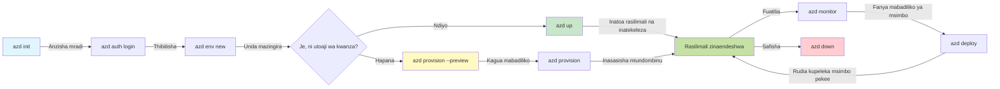
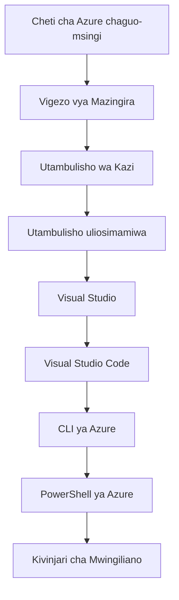

# AZD Basics - Kuelewa Azure Developer CLI

# AZD Basics - Dhana za Msingi na Misingi

**Uvinjari wa Sura:**
- **📚 Nyumbani wa Kozi**: [AZD Kwa Waanzilishi](../../README.md)
- **📖 Sura ya Sasa**: Sura 1 - Msingi na Anza Haraka
- **⬅️ Iliyotangulia**: [Muhtasari wa Kozi](../../README.md#-chapter-1-foundation--quick-start)
- **➡️ Ifuatayo**: [Usakinishaji na Usanidi](installation.md)
- **🚀 Sura Ifuatayo**: [Sura ya 2: Maendeleo ya AI-Kwanza](../chapter-02-ai-development/microsoft-foundry-integration.md)

## Utangulizi

Somo hili linakuanzisha kwa Azure Developer CLI (azd), chombo chenye nguvu cha njia ya amri kinachofanikisha safari yako kutoka maendeleo ya ndani hadi uwasilishaji kwenye Azure. Utajifunza dhana za msingi, vipengele vya msingi, na kuelewa jinsi azd inavyorahisisha uwasilishaji wa programu za asili za wingu.

## Malengo ya Kujifunza

Mwisho wa somo hili, utakuwa umeweza:
- Elewa ni nini Azure Developer CLI na kusudi lake kuu
- Jifunze dhana za msingi za templeti, mazingira, na huduma
- Gundua vipengele muhimu vikiwemo maendeleo yanayotokana na templeti na Miundombinu kama Msimbo
- Elewa muundo wa mradi wa azd na mtiririko wa kazi
- Kuwa tayari kusakinisha na kusanidi azd kwa mazingira yako ya maendeleo

## Matokeo ya Kujifunza

Baada ya kukamilisha somo hili, utaweza:
- Eleza jukumu la azd katika mtiririko wa kazi wa maendeleo ya wingu ya kisasa
- Tambua vipengele vya muundo wa mradi wa azd
- Eleza jinsi templeti, mazingira, na huduma zinavyofanya kazi pamoja
- Elewa faida za Miundombinu kama Msimbo kwa kutumia azd
- Tambua amri tofauti za azd na madhumuni yao

## Azure Developer CLI (azd) ni nini?

Azure Developer CLI (azd) ni chombo cha njia ya amri kilichoundwa kuharakisha safari yako kutoka maendeleo ya ndani hadi uwasilishaji kwenye Azure. Inarahisisha mchakato wa kujenga, kupeleka, na kusimamia programu za asili za wingu kwenye Azure.

### Unaweza kupeleka nini kwa azd?

azd inaunga mkono aina kubwa ya mizigo ya kazi—na orodha inaendelea kukua. Leo, unaweza kutumia azd kupeleka:

| Aina ya Kazi | Mifano | Mtiririko sawa? |
|---------------|----------|----------------|
| **Programu za jadi** | Programu za wavuti, REST APIs, tovuti za statiki | ✅ `azd up` |
| **Huduma na microservices** | Container Apps, Function Apps, backendi zenye huduma nyingi | ✅ `azd up` |
| **Programu zilizoendeshwa na AI** | Programu za mazungumzo zenye Microsoft Foundry Models, suluhisho za RAG na AI Search | ✅ `azd up` |
| **Wakala mahiri** | wakala wanaohifadhiwa Foundry, muundo wa wakala wengi | ✅ `azd up` |

Uelewa muhimu ni kwamba **mzunguko wa maisha wa azd unabaki sawa bila kujali unachopeleka**. Unaanzisha mradi, unatayarisha miundombinu, kupeleka msimbo wako, kufuatilia programu yako, na kusafisha—iwe ni tovuti rahisi au wakala wa AI wa hali ya juu.

Uendelevu huu ni kwa sababu ya muundo. azd inachukulia uwezo wa AI kama aina nyingine ya huduma programu yako inaweza kutumia, sio kitu kinachotofautiana kwa msingi. Mwisho wa mazungumzo unaotumia Microsoft Foundry Models ni, kwa mtazamo wa azd, huduma nyingine tu ya kusanidi na kupeleka.

### 🎯 Kwa Nini Kutumia AZD? Ulinganisho wa Dunia Halisi

Tufananishe kupeleka programu rahisi ya wavuti yenye hifadhidata:

#### ❌ BILA AZD: Uwekaji kwa Azure kwa Mkono (dakika 30+)

```bash
# Hatua 1: Unda kikundi cha rasilimali
az group create --name myapp-rg --location eastus

# Hatua 2: Unda Mpango wa Huduma ya App
az appservice plan create --name myapp-plan \
  --resource-group myapp-rg \
  --sku B1 --is-linux

# Hatua 3: Unda programu ya wavuti
az webapp create --name myapp-web-unique123 \
  --resource-group myapp-rg \
  --plan myapp-plan \
  --runtime "NODE:18-lts"

# Hatua 4: Unda akaunti ya Cosmos DB (dakika 10-15)
az cosmosdb create --name myapp-cosmos-unique123 \
  --resource-group myapp-rg \
  --kind MongoDB

# Hatua 5: Unda hifadhidata
az cosmosdb mongodb database create \
  --account-name myapp-cosmos-unique123 \
  --resource-group myapp-rg \
  --name tododb

# Hatua 6: Unda mkusanyiko
az cosmosdb mongodb collection create \
  --account-name myapp-cosmos-unique123 \
  --resource-group myapp-rg \
  --database-name tododb \
  --name todos

# Hatua 7: Pata mfuatano wa muunganisho
CONN_STR=$(az cosmosdb keys list \
  --name myapp-cosmos-unique123 \
  --resource-group myapp-rg \
  --type connection-strings \
  --query "connectionStrings[0].connectionString" -o tsv)

# Hatua 8: Sanidi mipangilio ya programu
az webapp config appsettings set \
  --name myapp-web-unique123 \
  --resource-group myapp-rg \
  --settings MONGODB_URI="$CONN_STR"

# Hatua 9: Wezesha kurekodi kumbukumbu
az webapp log config --name myapp-web-unique123 \
  --resource-group myapp-rg \
  --application-logging filesystem \
  --detailed-error-messages true

# Hatua 10: Sanidi Application Insights
az monitor app-insights component create \
  --app myapp-insights \
  --location eastus \
  --resource-group myapp-rg

# Hatua 11: Unganisha Application Insights na programu ya wavuti
INSTRUMENTATION_KEY=$(az monitor app-insights component show \
  --app myapp-insights \
  --resource-group myapp-rg \
  --query "instrumentationKey" -o tsv)

az webapp config appsettings set \
  --name myapp-web-unique123 \
  --resource-group myapp-rg \
  --settings APPINSIGHTS_INSTRUMENTATIONKEY="$INSTRUMENTATION_KEY"

# Hatua 12: Jenga programu kwenye kompyuta yako (kwenye mazingira ya ndani)
npm install
npm run build

# Hatua 13: Unda kifurushi cha utoaji
zip -r app.zip . -x "*.git*" "node_modules/*"

# Hatua 14: Peleka programu
az webapp deployment source config-zip \
  --resource-group myapp-rg \
  --name myapp-web-unique123 \
  --src app.zip

# Hatua 15: Subiri na omba kwamba itafanya kazi 🙏
# (Hakuna uhakiki wa kiotomatiki, inahitaji upimaji wa mkono)
```

**Matatizo:**
- ❌ Amri 15+ za kukumbuka na kutekeleza kwa mpangilio
- ❌ Dakika 30-45 za kazi ya mkono
- ❌ Rahisi kufanya makosa (makosa ya kubonyeza, vigezo vibaya)
- ❌ Mifumo ya muunganisho inaonekana katika historia ya terminal
- ❌ Hakuna urejeshaji otomatiki ikiwa kitu kinashindwa
- ❌ Ngumu kurudia kwa wanachama wa timu
- ❌ Inatofautiana kila wakati (haiwezi kurudiwa)

#### ✅ KWA AZD: Uwekaji Otomatiki (amri 5, dakika 10-15)

```bash
# Hatua 1: Anzisha kutoka kwa kiolezo
azd init --template todo-nodejs-mongo

# Hatua 2: Thibitisha
azd auth login

# Hatua 3: Unda mazingira
azd env new dev

# Hatua 4: Angalia mabadiliko (hiari lakini inapendekezwa)
azd provision --preview

# Hatua 5: Sambaza kila kitu
azd up

# ✨ Imekamilika! Kila kitu kimesambazwa, kimesanidiwa, na kinafuatiliwa.
```

**Manufaa:**
- ✅ **Amri 5** dhidi ya hatua 15+ za mkono
- ✅ **Dakika 10-15** kwa jumla (sehemu kubwa ukisubiri Azure)
- ✅ **Hakuna makosa** - imepangwa otomatiki na imethibitishwa
- ✅ **Siri zinadhibitiwa kwa usalama** via Key Vault
- ✅ **Urejeshaji wa moja kwa moja** on failures
- ✅ **Inayoweza kurudiwa kikamilifu** - matokeo sawa kila mara
- ✅ **Tayari kwa timu** - mtu yeyote anaweza kupeleka kwa amri zile zile
- ✅ **Miundombinu kama Msimbo** - templeti za Bicep zinazosimamiwa kwa toleo
- ✅ **Ufuatiliaji uliojengewa ndani** - Application Insights imewekwa otomatiki

### 📊 Muda & Kupungua kwa Makosa

| Kipimo | Uwekaji Mkono | Uwekaji kwa AZD | Kuboresha |
|:-------|:------------------|:---------------|:------------|
| **Amri** | 15+ | 5 | Pungufu ya 67% |
| **Muda** | 30-45 min | 10-15 min | Haraka kwa 60% |
| **Kiwango cha Makosa** | ~40% | <5% | Kupungua kwa 88% |
| **Ulinganifu** | Chini (mkono) | 100% (otomatiki) | Kamili |
| **Kujiunga kwa Timu** | 2-4 hours | 30 minutes | Haraka kwa 75% |
| **Muda wa Urejeshaji** | 30+ min (mkono) | 2 min (otomatiki) | Haraka kwa 93% |

## Dhana Muhimu

### Templeti
Templeti ni msingi wa azd. Zinajumuisha:
- **Msimbo wa programu** - Msimbo wako wa chanzo na utegemezi
- **Ufafanuzi wa miundombinu** - Rasilimali za Azure zilibainishwa katika Bicep au Terraform
- **Faili za usanidi** - Mipangilio na vigezo vya mazingira
- **Skripti za uwasilishaji** - Mtiririko wa kazi wa uwasilishaji otomatiki

### Mazingira
Mazingira yanawakilisha malengo tofauti ya uwasilishaji:
- **Maendeleo** - Kwa upimaji na maendeleo
- **Staging** - Mazingira kabla ya uzalishaji
- **Uzalishaji** - Mazingira ya uzalishaji hai

Kila mazingira yanadumisha:
- Kikundi cha rasilimali cha Azure
- Mipangilio ya usanidi
- Hali ya uwasilishaji

### Huduma
Huduma ni vipengele vinavyounda programu yako:
- **Frontend** - Programu za wavuti, SPAs
- **Backend** - APIs, microservices
- **Hifadhidata** - Suluhisho za uhifadhi wa data
- **Uhifadhi** - Uhifadhi wa faili na blob

## Vipengele Muhimu

### 1. Maendeleo Yanayotokana na Templeti
```bash
# Pitia vielezo vinavyopatikana
azd template list

# Anzisha kutoka kwenye kielezo
azd init --template <template-name>
```

### 2. Miundombinu kama Msimbo
- **Bicep** - lugha maalumu ya eneo la Azure
- **Terraform** - Chombo cha miundombinu kwa wingu nyingi
- **ARM Templates** - templeti za Azure Resource Manager

### 3. Mtiririko wa kazi uliounganishwa
```bash
# Mtiririko kamili wa utoaji
azd up            # Provision + Deploy hii ni bila kuingilia kwa usanidi wa mara ya kwanza

# 🧪 MPYA: Tazama awali mabadiliko ya miundombinu kabla ya utoaji (SALAMA)
azd provision --preview    # Kuiga utoaji wa miundombinu bila kufanya mabadiliko

azd provision     # Unda rasilimali za Azure ikiwa unasasisha miundombinu tumia hii
azd deploy        # Sambaza msimbo wa programu au usambaze tena baada ya sasisho
azd down          # Safisha rasilimali
```

#### 🛡️ Mipango Salama ya Miundombinu kwa Kutazama Kabla
Amri `azd provision --preview` ni mabadiliko makubwa kwa uwasilishaji salama:
- **Uchambuzi wa kujaribu bila kutekeleza** - Inaonyesha yatakayoundwa, kubadilishwa, au kufutwa
- **Hatari sifuri** - Hakuna mabadiliko halisi yafanywayo kwa mazingira yako ya Azure
- **Ushirikiano wa timu** - Shiriki matokeo ya utangulizi kabla ya uwasilishaji
- **Makadirio ya gharama** - Elewa gharama za rasilimali kabla ya kujitolea

```bash
# Mfano wa mtiririko wa kazi wa mwonekano wa awali
azd provision --preview           # Angalia kile kitakachobadilika
# Pitia matokeo, jadiliana na timu
azd provision                     # Tekeleza mabadiliko kwa ujasiri
```

### 📊 Mwonekano: Mtiririko wa Maendeleo wa AZD


**Maelezo ya Mtiririko wa Kazi:**
1. **Init** - Anza na templeti au mradi mpya
2. **Auth** - Thibitisha na Azure
3. **Environment** - Unda mazingira ya uwasilishaji yaliyotengwa
4. **Preview** - 🆕 Daima tazama mabadiliko ya miundombinu kwanza (kanuni salama)
5. **Provision** - Unda/sasisha rasilimali za Azure
6. **Deploy** - Sogeza msimbo wa programu yako
7. **Monitor** - Chunguza utendaji wa programu
8. **Iterate** - Fanya mabadiliko na uwekee tena msimbo
9. **Cleanup** - Ondoa rasilimali wakati umeisha

### 4. Usimamizi wa Mazingira
```bash
# Unda na usimamie mazingira
azd env new <environment-name>
azd env select <environment-name>
azd env list
```

### 5. Viendelezi (Extensions) na Amri za AI

azd hutumia mfumo wa viendelezi kuongeza uwezo zaidi ya CLI msingi. Hii ni muhimu hasa kwa mizigo ya AI:

```bash
# Orodhesha viendelezi vinavyopatikana
azd extension list

# Sakinisha nyongeza ya mawakala wa Foundry
azd extension install azure.ai.agents

# Anzisha mradi wa wakala wa AI kutoka kwenye manifesti
azd ai agent init -m agent-manifest.yaml

# Anzisha seva ya MCP kwa ajili ya maendeleo yanosaidiwa na AI (Alpha)
azd mcp start
```

> Viendelezi vimeelezewa kwa undani katika [Sura ya 2: Maendeleo ya AI-Kwanza](../chapter-02-ai-development/agents.md) na rejea ya [Amri za AZD AI za CLI](../chapter-08-production/production-ai-practices.md#azd-ai-cli-commands-and-extensions).

## 📁 Muundo wa Mradi

Muundo wa kawaida wa mradi wa azd:
```
my-app/
├── .azd/                    # azd configuration
│   └── config.json
├── .azure/                  # Azure deployment artifacts
├── .devcontainer/          # Development container config
├── .github/workflows/      # GitHub Actions
├── .vscode/               # VS Code settings
├── infra/                 # Infrastructure code
│   ├── main.bicep        # Main infrastructure template
│   ├── main.parameters.json
│   └── modules/          # Reusable modules
├── src/                  # Application source code
│   ├── api/             # Backend services
│   └── web/             # Frontend application
├── azure.yaml           # azd project configuration
└── README.md
```

## 🔧 Faili za Usanidi

### azure.yaml
Faili kuu ya usanidi ya mradi:
```yaml
name: my-awesome-app
metadata:
  template: my-template@1.0.0

services:
  web:
    project: ./src/web
    language: js
    host: appservice
  api:
    project: ./src/api
    language: js
    host: appservice

hooks:
  preprovision:
    shell: pwsh
    run: echo "Preparing to provision..."
```

### .azure/config.json
Usanidi maalum wa mazingira:
```json
{
  "version": 1,
  "defaultEnvironment": "dev",
  "environments": {
    "dev": {
      "subscriptionId": "your-subscription-id",
      "location": "eastus"
    }
  }
}
```

## 🎪 Mtiririko wa Kawaida wa Kazi pamoja na Mazoezi ya Vitendo

> **💡 Kidokezo cha Kujifunza:** Fuata mazoezi haya kwa mpangilio kujenga ujuzi wako wa AZD kwa taratibu.

### 🎯 Mazoezi 1: Anzisha Mradi Wako wa Kwanza

**Lengo:** Unda mradi wa AZD na chunguza muundo wake

**Hatua:**
```bash
# Tumia kiolezo kilichothibitishwa
azd init --template todo-nodejs-mongo

# Chunguza faili zilizotengenezwa
ls -la  # Tazama faili zote ikiwa ni pamoja na zilizofichwa

# Faili muhimu zilizoundwa:
# - azure.yaml (usanidi mkuu)
# - infra/ (msimbo wa miundombinu)
# - src/ (msimbo wa programu)
```

**✅ Mafanikio:** Una azure.yaml, infra/, na src/ directories

---

### 🎯 Mazoezi 2: Peleka kwenye Azure

**Lengo:** Kamilisha uwasilishaji wa mwisho hadi mwisho

**Hatua:**
```bash
# 1. Thibitisha
az login && azd auth login

# 2. Unda mazingira
azd env new dev
azd env set AZURE_LOCATION eastus

# 3. Angalia mabadiliko (INAPENDEKEZWA)
azd provision --preview

# 4. Sambaza kila kitu
azd up

# 5. Thibitisha usambazaji
azd show    # Tazama URL ya programu yako
```

**Wakati Unaotarajiwa:** 10-15 dakika  
**✅ Mafanikio:** URL ya programu inafunguka kwenye kivinjari

---

### 🎯 Mazoezi 3: Mazingira Mengi

**Lengo:** Peleka kwa dev na staging

**Hatua:**
```bash
# Tayari kuna dev, unda staging
azd env new staging
azd env set AZURE_LOCATION westus2
azd up

# Badilisha kati yao
azd env list
azd env select dev
```

**✅ Mafanikio:** Vikundi viwili tofauti vya rasilimali kwenye Azure Portal

---

### 🛡️ Anza Mpya: `azd down --force --purge`

Unapohitaji kuweka tena kabisa:

```bash
azd down --force --purge
```

**Inafanya nini:**
- `--force`: Hakuna masharti ya uthibitisho
- `--purge`: Hufuta hali yote ya ndani na rasilimali za Azure

**Tumia wakati:**
- Uwasilishaji ulishindwa katikati
- Kubadilisha miradi
- Unahitaji kuanza upya

---

## 🎪 Marejeleo ya Mtiririko wa Kazi Asili

### Kuanzisha Mradi Mpya
```bash
# Njia 1: Tumia kiolezo kilichopo
azd init --template todo-nodejs-mongo

# Njia 2: Anza kutoka mwanzo
azd init

# Njia 3: Tumia saraka ya sasa
azd init .
```

### Mzunguko wa Maendeleo
```bash
# Sanidi mazingira ya maendeleo
azd auth login
azd env new dev
azd env select dev

# Sambaza kila kitu
azd up

# Fanya mabadiliko na usambaze tena
azd deploy

# Safisha baada ya kumaliza
azd down --force --purge # Amri katika Azure Developer CLI ni **urejesho kamili** kwa mazingira yako—hasa inafaa wakati unapotatua matatizo ya usambazaji yaliyoshindikana, unaposafisha rasilimali zilizobaki, au kujiandaa kwa usambazaji upya.
```

## Kuelewa `azd down --force --purge`
Amri `azd down --force --purge` ni njia yenye nguvu ya kuondoa kabisa mazingira yako ya azd na rasilimali zote zinazohusiana. Hapa kuna muhtasari wa kile kila bendera inafanya:
```
--force
```
- Inaruka maombi ya uthibitisho.
- Inafaa kwa uotomatishaji au uandishi wa skripti ambapo ingizo la mkono haliwezekani.
- Inahakikisha ufutaji unaendelea bila usumbufu, hata ikiwa CLI inagundua kutofanana.

```
--purge
```
Hufuta **metadata zote zinazohusiana**, ikiwemo:
Hali ya mazingira
Folda ya ndani `.azure`
Taarifa za uwasilishaji zilizohifadhiwa kwenye cache
Inazuia azd kutoka ku "kukumbuka" uwasilishaji uliopita, ambao unaweza kusababisha matatizo kama vikundi vya rasilimali visivyolingana au marejeo ya rejista yaliyokauka.


### Kwa nini utumie zote mbili?
Unapokutana na kikwazo na `azd up` kutokana na hali iliyobaki au uwasilishaji wa sehemu, mchanganyiko huu unahakikisha **anza mpya**.

Ni muhimu hasa baada ya kufuta rasilimali kwa mkono kwenye Azure portal au wakati wa kubadilisha templeti, mazingira, au kanuni za uandishi wa majina ya vikundi vya rasilimali.


### Kusimamia Mazingira Nyingi
```bash
# Unda mazingira ya majaribio
azd env new staging
azd env select staging
azd up

# Rudi kwenye dev
azd env select dev

# Linganisha mazingira
azd env list
```

## 🔐 Uthibitishaji na Cheti za Uthibitisho

Kuelewa uthibitishaji ni muhimu kwa uwasilishaji wa mafanikio wa azd. Azure inatumia mbinu kadhaa za uthibitishaji, na azd inatumia mnyororo ule ule wa sifa unaotumika na zana zingine za Azure.

### Uthibitishaji wa Azure CLI (`az login`)

Kabla ya kutumia azd, unahitaji kuthibitisha na Azure. Njia inayotumika mara nyingi ni kutumia Azure CLI:

```bash
# Ingia kwa mwingiliano (huifungua kivinjari)
az login

# Ingia kwa mpangaji maalum
az login --tenant <tenant-id>

# Ingia kwa muwakilishi wa huduma
az login --service-principal -u <app-id> -p <password> --tenant <tenant-id>

# Angalia hali ya sasa ya kuingia
az account show

# Orodhesha usajili unaopatikana
az account list --output table

# Weka usajili wa chaguo-msingi
az account set --subscription <subscription-id>
```

### Mtiririko wa Uthibitishaji
1. **Interactive Login**: Inafungua kivinjari chako cha kawaida kwa uthibitishaji
2. **Device Code Flow**: Kwa mazingira bila ufikiaji wa kivinjari
3. **Service Principal**: Kwa uotomatishaji na matukio ya CI/CD
4. **Managed Identity**: Kwa programu zinazosimamiwa kwenye Azure

### Mnyororo wa DefaultAzureCredential

`DefaultAzureCredential` ni aina ya sifa inayotoa uzoefu wa uthibitishaji uliorahisishwa kwa kujaribu chanzo mbalimbali cha sifa kwa mpangilio maalumu moja kwa moja:

#### Mpangilio wa Mnyororo wa Cheti

#### 1. Vigezo vya Mazingira
```bash
# Weka vigezo vya mazingira kwa ajili ya service principal
export AZURE_CLIENT_ID="<app-id>"
export AZURE_CLIENT_SECRET="<password>"
export AZURE_TENANT_ID="<tenant-id>"
```

#### 2. Utambulisho wa Workload (Kubernetes/GitHub Actions)
Inatumiwa moja kwa moja katika:
- Azure Kubernetes Service (AKS) na Workload Identity
- GitHub Actions na OIDC federation
- Matukio mengine ya utambulisho uliounganishwa

#### 3. Managed Identity
Kwa rasilimali za Azure kama:
- Virtual Machines
- App Service
- Azure Functions
- Container Instances

```bash
# Angalia kama inafanya kazi kwenye rasilimali ya Azure yenye kitambulisho kilichosimamiwa
az account show --query "user.type" --output tsv
# Inarudisha: "servicePrincipal" ikiwa inatumia kitambulisho kilichosimamiwa
```

#### 4. Uunganishaji wa Zana za Waendelezaji
- **Visual Studio**: Inatumia akaunti uliyoingia kiotomatiki
- **VS Code**: Inatumia sifa za upanuzi wa Azure Account
- **Azure CLI**: Inatumia sifa za `az login` (inayotumika zaidi kwa maendeleo ya ndani)

### Usanidi wa Uthibitishaji wa AZD

```bash
# Njia 1: Tumia Azure CLI (Inapendekezwa kwa maendeleo)
az login
azd auth login  # Inatumia vitambulisho vya Azure CLI vilivyopo

# Njia 2: Uthibitishaji wa moja kwa moja wa azd
azd auth login --use-device-code  # Kwa mazingira yasiyo na kiolesura

# Njia 3: Angalia hali ya uthibitisho
azd auth login --check-status

# Njia 4: Toka na kujithibitisha tena
azd auth logout
azd auth login
```

### Mbinu Bora za Uthibitishaji

#### Kwa Maendeleo ya Ndani
```bash
# 1. Ingia kwa kutumia Azure CLI
az login

# 2. Thibitisha usajili sahihi
az account show
az account set --subscription "Your Subscription Name"

# 3. Tumia azd kwa kutumia sifa zilizopo
azd auth login
```

#### Kwa Mifumo ya CI/CD
```yaml
# GitHub Actions example
- name: Azure Login
  uses: azure/login@v1
  with:
    creds: ${{ secrets.AZURE_CREDENTIALS }}

- name: Deploy with azd
  run: |
    azd auth login --client-id ${{ secrets.AZURE_CLIENT_ID }} \
                    --client-secret ${{ secrets.AZURE_CLIENT_SECRET }} \
                    --tenant-id ${{ secrets.AZURE_TENANT_ID }}
    azd up --no-prompt
```

#### Kwa Mazingira ya Uzalishaji
- Tumia **Managed Identity** wakati unakimbia kwenye rasilimali za Azure
- Tumia **Service Principal** kwa matukio ya uotomatishaji
- Epuka kuhifadhi nyaraka za uthibitisho ndani ya msimbo au faili za usanidi
- Tumia **Azure Key Vault** kwa usanidi nyeti

### Masuala ya Kawaida ya Uthibitishaji na Suluhisho

#### Tatizo: "Hakuna usajili uliopatikana"
```bash
# Suluhisho: Weka usajili wa chaguo-msingi
az account list --output table
az account set --subscription "<subscription-id>"
azd env set AZURE_SUBSCRIPTION_ID "<subscription-id>"
```

#### Tatizo: "Ruhusa hazitoshi"
```bash
# Suluhisho: Angalia na uteue majukumu yanayohitajika
az role assignment list --assignee $(az account show --query user.name --output tsv)

# Majukumu yanayohitajika kwa kawaida:
# - Mchangiaji (kwa usimamizi wa rasilimali)
# - Msimamizi wa Upatikanaji wa Watumiaji (kwa uteuzi wa majukumu)
```

#### Tatizo: "Token imeisha"
```bash
# Suluhisho: Thibitisha tena
az logout
az login
azd auth logout
azd auth login
```

### Uthibitishaji katika Hali Tofauti

#### Maendeleo ya Ndani
```bash
# Akaunti ya maendeleo ya kibinafsi
az login
azd auth login
```

#### Maendeleo ya Timu
```bash
# Tumia mpangaji maalum kwa shirika
az login --tenant contoso.onmicrosoft.com
azd auth login
```

#### Hali za Multi-tenant
```bash
# Badilisha kati ya wapangaji
az login --tenant tenant1.onmicrosoft.com
# Sambaza kwa mpangaji 1
azd up

az login --tenant tenant2.onmicrosoft.com  
# Sambaza kwa mpangaji 2
azd up
```

### Mambo ya Usalama
1. **Uhifadhi wa Vyeti**: Usihifadhi vyeti katika msimbo wa chanzo
2. **Kikomo cha Eneo**: Tumia kanuni ya ruhusa ndogo kwa wakuu wa huduma
3. **Mzunguko wa Tokeni**: Badilisha katika kipindi siri za wakuu wa huduma mara kwa mara
4. **Rekodi za Ukaguzi**: Simamia shughuli za uthibitishaji na utekelezaji
5. **Usalama wa Mtandao**: Tumia miisho ya kibinafsi inapowezekana

### Utatuzi wa Uthibitishaji

```bash
# Tatua matatizo ya uthibitishaji
azd auth login --check-status
az account show
az account get-access-token

# Amri za kawaida za uchunguzi
whoami                          # Muktadha wa mtumiaji wa sasa
az ad signed-in-user show      # Maelezo ya mtumiaji wa Azure AD
az group list                  # Jaribu upatikanaji wa rasilimali
```

## Kuelewa `azd down --force --purge`

### Ugunduzi
```bash
azd template list              # Browse templates
azd template show <template>   # Template details
azd init --help               # Initialization options
```

### Usimamizi wa Mradi
```bash
azd show                     # Muhtasari wa mradi
azd env show                 # Mazingira ya sasa
azd config list             # Mipangilio ya usanidi
```

### Ufuatiliaji
```bash
azd monitor                  # Fungua ufuatiliaji wa Portal ya Azure
azd monitor --logs           # Tazama kumbukumbu za programu
azd monitor --live           # Tazama vipimo vya moja kwa moja
azd pipeline config          # Sanidi CI/CD
```

## Mbinu Bora

### 1. Tumia Majina Yanayomaanisha
```bash
# Nzuri
azd env new production-east
azd init --template web-app-secure

# Epuka
azd env new env1
azd init --template template1
```

### 2. Tumia Violezo
- Anza na violezo vilivyopo
- Binafsisha kwa mahitaji yako
- Unda violezo vinavyoweza kutumika tena kwa shirika lako

### 3. Kutenganisha Mazingira
- Tumia mazingira tofauti kwa dev/staging/prod
- Usitekeleze moja kwa moja kwenye uzalishaji kutoka kwa mashine ya eneo
- Tumia mitiririko ya CI/CD kwa utekelezaji wa uzalishaji

### 4. Usimamizi wa Usanidi
- Tumia vigezo vya mazingira kwa data nyeti
- Hifadhi usanidi kwenye udhibiti wa toleo
- Andika nyaraka za mipangilio maalum ya mazingira

## Mfuatano wa Kujifunza

### Mwanzo (Wiki 1-2)
1. Sakinisha azd na fanya uthibitishaji
2. Tekeleza kiolezo rahisi
3. Elewa muundo wa mradi
4. Jifunze amri za msingi (up, down, deploy)

### Wastani (Wiki 3-4)
1. Binafsisha violezo
2. Simamia mazingira mengi
3. Elewa msimbo wa miundombinu
4. Sanidi mitiririko ya CI/CD

### Mtaalamu (Wiki 5+)
1. Unda violezo maalum
2. Mifumo ya juu ya miundombinu
3. Utekelezaji katika mikoa mingi
4. Usanidi wa kiwango cha shirika

## Hatua Zinazofuata

**📖 Endelea kujifunza Sura ya 1:**
- [Usakinishaji na Usanidi](installation.md) - Sakinisha azd na uusanidi
- [Mradi Wako wa Kwanza](first-project.md) - Kamilisha mafunzo ya vitendo
- [Mwongozo wa Usanidi](configuration.md) - Chaguzi za juu za usanidi

**🎯 Uko Tayari kwa Sura Ifuatayo?**
- [Sura 2: Maendeleo yanayolenga AI](../chapter-02-ai-development/microsoft-foundry-integration.md) - Anza kujenga programu za AI

## Rasilimali Zaidi

- [Muhtasari wa Azure Developer CLI](https://learn.microsoft.com/en-us/azure/developer/azure-developer-cli/)
- [Ghala la Violezo](https://azure.github.io/awesome-azd/)
- [Mifano za Jamii](https://github.com/Azure-Samples)

---

## 🙋 Maswali Yanayoulizwa Mara kwa Mara

### Maswali ya Kawaida

**Q: Nini tofauti kati ya AZD na Azure CLI?**

A: Azure CLI (`az`) ni kwa kusimamia rasilimali za Azure moja moja. AZD (`azd`) ni kwa kusimamia programu nzima:

```bash
# Azure CLI - usimamizi wa rasilimali kwa ngazi ya chini
az webapp create --name myapp --resource-group rg
az sql server create --name myserver --resource-group rg
# ...amri nyingi zaidi zinahitajika

# AZD - usimamizi kwa ngazi ya programu
azd up  # Inaweka programu nzima pamoja na rasilimali zote
```

**Fikiria kwa njia hii:**
- `az` = Kufanya kazi na vipande vya Lego moja moja
- `azd` = Kufanya kazi na seti kamili za Lego

---

**Q: Je, nahitaji kujua Bicep au Terraform ili kutumia AZD?**

A: Hapana! Anza na violezo:
```bash
# Tumia kiolezo kilichopo - hakuna ujuzi wa IaC unaohitajika.
azd init --template todo-nodejs-mongo
azd up
```

Unaweza kujifunza Bicep baadaye ili kubinafsisha miundombinu. Violezo vinatoa mifano inayofanya kazi ya kujifunzia.

---

**Q: Inagharimu kiasi gani kuendesha violezo vya AZD?**

A: Gharama zinatofautiana kulingana na kiolezo. Violezo vingi vya maendeleo vinagharimu $50-150/mwezi:

```bash
# Angalia gharama kabla ya kupeleka
azd provision --preview

# Daima safisha rasilimali wakati hauzitumi
azd down --force --purge  # Inaondoa rasilimali zote
```

**Ushauri wa mtaalamu:** Tumia ngazi za bure pale zinapopatikana:
- App Service: F1 (Free) tier
- Microsoft Foundry Models: Azure OpenAI 50,000 tokens/month free
- Cosmos DB: 1000 RU/s free tier

---

**Q: Je, ninaweza kutumia AZD na rasilimali za Azure zilizopo?**

A: Ndiyo, lakini ni rahisi kuanza upya. AZD inafanya kazi vizuri zaidi inapodhibiti mzunguko mzima wa maisha. Kwa rasilimali zilizopo:

```bash
# Chaguo 1: Ingiza rasilimali zilizopo (kwa wataalamu)
azd init
# Kisha badilisha infra/ ili kurejea rasilimali zilizopo

# Chaguo 2: Anza upya (inayopendekezwa)
azd init --template matching-your-stack
azd up  # Inaunda mazingira mapya
```

---

**Q: Ninawezaje kushiriki mradi wangu na wenzangu?**

A: Tuma mradi wa AZD kwa Git (lakini SI folda ya .azure):

```bash
# Tayari iko katika .gitignore kwa chaguo-msingi
.azure/        # Ina siri na data za mazingira
*.env          # Vigezo vya mazingira

# Wanachama wa timu kisha:
git clone <your-repo>
azd auth login
azd env new <their-name>-dev
azd up
```

Kila mtu anapata miundombinu ile ile kutoka kwenye violezo vimo sawa.

---

### Maswali ya Utatuzi

**Q: "azd up" ilishindwa katikati. Nifanye nini?**

A: Angalia kosa, likarabati, kisha jaribu tena:

```bash
# Tazama kumbukumbu za kina
azd show

# Marekebisho ya kawaida:

# 1. Ikiwa ukomo umevuka:
azd env set AZURE_LOCATION "westus2"  # Jaribu eneo tofauti

# 2. Ikiwa kuna mgongano wa jina la rasilimali:
azd down --force --purge  # Anza upya
azd up  # Jaribu tena

# 3. Ikiwa uthibitisho umeisha:
az login
azd auth login
azd up
```

**Tatizo la kawaida:** Usajili wa Azure ulioteuliwa si sahihi
```bash
az account list --output table
az account set --subscription "<correct-subscription>"
```

---

**Q: Ninawezaje kutekeleza tu mabadiliko ya msimbo bila kuanzisha tena rasilimali?**

A: Tumia `azd deploy` badala ya `azd up`:

```bash
azd up          # Mara ya kwanza: kuandaa + kupeleka (polepole)

# Fanya mabadiliko ya msimbo...

azd deploy      # Mara zinazofuata: kupeleka tu (haraka)
```

Kulinganisha kasi:
- `azd up`: 10-15 minutes (provisions infrastructure)
- `azd deploy`: 2-5 minutes (code only)

---

**Q: Je, ninaweza kubinafsisha violezo vya miundombinu?**

A: Ndiyo! Hariri faili za Bicep katika `infra/`:

```bash
# Baada ya azd init
cd infra/
code main.bicep  # Hariri katika VS Code

# Tazama mabadiliko
azd provision --preview

# Tekeleza mabadiliko
azd provision
```

**Ushauri:** Anza kwa ndogo - badilisha SKUs kwanza:
```bicep
// infra/main.bicep
sku: {
  name: 'B1'  // Change to 'P1V2' for production
}
```

---

**Q: Ninawezaje kufuta kila kitu ambacho AZD ilitengeneza?**

A: Amri moja hufuta rasilimali zote:

```bash
azd down --force --purge

# Hii inafuta:
# - Rasilimali zote za Azure
# - Kikundi cha rasilimali
# - Hali ya mazingira ya ndani
# - Takwimu za utekelezaji zilizohifadhiwa kwenye cache
```

**Endelea ukirunisha hili wakati:**
- Umeisha kumaliza kujaribu kiolezo
- Unabadilisha kwenda mradi tofauti
- Unataka kuanza upya

**Akiba ya gharama:** Kufuta rasilimali zisizotumika = $0 malipo

---

**Q: Je, nini kama nilifuta kwa bahati mbaya rasilimali kwenye Azure Portal?**

A: Hali ya AZD inaweza kutokuwa sawa. Njia ya kuanza upya:

```bash
# 1. Ondoa hali ya ndani
azd down --force --purge

# 2. Anza upya
azd up

# Mbadala: Ruhusu AZD igundue na itengeneze
azd provision  # Itaunda rasilimali zilizokosekana
```

---

### Maswali ya Juu

**Q: Je, ninaweza kutumia AZD katika mitiririko ya CI/CD?**

A: Ndiyo! Mfano wa GitHub Actions:

```yaml
# .github/workflows/deploy.yml
name: Deploy with AZD

on:
  push:
    branches: [main]

jobs:
  deploy:
    runs-on: ubuntu-latest
    steps:
      - uses: actions/checkout@v2
      
      - name: Install azd
        run: curl -fsSL https://aka.ms/install-azd.sh | bash
      
      - name: Azure Login
        run: |
          azd auth login \
            --client-id ${{ secrets.AZURE_CLIENT_ID }} \
            --client-secret ${{ secrets.AZURE_CLIENT_SECRET }} \
            --tenant-id ${{ secrets.AZURE_TENANT_ID }}
      
      - name: Deploy
        run: azd up --no-prompt
```

---

**Q: Ninawezaje kushughulikia siri na data nyeti?**

A: AZD inaunganisha na Azure Key Vault moja kwa moja:

```bash
# Siri zinahifadhiwa kwenye Key Vault, si kwenye msimbo
azd env set DATABASE_PASSWORD "$(openssl rand -base64 32)"

# AZD kwa otomatiki:
# 1. Inaunda Key Vault
# 2. Inahifadhi siri
# 3. Inampa programu ufikiaji kupitia Managed Identity
# 4. Inaingiza wakati wa utekelezaji
```

**Usiweze kamwe kuingiza:**
- `.azure/` folder (contains environment data)
- `.env` files (local secrets)
- Connection strings

---

**Q: Je, ninaweza kutuma kwenye mikoa mingi?**

A: Ndiyo, tengeneza mazingira kwa kila eneo:

```bash
# Mazingira ya Mashariki ya Marekani
azd env new prod-eastus
azd env set AZURE_LOCATION eastus
azd up

# Mazingira ya Magharibi ya Ulaya
azd env new prod-westeurope
azd env set AZURE_LOCATION westeurope
azd up

# Kila mazingira ni huru
azd env list
```

Kwa programu za kweli za mikoa mingi, binafsisha violezo vya Bicep ili kutekeleza kwenye mikoa mingi kwa wakati mmoja.

---

**Q: Ninaweza kupata msaada wapi ikiwa nimekwama?**

1. **Nyaraka za AZD:** https://learn.microsoft.com/azure/developer/azure-developer-cli/
2. **Masuala ya GitHub:** https://github.com/Azure/azure-dev/issues
3. **Discord:** [Azure Discord](https://discord.gg/microsoft-azure) - chaneli #azure-developer-cli
4. **Stack Overflow:** Tagi `azure-developer-cli`
5. **Kozi Hii:** [Mwongozo wa Utatuzi](../chapter-07-troubleshooting/common-issues.md)

**Ushauri wa mtaalamu:** Kabla ya kuuliza, endesha:
```bash
azd show       # Inaonyesha hali ya sasa
azd version    # Inaonyesha toleo lako
```
Jumuisha taarifa hizi katika swali lako kwa msaada wa haraka.

---

## 🎓 Nini Kifuatacho?

Sasa unaelewa misingi ya AZD. Chagua njia yako:

### 🎯 Kwa Waanzilishi:
1. **Ifuatayo:** [Usakinishaji na Usanidi](installation.md) - Sakinisha AZD kwenye mashine yako
2. **Kisha:** [Mradi Wako wa Kwanza](first-project.md) - Tekeleza programu yako ya kwanza
3. **Mazoezi:** Kamilisha mazoezi yote 3 katika somo hili

### 🚀 Kwa Waendelezaji wa AI:
1. **Ruka hadi:** [Sura 2: Maendeleo yanayolenga AI](../chapter-02-ai-development/microsoft-foundry-integration.md)
2. **Tekeleza:** Anza na `azd init --template get-started-with-ai-chat`
3. **Jifunze:** Jenga wakati unavyotekeleza

### 🏗️ Kwa Waendelezaji Wenye Uzoefu:
1. **Kagua:** [Mwongozo wa Usanidi](configuration.md) - Mipangilio ya juu
2. **Gundua:** [Infrastructure as Code](../chapter-04-infrastructure/provisioning.md) - Uchanganuzi wa Bicep
3. **Jenga:** Unda violezo maalum kwa stack yako

---

**Uvinjari wa Sura:**
- **📚 Nyumbani kwa Kozi**: [AZD Kwa Waanzilishi](../../README.md)
- **📖 Sura ya Sasa**: Sura 1 - Msingi & Anza Haraka  
- **⬅️ Iliyotangulia**: [Muhtasari wa Kozi](../../README.md#-chapter-1-foundation--quick-start)
- **➡️ Ifuatayo**: [Usakinishaji na Usanidi](installation.md)
- **🚀 Sura Ifuatayo**: [Sura 2: Maendeleo yanayolenga AI](../chapter-02-ai-development/microsoft-foundry-integration.md)

---

<!-- CO-OP TRANSLATOR DISCLAIMER START -->
**Taarifa ya kutokuwajibika**:
Nyaraka hii imefasiriwa kwa kutumia huduma ya tafsiri ya AI [Co-op Translator](https://github.com/Azure/co-op-translator). Ingawa tunajitahidi kuwa sahihi, tafadhali fahamu kwamba tafsiri za kiotomatiki zinaweza kuwa na makosa au ukosefu wa usahihi. Nyaraka ya awali katika lugha yake ya asili inapaswa kuchukuliwa kama chanzo chenye mamlaka. Kwa taarifa muhimu, tunapendekeza tafsiri ya kitaalamu iliyofanywa na mtaalamu wa binadamu. Hatujawajibika kwa kutokuelewana au tafsiri zisizo sahihi zinazotokana na matumizi ya tafsiri hii.
<!-- CO-OP TRANSLATOR DISCLAIMER END -->