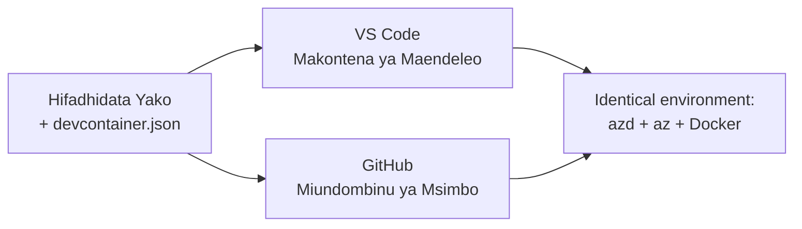

# Maboksi ya Maendeleo & GitHub Codespaces kwa azd

**Uelekezaji wa Sura:**
- **📚 Nyumbani kwa Kozi**: [AZD Kwa Waanza](../../README.md)
- **📖 Sura ya Sasa**: Sura ya 1 - Msingi & Anza Haraka
- **⬅️ Iliyopita**: [Leta Programu Yako](bring-your-own-app.md)
- **🚀 Sura Inayofuata**: [Sura ya 2: Maendeleo ya AI-Kwanza](../chapter-02-ai-development/README.md)

> Imethibitishwa dhidi ya `azd 1.27.1` katika Julai 2026.

## Utangulizi

Kusakinisha azd, runtime ya lugha sahihi, Docker, na Azure CLI kwenye kila mashine ni kazi kubwa—na ndio sababu kubwa ya kozi inayosema "inafanya kazi kwenye mashine yangu" kushindwa kwa mtu mwingine. **Kiboksi cha maendeleo** kinatatua hili kwa kuelezea zana zako zote kwenye faili moja. Mtu yeyote anayefungua mradi katika VS Code au GitHub Codespaces anapata mazingira sawa kabisa, huku azd tayari imesakinishwa. Somo hili linakuonyesha jinsi ya kuongeza moja.

## Malengo ya Kujifunza

Mwishoni mwa somo hili, utakuwa umeweza:
- Elewa nini ni kiboksi cha maendeleo na kwa nini kinasaidia na azd
- Ongeza `.devcontainer/devcontainer.json` ya kiwango cha chini kwa mradi
- Jumuisha azd, Azure CLI, na Docker kupitia *vipengele* vya Kiboksi cha Maendeleo
- Fungua mradi katika GitHub Codespaces au VS Code

## Matokeo ya Kujifunza

Baada ya kumaliza somo hili, utaweza:
- Kuandika `devcontainer.json` kwa mradi wa azd
- Ongeza azd na zana za Azure bila usakinishaji wa mikono
- Endesha `azd up` kutoka ndani ya kiboksi au Codespace

---

## Kiboksi cha Maendeleo ni Nini?

Kiboksi cha maendeleo ni mazingira ya maendeleo yanayotegemea Docker yanayofafanuliwa na faili ya `.devcontainer/devcontainer.json` kwenye hifadhidata yako. Unapofungua mradi:

- **VS Code** (ikiwa na ugani wa Dev Containers) hujenga kiboksi na kuunganishwa nacho.
- **GitHub Codespaces** hujenga kiboksi hicho hicho kwenye huduma ya mtandao na kukupa mhariri wa kivinjari.

Kwa njia yoyote, kila mshiriki anapata zana sawa—hakuna "je, umeweka azd?" matatizo.



---

## Hatua ya 1: Tengeneza Faili ya devcontainer

Tengeneza `.devcontainer/devcontainer.json` kwenye mzizi wa mradi wako:

```json
{
  "name": "azd-project",
  "image": "mcr.microsoft.com/devcontainers/base:bookworm",
  "features": {
    "ghcr.io/devcontainers/features/azure-cli:1": {},
    "ghcr.io/azure/azure-dev/azd:latest": {},
    "ghcr.io/devcontainers/features/docker-in-docker:2": {},
    "ghcr.io/devcontainers/features/node:1": {}
  },
  "customizations": {
    "vscode": {
      "extensions": [
        "ms-azuretools.azure-dev",
        "ms-azuretools.vscode-bicep"
      ]
    }
  },
  "forwardPorts": [3000],
  "postCreateCommand": "azd version"
}
```

Kila sehemu hufanya kazi gani:

| Funguo | Kusudi |
|-----|---------|
| `image` | Mfumo wa uendeshaji wa msingi wa kiboksi |
| `features` | Wasakinishaji waliotengenezwa awali—hapa: Azure CLI, **azd**, Docker, na Node.js |
| `customizations.vscode.extensions` | Hujiweka moja kwa moja ugani wa azd na Bicep wa VS Code |
| `forwardPorts` | Hufungua bandari ya programu yako kwenye kivinjari chako |
| `postCreateCommand` | Huendeshwa mara moja baada ya kiboksi kujengwa (hapa, ukaguzi wa usahihi) |

> Kipengele `ghcr.io/azure/azure-dev/azd:latest` ni njia rasmi ya kupata azd ndani ya kiboksi. Weka toleo mahususi (mfano `azd:1.27.1`) ikiwa unahitaji uthabiti.

---

## Hatua ya 2: Linganisha Kipengele na Lugha ya Programu Yako

Badilisha kipengele cha `node` kwa kile chochote kinachotumiwa na programu yako:

```jsonc
// Python project
"ghcr.io/devcontainers/features/python:1": {},

// .NET project
"ghcr.io/devcontainers/features/dotnet:2": {},

// Java project
"ghcr.io/devcontainers/features/java:1": {},

// Go project
"ghcr.io/devcontainers/features/go:1": {}
```

Endelea kutumia `docker-in-docker` ikiwa mwenyeji wako ni `containerapp`, `aks`, au chochote kinachojenga picha ya kiboksi—azd inahitaji Docker kujenga na kusukuma picha.

---

## Hatua ya 3: Fungua

**Katika VS Code:**
1. Sakinisha ugani wa **Dev Containers**.
2. Fungua folda ya mradi.
3. Bonyeza **Reopen in Container** unapoombwa (au endesha *Dev Containers: Reopen in Container*).

**Katika GitHub Codespaces:**
1. Sogeza hifadhidata hadi GitHub.
2. Bonyeza **Code → Codespaces → Create codespace on main**.
3. Subiri kiboksi kujengwa—azd iko tayari kwenye terminali.

---

## Hatua ya 4: Tuma Kutoka Ndani ya Kiboksi

Kiboksi kina azd tayari imewekwa, hivyo mtiririko wa kawaida haufanyi kazi tu:

```bash
azd auth login --use-device-code   # msimbo wa kifaa ni rahisi ndani ya Codespaces
azd up
```

> **Kwanini `--use-device-code`?** Katika kiboksi cha mbali au Codespace hakuna kivinjari cha eneo la karibu cha kuelekeza, hivyo kuingia kwa nambari ya kifaa ni njia ya kuaminika. Utaweka nambari kwenye kichupo cha kivinjari ili kumaliza kuingia.

---

## Makosa ya Kawaida

| Hitilafu | Suluhisho |
|---------|-----|
| `azd up` haiwezi kujenga picha | Ongeza kipengele cha `docker-in-docker` |
| Kuingia kwa kivinjari kunaziba katika Codespaces | Tumia `azd auth login --use-device-code` |
| Zana zinatofautiana kati ya wenzako | Weka matoleo ya kipengele (mfano `azd:1.27.1`) |
| Programu haipatikani kwenye kivinjari | Ongeza bandari kwenye `forwardPorts` |

---

## Muhtasari

- Kiboksi cha maendeleo hufanya zana yako ya azd iweze kurudiwa kwa kila mtu.
- Ongeza azd, Azure CLI, na Docker kupitia *vipengele* vya Kiboksi cha Maendeleo.
- Linganisha kipengele cha lugha na programu yako na endelea kutumia `docker-in-docker` kwa wenyeji wa kiboksi.
- Tumia kuingia kwa nambari ya kifaa unapotumia Codespaces.

---

## 🔗 Uelekezaji

| Mwelekeo | Rasilimali |
|-----------|----------|
| **Iliyopita** | [Leta Programu Yako](bring-your-own-app.md) |
| **Nyumbani kwa Sura** | [Sura ya 1: Msingi & Anza Haraka](README.md) |
| **Sura Inayofuata** | [Sura ya 2: Maendeleo ya AI-Kwanza](../chapter-02-ai-development/README.md) |

## 📖 Rasilimali Zinazohusiana

- [Usakinishaji & Usanidi](installation.md)
- [Karatasi ya Amri](../../resources/cheat-sheet.md)
- [Maelezo Rasmi ya Maboksi ya Maendeleo](https://containers.dev/)
- [Kipengele cha azd Dev Container](https://github.com/Azure/azure-dev/tree/main/ext/devcontainer)

---

<!-- CO-OP TRANSLATOR DISCLAIMER START -->
**Kionyozo**:
Hati hii imetafsiriwa kwa kutumia huduma ya tafsiri ya AI [Co-op Translator](https://github.com/Azure/co-op-translator). Ingawa tunajitahidi kupata usahihi, tafadhali fahamu kwamba tafsiri za kiotomatiki zinaweza kuwa na makosa au upungufu wa usahihi. Hati ya asili katika lugha yake halisi inapaswa kuchukuliwa kama chanzo cha mamlaka. Kwa taarifa muhimu, tafsiri ya kitaalamu inayofanywa na binadamu inapendekezwa. Hatutojibu kwa kuelewa vibaya au tafsiri potofu zinazotokea kutokana na matumizi ya tafsiri hii.
<!-- CO-OP TRANSLATOR DISCLAIMER END -->