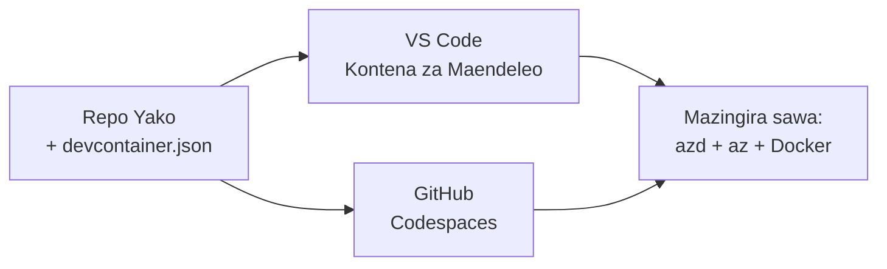

# Dev Containers & GitHub Codespaces for azd

**Uelekezaji wa Sura:**
- **📚 Nyumbani kwa Kozi**: [AZD Kwa Waanzilishi](../../README.md)
- **📖 Sura ya Sasa**: Sura 1 - Msingi & Anza Haraka
- **⬅️ Iliyopita**: [Leta Programu Yako](bring-your-own-app.md)
- **🚀 Sura Ifuatayo**: [Chapter 2: AI-First Development](../chapter-02-ai-development/README.md)

> Imethibitishwa dhidi ya `azd 1.25.6` mnamo Juni 2026.

## Utangulizi

Kusakinisha azd, runtime sahihi ya lugha, Docker, na Azure CLI kwenye kila mashine ni kazi ya kuchosha—na ndiyo sababu namba moja kwa tutorial inayofanya "inayofanya kazi kwenye mashine yangu" kushindwa kwa mtu mwingine. Dev container inatatua hili kwa kuelezea zana zako zote kwenye faili moja. Kila mtu anayeifungua mradi kwenye VS Code au GitHub Codespaces anapata mazingira yale yale, na azd tayari imewekwa. Somo hili linaonyesha jinsi ya kuongeza moja.

## Malengo ya Kujifunza

Kwa mwisho wa somo hili, utakuwa umeweza:
- Kuelewa ni dev container ni nini na kwa nini inasaidia na azd
- Kuongeza `.devcontainer/devcontainer.json` ya chini kwa mradi
- Kujumuisha azd, Azure CLI, na Docker kupitia *features* za Dev Container
- Kufungua mradi kwenye GitHub Codespaces au VS Code

## Matokeo ya Kujifunza

Baada ya kumaliza somo hili, utaweza:
- Kuandika `devcontainer.json` kwa mradi wa azd
- Kuongeza azd na zana za Azure bila usakinishaji wa mikono
- Kuendesha `azd up` kutoka ndani ya container au Codespace

---

## Je, Dev Container ni Nini?

Dev container ni mazingira ya maendeleo yanayotegemea Docker yaliyoelezewa na faili `.devcontainer/devcontainer.json` katika repo yako. Unapoifungua mradi:

- **VS Code** (na ugani wa Dev Containers) hujenga container na kujiunga nayo.
- **GitHub Codespaces** hujenga container hiyo hiyo kwenye wingu na kukupa mhariri kwa kivinjari.

Kwa njia yoyote, kila mchangiaji anapata zana sawia—hakuna troubleshooting ya "je, umesakinisha azd?".



---

## Hatua 1: Tengeneza faili ya devcontainer

Tengeneza `.devcontainer/devcontainer.json` kwenye mzizi wa mradi wako:

```json
{
  "name": "azd-project",
  "image": "mcr.microsoft.com/devcontainers/base:bookworm",
  "features": {
    "ghcr.io/devcontainers/features/azure-cli:1": {},
    "ghcr.io/azure/azure-dev/azd:latest": {},
    "ghcr.io/devcontainers/features/docker-in-docker:2": {},
    "ghcr.io/devcontainers/features/node:1": {}
  },
  "customizations": {
    "vscode": {
      "extensions": [
        "ms-azuretools.azure-dev",
        "ms-azuretools.vscode-bicep"
      ]
    }
  },
  "forwardPorts": [3000],
  "postCreateCommand": "azd version"
}
```

Kila sehemu inafanya nini:

| Kipengele | Madhumuni |
|-----|---------|
| `image` | OS ya msingi kwa kontena |
| `features` | Wasakinishaji waliotengenezwa awali—hapa: Azure CLI, **azd**, Docker, na Node.js |
| `customizations.vscode.extensions` | Inasakinisha moja kwa moja nyongeza za azd na Bicep za VS Code |
| `forwardPorts` | Inaonyesha bandari ya programu yako kwa kivinjari chako |
| `postCreateCommand` | Inaendeshwa mara moja baada ya kontena kujengwa (hapa, ukaguzi wa busara) |

> The `ghcr.io/azure/azure-dev/azd:latest` feature is the official way to get azd in a container. Pin a specific version (for example `azd:1.25.6`) if you need reproducibility.

---

## Hatua 2: Linganisha Feature na Lugha ya Programu Yako

Badilisha kipengele cha `node` kwa kile programu yako inachotumia:

```jsonc
// Python project
"ghcr.io/devcontainers/features/python:1": {},

// .NET project
"ghcr.io/devcontainers/features/dotnet:2": {},

// Java project
"ghcr.io/devcontainers/features/java:1": {},

// Go project
"ghcr.io/devcontainers/features/go:1": {}
```

Weke `docker-in-docker` endelea ikiwa `host` yako ni `containerapp`, `aks`, au chochote kinachojenga picha ya container—azd inahitaji Docker kujenga na kusukuma picha.

---

## Hatua 3: Ifungue

**Katika VS Code:**
1. Sakinisha ugani wa **Dev Containers**.
2. Fungua folda ya mradi.
3. Bonyeza **Reopen in Container** ukiulizwa (au endesha *Dev Containers: Reopen in Container*).

**Katika GitHub Codespaces:**
1. Toda repo kwenye GitHub.
2. Bonyeza **Code → Codespaces → Create codespace on main**.
3. Subiri container iunde—azd iko tayari kwenye terminal.

---

## Hatua 4: Tekeleza Kutoka Ndani ya Kontena

Kontena ina azd imewekwa tayari, hivyo mtiririko wa kawaida unafanya kazi:

```bash
azd auth login --use-device-code   # msimbo wa kifaa ni rahisi kutumia ndani ya Codespaces
azd up
```

> **Why `--use-device-code`?** In a remote container or Codespace there's no local browser to redirect to, so device-code login is the reliable path. You'll paste a code into a browser tab to complete sign-in.

---

## Makosa Yanayotokea Mara kwa Mara

| Tatizo | Suluhisho |
|---------|-----|
| `azd up` can't build an image | Add the `docker-in-docker` feature |
| Browser login hangs in Codespaces | Use `azd auth login --use-device-code` |
| Tools differ between teammates | Pin feature versions (e.g. `azd:1.25.6`) |
| App not reachable in browser | Add the port to `forwardPorts` |

---

## Muhtasari

- Dev container inafanya zana zako za azd zirudiwe kwa kila mtu.
- Ongeza azd, Azure CLI, na Docker kupitia *features* za Dev Container.
- Linganisha kipengele cha lugha na programu yako na ukae na `docker-in-docker` kwa wenye mwenyeji wa container.
- Tumia device-code login unapotumia Codespaces.

---

## 🔗 Uabiri

| Mwelekeo | Rasilimali |
|-----------|----------|
| **Previous** | [Leta Programu Yako](bring-your-own-app.md) |
| **Chapter Home** | [Chapter 1: Foundation & Quick Start](README.md) |
| **Next Chapter** | [Chapter 2: AI-First Development](../chapter-02-ai-development/README.md) |

## 📖 Rasilimali Zinazohusiana

- [Installation & Setup](installation.md)
- [Command Cheat Sheet](../../resources/cheat-sheet.md)
- [Official Dev Containers specification](https://containers.dev/)
- [azd Dev Container feature](https://github.com/Azure/azure-dev/tree/main/ext/devcontainer)

---

<!-- CO-OP TRANSLATOR DISCLAIMER START -->
**Kionyozo**:
Hati hii imetafsiriwa kwa kutumia huduma ya tafsiri ya AI [Co-op Translator](https://github.com/Azure/co-op-translator). Ingawa tunajitahidi kupata usahihi, tafadhali fahamu kwamba tafsiri za kiotomatiki zinaweza kuwa na makosa au upungufu wa usahihi. Hati ya asili katika lugha yake halisi inapaswa kuchukuliwa kama chanzo cha mamlaka. Kwa taarifa muhimu, tafsiri ya kitaalamu inayofanywa na binadamu inapendekezwa. Hatutojibu kwa kuelewa vibaya au tafsiri potofu zinazotokea kutokana na matumizi ya tafsiri hii.
<!-- CO-OP TRANSLATOR DISCLAIMER END -->