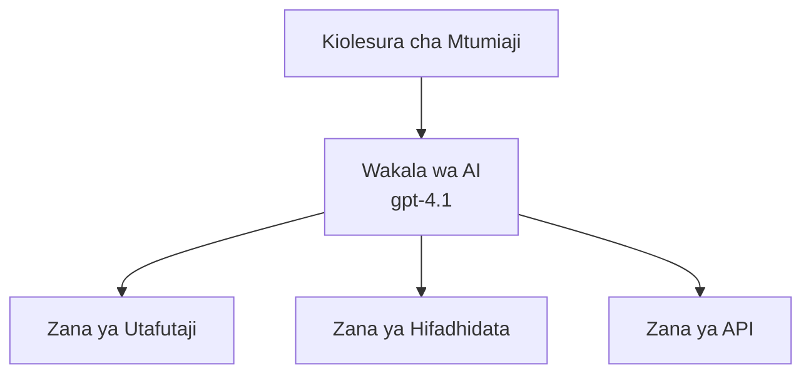
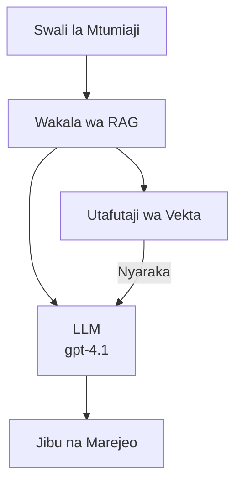
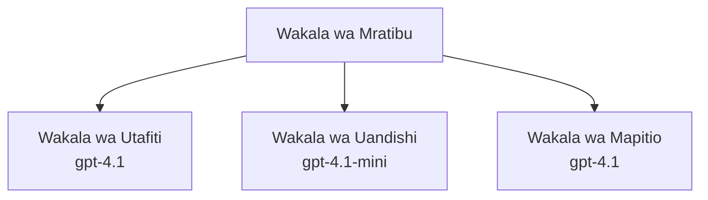

# Maajenti ya AI na Azure Developer CLI

**Chapter Navigation:**
- **📚 Course Home**: [AZD kwa Waanzilishi](../../README.md)
- **📖 Current Chapter**: Sura 2 - Maendeleo yenye AI kuwa Kwanza
- **⬅️ Previous**: [Uunganishaji wa Microsoft Foundry](microsoft-foundry-integration.md)
- **➡️ Next**: [Utekelezaji wa Mfano wa AI](ai-model-deployment.md)
- **🚀 Advanced**: [Suluhisho za Maajenti Wengi](../../examples/retail-scenario.md)

---

## Utangulizi

Maajenti ya AI ni programu zinazojitegemea zinazoweza kutambua mazingira yao, kufanya maamuzi, na kuchukua hatua ili kufikia malengo maalum. Tofauti na chatbot rahisi zinazojibu hoja, maajenti yanaweza:

- **Tumia zana** - Kuitisha API, kutafuta katika hifadhidata, kutekeleza nambari
- **Panga na kufikiri** - Kuvunja kazi ngumu kuwa hatua ndogo
- **Jifunza kutoka muktadha** - Kuhifadhi kumbukumbu na kubadilisha tabia
- **Shirikiana** - Kufanya kazi na maajenti wengine (mifumo ya maajenti mengi)

Mwongozo huu unaonyesha jinsi ya kusambaza maajenti ya AI kwenda Azure kwa kutumia Azure Developer CLI (azd).

> **Kumbuka uthibitisho (2026-03-25):** Mwongozo huu ulikaguliwa dhidi ya `azd` `1.23.12` na `azure.ai.agents` `0.1.18-preview`. Uzoefu wa `azd ai` bado unaendeshwa kwa awali, kwa hiyo angalia msaada wa ugani ikiwa bendera uliyoziweka zinatofautiana.

## Malengo ya Kujifunza

Kwa kumaliza mwongozo huu, utakuwa umeweza:
- Kuelewa nini maajenti ya AI wanavyokuwa na jinsi wanavyotofautiana na chatbots
- Kusambaza kiolezo cha maajenti zilizotengenezwa tayari kwa kutumia AZD
- Kusanidi Maajenti ya Foundry kwa maajenti maalum
- Kutekeleza mifumo ya msingi ya maajenti (utumiaji wa zana, RAG, maajenti wengi)
- Kufuatilia na kutatua matatizo ya maajenti yaliyosambazwa

## Matokeo ya Kujifunza

Baada ya kumaliza, utakuwa na uwezo wa:
- Kusambaza programu za maajenti ya AI kwenye Azure kwa amri moja
- Kusanidi zana na uwezo wa maajenti
- Kutekeleza retrieval-augmented generation (RAG) na maajenti
- Kubuni miundo ya maajenti mengi kwa michakato ngumu
- Kutatua matatizo ya kawaida ya usambazaji wa maajenti

---

## 🤖 Ni Nini Kinachofanya Maajenti Kutofautiana na Chatbot?

| Sifa | Chatbot | Maajenti ya AI |
|---------|---------|----------|
| **Tabia** | Hujibu maelekezo | Huchukua hatua za kujitegemea |
| **Zana** | Hakuna | Inaweza kuitisha API, kutafuta, kutekeleza nambari |
| **Kumbukumbu** | Inategemea kikao pekee | Kumbukumbu ya kudumu kati ya vikao |
| **Upangaji** | Jibu moja | Ufikiriaji wa hatua nyingi |
| **Ushirikiano** | Chombo kimoja | Inaweza kufanya kazi na maajenti wengine |

### Mfano Rahisi

- **Chatbot** = Mtu msaidizi anayejibu maswali kwenye dawati la taarifa
- **AI Agent** = Msaidizi wa kibinafsi anayekwenda kufanya simu, kuweka miadi, na kukamilisha kazi kwa niaba yako

---

## 🚀 Anza Haraka: Sambaza Wakala Wako wa Kwanza

### Chaguo 1: Kiolezo cha Foundry Agents (Kinachopendekezwa)

```bash
# Anzisha kiolezo cha mawakala wa AI
azd init --template get-started-with-ai-agents

# Sambaza kwenye Azure
azd up
```

**Kinachosambazwa:**
- ✅ Foundry Agents
- ✅ Microsoft Foundry Models (gpt-4.1)
- ✅ Azure AI Search (kwa RAG)
- ✅ Azure Container Apps (kiolesura cha wavuti)
- ✅ Application Insights (ufuatiliaji)

**Muda:** ~15-20 dakika
**Gharama:** ~$100-150/mwezi (maendeleo)

### Chaguo 2: Wakala wa OpenAI kwa kutumia Prompty

```bash
# Anzisha kiolezo cha wakala kinachotegemea Prompty
azd init --template agent-openai-python-prompty

# Weka kwenye Azure
azd up
```

**Kinachosambazwa:**
- ✅ Azure Functions (utekelezaji wa wakala bila seva)
- ✅ Microsoft Foundry Models
- ✅ Faili za usanidi za Prompty
- ✅ Utekelezaji wa mfano wa wakala

**Muda:** ~10-15 dakika
**Gharama:** ~$50-100/mwezi (maendeleo)

### Chaguo 3: Wakala wa Mazungumzo wa RAG

```bash
# Anzisha kiolezo cha mazungumzo ya RAG
azd init --template azure-search-openai-demo

# Weka kwenye Azure
azd up
```

**Kinachosambazwa:**
- ✅ Microsoft Foundry Models
- ✅ Azure AI Search na data ya mfano
- ✅ Mchakato wa usindikaji wa nyaraka
- ✅ Kiolesura cha mazungumzo chenye marejeo

**Muda:** ~15-25 dakika
**Gharama:** ~$80-150/mwezi (maendeleo)

### Chaguo 4: AZD AI Agent Init (Mwonekano wa awali unaotegemea Manifest au Kiolezo)

Ikiwa una faili ya manifesti ya wakala, unaweza kutumia amri `azd ai` kutengeneza mradi wa Foundry Agent Service moja kwa moja. Toleo za mwonekano wa awali hivi karibuni pia ziliongeza msaada wa uanzishaji unaotegemea kiolezo, kwa hivyo mtiririko wa haraka unaweza kutofautiana kidogo kulingana na toleo la ugani uliloweka.

```bash
# Sakinisha nyongeza ya mawakala wa AI
azd extension install azure.ai.agents

# Hiari: hakiki toleo la majaribio lililosakinishwa
azd extension show azure.ai.agents

# Anzisha kutoka kwenye manifesti ya wakala
azd ai agent init -m agent-manifest.yaml

# Sambaza kwenye Azure
azd up
```

**Wakati wa kutumia `azd ai agent init` vs `azd init --template`:**

| Njia | Bora Kwa | Inavyofanya Kazi |
|----------|----------|------|
| `azd init --template` | Kuanzia na programu ya mfano inayofanya kazi | Inakokota repo kamili ya kiolezo yenye msimbo + miundombinu |
| `azd ai agent init -m` | Kujenga kutoka kwenye manifesti yako ya wakala | Inaweka muundo wa mradi kutoka kwa ufafanuzi wako wa wakala |

> **Kidokezo:** Tumia `azd init --template` wakati unajifunza (Chaguo 1-3 hapo juu). Tumia `azd ai agent init` wakati unajenga maajenti ya uzalishaji kwa manifesti zako mwenyewe. Angalia [AZD AI CLI Commands](../chapter-08-production/production-ai-practices.md#azd-ai-cli-commands-and-extensions) kwa rejea kamili.

---

## 🏗️ Mifumo ya Miundo ya Maajenti

### Mfano 1: Wakala Mmoja Anayetumia Zana

Mfano rahisi kabisa wa wakala - wakala mmoja anayejua kutumia zana nyingi.


**Bora kwa:**
- Bots za msaada kwa wateja
- Wasaidizi wa utafiti
- Maajenti wa uchambuzi wa data

**AZD Template:** `azure-search-openai-demo`

### Mfano 2: Wakala wa RAG (Retrieval-Augmented Generation)

Wakala anayorejesha nyaraka zinazohusiana kabla ya kuunda majibu.


**Bora kwa:**
- Hifadhidata za maarifa za kampuni
- Mifumo ya maswali na majibu ya nyaraka
- Utafiti wa uzingatiaji wa kisheria na uzingatiaji wa mkataba

**AZD Template:** `azure-search-openai-demo`

### Mfano 3: Mfumo wa Maajenti Wengi

Maajenti maalum kadhaa wakifanya kazi pamoja kwenye kazi ngumu.


**Bora kwa:**
- Uundaji wa maudhui ngumu
- Michakato ya hatua nyingi
- Kazi zinazohitaji utaalamu tofauti

**Jifunze Zaidi:** [Mifumo ya Uratibu wa Maajenti Wengi](../chapter-06-pre-deployment/coordination-patterns.md)

---

## ⚙️ Kusanidi Zana za Maajenti

Maajenti yanakuwa yenye nguvu wanapoweza kutumia zana. Hapa kuna jinsi ya kusanidi zana za kawaida:

### Usanidi wa Zana katika Foundry Agents

```python
# agent_config.py
from azure.ai.projects import AIProjectClient
from azure.ai.projects.models import FunctionTool, CodeInterpreterTool

# Fafanua zana maalum
search_tool = FunctionTool(
    name="search_knowledge_base",
    description="Search the company knowledge base for relevant documents",
    parameters={
        "type": "object",
        "properties": {
            "query": {
                "type": "string",
                "description": "The search query"
            }
        },
        "required": ["query"]
    }
)

# Unda wakala na zana
agent = project_client.agents.create_agent(
    model="gpt-4.1",
    name="Support Agent",
    instructions="You are a helpful support agent. Use the search tool to find relevant information.",
    tools=[search_tool, CodeInterpreterTool()]
)
```

### Usanidi wa Mazingira

```bash
# Sanidi vigezo vya mazingira maalum kwa wakala
azd env set AZURE_OPENAI_MODEL "gpt-4.1"
azd env set AGENT_INSTRUCTIONS "You are a helpful assistant..."
azd env set ENABLE_CODE_INTERPRETER "true"
azd env set ENABLE_FILE_SEARCH "true"

# Sambaza kwa usanidi uliosasishwa
azd deploy
```

---

## 📊 Kufuatilia Maajenti

### Uunganishaji wa Application Insights

Violezo vyote vya maajenti vya AZD vinajumuisha Application Insights kwa kufuatilia:

```bash
# Fungua dashibodi ya ufuatiliaji
azd monitor --overview

# Tazama logi za muda halisi
azd monitor --logs

# Tazama vipimo vya muda halisi
azd monitor --live
```

### Vipimo Muhimu vya Kufuatilia

| Kipimo | Maelezo | Lengo |
|--------|-------------|--------|
| Ucheleweshaji wa Majibu | Muda wa kutoa jibu | < 5 sekunde |
| Matumizi ya Tokeni | Tokeni kwa ombi | Fuatilia kwa gharama |
| Kiwango cha Mafanikio ya Kuitwa kwa Zana | % ya utekelezaji wa zana uliofanikiwa | > 95% |
| Kiwango cha Makosa | Maombi ya wakala yaliyoshindwa | < 1% |
| Kuridhika kwa Mtumiaji | Alama za maoni | > 4.0/5.0 |

### Uandishi wa Logi Uliobinafsishwa kwa Maajenti

```python
import os
from azure.monitor.opentelemetry import configure_azure_monitor
from opentelemetry import trace

# Sanidi Azure Monitor na OpenTelemetry
configure_azure_monitor(
    connection_string=os.environ["APPLICATIONINSIGHTS_CONNECTION_STRING"]
)

tracer = trace.get_tracer(__name__)

def log_agent_interaction(user_query, agent_response, tools_used, latency_ms):
    with tracer.start_as_current_span("agent_interaction") as span:
        span.set_attributes({
            "user_query": user_query,
            "response_length": len(agent_response),
            "tools_used": tools_used,
            "latency_ms": latency_ms
        })
```

> **Kumbuka:** Sakinisha vifurushi vinavyohitajika: `pip install azure-monitor-opentelemetry opentelemetry`

---

## 💰 Mambo ya Gharama

### Makadirio ya Gharama za Mwezi kwa Kila Mfano

| Mfano | Mazingira ya Maendeleo | Uzalishaji |
|---------|-----------------|------------|
| Wakala Mmoja | $50-100 | $200-500 |
| Wakala wa RAG | $80-150 | $300-800 |
| Maajenti Wengi (maajenti 2-3) | $150-300 | $500-1,500 |
| Maajenti Wengi ya Kampuni | $300-500 | $1,500-5,000+ |

### Vidokezo vya Kupunguza Gharama

1. **Tumia gpt-4.1-mini kwa kazi rahisi**
   ```bash
   azd env set AZURE_OPENAI_MODEL "gpt-4.1-mini"
   ```

2. **Tekeleza uhifadhi (caching) kwa maswali yanayojirudia**
   ```python
   from functools import lru_cache
   
   @lru_cache(maxsize=1000)
   def get_cached_response(query_hash):
       return agent.run(query_hash)
   ```

3. **Weka mipaka ya tokeni kwa kila utekelezaji**
   ```python
   # Weka max_completion_tokens wakati wa kuendesha wakala, sio wakati wa kuunda
   run = project_client.agents.create_run(
       thread_id=thread.id,
       agent_id=agent.id,
       max_completion_tokens=1000  # Punguza urefu wa jibu
   )
   ```

4. **Punguza hadi sifuri wakati haitumiki**
   ```bash
   # Container Apps hupungua hadi sifuri kiotomatiki
   azd env set MIN_REPLICAS "0"
   ```

---

## 🔧 Kutatua Matatizo ya Maajenti

### Masuala ya Kawaida na Ufumbuzi

<details>
<summary><strong>❌ Wakala haijibu miito ya zana</strong></summary>

```bash
# Angalia ikiwa zana zimesajiliwa ipasavyo
azd show

# Thibitisha uanzishaji wa OpenAI
az cognitiveservices account deployment list \
  --name $AZURE_OPENAI_NAME \
  --resource-group $RG_NAME

# Angalia kumbukumbu za wakala
azd monitor --logs
```

**Sababu za kawaida:**
- Kutokufanana kwa saini ya kazi ya zana
- Kukosekana kwa ruhusa zinazohitajika
- Endpoint ya API haipatikani
</details>

<details>
<summary><strong>❌ Chelewi kubwa katika majibu ya wakala</strong></summary>

```bash
# Angalia Application Insights kwa vikwazo
azd monitor --live

# Fikiria kutumia modeli ya haraka zaidi
azd env set AZURE_OPENAI_MODEL "gpt-4.1-mini"
azd deploy
```

**Vidokezo vya uboreshaji:**
- Tumia majibu ya mtiririko (streaming)
- Tekeleza uhifadhi wa majibu
- Punguza ukubwa wa dirisha la muktadha
</details>

<details>
<summary><strong>❌ Wakala anarejea taarifa zisizo sahihi au za kubuni</strong></summary>

```python
# Boresha kwa kutumia maagizo bora ya mfumo
instructions = """
You are a helpful assistant. IMPORTANT:
- Only answer based on provided context
- If you don't know, say "I don't know"
- Always cite your sources
- Never make up information
"""

# Ongeza utafutaji kwa ajili ya kuweka msingi
agent = project_client.agents.create_agent(
    model="gpt-4.1",
    instructions=instructions,
    tools=[FileSearchTool()]  # Unganisha majibu na nyaraka
)
```
</details>

<details>
<summary><strong>❌ Makosa ya kupitiliza kikomo cha tokeni</strong></summary>

```python
# Tekeleza usimamizi wa madirisha ya muktadha
def truncate_context(messages, max_tokens=8000, model="gpt-4.1"):
    """Keep only recent messages within token limit."""
    import tiktoken
    encoding = tiktoken.encoding_for_model(model)
    total_tokens = 0
    truncated = []
    
    for msg in reversed(messages):
        msg_tokens = len(encoding.encode(msg.content))
        if total_tokens + msg_tokens > max_tokens:
            break
        truncated.insert(0, msg)
        total_tokens += msg_tokens
    
    return truncated
```
</details>

---

## 🎓 Mazoezi ya Vitendo

### Zoefisho 1: Sambaza Wakala Msingi (20 minutes)

**Lengo:** Sambaza wakala wako wa AI wa kwanza kwa kutumia AZD

```bash
# Hatua 1: Anzisha kiolezo
azd init --template get-started-with-ai-agents

# Hatua 2: Ingia kwenye Azure
azd auth login
# Ikiwa unafanya kazi kati ya wapangaji, ongeza --tenant-id <tenant-id>

# Hatua 3: Sambaza
azd up

# Hatua 4: Jaribu wakala
# Matokeo yanayotarajiwa baada ya kusambaza:
#   Usambazaji umekamilika!
#   Anwani ya mwisho: https://<app-name>.<region>.azurecontainerapps.io
# Fungua URL iliyotolewa kwenye matokeo na jaribu kuuliza swali

# Hatua 5: Tazama ufuatiliaji
azd monitor --overview

# Hatua 6: Safisha
azd down --force --purge
```

**Vigezo vya Mafanikio:**
- [ ] Wakala anajibu maswali
- [ ] Inaweza kufikia dashibodi ya ufuatiliaji kupitia `azd monitor`
- [ ] Rasilimali zimeondolewa kwa mafanikio

### Zoefisho 2: Ongeza Zana Binafsi (30 minutes)

**Lengo:** Panua wakala kwa zana iliyobinafsishwa

1. Sambaza kiolezo cha wakala:
   ```bash
   azd init --template get-started-with-ai-agents
   azd up
   ```
2. Unda kazi mpya ya zana katika msimbo wa wakala wako:
   ```python
   def get_weather(location: str) -> str:
       """Get current weather for a location."""
       # Mwito wa API kwa huduma ya hali ya hewa.
       return f"Weather in {location}: Sunny, 72°F"
   ```
3. Sajili zana na wakala:
   ```python
   from azure.ai.projects.models import FunctionTool

   weather_tool = FunctionTool(
       name="get_weather",
       description="Get current weather for a location",
       parameters={
           "type": "object",
           "properties": {
               "location": {"type": "string", "description": "City name"}
           },
           "required": ["location"]
       }
   )

   agent = project_client.agents.create_agent(
       model="gpt-4.1",
       name="Weather Agent",
       tools=[weather_tool]
   )
   ```
4. Sambaza tena na jaribu:
   ```bash
   azd deploy
   # Uliza: "Hali ya hewa huko Seattle iko aje?"
   # Inatarajiwa: Wakala anaita get_weather("Seattle") na kurejesha taarifa za hali ya hewa
   ```

**Vigezo vya Mafanikio:**
- [ ] Wakala anatambua maswali yanayohusiana na hali ya hewa
- [ ] Zana inaitwa kwa usahihi
- [ ] Jibu linajumuisha taarifa za hali ya hewa

### Zoefisho 3: Jenga Wakala wa RAG (45 minutes)

**Lengo:** Unda wakala anayejibu maswali kutoka kwa nyaraka zako

```bash
# Hatua 1: Sambaza kiolezo cha RAG
azd init --template azure-search-openai-demo
azd up

# Hatua 2: Pakia nyaraka zako
# Weka faili za PDF/TXT katika saraka data/, kisha endesha:
python scripts/prepdocs.py

# Hatua 3: Jaribu kwa maswali maalum ya nyanja
# Fungua URL ya programu ya wavuti kutoka kwenye matokeo za azd up
# Uliza maswali kuhusu nyaraka ulizopakia
# Majibu yanapaswa kujumuisha marejeo ya chanzo kama [doc.pdf]
```

**Vigezo vya Mafanikio:**
- [ ] Wakala anajibu kutoka kwa nyaraka zilizoingizwa
- [ ] Majibu yanajumuisha marejeo
- [ ] Hakuna uundaji wa taarifa za uwongo kwa maswali yasiyo ndani ya wigo

---

## 📚 Hatua Zijazo

Sasa unapoelewa maajenti ya AI, chunguza mada hizi za juu:

| Mada | Maelezo | Kiungo |
|-------|-------------|------|
| **Mifumo ya Maajenti Wengi** | Jenga mifumo yenye maajenti kadhaa wanaoshirikiana | [Mfano wa Maajenti Wengi wa Rejareja](../../examples/retail-scenario.md) |
| **Mifumo ya Uratibu** | Jifunze uratibu na mifumo ya mawasiliano | [Mifumo ya Uratibu](../chapter-06-pre-deployment/coordination-patterns.md) |
| **Utekelezaji wa Uzalishaji** | Uwekaji wa maajenti kwa viwango vya kampuni | [Mbinu za AI kwa Uzalishaji](../chapter-08-production/production-ai-practices.md) |
| **Tathmini ya Wakala** | Jaribu na tathmini utendaji wa wakala | [Kutatua Matatizo ya AI](../chapter-07-troubleshooting/ai-troubleshooting.md) |
| **AI Workshop Lab** | Vitendo: Fanya suluhisho lako la AI liwe AZD-ready | [AI Workshop Lab](ai-workshop-lab.md) |

---

## 📖 Rasilimali Zaidi

### Nyaraka Rasmi
- [Azure AI Agent Service](https://learn.microsoft.com/azure/ai-services/agents/)
- [Azure AI Foundry Agent Service Quickstart](https://learn.microsoft.com/azure/ai-services/agents/quickstart)
- [Semantic Kernel Agent Framework](https://learn.microsoft.com/semantic-kernel/)

### Violezo vya AZD kwa Maajenti
- [Anza na Maajenti ya AI](https://github.com/Azure-Samples/get-started-with-ai-agents)
- [Agent OpenAI Python Prompty](https://github.com/Azure-Samples/agent-openai-python-prompty)
- [Azure Search OpenAI Demo](https://github.com/Azure-Samples/azure-search-openai-demo)

### Rasilimali za Jamii
- [Awesome AZD - Agent Templates](https://azure.github.io/awesome-azd/?tags=ai-agents)
- [Azure AI Discord](https://discord.gg/microsoft-azure)
- [Microsoft Foundry Discord](https://discord.gg/nTYy5BXMWG)

### Ujuzi wa Maajenti kwa Mhariri Wako
- [**Ujuzi wa Maajenti wa Microsoft Azure**](https://skills.sh/microsoft/github-copilot-for-azure) - Sakinisha ujuzi wa maajenti wa AI unaoweza kutumika tena kwa maendeleo ya Azure katika GitHub Copilot, Cursor, au wakala wowote unaoungwa mkono. Inajumuisha ujuzi kwa [Azure AI](https://skills.sh/microsoft/github-copilot-for-azure/azure-ai), [Microsoft Foundry](https://skills.sh/microsoft/github-copilot-for-azure/microsoft-foundry), [utekelezaji](https://skills.sh/microsoft/github-copilot-for-azure/azure-deploy), na [utambuzi](https://skills.sh/microsoft/github-copilot-for-azure/azure-diagnostics):
  ```bash
  npx skills add microsoft/github-copilot-for-azure
  ```

---

**Navigation**
- **Previous Lesson**: [Uunganishaji wa Microsoft Foundry](microsoft-foundry-integration.md)
- **Next Lesson**: [Utekelezaji wa Mfano wa AI](ai-model-deployment.md)

---

<!-- CO-OP TRANSLATOR DISCLAIMER START -->
**Disclaimer**:
Nyaraka hii imetafsiriwa kwa kutumia huduma ya tafsiri ya AI [Co-op Translator](https://github.com/Azure/co-op-translator). Ingawa tunajitahidi kufikia usahihi, tafadhali fahamu kwamba tafsiri za kiotomatiki zinaweza kuwa na makosa au kutokukamilika. Nyaraka ya awali katika lugha yake ya asili inapaswa kuzingatiwa kama chanzo cha mamlaka. Kwa taarifa muhimu, inapendekezwa kutumia tafsiri ya binadamu ya kitaalamu. Hatuwajibiki kwa kutokuelewana au tafsiri potofu zinazotokana na matumizi ya tafsiri hii.
<!-- CO-OP TRANSLATOR DISCLAIMER END -->