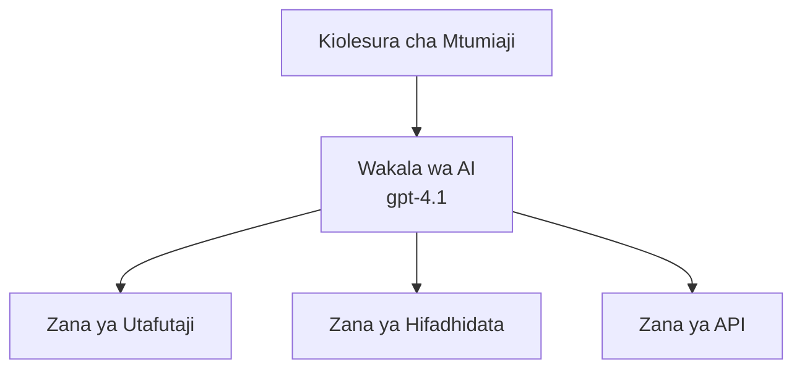
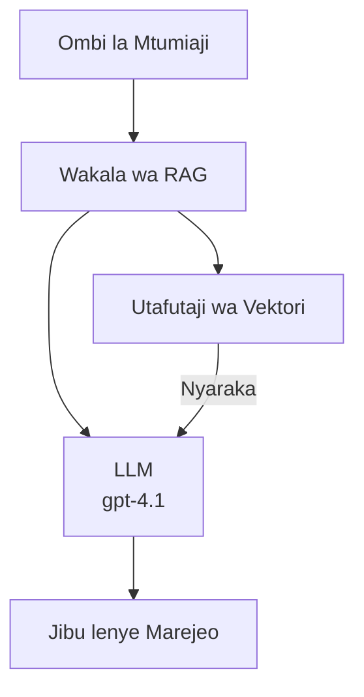

# Wakala wa AI kwa Azure Developer CLI

**Chapter Navigation:**
- **📚 Course Home**: [AZD Kwa Waanzia](../../README.md)
- **📖 Current Chapter**: Chapter 2 - AI-First Development
- **⬅️ Previous**: [Microsoft Foundry Integration](microsoft-foundry-integration.md)
- **➡️ Next**: [AI Model Deployment](ai-model-deployment.md)
- **🚀 Advanced**: [Multi-Agent Solutions](../../examples/retail-scenario.md)

---

## Utangulizi

Wakala wa AI ni programu huru ambazo zinaweza kutambua mazingira yao, kufanya maamuzi, na kuchukua hatua ili kufanikisha malengo maalum. Tofauti na chatbots rahisi ambazo zinajibu vichocheo, mawakala wanaweza:

- **Kutumia zana** - Kuita API, kutafuta kwenye hifadhidata, kutekeleza nambari
- **Kupanga na kufikiria** - Kuvunja kazi ngumu kuwa hatua
- **Kujifunza kutoka kwa muktadha** - Kudumisha kumbukumbu na kubadilisha tabia
- **Kushirikiana** - Kufanya kazi na mawakala wengine (mifumo ya wakala nyingi)

Mwongozo huu unaonyesha jinsi ya kusambaza mawakala wa AI kwenye Azure ukitumia Azure Developer CLI (azd).

## Malengo ya Kujifunza

Kwa kukamilisha mwongozo huu, utauweza:
- Kuelewa ni mawakala ya AI ni nini na wanatofautianaje na chatbots
- Kusambaza kiolezo cha wakala uliotengenezwa tayari ukitumia AZD
- Kusanidi Foundry Agents kwa mawakala yaliyobinafsishwa
- Tekeleza mifumo ya msingi ya wakala (matumizi ya zana, RAG, wakala wengi)
- Kufuatilia na kutatua shida za mawakala yaliyosambazwa

## Matokeo ya Kujifunza

Baada ya kukamilisha, utaweza:
- Kusambaza programu za wakala za AI kwenye Azure kwa amri moja
- Kusanidi zana na uwezo wa wakala
- Tekeleza retrieval-augmented generation (RAG) na mawakala
- Kubuni miundombinu ya wakala wengi kwa mtiririko wa kazi ngumu
- Kutatua matatizo ya kawaida ya usambazaji wa wakala

---

## 🤖 Nini Kinachomfanya Wakala Kutofautiana na Chatbot?

| Sifa | Chatbot | Wakala wa AI |
|---------|---------|----------|
| **Tabia** | Inajibu maombi | Inachukua hatua za kujitegemea |
| **Zana** | Hakuna | Inaweza kuita API, kutafuta, kutekeleza nambari |
| **Kumbukumbu** | Kwingine kwa vikao tu | Kumbukumbu ya kudumu kati ya vikao |
| **Mipango** | Jibu moja | Ufikirishaji wa hatua nyingi |
| **Ushirikiano** | Kipengee kimoja | Inaweza kufanya kazi na mawakala wengine |

### Mfano Rahisi

- **Chatbot** = Mtu mwenye msaada anayejibu maswali kwenye dawati la habari
- **Wakala wa AI** = Msaidizi wa kibinafsi ambaye anaweza kupiga simu, kupanga miadi, na kukamilisha kazi kwa niaba yako

---

## 🚀 Anza Haraka: Sambaza Wakala Wako wa Kwanza

### Chaguo 1: Kiolezo cha Foundry Agents (Kinachopendekezwa)

```bash
# Anzisha kiolezo cha mawakala wa AI
azd init --template get-started-with-ai-agents

# Weka kwenye Azure
azd up
```

**Kinachowekwa:**
- ✅ Foundry Agents
- ✅ Microsoft Foundry Models (gpt-4.1)
- ✅ Azure AI Search (kwa RAG)
- ✅ Azure Container Apps (kiolesura cha wavuti)
- ✅ Application Insights (ufuatiliaji)

**Muda:** ~15-20 dakika
**Gharama:** ~$100-150/mwezi (maendeleo)

### Chaguo 2: Wakala wa OpenAI na Prompty

```bash
# Anzisha kiolezo cha wakala kinachotegemea Prompty
azd init --template agent-openai-python-prompty

# Sambaza kwenye Azure
azd up
```

**Kinachowekwa:**
- ✅ Azure Functions (utekelezaji wa wakala bila seva)
- ✅ Microsoft Foundry Models
- ✅ Faili za usanidi za Prompty
- ✅ Utekelezaji wa mfano wa wakala

**Muda:** ~10-15 dakika
**Gharama:** ~$50-100/mwezi (maendeleo)

### Chaguo 3: Wakala wa Chat RAG

```bash
# Anzisha kiolezo cha mazungumzo cha RAG
azd init --template azure-search-openai-demo

# Sambaza kwenye Azure
azd up
```

**Kinachowekwa:**
- ✅ Microsoft Foundry Models
- ✅ Azure AI Search na data ya mfano
- ✅ Mtiririko wa usindikaji wa nyaraka
- ✅ Kiolesura cha mazungumzo chenye marejeo

**Muda:** ~15-25 dakika
**Gharama:** ~$80-150/mwezi (maendeleo)

### Chaguo 4: AZD AI Agent Init (Kulingana na Manifest)

Ikiwa una faili ya manifest ya wakala, unaweza kutumia amri ya `azd ai` kutengeneza mradi wa Foundry Agent Service moja kwa moja:

```bash
# Sakinisha nyongeza ya mawakala wa AI
azd extension install azure.ai.agents

# Anzisha kutoka kwenye manifesti ya wakala
azd ai agent init -m agent-manifest.yaml

# Sambaza kwenye Azure
azd up
```

**Wakati wa kutumia `azd ai agent init` dhidi ya `azd init --template`:**

| Njia | Inafaa Kwa | Jinsi Inavyofanya Kazi |
|----------|----------|------|
| `azd init --template` | Kuanzia na programu ya mfano inayofanya kazi | Inakopa repo kamili ya kiolezo yenye msimbo + miundombinu |
| `azd ai agent init -m` | Kujenga kutoka kwa manifest yako ya wakala | Inatengeneza muundo wa mradi kutoka kwa ufafanuzi wako wa wakala |

> **Tip:** Tumia `azd init --template` wakati wa kujifunza (Chaguo 1-3 hapo juu). Tumia `azd ai agent init` ukiunda mawakala kwa uzalishaji kwa manifests zako. Angalia [AZD AI CLI Commands](../chapter-08-production/production-ai-practices.md#azd-ai-cli-commands-and-extensions) kwa rejea kamili.

---

## 🏗️ Mifumo ya Miundo ya Wakala

### Mfano 1: Wakala Mmoja Anaezitumia Zana

Mfano rahisi wa wakala - wakala mmoja ambaye anaweza kutumia zana nyingi.


**Inafaa kwa:**
- Bot za msaada wa wateja
- Msaidizi wa utafiti
- Mawakala wa uchambuzi wa data

**AZD Template:** `azure-search-openai-demo`

### Mfano 2: Wakala wa RAG (Retrieval-Augmented Generation)

Wakala anayetoa nyaraka muhimu kabla ya kuzalisha majibu.


**Inafaa kwa:**
- Hifadhidata za maarifa za kampuni
- Mifumo ya Maswali na Majibu ya Nyaraka
- Utafiti wa utekelezaji na kisheria

**AZD Template:** `azure-search-openai-demo`

### Mfano 3: Mfumo wa Wakala Wengi

Mawakala maalum wengi wakifanya kazi pamoja kwa kazi ngumu.


**Inafaa kwa:**
- Uundaji wa maudhui ngumu
- Mtiririko wa kazi wa hatua nyingi
- Kazi zinazoitaji utaalamu tofauti

**Jifunze Zaidi:** [Mifumo ya Uratibu ya Wakala Wengi](../chapter-06-pre-deployment/coordination-patterns.md)

---

## ⚙️ Kusanidi Zana za Wakala

Mawakala yanakuwa yenye nguvu wanapoweza kutumia zana. Hapa ni jinsi ya kusanidi zana za kawaida:

### Usanidi wa Zana katika Foundry Agents

```python
# agent_config.py
from azure.ai.projects import AIProjectClient
from azure.ai.projects.models import FunctionTool, CodeInterpreterTool

# Fafanua zana maalum
search_tool = FunctionTool(
    name="search_knowledge_base",
    description="Search the company knowledge base for relevant documents",
    parameters={
        "type": "object",
        "properties": {
            "query": {
                "type": "string",
                "description": "The search query"
            }
        },
        "required": ["query"]
    }
)

# Unda wakala akiwa na zana
agent = project_client.agents.create_agent(
    model="gpt-4.1",
    name="Support Agent",
    instructions="You are a helpful support agent. Use the search tool to find relevant information.",
    tools=[search_tool, CodeInterpreterTool()]
)
```

### Usanidi wa Mazingira

```bash
# Sanidi vigezo vya mazingira maalum kwa wakala
azd env set AZURE_OPENAI_MODEL "gpt-4.1"
azd env set AGENT_INSTRUCTIONS "You are a helpful assistant..."
azd env set ENABLE_CODE_INTERPRETER "true"
azd env set ENABLE_FILE_SEARCH "true"

# Sambaza kwa usanidi uliosasishwa
azd deploy
```

---

## 📊 Kufuatilia Mawakala

### Uunganisho wa Application Insights

Violezo vyote vya wakala vya AZD vinajumuisha Application Insights kwa ufuatiliaji:

```bash
# Fungua dashibodi ya ufuatiliaji
azd monitor --overview

# Tazama logi za wakati halisi
azd monitor --logs

# Tazama metriksi za wakati halisi
azd monitor --live
```

### Vipimo Muhimu vya Kufuatilia

| Kipimo | Maelezo | Lengo |
|--------|-------------|--------|
| Ucheleweshaji wa Jibu | Muda wa kuzalisha jibu | < 5 sekunde |
| Matumizi ya Tokeni | Tokeni kwa kila ombi | Fuata kwa gharama |
| Kiwango cha Mafanikio ya Miito ya Zana | % ya utekelezaji wa zana uliofanikiwa | > 95% |
| Kiwango cha Makosa | Maombi ya wakala yaliyoshindwa | < 1% |
| Kuridhika kwa Mtumiaji | Alama za maoni | > 4.0/5.0 |

### Uandishi wa Kumbukumbu Uliobinafsishwa kwa Wakala

```python
import os
from azure.monitor.opentelemetry import configure_azure_monitor
from opentelemetry import trace

# Sanidi Azure Monitor kwa OpenTelemetry
configure_azure_monitor(
    connection_string=os.environ["APPLICATIONINSIGHTS_CONNECTION_STRING"]
)

tracer = trace.get_tracer(__name__)

def log_agent_interaction(user_query, agent_response, tools_used, latency_ms):
    with tracer.start_as_current_span("agent_interaction") as span:
        span.set_attributes({
            "user_query": user_query,
            "response_length": len(agent_response),
            "tools_used": tools_used,
            "latency_ms": latency_ms
        })
```

> **Kumbuka:** Sakinisha vifurushi vinavyohitajika: `pip install azure-monitor-opentelemetry opentelemetry`

---

## 💰 Mambo ya Kuzingatia Kuhusu Gharama

### Makadirio ya Gharama za Kila Mwezi kwa Kila Mfano

| Mfano | Mazingira ya Maendeleo | Uzalishaji |
|---------|-----------------|------------|
| Wakala Mmoja | $50-100 | $200-500 |
| Wakala RAG | $80-150 | $300-800 |
| Wakala Wengi (mawakala 2-3) | $150-300 | $500-1,500 |
| Wakala Wengi wa Kampuni | $300-500 | $1,500-5,000+ |

### Vidokezo vya Kupunguza Gharama

1. **Tumia gpt-4.1-mini kwa kazi rahisi**
   ```bash
   azd env set AZURE_OPENAI_MODEL "gpt-4.1-mini"
   ```

2. **Tekeleza caching kwa maswali yanayojirudia**
   ```python
   from functools import lru_cache
   
   @lru_cache(maxsize=1000)
   def get_cached_response(query_hash):
       return agent.run(query_hash)
   ```

3. **Weka mipaka ya tokeni kwa kila mchakato**
   ```python
   # Weka max_completion_tokens unapoendesha wakala, si wakati wa uundaji
   run = project_client.agents.create_run(
       thread_id=thread.id,
       agent_id=agent.id,
       max_completion_tokens=1000  # Weka kikomo kwa urefu wa majibu
   )
   ```

4. **Punguza hadi sifuri wakati haitumiwa**
   ```bash
   # Container Apps hupungua hadi sifuri kiotomatiki
   azd env set MIN_REPLICAS "0"
   ```

---

## 🔧 Kutatua Matatizo ya Mawakala

### Masuala ya Kawaida na Suluhisho

<details>
<summary><strong>❌ Wakala hajibu miito ya zana</strong></summary>

```bash
# Angalia kama zana zimesajiliwa ipasavyo
azd show

# Thibitisha uanzishaji wa OpenAI
az cognitiveservices account deployment list \
  --name $AZURE_OPENAI_NAME \
  --resource-group $RG_NAME

# Angalia kumbukumbu za wakala
azd monitor --logs
```

**Sababu za kawaida:**
- Kutoendana kwa saini ya kazi ya zana
- Kukosekana kwa ruhusa zinazohitajika
- Endpoint ya API haipatikani
</details>

<details>
<summary><strong>❌ Ucheleweshaji mkubwa katika majibu ya wakala</strong></summary>

```bash
# Angalia Application Insights kwa vikwazo
azd monitor --live

# Fikiria kutumia modeli ya haraka zaidi
azd env set AZURE_OPENAI_MODEL "gpt-4.1-mini"
azd deploy
```

**Vidokezo vya uboreshaji:**
- Tumia majibu ya mtiririko
- Tekeleza caching ya majibu
- Punguza ukubwa wa dirisha la muktadha
</details>

<details>
<summary><strong>❌ Wakala arudishe taarifa zisizo sahihi au za uongo (hallucinations)</strong></summary>

```python
# Boresha kwa maagizo bora ya mfumo
instructions = """
You are a helpful assistant. IMPORTANT:
- Only answer based on provided context
- If you don't know, say "I don't know"
- Always cite your sources
- Never make up information
"""

# Ongeza upataji kwa ajili ya kuweka msingi
agent = project_client.agents.create_agent(
    model="gpt-4.1",
    instructions=instructions,
    tools=[FileSearchTool()]  # Zingatia majibu katika nyaraka
)
```
</details>

<details>
<summary><strong>❌ Makosa ya mipaka ya tokeni kuzidi</strong></summary>

```python
# Tekeleza usimamizi wa dirisha la muktadha
def truncate_context(messages, max_tokens=8000, model="gpt-4.1"):
    """Keep only recent messages within token limit."""
    import tiktoken
    encoding = tiktoken.encoding_for_model(model)
    total_tokens = 0
    truncated = []
    
    for msg in reversed(messages):
        msg_tokens = len(encoding.encode(msg.content))
        if total_tokens + msg_tokens > max_tokens:
            break
        truncated.insert(0, msg)
        total_tokens += msg_tokens
    
    return truncated
```
</details>

---

## 🎓 Mazoezi ya Vitendo

### Mazoezi 1: Sambaza Wakala Msingi (dakika 20)

**Lengo:** Sambaza wakala wako wa kwanza wa AI ukitumia AZD

```bash
# Hatua 1: Anzisha kiolezo
azd init --template get-started-with-ai-agents

# Hatua 2: Ingia kwenye Azure
azd auth login

# Hatua 3: Sambaza
azd up

# Hatua 4: Jaribu wakala
# Matokeo yanayotarajiwa baada ya utekelezaji:
#   Utekelezaji umekamilika!
#   Anwani ya mwisho: https://<app-name>.<region>.azurecontainerapps.io
# Fungua URL iliyotajwa kwenye matokeo na jaribu kuuliza swali

# Hatua 5: Angalia ufuatiliaji
azd monitor --overview

# Hatua 6: Safisha
azd down --force --purge
```

**Vigezo vya Mafanikio:**
- [ ] Wakala anajibu maswali
- [ ] Anaweza kufikia dashibodi ya ufuatiliaji kupitia `azd monitor`
- [ ] Rasilimali zilisafishwa kwa mafanikio

### Mazoezi 2: Ongeza Zana Iliyobinafsishwa (dakika 30)

**Lengo:** Panua wakala kwa zana iliyobinafsishwa

1. Sambaza kiolezo cha wakala:
   ```bash
   azd init --template get-started-with-ai-agents
   azd up
   ```
2. Unda kazi mpya ya zana katika msimbo wa wakala wako:
   ```python
   def get_weather(location: str) -> str:
       """Get current weather for a location."""
       # Mwito wa API kwa huduma ya hali ya hewa
       return f"Weather in {location}: Sunny, 72°F"
   ```
3. Sajili zana na wakala:
   ```python
   from azure.ai.projects.models import FunctionTool

   weather_tool = FunctionTool(
       name="get_weather",
       description="Get current weather for a location",
       parameters={
           "type": "object",
           "properties": {
               "location": {"type": "string", "description": "City name"}
           },
           "required": ["location"]
       }
   )

   agent = project_client.agents.create_agent(
       model="gpt-4.1",
       name="Weather Agent",
       tools=[weather_tool]
   )
   ```
4. Rekebisha tena na jaribu:
   ```bash
   azd deploy
   # Uliza: "Hali ya hewa huko Seattle ni jinsi gani?"
   # Inatarajiwa: Wakala anaita get_weather("Seattle") na kurudisha taarifa za hali ya hewa
   ```

**Vigezo vya Mafanikio:**
- [ ] Wakala anatambua maswali yanayohusiana na hali ya hewa
- [ ] Zana inaitwa kwa usahihi
- [ ] Jibu linajumuisha taarifa za hali ya hewa

### Mazoezi 3: Jenga Wakala wa RAG (dakika 45)

**Lengo:** Tengeneza wakala anayejibu maswali kutoka kwa nyaraka zako

```bash
# Hatua 1: Weka templeti ya RAG
azd init --template azure-search-openai-demo
azd up

# Hatua 2: Pakia hati zako
# Weka faili za PDF/TXT katika saraka ya data/, kisha endesha:
python scripts/prepdocs.py

# Hatua 3: Jaribu kwa maswali maalumu ya eneo husika
# Fungua URL ya app ya wavuti kutoka kwa matokeo ya azd up
# Uliza maswali kuhusu hati ulizopakia
# Majibu yanapaswa kujumuisha marejeo ya vyanzo kama [doc.pdf]
```

**Vigezo vya Mafanikio:**
- [ ] Wakala anajibu kutoka kwa nyaraka zilizopakuliwa
- [ ] Majibu yanajumuisha marejeo
- [ ] Hakuna utengenezaji wa habari kwa maswali yasiyo katika wigo

---

## 📚 Hatua Zinazofuata

Sasa unapoelewa mawakala wa AI, chunguza mada hizi za juu:

| Mada | Maelezo | Kiungo |
|-------|-------------|------|
| **Mifumo ya Wakala Wengi** | Jenga mifumo yenye mawakala wengi wanayeshirikiana | [Mfano wa Wakala Wengi kwa Rejareja](../../examples/retail-scenario.md) |
| **Mifumo ya Uratibu** | Jifunze njia za kuandaa na mawasiliano | [Mifumo ya Uratibu](../chapter-06-pre-deployment/coordination-patterns.md) |
| **Utekelezaji wa Uzalishaji** | Usambazaji wa wakala tayari kwa kampuni | [Production AI Practices](../chapter-08-production/production-ai-practices.md) |
| **Tathmini ya Wakala** | Jaribu na tathmini utendaji wa wakala | [AI Troubleshooting](../chapter-07-troubleshooting/ai-troubleshooting.md) |
| **Maabara ya Warsha ya AI** | Vitendo: Fanya suluhisho lako la AI kuwa tayari kwa AZD | [AI Workshop Lab](ai-workshop-lab.md) |

---

## 📖 Rasilimali Zaidi

### Nyaraka Rasmi
- [Huduma ya Wakala wa Azure AI](https://learn.microsoft.com/azure/ai-services/agents/)
- [Azure AI Foundry Agent Service Quickstart](https://learn.microsoft.com/azure/ai-services/agents/quickstart)
- [Semantic Kernel Agent Framework](https://learn.microsoft.com/semantic-kernel/)

### Violezo vya AZD kwa Mawakala
- [Anza na Mawakala wa AI](https://github.com/Azure-Samples/get-started-with-ai-agents)
- [Agent OpenAI Python Prompty](https://github.com/Azure-Samples/agent-openai-python-prompty)
- [Azure Search OpenAI Demo](https://github.com/Azure-Samples/azure-search-openai-demo)

### Rasilimali za Jamii
- [Awesome AZD - Violezo vya Wakala](https://azure.github.io/awesome-azd/?tags=ai-agents)
- [Azure AI Discord](https://discord.gg/microsoft-azure)
- [Microsoft Foundry Discord](https://discord.gg/nTYy5BXMWG)

### Ujuzi wa Wakala kwa Mhariri Wako
- [**Ujuzi wa Wakala wa Microsoft Azure**](https://skills.sh/microsoft/github-copilot-for-azure) - Sakinisha ujuzi wa wakala za AI zinazoweza kutumika tena kwa maendeleo ya Azure katika GitHub Copilot, Cursor, au wakala wowote unaounga mkono. Inajumuisha ujuzi kwa ajili ya [Azure AI](https://skills.sh/microsoft/github-copilot-for-azure/azure-ai), [Microsoft Foundry](https://skills.sh/microsoft/github-copilot-for-azure/microsoft-foundry), [deployment](https://skills.sh/microsoft/github-copilot-for-azure/azure-deploy), na [diagnostics](https://skills.sh/microsoft/github-copilot-for-azure/azure-diagnostics):
  ```bash
  npx skills add microsoft/github-copilot-for-azure
  ```

---

**Navigation**
- **Previous Lesson**: [Microsoft Foundry Integration](microsoft-foundry-integration.md)
- **Next Lesson**: [AI Model Deployment](ai-model-deployment.md)

---

<!-- CO-OP TRANSLATOR DISCLAIMER START -->
**Disclaimer**:
Nyaraka hii imetafsiriwa kwa kutumia huduma ya kutafsiri kwa AI [Co-op Translator](https://github.com/Azure/co-op-translator). Wakati tunajitahidi kufikia usahihi, tafadhali fahamu kwamba tafsiri za kiotomatiki zinaweza kuwa na makosa au zisizo sahihi. Nyaraka ya awali katika lugha yake ya asili inapaswa kuzingatiwa kama chanzo chenye mamlaka. Kwa taarifa muhimu, inashauriwa kutumia tafsiri ya kitaalamu inayofanywa na mtafsiri wa binadamu. Hatuwajibiki kwa kutokuelewana au tafsiri zisizo sahihi zinazotokana na matumizi ya tafsiri hii.
<!-- CO-OP TRANSLATOR DISCLAIMER END -->