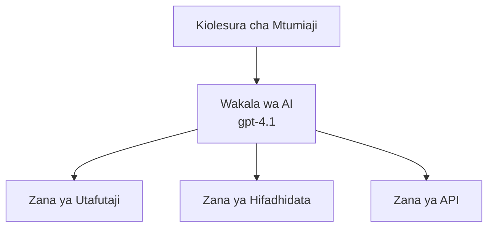
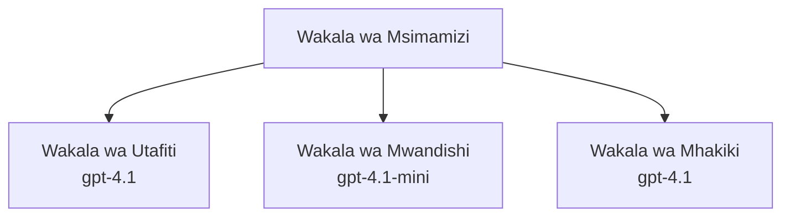

# Wakala za AI kwa Azure Developer CLI

**Uvinjari wa Sura:**
- **📚 Nyumbani kwa Kozi**: [AZD For Beginners](../../README.md)
- **📖 Sura ya Sasa**: Chapter 2 - AI-First Development
- **⬅️ Iliyopita**: [Microsoft Foundry Integration](microsoft-foundry-integration.md)
- **➡️ Ifuatayo**: [AI Model Deployment](ai-model-deployment.md)
- **🚀 Ya Juu**: [Multi-Agent Solutions](../../examples/retail-scenario.md)

---

## Utangulizi

Wakala za AI ni programu huru zinazoweza kutambua mazingira yao, kufanya maamuzi, na kuchukua hatua ili kufikia malengo maalum. Tofauti na chatbots rahisi zinazojibu tu maagizo, wakala wanaweza:

- **Tumia zana** - Piga API, tafuta kwenye hifadhidata, endesha msimbo
- **Panga na kutafakari** - Gawanya kazi ngumu katika hatua
- **Jifunze kutoka kwa muktadha** - Hifadhi kumbukumbu na badilika tabia
- **Shirikiana** - Fanya kazi na wakala wengine (mifumo ya wakala wengi)

Mwongozo huu unaonyesha jinsi ya kuzindua wakala za AI kwenye Azure kwa kutumia Azure Developer CLI (azd).

> **Validation note (2026-03-25):** Mwongozo huu ulilipwa dhidi ya `azd` `1.23.12` na `azure.ai.agents` `0.1.18-preview`. Uzoefu wa `azd ai` bado unaendeshwa kwa awamu ya majaribio, hivyo angalia msaada wa ugani ikiwa bendera ulizoweka zinatofautiana.

## Malengo ya Kujifunza

Kwa kukamilisha mwongozo huu, utakuwa umeweza:
- Kuelewa ni nini wakala za AI ni na jinsi zinavyotofautiana na chatbots
- Kuzindua violezo vya wakala vilivyotengenezwa mapema kwa kutumia AZD
- Kusanidi Wakala wa Foundry kwa wakala maalum
- Kutekeleza mifumo ya msingi ya wakala (matumizi ya zana, RAG, wakala wengi)
- Kufuatilia na kutatua matatizo ya wakala waliowezeshwa

## Matokeo ya Kujifunza

Baada ya kumaliza, utaweza:
- Kuzindua programu za wakala wa AI kwenye Azure kwa amri moja
- Kusanidi zana na uwezo wa wakala
- Kutekeleza retrieval-augmented generation (RAG) na wakala
- Kubuni usanifu wa wakala wengi kwa mipangilio ngumu ya kazi
- Kutatua matatizo ya kawaida ya uzindishaji wa wakala

---

## 🤖 Nini Kinaupa Wakala Tofauti na Chatbot?

| Kipengele | Chatbot | Wakala wa AI |
|---------|---------|----------|
| **Tabia** | Inajibu maagizo | Huchukua hatua kwa uamuzi wa mtu binafsi |
| **Zana** | Hazipo | Inaweza kupiga API, kutafuta, kuendesha msimbo |
| **Kumbukumbu** | Msingi wa kikao pekee | Kumbukumbu endelevu across sessions |
| **Utaratibu** | Jibu moja | Utafiti wa hatua nyingi |
| **Ushirikiano** | Kitu kimoja | Inaweza kufanya kazi na wakala wengine |

### Ulinganifu Rahisi

- **Chatbot** = Mtu msaidizi anaye jibu maswali kwenye dawati la taarifa
- **Wakala wa AI** = Msaidizi wa kibinafsi ambaye anaweza kupiga simu, kuweka miadi, na kukamilisha kazi kwa niaba yako

---

## 🚀 Anza Haraka: Zindua Wakala Wako wa Kwanza

### Chaguo 1: Kiolezo cha Foundry Agents (Kinachopendekezwa)

```bash
# Anzisha kiolezo cha mawakala wa AI
azd init --template get-started-with-ai-agents

# Sambaza kwenye Azure
azd up
```

**Nini kinazinduliwa:**
- ✅ Foundry Agents
- ✅ Microsoft Foundry Models (gpt-4.1)
- ✅ Azure AI Search (for RAG)
- ✅ Azure Container Apps (web interface)
- ✅ Application Insights (monitoring)

**Muda:** ~15-20 dakika
**Gharama:** ~$100-150/mwezi (maendeleo)

### Chaguo 2: OpenAI Agent na Prompty

```bash
# Anzisha kiolezo cha wakala kilichojengwa kwa Prompty
azd init --template agent-openai-python-prompty

# Weka kwenye Azure
azd up
```

**Nini kinazinduliwa:**
- ✅ Azure Functions (utekelezaji wa wakala usio na seva)
- ✅ Microsoft Foundry Models
- ✅ Faili za usanidi za Prompty
- ✅ Utekelezaji wa sampuli ya wakala

**Muda:** ~10-15 dakika
**Gharama:** ~$50-100/mwezi (maendeleo)

### Chaguo 3: Wakala wa Mazungumzo wa RAG

```bash
# Anzisha kiolezo cha mazungumzo cha RAG
azd init --template azure-search-openai-demo

# Sambaza kwenye Azure
azd up
```

**Nini kinazinduliwa:**
- ✅ Microsoft Foundry Models
- ✅ Azure AI Search na data ya sampuli
- ✅ Mtiririko wa usindikaji wa hati
- ✅ Kiolesura cha mazungumzo chenye marejeleo

**Muda:** ~15-25 dakika
**Gharama:** ~$80-150/mwezi (maendeleo)

### Chaguo 4: AZD AI Agent Init (Mapitio ya Manifest- au Kiolezo-Based)

Ikiwa una faili ya manifest ya wakala, unaweza kutumia amri `azd ai` kuunda mradi wa Foundry Agent Service moja kwa moja. Toleo la mapema pia limeongeza msaada wa kuanzisha kwa kutumia violezo, hivyo mtiririko wa maswali unaweza kutofautiana kidogo kulingana na toleo la ugani uliloloweka.

```bash
# Sakinisha ugani wa mawakala wa AI
azd extension install azure.ai.agents

# Hiari: thibitisha toleo la onyesho lililosakinishwa
azd extension show azure.ai.agents

# Anzisha kutoka kwenye manifesti ya wakala
azd ai agent init -m agent-manifest.yaml

# Weka kwenye Azure
azd up

# Jaribu wakala uliowekwa (inaonyesha ucheleweshaji na muda wa kupata byte ya kwanza)
azd ai agent invoke
```

**Wakati wa kutumia `azd ai agent init` dhidi ya `azd init --template`:**

| Njia | Inafaa Kwa | Jinsi Inavyofanya Kazi |
|----------|----------|------|
| `azd init --template` | Kuanzia kutoka kwenye sampuli inayofanya kazi | Inakopa repo kamili ya kiolezo na msimbo + miundombinu |
| `azd ai agent init -m` | Kujenga kutoka kwa manifest yako ya wakala | Inaandaa muundo wa mradi kutoka kwa ufafanuzi wa wakala wako |

> **Tip:** Tumia `azd init --template` wakati wa kujifunza (Chaguzi 1-3 hapo juu). Tumia `azd ai agent init` wakati unajenga wakala za uzalishaji na manifest zako.

Baada ya `azd up`, ugani ule ule utakufuata katika mzunguko wote wa maisha ya wakala: `azd ai agent invoke` kwa kujaribu, `azd ai agent eval generate` na `azd ai agent optimize` kupima na kuboresha ubora, na `azd ai agent delete` kusafisha. Angalia [Amri za AZD AI CLI](../chapter-08-production/production-ai-practices.md#azd-ai-cli-commands-and-extensions) kwa rejea kamili.

---

## 🏗️ Mifumo ya Usanifu ya Wakala

### Mtindo 1: Wakala Mmoja na Zana

Mfano rahisi wa wakala - wakala mmoja ambaye anaweza kutumia zana nyingi.



**Bora kwa:**
- Bot za msaada kwa wateja
- Wasaidizi wa utafiti
- Wakala wa uchambuzi wa data

**AZD Template:** `azure-search-openai-demo`

### Mtindo 2: Wakala wa RAG (Retrieval-Augmented Generation)

Wakala anayevuta hati zinazofaa kabla ya kuunda majibu.


**Bora kwa:**
- Hifadhidata za maarifa za shirika
- Mifumo ya maswali na majibu kwa hati
- Utafiti wa utekelezaji na kisheria

**AZD Template:** `azure-search-openai-demo`

### Mtindo 3: Mifumo ya Wakala Wengi

Wakala maalum kadhaa zikishirikiana kufanya kazi za kimkakati.



**Bora kwa:**
- Uundaji wa maudhui magumu
- Mtiririko wa kazi wenye hatua nyingi
- Kazi zinazohitaji utaalamu tofauti

**Jifunze Zaidi:** [Mipangilio ya Uratibu wa Wakala Wengi](../chapter-06-pre-deployment/coordination-patterns.md)

---

## ⚙️ Kusanidi Zana za Wakala

Wakala wanakuwa wenye nguvu wanapoweza kutumia zana. Hapa ni jinsi ya kusanidi zana za kawaida:

### Usanidi wa Zana katika Foundry Agents

```python
# agent_config.py
from azure.ai.projects import AIProjectClient
from azure.ai.projects.models import FunctionTool, CodeInterpreterTool

# Fafanua zana maalum
search_tool = FunctionTool(
    name="search_knowledge_base",
    description="Search the company knowledge base for relevant documents",
    parameters={
        "type": "object",
        "properties": {
            "query": {
                "type": "string",
                "description": "The search query"
            }
        },
        "required": ["query"]
    }
)

# Unda wakala na zana
agent = project_client.agents.create_agent(
    model="gpt-4.1",
    name="Support Agent",
    instructions="You are a helpful support agent. Use the search tool to find relevant information.",
    tools=[search_tool, CodeInterpreterTool()]
)
```

### Usanidi wa Mazingira

```bash
# Sanidi vigezo vya mazingira maalum kwa wakala
azd env set AZURE_OPENAI_MODEL "gpt-4.1"
azd env set AGENT_INSTRUCTIONS "You are a helpful assistant..."
azd env set ENABLE_CODE_INTERPRETER "true"
azd env set ENABLE_FILE_SEARCH "true"

# Peleka kwa usanidi uliosasishwa
azd deploy
```

---

## 📊 Kufuatilia Wakala

### Ujumuishaji wa Application Insights

Violezo vyote vya wakala vya AZD vinajumuisha Application Insights kwa ufuatiliaji:

```bash
# Fungua dashibodi ya ufuatiliaji
azd monitor --overview

# Tazama kumbukumbu za moja kwa moja
azd monitor --logs

# Tazama vipimo vya moja kwa moja
azd monitor --live
```

### Vipimo Muhimu vya Kufuatilia

| Kipimo | Maelezo | Lengo |
|--------|-------------|--------|
| Ucheleweshaji wa Jibu | Muda wa kuunda jibu | < 5 sekunde |
| Matumizi ya Tokeni | Tokeni kwa kila ombi | Fuatilia kwa gharama |
| Kiwango cha Mafanikio ya Miito ya Zana | % ya utekelezaji wa zana uliofanikiwa | > 95% |
| Kiwango cha Makosa | Maombi ya wakala yaliyoshindwa | < 1% |
| Kuridhika kwa Mtumiaji | Alama za maoni | > 4.0/5.0 |

### Kurekodi Maalum kwa Wakala

```python
import os
from azure.monitor.opentelemetry import configure_azure_monitor
from opentelemetry import trace

# Sanidi Azure Monitor kwa OpenTelemetry
configure_azure_monitor(
    connection_string=os.environ["APPLICATIONINSIGHTS_CONNECTION_STRING"]
)

tracer = trace.get_tracer(__name__)

def log_agent_interaction(user_query, agent_response, tools_used, latency_ms):
    with tracer.start_as_current_span("agent_interaction") as span:
        span.set_attributes({
            "user_query": user_query,
            "response_length": len(agent_response),
            "tools_used": tools_used,
            "latency_ms": latency_ms
        })
```

> **Kumbuka:** Sakinisha vifurushi vinavyohitajika: `pip install azure-monitor-opentelemetry opentelemetry`

---

## 💰 Mambo ya Kuzingatia Gharama

### Makadirio ya Gharama za Mwezi kwa Kila Mtindo

| Mtindo | Mazingira ya Maendeleo | Uzalishaji |
|---------|-----------------|------------|
| Wakala Mmoja | $50-100 | $200-500 |
| Wakala wa RAG | $80-150 | $300-800 |
| Wakala Wengi (wakala 2-3) | $150-300 | $500-1,500 |
| Wakala Wengi wa Shirika | $300-500 | $1,500-5,000+ |

### Vidokezo vya Kupunguza Gharama

1. **Tumia gpt-4.1-mini kwa kazi rahisi**
   ```bash
   azd env set AZURE_OPENAI_MODEL "gpt-4.1-mini"
   ```

2. **Tekeleza caching kwa maswali yanayorudiwa**
   ```python
   from functools import lru_cache
   
   @lru_cache(maxsize=1000)
   def get_cached_response(query_hash):
       return agent.run(query_hash)
   ```

3. **Weka mipaka ya tokeni kwa kila utekelezwaji**
   ```python
   # Weka max_completion_tokens wakati wa kuendesha wakala, si wakati wa kuunda
   run = project_client.agents.create_run(
       thread_id=thread.id,
       agent_id=agent.id,
       max_completion_tokens=1000  # Weka kikomo kwa urefu wa majibu
   )
   ```

4. **Punguza hadi sifuri wakati haitumiki**
   ```bash
   # Programu za kontena hupungua kiotomatiki hadi sifuri
   azd env set MIN_REPLICAS "0"
   ```

---

## 🔧 Utatuzi wa Matatizo ya Wakala

### Masuala ya Kawaida na Suluhisho

<details>
<summary><strong>❌ Wakala hajibu miito ya zana</strong></summary>

```bash
# Kagua ikiwa zana zimeandikishwa ipasavyo
azd show

# Thibitisha utekelezaji wa OpenAI
az cognitiveservices account deployment list \
  --name $AZURE_OPENAI_NAME \
  --resource-group $RG_NAME

# Kagua rekodi za wakala
azd monitor --logs
```

**Sababu za kawaida:**
- Saini ya kazi ya zana haifani
- Ruhusa zinazohitajika hazipo
- Mwisho wa API haupatikani
</details>

<details>
<summary><strong>❌ Ucheleweshaji mkubwa katika majibu ya wakala</strong></summary>

```bash
# Angalia Application Insights kwa vizuizi
azd monitor --live

# Fikiria kutumia modeli ya haraka zaidi
azd env set AZURE_OPENAI_MODEL "gpt-4.1-mini"
azd deploy
```

**Vidokezo vya uboreshaji:**
- Tumia majibu ya mtiririko
- Tekeleza caching ya majibu
- Punguza ukubwa wa dirisha la muktadha
</details>

<details>
<summary><strong>❌ Wakala kurudisha taarifa zisizo sahihi au za 'hallucination'</strong></summary>

```python
# Boresha kwa maagizo bora ya mfumo
instructions = """
You are a helpful assistant. IMPORTANT:
- Only answer based on provided context
- If you don't know, say "I don't know"
- Always cite your sources
- Never make up information
"""

# Ongeza urejeshaji kwa ajili ya kuweka msingi
agent = project_client.agents.create_agent(
    model="gpt-4.1",
    instructions=instructions,
    tools=[FileSearchTool()]  # Saidia majibu kuungwa mkono na nyaraka
)
```
</details>

<details>
<summary><strong>❌ Makosa ya mipaka ya tokeni kupita</strong></summary>

```python
# Tekeleza usimamizi wa dirisha la muktadha
def truncate_context(messages, max_tokens=8000, model="gpt-4.1"):
    """Keep only recent messages within token limit."""
    import tiktoken
    encoding = tiktoken.encoding_for_model(model)
    total_tokens = 0
    truncated = []
    
    for msg in reversed(messages):
        msg_tokens = len(encoding.encode(msg.content))
        if total_tokens + msg_tokens > max_tokens:
            break
        truncated.insert(0, msg)
        total_tokens += msg_tokens
    
    return truncated
```
</details>

---

## 🎓 Mazoezi ya Vitendo

### Mazoezi 1: Zindua Wakala Msingi (20 dakika)

**Lengo:** Zindua wakala wako wa kwanza wa AI kwa kutumia AZD

```bash
# Hatua 1: Anzisha kiolezo
azd init --template get-started-with-ai-agents

# Hatua 2: Ingia kwenye Azure
azd auth login
# Ikiwa unafanya kazi kwa wapangaji mbalimbali, ongeza --tenant-id <tenant-id>

# Hatua 3: Sambaza
azd up

# Hatua 4: Jaribu wakala
# Matokeo yanayotarajiwa baada ya usambazaji:
#   Usambazaji umekamilika!
#   Mwisho (endpoint): https://<app-name>.<region>.azurecontainerapps.io
# Fungua URL iliyoonyeshwa katika matokeo na ujaribu kuuliza swali

# Hatua 5: Tazama ufuatiliaji
azd monitor --overview

# Hatua 6: Safisha
azd down --force --purge
```

**Vigezo vya Mafanikio:**
- [ ] Wakala anajibu maswali
- [ ] Inaweza kufikia dashibodi ya ufuatiliaji kupitia `azd monitor`
- [ ] Rasilimali zilisafishwa kwa mafanikio

### Mazoezi 2: Ongeza Zana Maalum (30 dakika)

**Lengo:** Panua wakala kwa zana maalum

1. Zindua kiolezo cha wakala:
   ```bash
   azd init --template get-started-with-ai-agents
   azd up
   ```
2. Unda kazi mpya ya zana katika msimbo wa wakala wako:
   ```python
   def get_weather(location: str) -> str:
       """Get current weather for a location."""
       # Mwito wa API kwa huduma ya hali ya hewa
       return f"Weather in {location}: Sunny, 72°F"
   ```
3. Sajili zana na wakala:
   ```python
   from azure.ai.projects.models import FunctionTool

   weather_tool = FunctionTool(
       name="get_weather",
       description="Get current weather for a location",
       parameters={
           "type": "object",
           "properties": {
               "location": {"type": "string", "description": "City name"}
           },
           "required": ["location"]
       }
   )

   agent = project_client.agents.create_agent(
       model="gpt-4.1",
       name="Weather Agent",
       tools=[weather_tool]
   )
   ```
4. Rekabisha na jaribu:
   ```bash
   azd deploy
   # Uliza: "Je, hali ya hewa huko Seattle ikoje?"
   # Inatarajiwa: Agenti anaita get_weather("Seattle") na kurudisha taarifa za hali ya hewa
   ```

**Vigezo vya Mafanikio:**
- [ ] Wakala anakubali maswali yanayohusiana na hali ya hewa
- [ ] Zana inaitwa kwa usahihi
- [ ] Jibu linajumuisha taarifa za hali ya hewa

### Mazoezi 3: Jenga Wakala wa RAG (45 dakika)

**Lengo:** Unda wakala anayejibu maswali kutoka kwa nyaraka zako

```bash
# Hatua 1: Zindua kiolezo cha RAG
azd init --template azure-search-openai-demo
azd up

# Hatua 2: Pakia nyaraka zako
# Weka faili za PDF/TXT katika saraka data/, kisha endesha:
python scripts/prepdocs.py

# Hatua 3: Jaribu kwa maswali maalum ya fani
# Fungua URL ya wavuti ya programu kutoka kwenye matokeo ya azd up
# Uliza maswali kuhusu nyaraka ulizopakia
# Majibu yanapaswa kujumuisha marejeo ya chanzo kama [doc.pdf]
```

**Vigezo vya Mafanikio:**
- [ ] Wakala anajibu kutoka kwa nyaraka zilizopakuliwa
- [ ] Majibu yanajumuisha marejeleo
- [ ] Hakuna 'hallucination' kwa maswali yasiyo ndani ya wigo

---

## 📚 Hatua Zifuatazo

Sasa unapofahamu wakala za AI, chunguza mada hizi za juu:

| Mada | Maelezo | Kiungo |
|-------|-------------|------|
| **Multi-Agent Systems** | Jenga mifumo yenye wakala wengi wanaoshirikiana | [Retail Multi-Agent Example](../../examples/retail-scenario.md) |
| **Coordination Patterns** | Jifunze mipangilio ya uratibu na mawasiliano | [Coordination Patterns](../chapter-06-pre-deployment/coordination-patterns.md) |
| **Production Deployment** | Utoaji wa wakala kwa uzalishaji wa shirika | [Production AI Practices](../chapter-08-production/production-ai-practices.md) |
| **Agent Evaluation** | Jaribu na tathmini utendaji wa wakala | [AI Troubleshooting](../chapter-07-troubleshooting/ai-troubleshooting.md) |
| **AI Workshop Lab** | Vitendo: Tengeneza suluhisho lako la AI lisiwe tayari kwa AZD | [AI Workshop Lab](ai-workshop-lab.md) |

---

## 📖 Rasilimali Zaidi

### Nyaraka Rasmi
- [Microsoft Foundry Agent Service](https://learn.microsoft.com/azure/ai-services/agents/)
- [Microsoft Foundry Agent Service Quickstart](https://learn.microsoft.com/azure/ai-services/agents/quickstart)
- [Semantic Kernel Agent Framework](https://learn.microsoft.com/semantic-kernel/)

### Violezo vya AZD kwa Wakala
- [Get Started with AI Agents](https://github.com/Azure-Samples/get-started-with-ai-agents)
- [Agent OpenAI Python Prompty](https://github.com/Azure-Samples/agent-openai-python-prompty)
- [Azure Search OpenAI Demo](https://github.com/Azure-Samples/azure-search-openai-demo)

### Rasilimali za Jamii
- [Awesome AZD - Agent Templates](https://azure.github.io/awesome-azd/?tags=ai-agents)
- [Azure AI Discord](https://discord.gg/microsoft-azure)
- [Microsoft Foundry Discord](https://discord.gg/nTYy5BXMWG)

### Ujuzi wa Wakala kwa Mhariri Wako
- [**Ujuzi wa Wakala wa Microsoft Azure**](https://skills.sh/microsoft/github-copilot-for-azure) - Sakinisha ujuzi wa wakala wa AI unaoweza kutumika tena kwa maendeleo ya Azure katika GitHub Copilot, Cursor, au wakala mwingine unaounga mkono. Inajumuisha ujuzi kwa [Azure AI](https://skills.sh/microsoft/github-copilot-for-azure/azure-ai), [Microsoft Foundry](https://skills.sh/microsoft/github-copilot-for-azure/microsoft-foundry), [deployment](https://skills.sh/microsoft/github-copilot-for-azure/azure-deploy), na [diagnostics](https://skills.sh/microsoft/github-copilot-for-azure/azure-diagnostics):
  ```bash
  npx skills add microsoft/github-copilot-for-azure
  ```

---

**Uvinjari**
- **Somo lililopita**: [Microsoft Foundry Integration](microsoft-foundry-integration.md)
- **Somo lifuatalo**: [AI Model Deployment](ai-model-deployment.md)

---

<!-- CO-OP TRANSLATOR DISCLAIMER START -->
**Kionyozo**:
Hati hii imetafsiriwa kwa kutumia huduma ya tafsiri ya AI [Co-op Translator](https://github.com/Azure/co-op-translator). Ingawa tunajitahidi kupata usahihi, tafadhali fahamu kwamba tafsiri za kiotomatiki zinaweza kuwa na makosa au upungufu wa usahihi. Hati ya asili katika lugha yake halisi inapaswa kuchukuliwa kama chanzo cha mamlaka. Kwa taarifa muhimu, tafsiri ya kitaalamu inayofanywa na binadamu inapendekezwa. Hatutojibu kwa kuelewa vibaya au tafsiri potofu zinazotokea kutokana na matumizi ya tafsiri hii.
<!-- CO-OP TRANSLATOR DISCLAIMER END -->