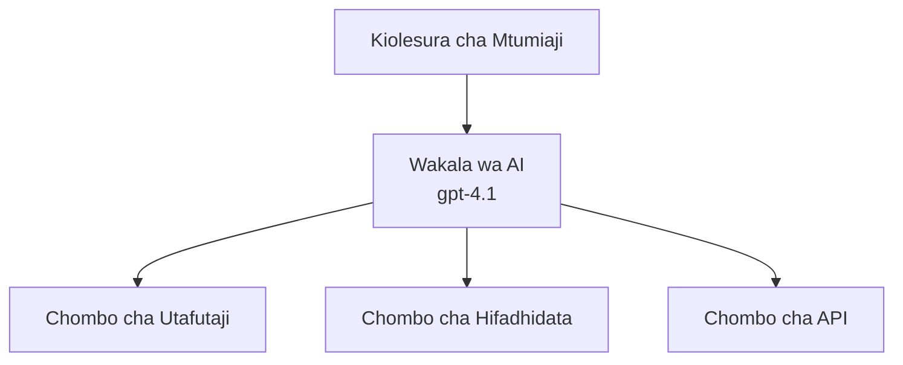
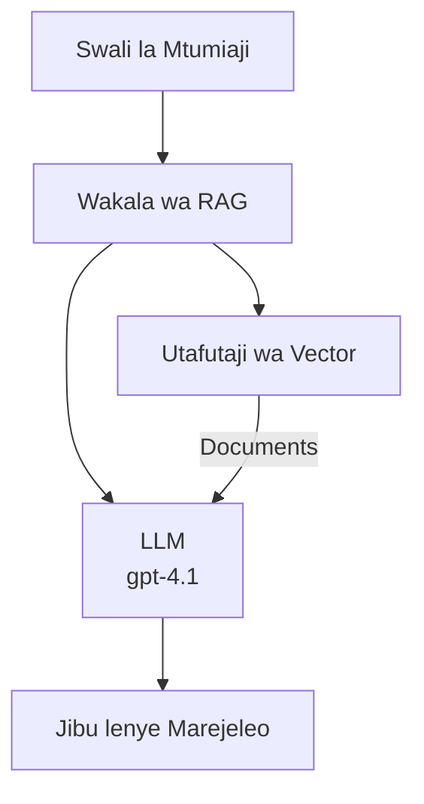
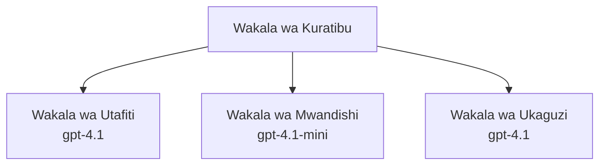

# Wakala wa AI na Azure Developer CLI

**Uelekezaji wa Sura:**
- **📚 Nyumbani kwa Kozi**: [AZD Kwa Waanzilishi](../../README.md)
- **📖 Sura ya Sasa**: Sura ya 2 - Maendeleo Yanayoweka AI Kwanza
- **⬅️ Iliyotangulia**: [Muunganisho wa Microsoft Foundry](microsoft-foundry-integration.md)
- **➡️ Ifuatayo**: [Uenezi wa Mfano wa AI](ai-model-deployment.md)
- **🚀 Maendeleo**: [Suluhisho za Wakala Wengi](../../examples/retail-scenario.md)

---

## Utangulizi

Wakala wa AI ni programu huru ambazo zinaweza kuhisi mazingira yao, kufanya maamuzi, na kuchukua hatua kufanikisha malengo maalum. Tofauti na chatbots rahisi zinazojibu amri, wakala wanaweza:

- **Tumia zana** - Piga API, tafuta katika hifadhidata, endesha msimbo
- **Panga na tafakari** - Gawanya kazi ngumu katika hatua
- **Jifunza kutokana na muktadha** - Hifadhi kumbukumbu na badilika tabia
- **Shirikiana** - Fanya kazi na wakala wengine (mfumo wa wakala wengi)

Mwongozo huu unaonyesha jinsi ya kueneza wakala wa AI kwa Azure kwa kutumia Azure Developer CLI (azd).

> **Kumbuka uthibitisho (2026-07-13):** Mwongozo huu umepitiwa dhidi ya `azd` `1.27.1` na `azure.ai.agents` `1.0.0-beta.5`. Uzoefu wa `azd ai` bado ni wa awali, basi hakikisha unakagua msaada wa programu-jalizi ikiwa bendera uliyo nazo ni tofauti.

## Malengo ya Kujifunza

Kwa kumaliza mwongozo huu, utaweza:
- Elewa wakala wa AI ni nini na wanatofautianaje na chatbots
- Eneza templeti za wakala wa AI zilizojengwa tayari kwa kutumia AZD
- Sanidi Wakala wa Foundry kwa wakala maalum
- Tekeleza mifumo ya msingi ya wakala (matumizi ya zana, RAG, wakala wengi)
- Fuatilia na tatua matatizo ya wakala waliowekwa

## Matokeo ya Kujifunza

Baada ya kumaliza, utaweza:
- Eneza programu za wakala wa AI kwa Azure kwa amri moja
- Sanidi zana na uwezo wa wakala
- Tekeleza uzalishaji ulioboreshwa kwa urejelezaji (RAG) kwa wakala
- Buni miundo ya wakala wengi kwa michakato ngumu
- Tatua matatizo ya kawaida ya uenezaji wa wakala

---

## 🤖 Ni Nini Kinafanya Wakala Kutofautiana na Chatbot?

| Kipengele | Chatbot | Wakala wa AI |
|---------|---------|----------|
| **Tabia** | Kujibu maamri | Kuchukua hatua huru |
| **Zana** | Hakuna | Inaweza kupiga API, kutafuta, kuendesha msimbo |
| **Kumbukumbu** | Kiweli cha kikao tu | Kumbukumbu inayodumu katika vikao vyote |
| **Mipango** | Jibu moja tu | Tafakari katika hatua nyingi |
| **Ushirikiano** | Kitu kimoja | Inaweza kufanya kazi na wakala wengine |

### Mfano Rahisi

- **Chatbot** = Mtu mwenye msaada anayejibu maswali kwenye dawati la habari
- **Wakala wa AI** = Msaidizi wa kibinafsi anayepiga simu, kuweka miadi, na kumaliza kazi kwa niaba yako

---

## 🚀 Anza Haraka: Eneza Wakala Wako wa Kwanza

### Chaguo 1: Templeti za Wakala wa Foundry (Inapendekezwa)

```bash
# Anzisha kiolezo cha mawakala wa AI
azd init --template get-started-with-ai-agents

# Tuma kwenye Azure
azd up
```

**Kinachozunguka:**
- ✅ Wakala wa Foundry
- ✅ Miundo ya Microsoft Foundry (gpt-4.1)
- ✅ Azure AI Search (kwa RAG)
- ✅ Azure Container Apps (kiolesura cha wavuti)
- ✅ Application Insights (ufuatiliaji)

**Muda:** ~dakika 15-20
**Gharama:** ~$100-150/mwezi (maendeleo)

### Chaguo 2: Wakala wa OpenAI na Prompty

```bash
# Anzisha kiolezo cha wakala kinachotegemea Prompty
azd init --template agent-openai-python-prompty

# Sambaza kwenye Azure
azd up
```

**Kinachozunguka:**
- ✅ Azure Functions (utekelezaji wa wakala bila seva)
- ✅ Miundo ya Microsoft Foundry
- ✅ Faili za usanidi wa Prompty
- ✅ Utekelezaji wa mfano wa wakala

**Muda:** ~dakika 10-15
**Gharama:** ~$50-100/mwezi (maendeleo)

### Chaguo 3: Wakala wa RAG Chat

```bash
# Anzisha kiolezo cha mazungumzo ya RAG
azd init --template azure-search-openai-demo

# Tumia kwenye Azure
azd up
```

**Kinachozunguka:**
- ✅ Miundo ya Microsoft Foundry
- ✅ Azure AI Search na data ya mfano
- ✅ Mlolongo wa usindikaji wa hati
- ✅ Kiolesura cha mazungumzo chenye rufaa

**Muda:** ~dakika 15-25
**Gharama:** ~$80-150/mwezi (maendeleo)

### Chaguo 4: AZD AI Agent Init (Muonekano wa Maneno- au Templeti-Based)

Ikiwa una faili la maelezo ya wakala, unaweza kutumia amri `azd ai` kuanzisha mradi wa Huduma ya Wakala wa Foundry moja kwa moja. Toleo la hivi karibuni la maonyesho liliongeza pia msaada wa kuanzisha kwa templeti, hivyo mtiririko sahihi wa amri unaweza kutofautiana kidogo kulingana na toleo la programu-jalizi uliyo nayo.

```bash
# Sakinisha nyongeza za mawakala wa AI
azd extension install azure.ai.agents

# Hiari: hakiki toleo lililosakinishwa la awali
azd extension show azure.ai.agents

# Anzisha kutoka kwenye taarifa ya wakala
azd ai agent init -m agent-manifest.yaml

# Weka kwenye Azure
azd up

# Jaribu wakala aliyewekwa (inaonyesha ucheleweshaji + wakati wa pakiti ya kwanza)
azd ai agent invoke
```

**Wakati wa kutumia `azd ai agent init` dhidi ya `azd init --template`:**

| Mbinu | Bora Kwa | Jinsi Inavyofanya Kazi |
|----------|----------|------|
| `azd init --template` | Kuanzia na app ya mfano inayofanya kazi | Inanakili repo ya templeti kamili yenye msimbo + miundombinu |
| `azd ai agent init -m` | Kujenga kwa maelezo yako ya wakala | Inaandaa muundo wa mradi kutokana na maelezo yako ya wakala |

> **Ushauri:** Tumia `azd init --template` unapojifunza (Chaguzi 1-3 hapo juu). Tumia `azd ai agent init` unapojenga wakala wa uzalishaji kwa maelezo yako mwenyewe.

Baada ya `azd up`, programu-jalizi ile ile itakuongoza katika mchakato wa maisha ya wakala: `azd ai agent invoke` kwa mtihani, `azd ai agent eval generate` na `azd ai agent optimize` kupima na kuboresha ubora, na `azd ai agent delete` kusafisha. Tazama [Amri za AZD AI CLI](../chapter-08-production/production-ai-practices.md#azd-ai-cli-commands-and-extensions) kwa rejeleo kamili.

---

## 🏗️ Mifumo ya Muundo wa Wakala

### Mfano 1: Wakala Mmoja Anayetumia Zana

Mfano rahisi zaidi wa wakala - wakala mmoja anayetumia zana nyingi.



**Bora kwa:**
- Chatbots wa msaada kwa wateja
- Msaidizi wa utafiti
- Wakala wa uchambuzi wa data

**Templeti ya AZD:** `azure-search-openai-demo`

### Mfano 2: Wakala wa RAG (Uzalishaji unaoimarishwa kwa urejelezaji)

Wakala anayepata hati zinazofaa kabla ya kuzalisha majibu.



**Bora kwa:**
- Misingi ya maarifa ya biashara
- Mifumo ya maswali na majibu ya hati
- Utafiti wa ulinganifu na kisheria

**Templeti ya AZD:** `azure-search-openai-demo`

### Mfano 3: Mfumo wa Wakala Wengi

Wakala wengi maalum wakishirikiana kufanya kazi kwenye kazi ngumu.



**Bora kwa:**
- Uzalishaji wa maudhui magumu
- Michakato yenye hatua nyingi
- Kazi zinazohitaji ujuzi tofauti

**Jifunze Zaidi:** [Mifumo ya Uratibu wa Wakala Wengi](../chapter-06-pre-deployment/coordination-patterns.md)

---

## ⚙️ Kusanidi Zana za Wakala

Wakala huwa na nguvu wanapoweza kutumia zana. Hapa kuna jinsi ya kusanidi zana maarufu:

### Usanidi wa Zana katika Wakala wa Foundry

```python
# agent_config.py
from azure.ai.projects import AIProjectClient
from azure.ai.projects.models import FunctionTool, CodeInterpreterTool

# Tafsiri zana maalum
search_tool = FunctionTool(
    name="search_knowledge_base",
    description="Search the company knowledge base for relevant documents",
    parameters={
        "type": "object",
        "properties": {
            "query": {
                "type": "string",
                "description": "The search query"
            }
        },
        "required": ["query"]
    }
)

# Unda wakala na zana
agent = project_client.agents.create_agent(
    model="gpt-4.1",
    name="Support Agent",
    instructions="You are a helpful support agent. Use the search tool to find relevant information.",
    tools=[search_tool, CodeInterpreterTool()]
)
```

### Usanidi wa Mazingira

```bash
# Weka vigezo maalum vya mazingira kwa wakala
azd env set AZURE_OPENAI_MODEL "gpt-4.1"
azd env set AGENT_INSTRUCTIONS "You are a helpful assistant..."
azd env set ENABLE_CODE_INTERPRETER "true"
azd env set ENABLE_FILE_SEARCH "true"

# Anzisha na usanidi ulio sasishwa
azd deploy
```

---

## 📊 Kufuatilia Wakala

### Muunganisho wa Application Insights

Templeti zote za wakala za AZD zina Application Insights kwa ufuatiliaji:

```bash
# Fungua dashibodi ya ufuatiliaji
azd monitor --overview

# Angalia kumbukumbu za moja kwa moja
azd monitor --logs

# Angalia vipimo vya moja kwa moja
azd monitor --live
```

### Viashiria Muhimu vya Kufuatilia

| Kipimo | Maelezo | Lengo |
|--------|-------------|--------|
| Muda wa Kujibu | Muda wa kuzalisha jibu | < sekunde 5 |
| Matumizi ya Tokeni | Tokeni kwa kila ombi | Fuata gharama |
| Kiwango cha Mafanikio cha Kuitwa kwa Zana | % ya utekelezaji wa zana uliofanikiwa | > 95% |
| Kiwango cha Makosa | Maombi ya wakala yaliyoanguka | < 1% |
| Kuridhika kwa Mtumiaji | Alama za maoni | > 4.0/5.0 |

### Kuingiza Logi Maalum kwa Wakala

```python
import os
from azure.monitor.opentelemetry import configure_azure_monitor
from opentelemetry import trace

# Sanidi Azure Monitor kwa OpenTelemetry
configure_azure_monitor(
    connection_string=os.environ["APPLICATIONINSIGHTS_CONNECTION_STRING"]
)

tracer = trace.get_tracer(__name__)

def log_agent_interaction(user_query, agent_response, tools_used, latency_ms):
    with tracer.start_as_current_span("agent_interaction") as span:
        span.set_attributes({
            "user_query": user_query,
            "response_length": len(agent_response),
            "tools_used": tools_used,
            "latency_ms": latency_ms
        })
```

> **Kumbuka:** Sakinisha vifurushi vinavyotakiwa: `pip install azure-monitor-opentelemetry opentelemetry`

---

## 💰 Mambo ya Kuzingatia Kuhusu Gharama

### Makadirio ya Gharama Kila Mwezi Kwa Mfano

| Mfano | Mazingira ya Maendeleo | Uzalishaji |
|---------|-----------------|------------|
| Wakala Mmoja | $50-100 | $200-500 |
| Wakala wa RAG | $80-150 | $300-800 |
| Wakala Wengi (wakala 2-3) | $150-300 | $500-1,500 |
| Wakala Wengi wa Biashara | $300-500 | $1,500-5,000+ |

### Vidokezo vya Kuboresha Gharama

1. **Tumia gpt-4.1-mini kwa kazi rahisi**
   ```bash
   azd env set AZURE_OPENAI_MODEL "gpt-4.1-mini"
   ```

2. **Tekeleza kuhifadhi makabrasha kwa maswali yanayojirudia**
   ```python
   from functools import lru_cache
   
   @lru_cache(maxsize=1000)
   def get_cached_response(query_hash):
       return agent.run(query_hash)
   ```

3. **Weka mipaka ya tokeni kwa kila mzunguko**
   ```python
   # Weka max_completion_tokens unapotumia wakala, sio wakati wa kuunda
   run = project_client.agents.create_run(
       thread_id=thread.id,
       agent_id=agent.id,
       max_completion_tokens=1000  # Punguza urefu wa jibu
   )
   ```

4. **Punguza hadi sifuri wakati haitumiki**
   ```bash
   # Programu za Kontena zinaweza kupanuka hadi sifuri moja kwa moja
   azd env set MIN_REPLICAS "0"
   ```

---

## 🔧 Kutatua Matatizo ya Wakala

### Matatizo na Ufumbuzi Wa Kawaida

<details>
<summary><strong>❌ Wakala haajibu miito ya zana</strong></summary>

```bash
# Angalia kama zana zimeandikwa vizuri
azd show

# Thibitisha usambazaji wa OpenAI
az cognitiveservices account deployment list \
  --name $AZURE_OPENAI_NAME \
  --resource-group $RG_NAME

# Angalia kumbukumbu za wakala
azd monitor --logs
```

**Sababu za kawaida:**
- Kutosheleza saini ya kazi ya zana
- Kukosa ruhusa muhimu
- Sehemu ya API haipatikani
</details>

<details>
<summary><strong>❌ Muda mrefu wa kusubiri majibu ya wakala</strong></summary>

```bash
# Angalia Application Insights kwa vikwazo
azd monitor --live

# Fikiria kutumia mfano wa kasi zaidi
azd env set AZURE_OPENAI_MODEL "gpt-4.1-mini"
azd deploy
```

**Vidokezo vya kuboresha:**
- Tumia majibu ya mtiririko
- Tekeleza kuhifadhi majibu
- Punguza ukubwa wa dirisha la muktadha
</details>

<details>
<summary><strong>❌ Wakala anarudisha taarifa zisizo sahihi au za kufikirika</strong></summary>

```python
# Boresha kwa maagizo bora ya mfumo
instructions = """
You are a helpful assistant. IMPORTANT:
- Only answer based on provided context
- If you don't know, say "I don't know"
- Always cite your sources
- Never make up information
"""

# Ongeza utafutaji kwa ajili ya kuweka msingi
agent = project_client.agents.create_agent(
    model="gpt-4.1",
    instructions=instructions,
    tools=[FileSearchTool()]  # Weka majibu msingi kwenye nyaraka
)
```
</details>

<details>
<summary><strong>❌ Makosa ya kuzidi mipaka ya tokeni</strong></summary>

```python
# Tekeleza usimamizi wa dirisha la muktadha
def truncate_context(messages, max_tokens=8000, model="gpt-4.1"):
    """Keep only recent messages within token limit."""
    import tiktoken
    encoding = tiktoken.encoding_for_model(model)
    total_tokens = 0
    truncated = []
    
    for msg in reversed(messages):
        msg_tokens = len(encoding.encode(msg.content))
        if total_tokens + msg_tokens > max_tokens:
            break
        truncated.insert(0, msg)
        total_tokens += msg_tokens
    
    return truncated
```
</details>

---

## 🎓 Mazoezi ya Vitendo

### Zoefzo 1: Eneza Wakala wa Msingi (dakika 20)

**Lengo:** Eneza wakala wako wa kwanza wa AI kwa kutumia AZD

```bash
# Hatua ya 1: Anzisha kiolezo
azd init --template get-started-with-ai-agents

# Hatua ya 2: Ingia kwenye Azure
azd auth login
# Ikiwa unafanya kazi kwenye wakopeshaji mbalimbali, ongeza --tenant-id <tenant-id>

# Hatua ya 3: Tengeneza
azd up

# Hatua ya 4: Jaribu wakala
# Matokeo yanayotarajiwa baada ya uanzishaji:
#   Uanzishaji Umefafanikiwa!
#   Sehemu ya mwisho: https://<app-name>.<region>.azurecontainerapps.io
# Fungua URL iliyoonyeshwa kwenye matokeo na jaribu kuuliza swali

# Hatua ya 5: Angalia ufuatiliaji
azd monitor --overview

# Hatua ya 6: Safisha
azd down --force --purge
```

**Vigezo vya Mafanikio:**
- [ ] Wakala anajibu maswali
- [ ] Anaweza kufikia dashibodi ya ufuatiliaji kupitia `azd monitor`
- [ ] Rasilimali zimeondolewa kwa mafanikio

### Zoefzo 2: Ongeza Zana Maalum (dakika 30)

**Lengo:** Panua wakala kwa zana maalum

1. Eneza templeti ya wakala:
   ```bash
   azd init --template get-started-with-ai-agents
   azd up
   ```
2. Unda kazi mpya ya zana katika msimbo wa wakala wako:
   ```python
   def get_weather(location: str) -> str:
       """Get current weather for a location."""
       # Wito la API kwa huduma ya hali ya hewa
       return f"Weather in {location}: Sunny, 72°F"
   ```
3. Sajili zana kwa wakala:
   ```python
   from azure.ai.projects.models import FunctionTool

   weather_tool = FunctionTool(
       name="get_weather",
       description="Get current weather for a location",
       parameters={
           "type": "object",
           "properties": {
               "location": {"type": "string", "description": "City name"}
           },
           "required": ["location"]
       }
   )

   agent = project_client.agents.create_agent(
       model="gpt-4.1",
       name="Weather Agent",
       tools=[weather_tool]
   )
   ```
4. Eneza tena na jaribu:
   ```bash
   azd deploy
   # Uliza: "Hali ya hewa huko Seattle ni vipi?"
   # Inayotarajiwa: Wakala anapiga simu get_weather("Seattle") na kurudisha taarifa za hali ya hewa
   ```

**Vigezo vya Mafanikio:**
- [ ] Wakala anatambua maswali yanayohusiana na hali ya hewa
- [ ] Zana inaitwa ipasavyo
- [ ] Jibu linajumuisha taarifa za hali ya hewa

### Zoefzo 3: Jenga Wakala wa RAG (dakika 45)

**Lengo:** Unda wakala anayejibu maswali kutoka kwa nyaraka zako

```bash
# Hatua ya 1: Sambaza mfano wa RAG
azd init --template azure-search-openai-demo
azd up

# Hatua ya 2: Pandisha nyaraka zako
# Weka faili za PDF/TXT katika saraka ya data/, kisha endesha:
python scripts/prepdocs.py

# Hatua ya 3: Jaribu kwa maswali maalum ya eneo
# Fungua URL ya programu ya wavuti kutoka kwa azd up output
# Uliza maswali kuhusu nyaraka zako zilizopandishwa
# Majibu yanapaswa kujumuisha marejeleo ya vyanzo kama [doc.pdf]
```

**Vigezo vya Mafanikio:**
- [ ] Wakala anajibu kutoka kwa nyaraka zilizopakiwa
- [ ] Majibu yanajumuisha rufaa
- [ ] Hakuna kufikirika kuhusu maswali yasiyo ya wigo

---

## 📚 Hatua Zifuatazo

Sasa unapoelewa wakala wa AI, chunguza mada hizi za hali ya juu:

| Mada | Maelezo | Kiungo |
|-------|-------------|------|
| **Mifumo ya Wakala Wengi** | Jenga mifumo yenye wakala wengi wanaoshirikiana | [Mfano wa Wakala Wengi wa Rejareja](../../examples/retail-scenario.md) |
| **Mifumo ya Uratibu** | Jifunze mifumo ya upangaji na mawasiliano | [Mifumo ya Uratibu](../chapter-06-pre-deployment/coordination-patterns.md) |
| **Uenezaji wa Uzalishaji** | Uenezaji wa wakala tayari kwa biashara | [Mazingira ya AI wa Uzalishaji](../chapter-08-production/production-ai-practices.md) |
| **Tathmini ya Wakala** | Mtihani na tathmini ya utendaji wa wakala | [Tatizo la AI](../chapter-07-troubleshooting/ai-troubleshooting.md) |
| **Kiwanda cha Kazi cha AI** | Vitendo: Fanya suluhisho lako la AI liwe tayari kwa AZD | [Kiwanda cha Kazi cha AI](ai-workshop-lab.md) |

---

## 📖 Rasilimali Zaidi

### Nyaraka Rasmi
- [Huduma ya Wakala wa Microsoft Foundry](https://learn.microsoft.com/azure/ai-services/agents/)
- [Mwongozo wa Haraka wa Huduma ya Wakala wa Microsoft Foundry](https://learn.microsoft.com/azure/ai-services/agents/quickstart)
- [Mfumo wa Wakala wa Semantic Kernel](https://learn.microsoft.com/semantic-kernel/)

### Templeti za AZD kwa Wakala
- [Anza na Wakala wa AI](https://github.com/Azure-Samples/get-started-with-ai-agents)
- [Agent OpenAI Python Prompty](https://github.com/Azure-Samples/agent-openai-python-prompty)
- [Azure Search OpenAI Demo](https://github.com/Azure-Samples/azure-search-openai-demo)

### Rasilimali za Jumuia
- [AZD Bora - Templeti za Wakala](https://azure.github.io/awesome-azd/?tags=ai-agents)
- [Discord ya Azure AI](https://discord.gg/microsoft-azure)
- [Discord ya Microsoft Foundry](https://discord.gg/nTYy5BXMWG)

### Ujuzi wa Wakala kwa Mhariri Wako
- [**Ujuzi wa Wakala wa Microsoft Azure**](https://skills.sh/microsoft/github-copilot-for-azure) - Sakinisha ujuzi wa wakala wa AI unaoweza kutumika tena kwa maendeleo ya Azure kwenye GitHub Copilot, Cursor, au wakala mwingine yeyote aliyeunga mkono. Inajumuisha ujuzi kwa [Azure AI](https://skills.sh/microsoft/github-copilot-for-azure/azure-ai), [Microsoft Foundry](https://skills.sh/microsoft/github-copilot-for-azure/microsoft-foundry), [uenezaji](https://skills.sh/microsoft/github-copilot-for-azure/azure-deploy), na [utambuzi](https://skills.sh/microsoft/github-copilot-for-azure/azure-diagnostics):
  ```bash
  npx skills add microsoft/github-copilot-for-azure
  ```

---

**Uelekezaji**
- **Somo lililotangulia**: [Muunganisho wa Microsoft Foundry](microsoft-foundry-integration.md)
- **Somo lijalo**: [Uenezi wa Mfano wa AI](ai-model-deployment.md)

---

<!-- CO-OP TRANSLATOR DISCLAIMER START -->
**Kionyozo**:
Hati hii imetafsiriwa kwa kutumia huduma ya tafsiri ya AI [Co-op Translator](https://github.com/Azure/co-op-translator). Ingawa tunajitahidi kupata usahihi, tafadhali fahamu kwamba tafsiri za kiotomatiki zinaweza kuwa na makosa au upungufu wa usahihi. Hati ya asili katika lugha yake halisi inapaswa kuchukuliwa kama chanzo cha mamlaka. Kwa taarifa muhimu, tafsiri ya kitaalamu inayofanywa na binadamu inapendekezwa. Hatutojibu kwa kuelewa vibaya au tafsiri potofu zinazotokea kutokana na matumizi ya tafsiri hii.
<!-- CO-OP TRANSLATOR DISCLAIMER END -->