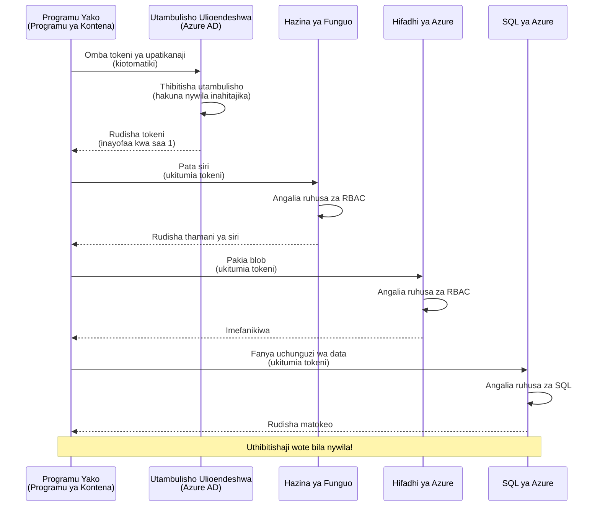
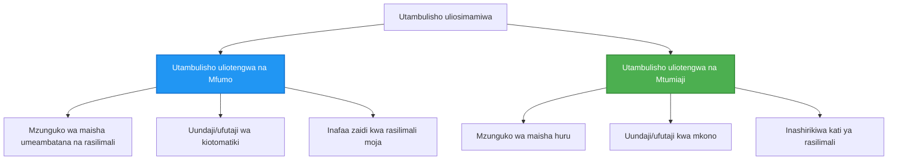

# Mifumo ya Uthibitishaji na Utambulisho Ulioendeshwa

⏱️ **Muda Unaokadirwa**: 45-60 minutes | 💰 **Athari ya Gharama**: Free (no additional charges) | ⭐ **Ugumu**: Intermediate

**📚 Njia ya Kujifunza:**
- ← Previous: [Usimamizi wa Mipangilio](configuration.md) - Kusimamia environment variables na secrets
- 🎯 **Uko Hapa**: Uthibitishaji & Usalama (Managed Identity, Key Vault, mbinu salama)
- → Next: [First Project](first-project.md) - Build your first AZD application
- 🏠 [Course Home](../../README.md)

---

## Unachotajifunza

Kwa kumaliza somo hili, utapata:
- Kuelewa mifumo ya uthibitishaji ya Azure (vifunguo, connection strings, managed identity)
- Kutekeleza **Managed Identity** kwa uthibitishaji bila nywila
- Kuweka siri salama kwa ushirikiano wa **Azure Key Vault**
- Kusanidi **udhibiti wa ufikiaji kwa msingi wa majukumu (RBAC)** kwa utumeaji wa AZD
- Kutumia mbinu bora za usalama katika Container Apps na huduma za Azure
- Kuhamisha kutoka uthibitishaji kwa kutumia funguo hadi uthibitishaji kwa kutumia utambulisho

## Kwa Nini Utambulisho Ulioendeshwa Ni Muhimu

### Tatizo: Uthibitishaji wa Kizamani

**Kabla ya Utambulisho Ulioendeshwa:**
```javascript
// ❌ HATARI YA USALAMA: Siri zilizowekwa moja kwa moja ndani ya msimbo
const connectionString = "Server=mydb.database.windows.net;User=admin;Password=P@ssw0rd123";
const storageKey = "xK7mN9pQ2wR5tY8uI0oP3aS6dF1gH4jK...";
const cosmosKey = "C2x7B9n4M1p8Q5w3E6r0T2y5U8i1O4p7...";
```

**Matatizo:**
- 🔴 **Siri zimetangazwa** kwenye msimbo, faili za usanidi, environment variables
- 🔴 **Mzunguko wa vitambulisho** unahitaji mabadiliko ya msimbo na utangazaji upya
- 🔴 **Kuwaza kwa ukaguzi** - nani alifikia nini, lini?
- 🔴 **Usambazaji** - siri zimeenea kwenye mifumo mingi
- 🔴 **Hatari za ufuataji wa kanuni** - kushindwa katika ukaguzi wa usalama

### Suluhisho: Utambulisho Ulioendeshwa

**Baada ya Utambulisho Ulioendeshwa:**
```javascript
// ✅ SALAMA: Hakuna siri katika msimbo
const credential = new DefaultAzureCredential();
const client = new BlobServiceClient(
  "https://mystorageaccount.blob.core.windows.net",
  credential  // Azure inashughulikia uthibitishaji moja kwa moja
);
```

**Manufaa:**
- ✅ **Hakuna siri** kwenye msimbo au usanidi
- ✅ **Mzunguko wa moja kwa moja** - Azure inashughulikia
- ✅ **Rekodi kamili ya ukaguzi** kwenye kumbukumbu za Azure AD
- ✅ **Usalama uliokusanywa** - simamia kwenye Azure Portal
- ✅ **Tayari kwa ufuataji wa kanuni** - inakidhi viwango vya usalama

**Metafora**: Uthibitishaji wa jadi ni kama kubeba funguo nyingi za kimwili kwa milango tofauti. Utambulisho Ulioendeshwa ni kama kuwa na kadi ya usalama inayoruhusu ufikiaji kiotomatiki kulingana na wewe—hakuna funguo za kupoteza, kunakili, au kuzungusha.

---

## Muhtasari wa Miundombinu

### Mtiririko wa Uthibitishaji na Utambulisho Ulioendeshwa


### Aina za Utambulisho Ulioendeshwa


| Feature | System-Assigned | User-Assigned |
|---------|----------------|---------------|
| **Lifecycle** | Tied to resource | Independent |
| **Creation** | Automatic with resource | Manual creation |
| **Deletion** | Deleted with resource | Persists after resource deletion |
| **Sharing** | One resource only | Multiple resources |
| **Use Case** | Simple scenarios | Complex multi-resource scenarios |
| **AZD Default** | ✅ Recommended | Optional |

---

## Masharti ya Awali

### Vifaa Vinavyohitajika

Unapaswa tayari kuwa umeweka hizi kutoka kwa masomo yaliyopita:

```bash
# Thibitisha Azure Developer CLI
azd version
# ✅ Inatarajiwa: azd toleo 1.0.0 au juu zaidi

# Thibitisha Azure CLI
az --version
# ✅ Inatarajiwa: azure-cli toleo 2.50.0 au juu zaidi
```

### Mahitaji ya Azure

- Active Azure subscription
- Permissions to:
  - Create managed identities
  - Assign RBAC roles
  - Create Key Vault resources
  - Deploy Container Apps

### Maarifa Yanayohitajika

Unapaswa kuwa umemaliza:
- [Installation Guide](installation.md) - AZD setup
- [AZD Basics](azd-basics.md) - Core concepts
- [Configuration Management](configuration.md) - Environment variables

---

## Somo 1: Kuelewa Mifumo ya Uthibitishaji

### Mfano 1: Connection Strings (Legacy - Avoid)

**Jinsi inavyofanya kazi:**
```bash
# Mstari wa muunganisho una vitambulisho
STORAGE_CONNECTION_STRING="DefaultEndpointsProtocol=https;AccountName=myaccount;AccountKey=xK7mN9pQ2wR5..."
COSMOS_CONNECTION_STRING="AccountEndpoint=https://myaccount.documents.azure.com:443/;AccountKey=C2x7..."
SQL_CONNECTION_STRING="Server=myserver.database.windows.net;User=admin;Password=P@ssw0rd..."
```

**Matatizo:**
- ❌ Secrets visible in environment variables
- ❌ Logged in deployment systems
- ❌ Difficult to rotate
- ❌ No audit trail of access

**Wakati wa kutumia:** Kwa maendeleo ya ndani pekee, kamwe sio kwa uzalishaji.

---

### Mfano 2: Key Vault References (Better)

**Jinsi inavyofanya kazi:**
```bicep
// Store secret in Key Vault
resource keyVault 'Microsoft.KeyVault/vaults@2023-02-01' = {
  name: 'mykv'
  properties: {
    enableRbacAuthorization: true
  }
}

// Reference in Container App
env: [
  {
    name: 'STORAGE_KEY'
    secretRef: 'storage-key'  // References Key Vault
  }
]
```

**Manufaa:**
- ✅ Secrets stored securely in Key Vault
- ✅ Centralized secret management
- ✅ Rotation without code changes

**Mipaka:**
- ⚠️ Still using keys/passwords
- ⚠️ Need to manage Key Vault access

**Wakati wa kutumia:** Hatua ya mpito kutoka connection strings kwenda managed identity.

---

### Mfano 3: Managed Identity (Best Practice)

**Jinsi inavyofanya kazi:**
```bicep
// Enable managed identity
resource containerApp 'Microsoft.App/containerApps@2023-05-01' = {
  name: 'myapp'
  identity: {
    type: 'SystemAssigned'  // Automatically creates identity
  }
}

// Grant permissions
resource roleAssignment 'Microsoft.Authorization/roleAssignments@2022-04-01' = {
  scope: storageAccount
  properties: {
    roleDefinitionId: storageBlobDataContributorRole
    principalId: containerApp.identity.principalId
  }
}
```

**Msimbo wa programu:**
```javascript
// Hakuna siri zinazohitajika!
const { DefaultAzureCredential } = require('@azure/identity');
const { BlobServiceClient } = require('@azure/storage-blob');

const credential = new DefaultAzureCredential();
const blobServiceClient = new BlobServiceClient(
  'https://mystorageaccount.blob.core.windows.net',
  credential
);
```

**Manufaa:**
- ✅ Zero secrets in code/config
- ✅ Automatic credential rotation
- ✅ Full audit trail
- ✅ RBAC-based permissions
- ✅ Compliance ready

**Wakati wa kutumia:** Daima, kwa programu za uzalishaji.

---

## Somo 2: Kutekeleza Utambulisho Ulioendeshwa na AZD

### Utekelezaji Hatua kwa Hatua

Tujenge Container App salama inayotumia utambulisho ulioendeshwa kufikia Azure Storage na Key Vault.

### Muundo wa Mradi

```
secure-app/
├── azure.yaml                 # AZD configuration
├── infra/
│   ├── main.bicep            # Main infrastructure
│   ├── core/
│   │   ├── identity.bicep    # Managed identity setup
│   │   ├── keyvault.bicep    # Key Vault configuration
│   │   └── storage.bicep     # Storage with RBAC
│   └── app/
│       └── container-app.bicep
└── src/
    ├── app.js                # Application code
    ├── package.json
    └── Dockerfile
```

### 1. Sanidi AZD (azure.yaml)

```yaml
name: secure-app
metadata:
  template: secure-app@1.0.0

services:
  api:
    project: ./src
    language: js
    host: containerapp

# Enable managed identity (AZD handles this automatically)
```

### 2. Miundombinu: Wezesha Utambulisho Ulioendeshwa

**Faili: `infra/main.bicep`**

```bicep
targetScope = 'subscription'

param environmentName string
param location string = 'eastus'

var tags = { 'azd-env-name': environmentName }

// Resource group
resource rg 'Microsoft.Resources/resourceGroups@2021-04-01' = {
  name: 'rg-${environmentName}'
  location: location
  tags: tags
}

// Storage Account
module storage './core/storage.bicep' = {
  name: 'storage'
  scope: rg
  params: {
    name: 'st${uniqueString(rg.id)}'
    location: location
    tags: tags
  }
}

// Key Vault
module keyVault './core/keyvault.bicep' = {
  name: 'keyvault'
  scope: rg
  params: {
    name: 'kv-${uniqueString(rg.id)}'
    location: location
    tags: tags
  }
}

// Container App with Managed Identity
module containerApp './app/container-app.bicep' = {
  name: 'container-app'
  scope: rg
  params: {
    name: 'ca-${environmentName}'
    location: location
    tags: tags
    storageAccountName: storage.outputs.name
    keyVaultName: keyVault.outputs.name
  }
}

// Grant Container App access to Storage
module storageRoleAssignment './core/role-assignment.bicep' = {
  name: 'storage-role'
  scope: rg
  params: {
    principalId: containerApp.outputs.identityPrincipalId
    roleDefinitionId: 'ba92f5b4-2d11-453d-a403-e96b0029c9fe'  // Storage Blob Data Contributor
    targetResourceId: storage.outputs.id
  }
}

// Grant Container App access to Key Vault
module kvRoleAssignment './core/role-assignment.bicep' = {
  name: 'kv-role'
  scope: rg
  params: {
    principalId: containerApp.outputs.identityPrincipalId
    roleDefinitionId: '4633458b-17de-408a-b874-0445c86b69e6'  // Key Vault Secrets User
    targetResourceId: keyVault.outputs.id
  }
}

// Outputs
output AZURE_STORAGE_ACCOUNT_NAME string = storage.outputs.name
output AZURE_KEY_VAULT_NAME string = keyVault.outputs.name
output APP_URL string = containerApp.outputs.url
```

### 3. Container App yenye Utambulisho Ulioteuliwa na Mfumo

**Faili: `infra/app/container-app.bicep`**

```bicep
param name string
param location string
param tags object = {}
param storageAccountName string
param keyVaultName string

resource containerApp 'Microsoft.App/containerApps@2023-05-01' = {
  name: name
  location: location
  tags: tags
  identity: {
    type: 'SystemAssigned'  // 🔑 Enable managed identity
  }
  properties: {
    configuration: {
      ingress: {
        external: true
        targetPort: 3000
      }
    }
    template: {
      containers: [
        {
          name: 'api'
          image: 'myregistry.azurecr.io/api:latest'
          resources: {
            cpu: json('0.5')
            memory: '1Gi'
          }
          env: [
            {
              name: 'AZURE_STORAGE_ACCOUNT_NAME'
              value: storageAccountName
            }
            {
              name: 'AZURE_KEY_VAULT_NAME'
              value: keyVaultName
            }
            // 🔑 No secrets - managed identity handles authentication!
          ]
        }
      ]
    }
  }
}

// Output the identity for RBAC assignments
output identityPrincipalId string = containerApp.identity.principalId
output id string = containerApp.id
output url string = 'https://${containerApp.properties.configuration.ingress.fqdn}'
```

### 4. Moduli ya Kuteua Majukumu ya RBAC

**Faili: `infra/core/role-assignment.bicep`**

```bicep
param principalId string
param roleDefinitionId string  // Azure built-in role ID
param targetResourceId string

resource roleAssignment 'Microsoft.Authorization/roleAssignments@2022-04-01' = {
  name: guid(principalId, roleDefinitionId, targetResourceId)
  scope: resourceId('Microsoft.Resources/resourceGroups', resourceGroup().name)
  properties: {
    roleDefinitionId: subscriptionResourceId('Microsoft.Authorization/roleDefinitions', roleDefinitionId)
    principalId: principalId
    principalType: 'ServicePrincipal'
  }
}

output id string = roleAssignment.id
```

### 5. Msimbo wa Programu na Utambulisho Ulioendeshwa

**Faili: `src/app.js`**

```javascript
const express = require('express');
const { DefaultAzureCredential } = require('@azure/identity');
const { BlobServiceClient } = require('@azure/storage-blob');
const { SecretClient } = require('@azure/keyvault-secrets');

const app = express();
const PORT = process.env.PORT || 3000;

// 🔑 Anzisha uthibitisho (inafanya kazi kiotomatiki na utambulisho ulioendeshwa)
const credential = new DefaultAzureCredential();

// Usanidi wa Azure Storage
const storageAccountName = process.env.AZURE_STORAGE_ACCOUNT_NAME;
const blobServiceClient = new BlobServiceClient(
  `https://${storageAccountName}.blob.core.windows.net`,
  credential  // Hakuna funguo zinazohitajika!
);

// Usanidi wa Hazina ya Funguo
const keyVaultName = process.env.AZURE_KEY_VAULT_NAME;
const secretClient = new SecretClient(
  `https://${keyVaultName}.vault.azure.net`,
  credential  // Hakuna funguo zinazohitajika!
);

// Ukaguzi wa afya
app.get('/health', (req, res) => {
  res.json({ status: 'healthy', authentication: 'managed-identity' });
});

// Pakia faili kwenye hifadhi ya blob
app.post('/upload', async (req, res) => {
  try {
    const containerClient = blobServiceClient.getContainerClient('uploads');
    await containerClient.createIfNotExists();
    
    const blobName = `file-${Date.now()}.txt`;
    const blockBlobClient = containerClient.getBlockBlobClient(blobName);
    
    await blockBlobClient.upload('Hello from managed identity!', 30);
    
    res.json({
      success: true,
      blobName: blobName,
      message: 'File uploaded using managed identity!'
    });
  } catch (error) {
    console.error('Upload error:', error);
    res.status(500).json({ error: error.message });
  }
});

// Pata siri kutoka Hazina ya Funguo
app.get('/secret/:name', async (req, res) => {
  try {
    const secretName = req.params.name;
    const secret = await secretClient.getSecret(secretName);
    
    res.json({
      name: secretName,
      value: secret.value,
      message: 'Secret retrieved using managed identity!'
    });
  } catch (error) {
    console.error('Secret error:', error);
    res.status(500).json({ error: error.message });
  }
});

// Orodhesha kontena za blob (inaonyesha ufikiaji wa kusoma)
app.get('/containers', async (req, res) => {
  try {
    const containers = [];
    for await (const container of blobServiceClient.listContainers()) {
      containers.push(container.name);
    }
    
    res.json({
      containers: containers,
      count: containers.length,
      message: 'Containers listed using managed identity!'
    });
  } catch (error) {
    console.error('List error:', error);
    res.status(500).json({ error: error.message });
  }
});

app.listen(PORT, () => {
  console.log(`Secure API listening on port ${PORT}`);
  console.log('Authentication: Managed Identity (passwordless)');
});
```

**Faili: `src/package.json`**

```json
{
  "name": "secure-app",
  "version": "1.0.0",
  "dependencies": {
    "express": "^4.18.2",
    "@azure/identity": "^4.0.0",
    "@azure/storage-blob": "^12.17.0",
    "@azure/keyvault-secrets": "^4.7.0"
  },
  "scripts": {
    "start": "node app.js"
  }
}
```

### 6. Tengeneza na Jaribu

```bash
# Anzisha mazingira ya AZD
azd init

# Weka miundombinu na programu
azd up

# Pata URL ya programu
APP_URL=$(azd env get-values | grep APP_URL | cut -d '=' -f2 | tr -d '"')

# Jaribu ukaguzi wa afya
curl $APP_URL/health
```

**✅ Matokeo Yanayotarajiwa:**
```json
{
  "status": "healthy",
  "authentication": "managed-identity"
}
```

**Jaribu kupakia blob:**
```bash
curl -X POST $APP_URL/upload
```

**✅ Matokeo Yanayotarajiwa:**
```json
{
  "success": true,
  "blobName": "file-1700404800000.txt",
  "message": "File uploaded using managed identity!"
}
```

**Jaribu kuorodhesha kontena:**
```bash
curl $APP_URL/containers
```

**✅ Matokeo Yanayotarajiwa:**
```json
{
  "containers": ["uploads"],
  "count": 1,
  "message": "Containers listed using managed identity!"
}
```

---

## Majukumu ya RBAC ya Azure Yanayotumika Mara kwa Mara

### Vitambulisho vya Majukumu Vilivyojengwa kwa Utambulisho Ulioendeshwa

| Service | Role Name | Role ID | Permissions |
|---------|-----------|---------|-------------|
| **Storage** | Storage Blob Data Reader | `2a2b9908-6b94-4a3d-8e5a-a7d8f8cc8a12` | Read blobs and containers |
| **Storage** | Storage Blob Data Contributor | `ba92f5b4-2d11-453d-a403-e96b0029c9fe` | Read, write, delete blobs |
| **Storage** | Storage Queue Data Contributor | `974c5e8b-45b9-4653-ba55-5f855dd0fb88` | Read, write, delete queue messages |
| **Key Vault** | Key Vault Secrets User | `4633458b-17de-408a-b874-0445c86b69e6` | Read secrets |
| **Key Vault** | Key Vault Secrets Officer | `b86a8fe4-44ce-4948-aee5-eccb2c155cd7` | Read, write, delete secrets |
| **Cosmos DB** | Cosmos DB Built-in Data Reader | `00000000-0000-0000-0000-000000000001` | Read Cosmos DB data |
| **Cosmos DB** | Cosmos DB Built-in Data Contributor | `00000000-0000-0000-0000-000000000002` | Read, write Cosmos DB data |
| **SQL Database** | SQL DB Contributor | `9b7fa17d-e63e-47b0-bb0a-15c516ac86ec` | Manage SQL databases |
| **Service Bus** | Azure Service Bus Data Owner | `090c5cfd-751d-490a-894a-3ce6f1109419` | Send, receive, manage messages |

### Jinsi ya Kupata Vitambulisho vya Nafasi

```bash
# Orodhesha majukumu yote yaliyojengwa
az role definition list --query "[].{Name:roleName, ID:name}" --output table

# Tafuta jukumu maalum
az role definition list --query "[?contains(roleName, 'Storage Blob')].{Name:roleName, ID:name}" --output table

# Pata maelezo ya jukumu
az role definition list --name "Storage Blob Data Contributor"
```

---

## Mazoezi ya Vitendo

### Zoef 1: Wezesha Utambulisho Ulioendeshwa kwa App Iliyopo ⭐⭐ (Wastani)

**Lengo**: Ongeza utambulisho ulioendeshwa kwa utangazaji wa Container App uliopo

**Senario**: Una Container App inayotumia connection strings. Ibadili hadi managed identity.

**Mahali pa Kuanza**: Container App yenye usanidi huu:

```bicep
// ❌ Current: Using connection string
env: [
  {
    name: 'STORAGE_CONNECTION_STRING'
    secretRef: 'storage-connection'
  }
]
```

**Hatua**:

1. **Wezesha utambulisho ulioendeshwa katika Bicep:**

```bicep
resource containerApp 'Microsoft.App/containerApps@2023-05-01' = {
  name: 'myapp'
  identity: {
    type: 'SystemAssigned'  // Add this
  }
  // ... rest of configuration
}
```

2. **Toa ufikiaji wa Storage:**

```bicep
// Get storage account reference
resource storageAccount 'Microsoft.Storage/storageAccounts@2023-01-01' existing = {
  name: storageAccountName
}

// Assign role
resource roleAssignment 'Microsoft.Authorization/roleAssignments@2022-04-01' = {
  name: guid(containerApp.id, 'ba92f5b4-2d11-453d-a403-e96b0029c9fe', storageAccount.id)
  scope: storageAccount
  properties: {
    roleDefinitionId: subscriptionResourceId('Microsoft.Authorization/roleDefinitions', 'ba92f5b4-2d11-453d-a403-e96b0029c9fe')
    principalId: containerApp.identity.principalId
    principalType: 'ServicePrincipal'
  }
}
```

3. **Sasisha msimbo wa programu:**

**Kabla (connection string):**
```javascript
const { BlobServiceClient } = require('@azure/storage-blob');

const blobServiceClient = BlobServiceClient.fromConnectionString(
  process.env.STORAGE_CONNECTION_STRING
);
```

**Baada (managed identity):**
```javascript
const { DefaultAzureCredential } = require('@azure/identity');
const { BlobServiceClient } = require('@azure/storage-blob');

const credential = new DefaultAzureCredential();
const blobServiceClient = new BlobServiceClient(
  `https://${process.env.STORAGE_ACCOUNT_NAME}.blob.core.windows.net`,
  credential
);
```

4. **Sasisha environment variables:**

```bicep
env: [
  {
    name: 'STORAGE_ACCOUNT_NAME'
    value: storageAccountName  // Just the name, no secrets!
  }
  // Remove STORAGE_CONNECTION_STRING
]
```

5. **Tangaza na jaribu:**

```bash
# Sambaza tena
azd up

# Jaribu kwamba bado inafanya kazi
curl https://myapp.azurecontainerapps.io/upload
```

**✅ Vigezo vya Mafanikio:**
- ✅ Application deploys without errors
- ✅ Storage operations work (upload, list, download)
- ✅ No connection strings in environment variables
- ✅ Identity visible in Azure Portal under "Identity" blade

**Uthibitisho:**

```bash
# Angalia utambulisho uliosimamiwa umewezeshwa
az containerapp show \
  --name myapp \
  --resource-group rg-myapp \
  --query "identity.type"
# ✅ Inatarajiwa: "SystemAssigned"

# Angalia uteuzi wa jukumu
az role assignment list \
  --assignee $(az containerapp show --name myapp --resource-group rg-myapp --query "identity.principalId" -o tsv) \
  --scope /subscriptions/{sub-id}/resourceGroups/rg-myapp/providers/Microsoft.Storage/storageAccounts/mystorageaccount
# ✅ Inatarajiwa: Inaonyesha jukumu la "Storage Blob Data Contributor"
```

**Muda**: 20-30 minutes

---

### Zoef 2: Ufikiaji wa Huduma Nyingi kwa Utambulisho Ulioteuliwa na Mtumiaji ⭐⭐⭐ (Advanced)

**Lengo**: Unda utambulisho ulioteuliwa na mtumiaji unaoshirikiwa kati ya Container Apps nyingi

**Senario**: Una microservices 3 ambazo zote zinahitaji ufikiaji kwenye akaunti moja ya Storage na Key Vault.

**Hatua**:

1. **Unda utambulisho ulioteuliwa na mtumiaji:**

**Faili: `infra/core/identity.bicep`**

```bicep
param name string
param location string
param tags object = {}

resource userAssignedIdentity 'Microsoft.ManagedIdentity/userAssignedIdentities@2023-01-31' = {
  name: name
  location: location
  tags: tags
}

output id string = userAssignedIdentity.id
output principalId string = userAssignedIdentity.properties.principalId
output clientId string = userAssignedIdentity.properties.clientId
```

2. **Toa majukumu kwa utambulisho ulioteuliwa na mtumiaji:**

```bicep
// In main.bicep
module userIdentity './core/identity.bicep' = {
  name: 'user-identity'
  scope: rg
  params: {
    name: 'id-${environmentName}'
    location: location
    tags: tags
  }
}

// Grant Storage access
resource storageRoleAssignment 'Microsoft.Authorization/roleAssignments@2022-04-01' = {
  name: guid(userIdentity.outputs.principalId, 'storage-contributor')
  scope: storageAccount
  properties: {
    roleDefinitionId: subscriptionResourceId('Microsoft.Authorization/roleDefinitions', 'ba92f5b4-2d11-453d-a403-e96b0029c9fe')
    principalId: userIdentity.outputs.principalId
    principalType: 'ServicePrincipal'
  }
}

// Grant Key Vault access
resource kvRoleAssignment 'Microsoft.Authorization/roleAssignments@2022-04-01' = {
  name: guid(userIdentity.outputs.principalId, 'kv-secrets-user')
  scope: keyVault
  properties: {
    roleDefinitionId: subscriptionResourceId('Microsoft.Authorization/roleDefinitions', '4633458b-17de-408a-b874-0445c86b69e6')
    principalId: userIdentity.outputs.principalId
    principalType: 'ServicePrincipal'
  }
}
```

3. **Teua utambulisho kwa Container Apps nyingi:**

```bicep
resource apiGateway 'Microsoft.App/containerApps@2023-05-01' = {
  name: 'api-gateway'
  identity: {
    type: 'UserAssigned'
    userAssignedIdentities: {
      '${userIdentity.outputs.id}': {}
    }
  }
  // ... rest of config
}

resource productService 'Microsoft.App/containerApps@2023-05-01' = {
  name: 'product-service'
  identity: {
    type: 'UserAssigned'
    userAssignedIdentities: {
      '${userIdentity.outputs.id}': {}
    }
  }
  // ... rest of config
}

resource orderService 'Microsoft.App/containerApps@2023-05-01' = {
  name: 'order-service'
  identity: {
    type: 'UserAssigned'
    userAssignedIdentities: {
      '${userIdentity.outputs.id}': {}
    }
  }
  // ... rest of config
}
```

4. **Msimbo wa programu (huduma zote zinatumia muundo mmoja):**

```javascript
const { DefaultAzureCredential, ManagedIdentityCredential } = require('@azure/identity');

// Kwa kitambulisho kilichoteuliwa na mtumiaji, taja ID ya mteja
const credential = new ManagedIdentityCredential(
  process.env.AZURE_CLIENT_ID  // ID ya mteja ya kitambulisho kilichoteuliwa na mtumiaji
);

// Au tumia DefaultAzureCredential (huigundua kiotomatiki)
const credential = new DefaultAzureCredential();

const blobServiceClient = new BlobServiceClient(
  `https://${process.env.STORAGE_ACCOUNT_NAME}.blob.core.windows.net`,
  credential
);
```

5. **Tangaza na hakiki:**

```bash
azd up

# Jaribu kama huduma zote zinaweza kufikia uhifadhi
curl https://api-gateway.azurecontainerapps.io/upload
curl https://product-service.azurecontainerapps.io/upload
curl https://order-service.azurecontainerapps.io/upload
```

**✅ Vigezo vya Mafanikio:**
- ✅ One identity shared across 3 services
- ✅ All services can access Storage and Key Vault
- ✅ Identity persists if you delete one service
- ✅ Centralized permission management

**Manufaa ya Utambulisho Ulioteuliwa na Mtumiaji:**
- Utambulisho mmoja wa kusimamia
- Ruhusa zinabaki sawa kwa huduma zote
- Inaendelea kuwepo ikiwa unaifuta huduma moja
- Bora kwa miundombinu tata

**Muda**: 30-40 minutes

---

### Zoef 3: Tekeleza Mzunguko wa Siri za Key Vault ⭐⭐⭐ (Advanced)

**Lengo**: Hifadhi funguo za API za wahusika wa tatu katika Key Vault na uzifikie kwa kutumia managed identity

**Senario**: App yako inahitaji kuita API ya nje (OpenAI, Stripe, SendGrid) inayohitaji funguo za API.

**Hatua**:

1. **Unda Key Vault na RBAC:**

**Faili: `infra/core/keyvault.bicep`**

```bicep
param name string
param location string
param tags object = {}

resource keyVault 'Microsoft.KeyVault/vaults@2023-02-01' = {
  name: name
  location: location
  tags: tags
  properties: {
    enableRbacAuthorization: true  // Use RBAC instead of access policies
    sku: {
      family: 'A'
      name: 'standard'
    }
    tenantId: subscription().tenantId
    enableSoftDelete: true
    softDeleteRetentionInDays: 90
  }
}

// Allow Container App to read secrets
output id string = keyVault.id
output name string = keyVault.name
output uri string = keyVault.properties.vaultUri
```

2. **Hifadhi siri katika Key Vault:**

```bash
# Pata jina la Key Vault
KV_NAME=$(azd env get-values | grep AZURE_KEY_VAULT_NAME | cut -d '=' -f2 | tr -d '"')

# Hifadhi funguo za API za pande za tatu
az keyvault secret set \
  --vault-name $KV_NAME \
  --name "OpenAI-ApiKey" \
  --value "sk-proj-xxxxxxxxxxxxx"

az keyvault secret set \
  --vault-name $KV_NAME \
  --name "Stripe-ApiKey" \
  --value "sk_live_xxxxxxxxxxxxx"

az keyvault secret set \
  --vault-name $KV_NAME \
  --name "SendGrid-ApiKey" \
  --value "SG.xxxxxxxxxxxxx"
```

3. **Msimbo wa programu kupata siri:**

**Faili: `src/config.js`**

```javascript
const { DefaultAzureCredential } = require('@azure/identity');
const { SecretClient } = require('@azure/keyvault-secrets');

class Config {
  constructor() {
    this.credential = new DefaultAzureCredential();
    this.secretClient = new SecretClient(
      `https://${process.env.AZURE_KEY_VAULT_NAME}.vault.azure.net`,
      this.credential
    );
    this.cache = {};
  }

  async getSecret(secretName) {
    // Angalia cache kwanza
    if (this.cache[secretName]) {
      return this.cache[secretName];
    }

    try {
      const secret = await this.secretClient.getSecret(secretName);
      this.cache[secretName] = secret.value;
      console.log(`✅ Retrieved secret: ${secretName}`);
      return secret.value;
    } catch (error) {
      console.error(`❌ Failed to get secret ${secretName}:`, error.message);
      throw error;
    }
  }

  async getOpenAIKey() {
    return this.getSecret('OpenAI-ApiKey');
  }

  async getStripeKey() {
    return this.getSecret('Stripe-ApiKey');
  }

  async getSendGridKey() {
    return this.getSecret('SendGrid-ApiKey');
  }
}

module.exports = new Config();
```

4. **Tumia siri kwenye programu:**

**Faili: `src/app.js`**

```javascript
const express = require('express');
const config = require('./config');
const { OpenAI } = require('openai');

const app = express();

// Anzisha OpenAI kwa ufunguo kutoka Key Vault
let openaiClient;

async function initializeServices() {
  const openaiKey = await config.getOpenAIKey();
  openaiClient = new OpenAI({ apiKey: openaiKey });
  console.log('✅ Services initialized with secrets from Key Vault');
}

// Iite wakati wa kuanza
initializeServices().catch(console.error);

app.post('/chat', async (req, res) => {
  try {
    const completion = await openaiClient.chat.completions.create({
      model: 'gpt-4.1',
      messages: [{ role: 'user', content: 'Hello!' }]
    });
    
    res.json({
      response: completion.choices[0].message.content,
      authentication: 'Key from Key Vault via Managed Identity'
    });
  } catch (error) {
    res.status(500).json({ error: error.message });
  }
});

app.listen(3000, () => {
  console.log('Secure API with Key Vault integration running');
});
```

5. **Tangaza na jaribu:**

```bash
azd up

# Thibitisha kwamba funguo za API zinafanya kazi
curl -X POST https://myapp.azurecontainerapps.io/chat \
  -H "Content-Type: application/json" \
  -d '{"message":"Hello AI"}'
```

**✅ Vigezo vya Mafanikio:**
- ✅ No API keys in code or environment variables
- ✅ Application retrieves keys from Key Vault
- ✅ Third-party APIs work correctly
- ✅ Can rotate keys without code changes

**Zungusha siri:**

```bash
# Sasisha siri katika Key Vault
az keyvault secret set \
  --vault-name $KV_NAME \
  --name "OpenAI-ApiKey" \
  --value "sk-proj-NEW_KEY_HERE"

# Washa upya programu ili ipokee ufunguo mpya
az containerapp revision restart \
  --name myapp \
  --resource-group rg-myapp
```

**Muda**: 25-35 minutes

---

## Kituo cha Kuangalia Maarifa

### 1. Mifumo ya Uthibitishaji ✓

Jaribu uelewa wako:

- [ ] **Q1**: Ni mifumo gani mitatu mkuu ya uthibitishaji? 
  - **A**: Connection strings (legacy), Key Vault references (transition), Managed Identity (best)

- [ ] **Q2**: Kwa nini utambulisho ulioendeshwa ni bora kuliko connection strings?
  - **A**: No secrets in code, automatic rotation, full audit trail, RBAC permissions

- [ ] **Q3**: Utatumia utambulisho ulioteuliwa na mtumiaji badala ya ule ulioteuliwa na mfumo lini?
  - **A**: Wakati wa kushiriki utambulisho kati ya rasilimali nyingi au wakati maisha ya utambulisho hayategemei maisha ya rasilimali

**Hands-On Verification:**
```bash
# Angalia ni aina gani ya utambulisho ambayo programu yako inaitumia
az containerapp show \
  --name myapp \
  --resource-group rg-myapp \
  --query "identity.type"

# Orodhesha uteuzi wote wa jukumu kwa utambulisho
az role assignment list \
  --assignee $(az containerapp show --name myapp --resource-group rg-myapp --query "identity.principalId" -o tsv)
```

---

### 2. RBAC na Ruhusa ✓

Jaribu uelewa wako:

- [ ] **Q1**: Ni ID gani ya nafasi kwa "Storage Blob Data Contributor"?
  - **A**: `ba92f5b4-2d11-453d-a403-e96b0029c9fe`

- [ ] **Q2**: Ruhusa gani zinapewa na "Key Vault Secrets User"?
  - **A**: Read-only access to secrets (cannot create, update, or delete)

- [ ] **Q3**: Unamruhusu Container App kupata Azure SQL vipi?
  - **A**: Assign "SQL DB Contributor" role or configure Azure AD authentication for SQL

**Hands-On Verification:**
```bash
# Tafuta jukumu maalum
az role definition list --name "Storage Blob Data Contributor"

# Angalia majukumu yaliyowekwa kwa utambulisho wako
PRINCIPAL_ID=$(az containerapp show --name myapp --resource-group rg-myapp --query "identity.principalId" -o tsv)
az role assignment list --assignee $PRINCIPAL_ID --output table
```

---

### 3. Uingiliano wa Key Vault ✓
- [ ] **Q1**: Je, unaleta vipi RBAC kwa Key Vault badala ya sera za ufikiaji?
  - **A**: Weka `enableRbacAuthorization: true` katika Bicep

- [ ] **Q2**: Ni maktaba gani ya Azure SDK inayoshughulikia uthibitishaji wa managed identity?
  - **A**: `@azure/identity` na darasa `DefaultAzureCredential`

- [ ] **Q3**: Siri za Key Vault huendelea kwenye kache kwa muda gani?
  - **A**: Inategemea programu; tekeleza mkakati wako wa kuweka kache

**Hands-On Verification:**
```bash
# Jaribio la ufikiaji wa Key Vault
az keyvault secret show \
  --vault-name $KV_NAME \
  --name "OpenAI-ApiKey" \
  --query "value"

# Angalia RBAC imewezeshwa
az keyvault show \
  --name $KV_NAME \
  --query "properties.enableRbacAuthorization"
# ✅ Inatarajiwa: kweli
```

---

## Mbinu Bora za Usalama

### ✅ FANYA:

1. **Tumia kimutambulisho kilichosimamiwa kila wakati katika uzalishaji**
   ```bicep
   identity: {
     type: 'SystemAssigned'
   }
   ```

2. **Tumia nafasi za RBAC zenye ruhusa ndogo kabisa**
   - Tumia "Reader" roles inapowezekana
   - Epuka "Owner" au "Contributor" isipokuwa inahitajika

3. **Hifadhi funguo za wahusika wa tatu katika Key Vault**
   ```javascript
   const apiKey = await secretClient.getSecret('ThirdPartyApiKey');
   ```

4. **Washa uandishi wa ukaguzi**
   ```bicep
   diagnosticSettings: {
     logs: [{ category: 'AuditEvent', enabled: true }]
   }
   ```

5. **Tumia vitambulisho tofauti kwa dev/staging/uzalishaji**
   ```bash
   azd env new dev
   azd env new staging
   azd env new prod
   ```

6. **Badilisha siri mara kwa mara**
   - Weka tarehe za kumalizika kwa siri za Key Vault
   - Fanya mzunguko kiotomatiki kwa kutumia Azure Functions

### ❌ USIFANYE:

1. **Usiweka siri moja kwa moja ndani ya msimbo**
   ```javascript
   // ❌ MBAYA
   const apiKey = "sk-proj-xxxxxxxxxxxxx";
   ```

2. **Usitumie connection strings katika uzalishaji**
   ```javascript
   // ❌ MBAYA
   BlobServiceClient.fromConnectionString(process.env.STORAGE_CONNECTION_STRING)
   ```

3. **Usitoe ruhusa nyingi kupita kiasi**
   ```bicep
   // ❌ BAD - too much access
   roleDefinitionId: 'Owner'
   
   // ✅ GOOD - least privilege
   roleDefinitionId: 'Storage Blob Data Reader'
   ```

4. **Usirekodi siri**
   ```javascript
   // ❌ MBAYA
   console.log('API Key:', apiKey);
   
   // ✅ NZURI
   console.log('API Key retrieved successfully');
   ```

5. **Usishirikishe vitambulisho vya uzalishaji kati ya mazingira**
   ```bicep
   // ❌ BAD - same identity for dev and prod
   // ✅ GOOD - separate identities per environment
   ```

---

## Mwongozo wa Utatuzi wa Matatizo

### Tatizo: "Unauthorized" wakati wa kufikia Azure Storage

**Dalili:**
```
Error: Unauthorized (403)
AuthorizationPermissionMismatch: This request is not authorized to perform this operation
```

**Uchambuzi:**

```bash
# Angalia ikiwa utambulisho uliosimamiwa umewezeshwa
az containerapp show \
  --name myapp \
  --resource-group rg-myapp \
  --query "identity.type"
# ✅ Inatarajiwa: "SystemAssigned" au "UserAssigned"

# Angalia uteuzi wa majukumu
PRINCIPAL_ID=$(az containerapp show --name myapp --resource-group rg-myapp --query "identity.principalId" -o tsv)
az role assignment list --assignee $PRINCIPAL_ID

# Inatarajiwa: Unapaswa kuona "Storage Blob Data Contributor" au jukumu linalofanana
```

**Suluhisho:**

1. **Toa jukumu sahihi la RBAC:**
```bash
STORAGE_ID=$(az storage account show --name mystorageaccount --resource-group rg-myapp --query "id" -o tsv)
az role assignment create \
  --assignee $PRINCIPAL_ID \
  --role "Storage Blob Data Contributor" \
  --scope $STORAGE_ID
```

2. **Subiri kusambazwa (inaweza kuchukua dakika 5-10):**
```bash
# Angalia hali ya ugawaji wa jukumu
az role assignment list --assignee $PRINCIPAL_ID --scope $STORAGE_ID
```

3. **Thibitisha msimbo wa programu unatumia vitambulisho sahihi:**
```javascript
// Hakikisha unatumia DefaultAzureCredential
const credential = new DefaultAzureCredential();
```

---

### Tatizo: Ufikiaji wa Key Vault umekataliwa

**Dalili:**
```
Error: Forbidden (403)
The user, group or application does not have secrets get permission
```

**Uchambuzi:**

```bash
# Angalia kama RBAC ya Key Vault imewezeshwa
az keyvault show \
  --name $KV_NAME \
  --query "properties.enableRbacAuthorization"
# ✅ Inatarajiwa: kweli

# Angalia ugawaji wa majukumu
az role assignment list \
  --assignee $PRINCIPAL_ID \
  --scope /subscriptions/{sub-id}/resourceGroups/rg-myapp/providers/Microsoft.KeyVault/vaults/$KV_NAME
```

**Suluhisho:**

1. **Wezesha RBAC kwenye Key Vault:**
```bash
az keyvault update \
  --name $KV_NAME \
  --enable-rbac-authorization true
```

2. **Toa jukumu la Key Vault Secrets User:**
```bash
KV_ID=$(az keyvault show --name $KV_NAME --query "id" -o tsv)
az role assignment create \
  --assignee $PRINCIPAL_ID \
  --role "Key Vault Secrets User" \
  --scope $KV_ID
```

---

### Tatizo: DefaultAzureCredential inashindwa kwa mazingira ya ndani

**Dalili:**
```
Error: DefaultAzureCredential failed to retrieve a token
CredentialUnavailableError: No credential available
```

**Uchambuzi:**

```bash
# Angalia kama umeingia
az account show

# Angalia uthibitishaji wa Azure CLI
az ad signed-in-user show
```

**Suluhisho:**

1. **Ingia kwenye Azure CLI:**
```bash
az login
```

2. **Weka subscription ya Azure:**
```bash
az account set --subscription "Your Subscription Name"
```

3. **Kwa ukuzaji wa ndani, tumia variable za mazingira:**
```bash
export AZURE_TENANT_ID="your-tenant-id"
export AZURE_CLIENT_ID="your-client-id"
export AZURE_CLIENT_SECRET="your-client-secret"
```

4. **Au tumia vitambulisho tofauti wakati wa maendeleo ya ndani:**
```javascript
const { DefaultAzureCredential, AzureCliCredential } = require('@azure/identity');

// Tumia AzureCliCredential kwa maendeleo ya ndani
const credential = process.env.NODE_ENV === 'production' 
  ? new DefaultAzureCredential()
  : new AzureCliCredential();
```

---

### Tatizo: Uteuzi wa jukumu unachukua muda mrefu kusambaa

**Dalili:**
- Jukumu limeteuliwa kwa mafanikio
- Bado unapata makosa ya 403
- Ufikiaji wa mara kwa mara (wakati mwingine hufanya kazi, wakati mwingine haufanyi)

**Maelezo:**
Azure RBAC changes can take 5-10 minutes to propagate globally.

**Suluhisho:**

```bash
# Subiri na jaribu tena
echo "Waiting for RBAC propagation..."
sleep 300  # Subiri dakika 5

# Jaribu upatikanaji
curl https://myapp.azurecontainerapps.io/upload

# Ikiwa bado inashindwa, anzisha upya programu
az containerapp revision restart \
  --name myapp \
  --resource-group rg-myapp
```

---

## Mambo ya Kuzingatia kwa Gharama

### Gharama za Managed Identity

| Rasilimali | Gharama |
|----------|------|
| **Managed Identity** | 🆓 **BURE** - Hakuna malipo |
| **RBAC Role Assignments** | 🆓 **BURE** - Hakuna malipo |
| **Azure AD Token Requests** | 🆓 **BURE** - Imejumuishwa |
| **Key Vault Operations** | $0.03 kwa 10,000 operesheni |
| **Key Vault Storage** | $0.024 kwa siri kwa mwezi |

**Managed identity inaokoa pesa kwa:**
- ✅ Kuondoa operesheni za Key Vault kwa uthibitisho kati ya huduma
- ✅ Kupunguza matukio ya usalama (hakuna vitambulisho vilivyovuja)
- ✅ Kupunguza mzigo wa kiutendaji (hakuna mzunguko wa mikono)

**Mfano wa Ulinganisho wa Gharama (kwa mwezi):**

| Senario | Connection Strings | Managed Identity | Akiba |
|----------|-------------------|-----------------|---------|
| Programu ndogo (maombi 1M) | ~$50 (Key Vault + operesheni) | ~$0 | $50/mwezi |
| Programu ya kati (maombi 10M) | ~$200 | ~$0 | $200/mwezi |
| Programu kubwa (maombi 100M) | ~$1,500 | ~$0 | $1,500/mwezi |

---

## Jifunze Zaidi

### Nyaraka Rasmi
- [Kimutambulisho cha Azure](https://learn.microsoft.com/entra/identity/managed-identities-azure-resources/overview)
- [RBAC ya Azure](https://learn.microsoft.com/azure/role-based-access-control/overview)
- [Azure Key Vault](https://learn.microsoft.com/azure/key-vault/general/overview)
- [DefaultAzureCredential](https://learn.microsoft.com/dotnet/api/azure.identity.defaultazurecredential)

### Nyaraka za SDK
- [@azure/identity (Node.js)](https://www.npmjs.com/package/@azure/identity)
- [Azure.Identity (C#)](https://www.nuget.org/packages/Azure.Identity/)
- [azure-identity (Python)](https://pypi.org/project/azure-identity/)

### Hatua Zifuatazo katika Kozi Hii
- ← Iliyopita: [Usimamizi wa Mipangilio](configuration.md)
- → Ifuatayo: [Mradi wa Kwanza](first-project.md)
- 🏠 [Nyumbani kwa Kozi](../../README.md)

### Mifano Inayohusiana
- [Mfano wa Mazungumzo wa Microsoft Foundry Models](../../../../examples/azure-openai-chat) - Inatumia managed identity kwa Microsoft Foundry Models
- [Mfano wa Microservices](../../../../examples/microservices) - Mifumo ya uthibitishaji ya huduma nyingi

---

## Muhtasari

**Umejifunza:**
- ✅ Aina tatu za uthibitishaji (connection strings, Key Vault, managed identity)
- ✅ Jinsi ya kuwezesha na kusanidi managed identity katika AZD
- ✅ Uteuzi wa majukumu ya RBAC kwa huduma za Azure
- ✅ Uingizaji wa Key Vault kwa siri za wahusika wa tatu
- ✅ Vitambulisho vinavyoteuliwa na mtumiaji dhidi ya vilivyoteuliwa na mfumo
- ✅ Mbinu bora za usalama na utatuzi wa matatizo

**Vidokezo Muhimu:**
1. **Tumia kimutambulisho kilichosimamiwa kila wakati katika uzalishaji** - Hakuna siri, mzunguko wa moja kwa moja
2. **Tumia nafasi za RBAC zenye ruhusa ndogo kabisa** - Toa ruhusa muhimu tu
3. **Hifadhi funguo za wahusika wa tatu katika Key Vault** - Usimamizi wa siri uliojumuishwa
4. **Tambanisha vitambulisho kwa kila mazingira** - Kutengwa kwa Dev, staging, prod
5. **Washa uandishi wa ukaguzi** - Fuata nani alifikia nini

**Hatua Zifuatazo:**
1. Kamilisha mazoezi ya vitendo hapo juu
2. Hamisha programu iliyopo kutoka connection strings kwenda managed identity
3. Jenga mradi wako wa kwanza wa AZD ukiwa na usalama tangu siku ya kwanza: [Mradi wa Kwanza](first-project.md)

---

<!-- CO-OP TRANSLATOR DISCLAIMER START -->
**Tamko la kutokuwajibika**:
Nyaraka hii imetafsiriwa kwa kutumia huduma ya utafsiri ya AI [Co-op Translator](https://github.com/Azure/co-op-translator). Wakati tunajitahidi kuhakikisha usahihi, tafadhali fahamu kwamba tafsiri za kiotomatiki zinaweza kuwa na makosa au ukosefu wa usahihi. Nyaraka ya awali kwa lugha yake ya asili inapaswa kuchukuliwa kama chanzo chenye mamlaka. Kwa habari muhimu, inapendekezwa tafsiri ya kitaalamu ya binadamu. Hatuwajibiki kwa kutokuelewana au tafsiri zisizofaa zinazotokana na matumizi ya tafsiri hii.
<!-- CO-OP TRANSLATOR DISCLAIMER END -->