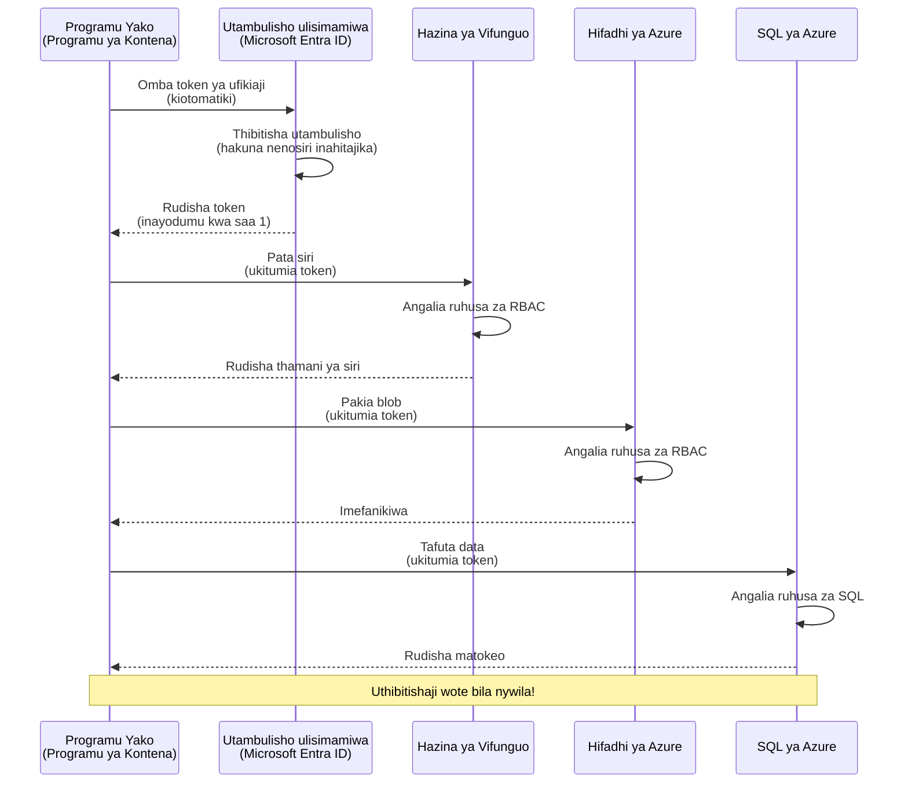
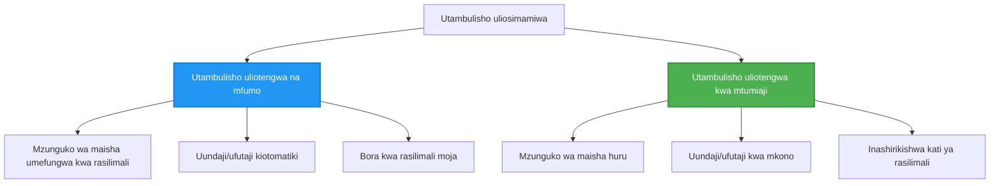

# Mifumo ya Uthibitishaji na Utambulisho Usimamizi

⏱️ **Wakati Unaokadiriwa**: 45-60 minutes | 💰 **Athari ya Gharama**: Free (no additional charges) | ⭐ **Ugumu**: Intermediate

**📚 Njia ya Kujifunza:**
- ← Iliyopita: [Usimamizi wa Mipangilio](configuration.md) - Kusimamia vigezo vya mazingira na siri
- 🎯 **Uko Hapa**: Authentication & Security (Utambulisho Usimamizi, Key Vault, secure patterns)
- → Ifuatayo: [Mradi wa Kwanza](first-project.md) - Build your first AZD application
- 🏠 [Nyumbani wa Kozi](../../README.md)

---

## Utakachojifunza

Kwa kumaliza somo hili, utajua:
- Kuelewa Azure authentication patterns (keys, connection strings, managed identity)
- Tekeleza **Utambulisho Usimamizi** kwa uthibitishaji usiotumia nywila
- Linda siri kwa kuunganisha na **Azure Key Vault**
- Sanidi **role-based access control (RBAC)** kwa uenezaji wa AZD
- Tekeleza mbinu bora za usalama katika Container Apps na Azure services
- Hamisha kutoka uthibitishaji unaotumia funguo kwenda uthibitishaji unaotegemea utambulisho

## Kwa Nini Utambulisho Usimamizi Ni Muhimu

### Tatizo: Uthibitishaji wa Kawaida

**Kabla ya Utambulisho Usimamizi:**
```javascript
// ❌ HATARI KWA USALAMA: Siri zilizowekwa moja kwa moja katika msimbo
const connectionString = "Server=mydb.database.windows.net;User=admin;Password=P@ssw0rd123";
const storageKey = "xK7mN9pQ2wR5tY8uI0oP3aS6dF1gH4jK...";
const cosmosKey = "C2x7B9n4M1p8Q5w3E6r0T2y5U8i1O4p7...";
```

**Matatizo:**
- 🔴 **Siri zilizo wazi** katika msimbo, mafaili ya usanidi, vigezo vya mazingira
- 🔴 **Mzunguko wa cheti** unahitaji mabadiliko ya msimbo na uenezaji upya
- 🔴 **Matatizo ya ukaguzi** - nani alifikia nini, lini?
- 🔴 **Kusambaa** - siri zimesambazwa katika mifumo mingi
- 🔴 **Hatari za uzingatiaji** - fails security audits

### Suluhisho: Utambulisho Usimamizi

**Baada ya Utambulisho Usimamizi:**
```javascript
// ✅ SALAMA: Hakuna siri katika msimbo
const credential = new DefaultAzureCredential();
const client = new BlobServiceClient(
  "https://mystorageaccount.blob.core.windows.net",
  credential  // Azure inashughulikia uthibitishaji kiotomatiki
);
```

**Manufaa:**
- ✅ **Hakuna siri** katika msimbo au usanidi
- ✅ **Mzunguko wa moja kwa moja** - Azure inashughulikia
- ✅ **Njia kamili ya ukaguzi** katika Microsoft Entra ID logs
- ✅ **Usalama uliowezeshwa katikati** - manage in Azure Portal
- ✅ **Tayari kwa uzingatiaji** - meets security standards

**Analogy**: Traditional authentication is like carrying multiple physical keys for different doors. Managed Identity is like having a security badge that automatically grants access based on who you are—no keys to lose, copy, or rotate.

---

## Muhtasari wa Miundo

### Mtiririko wa Uthibitishaji kwa Utambulisho Usimamizi



### Aina za Utambulisho Usimamizi



| Sifa | Imepewa Mfumo | Imepewa Mtumiaji |
|---------|----------------|---------------|
| **Mzunguko wa Maisha** | Imeunganishwa na rasilimali | Huru |
| **Uumbaji** | Moja kwa moja na rasilimali | Uumbaji wa mkono |
| **Uondolewa** | Huondolewa pamoja na rasilimali | Inaendelea hata baada ya rasilimali kuondolewa |
| **Kushiriki** | Rasilimali moja tu | Rasilimali nyingi |
| **Matumizi** | Matukio rahisi | Matukio tata ya rasilimali nyingi |
| **AZD Default** | ✅ Inayopendekezwa | Hiari |

---

## Mahitaji ya Awali

### Vifaa Vinavyohitajika

Unapaswa kuwa umevisanidi hivi kutoka masomo yaliopita:

```bash
# Hakikisha Azure Developer CLI
azd version
# ✅ Inatarajiwa: azd toleo 1.0.0 au zaidi

# Hakikisha Azure CLI
az --version
# ✅ Inatarajiwa: azure-cli 2.50.0 au zaidi
```

### Mahitaji ya Azure

- Active Azure subscription
- Permissions to:
  - Kuunda vitambulisho vinavyosimamiwa
  - Kuteua majukumu ya RBAC
  - Kuunda Key Vault resources
  - Deploy Container Apps

### Maarifa Yanayohitajika

Unapaswa kuwa umemaliza:
- [Mwongozo wa Usakinishaji](installation.md) - AZD setup
- [Misingi ya AZD](azd-basics.md) - Core concepts
- [Usimamizi wa Mipangilio](configuration.md) - Environment variables

---

## Somo 1: Kuelewa Mifumo ya Uthibitishaji

### Mfumo 1: Connection Strings (Legacy - Avoid)

**Inavyofanya kazi:**
```bash
# Mstari wa muunganisho una taarifa za uthibitisho
STORAGE_CONNECTION_STRING="DefaultEndpointsProtocol=https;AccountName=myaccount;AccountKey=xK7mN9pQ2wR5..."
COSMOS_CONNECTION_STRING="AccountEndpoint=https://myaccount.documents.azure.com:443/;AccountKey=C2x7..."
SQL_CONNECTION_STRING="Server=myserver.database.windows.net;User=admin;Password=P@ssw0rd..."
```

**Matatizo:**
- ❌ Siri zinazoonekana katika vigezo vya mazingira
- ❌ Zimeandikwa kwenye mifumo ya uenezaji
- ❌ Gumu kuzungusha
- ❌ Hakuna njia ya ukaguzi ya upatikanaji

**Wakati wa kutumia:** Kwa maendeleo ya ndani tu, kamwe si kwa uzalishaji.

---

### Mfumo 2: Marejeleo ya Key Vault (Bora)

**Inavyofanya kazi:**
```bicep
// Store secret in Key Vault
resource keyVault 'Microsoft.KeyVault/vaults@2023-02-01' = {
  name: 'mykv'
  properties: {
    enableRbacAuthorization: true
  }
}

// Reference in Container App
env: [
  {
    name: 'STORAGE_KEY'
    secretRef: 'storage-key'  // References Key Vault
  }
]
```

**Manufaa:**
- ✅ Siri zinahifadhiwa kwa usalama ndani ya Key Vault
- ✅ Usimamizi wa siri uliowekwa katikati
- ✅ Mzunguko bila mabadiliko ya msimbo

**Vikwazo:**
- ⚠️ Bado inatumia funguo/nywila
- ⚠️ Inahitaji kusimamia upatikanaji wa Key Vault

**Wakati wa kutumia:** Hatua ya mpito kutoka connection strings kwenda utambulisho usimamizi.

---

### Mfumo 3: Utambulisho Usimamizi (Mbinu Bora)

**Inavyofanya kazi:**
```bicep
// Enable managed identity
resource containerApp 'Microsoft.App/containerApps@2023-05-01' = {
  name: 'myapp'
  identity: {
    type: 'SystemAssigned'  // Automatically creates identity
  }
}

// Grant permissions
resource roleAssignment 'Microsoft.Authorization/roleAssignments@2022-04-01' = {
  scope: storageAccount
  properties: {
    roleDefinitionId: storageBlobDataContributorRole
    principalId: containerApp.identity.principalId
  }
}
```

**Msimbo wa programu:**
```javascript
// Hakuna siri zinazohitajika!
const { DefaultAzureCredential } = require('@azure/identity');
const { BlobServiceClient } = require('@azure/storage-blob');

const credential = new DefaultAzureCredential();
const blobServiceClient = new BlobServiceClient(
  'https://mystorageaccount.blob.core.windows.net',
  credential
);
```

**Manufaa:**
- ✅ Hakuna siri katika msimbo/usanidi
- ✅ Mzunguko wa nyaraka za uthibitisho kiotomatiki
- ✅ Njia kamili ya ukaguzi
- ✅ Ruhusa za msingi wa RBAC
- ✅ Tayari kwa uzingatiaji

**Wakati wa kutumia:** Kila wakati, kwa programu za uzalishaji.

---

### Mfumo 4: Service Principals (CI/CD & Automation)

Utambulisho usimamizi ni kiwango cha dhahabu *kwa rasilimali zinazofanya kazi ndani ya Azure*. Lakini vipi kwa vitu vinavyofanya kazi **nje ya** Azure—kama pipeline ya CI/CD kwenye wakala wa kujenga, au script kwenye laptop yako ambayo haiwezi kutumia uingizaji wako wa mwingiliano? Hapo ndipo **service principal** inapoingia: utambulisho usio wa mtu wenye nyaraka zake za uthibitisho ambazo mchakato otomatiki unaweza kuingia nazo.

**Inavyofanya kazi:**

Create a service principal scoped to a resource group (least privilege):

```bash
az ad sp create-for-rbac \
  --name "myapp-cicd" \
  --role contributor \
  --scopes /subscriptions/<sub-id>/resourceGroups/<rg-name>
```

This prints a client ID, client secret, and tenant ID. azd can sign in with them non-interactively:

```bash
azd auth login \
  --client-id "<appId>" \
  --client-secret "<password>" \
  --tenant-id "<tenant>"
```

**Prefer federated credentials (OIDC) over secrets.** Instead of a long-lived client secret, configure a federated credential so the pipeline exchanges a short-lived token—no secret to leak or rotate:

```bash
azd auth login \
  --client-id "<appId>" \
  --federated-credential-provider "github" \
  --tenant-id "<tenant>"
```

> `azd pipeline config` inakupa muundo huu kiotomatiki. Angalia mwongozo wa CI/CD katika [Sura ya 8](../chapter-08-production/production-ai-practices.md).

**Manufaa:**
- ✅ Inafanya kazi nje ya Azure (build agents, on-prem, other clouds)
- ✅ Inaweza kufanywa ipatikane kwa kundi la rasilimali moja kwa jukumu moja
- ✅ Tofauti ya federated (OIDC) haitumii siri iliyohifadhiwa

**Mapungufu:**
- ⚠️ Tofauti inayotegemea siri inahitaji uhifadhi wa tahadhari na mzunguko
- ⚠️ Siri iliyovuja inampa mamlaka yale yote SP inaweza kufanya—fanya upeo uwe mdogo

**Wakati wa kutumia:** Pipeline za CI/CD na uotomatishaji ambazo haziwezi kutumia utambulisho usimamizi. Pendelea kila wakati toleo la **federated/OIDC** juu ya client secret, na pendelea utambulisho usimamizi wakati wowote mzigo wa kazi unapoendesha ndani ya Azure.

**Kuhifadhi nyaraka za uthibitisho kwa usalama:**
- Usimweke siri kamwe kwenye repo—tumia duka la siri la pipeline yako (GitHub Actions secrets, Azure DevOps variable groups / Key Vault).
- Fanya SP iwe na upeo wa jukumu na kundi la rasilimali ndogo kabisa inahitaji.
- Weka muda wa kumalizika na zungusha, au toa kabisa siri kwa kutumia OIDC.

---

## Somo 2: Kutekeleza Utambulisho Usimamizi na AZD

### Utekelezaji Hatua kwa Hatua

Tujenge Container App salama inayotumia utambulisho usimamizi kupata Azure Storage na Key Vault.

### Muundo wa Mradi

```
secure-app/
├── azure.yaml                 # AZD configuration
├── infra/
│   ├── main.bicep            # Main infrastructure
│   ├── core/
│   │   ├── identity.bicep    # Managed identity setup
│   │   ├── keyvault.bicep    # Key Vault configuration
│   │   └── storage.bicep     # Storage with RBAC
│   └── app/
│       └── container-app.bicep
└── src/
    ├── app.js                # Application code
    ├── package.json
    └── Dockerfile
```

### 1. Sanidi AZD (azure.yaml)

```yaml
name: secure-app
metadata:
  template: secure-app@1.0.0

services:
  api:
    project: ./src
    language: js
    host: containerapp

# Enable managed identity (AZD handles this automatically)
```

### 2. Miundombinu: Washa Utambulisho Usimamizi

**Faili: `infra/main.bicep`**

```bicep
targetScope = 'subscription'

param environmentName string
param location string = 'eastus'

var tags = { 'azd-env-name': environmentName }

// Resource group
resource rg 'Microsoft.Resources/resourceGroups@2021-04-01' = {
  name: 'rg-${environmentName}'
  location: location
  tags: tags
}

// Storage Account
module storage './core/storage.bicep' = {
  name: 'storage'
  scope: rg
  params: {
    name: 'st${uniqueString(rg.id)}'
    location: location
    tags: tags
  }
}

// Key Vault
module keyVault './core/keyvault.bicep' = {
  name: 'keyvault'
  scope: rg
  params: {
    name: 'kv-${uniqueString(rg.id)}'
    location: location
    tags: tags
  }
}

// Container App with Managed Identity
module containerApp './app/container-app.bicep' = {
  name: 'container-app'
  scope: rg
  params: {
    name: 'ca-${environmentName}'
    location: location
    tags: tags
    storageAccountName: storage.outputs.name
    keyVaultName: keyVault.outputs.name
  }
}

// Grant Container App access to Storage
module storageRoleAssignment './core/role-assignment.bicep' = {
  name: 'storage-role'
  scope: rg
  params: {
    principalId: containerApp.outputs.identityPrincipalId
    roleDefinitionId: 'ba92f5b4-2d11-453d-a403-e96b0029c9fe'  // Storage Blob Data Contributor
    targetResourceId: storage.outputs.id
  }
}

// Grant Container App access to Key Vault
module kvRoleAssignment './core/role-assignment.bicep' = {
  name: 'kv-role'
  scope: rg
  params: {
    principalId: containerApp.outputs.identityPrincipalId
    roleDefinitionId: '4633458b-17de-408a-b874-0445c86b69e6'  // Key Vault Secrets User
    targetResourceId: keyVault.outputs.id
  }
}

// Outputs
output AZURE_STORAGE_ACCOUNT_NAME string = storage.outputs.name
output AZURE_KEY_VAULT_NAME string = keyVault.outputs.name
output APP_URL string = containerApp.outputs.url
```

### 3. Container App yenye Utambulisho uliotengwa na Mfumo

**Faili: `infra/app/container-app.bicep`**

```bicep
param name string
param location string
param tags object = {}
param storageAccountName string
param keyVaultName string

resource containerApp 'Microsoft.App/containerApps@2023-05-01' = {
  name: name
  location: location
  tags: tags
  identity: {
    type: 'SystemAssigned'  // 🔑 Enable managed identity
  }
  properties: {
    configuration: {
      ingress: {
        external: true
        targetPort: 3000
      }
    }
    template: {
      containers: [
        {
          name: 'api'
          image: 'myregistry.azurecr.io/api:latest'
          resources: {
            cpu: json('0.5')
            memory: '1Gi'
          }
          env: [
            {
              name: 'AZURE_STORAGE_ACCOUNT_NAME'
              value: storageAccountName
            }
            {
              name: 'AZURE_KEY_VAULT_NAME'
              value: keyVaultName
            }
            // 🔑 No secrets - managed identity handles authentication!
          ]
        }
      ]
    }
  }
}

// Output the identity for RBAC assignments
output identityPrincipalId string = containerApp.identity.principalId
output id string = containerApp.id
output url string = 'https://${containerApp.properties.configuration.ingress.fqdn}'
```

### 4. Moduli ya Kuteua Majukumu ya RBAC

**Faili: `infra/core/role-assignment.bicep`**

```bicep
param principalId string
param roleDefinitionId string  // Azure built-in role ID
param targetResourceId string

resource roleAssignment 'Microsoft.Authorization/roleAssignments@2022-04-01' = {
  name: guid(principalId, roleDefinitionId, targetResourceId)
  scope: resourceId('Microsoft.Resources/resourceGroups', resourceGroup().name)
  properties: {
    roleDefinitionId: subscriptionResourceId('Microsoft.Authorization/roleDefinitions', roleDefinitionId)
    principalId: principalId
    principalType: 'ServicePrincipal'
  }
}

output id string = roleAssignment.id
```

### 5. Msimbo wa Programu kwa Utambulisho Usimamizi

**Faili: `src/app.js`**

```javascript
const express = require('express');
const { DefaultAzureCredential } = require('@azure/identity');
const { BlobServiceClient } = require('@azure/storage-blob');
const { SecretClient } = require('@azure/keyvault-secrets');

const app = express();
const PORT = process.env.PORT || 3000;

// 🔑 Anzisha uthibitisho (inafanya kazi kiotomatiki na utambulisho uliosimamiwa)
const credential = new DefaultAzureCredential();

// Usanidi wa Azure Storage
const storageAccountName = process.env.AZURE_STORAGE_ACCOUNT_NAME;
const blobServiceClient = new BlobServiceClient(
  `https://${storageAccountName}.blob.core.windows.net`,
  credential  // Hakuna funguo zinahitajika!
);

// Usanidi wa Key Vault
const keyVaultName = process.env.AZURE_KEY_VAULT_NAME;
const secretClient = new SecretClient(
  `https://${keyVaultName}.vault.azure.net`,
  credential  // Hakuna funguo zinahitajika!
);

// Ukaguzi wa afya
app.get('/health', (req, res) => {
  res.json({ status: 'healthy', authentication: 'managed-identity' });
});

// Pakia faili kwenye hifadhi ya blob
app.post('/upload', async (req, res) => {
  try {
    const containerClient = blobServiceClient.getContainerClient('uploads');
    await containerClient.createIfNotExists();
    
    const blobName = `file-${Date.now()}.txt`;
    const blockBlobClient = containerClient.getBlockBlobClient(blobName);
    
    await blockBlobClient.upload('Hello from managed identity!', 30);
    
    res.json({
      success: true,
      blobName: blobName,
      message: 'File uploaded using managed identity!'
    });
  } catch (error) {
    console.error('Upload error:', error);
    res.status(500).json({ error: error.message });
  }
});

// Pata siri kutoka Key Vault
app.get('/secret/:name', async (req, res) => {
  try {
    const secretName = req.params.name;
    const secret = await secretClient.getSecret(secretName);
    
    res.json({
      name: secretName,
      value: secret.value,
      message: 'Secret retrieved using managed identity!'
    });
  } catch (error) {
    console.error('Secret error:', error);
    res.status(500).json({ error: error.message });
  }
});

// Orodhesha vyombo vya blob (inaonyesha ufikivu wa kusoma)
app.get('/containers', async (req, res) => {
  try {
    const containers = [];
    for await (const container of blobServiceClient.listContainers()) {
      containers.push(container.name);
    }
    
    res.json({
      containers: containers,
      count: containers.length,
      message: 'Containers listed using managed identity!'
    });
  } catch (error) {
    console.error('List error:', error);
    res.status(500).json({ error: error.message });
  }
});

app.listen(PORT, () => {
  console.log(`Secure API listening on port ${PORT}`);
  console.log('Authentication: Managed Identity (passwordless)');
});
```

**Faili: `src/package.json`**

```json
{
  "name": "secure-app",
  "version": "1.0.0",
  "dependencies": {
    "express": "^4.18.2",
    "@azure/identity": "^4.0.0",
    "@azure/storage-blob": "^12.17.0",
    "@azure/keyvault-secrets": "^4.7.0"
  },
  "scripts": {
    "start": "node app.js"
  }
}
```

### 6. Sambaza na Jaribu

```bash
# Anzisha mazingira ya AZD
azd init

# Weka miundombinu na programu
azd up

# Pata URL ya programu
APP_URL=$(azd env get-values | grep APP_URL | cut -d '=' -f2 | tr -d '"')

# Jaribu ukaguzi wa afya
curl $APP_URL/health
```

**✅ Matokeo yanayotarajiwa:**
```json
{
  "status": "healthy",
  "authentication": "managed-identity"
}
```

**Jaribu kupakia blob:**
```bash
curl -X POST $APP_URL/upload
```

**✅ Matokeo yanayotarajiwa:**
```json
{
  "success": true,
  "blobName": "file-1700404800000.txt",
  "message": "File uploaded using managed identity!"
}
```

**Jaribu orodha ya container:**
```bash
curl $APP_URL/containers
```

**✅ Matokeo yanayotarajiwa:**
```json
{
  "containers": ["uploads"],
  "count": 1,
  "message": "Containers listed using managed identity!"
}
```

---

## Majukumu ya Kawaida ya Azure RBAC

### Vitambulisho vya Majukumu Vilivyojengwa kwa Utambulisho Usimamizi

| Huduma | Jina la Jukumu | Role ID | Ruhusa |
|---------|-----------|---------|-------------|
| **Storage** | Storage Blob Data Reader | `2a2b9908-6b94-4a3d-8e5a-a7d8f8cc8a12` | Soma blobs na containers |
| **Storage** | Storage Blob Data Contributor | `ba92f5b4-2d11-453d-a403-e96b0029c9fe` | Soma, andika, futa blobs |
| **Storage** | Storage Queue Data Contributor | `974c5e8b-45b9-4653-ba55-5f855dd0fb88` | Soma, andika, futa ujumbe za queue |
| **Key Vault** | Key Vault Secrets User | `4633458b-17de-408a-b874-0445c86b69e6` | Soma siri |
| **Key Vault** | Key Vault Secrets Officer | `b86a8fe4-44ce-4948-aee5-eccb2c155cd7` | Soma, andika, futa siri |
| **Cosmos DB** | Cosmos DB Built-in Data Reader | `00000000-0000-0000-0000-000000000001` | Soma data za Cosmos DB |
| **Cosmos DB** | Cosmos DB Built-in Data Contributor | `00000000-0000-0000-0000-000000000002` | Soma, andika data za Cosmos DB |
| **SQL Database** | SQL DB Contributor | `9b7fa17d-e63e-47b0-bb0a-15c516ac86ec` | Dhibiti database za SQL |
| **Service Bus** | Azure Service Bus Data Owner | `090c5cfd-751d-490a-894a-3ce6f1109419` | Tuma, pokea, simamia ujumbe |

### Jinsi ya Kupata Vitambulisho vya Majukumu

```bash
# Orodhesha majukumu yote yaliyojengwa
az role definition list --query "[].{Name:roleName, ID:name}" --output table

# Tafuta jukumu maalum
az role definition list --query "[?contains(roleName, 'Storage Blob')].{Name:roleName, ID:name}" --output table

# Pata maelezo ya jukumu
az role definition list --name "Storage Blob Data Contributor"
```

---

## Mazoezi ya Vitendo

### Mazoezi 1: Enable Managed Identity for Existing App ⭐⭐ (Medium)

**Lengo**: Add managed identity to an existing Container App deployment

**Hali**: You have a Container App using connection strings. Convert it to managed identity.

**Mwanzo**: Container App with this configuration:

```bicep
// ❌ Current: Using connection string
env: [
  {
    name: 'STORAGE_CONNECTION_STRING'
    secretRef: 'storage-connection'
  }
]
```

**Hatua**:

1. **Washa utambulisho usimamizi katika Bicep:**

```bicep
resource containerApp 'Microsoft.App/containerApps@2023-05-01' = {
  name: 'myapp'
  identity: {
    type: 'SystemAssigned'  // Add this
  }
  // ... rest of configuration
}
```

2. **Toa upatikanaji wa Storage:**

```bicep
// Get storage account reference
resource storageAccount 'Microsoft.Storage/storageAccounts@2023-01-01' existing = {
  name: storageAccountName
}

// Assign role
resource roleAssignment 'Microsoft.Authorization/roleAssignments@2022-04-01' = {
  name: guid(containerApp.id, 'ba92f5b4-2d11-453d-a403-e96b0029c9fe', storageAccount.id)
  scope: storageAccount
  properties: {
    roleDefinitionId: subscriptionResourceId('Microsoft.Authorization/roleDefinitions', 'ba92f5b4-2d11-453d-a403-e96b0029c9fe')
    principalId: containerApp.identity.principalId
    principalType: 'ServicePrincipal'
  }
}
```

3. **Sasisha msimbo wa programu:**

**Kabla (connection string):**
```javascript
const { BlobServiceClient } = require('@azure/storage-blob');

const blobServiceClient = BlobServiceClient.fromConnectionString(
  process.env.STORAGE_CONNECTION_STRING
);
```

**Baada (utambulisho usimamizi):**
```javascript
const { DefaultAzureCredential } = require('@azure/identity');
const { BlobServiceClient } = require('@azure/storage-blob');

const credential = new DefaultAzureCredential();
const blobServiceClient = new BlobServiceClient(
  `https://${process.env.STORAGE_ACCOUNT_NAME}.blob.core.windows.net`,
  credential
);
```

4. **Sasisha vigezo vya mazingira:**

```bicep
env: [
  {
    name: 'STORAGE_ACCOUNT_NAME'
    value: storageAccountName  // Just the name, no secrets!
  }
  // Remove STORAGE_CONNECTION_STRING
]
```

5. **Sambaza na jaribu:**

```bash
# Zindua upya
azd up

# Thibitisha kwamba bado inafanya kazi
curl https://myapp.azurecontainerapps.io/upload
```

**✅ Vigezo vya Mafanikio:**
- ✅ Programu inasambazwa bila makosa
- ✅ Operesheni za Storage zinafanya kazi (upload, list, download)
- ✅ Hakuna connection strings katika vigezo vya mazingira
- ✅ Utambulisho unaonekana katika Azure Portal under "Identity" blade

**Uthibitisho:**

```bash
# Hakikisha utambulisho uliosimamiwa umewezeshwa
az containerapp show \
  --name myapp \
  --resource-group rg-myapp \
  --query "identity.type"
# ✅ Inatarajiwa: "SystemAssigned"

# Angalia ugawaji wa jukumu
az role assignment list \
  --assignee $(az containerapp show --name myapp --resource-group rg-myapp --query "identity.principalId" -o tsv) \
  --scope /subscriptions/{sub-id}/resourceGroups/rg-myapp/providers/Microsoft.Storage/storageAccounts/mystorageaccount
# ✅ Inatarajiwa: Inaonyesha jukumu la "Storage Blob Data Contributor"
```

**Muda**: 20-30 minutes

---

### Mazoezi 2: Multi-Service Access with User-Assigned Identity ⭐⭐⭐ (Advanced)

**Lengo**: Create a user-assigned identity shared across multiple Container Apps

**Hali**: You have 3 microservices that all need access to the same Storage account and Key Vault.

**Hatua**:

1. **Create user-assigned identity:**

**Faili: `infra/core/identity.bicep`**

```bicep
param name string
param location string
param tags object = {}

resource userAssignedIdentity 'Microsoft.ManagedIdentity/userAssignedIdentities@2023-01-31' = {
  name: name
  location: location
  tags: tags
}

output id string = userAssignedIdentity.id
output principalId string = userAssignedIdentity.properties.principalId
output clientId string = userAssignedIdentity.properties.clientId
```

2. **Assign roles to user-assigned identity:**

```bicep
// In main.bicep
module userIdentity './core/identity.bicep' = {
  name: 'user-identity'
  scope: rg
  params: {
    name: 'id-${environmentName}'
    location: location
    tags: tags
  }
}

// Grant Storage access
resource storageRoleAssignment 'Microsoft.Authorization/roleAssignments@2022-04-01' = {
  name: guid(userIdentity.outputs.principalId, 'storage-contributor')
  scope: storageAccount
  properties: {
    roleDefinitionId: subscriptionResourceId('Microsoft.Authorization/roleDefinitions', 'ba92f5b4-2d11-453d-a403-e96b0029c9fe')
    principalId: userIdentity.outputs.principalId
    principalType: 'ServicePrincipal'
  }
}

// Grant Key Vault access
resource kvRoleAssignment 'Microsoft.Authorization/roleAssignments@2022-04-01' = {
  name: guid(userIdentity.outputs.principalId, 'kv-secrets-user')
  scope: keyVault
  properties: {
    roleDefinitionId: subscriptionResourceId('Microsoft.Authorization/roleDefinitions', '4633458b-17de-408a-b874-0445c86b69e6')
    principalId: userIdentity.outputs.principalId
    principalType: 'ServicePrincipal'
  }
}
```

3. **Assign identity to multiple Container Apps:**

```bicep
resource apiGateway 'Microsoft.App/containerApps@2023-05-01' = {
  name: 'api-gateway'
  identity: {
    type: 'UserAssigned'
    userAssignedIdentities: {
      '${userIdentity.outputs.id}': {}
    }
  }
  // ... rest of config
}

resource productService 'Microsoft.App/containerApps@2023-05-01' = {
  name: 'product-service'
  identity: {
    type: 'UserAssigned'
    userAssignedIdentities: {
      '${userIdentity.outputs.id}': {}
    }
  }
  // ... rest of config
}

resource orderService 'Microsoft.App/containerApps@2023-05-01' = {
  name: 'order-service'
  identity: {
    type: 'UserAssigned'
    userAssignedIdentities: {
      '${userIdentity.outputs.id}': {}
    }
  }
  // ... rest of config
}
```

4. **Application code (all services use same pattern):**

```javascript
const { DefaultAzureCredential, ManagedIdentityCredential } = require('@azure/identity');

// Kwa utambulisho uliokabidhiwa kwa mtumiaji, taja kitambulisho cha mteja
const credential = new ManagedIdentityCredential(
  process.env.AZURE_CLIENT_ID  // Kitambulisho cha mteja cha utambulisho uliokabidhiwa kwa mtumiaji
);

// Au tumia DefaultAzureCredential (hutambua kiotomatiki)
const credential = new DefaultAzureCredential();

const blobServiceClient = new BlobServiceClient(
  `https://${process.env.STORAGE_ACCOUNT_NAME}.blob.core.windows.net`,
  credential
);
```

5. **Deploy and verify:**

```bash
azd up

# Thibitisha kwamba huduma zote zinaweza kufikia uhifadhi
curl https://api-gateway.azurecontainerapps.io/upload
curl https://product-service.azurecontainerapps.io/upload
curl https://order-service.azurecontainerapps.io/upload
```

**✅ Vigezo vya Mafanikio:**
- ✅ Utambulisho mmoja unashirikiwa kati ya huduma 3
- ✅ Huduma zote zinaweza kufikia Storage na Key Vault
- ✅ Utambulisho unaendelea hata ukifuta huduma moja
- ✅ Usimamizi wa ruhusa uliowekwa kati

**Manufaa ya Utambulisho Umepewa Mtumiaji:**
- Single identity to manage
- Consistent permissions across services
- Persists if you delete one service
- Better for complex architectures

**Muda**: 30-40 minutes

---

### Mazoezi 3: Implement Key Vault Secret Rotation ⭐⭐⭐ (Advanced)

**Lengo**: Store third-party API keys in Key Vault and access them using managed identity

**Hali**: Your app needs to call an external API (OpenAI, Stripe, SendGrid) that requires API keys.

**Hatua**:

1. **Create Key Vault with RBAC:**

**Faili: `infra/core/keyvault.bicep`**

```bicep
param name string
param location string
param tags object = {}

resource keyVault 'Microsoft.KeyVault/vaults@2023-02-01' = {
  name: name
  location: location
  tags: tags
  properties: {
    enableRbacAuthorization: true  // Use RBAC instead of access policies
    sku: {
      family: 'A'
      name: 'standard'
    }
    tenantId: subscription().tenantId
    enableSoftDelete: true
    softDeleteRetentionInDays: 90
  }
}

// Allow Container App to read secrets
output id string = keyVault.id
output name string = keyVault.name
output uri string = keyVault.properties.vaultUri
```

2. **Store secrets in Key Vault:**

```bash
# Pata jina la Key Vault
KV_NAME=$(azd env get-values | grep AZURE_KEY_VAULT_NAME | cut -d '=' -f2 | tr -d '"')

# Hifadhi funguo za API za pande za tatu
az keyvault secret set \
  --vault-name $KV_NAME \
  --name "OpenAI-ApiKey" \
  --value "sk-proj-xxxxxxxxxxxxx"

az keyvault secret set \
  --vault-name $KV_NAME \
  --name "Stripe-ApiKey" \
  --value "sk_live_xxxxxxxxxxxxx"

az keyvault secret set \
  --vault-name $KV_NAME \
  --name "SendGrid-ApiKey" \
  --value "SG.xxxxxxxxxxxxx"
```

3. **Application code to retrieve secrets:**

**Faili: `src/config.js`**

```javascript
const { DefaultAzureCredential } = require('@azure/identity');
const { SecretClient } = require('@azure/keyvault-secrets');

class Config {
  constructor() {
    this.credential = new DefaultAzureCredential();
    this.secretClient = new SecretClient(
      `https://${process.env.AZURE_KEY_VAULT_NAME}.vault.azure.net`,
      this.credential
    );
    this.cache = {};
  }

  async getSecret(secretName) {
    // Angalia cache kwanza
    if (this.cache[secretName]) {
      return this.cache[secretName];
    }

    try {
      const secret = await this.secretClient.getSecret(secretName);
      this.cache[secretName] = secret.value;
      console.log(`✅ Retrieved secret: ${secretName}`);
      return secret.value;
    } catch (error) {
      console.error(`❌ Failed to get secret ${secretName}:`, error.message);
      throw error;
    }
  }

  async getOpenAIKey() {
    return this.getSecret('OpenAI-ApiKey');
  }

  async getStripeKey() {
    return this.getSecret('Stripe-ApiKey');
  }

  async getSendGridKey() {
    return this.getSecret('SendGrid-ApiKey');
  }
}

module.exports = new Config();
```

4. **Use secrets in application:**

**Faili: `src/app.js`**

```javascript
const express = require('express');
const config = require('./config');
const { OpenAI } = require('openai');

const app = express();

// Anzisha OpenAI kwa kutumia funguo kutoka Hazina ya Funguo
let openaiClient;

async function initializeServices() {
  const openaiKey = await config.getOpenAIKey();
  openaiClient = new OpenAI({ apiKey: openaiKey });
  console.log('✅ Services initialized with secrets from Key Vault');
}

// Iite wakati wa kuanzisha
initializeServices().catch(console.error);

app.post('/chat', async (req, res) => {
  try {
    const completion = await openaiClient.chat.completions.create({
      model: 'gpt-4.1',
      messages: [{ role: 'user', content: 'Hello!' }]
    });
    
    res.json({
      response: completion.choices[0].message.content,
      authentication: 'Key from Key Vault via Managed Identity'
    });
  } catch (error) {
    res.status(500).json({ error: error.message });
  }
});

app.listen(3000, () => {
  console.log('Secure API with Key Vault integration running');
});
```

5. **Deploy and test:**

```bash
azd up

# Jaribu kwamba funguo za API zinafanya kazi
curl -X POST https://myapp.azurecontainerapps.io/chat \
  -H "Content-Type: application/json" \
  -d '{"message":"Hello AI"}'
```

**✅ Vigezo vya Mafanikio:**
- ✅ Hakuna funguo za API kwenye msimbo au vigezo vya mazingira
- ✅ Programu inapata funguo kutoka Key Vault
- ✅ API za wahusika wa tatu zinafanya kazi kwa usahihi
- ✅ Inaweza kuzungusha funguo bila mabadiliko ya msimbo

**Zungusha siri:**

```bash
# Sasisha siri katika Key Vault
az keyvault secret set \
  --vault-name $KV_NAME \
  --name "OpenAI-ApiKey" \
  --value "sk-proj-NEW_KEY_HERE"

# Washa upya programu ili ipate ufunguo mpya
az containerapp revision restart \
  --name myapp \
  --resource-group rg-myapp
```

**Muda**: 25-35 dakika

---

## Sehemu ya Kujifunza

### 1. Mifumo ya Uthibitishaji ✓

Jaribu uelewa wako:

- [ ] **Q1**: Je, ni mifumo gani mitatu kuu ya uthibitishaji? 
  - **J**: Mizeso ya muunganisho (connection strings) (ya kale), Marejeleo ya Key Vault (yanayobadilika), Utambulisho ulioendeshwa (managed identity) (bora)

- [ ] **Q2**: Kwa nini utambulisho ulioendeshwa ni bora kuliko mizeso ya muunganisho?
  - **J**: Hakuna siri kwenye msimbo, mzunguko wa funguo unaofanyika kwa njia otomatiki, rekodi kamili ya ufuatiliaji (audit trail), ruhusa za RBAC

- [ ] **Q3**: Ungekutumia lini utambulisho uliowekwa kwa mtumiaji (user-assigned) badala ya uliowekwa kwa mfumo (system-assigned)?
  - **J**: Unapotaka kushiriki utambulisho kati ya rasilimali nyingi au wakati maisha ya utambulisho ni tofauti na maisha ya rasilimali

**Uthibitisho wa Vitendo:**
```bash
# Angalia ni aina gani ya utambulisho programu yako inaitumia
az containerapp show \
  --name myapp \
  --resource-group rg-myapp \
  --query "identity.type"

# Orodhesha uteuzi wote wa majukumu kwa utambulisho
az role assignment list \
  --assignee $(az containerapp show --name myapp --resource-group rg-myapp --query "identity.principalId" -o tsv)
```

---

### 2. RBAC na Ruhusa ✓

Jaribu uelewa wako:

- [ ] **Q1**: Ni ID gani ya jukumu kwa "Storage Blob Data Contributor"?
  - **J**: `ba92f5b4-2d11-453d-a403-e96b0029c9fe`

- [ ] **Q2**: "Key Vault Secrets User" inatoa ruhusa gani?
  - **J**: Ufikiaji wa kusoma tu kwa siri (hainwezi kuunda, kusasisha, au kufuta)

- [ ] **Q3**: Unampa vipi Container App ufikiaji kwa Azure SQL?
  - **J**: Tambulisha jukumu la "SQL DB Contributor" au sanidi uthibitishaji wa Microsoft Entra ID kwa SQL

**Uthibitisho wa Vitendo:**
```bash
# Tafuta jukumu maalum
az role definition list --name "Storage Blob Data Contributor"

# Angalia ni majukumu gani yamewekwa kwa utambulisho wako
PRINCIPAL_ID=$(az containerapp show --name myapp --resource-group rg-myapp --query "identity.principalId" -o tsv)
az role assignment list --assignee $PRINCIPAL_ID --output table
```

---

### 3. Uunganisho wa Key Vault ✓

Jaribu uelewa wako:

- [ ] **Q1**: Unawezaje kuwezesha RBAC kwa Key Vault badala ya sera za ufikiaji?
  - **J**: Weka `enableRbacAuthorization: true` katika Bicep

- [ ] **Q2**: Ni maktaba gani ya Azure SDK inayoshughulikia uthibitishaji wa utambulisho ulioendeshwa?
  - **J**: `@azure/identity` na darasa `DefaultAzureCredential`

- [ ] **Q3**: Siri za Key Vault zinabaki kwa muda gani kwenye cache?
  - **J**: Inategemea programu; tekeleza mkakati wako wa caching

**Uthibitisho wa Vitendo:**
```bash
# Jaribu ufikiaji wa Key Vault
az keyvault secret show \
  --vault-name $KV_NAME \
  --name "OpenAI-ApiKey" \
  --query "value"

# Angalia RBAC imewezeshwa
az keyvault show \
  --name $KV_NAME \
  --query "properties.enableRbacAuthorization"
# ✅ Inatarajiwa: kweli
```

---

## Mambo Bora ya Usalama

### ✅ FANYA:

1. **Daima tumia utambulisho ulioendeshwa katika uzalishaji**
   ```bicep
   identity: {
     type: 'SystemAssigned'
   }
   ```

2. **Tumia majukumu ya RBAC ya udhibiti mdogo**
   - Tumia majukumu ya "Reader" inapowezekana
   - Epuka "Owner" au "Contributor" isipokuwa inahitajika

3. **Hifadhi funguo za wahusika wa tatu katika Key Vault**
   ```javascript
   const apiKey = await secretClient.getSecret('ThirdPartyApiKey');
   ```

4. **Zimezesha ufuatiliaji wa ukaguzi (audit logging)**
   ```bicep
   diagnosticSettings: {
     logs: [{ category: 'AuditEvent', enabled: true }]
   }
   ```

5. **Tumia utambulisho tofauti kwa dev/staging/prod**
   ```bash
   azd env new dev
   azd env new staging
   azd env new prod
   ```

6. **Zungusha siri mara kwa mara**
   - Weka tarehe za kumalizika (expiration) kwenye siri za Key Vault
   - Tengeneza mzunguko otomatiki kwa Azure Functions

### ❌ USIFANYE:

1. **Kamwe usiweke siri moja kwa moja kwenye msimbo**
   ```javascript
   // ❌ MBAYA
   const apiKey = "sk-proj-xxxxxxxxxxxxx";
   ```

2. **Usitumie mizeso ya muunganisho katika uzalishaji**
   ```javascript
   // ❌ MBAYA
   BlobServiceClient.fromConnectionString(process.env.STORAGE_CONNECTION_STRING)
   ```

3. **Usitoe ruhusa nyingi kupita kiasi**
   ```bicep
   // ❌ BAD - too much access
   roleDefinitionId: 'Owner'
   
   // ✅ GOOD - least privilege
   roleDefinitionId: 'Storage Blob Data Reader'
   ```

4. **Usilog siri**
   ```javascript
   // ❌ MBAYA
   console.log('API Key:', apiKey);
   
   // ✅ NZURI
   console.log('API Key retrieved successfully');
   ```

5. **Usishiriki utambulisho wa uzalishaji kati ya mazingira**
   ```bicep
   // ❌ BAD - same identity for dev and prod
   // ✅ GOOD - separate identities per environment
   ```

---

## Mwongozo wa Utatuzi wa Matatizo

### Tatizo: "Unauthorized" wakati wa kufikia Azure Storage

**Dalili:**
```
Error: Unauthorized (403)
AuthorizationPermissionMismatch: This request is not authorized to perform this operation
```

**Uchunguzi:**

```bash
# Angalia ikiwa utambulisho uliosimamiwa umewezeshwa
az containerapp show \
  --name myapp \
  --resource-group rg-myapp \
  --query "identity.type"
# ✅ Inatarajiwa: "SystemAssigned" au "UserAssigned"

# Angalia uteuzi wa majukumu
PRINCIPAL_ID=$(az containerapp show --name myapp --resource-group rg-myapp --query "identity.principalId" -o tsv)
az role assignment list --assignee $PRINCIPAL_ID

# Inatarajiwa: Unapaswa kuona "Storage Blob Data Contributor" au jukumu linalofanana
```

**Suluhisho:**

1. **Toa jukumu sahihi la RBAC:**
```bash
STORAGE_ID=$(az storage account show --name mystorageaccount --resource-group rg-myapp --query "id" -o tsv)
az role assignment create \
  --assignee $PRINCIPAL_ID \
  --role "Storage Blob Data Contributor" \
  --scope $STORAGE_ID
```

2. **Subiri usambazaji (inaweza kuchukua dakika 5-10):**
```bash
# Angalia hali ya ugawaji wa jukumu
az role assignment list --assignee $PRINCIPAL_ID --scope $STORAGE_ID
```

3. **Thibitisha msimbo wa programu unatumia cheti sahihi:**
```javascript
// Hakikisha unatumia DefaultAzureCredential
const credential = new DefaultAzureCredential();
```

---

### Tatizo: Kufikiwa kwa Key Vault kumezwekwa

**Dalili:**
```
Error: Forbidden (403)
The user, group or application does not have secrets get permission
```

**Uchunguzi:**

```bash
# Angalia RBAC ya Key Vault imewezeshwa
az keyvault show \
  --name $KV_NAME \
  --query "properties.enableRbacAuthorization"
# ✅ Inatarajiwa: kweli

# Angalia ugawaji wa majukumu
az role assignment list \
  --assignee $PRINCIPAL_ID \
  --scope /subscriptions/{sub-id}/resourceGroups/rg-myapp/providers/Microsoft.KeyVault/vaults/$KV_NAME
```

**Suluhisho:**

1. **Wezesha RBAC kwenye Key Vault:**
```bash
az keyvault update \
  --name $KV_NAME \
  --enable-rbac-authorization true
```

2. **Toa jukumu la Key Vault Secrets User:**
```bash
KV_ID=$(az keyvault show --name $KV_NAME --query "id" -o tsv)
az role assignment create \
  --assignee $PRINCIPAL_ID \
  --role "Key Vault Secrets User" \
  --scope $KV_ID
```

---

### Tatizo: DefaultAzureCredential inashindwa ndani ya localhost

**Dalili:**
```
Error: DefaultAzureCredential failed to retrieve a token
CredentialUnavailableError: No credential available
```

**Uchunguzi:**

```bash
# Angalia kama umeingia
az account show

# Angalia uthibitisho wa Azure CLI
az ad signed-in-user show
```

**Suluhisho:**

1. **Ingia kwenye Azure CLI:**
```bash
az login
```

2. **Weka usajili wa Azure (subscription):**
```bash
az account set --subscription "Your Subscription Name"
```

3. **Kwa maendeleo ya ndani, tumia vigezo vya mazingira:**
```bash
export AZURE_TENANT_ID="your-tenant-id"
export AZURE_CLIENT_ID="your-client-id"
export AZURE_CLIENT_SECRET="your-client-secret"
```

4. **Au tumia cheti tofauti ndani ya localhost:**
```javascript
const { DefaultAzureCredential, AzureCliCredential } = require('@azure/identity');

// Tumia AzureCliCredential kwa maendeleo ya ndani
const credential = process.env.NODE_ENV === 'production' 
  ? new DefaultAzureCredential()
  : new AzureCliCredential();
```

---

### Tatizo: Uteuzi wa jukumu unachukua muda mrefu kupitishwa

**Dalili:**
- Jukumu limetolewa kwa mafanikio
- Bado unapokea makosa ya 403
- Ufikiaji wauffuatuaji (wakati mwingine hufanya kazi, wakati mwingine hapana)

**Maelezo:**
Mabadiliko ya Azure RBAC yanaweza kuchukua dakika 5-10 kusambazwa duniani kote.

**Suluhisho:**

```bash
# Subiri na jaribu tena
echo "Waiting for RBAC propagation..."
sleep 300  # Subiri dakika 5

# Jaribu ufikiaji
curl https://myapp.azurecontainerapps.io/upload

# Ikiwa bado inashindwa, anzisha upya programu
az containerapp revision restart \
  --name myapp \
  --resource-group rg-myapp
```

---

## Mambo ya Gharama

### Gharama za Utambulisho Uliodhibitiwa (Managed Identity)

| Resource | Cost |
|----------|------|
| **Managed Identity** | 🆓 **BURE** - Hakuna ada |
| **RBAC Role Assignments** | 🆓 **BURE** - Hakuna ada |
| **Microsoft Entra ID Token Requests** | 🆓 **BURE** - Imejumuishwa |
| **Key Vault Operations** | $0.03 per 10,000 operations |
| **Key Vault Storage** | $0.024 per secret per month |

**Utambulisho ulioendeshwa unahifadhi pesa kwa:**
- ✅ Kuondoa shughuli za Key Vault kwa uthibitishaji kati ya huduma
- ✅ Kupunguza matukio ya usalama (hakuna funguo zilizovuja)
- ✅ Kupunguza mzigo wa uendeshaji (hakuna mzunguko wa mikono)

**Mfano wa Mlinganisho wa Gharama (kila mwezi):**

| Scenario | Connection Strings | Managed Identity | Savings |
|----------|-------------------|-----------------|---------|
| Small app (1M requests) | ~$50 (Key Vault + ops) | ~$0 | $50/month |
| Medium app (10M requests) | ~$200 | ~$0 | $200/month |
| Large app (100M requests) | ~$1,500 | ~$0 | $1,500/month |

---

## Jifunze Zaidi

### Nyaraka Rasmi
- [Azure Managed Identity](https://learn.microsoft.com/entra/identity/managed-identities-azure-resources/overview)
- [Azure RBAC](https://learn.microsoft.com/azure/role-based-access-control/overview)
- [Azure Key Vault](https://learn.microsoft.com/azure/key-vault/general/overview)
- [DefaultAzureCredential](https://learn.microsoft.com/dotnet/api/azure.identity.defaultazurecredential)

### Nyaraka za SDK
- [@azure/identity (Node.js)](https://www.npmjs.com/package/@azure/identity)
- [Azure.Identity (C#)](https://www.nuget.org/packages/Azure.Identity/)
- [azure-identity (Python)](https://pypi.org/project/azure-identity/)

### Hatua Zifuatazo katika Kozi Hii
- ← Iliyopita: [Configuration Management](configuration.md)
- → Ifuatayo: [First Project](first-project.md)
- 🏠 [Nyumbani ya Kozi](../../README.md)

### Mifano Inayohusiana
- [Microsoft Foundry Models Chat Example](../../../../examples/azure-openai-chat) - Inatumia utambulisho ulioendeshwa kwa Microsoft Foundry Models
- [Microservices Example](../../../../examples/microservices) - Mifumo ya uthibitishaji kwa huduma nyingi

---

## Muhtasari

**Umejifunza:**
- ✅ Mifumo mitatu ya uthibitishaji (connection strings, Key Vault, utambulisho ulioendeshwa)
- ✅ Jinsi ya kuwezesha na kusanidi utambulisho ulioendeshwa katika AZD
- ✅ Uteuzi wa majukumu ya RBAC kwa huduma za Azure
- ✅ Uunganisho wa Key Vault kwa siri za wahusika wa tatu
- ✅ Utambulisho uliowekwa kwa mtumiaji dhidi ya ule wa mfumo
- ✅ Mambo bora ya usalama na utatuzi wa matatizo

**Mambo Muhimu ya Kumbuka:**
1. **Daima tumia utambulisho ulioendeshwa katika uzalishaji** - Hakuna siri, mzunguko wa otomatiki
2. **Tumia majukumu ya RBAC ya udhibiti mdogo** - Toa ruhusa zinazohitajika tu
3. **Hifadhi funguo za wahusika wa tatu katika Key Vault** - Usimamizi wa siri uliojelezwa
4. **Tambatisha utambulisho tofauti kwa kila mazingira** - Tenganisha Dev, Staging, Prod
5. **Wezesha ufuatiliaji wa ukaguzi** - Fuata nani alifika nini

**Hatua Zifuatazo:**
1. Maliza mazoezi ya vitendo yaliyotajwa hapo juu
2. Hamisha programu iliyopo kutoka kwenye connection strings kwenda utambulisho ulioendeshwa
3. Jenga mradi wako wa kwanza wa AZD ukiwa umeweka usalama tangu siku ya kwanza: [First Project](first-project.md)

---

<!-- CO-OP TRANSLATOR DISCLAIMER START -->
**Kionyozo**:
Hati hii imetafsiriwa kwa kutumia huduma ya tafsiri ya AI [Co-op Translator](https://github.com/Azure/co-op-translator). Ingawa tunajitahidi kupata usahihi, tafadhali fahamu kwamba tafsiri za kiotomatiki zinaweza kuwa na makosa au upungufu wa usahihi. Hati ya asili katika lugha yake halisi inapaswa kuchukuliwa kama chanzo cha mamlaka. Kwa taarifa muhimu, tafsiri ya kitaalamu inayofanywa na binadamu inapendekezwa. Hatutojibu kwa kuelewa vibaya au tafsiri potofu zinazotokea kutokana na matumizi ya tafsiri hii.
<!-- CO-OP TRANSLATOR DISCLAIMER END -->