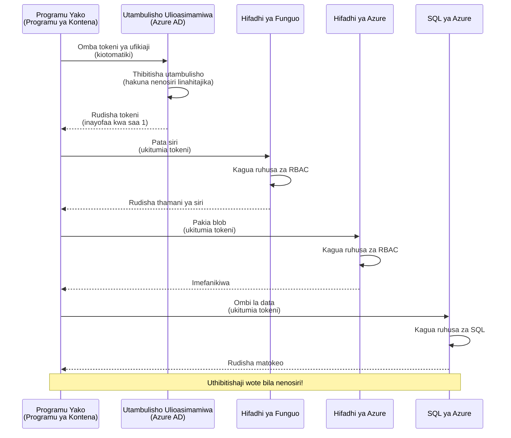
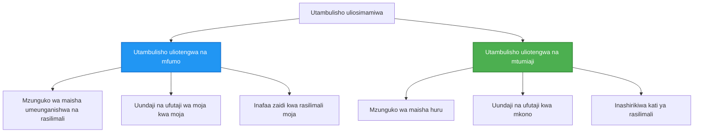

# Mifumo ya Uthibitishaji na Utambulisho uliosimamiwa

⏱️ **Muda wa Makadirio**: 45-60 dakika | 💰 **Athari ya Gharama**: Bila malipo (hakuna malipo ya ziada) | ⭐ **Ugumu**: Wastani

**📚 Njia ya Kujifunza:**
- ← Iliopita: [Usimamizi wa Mipangilio](configuration.md) - Kusimamia vigezo vya mazingira na siri
- 🎯 **Uko Hapa**: Uthibitishaji & Usalama (Utambulisho uliosimamiwa, Key Vault, mifumo salama)
- → Ifuatayo: [Mradi wa Kwanza](first-project.md) - Jenga programu yako ya kwanza ya AZD
- 🏠 [Nyumbani kwa Kozi](../../README.md)

---

## Utakachojifunza

Kwa kumaliza somo hili, utakuwa umeweza:
- Elewa mifumo ya uthibitishaji ya Azure (vifunguo, mfululizo wa muunganisho, utambulisho uliosimamiwa)
- Tekeleza **Utambulisho uliosimamiwa** kwa uthibitishaji bila nywila
- Linda siri kwa kuunganisha na **Azure Key Vault**
- Sanidi **udhibiti wa upatikanaji kulingana na majukumu (RBAC)** kwa uenezaji wa AZD
- Tumia mbinu bora za usalama katika Container Apps na huduma za Azure
- Hamisha kutoka kwenye uthibitishaji unaotegemea funguo hadi uthibitishaji unaotegemea utambulisho

## Kwa Nini Utambulisho uliosimamiwa ni Muhimu

### Tatizo: Uthibitishaji wa Kawaida

**Kabla ya Utambulisho uliosimamiwa:**
```javascript
// ❌ HATARI YA USALAMA: Siri zilizowekwa moja kwa moja ndani ya msimbo
const connectionString = "Server=mydb.database.windows.net;User=admin;Password=P@ssw0rd123";
const storageKey = "xK7mN9pQ2wR5tY8uI0oP3aS6dF1gH4jK...";
const cosmosKey = "C2x7B9n4M1p8Q5w3E6r0T2y5U8i1O4p7...";
```

**Matatizo:**
- 🔴 **Siri zilizo wazi** katika msimbo, faili za usanidi, vigezo vya mazingira
- 🔴 **Mzunguko wa cheo** unahitaji mabadiliko ya msimbo na uenezaji upya
- 🔴 **Maumivu ya ukaguzi** - nani alifikia nini, lini?
- 🔴 **Usambazaji ulioenea** - siri zimesambaa katika mifumo mingi
- 🔴 **Hatari za uzingatiaji** - hupitisha ukaguzi wa usalama

### Suluhisho: Utambulisho uliosimamiwa

**Baada ya Utambulisho uliosimamiwa:**
```javascript
// ✅ SALAMA: Hakuna siri katika msimbo
const credential = new DefaultAzureCredential();
const client = new BlobServiceClient(
  "https://mystorageaccount.blob.core.windows.net",
  credential  // Azure inashughulikia uthibitishaji moja kwa moja
);
```

**Manufaa:**
- ✅ **Hakuna siri** katika msimbo au usanidi
- ✅ **Mzunguko wa cheo wa moja kwa moja** - Azure inashughulikia
- ✅ **Rekodi kamili ya ukaguzi** katika kumbukumbu za Azure AD
- ✅ **Usalama uliolengwa katikati** - simamia kwenye Azure Portal
- ✅ **Tayari kwa uzingatiaji** - inakidhi viwango vya usalama

**Tamko**: Uthibitishaji wa jadi ni kama kubeba funguo nyingi za kimwili kwa milango tofauti. Utambulisho uliosimamiwa ni kama kuwa na kadi ya usalama inayotoa ufikiaji kiotomatiki kulingana na wewe—hakuna funguo za kupoteza, kunakili, au kuzungusha.

---

## Muhtasari wa Miundo

### Mtiririko wa Uthibitishaji na Utambulisho uliosimamiwa


### Aina za Utambulisho uliosimamiwa


| Kipengele | System-Assigned | User-Assigned |
|---------|----------------|---------------|
| **Mzunguko wa Maisha** | Inahusishwa na rasilimali | Haina uhusiano wa maisha |
| **Uundaji** | Moja kwa moja na rasilimali | Uundaji wa mkono |
| **Ufutaji** | Inafutwa pamoja na rasilimali | Hushikilia baada ya kufutwa kwa rasilimali |
| **Kushirikishwa** | Rasilimali moja tu | Rasilimali nyingi |
| **Tumia Kesi** | Hali rahisi | Hali za muundo wa rasilimali nyingi |
| **Chaguo-msingi AZD** | ✅ Inapendekezwa | Hiari |

---

## Mahitaji ya Msingi

### Vifaa Vinavyohitajika

Unapaswa tayari kuwa umeweka hivi kutoka masomo yaliyopita:

```bash
# Thibitisha CLI ya Azure Developer
azd version
# ✅ Inatarajiwa: azd toleo 1.0.0 au zaidi

# Thibitisha CLI ya Azure
az --version
# ✅ Inatarajiwa: azure-cli 2.50.0 au zaidi
```

### Mahitaji ya Azure

- Michango ya Azure hai
- Ruhusa za:
  - Kuunda utambulisho uliopewa usimamizi
  - Kutoa majukumu ya RBAC
  - Kuunda rasilimali za Key Vault
  - Kueneza Container Apps

### Maarifa Yanayohitajika

Unapaswa kuwa umemaliza:
- [Mwongozo wa Ufungaji](installation.md) - usanidi wa AZD
- [Misingi ya AZD](azd-basics.md) - dhana za msingi
- [Usimamizi wa Mipangilio](configuration.md) - vigezo vya mazingira

---

## Somo 1: Kuelewa Mifumo ya Uthibitishaji

### Mfumo 1: Mifumo ya Muunganisho (Ya Kale - Epuka)

**Inavyofanya kazi:**
```bash
# Mstari wa muunganisho una vitambulisho.
STORAGE_CONNECTION_STRING="DefaultEndpointsProtocol=https;AccountName=myaccount;AccountKey=xK7mN9pQ2wR5..."
COSMOS_CONNECTION_STRING="AccountEndpoint=https://myaccount.documents.azure.com:443/;AccountKey=C2x7..."
SQL_CONNECTION_STRING="Server=myserver.database.windows.net;User=admin;Password=P@ssw0rd..."
```

**Matatizo:**
- ❌ Siri zinavyoonekana katika vigezo vya mazingira
- ❌ Zinarekodiwa katika mifumo ya uenezaji
- ❌ Zinasumbua kuzungusha
- ❌ Hakuna rekodi ya ukaguzi ya ufikiaji

**Wakati wa kutumia:** Kwa maendeleo ya ndani tu, si kwa uzalishaji.

---

### Mfumo 2: Marejeleo ya Key Vault (Bora)

**Inavyofanya kazi:**
```bicep
// Store secret in Key Vault
resource keyVault 'Microsoft.KeyVault/vaults@2023-02-01' = {
  name: 'mykv'
  properties: {
    enableRbacAuthorization: true
  }
}

// Reference in Container App
env: [
  {
    name: 'STORAGE_KEY'
    secretRef: 'storage-key'  // References Key Vault
  }
]
```

**Manufaa:**
- ✅ Siri zinalindwa kwa usalama katika Key Vault
- ✅ Usimamizi wa siri uliolengwa katikati
- ✅ Kuizungusha bila mabadiliko ya msimbo

**Marekebisho:**
- ⚠️ Bado inatumia funguo/nywila
- ⚠️ Inahitaji kusimamia upatikanaji wa Key Vault

**Wakati wa kutumia:** Hatua ya mpito kutoka kwenye mfululizo wa muunganisho hadi utambulisho uliosimamiwa.

---

### Mfumo 3: Utambulisho uliosimamiwa (Mbinu Bora)

**Inavyofanya kazi:**
```bicep
// Enable managed identity
resource containerApp 'Microsoft.App/containerApps@2023-05-01' = {
  name: 'myapp'
  identity: {
    type: 'SystemAssigned'  // Automatically creates identity
  }
}

// Grant permissions
resource roleAssignment 'Microsoft.Authorization/roleAssignments@2022-04-01' = {
  scope: storageAccount
  properties: {
    roleDefinitionId: storageBlobDataContributorRole
    principalId: containerApp.identity.principalId
  }
}
```

**Msimbo wa programu:**
```javascript
// Hakuna siri zinahitajika!
const { DefaultAzureCredential } = require('@azure/identity');
const { BlobServiceClient } = require('@azure/storage-blob');

const credential = new DefaultAzureCredential();
const blobServiceClient = new BlobServiceClient(
  'https://mystorageaccount.blob.core.windows.net',
  credential
);
```

**Manufaa:**
- ✅ Hakuna siri katika msimbo/usanidi
- ✅ Mzunguko wa cheo wa moja kwa moja
- ✅ Rekodi kamili ya ukaguzi
- ✅ Ruhusa kwa msingi wa RBAC
- ✅ Tayari kwa uzingatiaji

**Wakati wa kutumia:** Daima, kwa programu za uzalishaji.

---

## Somo 2: Kutekeleza Utambulisho uliosimamiwa kwa AZD

### Hatua kwa Hatua ya Utekelezaji

Tuanze kuunda Container App salama inayotumia utambulisho uliosimamiwa kufikia Azure Storage na Key Vault.

### Muundo wa Mradi

```
secure-app/
├── azure.yaml                 # AZD configuration
├── infra/
│   ├── main.bicep            # Main infrastructure
│   ├── core/
│   │   ├── identity.bicep    # Managed identity setup
│   │   ├── keyvault.bicep    # Key Vault configuration
│   │   └── storage.bicep     # Storage with RBAC
│   └── app/
│       └── container-app.bicep
└── src/
    ├── app.js                # Application code
    ├── package.json
    └── Dockerfile
```

### 1. Sanidi AZD (azure.yaml)

```yaml
name: secure-app
metadata:
  template: secure-app@1.0.0

services:
  api:
    project: ./src
    language: js
    host: containerapp

# Enable managed identity (AZD handles this automatically)
```

### 2. Miundombinu: Omba Utambulisho uliosimamiwa

**Faili: `infra/main.bicep`**

```bicep
targetScope = 'subscription'

param environmentName string
param location string = 'eastus'

var tags = { 'azd-env-name': environmentName }

// Resource group
resource rg 'Microsoft.Resources/resourceGroups@2021-04-01' = {
  name: 'rg-${environmentName}'
  location: location
  tags: tags
}

// Storage Account
module storage './core/storage.bicep' = {
  name: 'storage'
  scope: rg
  params: {
    name: 'st${uniqueString(rg.id)}'
    location: location
    tags: tags
  }
}

// Key Vault
module keyVault './core/keyvault.bicep' = {
  name: 'keyvault'
  scope: rg
  params: {
    name: 'kv-${uniqueString(rg.id)}'
    location: location
    tags: tags
  }
}

// Container App with Managed Identity
module containerApp './app/container-app.bicep' = {
  name: 'container-app'
  scope: rg
  params: {
    name: 'ca-${environmentName}'
    location: location
    tags: tags
    storageAccountName: storage.outputs.name
    keyVaultName: keyVault.outputs.name
  }
}

// Grant Container App access to Storage
module storageRoleAssignment './core/role-assignment.bicep' = {
  name: 'storage-role'
  scope: rg
  params: {
    principalId: containerApp.outputs.identityPrincipalId
    roleDefinitionId: 'ba92f5b4-2d11-453d-a403-e96b0029c9fe'  // Storage Blob Data Contributor
    targetResourceId: storage.outputs.id
  }
}

// Grant Container App access to Key Vault
module kvRoleAssignment './core/role-assignment.bicep' = {
  name: 'kv-role'
  scope: rg
  params: {
    principalId: containerApp.outputs.identityPrincipalId
    roleDefinitionId: '4633458b-17de-408a-b874-0445c86b69e6'  // Key Vault Secrets User
    targetResourceId: keyVault.outputs.id
  }
}

// Outputs
output AZURE_STORAGE_ACCOUNT_NAME string = storage.outputs.name
output AZURE_KEY_VAULT_NAME string = keyVault.outputs.name
output APP_URL string = containerApp.outputs.url
```

### 3. Container App na Utambulisho uliowekwa kwa Mfumo

**Faili: `infra/app/container-app.bicep`**

```bicep
param name string
param location string
param tags object = {}
param storageAccountName string
param keyVaultName string

resource containerApp 'Microsoft.App/containerApps@2023-05-01' = {
  name: name
  location: location
  tags: tags
  identity: {
    type: 'SystemAssigned'  // 🔑 Enable managed identity
  }
  properties: {
    configuration: {
      ingress: {
        external: true
        targetPort: 3000
      }
    }
    template: {
      containers: [
        {
          name: 'api'
          image: 'myregistry.azurecr.io/api:latest'
          resources: {
            cpu: json('0.5')
            memory: '1Gi'
          }
          env: [
            {
              name: 'AZURE_STORAGE_ACCOUNT_NAME'
              value: storageAccountName
            }
            {
              name: 'AZURE_KEY_VAULT_NAME'
              value: keyVaultName
            }
            // 🔑 No secrets - managed identity handles authentication!
          ]
        }
      ]
    }
  }
}

// Output the identity for RBAC assignments
output identityPrincipalId string = containerApp.identity.principalId
output id string = containerApp.id
output url string = 'https://${containerApp.properties.configuration.ingress.fqdn}'
```

### 4. Moduli ya Ugawaji wa Majukumu ya RBAC

**Faili: `infra/core/role-assignment.bicep`**

```bicep
param principalId string
param roleDefinitionId string  // Azure built-in role ID
param targetResourceId string

resource roleAssignment 'Microsoft.Authorization/roleAssignments@2022-04-01' = {
  name: guid(principalId, roleDefinitionId, targetResourceId)
  scope: resourceId('Microsoft.Resources/resourceGroups', resourceGroup().name)
  properties: {
    roleDefinitionId: subscriptionResourceId('Microsoft.Authorization/roleDefinitions', roleDefinitionId)
    principalId: principalId
    principalType: 'ServicePrincipal'
  }
}

output id string = roleAssignment.id
```

### 5. Msimbo wa Programu unaotumia Utambulisho uliosimamiwa

**Faili: `src/app.js`**

```javascript
const express = require('express');
const { DefaultAzureCredential } = require('@azure/identity');
const { BlobServiceClient } = require('@azure/storage-blob');
const { SecretClient } = require('@azure/keyvault-secrets');

const app = express();
const PORT = process.env.PORT || 3000;

// 🔑 Anzisha idhinishaji (inafanya kazi moja kwa moja na kitambulisho kilichosimamiwa)
const credential = new DefaultAzureCredential();

// Usanidi wa Azure Storage
const storageAccountName = process.env.AZURE_STORAGE_ACCOUNT_NAME;
const blobServiceClient = new BlobServiceClient(
  `https://${storageAccountName}.blob.core.windows.net`,
  credential  // Hakuna funguo zinazohitajika!
);

// Usanidi wa Key Vault
const keyVaultName = process.env.AZURE_KEY_VAULT_NAME;
const secretClient = new SecretClient(
  `https://${keyVaultName}.vault.azure.net`,
  credential  // Hakuna funguo zinazohitajika!
);

// Ukaguzi wa afya
app.get('/health', (req, res) => {
  res.json({ status: 'healthy', authentication: 'managed-identity' });
});

// Pakia faili kwenye hifadhi ya blob
app.post('/upload', async (req, res) => {
  try {
    const containerClient = blobServiceClient.getContainerClient('uploads');
    await containerClient.createIfNotExists();
    
    const blobName = `file-${Date.now()}.txt`;
    const blockBlobClient = containerClient.getBlockBlobClient(blobName);
    
    await blockBlobClient.upload('Hello from managed identity!', 30);
    
    res.json({
      success: true,
      blobName: blobName,
      message: 'File uploaded using managed identity!'
    });
  } catch (error) {
    console.error('Upload error:', error);
    res.status(500).json({ error: error.message });
  }
});

// Pata siri kutoka Key Vault
app.get('/secret/:name', async (req, res) => {
  try {
    const secretName = req.params.name;
    const secret = await secretClient.getSecret(secretName);
    
    res.json({
      name: secretName,
      value: secret.value,
      message: 'Secret retrieved using managed identity!'
    });
  } catch (error) {
    console.error('Secret error:', error);
    res.status(500).json({ error: error.message });
  }
});

// Orodhesha makontena ya blob (inaonyesha ruhusa ya kusoma)
app.get('/containers', async (req, res) => {
  try {
    const containers = [];
    for await (const container of blobServiceClient.listContainers()) {
      containers.push(container.name);
    }
    
    res.json({
      containers: containers,
      count: containers.length,
      message: 'Containers listed using managed identity!'
    });
  } catch (error) {
    console.error('List error:', error);
    res.status(500).json({ error: error.message });
  }
});

app.listen(PORT, () => {
  console.log(`Secure API listening on port ${PORT}`);
  console.log('Authentication: Managed Identity (passwordless)');
});
```

**Faili: `src/package.json`**

```json
{
  "name": "secure-app",
  "version": "1.0.0",
  "dependencies": {
    "express": "^4.18.2",
    "@azure/identity": "^4.0.0",
    "@azure/storage-blob": "^12.17.0",
    "@azure/keyvault-secrets": "^4.7.0"
  },
  "scripts": {
    "start": "node app.js"
  }
}
```

### 6. Eneza na Jaribu

```bash
# Anzisha mazingira ya AZD
azd init

# Sambaza miundombinu na programu
azd up

# Pata URL ya programu
APP_URL=$(azd env get-values | grep APP_URL | cut -d '=' -f2 | tr -d '"')

# Jaribu ukaguzi wa afya
curl $APP_URL/health
```

**✅ Matokeo yanayotarajiwa:**
```json
{
  "status": "healthy",
  "authentication": "managed-identity"
}
```

**Jaribio la kupakia blob:**
```bash
curl -X POST $APP_URL/upload
```

**✅ Matokeo yanayotarajiwa:**
```json
{
  "success": true,
  "blobName": "file-1700404800000.txt",
  "message": "File uploaded using managed identity!"
}
```

**Orodha ya vyombo vya kontena:**
```bash
curl $APP_URL/containers
```

**✅ Matokeo yanayotarajiwa:**
```json
{
  "containers": ["uploads"],
  "count": 1,
  "message": "Containers listed using managed identity!"
}
```

---

## Majukumu ya RBAC ya Azure yanayotumika sana

### Vitambulisho vya Majukumu vilivyomo kwa Utambulisho uliosimamiwa

| Huduma | Jina la Nafasi | Role ID | Ruhusa |
|---------|-----------|---------|-------------|
| **Storage** | Storage Blob Data Reader | `2a2b9908-6b94-4a3d-8e5a-a7d8f8cc8a12` | Soma blobs na vyombo |
| **Storage** | Storage Blob Data Contributor | `ba92f5b4-2d11-453d-a403-e96b0029c9fe` | Soma, andika, futa blobs |
| **Storage** | Storage Queue Data Contributor | `974c5e8b-45b9-4653-ba55-5f855dd0fb88` | Soma, andika, futa ujumbe wa foleni |
| **Key Vault** | Key Vault Secrets User | `4633458b-17de-408a-b874-0445c86b69e6` | Soma siri |
| **Key Vault** | Key Vault Secrets Officer | `b86a8fe4-44ce-4948-aee5-eccb2c155cd7` | Soma, andika, futa siri |
| **Cosmos DB** | Cosmos DB Built-in Data Reader | `00000000-0000-0000-0000-000000000001` | Soma data za Cosmos DB |
| **Cosmos DB** | Cosmos DB Built-in Data Contributor | `00000000-0000-0000-0000-000000000002` | Soma, andika data za Cosmos DB |
| **SQL Database** | SQL DB Contributor | `9b7fa17d-e63e-47b0-bb0a-15c516ac86ec` | Dhibiti hifadhidata za SQL |
| **Service Bus** | Azure Service Bus Data Owner | `090c5cfd-751d-490a-894a-3ce6f1109419` | Tuma, pokea, dhibiti ujumbe |

### Jinsi ya Kupata Role IDs

```bash
# Orodhesha nafasi zote zilizojengwa
az role definition list --query "[].{Name:roleName, ID:name}" --output table

# Tafuta nafasi maalum
az role definition list --query "[?contains(roleName, 'Storage Blob')].{Name:roleName, ID:name}" --output table

# Pata maelezo ya nafasi
az role definition list --name "Storage Blob Data Contributor"
```

---

## Mazoezi ya Kivitendo

### Zoezi 1: Washa Utambulisho uliosimamiwa kwa App Iliyopo ⭐⭐ (Wastani)

**Lengo**: Ongeza utambulisho uliosimamiwa kwa uenezaji uliopo wa Container App

**Tukio**: Una Container App inayotumia mfululizo wa muunganisho. Geuza hadi utambulisho uliosimamiwa.

**Mahali pa Kuanzia**: Container App na usanidi huu:

```bicep
// ❌ Current: Using connection string
env: [
  {
    name: 'STORAGE_CONNECTION_STRING'
    secretRef: 'storage-connection'
  }
]
```

**Hatua**:

1. **Washa utambulisho uliosimamiwa katika Bicep:**

```bicep
resource containerApp 'Microsoft.App/containerApps@2023-05-01' = {
  name: 'myapp'
  identity: {
    type: 'SystemAssigned'  // Add this
  }
  // ... rest of configuration
}
```

2. **Toa upatikanaji wa Storage:**

```bicep
// Get storage account reference
resource storageAccount 'Microsoft.Storage/storageAccounts@2023-01-01' existing = {
  name: storageAccountName
}

// Assign role
resource roleAssignment 'Microsoft.Authorization/roleAssignments@2022-04-01' = {
  name: guid(containerApp.id, 'ba92f5b4-2d11-453d-a403-e96b0029c9fe', storageAccount.id)
  scope: storageAccount
  properties: {
    roleDefinitionId: subscriptionResourceId('Microsoft.Authorization/roleDefinitions', 'ba92f5b4-2d11-453d-a403-e96b0029c9fe')
    principalId: containerApp.identity.principalId
    principalType: 'ServicePrincipal'
  }
}
```

3. **Sasisha msimbo wa programu:**

**Kabla (mfululizo wa muunganisho):**
```javascript
const { BlobServiceClient } = require('@azure/storage-blob');

const blobServiceClient = BlobServiceClient.fromConnectionString(
  process.env.STORAGE_CONNECTION_STRING
);
```

**Baada (utambulisho uliosimamiwa):**
```javascript
const { DefaultAzureCredential } = require('@azure/identity');
const { BlobServiceClient } = require('@azure/storage-blob');

const credential = new DefaultAzureCredential();
const blobServiceClient = new BlobServiceClient(
  `https://${process.env.STORAGE_ACCOUNT_NAME}.blob.core.windows.net`,
  credential
);
```

4. **Sasisha vigezo vya mazingira:**

```bicep
env: [
  {
    name: 'STORAGE_ACCOUNT_NAME'
    value: storageAccountName  // Just the name, no secrets!
  }
  // Remove STORAGE_CONNECTION_STRING
]
```

5. **Eneza na jaribu:**

```bash
# Weka tena
azd up

# Jaribu kwamba bado inafanya kazi
curl https://myapp.azurecontainerapps.io/upload
```

**✅ Vigezo vya Mafanikio:**
- ✅ Programu inaeza kusambazwa bila makosa
- ✅ Operesheni za Storage zinafanya kazi (kupakia, kuorodhesha, kupakua)
- ✅ Hakuna mfululizo wa muunganisho katika vigezo vya mazingira
- ✅ Utambulisho unaonekana katika Azure Portal chini ya kipengele "Identity"

**Uthibitisho:**

```bash
# Hakikisha kitambulisho kilichosimamiwa kimewezeshwa
az containerapp show \
  --name myapp \
  --resource-group rg-myapp \
  --query "identity.type"
# ✅ Inatarajiwa: "SystemAssigned"

# Angalia ugawaji wa jukumu
az role assignment list \
  --assignee $(az containerapp show --name myapp --resource-group rg-myapp --query "identity.principalId" -o tsv) \
  --scope /subscriptions/{sub-id}/resourceGroups/rg-myapp/providers/Microsoft.Storage/storageAccounts/mystorageaccount
# ✅ Inatarajiwa: Inaonyesha jukumu la "Storage Blob Data Contributor"
```

**Muda**: 20-30 dakika

---

### Zoezi 2: Ufikiaji wa Huduma Nyingi kwa Utambulisho uliotolewa kwa Mtumiaji ⭐⭐⭐ (Kiwango cha Juu)

**Lengo**: Tengeneza utambulisho uliotolewa kwa mtumiaji unaoshirikiwa kati ya Container Apps nyingi

**Tukio**: Una huduma ndogo 3 ambazo zote zinahitaji ufikiaji wa akaunti ya Storage na Key Vault ile ile.

**Hatua**:

1. **Tengeneza utambulisho uliotolewa kwa mtumiaji:**

**Faili: `infra/core/identity.bicep`**

```bicep
param name string
param location string
param tags object = {}

resource userAssignedIdentity 'Microsoft.ManagedIdentity/userAssignedIdentities@2023-01-31' = {
  name: name
  location: location
  tags: tags
}

output id string = userAssignedIdentity.id
output principalId string = userAssignedIdentity.properties.principalId
output clientId string = userAssignedIdentity.properties.clientId
```

2. **Weka majukumu kwa utambulisho uliotolewa kwa mtumiaji:**

```bicep
// In main.bicep
module userIdentity './core/identity.bicep' = {
  name: 'user-identity'
  scope: rg
  params: {
    name: 'id-${environmentName}'
    location: location
    tags: tags
  }
}

// Grant Storage access
resource storageRoleAssignment 'Microsoft.Authorization/roleAssignments@2022-04-01' = {
  name: guid(userIdentity.outputs.principalId, 'storage-contributor')
  scope: storageAccount
  properties: {
    roleDefinitionId: subscriptionResourceId('Microsoft.Authorization/roleDefinitions', 'ba92f5b4-2d11-453d-a403-e96b0029c9fe')
    principalId: userIdentity.outputs.principalId
    principalType: 'ServicePrincipal'
  }
}

// Grant Key Vault access
resource kvRoleAssignment 'Microsoft.Authorization/roleAssignments@2022-04-01' = {
  name: guid(userIdentity.outputs.principalId, 'kv-secrets-user')
  scope: keyVault
  properties: {
    roleDefinitionId: subscriptionResourceId('Microsoft.Authorization/roleDefinitions', '4633458b-17de-408a-b874-0445c86b69e6')
    principalId: userIdentity.outputs.principalId
    principalType: 'ServicePrincipal'
  }
}
```

3. **Weka utambulisho kwa Container Apps nyingi:**

```bicep
resource apiGateway 'Microsoft.App/containerApps@2023-05-01' = {
  name: 'api-gateway'
  identity: {
    type: 'UserAssigned'
    userAssignedIdentities: {
      '${userIdentity.outputs.id}': {}
    }
  }
  // ... rest of config
}

resource productService 'Microsoft.App/containerApps@2023-05-01' = {
  name: 'product-service'
  identity: {
    type: 'UserAssigned'
    userAssignedIdentities: {
      '${userIdentity.outputs.id}': {}
    }
  }
  // ... rest of config
}

resource orderService 'Microsoft.App/containerApps@2023-05-01' = {
  name: 'order-service'
  identity: {
    type: 'UserAssigned'
    userAssignedIdentities: {
      '${userIdentity.outputs.id}': {}
    }
  }
  // ... rest of config
}
```

4. **Msimbo wa programu (huduma zote zinatumia muundo ule ule):**

```javascript
const { DefaultAzureCredential, ManagedIdentityCredential } = require('@azure/identity');

// Kwa utambulisho uliotengwa na mtumiaji, taja ID ya mteja
const credential = new ManagedIdentityCredential(
  process.env.AZURE_CLIENT_ID  // ID ya mteja ya utambulisho uliotengwa na mtumiaji
);

// Au tumia DefaultAzureCredential (inagundua moja kwa moja)
const credential = new DefaultAzureCredential();

const blobServiceClient = new BlobServiceClient(
  `https://${process.env.STORAGE_ACCOUNT_NAME}.blob.core.windows.net`,
  credential
);
```

5. **Eneza na thibitisha:**

```bash
azd up

# Thibitisha kwamba huduma zote zinaweza kufikia hifadhi.
curl https://api-gateway.azurecontainerapps.io/upload
curl https://product-service.azurecontainerapps.io/upload
curl https://order-service.azurecontainerapps.io/upload
```

**✅ Vigezo vya Mafanikio:**
- ✅ Utambulisho mmoja unasheheshwa kwa huduma 3
- ✅ Huduma zote zinaweza kufikia Storage na Key Vault
- ✅ Utambulisho unaendelea kuwapo ikiwa utafuta huduma moja
- ✅ Usimamizi wa ruhusa uliolengwa katikati

**Manufaa ya Utambulisho uliotolewa kwa Mtumiaji:**
- Utambulisho mmoja wa kusimamia
- Ruhusa sawia kwa huduma zote
- Hushikilia baada ya kufutwa kwa huduma
- Bora kwa usanifu tata wa miradi

**Muda**: 30-40 dakika

---

### Zoezi 3: Tekeleza Mzunguko wa Siri za Key Vault ⭐⭐⭐ (Kiwango cha Juu)

**Lengo**: Hifadhi funguo za API za wahudumu wa tatu katika Key Vault na uzipate kwa kutumia utambulisho uliosimamiwa

**Tukio**: Programu yako inahitaji kuita API ya nje (OpenAI, Stripe, SendGrid) inayohitaji funguo za API.

**Hatua**:

1. **Tengeneza Key Vault kwa RBAC:**

**Faili: `infra/core/keyvault.bicep`**

```bicep
param name string
param location string
param tags object = {}

resource keyVault 'Microsoft.KeyVault/vaults@2023-02-01' = {
  name: name
  location: location
  tags: tags
  properties: {
    enableRbacAuthorization: true  // Use RBAC instead of access policies
    sku: {
      family: 'A'
      name: 'standard'
    }
    tenantId: subscription().tenantId
    enableSoftDelete: true
    softDeleteRetentionInDays: 90
  }
}

// Allow Container App to read secrets
output id string = keyVault.id
output name string = keyVault.name
output uri string = keyVault.properties.vaultUri
```

2. **Hifadhi siri katika Key Vault:**

```bash
# Pata jina la Key Vault
KV_NAME=$(azd env get-values | grep AZURE_KEY_VAULT_NAME | cut -d '=' -f2 | tr -d '"')

# Hifadhi funguo za API za wahusika wa tatu
az keyvault secret set \
  --vault-name $KV_NAME \
  --name "OpenAI-ApiKey" \
  --value "sk-proj-xxxxxxxxxxxxx"

az keyvault secret set \
  --vault-name $KV_NAME \
  --name "Stripe-ApiKey" \
  --value "sk_live_xxxxxxxxxxxxx"

az keyvault secret set \
  --vault-name $KV_NAME \
  --name "SendGrid-ApiKey" \
  --value "SG.xxxxxxxxxxxxx"
```

3. **Msimbo wa programu kupata siri:**

**Faili: `src/config.js`**

```javascript
const { DefaultAzureCredential } = require('@azure/identity');
const { SecretClient } = require('@azure/keyvault-secrets');

class Config {
  constructor() {
    this.credential = new DefaultAzureCredential();
    this.secretClient = new SecretClient(
      `https://${process.env.AZURE_KEY_VAULT_NAME}.vault.azure.net`,
      this.credential
    );
    this.cache = {};
  }

  async getSecret(secretName) {
    // Angalia cache kwanza
    if (this.cache[secretName]) {
      return this.cache[secretName];
    }

    try {
      const secret = await this.secretClient.getSecret(secretName);
      this.cache[secretName] = secret.value;
      console.log(`✅ Retrieved secret: ${secretName}`);
      return secret.value;
    } catch (error) {
      console.error(`❌ Failed to get secret ${secretName}:`, error.message);
      throw error;
    }
  }

  async getOpenAIKey() {
    return this.getSecret('OpenAI-ApiKey');
  }

  async getStripeKey() {
    return this.getSecret('Stripe-ApiKey');
  }

  async getSendGridKey() {
    return this.getSecret('SendGrid-ApiKey');
  }
}

module.exports = new Config();
```

4. **Tumia siri katika programu:**

**Faili: `src/app.js`**

```javascript
const express = require('express');
const config = require('./config');
const { OpenAI } = require('openai');

const app = express();

// Anzisha OpenAI kwa kutumia ufunguo kutoka Key Vault
let openaiClient;

async function initializeServices() {
  const openaiKey = await config.getOpenAIKey();
  openaiClient = new OpenAI({ apiKey: openaiKey });
  console.log('✅ Services initialized with secrets from Key Vault');
}

// Iitwe wakati wa uzinduzi
initializeServices().catch(console.error);

app.post('/chat', async (req, res) => {
  try {
    const completion = await openaiClient.chat.completions.create({
      model: 'gpt-4',
      messages: [{ role: 'user', content: 'Hello!' }]
    });
    
    res.json({
      response: completion.choices[0].message.content,
      authentication: 'Key from Key Vault via Managed Identity'
    });
  } catch (error) {
    res.status(500).json({ error: error.message });
  }
});

app.listen(3000, () => {
  console.log('Secure API with Key Vault integration running');
});
```

5. **Eneza na jaribu:**

```bash
azd up

# Jaribu kuona kama funguo za API zinafanya kazi
curl -X POST https://myapp.azurecontainerapps.io/chat \
  -H "Content-Type: application/json" \
  -d '{"message":"Hello AI"}'
```

**✅ Vigezo vya Mafanikio:**
- ✅ Hakuna funguo za API katika msimbo au vigezo vya mazingira
- ✅ Programu inapokea funguo kutoka Key Vault
- ✅ API za wahudumu wa tatu zinafanya kazi vizuri
- ✅ Unaweza kuzungusha funguo bila mabadiliko ya msimbo

**Zungusha siri:**

```bash
# Sasisha siri katika Key Vault
az keyvault secret set \
  --vault-name $KV_NAME \
  --name "OpenAI-ApiKey" \
  --value "sk-proj-NEW_KEY_HERE"

# Washa upya programu ili kupokea ufunguo mpya
az containerapp revision restart \
  --name myapp \
  --resource-group rg-myapp
```

**Muda**: 25-35 dakika

---

## Sehemu ya Kupima Maarifa

### 1. Mifumo ya Uthibitishaji ✓

Jaribu uelewa wako:

- [ ] **Q1**: Ni mifumo gani mitatu kuu ya uthibitishaji? 
  - **A**: Mifano ya mfululizo wa muunganisho (ya zamani), Marejeleo ya Key Vault (mpito), Utambulisho uliosimamiwa (bora)

- [ ] **Q2**: Kwa nini utambulisho uliosimamiwa ni bora kuliko mfululizo wa muunganisho?
  - **A**: Hakuna siri katika msimbo, mzunguko wa cheo wa moja kwa moja, rekodi kamili ya ukaguzi, ruhusa za RBAC

- [ ] **Q3**: Wakati gani unatumia utambulisho uliotolewa kwa mtumiaji badala ya uliowekwa kwa mfumo?
  - **A**: Unaposhiriki utambulisho kwenye rasilimali nyingi au wakati maisha ya utambulisho ni huru na maisha ya rasilimali

**Uthibitisho wa Vitendo:**
```bash
# Angalia ni aina gani ya utambulisho inayotumika na programu yako
az containerapp show \
  --name myapp \
  --resource-group rg-myapp \
  --query "identity.type"

# Orodhesha uteuzi wote wa majukumu kwa utambulisho huo
az role assignment list \
  --assignee $(az containerapp show --name myapp --resource-group rg-myapp --query "identity.principalId" -o tsv)
```

---

### 2. RBAC na Ruhusa ✓

Jaribu uelewa wako:

- [ ] **Q1**: Ni role ID ipi kwa "Storage Blob Data Contributor"?
  - **A**: `ba92f5b4-2d11-453d-a403-e96b0029c9fe`

- [ ] **Q2**: Ni ruhusa gani "Key Vault Secrets User" inatoa?
  - **A**: Upatikanaji wa kusoma tu kwa siri (haiwezi kuunda, kusasisha, au kufuta)

- [ ] **Q3**: Unawezaje kumpa Container App upatikanaji wa Azure SQL?
  - **A**: Mpe jukumu la "SQL DB Contributor" au sanidi uthibitishaji wa Azure AD kwa SQL

**Uthibitisho wa Vitendo:**
```bash
# Tafuta jukumu maalum
az role definition list --name "Storage Blob Data Contributor"

# Angalia ni majukumu gani yamepewa utambulisho wako
PRINCIPAL_ID=$(az containerapp show --name myapp --resource-group rg-myapp --query "identity.principalId" -o tsv)
az role assignment list --assignee $PRINCIPAL_ID --output table
```

---

### 3. Uunganisho wa Key Vault ✓
- [ ] **Q1**: Je, unaiwezeshaje RBAC kwa Key Vault badala ya sera za ufikiaji?
  - **A**: Weka `enableRbacAuthorization: true` katika Bicep

- [ ] **Q2**: Ni maktaba gani ya Azure SDK inayoshughulikia uthibitishaji wa managed identity?
  - **A**: `@azure/identity` with `DefaultAzureCredential` class

- [ ] **Q3**: Siri za Key Vault hudumu kwa muda gani kwenye kache?
  - **A**: Inategemea programu; tekeleza mkakati wako wa kache

**Hands-On Verification:**
```bash
# Jaribu upatikanaji wa Key Vault
az keyvault secret show \
  --vault-name $KV_NAME \
  --name "OpenAI-ApiKey" \
  --query "value"

# Angalia kuwa RBAC imewezeshwa
az keyvault show \
  --name $KV_NAME \
  --query "properties.enableRbacAuthorization"
# ✅ Inatarajiwa: kweli
```

---

## Mbinu Bora za Usalama

### ✅ FANYA:

1. **Daima tumia kitambulisho kilichosimamiwa katika uzalishaji**
   ```bicep
   identity: {
     type: 'SystemAssigned'
   }
   ```

2. **Tumia majukumu ya RBAC ya kiwango cha chini cha ruhusa**
   - Tumia "Reader" roles inapowezekana
   - Epuka "Owner" au "Contributor" isipokuwa inapohitajika

3. **Hifadhi funguo za wahusika wa tatu katika Key Vault**
   ```javascript
   const apiKey = await secretClient.getSecret('ThirdPartyApiKey');
   ```

4. **Washa uandishi wa ukaguzi**
   ```bicep
   diagnosticSettings: {
     logs: [{ category: 'AuditEvent', enabled: true }]
   }
   ```

5. **Tumia vitambulisho tofauti kwa dev/staging/prod**
   ```bash
   azd env new dev
   azd env new staging
   azd env new prod
   ```

6. **Badilisha siri mara kwa mara**
   - Weka tarehe za kumalizika kwa siri za Key Vault
   - Otomatisha mzunguko kwa Azure Functions

### ❌ USIFANYE:

1. **Kamwe usiweke siri moja kwa moja katika msimbo**
   ```javascript
   // ❌ MBAYA
   const apiKey = "sk-proj-xxxxxxxxxxxxx";
   ```

2. **Usitumie connection strings katika uzalishaji**
   ```javascript
   // ❌ MBAYA
   BlobServiceClient.fromConnectionString(process.env.STORAGE_CONNECTION_STRING)
   ```

3. **Usitoe ruhusa kupita kiasi**
   ```bicep
   // ❌ BAD - too much access
   roleDefinitionId: 'Owner'
   
   // ✅ GOOD - least privilege
   roleDefinitionId: 'Storage Blob Data Reader'
   ```

4. **Usirekodi siri**
   ```javascript
   // ❌ MBAYA
   console.log('API Key:', apiKey);
   
   // ✅ BORA
   console.log('API Key retrieved successfully');
   ```

5. **Usishirikishe vitambulisho vya uzalishaji kati ya mazingira**
   ```bicep
   // ❌ BAD - same identity for dev and prod
   // ✅ GOOD - separate identities per environment
   ```

---

## Mwongozo wa Utatuzi wa Matatizo

### Tatizo: "Unauthorized" unapotaka kufikia Azure Storage

**Dalili:**
```
Error: Unauthorized (403)
AuthorizationPermissionMismatch: This request is not authorized to perform this operation
```

**Uchambuzi:**

```bash
# Angalia ikiwa utambulisho unaosimamiwa umewezeshwa
az containerapp show \
  --name myapp \
  --resource-group rg-myapp \
  --query "identity.type"
# ✅ Inatarajiwa: "SystemAssigned" au "UserAssigned"

# Angalia uteuzi wa majukumu
PRINCIPAL_ID=$(az containerapp show --name myapp --resource-group rg-myapp --query "identity.principalId" -o tsv)
az role assignment list --assignee $PRINCIPAL_ID

# Inatarajiwa: Unapaswa kuona "Storage Blob Data Contributor" au jukumu linalofanana
```

**Suluhisho:**

1. **Toa jukumu sahihi la RBAC:**
```bash
STORAGE_ID=$(az storage account show --name mystorageaccount --resource-group rg-myapp --query "id" -o tsv)
az role assignment create \
  --assignee $PRINCIPAL_ID \
  --role "Storage Blob Data Contributor" \
  --scope $STORAGE_ID
```

2. **Subiri kusambaa (inaweza kuchukua dakika 5-10):**
```bash
# Angalia hali ya ugawaji wa jukumu
az role assignment list --assignee $PRINCIPAL_ID --scope $STORAGE_ID
```

3. **Thibitisha msimbo wa programu unatumia kredenshali sahihi:**
```javascript
// Hakikisha unatumia DefaultAzureCredential
const credential = new DefaultAzureCredential();
```

---

### Tatizo: Ufikiaji wa Key Vault umekataliwa

**Dalili:**
```
Error: Forbidden (403)
The user, group or application does not have secrets get permission
```

**Uchambuzi:**

```bash
# Angalia RBAC ya Key Vault imewezeshwa
az keyvault show \
  --name $KV_NAME \
  --query "properties.enableRbacAuthorization"
# ✅ Inatarajiwa: kweli

# Angalia uteuzi wa majukumu
az role assignment list \
  --assignee $PRINCIPAL_ID \
  --scope /subscriptions/{sub-id}/resourceGroups/rg-myapp/providers/Microsoft.KeyVault/vaults/$KV_NAME
```

**Suluhisho:**

1. **Washa RBAC kwenye Key Vault:**
```bash
az keyvault update \
  --name $KV_NAME \
  --enable-rbac-authorization true
```

2. **Toa jukumu la Key Vault Secrets User:**
```bash
KV_ID=$(az keyvault show --name $KV_NAME --query "id" -o tsv)
az role assignment create \
  --assignee $PRINCIPAL_ID \
  --role "Key Vault Secrets User" \
  --scope $KV_ID
```

---

### Tatizo: DefaultAzureCredential inashindwa katika mazingira ya ndani

**Dalili:**
```
Error: DefaultAzureCredential failed to retrieve a token
CredentialUnavailableError: No credential available
```

**Uchambuzi:**

```bash
# Angalia ikiwa umeingia
az account show

# Angalia uthibitishaji wa Azure CLI
az ad signed-in-user show
```

**Suluhisho:**

1. **Ingia kwenye Azure CLI:**
```bash
az login
```

2. **Weka Azure subscription:**
```bash
az account set --subscription "Your Subscription Name"
```

3. **Kwa maendeleo ya ndani, tumia vigezo vya mazingira:**
```bash
export AZURE_TENANT_ID="your-tenant-id"
export AZURE_CLIENT_ID="your-client-id"
export AZURE_CLIENT_SECRET="your-client-secret"
```

4. **Au tumia kredenshali tofauti kwa ndani:**
```javascript
const { DefaultAzureCredential, AzureCliCredential } = require('@azure/identity');

// Tumia AzureCliCredential kwa maendeleo ya ndani
const credential = process.env.NODE_ENV === 'production' 
  ? new DefaultAzureCredential()
  : new AzureCliCredential();
```

---

### Tatizo: Uteuzi wa jukumu unachukua muda mrefu kusambaa

**Dalili:**
- Jukumu limepewa kwa mafanikio
- Bado unapata makosa ya 403
- Ufikiaji usio thabiti (mara hufanya kazi, mara haufanyi kazi)

**Maelezo:**
Mabadiliko ya Azure RBAC yanaweza kuchukua dakika 5-10 kusambaa duniani kote.

**Suluhisho:**

```bash
# Subiri kisha ujaribu tena
echo "Waiting for RBAC propagation..."
sleep 300  # Subiri dakika 5

# Jaribu upatikanaji
curl https://myapp.azurecontainerapps.io/upload

# Ikiwa bado inashindwa, anzisha upya programu
az containerapp revision restart \
  --name myapp \
  --resource-group rg-myapp
```

---

## Mambo ya Kuzingatia Kuhusu Gharama

### Gharama za Managed Identity

| Rasilimali | Gharama |
|----------|------|
| **Managed Identity** | 🆓 **BURE** - Hakuna malipo |
| **RBAC Role Assignments** | 🆓 **BURE** - Hakuna malipo |
| **Azure AD Token Requests** | 🆓 **BURE** - Imewemo |
| **Key Vault Operations** | $0.03 per 10,000 operations |
| **Key Vault Storage** | $0.024 per secret per month |

Kitambulisho kilichosimamiwa kinaokoa pesa kwa:
- ✅ Kuondoa operesheni za Key Vault kwa uthibitishaji kati ya huduma
- ✅ Kupunguza matukio ya usalama (hakuna kredenshali zilizomwagika)
- ✅ Kupunguza mzigo wa uendeshaji (hakuna mzunguko wa mikono)

**Mfano wa Ulinganifu wa Gharama (kwa mwezi):**

| Senario | Connection Strings | Managed Identity | Savings |
|----------|-------------------|-----------------|---------|
| Programu ndogo (1M requests) | ~$50 (Key Vault + operesheni) | ~$0 | $50/month |
| Programu ya kati (10M requests) | ~$200 | ~$0 | $200/month |
| Programu kubwa (100M requests) | ~$1,500 | ~$0 | $1,500/month |

---

## Jifunze Zaidi

### Nyaraka Rasmi
- [Utambulisho wa Azure uliosimamiwa](https://learn.microsoft.com/entra/identity/managed-identities-azure-resources/overview)
- [RBAC ya Azure](https://learn.microsoft.com/azure/role-based-access-control/overview)
- [Azure Key Vault](https://learn.microsoft.com/azure/key-vault/general/overview)
- [DefaultAzureCredential](https://learn.microsoft.com/dotnet/api/azure.identity.defaultazurecredential)

### Nyaraka za SDK
- [@azure/identity (Node.js)](https://www.npmjs.com/package/@azure/identity)
- [Azure.Identity (C#)](https://www.nuget.org/packages/Azure.Identity/)
- [azure-identity (Python)](https://pypi.org/project/azure-identity/)

### Hatua Zinazofuata katika Kozi Hii
- ← Iliyopita: [Usimamizi wa Mipangilio](configuration.md)
- → Ifuatayo: [Mradi wa Kwanza](first-project.md)
- 🏠 [Nyumbani kwa Kozi](../../README.md)

### Mifano Inayohusiana
- [Azure OpenAI Chat Example](../../../../examples/azure-openai-chat) - Inatumia kitambulisho kilichosimamiwa kwa Azure OpenAI
- [Microservices Example](../../../../examples/microservices) - Mifumo ya uthibitishaji kwa huduma nyingi

---

## Muhtasari

**Umejifunza:**
- ✅ Mifumo mitatu ya uthibitishaji (connection strings, Key Vault, kitambulisho kilichosimamiwa)
- ✅ Jinsi ya kuwezesha na kusanidi managed identity katika AZD
- ✅ Ugawaji wa majukumu ya RBAC kwa huduma za Azure
- ✅ Uingizaji wa Key Vault kwa siri za wahusika wa tatu
- ✅ Vitambulisho vilivyotengwa na mtumiaji dhidi ya vilivyotengwa na mfumo
- ✅ Mbinu bora za usalama na utatuzi wa matatizo

**Mambo Muhimu ya Kuchukuliwa:**
1. **Daima tumia kitambulisho kilichosimamiwa katika uzalishaji** - Hakuna siri, mzunguko wa moja kwa moja
2. **Tumia majukumu ya RBAC ya kiwango cha chini cha ruhusa** - Toa ruhusa zitakazohitajika tu
3. **Hifadhi funguo za wahusika wa tatu katika Key Vault** - Usimamizi wa siri uliowezeshwa katikati
4. **Tofautisha vitambulisho kwa kila mazingira** - Kutenganishwa kwa Dev, staging, prod
5. **Washa uandishi wa ukaguzi** - Fuata nani alifikia nini

**Hatua Zinazofuata:**
1. Kamilisha mazoezi ya vitendo yaliyotajwa hapo juu
2. Hamisha programu iliyopo kutoka connection strings kwenda kitambulisho kilichosimamiwa
3. Jenga mradi wako wa kwanza wa AZD ukiwa na usalama tangu siku ya kwanza: [Mradi wa Kwanza](first-project.md)

---

<!-- CO-OP TRANSLATOR DISCLAIMER START -->
Taarifa ya kutowajibika:
Hati hii imetafsiriwa kwa kutumia huduma ya tafsiri ya AI [Co-op Translator](https://github.com/Azure/co-op-translator). Ingawa tunajitahidi kuwa sahihi, tafadhali fahamu kwamba tafsiri za kiotomatiki zinaweza kuwa na makosa au ukosefu wa usahihi. Hati ya awali katika lugha yake ya asili inapaswa kuchukuliwa kama chanzo cha kuaminika. Kwa taarifa muhimu, inashauriwa kutumia tafsiri ya mtaalamu wa kibinadamu. Hatuwajibiki kwa kutoelewana au tafsiri potofu zinazotokana na matumizi ya tafsiri hii.
<!-- CO-OP TRANSLATOR DISCLAIMER END -->