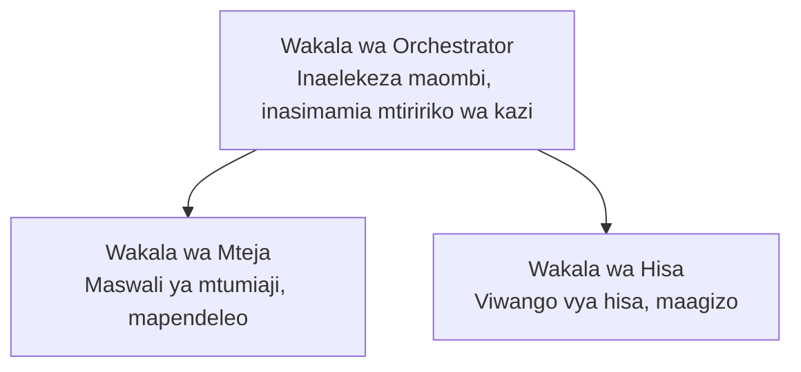

# Sura 5: Suluhisho za AI za Wakala Wengi

**📚 Kozi**: [AZD For Beginners](../../README.md) | **⏱️ Muda**: 2-3 saa | **⭐ Ugumu**: Ngumu

---

## Muhtasari

Sura hii inashughulikia mifumo ya usanifu ya mawakala wengi yenye maendeleo, uratibu wa mawakala, na uenezaji wa AI unaofaa kwa uzalishaji kwa matukio tata.

## Malengo ya Kujifunza

Baada ya kumaliza sura hii, utaweza:
- Elewa mifumo ya usanifu ya mawakala wengi
- Eneza mifumo ya mawakala wa AI iliyoratibiwa
- Tekeleza mawasiliano kati ya mawakala
- Jenga suluhisho za wakala wengi zinazofaa kwa uzalishaji

---

## 📚 Masomo

| # | Somo | Maelezo | Muda |
|---|--------|-------------|------|
| 1 | [Suluhisho la Wakala Wengi kwa Rejareja](../../examples/retail-scenario.md) | Mwongozo kamili wa utekelezaji | 90 dakika |
| 2 | [Mifumo ya Uratibu](../chapter-06-pre-deployment/coordination-patterns.md) | Mikakati ya uratibu wa mawakala | 30 dakika |
| 3 | [Utekelezaji wa Templati ya ARM](../../examples/retail-multiagent-arm-template/README.md) | Uwekaji kwa bonyeza moja | 30 dakika |

---

## 🚀 Anza Haraka

```bash
# Chaguo 1: Anzisha kutoka kwa kiolezo
azd init --template agent-openai-python-prompty
azd up

# Chaguo 2: Anzisha kutoka kwa manifesti ya wakala (inahitaji ugani wa azure.ai.agents)
azd extension install azure.ai.agents
azd ai agent init -m agent-manifest.yaml
azd up
```

> **Njia gani?** Tumia `azd init --template` kuanza kutoka kwa sampuli inayofanya kazi. Tumia `azd ai agent init` unapokuwa na manifest ya wakala mwenyewe. Angalia rejea ya [Rejea ya AZD AI CLI](../chapter-08-production/production-ai-practices.md#azd-ai-cli-commands-and-extensions) kwa maelezo kamili.

---

## 🤖 Usanifu wa Wakala Wengi


---

## 🎯 Suluhisho Iliyotangazwa: Suluhisho la Wakala Wengi kwa Rejareja

The [Suluhisho la Wakala Wengi kwa Rejareja](../../examples/retail-scenario.md) linaonyesha:

- **Wakala wa Mteja**: Hushughulikia mwingiliano na mapendeleo ya watumiaji
- **Wakala wa Hifadhi**: Husimamia hisa na usindikaji wa maagizo
- **Mratibu**: Anaratibu kati ya mawakala
- **Kumbukumbu Iliyoshirikiwa**: Usimamizi wa muktadha wa mawakala mbalimbali

### Huduma Zilitumika

| Huduma | Madhumuni |
|---------|---------|
| Microsoft Foundry Models | Uelewa wa lugha |
| Azure AI Search | Katalogi ya bidhaa |
| Cosmos DB | Hali na kumbukumbu ya wakala |
| Container Apps | Ukaribishaji wa mawakala |
| Application Insights | Ufuatiliaji |

---

## 🔗 Urambazaji

| Mwelekeo | Sura |
|-----------|---------|
| **Iliyopita** | [Sura 4: Miundombinu](../chapter-04-infrastructure/README.md) |
| **Ifuatayo** | [Sura 6: Kabla ya Ueneaji](../chapter-06-pre-deployment/README.md) |

---

## 📖 Rasilimali Zinazohusiana

- [Mwongozo wa Wakala za AI](../chapter-02-ai-development/agents.md)
- [Mazoea ya AI kwa Uzalishaji](../chapter-08-production/production-ai-practices.md)
- [Utatuzi wa Matatizo ya AI](../chapter-07-troubleshooting/ai-troubleshooting.md)

---

<!-- CO-OP TRANSLATOR DISCLAIMER START -->
**Taarifa ya kutokuwajibika**:
Nyaraka hii imetafsiriwa kwa kutumia huduma ya tafsiri ya AI [Co-op Translator](https://github.com/Azure/co-op-translator). Ingawa tunajitahidi kufikia usahihi, tafadhali fahamu kwamba tafsiri za kiotomatiki zinaweza kuwa na makosa au kutokukamilika. Nyaraka ya asili katika lugha yake ya awali inapaswa kuchukuliwa kama chanzo chenye mamlaka. Kwa taarifa muhimu, inashauriwa kutumia tafsiri ya kitaalamu iliyofanywa na mtaalamu wa binadamu. Hatuwajibiki kwa kutoelewana au tafsiri potofu zitokanazo na matumizi ya tafsiri hii.
<!-- CO-OP TRANSLATOR DISCLAIMER END -->