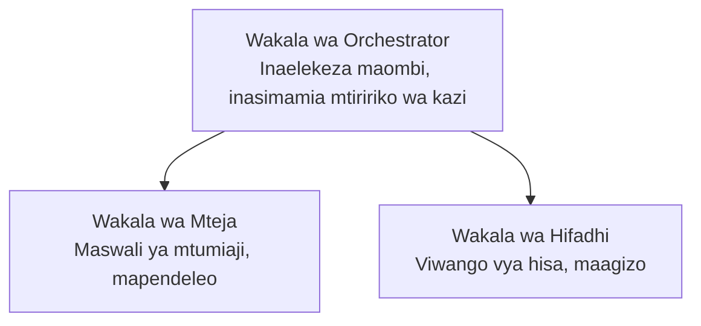

# Sura 5: Suluhisho za AI za Wakala Wengi

**📚 Kozi**: [AZD For Beginners](../../README.md) | **⏱️ Muda**: 2-3 masaa | **⭐ Ugumu**: Juu

---

## Muhtasari

Sura hii inashughulikia mifumo ya usanifu ya wakala wengi ya hali ya juu, uratibu wa mawakala, na utoaji wa AI tayari kwa uzalishaji kwa hali ngumu.

> Imethibitishwa dhidi ya `azd 1.25.6` mnamo Juni 2026.

## Malengo ya Kujifunza

Kwa kumaliza sura hii, utakuwa umeweza:
- Kuelewa mifumo ya usanifu wa mawakala wengi
- Kuweka mifumo ya mawakala wa AI yaliyoratibiwa
- Kutekeleza mawasiliano kati ya mawakala
- Kujenga suluhisho za mawakala wengi tayari kwa uzalishaji

---

## 📚 Masomo

| # | Lesson | Description | Time |
|---|--------|-------------|------|
| 1 | [Misingi ya Wakala Wengi](multi-agent-basics.md) | Vitendo: weka programu ya mawakala wengi inayofanya kazi kwa kutumia `azd up` | 45 dakika |
| 2 | [Mifumo ya Uratibu](../chapter-06-pre-deployment/coordination-patterns.md) | Mikakati ya uratibu wa mawakala (inaendelea katika Sura 6) | 30 dakika |
| 3 | [Utekelezaji wa Templeti za ARM](../../examples/retail-multiagent-arm-template/README.md) | Mfano wa utekelezaji kwa bonyeza moja | 30 dakika |

> **Anza na Somo la 1.** Ndiyo tu somo lenye vitendo kamili na linaloweza kutekelezwa katika sura hii. Somo la 2 lipo katika Sura 6 (linashirikishwa na upangaji kabla ya utekelezaji), na [Suluhisho la Wakala Wingi la Rejareja](../../examples/retail-scenario.md) ni ramani ya usanifu—rejeleo la muundo, si templeti ya amri moja.

---

## 🚀 Anza Haraka

```bash
# Chaguo 1: Peleka kutoka kwa kiolezo
azd init --template agent-openai-python-prompty
azd up

# Chaguo 2: Peleka kutoka kwa manifesti ya wakala (inahitaji kiendelezi cha azure.ai.agents)
azd extension install azure.ai.agents
azd ai agent init -m agent-manifest.yaml
azd up
```

> **Njia gani?** Tumia `azd init --template` kuanza kutoka kwenye sampuli inayofanya kazi. Tumia `azd ai agent init` unapokuwa na manifesto yako ya wakala. Tazama [Marejeleo ya AZD AI CLI](../chapter-08-production/production-ai-practices.md#azd-ai-cli-commands-and-extensions) kwa maelezo kamili.

---

## 🤖 Usanifu wa Wakala Wengi



---

## 🎯 Suluhisho Lililoangaziwa: Wakala Wingi wa Rejareja

The [Suluhisho la Wakala Wingi la Rejareja](../../examples/retail-scenario.md) huonyesha:

- **Wakala wa Mteja**: Hushughulikia mwingiliano na mapendeleo ya mtumiaji
- **Wakala wa Orodha ya Bidhaa**: Husimamia hisa na usindikaji wa maagizo
- **Mratibu**: Anaratibu kati ya mawakala
- **Kumbukumbu Iliyoshirikiwa**: Usimamizi wa muktadha kati ya mawakala

### Huduma Zinazotumika

| Service | Purpose |
|---------|---------|
| Microsoft Foundry Models | Uelewa wa lugha |
| Azure AI Search | Katalogi ya bidhaa |
| Cosmos DB | Hali na kumbukumbu ya wakala |
| Container Apps | Kuendesha mawakala |
| Application Insights | Ufuatiliaji |

---

## 🔗 Uabiri

| Direction | Chapter |
|-----------|---------|
| **Iliyopita** | [Sura 4: Miundombinu](../chapter-04-infrastructure/README.md) |
| **Inayofuata** | [Sura 6: Kabla ya Utekelezaji](../chapter-06-pre-deployment/README.md) |

---

## 📖 Rasilimali Zinazohusiana

- [Mwongozo wa Mawakala wa AI](../chapter-02-ai-development/agents.md)
- [Mbinu za AI kwa Uzalishaji](../chapter-08-production/production-ai-practices.md)
- [Utatuzi wa Matatizo ya AI](../chapter-07-troubleshooting/ai-troubleshooting.md)

---

<!-- CO-OP TRANSLATOR DISCLAIMER START -->
**Kionyozo**:
Hati hii imetafsiriwa kwa kutumia huduma ya tafsiri ya AI [Co-op Translator](https://github.com/Azure/co-op-translator). Ingawa tunajitahidi kupata usahihi, tafadhali fahamu kwamba tafsiri za kiotomatiki zinaweza kuwa na makosa au upungufu wa usahihi. Hati ya asili katika lugha yake halisi inapaswa kuchukuliwa kama chanzo cha mamlaka. Kwa taarifa muhimu, tafsiri ya kitaalamu inayofanywa na binadamu inapendekezwa. Hatutojibu kwa kuelewa vibaya au tafsiri potofu zinazotokea kutokana na matumizi ya tafsiri hii.
<!-- CO-OP TRANSLATOR DISCLAIMER END -->