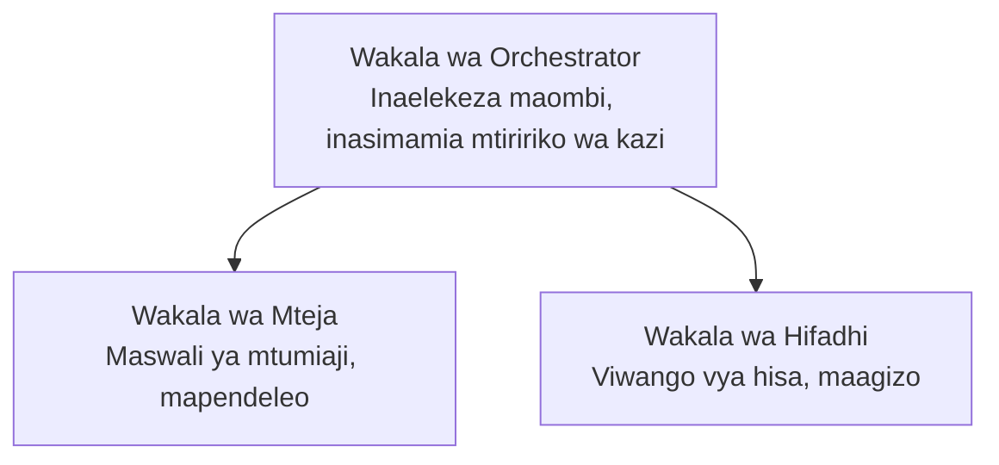

# Sura 5: Suluhisho za AI za Wakala Wengi

**📚 Kozi**: [AZD Kwa Waanziaji](../../README.md) | **⏱️ Muda**: masaa 2-3 | **⭐ Ugumu**: Ngumu

---

## Muhtasari

Sura hii inashughulisha mifumo ya usanifu ya wakala wengi yenye kiwango cha juu, upangaji wa wakala, na ueneaji wa AI ambao uko tayari kwa uzalishaji kwa matukio tata.

> Imethibitishwa na `azd 1.23.12` katika Machi 2026.

## Malengo ya Kujifunza

Kwa kumaliza sura hii, utaweza:
- Kuelewa mifumo ya usanifu ya wakala wengi
- Kuweka mifumo ya wakala za AI zinazoratibika
- Kutekeleza mawasiliano kati ya wakala
- Kujenga suluhisho za wakala wengi tayari kwa uzalishaji

---

## 📚 Masomo

| # | Somo | Maelezo | Muda |
|---|--------|-------------|------|
| 1 | [Suluhisho la Wakala Wengi la Rejareja](../../examples/retail-scenario.md) | Mwongozo kamili wa utekelezaji | 90 dakika |
| 2 | [Mifumo ya Uratibu](../chapter-06-pre-deployment/coordination-patterns.md) | Mikakati ya upangaji wa wakala | 30 dakika |
| 3 | [Utekelezaji wa Template ya ARM](../../examples/retail-multiagent-arm-template/README.md) | Utekelezaji kwa bonyeza moja | 30 dakika |

---

## 🚀 Mwanzo wa Haraka

```bash
# Chaguo 1: Sambaza kutoka kwa kiolezo
azd init --template agent-openai-python-prompty
azd up

# Chaguo 2: Sambaza kutoka kwa maelezo ya wakala (inahitaji kiendelezi cha azure.ai.agents)
azd extension install azure.ai.agents
azd ai agent init -m agent-manifest.yaml
azd up
```

> **Ni njia gani?** Tumia `azd init --template` kuanza kutoka kwenye sampuli inayofanya kazi. Tumia `azd ai agent init` unapokuwa na manifest ya wakala yako. Tazama the [Marejeo ya AZD AI CLI](../chapter-08-production/production-ai-practices.md#azd-ai-cli-commands-and-extensions) kwa maelezo kamili.

---

## 🤖 Usanifu wa Wakala Wengi


---

## 🎯 Suluhisho Lililoangaziwa: Suluhisho la Wakala Wengi la Rejareja

Mfano wa [Suluhisho la Wakala Wengi la Rejareja](../../examples/retail-scenario.md) unaonyesha:

- **Wakala wa Mteja**: Hushughulikia mwingiliano wa watumiaji na mapendeleo yao
- **Wakala wa Hisa**: Husimamia hisa na uchakataji wa maagizo
- **Mratibu**: Anaratibu kati ya wakala
- **Kumbukumbu ya Pamoja**: Usimamizi wa muktadha unaoshirikishwa kati ya wakala

### Huduma Zilitumika

| Service | Purpose |
|---------|---------|
| Microsoft Foundry Models | Uelewa wa lugha |
| Azure AI Search | Katalogi ya bidhaa |
| Cosmos DB | Hali ya wakala na kumbukumbu |
| Container Apps | Kuendesha wakala |
| Application Insights | Ufuatiliaji |

---

## 🔗 Urambazaji

| Mwelekeo | Sura |
|-----------|---------|
| **Iliyopita** | [Sura 4: Miundombinu](../chapter-04-infrastructure/README.md) |
| **Inayofuata** | [Sura 6: Kabla ya Utekelezaji](../chapter-06-pre-deployment/README.md) |

---

## 📖 Rasilimali Zinazohusiana

- [Mwongozo wa Wakala wa AI](../chapter-02-ai-development/agents.md)
- [Mbinu za AI za Uzalishaji](../chapter-08-production/production-ai-practices.md)
- [Utatuzi wa Matatizo ya AI](../chapter-07-troubleshooting/ai-troubleshooting.md)

---

<!-- CO-OP TRANSLATOR DISCLAIMER START -->
**Disclaimer**:
Dokumenti hii imetafsiriwa kwa kutumia huduma ya tafsiri ya AI [Co-op Translator](https://github.com/Azure/co-op-translator). Ingawa tunajitahidi kufikia usahihi, tafadhali fahamu kwamba tafsiri za kiotomatiki zinaweza kuwa na makosa au ukosefu wa usahihi. Nyaraka ya asili kwa lugha yake inapaswa kuzingatiwa kama chanzo chenye mamlaka. Kwa taarifa muhimu, tafsiri ya kitaalamu ya kibinadamu inashauriwa. Hatutawajibika kwa uelewa mbaya au tafsiri potofu zitakazotokana na matumizi ya tafsiri hii.
<!-- CO-OP TRANSLATOR DISCLAIMER END -->