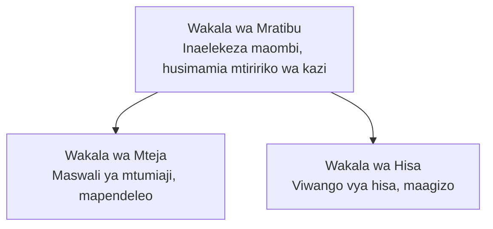

# Sura ya 5: Ufumbuzi wa AI wa Wakala Wengi

**📚 Kozi**: [AZD Kwa Waanzilishi](../../README.md) | **⏱️ Muda**: Saa 2-3 | **⭐ Ugumu**: Juu

---

## Muhtasari

Sura hii inashughulikia mifumo ya hali ya juu ya usanifu wa wakala wengi, uratibu wa mawakala, na uanzishaji wa AI tayari kwa uzalishaji kwa hali ngumu.

> Imethibitishwa dhidi ya `azd 1.27.1` mwezi Julai 2026.

## Malengo ya Kujifunza

Kwa kumaliza sura hii, utaweza:
- Kuelewa mifumo ya usanifu wa wakala wengi
- Kuanzisha mifumo ya wakala wa AI inayoratibiwa
- Kutekeleza mawasiliano kati ya mawakala
- Kujenga ufumbuzi wa wakala wengi tayari kwa uzalishaji

---

## 📚 Masomo

| # | Somo | Maelezo | Muda |
|---|--------|-------------|------|
| 1 | [Misingi ya Wakala Wengi](multi-agent-basics.md) | Vitendo: anza programu inayoendesha wakala wengi kwa `azd up` | Dakika 45 |
| 2 | [Mifumo ya Uratibu](../chapter-06-pre-deployment/coordination-patterns.md) | Mikakati ya uratibu wa mawakala (inaendelea katika Sura 6) | Dakika 30 |
| 3 | [Uanzishaji wa Kiolezo cha ARM](../../examples/retail-multiagent-arm-template/README.md) | Mfano wa uanzishaji kwa bonyeza moja | Dakika 30 |

> **Anza na Somo la 1.** Ndilo somo pekee la vitendo, linaloweza kuanzishwa kikamilifu katika sura hii. Somo la 2 lipo katika Sura 6 (linashirikiana na upangaji kabla ya uanzishaji), na [Ufumbuzi wa Retail Multi-Agent](../../examples/retail-scenario.md) ni mchoro wa usanifu—rejea ya muundo, sio kiolezo cha amri moja.

---

## 🚀 Anza Haraka

```bash
# Chaguo 1: Tumia kutoka kwa kiolezo
azd init --template agent-openai-python-prompty
azd up

# Chaguo 2: Tumia kutoka kwa maelezo ya wakala (inahitaji nyongeza ya azure.ai.agents)
azd extension install azure.ai.agents
azd ai agent init -m agent-manifest.yaml
azd up
```

> **Njia gani?** Tumia `azd init --template` kuanzia sampuli inayofanya kazi. Tumia `azd ai agent init` unapokuwa na hati ya wakala wako mwenyewe. Angalia [marejeleo ya AZD AI CLI](../chapter-08-production/production-ai-practices.md#azd-ai-cli-commands-and-extensions) kwa maelezo kamili.

---

## 🤖 Usanifu wa Wakala Wengi



---

## 🎯 Ufumbuzi Uliotajwa: Retail Multi-Agent

[Ufumbuzi wa Retail Multi-Agent](../../examples/retail-scenario.md) unaonyesha:

- **Wakala wa Mteja**: Husimamia mwingiliano na mapendeleo ya mtumiaji
- **Wakala wa Hesabu ya Bidhaa**: Husimamia hesabu na usindikaji wa oda
- **Mratibu**: Anaratibu kati ya mawakala
- **Kumbukumbu Ilioshirikiwa**: Usimamizi wa muktadha kati ya mawakala

### Huduma Zinazotumika

| Huduma | Kusudi |
|---------|---------|
| Microsoft Foundry Models | Uelewa wa lugha |
| Azure AI Search | Katalogi ya bidhaa |
| Cosmos DB | Hali na kumbukumbu ya wakala |
| Container Apps | Utoaji wa wakala |
| Application Insights | Ufuatiliaji |

---

## 🔗 Usogezaji

| Mwelekeo | Sura |
|-----------|---------|
| **Iliyopita** | [Sura 4: Miundombinu](../chapter-04-infrastructure/README.md) |
| **Ifuatayo** | [Sura 6: Kabla ya Uanzishaji](../chapter-06-pre-deployment/README.md) |

---

## 📖 Rasilimali Zinazohusiana

- [Mwongozo wa Wakala wa AI](../chapter-02-ai-development/agents.md)
- [Mazingira ya AI kwa Uzalishaji](../chapter-08-production/production-ai-practices.md)
- [Utatuzi wa Matatizo ya AI](../chapter-07-troubleshooting/ai-troubleshooting.md)

---

<!-- CO-OP TRANSLATOR DISCLAIMER START -->
**Kionyozo**:
Hati hii imetafsiriwa kwa kutumia huduma ya tafsiri ya AI [Co-op Translator](https://github.com/Azure/co-op-translator). Ingawa tunajitahidi kupata usahihi, tafadhali fahamu kwamba tafsiri za kiotomatiki zinaweza kuwa na makosa au upungufu wa usahihi. Hati ya asili katika lugha yake halisi inapaswa kuchukuliwa kama chanzo cha mamlaka. Kwa taarifa muhimu, tafsiri ya kitaalamu inayofanywa na binadamu inapendekezwa. Hatutojibu kwa kuelewa vibaya au tafsiri potofu zinazotokea kutokana na matumizi ya tafsiri hii.
<!-- CO-OP TRANSLATOR DISCLAIMER END -->