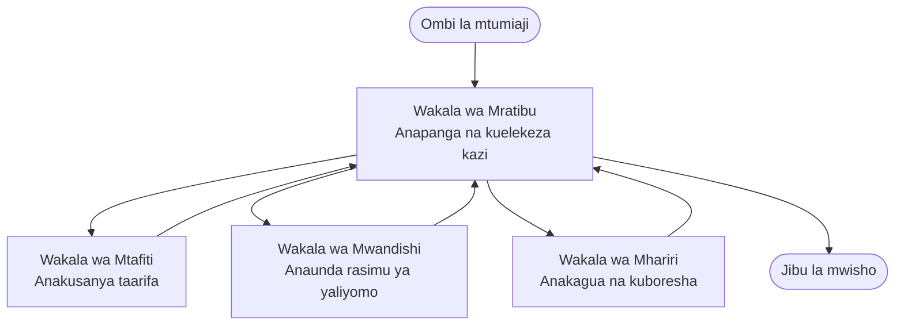

# Misingi ya Wakala Wengi - Weka Mfumo Wako wa Kwanza wa AI Ulioratibiwa

**Uabiri wa Sura:**
- **📚 Nyumbani ya Kozi**: [AZD For Beginners](../../README.md)
- **📖 Sura ya Sasa**: Sura 5 - Suluhisho za AI za Wakala Wengi
- **⬅️ Iliyopita**: [Sura 4: Miundombinu](../chapter-04-infrastructure/README.md)
- **➡️ Ifuatayo**: [Mifumo ya Uratibu](../chapter-06-pre-deployment/coordination-patterns.md)

> Imethibitishwa kwa `azd 1.25.6` Juni 2026.

## Utangulizi

Katika sura za awali uliweka programu moja—na katika Sura 2 uliweka wakala mmoja wa AI. Somo hili linachukua hatua inayofuata: kupeleka **mfumo wa wakala wengi**, ambapo mawakala kadhaa maalum hufanya kazi pamoja kutatua tatizo ambalo wakala mmoja hautaweza kulishughulikia vizuri peke yake.

Habari njema kwa waanziaji: **haufai maagizo mapya.** Suluhisho la wakala wengi bado ni mradi wa azd. Utahifadhi `azd init`, `azd up`, kujaribu, na `azd down`—hasa mwenendo wa kazi ulioujuwa tayari. Kinachobadilika ni *mwangaza* wa programu ndani.

## Malengo ya Kujifunza

Mwisho wa somo hili, utaweza:
- Kuelewa maana ya "wakala wengi" na lini inafaa kwa ugumu wa ziada
- Kutambua nafasi za kawaida katika mfumo wa wakala wengi (mratibu + maalum)
- Kuweka kiolezo cha wakala wengi kinachofanya kazi kwa `azd up`
- Kuelewa rasilimali za Azure zinazosupporta programu ya wakala wengi
- Kujua jinsi ya kuthibitisha, kubinafsisha, na kuondoa suluhisho kwa usalama

## Matokeo ya Kujifunza

Baada ya kumaliza somo hili, utaweza:
- Eleza tofauti kati ya wakala mmoja na mfumo wa wakala wengi
- Chagua kati ya wakala mmoja akiwa na zana na muundo halisi wa wakala wengi
- Weka na kujaribu kiolezo cha wakala wengi mwishoni hadi mwishowe kwa azd
- Tambua wapi kila wakala anaendesha na jinsi wanavyowasiliana
- Safisha rasilimali zote ili kuepuka gharama zinazoendelea

---

## Je, Mfumo wa Wakala Wengi Ni Nini?

Wakala mmoja wa AI ni mfano mmoja ulio na seti ya maagizo na (hiari) zana fulani. Hilo linafanya kazi vizuri kwa kazi zilizolenga. Lakini kazi inapoendelea—tafiti, kisha uandishi, kisha uhariri, kisha uhakiki wa ukweli—kuweka kila kitu kwenye prompt moja kunafanya wakala kuwa polepole, usio na uhakika, na mgumu kusahihisha.

Mfumo wa **wakala wengi** unagawanya kazi kwa wawekezaji walio maalumu ambao kila mmoja hufanya kazi moja vizuri, zikiratibiwa na mratibu:



### Nafasi mbili utakazoziona kila wakati

| Role | Job | Example |
|------|-----|---------|
| **Mratibu** | Huamua *nini kitakachotokea kifuatacho* na kutuma kazi kati ya mawakala | "Kwanza kufanya utafiti, kisha kuandika, kisha kuhariri" |
| **Mtaalamu/Maalum** | Hufanya kazi moja iliyolengwa na kurudisha matokeo | "mtafiti" ambaye anakusanya tu ukweli |

### Je, kwa kweli unahitaji mawakala wengi?

Anza kwa urahisi. Fikia kwa wakala wengi **tu** wakati mojawapo ya yafuatayo ni kweli:

- ✅ Kazi ina **vigezo tofauti** vinavyofaidika na maagizo tofauti (tafiti vs. kuandika vs. kupitia)
- ✅ Unataka wataalamu waendeshe **kwa wakati mmoja** ili kuokoa muda
- ✅ Hatua tofauti zinahitaji **zana au vyanzo tofauti vya data**
- ✅ Unahitaji kila hatua iwe **inayoweza kupimwa na kusahihishwa kikaboni**

Kama kazi yako ni swali-jibu moja au mwito rahisi wa zana, **wakala mmoja akiwa na zana** (Sura 2) ni rahisi zaidi, ya gharama nafuu, na rahisi kuendesha.

> **Ushauri kwa Muanza:** "Mawakala wengi zaidi" sio "bora." Kila wakala anaongeza ucheleweshaji, gharama, na kitu kipya cha kufuatilia. Ongeza mawakala tu wakati tatizo linaonekana wazi kugawanyika katika sehemu.

---

## Njia Mbili za Kujenga Wakala Wengi kwenye Azure

| Approach | What it is | Best for |
|----------|-----------|----------|
| **Wakala mmoja + zana** | Wakala mmoja wa Foundry anayefanya mwito wa kazi/zana | Mifumo rahisi, kuanza haraka |
| **Mawakala wengi walioratibiwa** | Mawakala kadhaa na mratibu mmoja | Vigezo tofauti, kazi sambamba, utaalam |

Somo hili linazingatia njia ya pili kwa kutumia **kiolezo kilicho tayari**, ili uone mfumo halisi wa wakala wengi ukifanya kazi kabla ya kujenga yako mwenyewe.

---

## Kazi Mikononi: Weka Programu ya Wakala Wengi Inayofanya Kazi

Tutaunda **Contoso Creative Writer**, sampuli rasmi ya Azure inayotumia mawakala kadhaa (mtafiti, mwandishi, mhariri) walioratibiwa kutengeneza makala. Ni programu nzuri ya kwanza ya wakala wengi kwa sababu nafasi hizo ni rahisi kuelewa.

### Hatua 1: Anzisha kiolezo

```bash
# Unda folda ya kazi
mkdir creative-writer && cd creative-writer

# Anzisha kutoka kwa kiolezo rasmi cha wakala wengi
azd init --template contoso-creative-writer
```

> Vinjari kiolezo zaidi cha wakala wengi wakati wowote katika [Awesome AZD AI gallery](https://azure.github.io/awesome-azd/?tags=ai). Chaguzi nyingine rafiki kwa waanziaji ni `get-started-with-ai-agents` na `azure-ai-travel-agents`.

### Hatua 2: Thibitisha utambulisho

```bash
# Inahitajika kwa mtiririko wa kazi za azd
azd auth login
```

### Hatua 3: Unda mazingira

```bash
azd env new dev
```

### Hatua 4: Hakiki, kisha weka

```bash
# Tazama yatakayoundwa kabla ya kutumia chochote (inashauriwa)
azd provision --preview

# Andaa miundombinu na weka mawakala wote kwa hatua moja
azd up
```

`azd up` itakuuliza uweke usajili na eneo, kisha itatoa rasilimali za Azure na kuweka programu. Utekelezaji wa AI unaweza kuchukua muda zaidi kuliko programu rahisi ya wavuti—ikiwa unaweka mifano kubwa zaidi, unaweza kuongeza muda wa kusubiri wa utekelezaji:

```bash
azd deploy --timeout 1800
```

> **Kumbuka kuhusu gharama na uwezo:** Programu za wakala wengi zinaweka mifano ya AI inayotumia quota na kuleta gharama. Ikiwa `azd up` inashindwa kwa sababu ya quota ya modeli, angalia [AI Troubleshooting](../chapter-07-troubleshooting/ai-troubleshooting.md) kwa marekebisho ya eneo na quota, na Sura 6 [Mipango ya Uwezo](../chapter-06-pre-deployment/capacity-planning.md).

---

## Kuelewa Ulikojea

Programu ya kawaida ya wakala wengi kama hii huweka seti ya rasilimali za Azure zinazolingana moja kwa moja na wajibu katika mchoro hapo juu:

| Resource | Why it's there |
|----------|----------------|
| **Microsoft Foundry / Models** | Inahifadhi mifano ya lugha ambazo kila wakala anazitumia |
| **Azure AI Search** | Inampa wakala wa mtafiti data iliyothibitishwa ya kutafuta |
| **Container Apps** (au App Service) | Inahifadhi mratibu na msimbo wa mawakala |
| **Cosmos DB** (katika baadhi ya sampuli) | Inahifadhi hali/ukurasa wa kumbukumbu unaoshirikiwa kati ya mawakala |
| **Application Insights** | Inafuatilia maombi *mbele ya* mawakala ili uweze kusahihisha mchakato |

### Jinsi mawakala wanavyowasiliana

Katika sampuli nyingi za azd za wakala wengi, **mratibu anaendesha ndani ya msimbo wa programu yako** (kwa mfano, kwa kutumia fremu kama Semantic Kernel au Microsoft Agent Framework). Mratibu anaita kila wakala maalum kwa mfululizo, analeta matokeo, na kutengeneza jibu la mwisho. Wakala wanashirikiana muktadha kupitia:

- **Miito ya kazi/zana** — mratibu anamtumia mtaalamu na kurudisha matokeo
- **Kumbukumbu iliyoshirikiwa** — hifadhidata (mara nyingi Cosmos DB) inahifadhi hali ambayo mawakala yote wanaweza kusoma
- **Ujumbe/tukio** — kwa uunganisho mdogo, mawakala huwasiliana kupitia foleni au Service Bus

> **Kwanini hili ni muhimu kwa kusahihisha:** kwa kuwa kila hatua ni tofauti, Application Insights inaonyesha *wakala gani* alikuwa pole au alishindwa. Hilo ni sababu kuu ya kugawanya kazi kwa mawakala.

---

## Thibitisha Utekelezaji

Thibitisha mfumo unafanya kazi kabla ya kuendelea:

```bash
# Onyesha endpoints zilizowekwa
azd show

# Fungua dashibodi ya ufuatiliaji ya programu
azd monitor

# Fuata logi kama kuna kitu kinavyoonekana si sawa
azd monitor --logs
```

Kisha fungua URL ya programu kutoka `azd show` na jaribu ombi linalochosha mawakala yote (kwa Creative Writer, muulize iandike makala fupi juu ya mada). Katika Application Insights **tafutaji la muamala**, utatakiwa kuona ombi likiaga kwa hatua za mtafiti, mwandishi, na mhariri.

**Vigezo vya mafanikio:**
- ✅ `azd show` inaorodhesha endpoint inayoweza kufikiwa
- ✅ Ombi linatoa matokeo ambayo kwa uwazi yalipitia hatua nyingi
- ✅ Application Insights inaonyesha ufuatiliaji kwa zaidi ya hatua ya wakala mmoja

---

## Binafsisha: Ongeza au Rekebisha Wakala

Kwa kuwa kila wakala ni maagizo pamoja na zana, kubinafsisha ni rahisi:

1. **Tafuta ufafanuzi wa mawakala** katika kiolezo (mara nyingi folda `prompts/`, `agents/`, au faili za `*.prompty`).
2. **Rekebisha maagizo ya wakala** — kwa mfano, waambie wakala mhariri kutekeleza tona maalum au idadi ya maneno.
3. **Tumia tena tu msimbo** (miundombinu haijabadilika):

   ```bash
   azd deploy
   ```

Ili kwenda mbali zaidi na kujenga mawakala kutoka kwa *manifest* yako mwenyewe, tumia ugani wa wakala na mzunguko wake kamili wa maisha:

```bash
azd extension install azure.ai.agents
azd ai agent init -m agent-manifest.yaml
azd up
azd ai agent invoke      # jaribio, na muda wa majibu
```

Angalia [Sura 2: Mawakala](../chapter-02-ai-development/agents.md) na [AZD AI CLI reference](../chapter-08-production/production-ai-practices.md#azd-ai-cli-commands-and-extensions) kwa mzunguko kamili wa maisha ya wakala (`invoke`, `eval generate`, `optimize`, `delete`).

---

## Safisha

Programu za wakala wengi zinaendesha huduma nyingi zinazolipishwa. Ondoa kila kitu unachokamilisha:

```bash
azd down --force --purge
```

Bendera ya `--purge` pia inaondoa rasilimali za AI zilizofutwa kwa upole (kama Foundry/Azure AI Services accounts) ili zisizuie urekebishaji wa baadaye au kuendelea kuleta gharama.

---

## Kumbusho kuhusu Mifumo ya Wakala Wengi za Uzalishaji

[Suluhisho la Wakala Wengi la Rejareja](../../examples/retail-scenario.md) katika repo hii ni **rasimu ya usanifu**, sio kiolezo cha amri-moja—inaandika jinsi mfumo wa rejareja wa uzalishaji *ungerejewa* kujengwa (na inaeleza wazi kwamba ujenzi kamili ni jitihada kubwa). Itumie kama rejea ya muundo *baada ya* umeweka sampuli inayofanya kazi hapa. Kwa masuala ya uzalishaji (uvumilivu, gharama, ufuatiliaji, utawala), endelea kwa [Sura 8: Mbinu za AI za Uzalishaji](../chapter-08-production/production-ai-practices.md).

---

## Muhtasari

- Mfumo wa wakala wengi hugawanya kazi kwa maalumu waliooratibiwa na mratibu.
- Utaitumia tu wakati kazi ina vigezo tofauti, ufanisi wa sambamba, au zana tofauti kwa kila hatua—vinginevyo chagua wakala mmoja.
- Mtiririko wa azd haujabadilika: `azd init` → `azd up` → test → `azd down`.
- Kiolezo halisi kama `contoso-creative-writer` kinakuwezesha kuona na kubinafsisha programu ya wakala wengi inayofanya kazi sasa.
- Ufuatiliaji wa Application Insights kupitia mawakala ni mojawapo ya faida kubwa za vitendo za muundo wa wakala wengi.

---

## 🔗 Uabiri

| Direction | Lesson |
|-----------|--------|
| **Iliyopita** | [Sura 4: Miundombinu](../chapter-04-infrastructure/README.md) |
| **Ifuatayo** | [Mifumo ya Uratibu](../chapter-06-pre-deployment/coordination-patterns.md) |

## 📖 Rasilimali Zinazohusiana

- [Mwongozo wa Mawakala wa AI](../chapter-02-ai-development/agents.md)
- [Mifumo ya Uratibu](../chapter-06-pre-deployment/coordination-patterns.md)
- [Mbinu za AI za Uzalishaji](../chapter-08-production/production-ai-practices.md)
- [Utatuzi wa Matatizo ya AI](../chapter-07-troubleshooting/ai-troubleshooting.md)

---

<!-- CO-OP TRANSLATOR DISCLAIMER START -->
**Kionyozo**:
Hati hii imetafsiriwa kwa kutumia huduma ya tafsiri ya AI [Co-op Translator](https://github.com/Azure/co-op-translator). Ingawa tunajitahidi kupata usahihi, tafadhali fahamu kwamba tafsiri za kiotomatiki zinaweza kuwa na makosa au upungufu wa usahihi. Hati ya asili katika lugha yake halisi inapaswa kuchukuliwa kama chanzo cha mamlaka. Kwa taarifa muhimu, tafsiri ya kitaalamu inayofanywa na binadamu inapendekezwa. Hatutojibu kwa kuelewa vibaya au tafsiri potofu zinazotokea kutokana na matumizi ya tafsiri hii.
<!-- CO-OP TRANSLATOR DISCLAIMER END -->