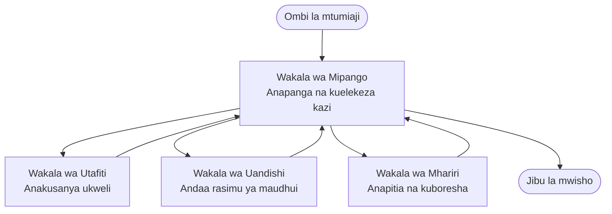

# Misingi ya Wakala-Wengi - Tumikia Mfumo Wako wa AI Ulio Unganishwa wa Kwanza

**Uelekezaji wa Sura:**
- **📚 Msingi wa Kozi**: [AZD Kwa Waanzilishi](../../README.md)
- **📖 Sura ya Sasa**: Sura 5 - Suluhisho za AI za Wakala-Wengi
- **⬅️ Iliyotangulia**: [Sura 4: Miundombinu](../chapter-04-infrastructure/README.md)
- **➡️ Ifuatayo**: [Mifumo ya Kuratibu](../chapter-06-pre-deployment/coordination-patterns.md)

> Imethibitishwa dhidi ya `azd 1.27.1` Julai 2026.

## Utangulizi

Katika sura za awali uliweka programu moja—na katika Sura ya 2 uliweka wakala mmoja wa AI. Somo hili linachukua hatua inayofuata: kuweka mfumo wa **wakala-wengi**, ambapo mawakala kadhaa maalum hufanya kazi pamoja kutatua tatizo ambalo wakala mmoja hawezi kulitatua vyema peke yake.

Habari njema kwa waanzilishi: **huna haja ya amri mpya.** Suluhisho la wakala-wengi bado ni mradi wa azd. Utafanya `azd init`, `azd up`, jaribu, na `azd down`—mtiririko sawa kabisa ambao tayari unajua. Kinachobadilika ni *umbo* la programu ndani.

## Malengo ya Kujifunza

Mwisho wa somo hili, utakuwa umeweza:
- Kuelewa maana ya "wakala-wengi" na ni lini inafaa kwa ugumu zaidi
- Kutambua majukumu ya kawaida katika mfumo wa wakala-wengi (mratibu + maalum)
- Kuweka kiolezo kinachofanya kazi cha wakala-wengi kwa `azd up`
- Kuelewa rasilimali za Azure zinazounga mkono programu ya wakala-wengi
- Kujua jinsi ya kuthibitisha, kubinafsisha, na kuondoa suluhisho salama

## Matokeo ya Kujifunza

Baada ya kumaliza somo hili, utaweza:
- Eleza tofauti kati ya wakala mmoja na mfumo wa wakala-wengi
- Chagua kati ya wakala mmoja mwenye zana na usanifu wa kweli wa wakala-wengi
- Weka na jaribu kiolezo cha wakala-wengi kumalizia kwa azd
- Tambua mahali kila wakala anavyofanya kazi na jinsi wanavyoshirikiana
- Safisha rasilimali zote ili kuepuka malipo yanayoendelea

---

## Mfumo wa Wakala-Wengi ni Nini?

Wakala mmoja wa AI ni mfano mmoja wenye seti ya maagizo na (hiari) baadhi ya zana. Hii hufanya kazi vizuri kwa kazi zilizo na lengo moja. Lakini kazi inapoendelea—tafiti, kisha uandishi, kisha uhariri, kisha uhakiki—kuongeza kila kitu kwenye kiamsha kimoja hufanya wakala aharibike, aache kuaminika, na kuonekana vigumu kufuatilia.

Mfumo wa **wakala-wengi** unagawa kazi kwa wataalam wanaofanya kazi moja vyema, wakoratibiwa na mratibu:



### Majukumu mawili utakayoyaona kila wakati

| Cheo | Kazi | Mfano |
|------|-----|---------|
| **Mratibu** | Anaamua *nini kifanyike kisha* na anapanga kazi kati ya mawakala | "Kwanza tafiti, halafu andika, kisha hariri" |
| **Mtaalam** | Hufanya kazi moja kwa umakini na kurudisha matokeo | "Mtafiti" anayejikusanya tu ukweli |

### Je, kweli unahitaji mawakala wengi?

Anza kwa urahisi. Tumia wakala-wengi **tu** wakati mojawapo ya haya ni kweli:

- ✅ Kazi ina **vipindi dhahiri** vinavyonufaika na maagizo tofauti (tafiti dhidi ya uandishi dhidi ya ukaguzi)
- ✅ Unataka wataalam wafanye kazi **kwa wakati mmoja** kuokoa muda
- ✅ Hatua tofauti zinahitaji **zana au vyanzo vya data tofauti**
- ✅ Unahitaji kila hatua iweze **kujaribiwa na kufanyiwa utatuzi kwa kujitegemea**

Ikiwa kazi yako ni swali-jibu moja au mwito wa zana rahisi, **wakala mmoja mwenye zana** (Sura 2) ni rahisi, nafuu, na rahisi kuendesha.

> **Ushauri kwa wanaoanza:** "Mawakala wengi" sio "bora zaidi." Kila wakala huongeza kuchelewa, gharama, na kitu kipya cha kufuatilia. Ongeza mawakala tu wakati tatizo linaonekana kugawanyika sehemu.

---

## Njia Mbili za Kujenga Wakala-Wengi kwenye Azure

| Mbinu | Ni nini | Bora kwa |
|----------|-----------|----------|
| **Wakala mmoja + zana** | Wakala mmoja wa Foundry anayefanya miito ya kazi/zana | Mtiririko rahisi, kuanza |
| **Mawakala wengi walioratibiwa** | Mawakala kadhaa na mratibu | Vipindi tofauti, kazi sambamba, ufanisi maalum |

Somo hili linazingatia njia ya pili kutumia **kiolezo tayari kilichotengenezwa**, ili uweze kuona mfumo halisi wa wakala-wengi ukiwauna kabla ya kujijengea wewe mwenyewe.

---

## Vitendo: Tumia Programu Inayofanya Kazi ya Wakala-Wengi

Tutazindua **Mwandishi wa Ubunifu wa Contoso**, sampuli rasmi ya Azure inayotumia mawakala wengi (mtafiti, mwandishi, mhariri) wanaoratibiwa kuzalisha makala. Ni programu ya wakala-wengi nzuri kwa kuanza kwa kuwa majukumu ni rahisi kuelewa.

### Hatua 1: Anzisha kiolezo

```bash
# Unda folda ya kazi
mkdir creative-writer && cd creative-writer

# Anzisha kutoka kielelezo rasmi cha wakala wengi
azd init --template contoso-creative-writer
```

> Tafuta kiolezo zaidi cha wakala-wengi wakati wowote kwenye [Jumba la mfano la Awesome AZD AI](https://azure.github.io/awesome-azd/?tags=ai). Chaguzi nyingine rafiki kwa wanaoanza ni pamoja na `get-started-with-ai-agents` na `azure-ai-travel-agents`.

### Hatua 2: Thibitisha Utambulisho

```bash
# Inahitajika kwa michakato ya azd
azd auth login
```

### Hatua 3: Tengeneza mazingira

```bash
azd env new dev
```

### Hatua 4: Kagua, kisha tumia

```bash
# Angalia kile kitakachoundwa kabla ya kutumia chochote (inapendekezwa)
azd provision --preview

# Toa miundombinu na weka watumishi wote kwa hatua moja
azd up
```

`azd up` itauliza usajili na eneo, kisha itasambaza rasilimali za Azure na kuweka programu. Uwekaji AI unaweza kuchukua muda zaidi kuliko programu rahisi ya wavuti—kama unasambaza mifano mikubwa, unaweza kuongeza muda wa kutekeleza:

```bash
azd deploy --timeout 1800
```

> **Tahadharini kuhusu gharama na uwezo:** Programu za wakala-wengi husambaza mifano ya AI inayotumia kiasi cha rasilimali na husababisha gharama. Ikiwa `azd up` itashindwa kwa sababu ya kikomo cha mfano, angalia [Utatuzaji wa AI](../chapter-07-troubleshooting/ai-troubleshooting.md) kwa marekebisho ya eneo na kikomo, na Sura 6 [Mipangilio ya Uwezo](../chapter-06-pre-deployment/capacity-planning.md).

---

## Kuelewa Ulivyo Weka

Programu ya kawaida ya wakala-wengi kama hii hutoa seti ya rasilimali za Azure zinazolingana moja kwa moja na majukumu kwenye mchoro hapo juu:

| Rasilimali | Sababu ya kuwepo |
|----------|----------------|
| **Microsoft Foundry / Mifano** | Inahifadhi mifano ya lugha inayotumika na kila wakala |
| **Azure AI Search** | Inatoa data ya msingi kwa wakala mtafiti kutafuta |
| **Container Apps** (au App Service) | Inabeba mratibu na nambari za wakala |
| **Cosmos DB** (katika baadhi ya sampuli) | Inahifadhi hali/mwisho zilizoshirikiwa kati ya mawakala |
| **Application Insights** | Inafuatilia maombi *miongoni mwa* mawakala ili ufuatiliaji wa mtiririko uwe rahisi |

### Jinsi mawakala wanavyowasiliana

Katika sampuli nyingi za azd za wakala-wengi, **mratibu hufanya kazi ndani ya nambari yako ya programu** (kwa mfano, kwa kutumia mfumo kama Semantic Kernel au Microsoft Agent Framework). Mratibu hufanya mwito kwa kila wakala maalum kwa mfululizo, hupitisha matokeo, na hujumlisha jibu la mwisho. Mawakala hushirikiana kwa:

- **Miito ya kazi/za zana** — mratibu huwaita mtaalam na kupata jibu
- **Kumbukumbu ya pamoja** — hifadhidata (mara nyingi Cosmos DB) hushikilia hali ambayo mawakala wote wanaweza kusoma
- **Ujumbe/tukio** — kwa uhusiano mdogo, mawakala huwasiliana kupitia foleni au Service Bus

> **Kwa nini hili ni muhimu kwa utatuzi wa matatizo:** kwa kuwa kila hatua ni tofauti, Application Insights huonyesha *wakala gani* alichelewa au kushindwa. Hiyo ni sababu kuu ya kugawanya kazi kati ya mawakala.

---

## Thibitisha Uwekaji

Thibitisha mfumo unafanya kazi kabla ya kuendelea:

```bash
# Onyesha sehemu za mwisho zilizowekwa
azd show

# Fungua dashibodi ya ufuatiliaji ya programu
azd monitor

# Fuata kumbukumbu za shughuli ikiwa kuna kitu kinavyoonekana si kawaida
azd monitor --logs
```

Kisha fungua URL ya programu kutoka `azd show` na jaribu ombi linalowahusisha mawakala wote (kwa Creative Writer, muulize aandae makala fupi juu ya mada). Katika **utafutaji wa shughuli** wa Application Insights, unapaswa kuona ombi likitawanyika kwa hatua za mtafiti, mwandishi, na mhariri.

**Vigezo vya mafanikio:**
- ✅ `azd show` inaorodhesha mwisho unaoweza kufikiwa
- ✅ Ombi linalozalisha matokeo lilipitia hatua nyingi waziwazi
- ✅ Application Insights inaonyesha ufuatiliaji wa hatua zaidi ya wakala mmoja

---

## Binafsisha: Ongeza au Rekebisha Wakala

Kwa kuwa kila wakala ni maagizo plus zana, ubinafsishaji ni rahisi:

1. **Tafuta ufafanuzi wa mawakala** katika kiolezo (mara nyingi faili za `prompts/`, `agents/`, au `*.prompty`).
2. **Boresha maagizo ya wakala** — kwa mfano, waambie wakala mhariri kuzingatia ladha au idadi maalum ya maneno.
3. **Zindua upya tu msimbo** (miundombinu haijabadilika):

   ```bash
   azd deploy
   ```

Ili kuendelea zaidi na kujenga mawakala kutoka kwenye akaunti yako mwenyewe, tumia kiongezi cha wakala na mzunguko wake kamili:

```bash
azd extension install azure.ai.agents
azd ai agent init -m agent-manifest.yaml
azd up
azd ai agent invoke      # jaribio, na muda wa majibu
```

Angalia [Sura 2: Mawakala](../chapter-02-ai-development/agents.md) na rejeleo la [AZD AI CLI](../chapter-08-production/production-ai-practices.md#azd-ai-cli-commands-and-extensions) kwa mzunguko kamili wa wakala (`invoke`, `eval generate`, `optimize`, `delete`).

---

## Safisha

Programu za wakala-wengi zinaendesha huduma nyingi zinazolipishwa. Zaraia yote unapo maliza:

```bash
azd down --force --purge
```

Bendera ya `--purge` pia huondoa rasilimali za AI zilizofutwa kwa upole (kama akaunti za Foundry/Azure AI Services) ili zisizuie kuweka upya baadaye au kusababisha gharama.

---

## Kumbuka Kuhusu Mifumo ya Wakala-Wengi ya Uzalishaji

[Mfumo wa Suluhisho za Wakala-Wengi wa Rejareja](../../examples/retail-scenario.md) katika jalada hili ni **muundo wa usanifu**, si kiolezo cha amri moja–inaelezea jinsi mfumo wa rejareja wa uzalishaji *ungejengwaje* (na inaeleza wazi kuwa ujenzi kamili ni juhudi kubwa). Tumie kama rejeleo la kubuni *baada* ya kuweka sampuli inayofanya kazi hapa. Kwa masuala ya uzalishaji (uwezo wa kustahimili, gharama, usimamizi, utawala), endelea na [Sura 8: Mazoezi ya AI ya Uzalishaji](../chapter-08-production/production-ai-practices.md).

---

## Muhtasari

- Mfumo wa wakala-wengi unagawa kazi kwa wataalam wanaoratibiwa na mratibu.
- Utumie tu wakati kazi ina vipindi dhahiri, usawa wa kazi, au zana tofauti kwa kila hatua—vinyume na hivyo tumia wakala mmoja.
- Mtiririko wa kazi wa azd haubadiliki: `azd init` → `azd up` → jaribu → `azd down`.
- Kiolezo halisi kama `contoso-creative-writer` hukuruhusu kuona na kubinafsisha programu ya wakala-wengi inayofanya kazi leo.
- Ufuatiliaji wa Application Insights miongoni mwa mawakala ni moja ya faida kubwa za usanifu wa wakala-wengi kiutendaji.

---

## 🔗 Uelekeo

| Mwelekeo | Somo |
|-----------|--------|
| **Iliyotangulia** | [Sura 4: Miundombinu](../chapter-04-infrastructure/README.md) |
| **Ifuatayo** | [Mifumo ya Kuratibu](../chapter-06-pre-deployment/coordination-patterns.md) |

## 📖 Rasilimali Zinazohusiana

- [Mwongozo wa Mawakala wa AI](../chapter-02-ai-development/agents.md)
- [Mifumo ya Kuratibu](../chapter-06-pre-deployment/coordination-patterns.md)
- [Mazoezi ya AI ya Uzalishaji](../chapter-08-production/production-ai-practices.md)
- [Utatuzaji wa AI](../chapter-07-troubleshooting/ai-troubleshooting.md)

---

<!-- CO-OP TRANSLATOR DISCLAIMER START -->
**Kionyozo**:
Hati hii imetafsiriwa kwa kutumia huduma ya tafsiri ya AI [Co-op Translator](https://github.com/Azure/co-op-translator). Ingawa tunajitahidi kupata usahihi, tafadhali fahamu kwamba tafsiri za kiotomatiki zinaweza kuwa na makosa au upungufu wa usahihi. Hati ya asili katika lugha yake halisi inapaswa kuchukuliwa kama chanzo cha mamlaka. Kwa taarifa muhimu, tafsiri ya kitaalamu inayofanywa na binadamu inapendekezwa. Hatutojibu kwa kuelewa vibaya au tafsiri potofu zinazotokea kutokana na matumizi ya tafsiri hii.
<!-- CO-OP TRANSLATOR DISCLAIMER END -->