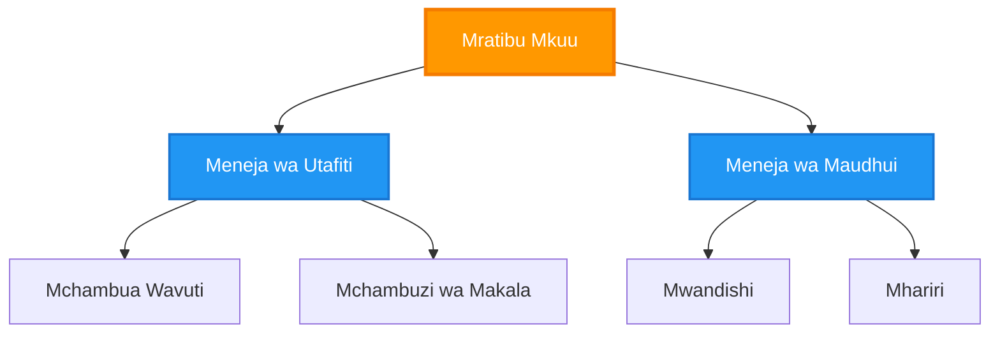
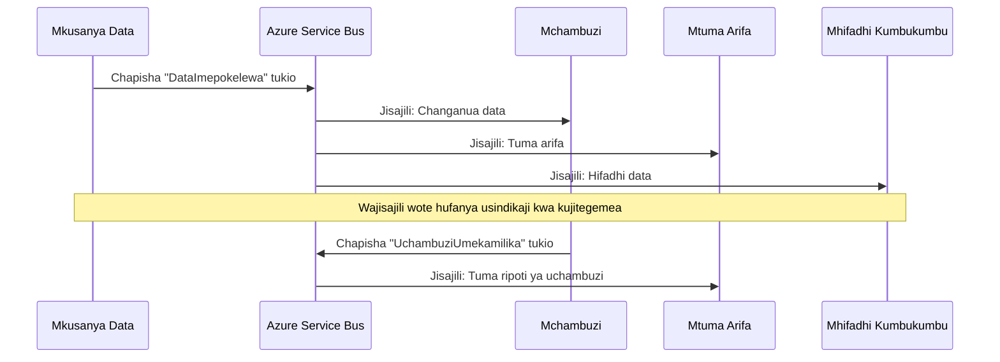
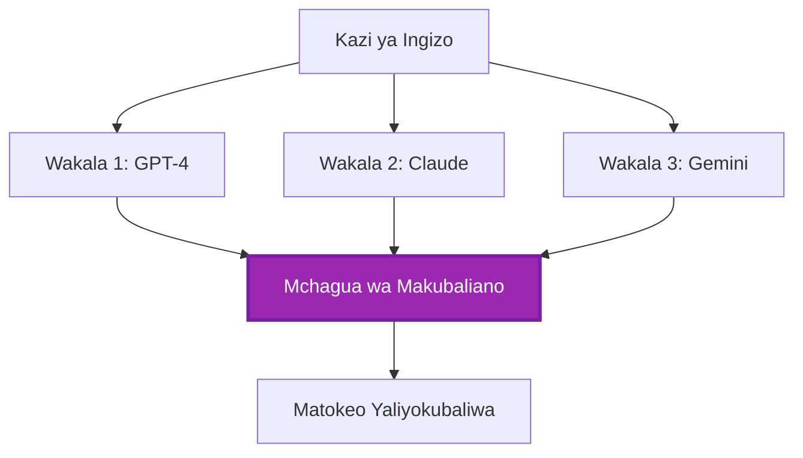
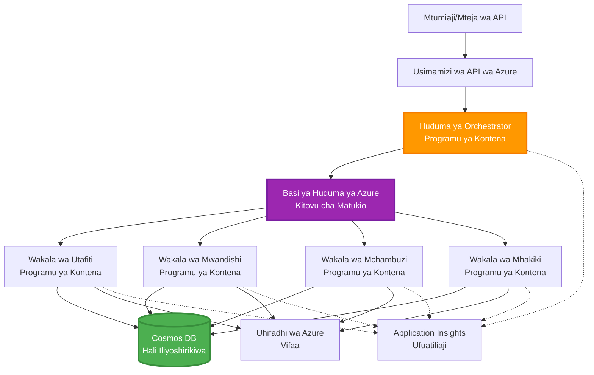

# Mifumo ya Uratibu wa Wakala Wengi

⏱️ **Muda Uliohifadhiwa**: 60-75 dakika | 💰 **Gharama Inayokadiriwa**: ~$100-300/mwezi | ⭐ **Ugumu**: Kiwango cha Juu

**📚 Njia ya Kujifunza:**
- ← Iliyopita: [Capacity Planning](capacity-planning.md) - Uainishaji wa rasilimali na mikakati ya kupanua
- 🎯 **Unao Sasa**: Mifumo ya Uratibu wa Wakala Wengi (Orchestration, mawasiliano, usimamizi wa hali)
- → Ifuatayo: [SKU Selection](sku-selection.md) - Kutoa huduma sahihi za Azure
- 🏠 [Course Home](../../README.md)

---

## Kile Utakachojifunza

Kwa kumaliza somo hili, utajifunza:
- Kuelewa **mifumo ya usanifu wa wakala wengi** na lini ya kutumia
- Kutekeleza **mifumo ya uratibu** (kituo kimoja, zisizo za kati, kimnara)
- Kubuni mikakati ya **mawasiliano ya wakala** (synchronous, asynchronous, inayotegemea matukio)
- Kusimamia **hali iliyoshirikiwa** kati ya wakala waliosambazwa
- Kutoa **mifumo ya wakala wengi** kwenye Azure kwa AZD
- Kutumia **mifumo ya uratibu** kwa hali halisi za AI
- Kufuatilia na kutafuta tatizo kwenye mifumo ya wakala waliosambazwa

## Kwa Nini Uratibu wa Wakala Wengi Ni Muhimu

### Mageuzi: Kutoka kwa Wakala Mmoja hadi Wakala Wengi

**Wakala Mmoja (Rahisi):**
```
User → Agent → Response
```
- ✅ Rahisi kuelewa na kutekeleza
- ✅ Haraka kwa kazi rahisi
- ❌ Imewekwa kikomo na uwezo wa modeli moja
- ❌ Haiwezi kuendesha kazi ngumu kwa sambamba
- ❌ Hakuna utaalam maalum

**Mfumo wa Wakala Wengi (Juu):**
```
           ┌─────────────┐
           │ Orchestrator│
           └──────┬──────┘
        ┌─────────┼─────────┐
        │         │         │
    ┌───▼──┐  ┌──▼───┐  ┌──▼────┐
    │Agent1│  │Agent2│  │Agent3 │
    │(Plan)│  │(Code)│  │(Review)│
    └──────┘  └──────┘  └───────┘
```
- ✅ Wakala maalum kwa kazi maalum
- ✅ Utekelezaji kwa sambamba kwa kasi
- ✅ Modul na rahisi kudumishwa
- ✅ Bora kwa mtiririko wa kazi ngumu
- ⚠️ Inahitaji mantiki ya uratibu

**Mfano**: Wakala mmoja ni kama mtu mmoja afanye kazi zote. Wakala wengi ni kama timu ambapo kila mshiriki ana ujuzi maalum (mtafiti, mpigaji msimbo, mhariri, mwandishi) wakifanya kazi pamoja.

---

## Mifumo Msingi ya Uratibu

### Mfumo 1: Uratibu wa Mfululizo (Mfumo wa Wajibu)

**Wakati wa kutumia**: Kazi lazima zikamilike kwa mpangilio maalum, kila wakala anajenga juu ya matokeo ya awali.

```mermaid
sequenceDiagram
    participant User as Mtumiaji
    participant Orchestrator as Mratibu
    participant Agent1 as Wakala wa Utafiti
    participant Agent2 as Wakala wa Uandishi
    participant Agent3 as Wakala wa Uhariri
    
    User->>Orchestrator: "Andika makala kuhusu AI"
    Orchestrator->>Agent1: Utafiti wa mada
    Agent1-->>Orchestrator: Matokeo ya utafiti
    Orchestrator->>Agent2: Andika rasimu (kwa kutumia utafiti)
    Agent2-->>Orchestrator: Rasimu ya makala
    Orchestrator->>Agent3: Hariri na boresha
    Agent3-->>Orchestrator: Makala ya mwisho
    Orchestrator-->>User: Makala iliyoboreshwa
    
    Note over User,Agent3: Mfuatano: Kila hatua inasubiri ile iliyotangulia
```}
**Manufaa:**
- ✅ Mtiririko wazi wa data
- ✅ Rahisi kutafuta hitilafu
- ✅ Mpangilio wa utekelezaji unaotarajiwa

**Mipaka:**
- ❌ Polepole (hakuna utekelezaji sambamba)
- ❌ Kosa moja linalizuia mnyororo mzima
- ❌ Haiwezi kushughulikia kazi zinazotegemeana

**Mifano ya Matumizi:**
- Mtiririko wa uundaji wa maudhui (tafiti → andika → hariri → chapisha)
- Uundaji wa msimbo (panga → tekereza → jaribu → weka uzalishaji)
- Uundaji wa ripoti (okusanya data → uchambuzi → uonyesho → muhtasari)

---

### Mfumo 2: Uratibu wa Sambamba (Fan-Out/Fan-In)

**Wakati wa kutumia**: Kazi zisizo tegemeana zinaweza kuendeshwa kwa pamoja, matokeo yakakusanywa mwishoni.

```mermaid
graph TB
    User[Ombi la Mtumiaji]
    Orchestrator[Mratibu]
    Agent1[Wakala wa Uchambuzi]
    Agent2[Wakala wa Utafiti]
    Agent3[Wakala wa Takwimu]
    Aggregator[Mkusanyaji wa Matokeo]
    Response[Jibu Iliyochanganywa]
    
    User --> Orchestrator
    Orchestrator --> Agent1
    Orchestrator --> Agent2
    Orchestrator --> Agent3
    Agent1 --> Aggregator
    Agent2 --> Aggregator
    Agent3 --> Aggregator
    Aggregator --> Response
    
    style Orchestrator fill:#2196F3,stroke:#1976D2,stroke-width:3px,color:#fff
    style Aggregator fill:#4CAF50,stroke:#388E3C,stroke-width:3px,color:#fff
```
**Manufaa:**
- ✅ Haraka (utekelezaji kwa sambamba)
- ✅ Imara dhidi ya hitilafu (matokeo ya sehemu yanaweza kukubalika)
- ✅ Inapanuka kwa usawa

**Mipaka:**
- ⚠️ Matokeo yanaweza kufika nje ya mpangilio
- ⚠️ Inahitaji mantiki ya kujumlisha matokeo
- ⚠️ Usimamizi wa hali ni mgumu

**Mifano ya Matumizi:**
- Ukusanyaji wa data kutoka vyanzo vingi (APIs + databases + web scraping)
- Uchambuzi wa ushindani (modeli nyingi zinafanya suluhisho, bora inachaguliwa)
- Huduma za tafsiri (kutafsiri kwa lugha nyingi kwa wakati mmoja)

---

### Mfumo 3: Uratibu wa Kimnara (Meneja-Mfanyakazi)

**Wakati wa kutumia**: Mtiririko wa kazi ngumu wenye kazi ndogo ndogo, inahitajika kugawa kazi.


**Manufaa:**
- ✅ Inashughulikia mitiririko ngumu ya kazi
- ✅ Modul na rahisi kudumishwa
- ✅ Mipaka ya uwajibikaji wazi

**Mipaka:**
- ⚠️ Usaidizi wa kina wa usanifu
- ⚠️ Muda wa kusubiri zaidi (vizingiti vingi vya uratibu)
- ⚠️ Inahitaji uratibu wa kiwango cha juu

**Mifano ya Matumizi:**
- Usindikaji wa nyaraka za kampuni (ainisha → panga → wasilisha → hifadhi)
- Mtiririko wa data yenye hatua nyingi (ingiza → safisha → badilisha → chambua → ripoti)
- Mifumo tata ya uendeshaji (kupanga → ugawaji rasilimali → utekelezaji → ufuatiliaji)

---

### Mfumo 4: Uratibu Unaotegemea Matukio (Publish-Subscribe)

**Wakati wa kutumia**: Wakala wanahitaji k reacting kwa matukio, kuunganishwa kwa upole kinahitajika.


**Manufaa:**
- ✅ Kuunganishwa kwa upole kati ya wakala
- ✅ Rahisi kuongeza wakala wapya (tu jisajili)
- ✅ Uchakataji asynchronous
- ✅ Imara (uhifadhi wa ujumbe)

**Mipaka:**
- ⚠️ Ulinganifu wa hatima (eventual consistency)
- ⚠️ Ugumu wa kutafuta hitilafu
- ⚠️ Changamoto za mpangilio wa ujumbe

**Mifano ya Matumizi:**
- Mifumo ya ufuatiliaji kwa wakati halisi (arifa, dashibodi, vitabu vya kumbukumbu)
- Arifa za njia nyingi (email, SMS, push, Slack)
- Mtiririko wa usindikaji wa data (walinunua wengi wa data moja)

---

### Mfumo 5: Uratibu unaotegemea Makubaliano (Kura/Quorum)

**Wakati wa kutumia**: Inahitajika makubaliano kutoka kwa wakala wengi kabla ya kuendelea.


**Manufaa:**
- ✅ Usahihi wa juu (maoni nyingi)
- ✅ Imara dhidi ya hitilafu (kumbukumbu ndogo zinaweza kushindwa)
- ✅ Udhibiti wa ubora umejumuishwa

**Mipaka:**
- ❌ Ghali (miito ya modeli nyingi)
- ❌ Polepole (kusubiri wakala wote)
- ⚠️ Inahitajika azimio la migogoro

**Mifano ya Matumizi:**
- Udhibiti wa maudhui (modeli nyingi zinapitia maudhui)
- Ukaguzi wa msimbo (linters/analyzers nyingi)
- Uchunguzi wa matibabu (modeli nyingi za AI, uthibitisho wa mtaalamu)

---

## Muhtasari wa Usanifu

### Mfumo Kamili wa Wakala Wengi kwenye Azure


**Vipengele Muhimu:**

| Component | Purpose | Azure Service |
|-----------|---------|---------------|
| **API Gateway** | Mlango la kuingia, udhibiti wa kiwango, uthibitisho | API Management |
| **Orchestrator** | Uratibu wa mitiririko ya wakala | Container Apps |
| **Message Queue** | Mawasiliano asynchronous | Service Bus / Event Hubs |
| **Agents** | Wafanyakazi wa AI waliobobea | Container Apps / Functions |
| **State Store** | Hali iliyoshirikiwa, ufuatiliaji wa kazi | Cosmos DB |
| **Artifact Storage** | Nyaraka, matokeo, logi | Blob Storage |
| **Monitoring** | Ufuatiliaji uliosambazwa, logi | Application Insights |

---

## Masharti ya Awali

### Vifaa Vinavyohitajika

```bash
# Thibitisha Azure Developer CLI
azd version
# ✅ Inatarajiwa: azd toleo 1.0.0 au zaidi

# Thibitisha Azure CLI
az --version
# ✅ Inatarajiwa: azure-cli 2.50.0 au zaidi

# Thibitisha Docker (kwa majaribio ya ndani)
docker --version
# ✅ Inatarajiwa: toleo la Docker 20.10 au zaidi
```

### Mahitaji ya Azure

- Kiwango cha Azure kinachofanya kazi
- Ruhusa za kuunda:
  - Container Apps
  - Service Bus namespaces
  - Cosmos DB accounts
  - Storage accounts
  - Application Insights

### Maarifa Yanayohitajika

Unapaswa kuwa umekamilisha:
- [Configuration Management](../chapter-03-configuration/configuration.md)
- [Authentication & Security](../chapter-03-configuration/authsecurity.md)
- [Microservices Example](../../../../examples/microservices)

---

## Mwongozo wa Utekelezaji

### Muundo wa Mradi

```
multi-agent-system/
├── azure.yaml                    # AZD configuration
├── infra/
│   ├── main.bicep               # Main infrastructure
│   ├── core/
│   │   ├── servicebus.bicep     # Message queue
│   │   ├── cosmos.bicep         # State store
│   │   ├── storage.bicep        # Artifact storage
│   │   └── monitoring.bicep     # Application Insights
│   └── app/
│       ├── orchestrator.bicep   # Orchestrator service
│       └── agent.bicep          # Agent template
└── src/
    ├── orchestrator/            # Orchestration logic
    │   ├── app.py
    │   ├── workflows.py
    │   └── Dockerfile
    ├── agents/
    │   ├── research/            # Research agent
    │   ├── writer/              # Writer agent
    │   ├── analyst/             # Analyst agent
    │   └── reviewer/            # Reviewer agent
    └── shared/
        ├── state_manager.py     # Shared state logic
        └── message_handler.py   # Message handling
```

---

## Somo 1: Mfumo wa Uratibu wa Mfululizo

### Utekelezaji: Mtiririko wa Uundaji wa Maudhui

Tujenge mtiririko wa mfululizo: Tafiti → Andika → Hariri → Chapisha

### 1. Mipangilio ya AZD

**Faili: `azure.yaml`**

```yaml
name: content-pipeline
metadata:
  template: multi-agent-sequential@1.0.0

services:
  orchestrator:
    project: ./src/orchestrator
    language: python
    host: containerapp
  
  research-agent:
    project: ./src/agents/research
    language: python
    host: containerapp
  
  writer-agent:
    project: ./src/agents/writer
    language: python
    host: containerapp
  
  editor-agent:
    project: ./src/agents/editor
    language: python
    host: containerapp
```

### 2. Miundombinu: Service Bus kwa Uratibu

**Faili: `infra/core/servicebus.bicep`**

```bicep
param name string
param location string
param tags object = {}

resource serviceBusNamespace 'Microsoft.ServiceBus/namespaces@2022-10-01-preview' = {
  name: name
  location: location
  tags: tags
  sku: {
    name: 'Standard'
    tier: 'Standard'
  }
  properties: {
    minimumTlsVersion: '1.2'
  }
}

// Queue for orchestrator → research agent
resource researchQueue 'Microsoft.ServiceBus/namespaces/queues@2022-10-01-preview' = {
  parent: serviceBusNamespace
  name: 'research-tasks'
  properties: {
    maxDeliveryCount: 3
    lockDuration: 'PT5M'
    deadLetteringOnMessageExpiration: true
  }
}

// Queue for research agent → writer agent
resource writerQueue 'Microsoft.ServiceBus/namespaces/queues@2022-10-01-preview' = {
  parent: serviceBusNamespace
  name: 'writer-tasks'
  properties: {
    maxDeliveryCount: 3
    lockDuration: 'PT5M'
  }
}

// Queue for writer agent → editor agent
resource editorQueue 'Microsoft.ServiceBus/namespaces/queues@2022-10-01-preview' = {
  parent: serviceBusNamespace
  name: 'editor-tasks'
  properties: {
    maxDeliveryCount: 3
    lockDuration: 'PT5M'
  }
}

output namespace string = serviceBusNamespace.name
output connectionString string = listKeys('${serviceBusNamespace.id}/AuthorizationRules/RootManageSharedAccessKey', serviceBusNamespace.apiVersion).primaryConnectionString
```

### 3. Meneja wa Hali Iliyoshirikiwa

**Faili: `src/shared/state_manager.py`**

```python
from azure.cosmos import CosmosClient, PartitionKey
from datetime import datetime
import os

class StateManager:
    """Manages shared state across agents using Cosmos DB"""
    
    def __init__(self):
        endpoint = os.environ['COSMOS_ENDPOINT']
        key = os.environ['COSMOS_KEY']
        
        self.client = CosmosClient(endpoint, key)
        self.database = self.client.get_database_client('agent-state')
        self.container = self.database.get_container_client('tasks')
    
    def create_task(self, task_id: str, task_type: str, input_data: dict):
        """Create a new task"""
        task = {
            'id': task_id,
            'type': task_type,
            'status': 'pending',
            'input': input_data,
            'created_at': datetime.utcnow().isoformat(),
            'steps': []
        }
        self.container.create_item(task)
        return task
    
    def update_task_step(self, task_id: str, step_name: str, result: dict):
        """Update task with completed step"""
        task = self.container.read_item(task_id, partition_key=task_id)
        
        task['steps'].append({
            'name': step_name,
            'completed_at': datetime.utcnow().isoformat(),
            'result': result
        })
        
        self.container.replace_item(task_id, task)
        return task
    
    def complete_task(self, task_id: str, final_result: dict):
        """Mark task as complete"""
        task = self.container.read_item(task_id, partition_key=task_id)
        task['status'] = 'completed'
        task['result'] = final_result
        task['completed_at'] = datetime.utcnow().isoformat()
        self.container.replace_item(task_id, task)
        return task
    
    def get_task(self, task_id: str):
        """Retrieve task state"""
        return self.container.read_item(task_id, partition_key=task_id)
```

### 4. Huduma ya Orchestrator

**Faili: `src/orchestrator/app.py`**

```python
from flask import Flask, request, jsonify
from azure.servicebus import ServiceBusClient, ServiceBusMessage
import json
import uuid
import os
from shared.state_manager import StateManager

app = Flask(__name__)
state_manager = StateManager()

# Muunganisho wa Service Bus
servicebus_connection_str = os.environ['SERVICEBUS_CONNECTION_STRING']
servicebus_client = ServiceBusClient.from_connection_string(servicebus_connection_str)

@app.route('/health', methods=['GET'])
def health():
    return jsonify({'status': 'healthy', 'service': 'orchestrator'})

@app.route('/create-content', methods=['POST'])
def create_content():
    """
    Sequential workflow: Research → Write → Edit → Publish
    """
    data = request.json
    topic = data.get('topic')
    
    if not topic:
        return jsonify({'error': 'Topic required'}), 400
    
    # Unda kazi katika hifadhi ya hali
    task_id = str(uuid.uuid4())
    task = state_manager.create_task(
        task_id=task_id,
        task_type='content_creation',
        input_data={'topic': topic}
    )
    
    # Tuma ujumbe kwa wakala wa utafiti (hatua ya kwanza)
    sender = servicebus_client.get_queue_sender('research-tasks')
    message = ServiceBusMessage(
        body=json.dumps({
            'task_id': task_id,
            'topic': topic,
            'next_queue': 'writer-tasks'  # Mahali pa kutuma matokeo
        }),
        content_type='application/json'
    )
    
    with sender:
        sender.send_messages(message)
    
    return jsonify({
        'task_id': task_id,
        'status': 'started',
        'workflow': 'sequential',
        'steps': ['research', 'write', 'edit', 'publish'],
        'message': 'Content creation pipeline initiated'
    }), 202

@app.route('/task/<task_id>', methods=['GET'])
def get_task_status(task_id):
    """Check task status"""
    try:
        task = state_manager.get_task(task_id)
        return jsonify(task)
    except Exception as e:
        return jsonify({'error': str(e)}), 404

if __name__ == '__main__':
    app.run(host='0.0.0.0', port=8080)
```

### 5. Wakala wa Utafiti

**Faili: `src/agents/research/app.py`**

```python
from azure.servicebus import ServiceBusClient, ServiceBusMessage
from openai import AzureOpenAI
import json
import os
import time
from shared.state_manager import StateManager

# Anzisha wateja
state_manager = StateManager()
servicebus_client = ServiceBusClient.from_connection_string(
    os.environ['SERVICEBUS_CONNECTION_STRING']
)

openai_client = AzureOpenAI(
    api_key=os.environ['AZURE_OPENAI_API_KEY'],
    api_version="2024-02-01",
    azure_endpoint=os.environ['AZURE_OPENAI_ENDPOINT']
)

def process_research_task(message_data):
    """Process research request and pass to writer"""
    task_id = message_data['task_id']
    topic = message_data['topic']
    next_queue = message_data['next_queue']
    
    print(f"🔬 Researching: {topic}")
    
    # Tuma ombi kwa Azure OpenAI kwa ajili ya utafiti
    response = openai_client.chat.completions.create(
        model="gpt-4",
        messages=[
            {"role": "system", "content": "You are a research assistant. Provide comprehensive research on the given topic."},
            {"role": "user", "content": f"Research this topic thoroughly: {topic}"}
        ],
        max_tokens=1500
    )
    
    research_results = response.choices[0].message.content
    
    # Sasisha hali
    state_manager.update_task_step(
        task_id=task_id,
        step_name='research',
        result={'research': research_results}
    )
    
    # Tuma kwa wakala anayefuata (mwandishi)
    sender = servicebus_client.get_queue_sender(next_queue)
    message = ServiceBusMessage(
        body=json.dumps({
            'task_id': task_id,
            'topic': topic,
            'research': research_results,
            'next_queue': 'editor-tasks'
        }),
        content_type='application/json'
    )
    
    with sender:
        sender.send_messages(message)
    
    print(f"✅ Research complete for task {task_id}")

def main():
    """Listen to research queue"""
    receiver = servicebus_client.get_queue_receiver('research-tasks')
    
    print("🔬 Research Agent started, listening for tasks...")
    
    with receiver:
        while True:
            messages = receiver.receive_messages(max_wait_time=5)
            for message in messages:
                try:
                    message_data = json.loads(str(message))
                    process_research_task(message_data)
                    receiver.complete_message(message)
                except Exception as e:
                    print(f"❌ Error processing message: {e}")
                    receiver.abandon_message(message)

if __name__ == '__main__':
    main()
```

### 6. Wakala Mwandishi

**Faili: `src/agents/writer/app.py`**

```python
from azure.servicebus import ServiceBusClient, ServiceBusMessage
from openai import AzureOpenAI
import json
import os
from shared.state_manager import StateManager

state_manager = StateManager()
servicebus_client = ServiceBusClient.from_connection_string(
    os.environ['SERVICEBUS_CONNECTION_STRING']
)

openai_client = AzureOpenAI(
    api_key=os.environ['AZURE_OPENAI_API_KEY'],
    api_version="2024-02-01",
    azure_endpoint=os.environ['AZURE_OPENAI_ENDPOINT']
)

def process_writing_task(message_data):
    """Write article based on research"""
    task_id = message_data['task_id']
    topic = message_data['topic']
    research = message_data['research']
    next_queue = message_data['next_queue']
    
    print(f"✍️ Writing article: {topic}")
    
    # Tuma ombi kwa Azure OpenAI ili kuandika makala
    response = openai_client.chat.completions.create(
        model="gpt-4",
        messages=[
            {"role": "system", "content": "You are a professional writer. Write engaging, well-structured articles."},
            {"role": "user", "content": f"Based on this research:\n\n{research}\n\nWrite a comprehensive article about: {topic}"}
        ],
        max_tokens=2000
    )
    
    article_draft = response.choices[0].message.content
    
    # Sasisha hali
    state_manager.update_task_step(
        task_id=task_id,
        step_name='writing',
        result={'draft': article_draft}
    )
    
    # Tuma kwa mhariri
    sender = servicebus_client.get_queue_sender(next_queue)
    message = ServiceBusMessage(
        body=json.dumps({
            'task_id': task_id,
            'topic': topic,
            'draft': article_draft
        }),
        content_type='application/json'
    )
    
    with sender:
        sender.send_messages(message)
    
    print(f"✅ Article draft complete for task {task_id}")

def main():
    """Listen to writer queue"""
    receiver = servicebus_client.get_queue_receiver('writer-tasks')
    
    print("✍️ Writer Agent started, listening for tasks...")
    
    with receiver:
        while True:
            messages = receiver.receive_messages(max_wait_time=5)
            for message in messages:
                try:
                    message_data = json.loads(str(message))
                    process_writing_task(message_data)
                    receiver.complete_message(message)
                except Exception as e:
                    print(f"❌ Error: {e}")
                    receiver.abandon_message(message)

if __name__ == '__main__':
    main()
```

### 7. Wakala Mhariri

**Faili: `src/agents/editor/app.py`**

```python
from azure.servicebus import ServiceBusClient
from openai import AzureOpenAI
import json
import os
from shared.state_manager import StateManager

state_manager = StateManager()
servicebus_client = ServiceBusClient.from_connection_string(
    os.environ['SERVICEBUS_CONNECTION_STRING']
)

openai_client = AzureOpenAI(
    api_key=os.environ['AZURE_OPENAI_API_KEY'],
    api_version="2024-02-01",
    azure_endpoint=os.environ['AZURE_OPENAI_ENDPOINT']
)

def process_editing_task(message_data):
    """Edit and finalize article"""
    task_id = message_data['task_id']
    topic = message_data['topic']
    draft = message_data['draft']
    
    print(f"📝 Editing article: {topic}")
    
    # Piga Azure OpenAI ili kuhariri
    response = openai_client.chat.completions.create(
        model="gpt-4",
        messages=[
            {"role": "system", "content": "You are an expert editor. Improve grammar, clarity, and structure."},
            {"role": "user", "content": f"Edit and improve this article:\n\n{draft}"}
        ],
        max_tokens=2000
    )
    
    final_article = response.choices[0].message.content
    
    # Alama kazi kama imekamilika
    state_manager.complete_task(
        task_id=task_id,
        final_result={
            'topic': topic,
            'final_article': final_article,
            'word_count': len(final_article.split())
        }
    )
    
    print(f"✅ Article finalized for task {task_id}")

def main():
    """Listen to editor queue"""
    receiver = servicebus_client.get_queue_receiver('editor-tasks')
    
    print("📝 Editor Agent started, listening for tasks...")
    
    with receiver:
        while True:
            messages = receiver.receive_messages(max_wait_time=5)
            for message in messages:
                try:
                    message_data = json.loads(str(message))
                    process_editing_task(message_data)
                    receiver.complete_message(message)
                except Exception as e:
                    print(f"❌ Error: {e}")
                    receiver.abandon_message(message)

if __name__ == '__main__':
    main()
```

### 8. Weka kwenye uzalishaji na Jaribu

```bash
# Anzisha na uweke
azd init
azd up

# Pata URL ya mratibu
ORCHESTRATOR_URL=$(azd env get-values | grep ORCHESTRATOR_URL | cut -d '=' -f2 | tr -d '"')

# Unda maudhui
curl -X POST $ORCHESTRATOR_URL/create-content \
  -H "Content-Type: application/json" \
  -d '{"topic": "The Future of AI in Healthcare"}'
```

**✅ Matokeo yanayotarajiwa:**
```json
{
  "task_id": "a1b2c3d4-e5f6-7890-abcd-ef1234567890",
  "status": "started",
  "workflow": "sequential",
  "steps": ["research", "write", "edit", "publish"],
  "message": "Content creation pipeline initiated"
}
```

**Angalia maendeleo ya kazi:**
```bash
TASK_ID="a1b2c3d4-e5f6-7890-abcd-ef1234567890"
curl $ORCHESTRATOR_URL/task/$TASK_ID
```

**✅ Matokeo yanayotarajiwa (imekamilika):**
```json
{
  "id": "a1b2c3d4-e5f6-7890-abcd-ef1234567890",
  "type": "content_creation",
  "status": "completed",
  "steps": [
    {
      "name": "research",
      "completed_at": "2025-11-19T10:30:00Z",
      "result": {"research": "..."}
    },
    {
      "name": "writing",
      "completed_at": "2025-11-19T10:32:00Z",
      "result": {"draft": "..."}
    }
  ],
  "result": {
    "topic": "The Future of AI in Healthcare",
    "final_article": "...",
    "word_count": 1500
  }
}
```

---

## Somo 2: Mfumo wa Uratibu wa Sambamba

### Utekelezaji: Mpangilio wa Ukusanyaji wa Utafiti kutoka Vyanzo Nyingi

Tujenge mfumo wa sambamba unaokusanya taarifa kutoka vyanzo vingi kwa wakati mmoja.

### Orchestrator wa Sambamba

**Faili: `src/orchestrator/parallel_workflow.py`**

```python
from flask import Flask, request, jsonify
from azure.servicebus import ServiceBusClient, ServiceBusMessage
import json
import uuid
import os
from shared.state_manager import StateManager

app = Flask(__name__)
state_manager = StateManager()

servicebus_client = ServiceBusClient.from_connection_string(
    os.environ['SERVICEBUS_CONNECTION_STRING']
)

@app.route('/research-parallel', methods=['POST'])
def research_parallel():
    """
    Parallel workflow: Multiple agents work simultaneously
    """
    data = request.json
    query = data.get('query')
    
    task_id = str(uuid.uuid4())
    task = state_manager.create_task(
        task_id=task_id,
        task_type='parallel_research',
        input_data={
            'query': query,
            'agents': ['web', 'academic', 'news', 'social']
        }
    )
    
    # Ugawaji kwa wengi: Tuma kwa mawakala wote kwa wakati mmoja
    agents = [
        ('web-research-queue', 'web'),
        ('academic-research-queue', 'academic'),
        ('news-research-queue', 'news'),
        ('social-research-queue', 'social')
    ]
    
    for queue_name, agent_type in agents:
        sender = servicebus_client.get_queue_sender(queue_name)
        message = ServiceBusMessage(
            body=json.dumps({
                'task_id': task_id,
                'query': query,
                'agent_type': agent_type,
                'result_queue': 'aggregation-queue'
            }),
            content_type='application/json'
        )
        
        with sender:
            sender.send_messages(message)
    
    return jsonify({
        'task_id': task_id,
        'status': 'started',
        'workflow': 'parallel',
        'agents_dispatched': 4,
        'message': 'Parallel research initiated'
    }), 202

if __name__ == '__main__':
    app.run(host='0.0.0.0', port=8080)
```

### Mantiki ya Ujumlishaji

**Faili: `src/agents/aggregator/app.py`**

```python
from azure.servicebus import ServiceBusClient
import json
import os
from collections import defaultdict
from shared.state_manager import StateManager

state_manager = StateManager()
servicebus_client = ServiceBusClient.from_connection_string(
    os.environ['SERVICEBUS_CONNECTION_STRING']
)

# Fuatilia matokeo kwa kila kazi
task_results = defaultdict(list)
expected_agents = 4  # wavuti, kitaaluma, habari, kijamii

def process_result(message_data):
    """Aggregate results from parallel agents"""
    task_id = message_data['task_id']
    agent_type = message_data['agent_type']
    result = message_data['result']
    
    # Hifadhi matokeo
    task_results[task_id].append({
        'agent': agent_type,
        'data': result
    })
    
    print(f"📊 Received result from {agent_type} agent ({len(task_results[task_id])}/{expected_agents})")
    
    # Angalia kama mawakala wote wamekamilisha (fan-in)
    if len(task_results[task_id]) == expected_agents:
        print(f"✅ All agents completed for task {task_id}. Aggregating...")
        
        # Unganisha matokeo
        aggregated = {
            'query': message_data['query'],
            'sources': task_results[task_id],
            'summary': generate_summary(task_results[task_id])
        }
        
        # Weka alama kuwa imekamilika
        state_manager.complete_task(task_id, aggregated)
        
        # Safisha
        del task_results[task_id]
        
        print(f"✅ Aggregation complete for task {task_id}")

def generate_summary(results):
    """Generate summary from all sources"""
    summaries = [r['data'].get('summary', '') for r in results]
    return '\n\n'.join(summaries)

def main():
    """Listen to aggregation queue"""
    receiver = servicebus_client.get_queue_receiver('aggregation-queue')
    
    print("📊 Aggregator started, listening for results...")
    
    with receiver:
        while True:
            messages = receiver.receive_messages(max_wait_time=5)
            for message in messages:
                try:
                    message_data = json.loads(str(message))
                    process_result(message_data)
                    receiver.complete_message(message)
                except Exception as e:
                    print(f"❌ Error: {e}")
                    receiver.abandon_message(message)

if __name__ == '__main__':
    main()
```

**Manufaa ya Mfumo wa Sambamba:**
- ⚡ **4x haraka** (wakala wanaendesha kwa wakati mmoja)
- 🔄 **Imara dhidi ya hitilafu** (matokeo ya sehemu yanaweza kukubalika)
- 📈 **Inapanuka** (ongeza wakala zaidi kwa urahisi)

---

## Mazoezi ya Vitendo

### Zoezi 1: Ongeza Usimamizi wa Muda wa Kusubiri ⭐⭐ (Wastani)

**Lengo**: Tumia mantiki ya timeout ili aggregator aisubiri milele kwa wakala polepole.

**Hatua**:

1. **Ongeza ufuatiliaji wa timeout kwa aggregator:**

```python
from datetime import datetime, timedelta

task_timeouts = {}  # task_id -> expiration_time

def process_result(message_data):
    task_id = message_data['task_id']
    
    # Weka kikomo cha muda kwa matokeo ya kwanza
    if task_id not in task_timeouts:
        task_timeouts[task_id] = datetime.utcnow() + timedelta(seconds=30)
    
    task_results[task_id].append({
        'agent': message_data['agent_type'],
        'data': message_data['result']
    })
    
    # Angalia kama imekamilika AU imepitwa na muda
    if len(task_results[task_id]) == expected_agents or \
       datetime.utcnow() > task_timeouts[task_id]:
        
        print(f"📊 Aggregating with {len(task_results[task_id])}/{expected_agents} results")
        
        aggregated = {
            'query': message_data['query'],
            'sources': task_results[task_id],
            'completed_agents': len(task_results[task_id]),
            'timed_out': len(task_results[task_id]) < expected_agents
        }
        
        state_manager.complete_task(task_id, aggregated)
        
        # Usafishaji
        del task_results[task_id]
        del task_timeouts[task_id]
```

2. **Jaribu kwa ucheleweshaji bandia:**

```python
# Katika wakala mmoja, ongeza ucheleweshaji ili kuiga usindikaji polepole
import time
time.sleep(35)  # Inazidi muda wa kusitisha wa sekunde 30
```

3. **Weka uzalishaji na thibitisha:**

```bash
azd deploy aggregator

# Wasilisha kazi
curl -X POST $ORCHESTRATOR_URL/research-parallel \
  -H "Content-Type: application/json" \
  -d '{"query": "AI safety research"}'

# Angalia matokeo baada ya sekunde 30
curl $ORCHESTRATOR_URL/task/$TASK_ID
```

**✅ Vigezo vya Mafanikio:**
- ✅ Kazi inakamilika baada ya sekunde 30 hata wakala hawajakamilika
- ✅ Majibu yanaonyesha matokeo ya sehemu (`"timed_out": true`)
- ✅ Matokeo yanayopatikana yarudishwe (3 kati ya wakala 4)

**Muda**: dakika 20-25

---

### Zoezi 2: Tekeleza Mantiki ya Kujaribu Tena (Retry) ⭐⭐⭐ (Juu)

**Lengo**: Rudia kazi za wakala zilizoanguka kwa kujitegemea kabla ya kukata tamaa.

**Hatua**:

1. **Ongeza ufuatiliaji wa retry kwa orchestrator:**

```python
from dataclasses import dataclass
from typing import Dict

@dataclass
class RetryConfig:
    max_retries: int = 3
    backoff_seconds: int = 5

retry_counts: Dict[str, int] = {}  # kitambulisho_cha_ujumbe -> idadi_ya_jaribio

def send_with_retry(queue_name: str, message_data: dict, retry_config: RetryConfig):
    """Send message with retry metadata"""
    message_id = message_data.get('message_id', str(uuid.uuid4()))
    message_data['message_id'] = message_id
    message_data['retry_count'] = retry_counts.get(message_id, 0)
    message_data['max_retries'] = retry_config.max_retries
    
    sender = servicebus_client.get_queue_sender(queue_name)
    message = ServiceBusMessage(
        body=json.dumps(message_data),
        content_type='application/json',
        message_id=message_id
    )
    
    with sender:
        sender.send_messages(message)
```

2. **Ongeza mshughulikiaji wa retry kwa wakala:**

```python
def process_with_retry(message, receiver, process_func):
    """Process message with automatic retry on failure"""
    try:
        message_data = json.loads(str(message))
        
        # Chakata ujumbe
        process_func(message_data)
        
        # Imefaulu - imekamilika
        receiver.complete_message(message)
        
    except Exception as e:
        message_id = message.message_id
        retry_count = message_data.get('retry_count', 0)
        max_retries = message_data.get('max_retries', 3)
        
        if retry_count < max_retries:
            # Jaribu tena: acha na uiweke tena kwenye foleni ukiongeza idadi
            print(f"⚠️ Retry {retry_count + 1}/{max_retries} for message {message_id}")
            
            message_data['retry_count'] = retry_count + 1
            
            # Rudisha kwenye foleni ile ile kwa kuchelewa
            time.sleep(5 * (retry_count + 1))  # Kuchelewesha kwa ukuaji wa eksponenti
            send_with_retry(queue_name, message_data, RetryConfig())
            
            receiver.complete_message(message)  # Ondoa ya awali
        else:
            # Imezidi idadi ya jaribio - hamisha kwenye foleni ya barua zilizokufa
            print(f"❌ Max retries exceeded for message {message_id}")
            receiver.dead_letter_message(
                message,
                reason="MaxRetriesExceeded",
                error_description=str(e)
            )
```

3. **Fuatilia safu ya dead letter:**

```python
def monitor_dead_letters():
    """Check dead letter queue for failed messages"""
    receiver = servicebus_client.get_queue_receiver(
        'research-queue',
        sub_queue='deadletter'
    )
    
    with receiver:
        messages = receiver.receive_messages(max_wait_time=5)
        for message in messages:
            print(f"☠️ Dead letter: {message.message_id}")
            print(f"Reason: {message.dead_letter_reason}")
            print(f"Description: {message.dead_letter_error_description}")
```

**✅ Vigezo vya Mafanikio:**
- ✅ Kazi zilizoshindwa zinajaribiwa tena kwa njia ya moja kwa moja (hadi mara 3)
- ✅ Upunguzaji wa wakati wa kusubiri kwa retries kwa mkao wa exponential (5s, 10s, 15s)
- ✅ Baada ya retries za juu, ujumbe huenda kwenye dead letter queue
- ✅ Dead letter queue inaweza kufuatiliwa na kuchezwa tena

**Muda**: dakika 30-40

---

### Zoezi 3: Tekeleza Circuit Breaker ⭐⭐⭐ (Juu)

**Lengo**: Zuia kushindwa kwa mfululizo kwa kuacha maombi kwa wakala wanaoshindwa.

**Hatua**:

1. **Unda darasa la circuit breaker:**

```python
from enum import Enum
from datetime import datetime, timedelta

class CircuitState(Enum):
    CLOSED = "closed"      # Uendeshaji wa kawaida
    OPEN = "open"          # Inashindwa, inakataa maombi
    HALF_OPEN = "half_open"  # Kujaribu ikiwa imepona

class CircuitBreaker:
    def __init__(self, failure_threshold=5, timeout_seconds=60):
        self.failure_threshold = failure_threshold
        self.timeout_seconds = timeout_seconds
        self.failure_count = 0
        self.last_failure_time = None
        self.state = CircuitState.CLOSED
    
    def call(self, func):
        """Execute function with circuit breaker protection"""
        if self.state == CircuitState.OPEN:
            # Angalia ikiwa muda wa kusubiri umeisha
            if datetime.utcnow() - self.last_failure_time > timedelta(seconds=self.timeout_seconds):
                self.state = CircuitState.HALF_OPEN
                print("🔄 Circuit breaker: HALF_OPEN (testing)")
            else:
                raise Exception(f"Circuit breaker OPEN for agent. Try again in {self.timeout_seconds}s")
        
        try:
            result = func()
            
            # Mafanikio
            if self.state == CircuitState.HALF_OPEN:
                self.state = CircuitState.CLOSED
                self.failure_count = 0
                print("✅ Circuit breaker: CLOSED (recovered)")
            
            return result
            
        except Exception as e:
            self.failure_count += 1
            self.last_failure_time = datetime.utcnow()
            
            if self.failure_count >= self.failure_threshold:
                self.state = CircuitState.OPEN
                print(f"🔴 Circuit breaker: OPEN (too many failures)")
            
            raise e
```

2. **Tumia kwa mwito wa wakala:**

```python
# Ndani ya mratibu
agent_circuits = {
    'web': CircuitBreaker(failure_threshold=5, timeout_seconds=60),
    'academic': CircuitBreaker(failure_threshold=5, timeout_seconds=60),
    'news': CircuitBreaker(failure_threshold=5, timeout_seconds=60),
    'social': CircuitBreaker(failure_threshold=5, timeout_seconds=60)
}

def send_to_agent(agent_type, message_data):
    """Send with circuit breaker protection"""
    circuit = agent_circuits[agent_type]
    
    try:
        circuit.call(lambda: send_message(agent_type, message_data))
    except Exception as e:
        print(f"⚠️ Skipping {agent_type} agent: {e}")
        # Endelea na mawakala wengine
```

3. **Jaribu circuit breaker:**

```bash
# Iga kushindwa kwa kurudia (simamisha wakala mmoja)
az containerapp stop --name web-research-agent --resource-group rg-agents

# Tuma maombi mengi
for i in {1..10}; do
  curl -X POST $ORCHESTRATOR_URL/research-parallel \
    -H "Content-Type: application/json" \
    -d '{"query": "test query '$i'"}'
  sleep 2
done

# Angalia logi - utaona mzunguko ukifunguka baada ya kushindwa mara 5
# Tumia Azure CLI kwa logi za Container App:
az containerapp logs show --name orchestrator --resource-group $RG_NAME --tail 50
```

**✅ Vigezo vya Mafanikio:**
- ✅ Baada ya kushindwa 5, circuit inafunguka (inakataa maombi)
- ✅ Baada ya sekunde 60, circuit inaingia hali ya nusu-funguliwa (inajaribu urejeshaji)
- ✅ Wakala wengine wanaendelea kufanya kazi kawaida
- ✅ Circuit inafungwa kiotomatiki wakati wakala anapata nafuu

**Muda**: dakika 40-50

---

## Ufuatiliaji na Utafutaji Hitilafu

### Ufuatiliaji uliosambazwa na Application Insights

**Faili: `src/shared/tracing.py`**

```python
from opencensus.ext.azure.log_exporter import AzureLogHandler
from opencensus.ext.azure.trace_exporter import AzureExporter
from opencensus.trace import config_integration
from opencensus.trace.tracer import Tracer
from opencensus.trace.samplers import AlwaysOnSampler
import logging
import os

# Sanidi ufuatilizi
config_integration.trace_integrations(['requests', 'logging'])

connection_string = os.environ.get('APPLICATIONINSIGHTS_CONNECTION_STRING')

# Unda mfuatiliaji
tracer = Tracer(
    exporter=AzureExporter(connection_string=connection_string),
    sampler=AlwaysOnSampler()
)

# Sanidi uandishi wa kumbukumbu
logger = logging.getLogger(__name__)
logger.addHandler(AzureLogHandler(connection_string=connection_string))
logger.setLevel(logging.INFO)

def trace_agent_call(agent_name, task_id, operation):
    """Trace agent operations"""
    with tracer.span(name=f'{agent_name}.{operation}') as span:
        span.add_attribute('agent', agent_name)
        span.add_attribute('task_id', task_id)
        span.add_attribute('operation', operation)
        
        try:
            result = operation()
            span.add_attribute('status', 'success')
            return result
        except Exception as e:
            span.add_attribute('status', 'error')
            span.add_attribute('error', str(e))
            raise
```

### Maswali ya Application Insights

**Fuatilia mitiririko ya kazi za wakala wengi:**

```kusto
// Trace complete workflow for a task
traces
| where customDimensions.task_id == "a1b2c3d4-..."
| project timestamp, message, customDimensions.agent, customDimensions.operation
| order by timestamp asc
```

**Ulinganisho wa utendaji wa wakala:**

```kusto
// Compare agent execution times
dependencies
| where name contains "agent"
| summarize 
    avg_duration = avg(duration),
    p95_duration = percentile(duration, 95),
    count = count()
  by agent = tostring(customDimensions.agent)
| order by avg_duration desc
```

**Uchambuzi wa kushindwa:**

```kusto
// Find which agents fail most
exceptions
| where customDimensions.agent != ""
| summarize 
    failure_count = count(),
    unique_errors = dcount(outerMessage)
  by agent = tostring(customDimensions.agent)
| order by failure_count desc
```

---

## Uchambuzi wa Gharama

### Gharama za Mfumo wa Wakala Wengi (Makisio ya Kila Mwezi)

| Component | Configuration | Cost |
|-----------|--------------|------|
| **Orchestrator** | 1 Container App (1 vCPU, 2GB) | $30-50 |
| **4 Agents** | 4 Container Apps (0.5 vCPU, 1GB each) | $60-120 |
| **Service Bus** | Standard tier, 10M messages | $10-20 |
| **Cosmos DB** | Serverless, 5GB storage, 1M RUs | $25-50 |
| **Blob Storage** | 10GB storage, 100K operations | $5-10 |
| **Application Insights** | 5GB ingestion | $10-15 |
| **Azure OpenAI** | GPT-4, 10M tokens | $100-300 |
| **Total** | | **$240-565/month** |

### Mikakati ya Kupunguza Gharama

1. **Tumia serverless inapowezekana:**
   ```bicep
   // Cosmos DB serverless (no minimum cost)
   properties: {
     databaseAccountOfferType: 'Standard'
     capabilities: [{ name: 'EnableServerless' }]
   }
   ```

2. **Punguza wakala hadi sifuri wanapokuwa kimya:**
   ```bicep
   scale: {
     minReplicas: 0  // Scale to zero when no messages
     maxReplicas: 10
   }
   ```

3. **Tumia batching kwa Service Bus:**
   ```python
   # Tuma ujumbe kwa makundi (gharama nafuu)
   sender.send_messages([message1, message2, message3])
   ```

4. **Fanyia cache matokeo yanayotumiwa mara kwa mara:**
   ```python
   # Tumia Azure Cache for Redis
   if cache.exists(query_hash):
       return cache.get(query_hash)
   ```

---

## Mbinu Bora

### ✅ FANYA:

1. **Tumia operesheni zisizojirudia (idempotent operations)**
   ```python
   # Wakala anaweza kusindika ujumbe ule ule mara nyingi kwa usalama
   def process_task(task_id):
       if state_manager.task_exists(task_id):
           print(f"Task {task_id} already processed, skipping")
           return
       # Inasindika kazi...
   ```

2. **Tekeleza uandishi wa logi kamili**
   ```python
   logger.info(f"Agent: {agent_name}, Task: {task_id}, Action: {action}")
   ```

3. **Tumia correlation IDs**
   ```python
   # Pitisha task_id kupitia mtiririko mzima wa kazi
   message_data = {
       'task_id': task_id,  # Kitambulisho cha uhusiano
       'timestamp': datetime.utcnow().isoformat()
   }
   ```

4. **Weka message TTL (time-to-live)**
   ```bicep
   properties: {
     defaultMessageTimeToLive: 'PT1H'  // 1 hour max
   }
   ```

5. **Fuatilia safu za dead letter**
   ```python
   # Ufuatiliaji wa mara kwa mara wa ujumbe yaliyoshindwa
   monitor_dead_letters()
   ```

### ❌ USIFANYE:

1. **Usiunde utegemezi wa mizunguko**
   ```python
   # ❌ MBAYA: Wakala A → Wakala B → Wakala A (mzunguko usioisha)
   # ✅ BORA: Eleza kwa uwazi grafu ya mwelekeo isiyo na mizunguko (DAG)
   ```

2. **Usizuie nyuzi za wakala**
   ```python
   # ❌ MBAYA: Kusubiri kwa wakati mmoja
   while not task_complete:
       time.sleep(1)
   
   # ✅ BORA: Tumia callbacks za foleni ya ujumbe
   ```

3. **Usipuuzie kushindwa kwa sehemu**
   ```python
   # ❌ MBAYA: Kufanya mtiririko mzima wa kazi kushindwa ikiwa wakala mmoja atashindwa
   # ✅ BORA: Rejesha matokeo ya sehemu na viashiria vya makosa
   ```

4. **Usitumie retries zisizo na mwisho**
   ```python
   # ❌ MBAYA: jaribu tena milele
   # ✅ BORA: max_retries = 3, kisha dead letter
   ```

---
## Mwongozo wa Utatuzi wa Matatizo

### Tatizo: Ujumbe umekwama kwenye foleni

**Dalili:**
- Ujumbe yanakusanyika kwenye foleni
- Mawakala hawashughuliki
- Hali ya kazi imekwama kwenye "pending"

**Uchambuzi:**
```bash
# Angalia kina cha foleni
az servicebus queue show \
  --namespace-name mybus \
  --name research-tasks \
  --query "countDetails"

# Angalia kumbukumbu za wakala kwa kutumia Azure CLI
az containerapp logs show --name research-agent --resource-group $RG_NAME --tail 50
```

**Suluhisho:**

1. **Ongeza nakala za mawakala:**
   ```bash
   az containerapp update \
     --name research-agent \
     --min-replicas 3 \
     --max-replicas 10
   ```

2. **Kagua foleni ya dead letter:**
   ```bash
   az servicebus queue show \
     --namespace-name mybus \
     --name research-tasks \
     --query "countDetails.deadLetterMessageCount"
   ```

---

### Tatizo: Muda wa kazi umekwisha/haufaniki kukamilika

**Dalili:**
- Hali ya kazi inabaki "in_progress"
- Baadhi ya mawakala wanakamilisha, wengine hawakamilishi
- Hakuna ujumbe wa kosa

**Uchambuzi:**
```bash
# Angalia hali ya kazi
curl $ORCHESTRATOR_URL/task/$TASK_ID

# Angalia Application Insights
# Endesha swali: traces | where customDimensions.task_id == "..."
```

**Suluhisho:**

1. **Tekeleza timeout kwenye aggregator (Exercise 1)**

2. **Angalia kushindwa kwa mawakala kwa kutumia Azure Monitor:**
   ```bash
   # Angalia logi kupitia azd monitor
   azd monitor --logs
   
   # Au tumia Azure CLI kuangalia logi za programu ya kontena maalum
   az containerapp logs show --name <agent-name> --resource-group $RG_NAME --follow | grep "ERROR\|FAIL"
   ```

3. **Thibitisha mawakala wote wanaendesha:**
   ```bash
   az containerapp list \
     --resource-group rg-agents \
     --query "[].{name:name, status:properties.runningStatus}"
   ```

---

## Jifunze Zaidi

### Nyaraka Rasmi
- [Azure Service Bus](https://learn.microsoft.com/azure/service-bus-messaging/service-bus-messaging-overview)
- [Cosmos DB](https://learn.microsoft.com/azure/cosmos-db/introduction)
- [Container Apps DAPR](https://learn.microsoft.com/azure/container-apps/dapr-overview)
- [Multi-Agent Design Patterns](https://learn.microsoft.com/azure/architecture/guide/ai/multi-agent-systems)

### Hatua Zifuatazo katika Kozi Hii
- ← Iliyotangulia: [Capacity Planning](capacity-planning.md)
- → Ifuatayo: [SKU Selection](sku-selection.md)
- 🏠 [Nyumbani kwa Kozi](../../README.md)

### Mifano Inayohusiana
- [Microservices Example](../../../../examples/microservices) - Mifumo ya mawasiliano ya huduma
- [Azure OpenAI Example](../../../../examples/azure-openai-chat) - Uunganishaji wa AI

---

## Muhtasari

**Umejifunza:**
- ✅ Mifumo mitano ya uratibu (mlolongo, sambamba, mfululizo wa ngazi, inayochochewa na matukio, makubaliano)
- ✅ Mipangilio ya mawakala wengi kwenye Azure (Service Bus, Cosmos DB, Container Apps)
- ✅ Usimamizi wa hali kati ya mawakala waliosambazwa
- ✅ Usimamizi wa timeout, jaribio la kurudia, na circuit breakers
- ✅ Ufuatiliaji na utatuzi wa hitilafu kwa mifumo iliyosambazwa
- ✅ Mikakati ya uboreshaji wa gharama

**Mambo Muhimu:**
1. **Chagua mfano sahihi** - Mlolongo kwa mtiririko wenye utaratibu, sambamba kwa kasi, inayochochewa na matukio kwa kubadilika
2. **Dhibiti hali kwa uangalifu** - Tumia Cosmos DB au sawa kwa hali iliyoshirikiwa
3. **Shughulikia kushindwa kwa busara** - Timeouts, jaribio la kurudia, circuit breakers, dead letter queues
4. **Fuatilia kila kitu** - Ufuatiliaji wa mifumo iliyosambazwa ni muhimu kwa utatuzi wa matatizo
5. **Boresha gharama** - Punguza hadi sifuri, tumia serverless, tekeleza caching

**Hatua Zifuatazo:**
1. Kamilisha mazoezi ya vitendo
2. Jenga mfumo wa mawakala wengi kwa matumizi yako
3. Soma [SKU Selection](sku-selection.md) ili kuboresha utendaji na gharama

---

<!-- CO-OP TRANSLATOR DISCLAIMER START -->
Kauli ya kutowajibika:
Nyaraka hii imetafsiriwa kwa kutumia huduma ya tafsiri ya AI [Co-op Translator](https://github.com/Azure/co-op-translator). Ingawa tunajitahidi kupata usahihi, tafadhali fahamu kuwa tafsiri za kiotomatiki zinaweza kuwa na makosa au kutokamilika. Nyaraka ya asili katika lugha yake ya asili inapaswa kuzingatiwa kama chanzo cha mamlaka. Kwa taarifa muhimu, tunapendekeza kutumia tafsiri ya kitaalamu iliyofanywa na mtaalamu wa binadamu. Hatuwajibiki kwa kutoelewana au tafsiri potofu zitokanazo na matumizi ya tafsiri hii.
<!-- CO-OP TRANSLATOR DISCLAIMER END -->