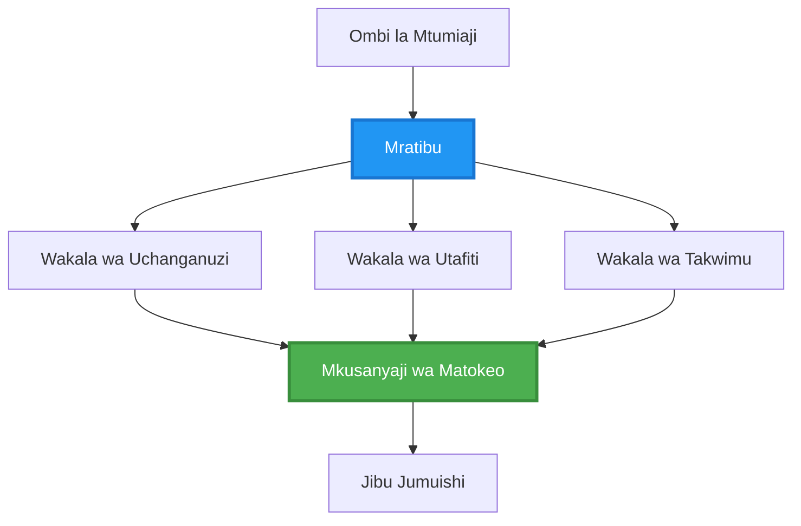
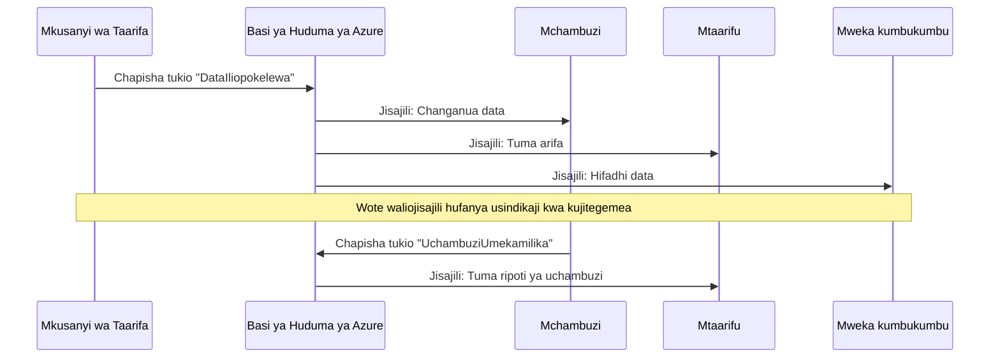
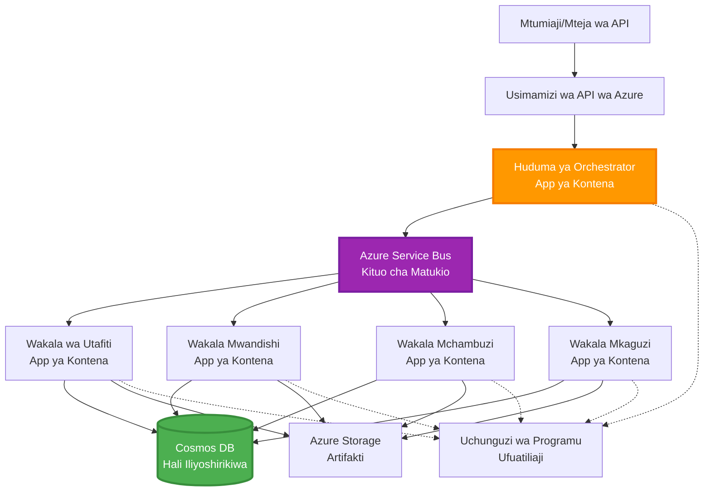

# Muundo wa Mawakala Wengi

⏱️ **Muda Uliokadiriwa**: 60-75 dakika | 💰 **Gharama Ilivyokadiriwa**: ~$100-300/mwezi | ⭐ **Ukomavu**: Chenye Utaalamu

**📚 Njia ya Kujifunza:**
- ← Iliyopita: [Capacity Planning](capacity-planning.md) - Uwezo wa rasilimali na mikakati ya upanuzi
- 🎯 **Uko Hapa**: Multi-Agent Coordination Patterns (Orchestration, communication, state management)
- → Ifuatayo: [SKU Selection](sku-selection.md) - Kuchagua huduma sahihi za Azure
- 🏠 [Course Home](../../README.md)

---

## Utakachojifunza

Kwa kumaliza somo hili, utapata:
- Elewa **mitindo ya usanifu wa mawakala wengi** na lini kuyatumia
- Tekeleza **mitindo ya uendeshaji** (kituo-kimoja, zisizo na kituo-kimoja, hierarki)
- Buni mikakati ya **mawasiliano ya mawakala** (synchronous, asynchronous, event-driven)
- Dhibiti **hali iliyoshirikiwa** kati ya mawakala waliogawanywa
- Zindua **mifumo ya mawakala wengi** kwenye Azure kwa AZD
- Tumia **mitindo ya uratibu** kwa matukio halisi ya AI
- Fuatilia na kutatua matatizo ya mifumo ya mawakala zilizogawanywa

## Kwa Nini Uratibu wa Mawakala Wengi Unahitajika

### Mageuzi: Kutoka kwa Wakala Mmoja hadi Mawakala Wengi

**Wakala Mmoja (Rahisi):**
```
User → Agent → Response
```
- ✅ Rahisi kuelewa na kutekeleza
- ✅ Haraka kwa kazi rahisi
- ❌ Inategemea uwezo wa mfano mmoja
- ❌ Haiwezi kukazia kazi ngumu kwa wakati mmoja
- ❌ Hakuna utaalamu maalum

**Mfumo wa Mawakala Wengi (Cha Kitaalamu):**
```mermaid
graph TD
    Orchestrator[Mratibu] --> Agent1[Wakala1<br/>Mpango]
    Orchestrator --> Agent2[Wakala2<br/>Msimbo]
    Orchestrator --> Agent3[Wakala3<br/>Mapitio]
```- ✅ Mawakala maalum kwa kazi mbalimbali
- ✅ Utekelezaji sambamba kwa kasi
- ✅ Moduli na rahisi kudumishwa
- ✅ Bora kwa mtiririko wa kazi ngumu
- ⚠️ Inahitaji mantiki ya uratibu

**Mfanano**: Wakala mmoja ni kama mtu mmoja anafanya kazi zote. Mawakala wengi ni kama timu ambapo kila mshiriki ana ujuzi maalum (mtafiti, mprogramu, mrekebishaji, mwandishi) wanaofanya kazi pamoja.

---

## Mifano ya Msingi ya Uratibu

### Mfumo 1: Uratibu wa Mtiririko (Mnyororo wa Majukumu)

**Wakati wa kutumia**: Kazi lazima zimalizwe kwa mpangilio maalum, kila wakala anajenga juu ya matokeo ya awali.

```mermaid
sequenceDiagram
    participant User
    participant Orchestrator
    participant Agent1 as Wakala wa Utafiti
    participant Agent2 as Wakala Mwandishi
    participant Agent3 as Wakala Mhariri
    
    User->>Orchestrator: "Andika makala kuhusu AI"
    Orchestrator->>Agent1: Fanya utafiti wa mada
    Agent1-->>Orchestrator: Matokeo ya utafiti
    Orchestrator->>Agent2: Andika rasimu (ukitumia utafiti)
    Agent2-->>Orchestrator: Rasimu ya makala
    Orchestrator->>Agent3: Hariri na boresha
    Agent3-->>Orchestrator: Makala ya mwisho
    Orchestrator-->>User: Makala iliyokamilishwa
    
    Note over User,Agent3: Mfululizo: Kila hatua inasubiri ile iliyotangulia
```
**Faida:**
- ✅ Mtiririko wa data wazi
- ✅ Rahisi kutatua shida
- ✅ Mpangilio wa utekelezaji unaotarajiwa

**Mapungufu:**
- ❌ Polepole (hakuna utendakazi sambamba)
- ❌ Hitilafu moja inazuia mnyororo mzima
- ❌ Haiwezi kushughulikia kazi zinategemeana kwa karibu

**Mifano ya Matumizi:**
- Mnyororo wa uundaji wa maudhui (utafiti → andika → hariri → chapisha)
- Uundaji wa msimbo (mpango → tekeleza → jaribu → weka uzalishaji)
- Uundaji wa ripoti (ukusanyaji wa data → uchambuzi → uonyeshaji → muhtasari)

---

### Mfumo 2: Uratibu wa Paraleli (Fan-Out/Fan-In)

**Wakati wa kutumia**: Kazi huru zinaweza kuendeshwa kwa wakati mmoja, matokeo yakakusanywa mwishoni.


**Faida:**
- ✅ Haraka (utekelezaji sambamba)
- ✅ Ustahimilivu wa hitilafu (matokeo sehemu yanakubaliwa)
- ✅ Inaweza kupanuka kwa usawa

**Mapungufu:**
- ⚠️ Matokeo yanaweza kufika bila mpangilio
- ⚠️ Inahitaji mantiki ya ukusanyaji
- ⚠️ Usimamizi wa hali ni mgumu

**Mifano ya Matumizi:**
- Ukusanyaji wa data kutoka vyanzo vingi (APIs + databases + web scraping)
- Uchambuzi wa ushindani (miundo mingi zanatoa suluhisho, bora inachaguliwa)
- Huduma za tafsiri (kutafsiri kwa lugha nyingi kwa wakati mmoja)

---

### Mfumo 3: Uratibu wa Msingi wa Hierarki (Meneja-Mfanyakazi)

**Wakati wa kutumia**: Midirisha ya kazi ngumu na kazi ndogo, inahitajika kusambaza.


**Faida:**
- ✅ Inashughulikia mtiririko wa kazi ngumu
- ✅ Moduli na rahisi kudumishwa
- ✅ Mipaka ya majukumu wazi

**Mapungufu:**
- ⚠️ Usanifu mgumu zaidi
- ⚠️ Ucheleweshaji mkubwa (tabaka nyingi za uratibu)
- ⚠️ Inahitaji uendeshaji wa hali ya juu

**Mifano ya Matumizi:**
- Usindikaji wa hati za shirika (ainisha → panga → chakata → hifadhi)
- Mnyororo wa data wa hatua nyingi (ingest → safisha → geuza → chunguza → ripoti)
- Mifumo tata ya kiotomatiki (mipango → mgawanyo wa rasilimali → utekelezaji → ufuatiliaji)

---

### Mfumo 4: Uratibu unaotokana na Matukio (Publish-Subscribe)

**Wakati wa kutumia**: Mawakala yanahitaji kutenda kwa matukio, muunganisho mdogo utakapotakiwa.


**Faida:**
- ✅ Uunganisho mdogo kati ya mawakala
- ✅ Rahisi kuongeza mawakala wapya (wanajiandikisha tu)
- ✅ Uandishi usio wa papo kwa papo (asynchronous)
- ✅ Ustahimilivu (uhifadhi wa ujumbe)

**Mapungufu:**
- ⚠️ Ulinganifu wa mwisho
- ⚠️ Ugumu wa kutatua matatizo
- ⚠️ Changamoto za mpangilio wa ujumbe

**Mifano ya Matumizi:**
- Mifumo ya ufuatiliaji wa wakati halisi (alarms, dashibodi, logi)
- Taarifa kwa njia nyingi (barua pepe, SMS, push, Slack)
- Mnyororo wa usindikaji wa data (walaji wengi wa data ile ile)

---

### Mfumo 5: Uratibu unaotegemea Makubaliano (Kura/Quorum)

**Wakati wa kutumia**: Inahitajika makubaliano kutoka kwa mawakala wengi kabla ya kuendelea.


**Faida:**
- ✅ Usahihi wa juu (maoni mengi)
- ✅ Ustahimilivu wa hitilafu (kosa la wachache unakubalika)
- ✅ Udhibiti wa ubora umejengwa

**Mapungufu:**
- ❌ Ghali (miito mingi kwa miundo)
- ❌ Polepole (kusubiri mawakala wote)
- ⚠️ Inahitajika utatuzi wa migogoro

**Mifano ya Matumizi:**
- Ufuatiliaji wa maudhui (miundo mingi hupitia maudhui)
- Ukaguzi wa msimbo (linters/analizaji nyingi)
- Utambuzi wa matibabu (miundo mingi ya AI, uhakiki wa mtaalam)

---

## Muhtasari wa Usanifu

### Mfumo Kamili wa Mawakala Wengi kwenye Azure


**Vipengele Muhimu:**

| Sehemu | Madhumuni | Azure Service |
|-----------|---------|---------------|
| **API Gateway** | Kituo cha kuingia, mpaka kasi, uthibitisho | API Management |
| **Orchestrator** | Inaratibu mtiririko wa kazi za mawakala | Container Apps |
| **Message Queue** | Mawasiliano ya asynchronou | Service Bus / Event Hubs |
| **Agents** | Wafanyakazi maalum wa AI | Container Apps / Functions |
| **State Store** | Hali iliyoshirikiwa, ufuatiliaji wa kazi | Cosmos DB |
| **Artifact Storage** | Hati, matokeo, logi | Blob Storage |
| **Monitoring** | Ufuatiliaji uliosambazwa, logi | Application Insights |

---

## Mahitaji ya Awali

### Vifaa Vinavyohitajika

```bash
# Thibitisha Azure Developer CLI
azd version
# ✅ Inatarajiwa: azd toleo 1.0.0 au juu zaidi

# Thibitisha Azure CLI
az --version
# ✅ Inatarajiwa: azure-cli 2.50.0 au juu zaidi

# Thibitisha Docker (kwa majaribio ya ndani)
docker --version
# ✅ Inatarajiwa: toleo la Docker 20.10 au juu zaidi
```

### Mahitaji ya Azure

- Usajili wa Azure unaofanya kazi
- Ruhusa za kuunda:
  - Container Apps
  - Service Bus namespaces
  - Cosmos DB accounts
  - Storage accounts
  - Application Insights

### Maarifa Yanayohitajika

Unapaswa kuwa umemaliza:
- [Configuration Management](../chapter-03-configuration/configuration.md)
- [Authentication & Security](../chapter-03-configuration/authsecurity.md)
- [Microservices Example](../../../../examples/microservices)

---

## Mwongozo wa Utekelezaji

### Muundo wa Mradi

```
multi-agent-system/
├── azure.yaml                    # AZD configuration
├── infra/
│   ├── main.bicep               # Main infrastructure
│   ├── core/
│   │   ├── servicebus.bicep     # Message queue
│   │   ├── cosmos.bicep         # State store
│   │   ├── storage.bicep        # Artifact storage
│   │   └── monitoring.bicep     # Application Insights
│   └── app/
│       ├── orchestrator.bicep   # Orchestrator service
│       └── agent.bicep          # Agent template
└── src/
    ├── orchestrator/            # Orchestration logic
    │   ├── app.py
    │   ├── workflows.py
    │   └── Dockerfile
    ├── agents/
    │   ├── research/            # Research agent
    │   ├── writer/              # Writer agent
    │   ├── analyst/             # Analyst agent
    │   └── reviewer/            # Reviewer agent
    └── shared/
        ├── state_manager.py     # Shared state logic
        └── message_handler.py   # Message handling
```

---

## Somo 1: Mfumo wa Uratibu wa Mtiririko

### Utekelezaji: Mnyororo wa Uundaji wa Maudhui

Tujenge mnyororo wa mfululizo: Utafiti → Andika → Hariri → Chapisha

### 1. Usanidi wa AZD

**File: `azure.yaml`**

```yaml
name: content-pipeline
metadata:
  template: multi-agent-sequential@1.0.0

services:
  orchestrator:
    project: ./src/orchestrator
    language: python
    host: containerapp
  
  research-agent:
    project: ./src/agents/research
    language: python
    host: containerapp
  
  writer-agent:
    project: ./src/agents/writer
    language: python
    host: containerapp
  
  editor-agent:
    project: ./src/agents/editor
    language: python
    host: containerapp
```

### 2. Miundombinu: Service Bus kwa Uratibu

**File: `infra/core/servicebus.bicep`**

```bicep
param name string
param location string
param tags object = {}

resource serviceBusNamespace 'Microsoft.ServiceBus/namespaces@2022-10-01-preview' = {
  name: name
  location: location
  tags: tags
  sku: {
    name: 'Standard'
    tier: 'Standard'
  }
  properties: {
    minimumTlsVersion: '1.2'
  }
}

// Queue for orchestrator → research agent
resource researchQueue 'Microsoft.ServiceBus/namespaces/queues@2022-10-01-preview' = {
  parent: serviceBusNamespace
  name: 'research-tasks'
  properties: {
    maxDeliveryCount: 3
    lockDuration: 'PT5M'
    deadLetteringOnMessageExpiration: true
  }
}

// Queue for research agent → writer agent
resource writerQueue 'Microsoft.ServiceBus/namespaces/queues@2022-10-01-preview' = {
  parent: serviceBusNamespace
  name: 'writer-tasks'
  properties: {
    maxDeliveryCount: 3
    lockDuration: 'PT5M'
  }
}

// Queue for writer agent → editor agent
resource editorQueue 'Microsoft.ServiceBus/namespaces/queues@2022-10-01-preview' = {
  parent: serviceBusNamespace
  name: 'editor-tasks'
  properties: {
    maxDeliveryCount: 3
    lockDuration: 'PT5M'
  }
}

output namespace string = serviceBusNamespace.name
output connectionString string = listKeys('${serviceBusNamespace.id}/AuthorizationRules/RootManageSharedAccessKey', serviceBusNamespace.apiVersion).primaryConnectionString
```

### 3. Meneja wa Hali Iliyoshirikiwa

**File: `src/shared/state_manager.py`**

```python
from azure.cosmos import CosmosClient, PartitionKey
from datetime import datetime
import os

class StateManager:
    """Manages shared state across agents using Cosmos DB"""
    
    def __init__(self):
        endpoint = os.environ['COSMOS_ENDPOINT']
        key = os.environ['COSMOS_KEY']
        
        self.client = CosmosClient(endpoint, key)
        self.database = self.client.get_database_client('agent-state')
        self.container = self.database.get_container_client('tasks')
    
    def create_task(self, task_id: str, task_type: str, input_data: dict):
        """Create a new task"""
        task = {
            'id': task_id,
            'type': task_type,
            'status': 'pending',
            'input': input_data,
            'created_at': datetime.utcnow().isoformat(),
            'steps': []
        }
        self.container.create_item(task)
        return task
    
    def update_task_step(self, task_id: str, step_name: str, result: dict):
        """Update task with completed step"""
        task = self.container.read_item(task_id, partition_key=task_id)
        
        task['steps'].append({
            'name': step_name,
            'completed_at': datetime.utcnow().isoformat(),
            'result': result
        })
        
        self.container.replace_item(task_id, task)
        return task
    
    def complete_task(self, task_id: str, final_result: dict):
        """Mark task as complete"""
        task = self.container.read_item(task_id, partition_key=task_id)
        task['status'] = 'completed'
        task['result'] = final_result
        task['completed_at'] = datetime.utcnow().isoformat()
        self.container.replace_item(task_id, task)
        return task
    
    def get_task(self, task_id: str):
        """Retrieve task state"""
        return self.container.read_item(task_id, partition_key=task_id)
```

### 4. Huduma ya Orchestrator

**File: `src/orchestrator/app.py`**

```python
from flask import Flask, request, jsonify
from azure.servicebus import ServiceBusClient, ServiceBusMessage
import json
import uuid
import os
from shared.state_manager import StateManager

app = Flask(__name__)
state_manager = StateManager()

# Muunganisho wa Service Bus
servicebus_connection_str = os.environ['SERVICEBUS_CONNECTION_STRING']
servicebus_client = ServiceBusClient.from_connection_string(servicebus_connection_str)

@app.route('/health', methods=['GET'])
def health():
    return jsonify({'status': 'healthy', 'service': 'orchestrator'})

@app.route('/create-content', methods=['POST'])
def create_content():
    """
    Sequential workflow: Research → Write → Edit → Publish
    """
    data = request.json
    topic = data.get('topic')
    
    if not topic:
        return jsonify({'error': 'Topic required'}), 400
    
    # Unda kazi katika hifadhi ya hali
    task_id = str(uuid.uuid4())
    task = state_manager.create_task(
        task_id=task_id,
        task_type='content_creation',
        input_data={'topic': topic}
    )
    
    # Tuma ujumbe kwa wakala wa utafiti (hatua ya kwanza)
    sender = servicebus_client.get_queue_sender('research-tasks')
    message = ServiceBusMessage(
        body=json.dumps({
            'task_id': task_id,
            'topic': topic,
            'next_queue': 'writer-tasks'  # Mahali pa kutuma matokeo
        }),
        content_type='application/json'
    )
    
    with sender:
        sender.send_messages(message)
    
    return jsonify({
        'task_id': task_id,
        'status': 'started',
        'workflow': 'sequential',
        'steps': ['research', 'write', 'edit', 'publish'],
        'message': 'Content creation pipeline initiated'
    }), 202

@app.route('/task/<task_id>', methods=['GET'])
def get_task_status(task_id):
    """Check task status"""
    try:
        task = state_manager.get_task(task_id)
        return jsonify(task)
    except Exception as e:
        return jsonify({'error': str(e)}), 404

if __name__ == '__main__':
    app.run(host='0.0.0.0', port=8080)
```

### 5. Wakala wa Utafiti

**File: `src/agents/research/app.py`**

```python
from azure.servicebus import ServiceBusClient, ServiceBusMessage
from openai import AzureOpenAI
import json
import os
import time
from shared.state_manager import StateManager

# Anzisha wateja
state_manager = StateManager()
servicebus_client = ServiceBusClient.from_connection_string(
    os.environ['SERVICEBUS_CONNECTION_STRING']
)

openai_client = AzureOpenAI(
    api_key=os.environ['AZURE_OPENAI_API_KEY'],
    api_version="2024-02-01",
    azure_endpoint=os.environ['AZURE_OPENAI_ENDPOINT']
)

def process_research_task(message_data):
    """Process research request and pass to writer"""
    task_id = message_data['task_id']
    topic = message_data['topic']
    next_queue = message_data['next_queue']
    
    print(f"🔬 Researching: {topic}")
    
    # Piga wito kwa Microsoft Foundry Models kwa ajili ya utafiti
    response = openai_client.chat.completions.create(
        model="gpt-4.1",
        messages=[
            {"role": "system", "content": "You are a research assistant. Provide comprehensive research on the given topic."},
            {"role": "user", "content": f"Research this topic thoroughly: {topic}"}
        ],
        max_tokens=1500
    )
    
    research_results = response.choices[0].message.content
    
    # Sasisha hali
    state_manager.update_task_step(
        task_id=task_id,
        step_name='research',
        result={'research': research_results}
    )
    
    # Tuma kwa wakala ufuatao (mwandishi)
    sender = servicebus_client.get_queue_sender(next_queue)
    message = ServiceBusMessage(
        body=json.dumps({
            'task_id': task_id,
            'topic': topic,
            'research': research_results,
            'next_queue': 'editor-tasks'
        }),
        content_type='application/json'
    )
    
    with sender:
        sender.send_messages(message)
    
    print(f"✅ Research complete for task {task_id}")

def main():
    """Listen to research queue"""
    receiver = servicebus_client.get_queue_receiver('research-tasks')
    
    print("🔬 Research Agent started, listening for tasks...")
    
    with receiver:
        while True:
            messages = receiver.receive_messages(max_wait_time=5)
            for message in messages:
                try:
                    message_data = json.loads(str(message))
                    process_research_task(message_data)
                    receiver.complete_message(message)
                except Exception as e:
                    print(f"❌ Error processing message: {e}")
                    receiver.abandon_message(message)

if __name__ == '__main__':
    main()
```

### 6. Wakala wa Uandishi

**File: `src/agents/writer/app.py`**

```python
from azure.servicebus import ServiceBusClient, ServiceBusMessage
from openai import AzureOpenAI
import json
import os
from shared.state_manager import StateManager

state_manager = StateManager()
servicebus_client = ServiceBusClient.from_connection_string(
    os.environ['SERVICEBUS_CONNECTION_STRING']
)

openai_client = AzureOpenAI(
    api_key=os.environ['AZURE_OPENAI_API_KEY'],
    api_version="2024-02-01",
    azure_endpoint=os.environ['AZURE_OPENAI_ENDPOINT']
)

def process_writing_task(message_data):
    """Write article based on research"""
    task_id = message_data['task_id']
    topic = message_data['topic']
    research = message_data['research']
    next_queue = message_data['next_queue']
    
    print(f"✍️ Writing article: {topic}")
    
    # Witisha Microsoft Foundry Models ili kuandika makala
    response = openai_client.chat.completions.create(
        model="gpt-4.1",
        messages=[
            {"role": "system", "content": "You are a professional writer. Write engaging, well-structured articles."},
            {"role": "user", "content": f"Based on this research:\n\n{research}\n\nWrite a comprehensive article about: {topic}"}
        ],
        max_tokens=2000
    )
    
    article_draft = response.choices[0].message.content
    
    # Sasisha hali
    state_manager.update_task_step(
        task_id=task_id,
        step_name='writing',
        result={'draft': article_draft}
    )
    
    # Tuma kwa mhariri
    sender = servicebus_client.get_queue_sender(next_queue)
    message = ServiceBusMessage(
        body=json.dumps({
            'task_id': task_id,
            'topic': topic,
            'draft': article_draft
        }),
        content_type='application/json'
    )
    
    with sender:
        sender.send_messages(message)
    
    print(f"✅ Article draft complete for task {task_id}")

def main():
    """Listen to writer queue"""
    receiver = servicebus_client.get_queue_receiver('writer-tasks')
    
    print("✍️ Writer Agent started, listening for tasks...")
    
    with receiver:
        while True:
            messages = receiver.receive_messages(max_wait_time=5)
            for message in messages:
                try:
                    message_data = json.loads(str(message))
                    process_writing_task(message_data)
                    receiver.complete_message(message)
                except Exception as e:
                    print(f"❌ Error: {e}")
                    receiver.abandon_message(message)

if __name__ == '__main__':
    main()
```

### 7. Wakala wa Uhariri

**File: `src/agents/editor/app.py`**

```python
from azure.servicebus import ServiceBusClient
from openai import AzureOpenAI
import json
import os
from shared.state_manager import StateManager

state_manager = StateManager()
servicebus_client = ServiceBusClient.from_connection_string(
    os.environ['SERVICEBUS_CONNECTION_STRING']
)

openai_client = AzureOpenAI(
    api_key=os.environ['AZURE_OPENAI_API_KEY'],
    api_version="2024-02-01",
    azure_endpoint=os.environ['AZURE_OPENAI_ENDPOINT']
)

def process_editing_task(message_data):
    """Edit and finalize article"""
    task_id = message_data['task_id']
    topic = message_data['topic']
    draft = message_data['draft']
    
    print(f"📝 Editing article: {topic}")
    
    # Waita Microsoft Foundry Models ili kuhariri
    response = openai_client.chat.completions.create(
        model="gpt-4.1",
        messages=[
            {"role": "system", "content": "You are an expert editor. Improve grammar, clarity, and structure."},
            {"role": "user", "content": f"Edit and improve this article:\n\n{draft}"}
        ],
        max_tokens=2000
    )
    
    final_article = response.choices[0].message.content
    
    # Alama kazi kama imekamilika
    state_manager.complete_task(
        task_id=task_id,
        final_result={
            'topic': topic,
            'final_article': final_article,
            'word_count': len(final_article.split())
        }
    )
    
    print(f"✅ Article finalized for task {task_id}")

def main():
    """Listen to editor queue"""
    receiver = servicebus_client.get_queue_receiver('editor-tasks')
    
    print("📝 Editor Agent started, listening for tasks...")
    
    with receiver:
        while True:
            messages = receiver.receive_messages(max_wait_time=5)
            for message in messages:
                try:
                    message_data = json.loads(str(message))
                    process_editing_task(message_data)
                    receiver.complete_message(message)
                except Exception as e:
                    print(f"❌ Error: {e}")
                    receiver.abandon_message(message)

if __name__ == '__main__':
    main()
```

### 8. Tekeleza na Jaribu

```bash
# Chaguo A: Utekelezaji unaotegemea templeti
azd init
azd up

# Chaguo B: Utekelezaji kupitia manifesti ya wakala (inahitaji nyongeza)
azd extension install azure.ai.agents
azd ai agent init -m agent-manifest.yaml
azd up
```

> Angalia [AZD AI CLI Commands](../chapter-08-production/production-ai-practices.md#azd-ai-cli-commands-and-extensions) kwa `azd ai` bendera na chaguo zote.

```bash
# Pata URL ya mratibu
ORCHESTRATOR_URL=$(azd env get-values | grep ORCHESTRATOR_URL | cut -d '=' -f2 | tr -d '"')

# Unda maudhui
curl -X POST $ORCHESTRATOR_URL/create-content \
  -H "Content-Type: application/json" \
  -d '{"topic": "The Future of AI in Healthcare"}'
```

**✅ Matokeo yanayotarajiwa:**
```json
{
  "task_id": "a1b2c3d4-e5f6-7890-abcd-ef1234567890",
  "status": "started",
  "workflow": "sequential",
  "steps": ["research", "write", "edit", "publish"],
  "message": "Content creation pipeline initiated"
}
```

**Angalia maendeleo ya kazi:**
```bash
TASK_ID="a1b2c3d4-e5f6-7890-abcd-ef1234567890"
curl $ORCHESTRATOR_URL/task/$TASK_ID
```

**✅ Matokeo yanayotarajiwa (imekamilika):**
```json
{
  "id": "a1b2c3d4-e5f6-7890-abcd-ef1234567890",
  "type": "content_creation",
  "status": "completed",
  "steps": [
    {
      "name": "research",
      "completed_at": "2025-11-19T10:30:00Z",
      "result": {"research": "..."}
    },
    {
      "name": "writing",
      "completed_at": "2025-11-19T10:32:00Z",
      "result": {"draft": "..."}
    }
  ],
  "result": {
    "topic": "The Future of AI in Healthcare",
    "final_article": "...",
    "word_count": 1500
  }
}
```

---

## Somo 2: Mfumo wa Uratibu wa Paraleli

### Utekelezaji: Mkusanyaji wa Utafiti kutoka Vyanzo Vingi

Tujenge mfumo wa paraleli unaokusanya habari kutoka vyanzo vingi kwa wakati mmoja.

### Orchestrator wa Paraleli

**File: `src/orchestrator/parallel_workflow.py`**

```python
from flask import Flask, request, jsonify
from azure.servicebus import ServiceBusClient, ServiceBusMessage
import json
import uuid
import os
from shared.state_manager import StateManager

app = Flask(__name__)
state_manager = StateManager()

servicebus_client = ServiceBusClient.from_connection_string(
    os.environ['SERVICEBUS_CONNECTION_STRING']
)

@app.route('/research-parallel', methods=['POST'])
def research_parallel():
    """
    Parallel workflow: Multiple agents work simultaneously
    """
    data = request.json
    query = data.get('query')
    
    task_id = str(uuid.uuid4())
    task = state_manager.create_task(
        task_id=task_id,
        task_type='parallel_research',
        input_data={
            'query': query,
            'agents': ['web', 'academic', 'news', 'social']
        }
    )
    
    # Kusambaza: Tuma kwa mawakala wote kwa wakati mmoja
    agents = [
        ('web-research-queue', 'web'),
        ('academic-research-queue', 'academic'),
        ('news-research-queue', 'news'),
        ('social-research-queue', 'social')
    ]
    
    for queue_name, agent_type in agents:
        sender = servicebus_client.get_queue_sender(queue_name)
        message = ServiceBusMessage(
            body=json.dumps({
                'task_id': task_id,
                'query': query,
                'agent_type': agent_type,
                'result_queue': 'aggregation-queue'
            }),
            content_type='application/json'
        )
        
        with sender:
            sender.send_messages(message)
    
    return jsonify({
        'task_id': task_id,
        'status': 'started',
        'workflow': 'parallel',
        'agents_dispatched': 4,
        'message': 'Parallel research initiated'
    }), 202

if __name__ == '__main__':
    app.run(host='0.0.0.0', port=8080)
```

### Mantiki ya Ukusanyaji

**File: `src/agents/aggregator/app.py`**

```python
from azure.servicebus import ServiceBusClient
import json
import os
from collections import defaultdict
from shared.state_manager import StateManager

state_manager = StateManager()
servicebus_client = ServiceBusClient.from_connection_string(
    os.environ['SERVICEBUS_CONNECTION_STRING']
)

# Fuatilia matokeo kwa kila kazi
task_results = defaultdict(list)
expected_agents = 4  # mtandao, kitaaluma, habari, kijamii

def process_result(message_data):
    """Aggregate results from parallel agents"""
    task_id = message_data['task_id']
    agent_type = message_data['agent_type']
    result = message_data['result']
    
    # Hifadhi matokeo
    task_results[task_id].append({
        'agent': agent_type,
        'data': result
    })
    
    print(f"📊 Received result from {agent_type} agent ({len(task_results[task_id])}/{expected_agents})")
    
    # Angalia kama mawakala wote wamekamilisha (fan-in)
    if len(task_results[task_id]) == expected_agents:
        print(f"✅ All agents completed for task {task_id}. Aggregating...")
        
        # Changanya matokeo
        aggregated = {
            'query': message_data['query'],
            'sources': task_results[task_id],
            'summary': generate_summary(task_results[task_id])
        }
        
        # Alama kama imekamilika
        state_manager.complete_task(task_id, aggregated)
        
        # Safisha
        del task_results[task_id]
        
        print(f"✅ Aggregation complete for task {task_id}")

def generate_summary(results):
    """Generate summary from all sources"""
    summaries = [r['data'].get('summary', '') for r in results]
    return '\n\n'.join(summaries)

def main():
    """Listen to aggregation queue"""
    receiver = servicebus_client.get_queue_receiver('aggregation-queue')
    
    print("📊 Aggregator started, listening for results...")
    
    with receiver:
        while True:
            messages = receiver.receive_messages(max_wait_time=5)
            for message in messages:
                try:
                    message_data = json.loads(str(message))
                    process_result(message_data)
                    receiver.complete_message(message)
                except Exception as e:
                    print(f"❌ Error: {e}")
                    receiver.abandon_message(message)

if __name__ == '__main__':
    main()
```

**Faida za Mfumo wa Paraleli:**
- ⚡ **Haraka mara 4** (mawakala wanakwenda kwa wakati mmoja)
- 🔄 **Ustahimilivu wa hitilafu** (matokeo sehemu yanakubaliwa)
- 📈 **Inaweza kupanuka** (ongeza mawakala kwa urahisi)

---

## Mazoezi ya Vitendo

### Zoefzo 1: Ongeza Usimamizi wa Muda (Timeout) ⭐⭐ (Kiwango cha Wastani)

**Lengo**: Tekeleza mantiki ya timeout ili ukusanyaji usisubiri milele kwa mawakala polepole.

**Hatua**:

1. **Ongeza ufuatiliaji wa timeout kwa aggregator:**

```python
from datetime import datetime, timedelta

task_timeouts = {}  # task_id -> expiration_time

def process_result(message_data):
    task_id = message_data['task_id']
    
    # Weka muda wa kukomesha kwenye matokeo ya kwanza
    if task_id not in task_timeouts:
        task_timeouts[task_id] = datetime.utcnow() + timedelta(seconds=30)
    
    task_results[task_id].append({
        'agent': message_data['agent_type'],
        'data': message_data['result']
    })
    
    # Angalia ikiwa imekamilika AU imepitwa na muda
    if len(task_results[task_id]) == expected_agents or \
       datetime.utcnow() > task_timeouts[task_id]:
        
        print(f"📊 Aggregating with {len(task_results[task_id])}/{expected_agents} results")
        
        aggregated = {
            'query': message_data['query'],
            'sources': task_results[task_id],
            'completed_agents': len(task_results[task_id]),
            'timed_out': len(task_results[task_id]) < expected_agents
        }
        
        state_manager.complete_task(task_id, aggregated)
        
        # Usafishaji
        del task_results[task_id]
        del task_timeouts[task_id]
```

2. **Jaribu kwa ucheleweshaji bandia:**

```python
# Kwa wakala mmoja, ongeza ucheleweshaji ili kuiga usindikaji polepole
import time
time.sleep(35)  # Inazidi kikomo cha sekunde 30
```

3. **Tekeleza na thibitisha:**

```bash
azd deploy aggregator

# Wasilisha kazi
curl -X POST $ORCHESTRATOR_URL/research-parallel \
  -H "Content-Type: application/json" \
  -d '{"query": "AI safety research"}'

# Angalia matokeo baada ya sekunde 30
curl $ORCHESTRATOR_URL/task/$TASK_ID
```

**✅ Vigezo vya Mafanikio:**
- ✅ Kazi inakamilika baada ya sekunde 30 hata kama mawakala hawajakamilika
- ✅ Jibu linaonyesha matokeo ya sehemu (`"timed_out": true`)
- ✅ Matokeo yaliyopo yanarejeshwa (3 kati ya mawakala 4)

**Muda**: 20-25 dakika

---

### Zoefzo 2: Tekeleza Mantiki ya Kurudia (Retry) ⭐⭐⭐ (Chenye Utaalamu)

**Lengo**: Rudia kazi za wakala zilizoshindwa moja kwa moja kabla ya kukata tamaa.

**Hatua**:

1. **Ongeza ufuatiliaji wa kurudia kwa orchestrator:**

```python
from dataclasses import dataclass
from typing import Dict

@dataclass
class RetryConfig:
    max_retries: int = 3
    backoff_seconds: int = 5

retry_counts: Dict[str, int] = {}  # kitambulisho_cha_ujumbe -> idadi_ya_jaribio

def send_with_retry(queue_name: str, message_data: dict, retry_config: RetryConfig):
    """Send message with retry metadata"""
    message_id = message_data.get('message_id', str(uuid.uuid4()))
    message_data['message_id'] = message_id
    message_data['retry_count'] = retry_counts.get(message_id, 0)
    message_data['max_retries'] = retry_config.max_retries
    
    sender = servicebus_client.get_queue_sender(queue_name)
    message = ServiceBusMessage(
        body=json.dumps(message_data),
        content_type='application/json',
        message_id=message_id
    )
    
    with sender:
        sender.send_messages(message)
```

2. **Ongeza mshandisi wa kurudia kwa mawakala:**

```python
def process_with_retry(message, receiver, process_func):
    """Process message with automatic retry on failure"""
    try:
        message_data = json.loads(str(message))
        
        # Chakata ujumbe
        process_func(message_data)
        
        # Imefanikiwa - imekamilika
        receiver.complete_message(message)
        
    except Exception as e:
        message_id = message.message_id
        retry_count = message_data.get('retry_count', 0)
        max_retries = message_data.get('max_retries', 3)
        
        if retry_count < max_retries:
            # Jaribu tena: acha na uweke tena kwenye safu kwa kuongeza idadi
            print(f"⚠️ Retry {retry_count + 1}/{max_retries} for message {message_id}")
            
            message_data['retry_count'] = retry_count + 1
            
            # Tuma tena kwenye safu ile ile kwa ucheleweshaji
            time.sleep(5 * (retry_count + 1))  # Ucheleweshaji wa kuongezeka kwa mlingano
            send_with_retry(queue_name, message_data, RetryConfig())
            
            receiver.complete_message(message)  # Ondoa asili
        else:
            # Idadi ya majaribio imezidi - hamisha kwenye foleni ya barua zilizokufa
            print(f"❌ Max retries exceeded for message {message_id}")
            receiver.dead_letter_message(
                message,
                reason="MaxRetriesExceeded",
                error_description=str(e)
            )
```

3. **Fuatilia foleni ya dead letter:**

```python
def monitor_dead_letters():
    """Check dead letter queue for failed messages"""
    receiver = servicebus_client.get_queue_receiver(
        'research-queue',
        sub_queue='deadletter'
    )
    
    with receiver:
        messages = receiver.receive_messages(max_wait_time=5)
        for message in messages:
            print(f"☠️ Dead letter: {message.message_id}")
            print(f"Reason: {message.dead_letter_reason}")
            print(f"Description: {message.dead_letter_error_description}")
```

**✅ Vigezo vya Mafanikio:**
- ✅ Kazi zilizoshindwa zinarudia moja kwa moja (hadi mara 3)
- ✅ Kuongeza muda kwa kila kurudia (exponential backoff) (5s, 10s, 15s)
- ✅ Baada ya jaribio za juu, ujumbe unaenda kwenye dead letter queue
- ✅ Dead letter queue inaweza kufuatiliwa na kuchezwa tena

**Muda**: 30-40 dakika

---

### Zoefzo 3: Tekeleza Circuit Breaker ⭐⭐⭐ (Chenye Utaalamu)

**Lengo**: Zuia kuenea kwa matatizo kwa kusitisha maombi kwa mawakala wanaoshindwa.

**Hatua**:

1. **Unda darasa la circuit breaker:**

```python
from enum import Enum
from datetime import datetime, timedelta

class CircuitState(Enum):
    CLOSED = "closed"      # Uendeshaji wa kawaida
    OPEN = "open"          # Inashindwa, kataa maombi
    HALF_OPEN = "half_open"  # Inajaribu ikiwa imepona

class CircuitBreaker:
    def __init__(self, failure_threshold=5, timeout_seconds=60):
        self.failure_threshold = failure_threshold
        self.timeout_seconds = timeout_seconds
        self.failure_count = 0
        self.last_failure_time = None
        self.state = CircuitState.CLOSED
    
    def call(self, func):
        """Execute function with circuit breaker protection"""
        if self.state == CircuitState.OPEN:
            # Angalia ikiwa muda wa kusubiri umeisha
            if datetime.utcnow() - self.last_failure_time > timedelta(seconds=self.timeout_seconds):
                self.state = CircuitState.HALF_OPEN
                print("🔄 Circuit breaker: HALF_OPEN (testing)")
            else:
                raise Exception(f"Circuit breaker OPEN for agent. Try again in {self.timeout_seconds}s")
        
        try:
            result = func()
            
            # Mafanikio
            if self.state == CircuitState.HALF_OPEN:
                self.state = CircuitState.CLOSED
                self.failure_count = 0
                print("✅ Circuit breaker: CLOSED (recovered)")
            
            return result
            
        except Exception as e:
            self.failure_count += 1
            self.last_failure_time = datetime.utcnow()
            
            if self.failure_count >= self.failure_threshold:
                self.state = CircuitState.OPEN
                print(f"🔴 Circuit breaker: OPEN (too many failures)")
            
            raise e
```

2. **Tumia kwa miito ya wakala:**

```python
# Katika mratibu
agent_circuits = {
    'web': CircuitBreaker(failure_threshold=5, timeout_seconds=60),
    'academic': CircuitBreaker(failure_threshold=5, timeout_seconds=60),
    'news': CircuitBreaker(failure_threshold=5, timeout_seconds=60),
    'social': CircuitBreaker(failure_threshold=5, timeout_seconds=60)
}

def send_to_agent(agent_type, message_data):
    """Send with circuit breaker protection"""
    circuit = agent_circuits[agent_type]
    
    try:
        circuit.call(lambda: send_message(agent_type, message_data))
    except Exception as e:
        print(f"⚠️ Skipping {agent_type} agent: {e}")
        # Endelea na mawakala wengine
```

3. **Jaribu circuit breaker:**

```bash
# Iga kushindwa mara kwa mara (simamisha wakala mmoja)
az containerapp stop --name web-research-agent --resource-group rg-agents

# Tuma maombi kadhaa
for i in {1..10}; do
  curl -X POST $ORCHESTRATOR_URL/research-parallel \
    -H "Content-Type: application/json" \
    -d '{"query": "test query '$i'"}'
  sleep 2
done

# Angalia logi - unapaswa kuona mzunguko umefunguka baada ya kushindwa mara 5
# Tumia Azure CLI kwa logi za Container App:
az containerapp logs show --name orchestrator --resource-group $RG_NAME --tail 50
```

**✅ Vigezo vya Mafanikio:**
- ✅ Baada ya kushindwa mara 5, mzunguko unafunguka (unakataa maombi)
- ✅ Baada ya sekunde 60, mzunguko unasonga kuwa nusu wazi (hupima urejesho)
- ✅ Mawakala wengine wanaendelea kufanya kazi vizuri
- ✅ Mzunguko unafunga moja kwa moja wakati wakala anapopona

**Muda**: 40-50 dakika

---

## Ufuatiliaji na Utatuzi wa Hitilafu

### Ufuatiliaji uliosambazwa kwa Application Insights

**File: `src/shared/tracing.py`**

```python
from opencensus.ext.azure.log_exporter import AzureLogHandler
from opencensus.ext.azure.trace_exporter import AzureExporter
from opencensus.trace import config_integration
from opencensus.trace.tracer import Tracer
from opencensus.trace.samplers import AlwaysOnSampler
import logging
import os

# Sanidi ufuatiliaji
config_integration.trace_integrations(['requests', 'logging'])

connection_string = os.environ.get('APPLICATIONINSIGHTS_CONNECTION_STRING')

# Unda mfuatiliaji
tracer = Tracer(
    exporter=AzureExporter(connection_string=connection_string),
    sampler=AlwaysOnSampler()
)

# Sanidi uandishi wa kumbukumbu
logger = logging.getLogger(__name__)
logger.addHandler(AzureLogHandler(connection_string=connection_string))
logger.setLevel(logging.INFO)

def trace_agent_call(agent_name, task_id, operation):
    """Trace agent operations"""
    with tracer.span(name=f'{agent_name}.{operation}') as span:
        span.add_attribute('agent', agent_name)
        span.add_attribute('task_id', task_id)
        span.add_attribute('operation', operation)
        
        try:
            result = operation()
            span.add_attribute('status', 'success')
            return result
        except Exception as e:
            span.add_attribute('status', 'error')
            span.add_attribute('error', str(e))
            raise
```

### Maswali ya Application Insights

**Fuata mitiririko ya kazi za mawakala wengi:**

```kusto
// Trace complete workflow for a task
traces
| where customDimensions.task_id == "a1b2c3d4-..."
| project timestamp, message, customDimensions.agent, customDimensions.operation
| order by timestamp asc
```

**Ulinganisho wa utendaji wa wakala:**

```kusto
// Compare agent execution times
dependencies
| where name contains "agent"
| summarize 
    avg_duration = avg(duration),
    p95_duration = percentile(duration, 95),
    count = count()
  by agent = tostring(customDimensions.agent)
| order by avg_duration desc
```

**Uchambuzi wa kushindwa:**

```kusto
// Find which agents fail most
exceptions
| where customDimensions.agent != ""
| summarize 
    failure_count = count(),
    unique_errors = dcount(outerMessage)
  by agent = tostring(customDimensions.agent)
| order by failure_count desc
```

---

## Uchambuzi wa Gharama

### Gharama za Mfumo wa Mawakala Wengi (Makadirio ya Kila Mwezi)

| Component | Configuration | Cost |
|-----------|--------------|------|
| **Orchestrator** | 1 Container App (1 vCPU, 2GB) | $30-50 |
| **4 Agents** | 4 Container Apps (0.5 vCPU, 1GB each) | $60-120 |
| **Service Bus** | Standard tier, 10M messages | $10-20 |
| **Cosmos DB** | Serverless, 5GB storage, 1M RUs | $25-50 |
| **Blob Storage** | 10GB storage, 100K operations | $5-10 |
| **Application Insights** | 5GB ingestion | $10-15 |
| **Microsoft Foundry Models** | gpt-4.1, 10M tokens | $100-300 |
| **Total** | | **$240-565/month** |

### Mikakati ya Kupunguza Gharama

1. **Tumia serverless pale inapowezekana:**
   ```bicep
   // Cosmos DB serverless (no minimum cost)
   properties: {
     databaseAccountOfferType: 'Standard'
     capabilities: [{ name: 'EnableServerless' }]
   }
   ```

2. **Punguza mawakala hadi sifuri wanapokaa bila shughuli:**
   ```bicep
   scale: {
     minReplicas: 0  // Scale to zero when no messages
     maxReplicas: 10
   }
   ```

3. **Tumia batching kwa Service Bus:**
   ```python
   # Tuma ujumbe kwa vifurushi (gharama nafuu)
   sender.send_messages([message1, message2, message3])
   ```

4. **Cache matokeo yanayotumika mara kwa mara:**
   ```python
   # Tumia Azure Cache for Redis
   if cache.exists(query_hash):
       return cache.get(query_hash)
   ```

---

## Mbinu Bora

### ✅ FANYA:

1. **Tumia operesheni zisizobadilika (idempotent)**
   ```python
   # Wakala anaweza kushughulikia ujumbe ule ule mara nyingi kwa usalama
   def process_task(task_id):
       if state_manager.task_exists(task_id):
           print(f"Task {task_id} already processed, skipping")
           return
       # Chakata kazi...
   ```

2. **Tekeleza utenganishaji wa logi kwa kina**
   ```python
   logger.info(f"Agent: {agent_name}, Task: {task_id}, Action: {action}")
   ```

3. **Tumia correlation IDs**
   ```python
   # Pitisha task_id kupitia mtiririko mzima wa kazi
   message_data = {
       'task_id': task_id,  # Kitambulisho cha muunganisho
       'timestamp': datetime.utcnow().isoformat()
   }
   ```

4. **Weka TTL kwa ujumbe (time-to-live)**
   ```bicep
   properties: {
     defaultMessageTimeToLive: 'PT1H'  // 1 hour max
   }
   ```

5. **Fuatilia dead letter queues**
   ```python
   # Ufuatiliaji wa mara kwa mara wa ujumbe ulioshindwa
   monitor_dead_letters()
   ```

### ❌ USIFANYE:

1. **Usiunde utegemezi wa mzunguko**
   ```python
   # ❌ MBAYA: Wakala A → Wakala B → Wakala A (mzunguko usio na mwisho)
   # ✅ BORA: Fafanua kwa uwazi grafu elekezayo isiyo na duara (DAG)
   ```

2. **Usizui thread za wakala**
   ```python
   # ❌ MBAYA: Kusubiri kwa sinkroni
   while not task_complete:
       time.sleep(1)
   
   # ✅ BORA: Tumia callbacks za foleni ya ujumbe
   ```

3. **Usiache makosa ya sehemu bila kuyashughulikia**
   ```python
   # ❌ MBAYA: Kusababisha mchakato mzima kushindwa ikiwa wakala mmoja atashindwa
   # ✅ NZURI: Rejesha matokeo ya sehemu na viashiria vya makosa
   ```

4. **Usitumie jaribio zisizo na ukomo**
   ```python
   # ❌ MBAYA: jaribu tena milele
   # ✅ BORA: max_retries = 3, kisha kwenda kwenye 'dead letter'
   ```

---

## Mwongozo wa Utatuzi wa Matatizo

### Tatizo: Ujumbe umekwama kwenye foleni

**Dalili:**
- Ujumbe zinaongezeka kwenye foleni
- Mawakala hawashughuliki
- Hali ya kazi imekwama "pending"

**Uchambuzi:**
```bash
# Kagua kina cha foleni
az servicebus queue show \
  --namespace-name mybus \
  --name research-tasks \
  --query "countDetails"

# Kagua kumbukumbu za wakala kwa kutumia Azure CLI
az containerapp logs show --name research-agent --resource-group $RG_NAME --tail 50
```

**Suluhisho:**

1. **Ongeza nakala za mawakala:**
   ```bash
   az containerapp update \
     --name research-agent \
     --min-replicas 3 \
     --max-replicas 10
   ```

2. **Kagua foleni ya dead-letter:**
   ```bash
   az servicebus queue show \
     --namespace-name mybus \
     --name research-tasks \
     --query "countDetails.deadLetterMessageCount"
   ```

---

### Tatizo: Muda wa kazi umeisha/haijakamilika

**Dalili:**
- Hali ya kazi inabaki "in_progress"
- Baadhi ya mawakala wanakamilisha, wengine hawakamilishi
- Hakuna ujumbe wa kosa

**Uchambuzi:**
```bash
# Angalia hali ya kazi
curl $ORCHESTRATOR_URL/task/$TASK_ID

# Angalia Application Insights
# Endesha query: traces | where customDimensions.task_id == "..."
```

**Suluhisho:**

1. **Tekeleza muda wa kusubiri katika aggregator (Mazoezi 1)**

2. **Angalia kwa kushindwa kwa mawakala ukitumia Azure Monitor:**
   ```bash
   # Tazama logi kupitia azd monitor
   azd monitor --logs
   
   # Au tumia Azure CLI kuangalia logi za programu za kontena maalum
   az containerapp logs show --name <agent-name> --resource-group $RG_NAME --follow | grep "ERROR\|FAIL"
   ```

3. **Hakikisha mawakala wote wanaendelea kufanya kazi:**
   ```bash
   az containerapp list \
     --resource-group rg-agents \
     --query "[].{name:name, status:properties.runningStatus}"
   ```

---

## Jifunze Zaidi

### Nyaraka Rasmi
- [Azure Service Bus](https://learn.microsoft.com/azure/service-bus-messaging/service-bus-messaging-overview)
- [Cosmos DB](https://learn.microsoft.com/azure/cosmos-db/introduction)
- [Container Apps DAPR](https://learn.microsoft.com/azure/container-apps/dapr-overview)
- [Multi-Agent Design Patterns](https://learn.microsoft.com/azure/architecture/guide/ai/multi-agent-systems)

### Hatua Zifuatazo Kwenye Kozi Hii
- ← Iliyopita: [Mipango ya Uwezo](capacity-planning.md)
- → Ifuatayo: [Uchaguzi wa SKU](sku-selection.md)
- 🏠 [Nyumbani kwa Kozi](../../README.md)

### Mifano Inayohusiana
- [Mfano wa Microservices](../../../../examples/microservices) - miundo ya mawasiliano ya huduma
- [Mfano wa Microsoft Foundry Models](../../../../examples/azure-openai-chat) - ujumuishaji wa AI

---

## Muhtasari

**Umejifunza:**
- ✅ Mifumo mitano ya uratibu (mfululizo, sambamba, ya ngazi, inayoendeshwa na matukio, makubaliano)
- ✅ Miundo ya mawakala wengi kwenye Azure (Service Bus, Cosmos DB, Container Apps)
- ✅ Usimamizi wa hali miongoni mwa mawakala waliogawanywa
- ✅ Usimamizi wa muda wa kusubiri, jaribio upya, na vizuizi vya mzunguko
- ✅ Ufuatiliaji na utatuzi wa hitilafu kwenye mifumo iliyogawanywa
- ✅ Mikakati ya kuboresha gharama

**Mambo Muhimu ya Kukumbuka:**
1. **Chagua muundo sahihi** - Mfululizo kwa workflows zilizo na mpangilio, sambamba kwa kasi, inayoendeshwa na matukio kwa unyumbufu
2. **Dhibiti hali kwa uangalifu** - Tumia Cosmos DB au sawa kwa hali iliyoshirikiwa
3. **Shughulikia kushindwa kwa heshima** - Muda wa kusubiri, jaribio upya, vizuizi vya mzunguko, foleni za dead-letter
4. **Fuatilia kila kitu** - Tracing uliogawanywa ni muhimu kwa utatuzi wa hitilafu
5. **Boresha gharama** - Punguza hadi sifuri, tumia serverless, tekeleza caching

**Hatua Zifuatazo:**
1. Kamilisha mazoezi ya vitendo
2. Jenga mfumo wa mawakala wengi kwa matumizi yako
3. Soma [Uchaguzi wa SKU](sku-selection.md) ili kuboresha utendaji na gharama

---

<!-- CO-OP TRANSLATOR DISCLAIMER START -->
**Disclaimer**:
Hati hii imetafsiriwa kwa kutumia huduma ya tafsiri ya AI [Co-op Translator](https://github.com/Azure/co-op-translator). Ingawa tunajitahidi kuwa sahihi, tafadhali fahamu kwamba tafsiri za kiotomatiki zinaweza kuwa na makosa au ukosefu wa usahihi. Hati ya asili katika lugha yake ya asili inapaswa kuzingatiwa kama chanzo chenye mamlaka. Kwa taarifa muhimu, inapendekezwa kutafsiriwa na mtafsiri mtaalamu wa kibinadamu. Hatubebei uwajibikaji kwa kutoelewana au tafsiri mbaya zinazotokana na matumizi ya tafsiri hii.
<!-- CO-OP TRANSLATOR DISCLAIMER END -->