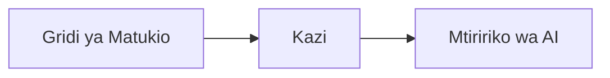

# Sura 8: Mifumo ya Uzalishaji & Shirika

**📚 Kozi**: [AZD For Beginners](../../README.md) | **⏱️ Muda**: 2-3 saa | **⭐ Ugumu**: Ya Juu

---

## Muhtasari

Sura hii inashughulikia mifumo ya uwekaji tayari kwa shirika, kuimarisha usalama, ufuatiliaji, na uboreshaji wa gharama kwa kazi za AI za uzalishaji.

## Malengo ya Kujifunza

Kwa kumaliza sura hii, utakufaulu:
- Kuweka matumizi yenye ustahimilivu katika mikoa mingi
- Kutekeleza mifumo ya usalama ya shirika
- Kusanidi ufuatiliaji kamili
- Kuboresha gharama kwa kiwango kikubwa
- Kusanidi mitiririko ya CI/CD na AZD

---

## 📚 Masomo

| # | Somo | Maelezo | Muda |
|---|--------|-------------|------|
| 1 | [Mazoea ya AI ya Uzalishaji](production-ai-practices.md) | Mifumo ya usambazaji ya shirika | 90 dakika |

---

## 🚀 Orodha ya Uzalishaji

- [ ] Usambazaji wa mikoa mingi kwa ustahimilivu
- [ ] Utambulisho uliosimamiwa kwa uthibitisho (bila funguo)
- [ ] Application Insights kwa ufuatiliaji
- [ ] Bajeti za gharama na arifu zimesanidiwa
- [ ] Kuchunguza usalama kumewezeshwa
- [ ] Uunganishaji wa mitiririko ya CI/CD
- [ ] Mpango wa urejeshaji wa maafa

---

## 🏗️ Mifumo ya Usanifu

### Mfano 1: Microservices AI


### Mfano 2: AI Inayotegemea Matukio


---

## 🔐 Mbinu Bora za Usalama

```bicep
// Use managed identity
identity: {
  type: 'SystemAssigned'
}

// Private endpoints for AI services
properties: {
  publicNetworkAccess: 'Disabled'
  networkAcls: {
    defaultAction: 'Deny'
  }
}
```

---

## 💰 Uboreshaji wa Gharama

| Mikakati | Akiba |
|----------|---------|
| Punguza hadi sifuri (Container Apps) | 60-80% |
| Tumia ngazi za matumizi kwa maendeleo | 50-70% |
| Kupanua kwa ratiba | 30-50% |
| Uwezo uliotengwa | 20-40% |

```bash
# Weka arifu za bajeti
az consumption budget create \
  --budget-name "AI-Budget" \
  --amount 500 \
  --category Cost \
  --time-grain Monthly
```

---

## 📊 Usanidi wa Ufuatiliaji

```bash
# Tiririsha kumbukumbu
azd monitor --logs

# Kagua Application Insights
azd monitor

# Tazama vipimo
az monitor metrics list --resource <resource-id>
```

---

## 🔗 Uvinjari

| Mwelekeo | Sura |
|-----------|---------|
| **Iliyopita** | [Sura 7: Utatuzi wa Matatizo](../chapter-07-troubleshooting/README.md) |
| **Kozi Imekamilika** | [Nyumbani kwa Kozi](../../README.md) |

---

## 📖 Rasilimali Zinazohusiana

- [Mwongozo wa Mawakala wa AI](../chapter-02-ai-development/agents.md)
- [Application Insights](../chapter-06-pre-deployment/application-insights.md)
- [Suluhisho za Mawakala Wengi](../chapter-05-multi-agent/README.md)
- [Mfano wa Microservices](../../examples/microservices/README.md)

---

<!-- CO-OP TRANSLATOR DISCLAIMER START -->
**Taarifa ya kutokuwajibika**:
Nyaraka hii imetafsiriwa kwa kutumia huduma ya tafsiri ya AI [Co-op Translator](https://github.com/Azure/co-op-translator). Ingawa tunajitahidi kuwa sahihi, tafadhali fahamu kwamba tafsiri za kiotomatiki zinaweza kuwa na makosa au kutokukamilika. Nyaraka ya awali katika lugha yake ya asili inapaswa kuchukuliwa kama chanzo chenye mamlaka. Kwa taarifa muhimu, tafsiri ya kitaalamu ya binadamu inashauriwa. Hatuwajibiki kwa kutoelewana au tafsiri potofu zinazotokana na matumizi ya tafsiri hii.
<!-- CO-OP TRANSLATOR DISCLAIMER END -->