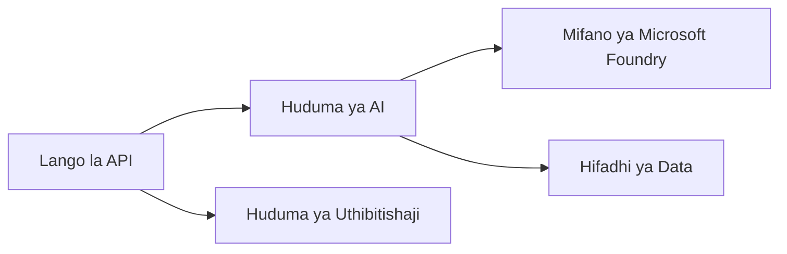
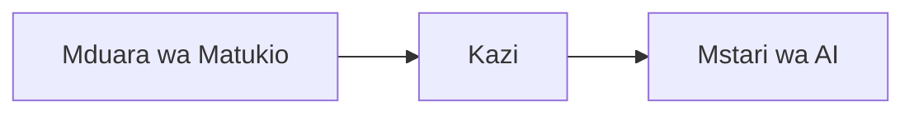

# Sura ya 8: Mifumo ya Uzalishaji & Biashara

**📚 Kozi**: [AZD Kwa Waanzilishi](../../README.md) | **⏱️ Muda**: Saa 2-3 | **⭐ Ugumu**: Mtaalamu

---

## Muhtasari

Sura hii inashughulikia mifumo ya uwekaji tayari kwa biashara, ugumu wa usalama, ufuatiliaji, na uboreshaji wa gharama kwa mizigo ya kazi ya AI ya uzalishaji.

> Imethibitishwa dhidi ya `azd 1.27.1` Julai 2026.

## Malengo ya Kujifunza

Kwa kumaliza sura hii, utakuwa:
- Kuanzisha programu zinazostahimili katika maeneo mengi
- Kutekeleza mifumo ya usalama wa biashara
- Kusanidi ufuatiliaji kamili
- Kuboresha gharama kwa kiwango kikubwa
- Kuanzisha mabomba ya CI/CD kwa kutumia AZD

---

## 📚 Masomo

| # | Somo | Maelezo | Muda |
|---|--------|-------------|------|
| 1 | [Mifano ya AI ya Uzalishaji](production-ai-practices.md) | Mifumo ya uwekaji wa biashara | Dakika 90 |

---

## 🚀 Orodha ya Ukaguzi wa Uzalishaji

- [ ] Uwekaji wa maeneo mengi kwa ustahimilivu
- [ ] Utambulisho ulioendeshwa kwa usalama (bila funguo)
- [ ] Application Insights kwa ufuatiliaji
- [ ] Bajeti za gharama na arifa zimewekwa
- [ ] Kuvinjari usalama kumewezeshwa
- [ ] Muungano wa mabomba ya CI/CD
- [ ] Mpango wa urejeshaji wa maafa

---

## 🏗️ Mifumo ya Usanifu

### Mfano 1: AI ya Microservices



### Mfano 2: AI Inayoendeshwa na Matukio



---

## 🔐 Misingi Bora ya Usalama

```bicep
// Use managed identity
identity: {
  type: 'SystemAssigned'
}

// Private endpoints for AI services
properties: {
  publicNetworkAccess: 'Disabled'
  networkAcls: {
    defaultAction: 'Deny'
  }
}
```

---

## 💰 Uboreshaji wa Gharama

| Mkakati | Akiba |
|----------|---------|
| Kupunguza hadi sifuri (Programu za Kontena) | 60-80% |
| Kutumia viwango vya matumizi kwa maendeleo | 50-70% |
| Kupunguza kwa ratiba | 30-50% |
| Ugavi uliothibitishwa | 20-40% |

```bash
# Weka arifa za bajeti
az consumption budget create \
  --budget-name "AI-Budget" \
  --amount 500 \
  --category Cost \
  --time-grain Monthly
```

---

## 📊 Usanidi wa Ufuatiliaji

```bash
# Mtiririko wa kumbukumbu
azd monitor --logs

# Angalia Maelezo ya Maombi
azd monitor --overview

# Tazama vipimo
az monitor metrics list --resource <resource-id>
```

---

## 🔗 Urambazaji

| Mwelekeo | Sura |
|-----------|---------|
| **Iliyotangulia** | [Sura ya 7: Utatuzi wa Matatizo](../chapter-07-troubleshooting/README.md) |
| **Kozi Imekamilika** | [Nyumbani Kozi](../../README.md) |

---

## 📖 Rasilimali Zinazohusiana

- [Mwongozo wa Wakaazi wa AI](../chapter-02-ai-development/agents.md)
- [Application Insights](../chapter-06-pre-deployment/application-insights.md)
- [Suluhisho za Wakaazi Wengi](../chapter-05-multi-agent/README.md)
- [Mfano wa Microservices](../../examples/microservices/README.md)

---

<!-- CO-OP TRANSLATOR DISCLAIMER START -->
**Kionyozo**:
Hati hii imetafsiriwa kwa kutumia huduma ya tafsiri ya AI [Co-op Translator](https://github.com/Azure/co-op-translator). Ingawa tunajitahidi kupata usahihi, tafadhali fahamu kwamba tafsiri za kiotomatiki zinaweza kuwa na makosa au upungufu wa usahihi. Hati ya asili katika lugha yake halisi inapaswa kuchukuliwa kama chanzo cha mamlaka. Kwa taarifa muhimu, tafsiri ya kitaalamu inayofanywa na binadamu inapendekezwa. Hatutojibu kwa kuelewa vibaya au tafsiri potofu zinazotokea kutokana na matumizi ya tafsiri hii.
<!-- CO-OP TRANSLATOR DISCLAIMER END -->