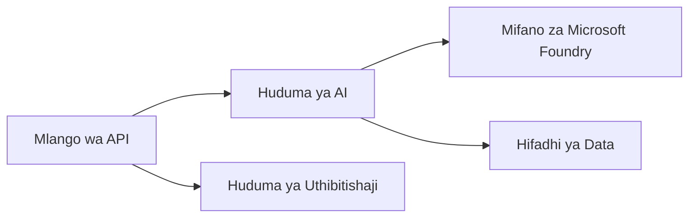
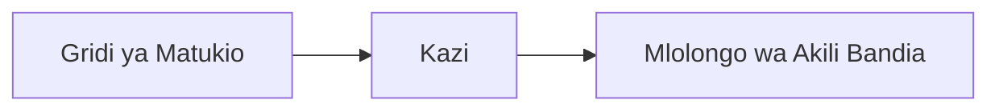

# Sura 8: Mifumo ya Uzalishaji na Biashara

**📚 Kozi**: [AZD Kwa Waanzilishi](../../README.md) | **⏱️ Muda**: 2-3 masaa | **⭐ Ugumu**: Ngumu

---

## Muhtasari

Sura hii inashughulikia mifumo ya kueneza huduma inayokidhi mahitaji ya biashara, kuimarisha usalama, ufuatiliaji, na uboreshaji wa gharama kwa mzigo wa kazi wa AI katika uzalishaji.

> Imethibitishwa dhidi ya `azd 1.23.12` mwezi Machi 2026.

## Malengo ya Kujifunza

Kwa kumaliza sura hii, utakuwa umeweza:
- Sambaza programu zenye ustahimilivu katika mikoa mbalimbali
- Tekeleza miundo ya usalama ya biashara
- Sanidi ufuatiliaji wa kina
- Boresha gharama kwa wigo mkubwa
- Sanidi mifereji ya CI/CD kwa AZD

---

## 📚 Mafunzo

| # | Somo | Maelezo | Muda |
|---|--------|-------------|------|
| 1 | [Mila za AI za Uzalishaji](production-ai-practices.md) | Mifumo ya usambazaji ya biashara | 90 dakika |

---

## 🚀 Orodha ya Ukaguzi ya Uzalishaji

- [ ] Uwekaji katika mikoa mingi kwa ustahimilivu
- [ ] Utambulisho uliodhibitiwa kwa uthibitisho (bila funguo)
- [ ] Application Insights kwa ufuatiliaji
- [ ] Bajeti za gharama na arifu zimewekwa
- [ ] Uchunguzi wa usalama umewezeshwa
- [ ] Uunganishaji wa mifereji ya CI/CD
- [ ] Mpango wa urejeshaji baada ya maafa

---

## 🏗️ Mifano ya Usanifu

### Mfano 1: Microservices za AI


### Mfano 2: AI Inayotegemea Matukio


---

## 🔐 Mbinu Bora za Usalama

```bicep
// Use managed identity
identity: {
  type: 'SystemAssigned'
}

// Private endpoints for AI services
properties: {
  publicNetworkAccess: 'Disabled'
  networkAcls: {
    defaultAction: 'Deny'
  }
}
```

---

## 💰 Uboreshaji wa Gharama

| Mikakati | Akiba |
|----------|---------|
| Kupunguza hadi sifuri (Container Apps) | 60-80% |
| Tumia ngazi za matumizi kwa maendeleo | 50-70% |
| Kupandisha/kupunguza kwa ratiba | 30-50% |
| Uwezo uliotengwa | 20-40% |

```bash
# Weka arifu za bajeti
az consumption budget create \
  --budget-name "AI-Budget" \
  --amount 500 \
  --category Cost \
  --time-grain Monthly
```

---

## 📊 Usanidi wa Ufuatiliaji

```bash
# Tiririsha logi
azd monitor --logs

# Angalia Application Insights
azd monitor --overview

# Tazama vipimo
az monitor metrics list --resource <resource-id>
```

---

## 🔗 Uvinjari

| Direction | Chapter |
|-----------|---------|
| **Iliyopita** | [Chapter 7: Troubleshooting](../chapter-07-troubleshooting/README.md) |
| **Kozi Imekamilika** | [Course Home](../../README.md) |

---

## 📖 Rasilimali Zinazohusiana

- [Mwongozo wa Maajenti wa AI](../chapter-02-ai-development/agents.md)
- [Application Insights](../chapter-06-pre-deployment/application-insights.md)
- [Suluhisho za Maajenti Wengi](../chapter-05-multi-agent/README.md)
- [Mfano wa Microservices](../../examples/microservices/README.md)

---

<!-- CO-OP TRANSLATOR DISCLAIMER START -->
**Angalizo**:
Nyaraka hii imetafsiriwa kwa kutumia huduma ya tafsiri ya AI [Co-op Translator](https://github.com/Azure/co-op-translator). Ingawa tunajitahidi kuwa sahihi, tafadhali fahamu kwamba tafsiri za kiotomatiki zinaweza kuwa na makosa au ukosefu wa usahihi. Nyaraka ya asili katika lugha yake ya asili inapaswa kuzingatiwa kama chanzo chenye mamlaka. Kwa taarifa muhimu, inapendekezwa kutumia tafsiri ya kitaalamu iliyofanywa na mtafsiri wa binadamu. Hatuwajibiki kwa kutokuelewana au tafsiri potofu zinazotokana na matumizi ya tafsiri hii.
<!-- CO-OP TRANSLATOR DISCLAIMER END -->