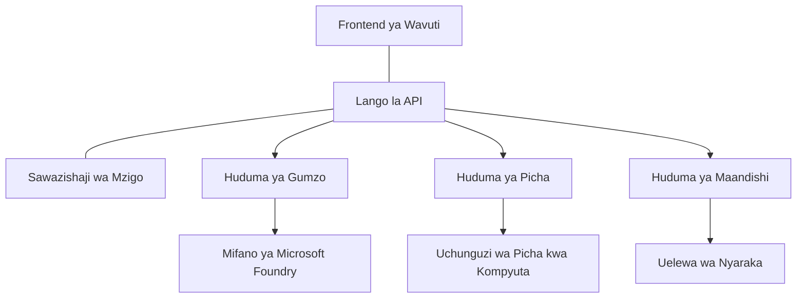

# Mazoea Bora ya Mizigo ya AI kwa Uzalishaji na AZD

**Utangulizi wa Sura:**
- **📚 Nyumbani kwa Kozi**: [AZD For Beginners](../../README.md)
- **📖 Sura ya Sasa**: Sura 8 - Mifumo ya Uzalishaji & Kampuni
- **⬅️ Sura Iliyopita**: [Sura 7: Utatuzi wa Tatizo](../chapter-07-troubleshooting/debugging.md)
- **⬅️ Pia Inahusiana**: [AI Workshop Lab](ai-workshop-lab.md)
- **🎯 Kozi Imekamilika**: [AZD For Beginners](../../README.md)

## Muhtasari

Mwongozo huu unaweza mazoea bora kwa kusambaza mizigo ya AI tayari kwa uzalishaji kwa kutumia Azure Developer CLI (AZD). Kulingana na maoni kutoka kwa jamii ya Microsoft Foundry Discord na utekelezaji wa wateja halisi, mazoea haya yanashughulikia changamoto kuu zinazojitokeza katika mifumo ya AI ya uzalishaji.

## Changamoto Kuu Zinazoshughulikiwa

Kulingana na matokeo ya kura za jamii yetu, hizi ndizo changamoto kuu ambazo watengenezaji wanakutana nazo:

- **45%** wanapata shida na usambazaji wa AI wenye huduma nyingi
- **38%** wana matatizo na usimamizi wa nywila na siri  
- **35%** wanapata ugumu kwa kuwa tayari kwa uzalishaji na kupanua
- **32%** wanahitaji mikakati bora ya uboreshaji wa gharama
- **29%** wanahitaji ufuatiliaji na utatuzi wa shida ulioimarishwa

## Mifumo ya Usanifu kwa AI ya Uzalishaji

### Mfumo 1: Usanifu wa AI wa Microservices

**Wakati wa kutumia**: Programu ngumu za AI zenye uwezo mwingi



**Utekelezaji wa AZD**:

```yaml
# azure.yaml
name: enterprise-ai-platform
services:
  web:
    project: ./web
    host: staticwebapp
  api-gateway:
    project: ./api-gateway
    host: containerapp
  chat-service:
    project: ./services/chat
    host: containerapp
  vision-service:
    project: ./services/vision
    host: containerapp
  text-service:
    project: ./services/text
    host: containerapp
```

### Mfumo 2: Uendeshaji wa AI kwa Tukio

**Wakati wa kutumia**: Usindikaji wa batch, uchambuzi wa hati, mchakato wa asili wa async

```bicep
// Event Hub for AI processing pipeline
resource eventHub 'Microsoft.EventHub/namespaces@2023-01-01-preview' = {
  name: eventHubNamespaceName
  location: location
  sku: {
    name: 'Standard'
    tier: 'Standard'
    capacity: 1
  }
}

// Service Bus for reliable message processing
resource serviceBus 'Microsoft.ServiceBus/namespaces@2022-10-01-preview' = {
  name: serviceBusNamespaceName
  location: location
  sku: {
    name: 'Premium'
    tier: 'Premium'
    capacity: 1
  }
}

// Function App for processing
resource functionApp 'Microsoft.Web/sites@2023-01-01' = {
  name: functionAppName
  location: location
  kind: 'functionapp,linux'
  properties: {
    siteConfig: {
      appSettings: [
        {
          name: 'FUNCTIONS_EXTENSION_VERSION'
          value: '~4'
        }
        {
          name: 'AZURE_OPENAI_ENDPOINT'
          value: '@Microsoft.KeyVault(VaultName=${keyVault.name};SecretName=openai-endpoint)'
        }
      ]
    }
  }
}
```

## Kufikiria Kuhusu Afya ya Wakala wa AI

When a traditional web app breaks, the symptoms are familiar: a page doesn't load, an API returns an error, or a deployment fails. AI-powered applications can break in all those same ways—but they can also misbehave in subtler ways that don't produce obvious error messages.

This section helps you build a mental model for monitoring AI workloads so you know where to look when things don't seem right.

### Jinsi Afya ya Wakala Inavyotofautiana na Afya ya Programu ya Kawaida

Programu ya jadi inafanya kazi au haitumii. Wakala wa AI anaweza kuonekana kufanya kazi lakini kutoa matokeo mabaya. Fikiria afya ya wakala kwa tabaka mbili:

| Tabaka | Kitu cha Kuangalia | Mahali pa Kuangalia |
|-------|--------------|---------------|
| **Afya ya miundombinu** | Je, huduma inaendelea kuendesha? Je, rasilimali zimepangwa? Je, vijumuishi vinaweza kufikiwa? | `azd monitor`, Azure Portal resource health, container/app logs |
| **Afya ya tabia** | Je, wakala anajibu kwa usahihi? Je, majibu ni ya wakati? Je, modeli inaitwa kwa usahihi? | Application Insights traces, model call latency metrics, response quality logs |

Afya ya miundombinu ni ya kawaida—ni sawa kwa programu yoyote ya azd. Afya ya tabia ni tabaka jipya linaloletwa na mizigo ya AI.

### Mahali pa Kuangalia Unapokuwa Programu za AI Hazifanyi Kazi Kama Inavyotarajiwa

Ikiwa programu yako ya AI haisemi matokeo unayotegemea, hapa kuna orodha ya kimsingi ya kukagua:

1. **Anza na mambo ya msingi.** Je, programu inaendelea kuendesha? Je, inaweza kufikia utegemezi wake? Angalia `azd monitor` na afya ya rasilimali kama ungevyo kwa programu yoyote.
2. **Kagua muunganisho wa modeli.** Je, programu yako inaita modeli ya AI kwa mafanikio? Miito ya modeli iliyoshindikana au iliyochukua muda mrefu ndiyo sababu inayojirudia ya matatizo ya programu za AI na itaonekana kwenye logi za programu yako.
3. **Tazama kile modeli ilichopokea.** Majibu ya AI yanategemea pembejeo (prompt na muktadha wowote uliopatikana). Ikiwa matokeo ni makosa, pembejeo kwa kawaida ni makosa. Angalia ikiwa programu yako inatumia data sahihi kwa modeli.
4. **Kagua ucheleweshaji wa majibu.** Miito ya modeli za AI ni polepole kuliko miito ya API za kawaida. Ikiwa programu yako inahisi polepole, angalia kama nyakati za majibu ya modeli zimeongezeka—hii inaweza kuashiria throttling, vikwazo vya uwezo, au msongamano katika eneo.
5. **Angalia ishara za gharama.** Mlipuko usiotarajiwa wa matumizi ya tokeni au miito ya API unaweza kuashiria mzunguko, prompt iliyopangwa vibaya, au jaribio za upitishaji nyingi.

Hauhitaji kumimina ujuzi wa zana za ufuatiliaji mara moja. Jambo kuu ni kwamba programu za AI zina tabaka za ziada za tabia za kufuatilia, na ufuatiliaji uliojengwa wa azd (`azd monitor`) unakupa msingi wa kuchunguza tabaka zote mbili.

---

## Mazoea Bora ya Usalama

### 1. Mfumo wa Usalama wa Zero-Trust

**Mkakati wa Utekelezaji**:
- Hakuna mawasiliano huduma-kwa-huduma bila uthibitisho
- Miito yote ya API itumie identities zilizosimamiwa
- Kutengwa kwa mtandao kwa endpoints za kibinafsi
- Udhibiti wa upatikanaji kwa kanuni ya haki ndogo

```bicep
// Managed Identity for each service
resource chatServiceIdentity 'Microsoft.ManagedIdentity/userAssignedIdentities@2023-01-31' = {
  name: 'chat-service-identity'
  location: location
}

// Role assignments with minimal permissions
resource openAIUserRole 'Microsoft.Authorization/roleAssignments@2022-04-01' = {
  scope: openAIAccount
  name: guid(openAIAccount.id, chatServiceIdentity.id, openAIUserRoleDefinitionId)
  properties: {
    roleDefinitionId: subscriptionResourceId('Microsoft.Authorization/roleDefinitions', '5e0bd9bd-7b93-4f28-af87-19fc36ad61bd')
    principalId: chatServiceIdentity.properties.principalId
    principalType: 'ServicePrincipal'
  }
}
```

### 2. Usimamizi Salama wa Siri

**Mfumo wa Uingiliano wa Key Vault**:

```bicep
// Key Vault with proper access policies
resource keyVault 'Microsoft.KeyVault/vaults@2023-02-01' = {
  name: keyVaultName
  location: location
  properties: {
    tenantId: tenant().tenantId
    sku: {
      family: 'A'
      name: 'premium'  // Use premium for production
    }
    enableRbacAuthorization: true  // Use RBAC instead of access policies
    enablePurgeProtection: true    // Prevent accidental deletion
    enableSoftDelete: true
    softDeleteRetentionInDays: 90
  }
}

// Store all AI service credentials
resource openAIKeySecret 'Microsoft.KeyVault/vaults/secrets@2023-02-01' = {
  parent: keyVault
  name: 'openai-api-key'
  properties: {
    value: openAIAccount.listKeys().key1
    attributes: {
      enabled: true
    }
  }
}
```

### 3. Usalama wa Mtandao

**Usanidi wa Private Endpoint**:

```bicep
// Virtual Network for AI services
resource virtualNetwork 'Microsoft.Network/virtualNetworks@2023-04-01' = {
  name: vnetName
  location: location
  properties: {
    addressSpace: {
      addressPrefixes: ['10.0.0.0/16']
    }
    subnets: [
      {
        name: 'ai-services-subnet'
        properties: {
          addressPrefix: '10.0.1.0/24'
          privateEndpointNetworkPolicies: 'Disabled'
        }
      }
      {
        name: 'app-services-subnet'
        properties: {
          addressPrefix: '10.0.2.0/24'
          delegations: [
            {
              name: 'Microsoft.Web/serverFarms'
              properties: {
                serviceName: 'Microsoft.Web/serverFarms'
              }
            }
          ]
        }
      }
    ]
  }
}

// Private endpoints for all AI services
resource openAIPrivateEndpoint 'Microsoft.Network/privateEndpoints@2023-04-01' = {
  name: '${openAIAccountName}-pe'
  location: location
  properties: {
    subnet: {
      id: virtualNetwork.properties.subnets[0].id
    }
    privateLinkServiceConnections: [
      {
        name: 'openai-connection'
        properties: {
          privateLinkServiceId: openAIAccount.id
          groupIds: ['account']
        }
      }
    ]
  }
}
```

## Utendakazi na Kupanua

### 1. Mikakati ya Kujiendesha kwa Mwepesi (Auto-Scaling)

**Kujiendesha kwa Container Apps**:

```bicep
resource containerApp 'Microsoft.App/containerApps@2023-05-01' = {
  name: containerAppName
  location: location
  properties: {
    configuration: {
      ingress: {
        external: true
        targetPort: 8000
        transport: 'http'
      }
    }
    template: {
      scale: {
        minReplicas: 2  // Always have 2 instances minimum
        maxReplicas: 50 // Scale up to 50 for high load
        rules: [
          {
            name: 'http-scaling'
            http: {
              metadata: {
                concurrentRequests: '20'  // Scale when >20 concurrent requests
              }
            }
          }
          {
            name: 'cpu-scaling'
            custom: {
              type: 'cpu'
              metadata: {
                type: 'Utilization'
                value: '70'  // Scale when CPU >70%
              }
            }
          }
        ]
      }
    }
  }
}
```

### 2. Mikakati ya Caching

**Redis Cache kwa Majibu ya AI**:

```bicep
// Redis Premium for production workloads
resource redisCache 'Microsoft.Cache/redis@2023-04-01' = {
  name: redisCacheName
  location: location
  properties: {
    sku: {
      name: 'Premium'
      family: 'P'
      capacity: 1
    }
    enableNonSslPort: false
    minimumTlsVersion: '1.2'
    redisConfiguration: {
      'maxmemory-policy': 'allkeys-lru'
    }
    // Enable clustering for high availability
    redisVersion: '6.0'
    shardCount: 2
  }
}

// Cache configuration in application
var cacheConnectionString = '${redisCache.properties.hostName}:6380,password=${redisCache.listKeys().primaryKey},ssl=True,abortConnect=False'
```

### 3. Usawazishaji wa Mzigo na Usimamizi wa Trafiki

**Application Gateway na WAF**:

```bicep
// Application Gateway with Web Application Firewall
resource applicationGateway 'Microsoft.Network/applicationGateways@2023-04-01' = {
  name: appGatewayName
  location: location
  properties: {
    sku: {
      name: 'WAF_v2'
      tier: 'WAF_v2'
      capacity: 2
    }
    webApplicationFirewallConfiguration: {
      enabled: true
      firewallMode: 'Prevention'
      ruleSetType: 'OWASP'
      ruleSetVersion: '3.2'
    }
    // Backend pools for AI services
    backendAddressPools: [
      {
        name: 'ai-services-pool'
        properties: {
          backendAddresses: [
            {
              fqdn: '${containerApp.properties.configuration.ingress.fqdn}'
            }
          ]
        }
      }
    ]
  }
}
```

## 💰 Uboreshaji wa Gharama

### 1. Kukodisha Rasilimali Kwa Haki

**Usanidi Maalum kwa Mazingira**:

```bash
# Mazingira ya maendeleo
azd env new development
azd env set AZURE_OPENAI_SKU "S0"
azd env set AZURE_OPENAI_CAPACITY 10
azd env set AZURE_SEARCH_SKU "basic"
azd env set CONTAINER_CPU 0.5
azd env set CONTAINER_MEMORY 1.0

# Mazingira ya uzalishaji
azd env new production
azd env set AZURE_OPENAI_SKU "S0"
azd env set AZURE_OPENAI_CAPACITY 100
azd env set AZURE_SEARCH_SKU "standard"
azd env set CONTAINER_CPU 2.0
azd env set CONTAINER_MEMORY 4.0
```

### 2. Ufuatiliaji wa Gharama na Bajeti

```bicep
// Cost management and budgets
resource budget 'Microsoft.Consumption/budgets@2023-05-01' = {
  name: 'ai-workload-budget'
  properties: {
    timePeriod: {
      startDate: '2024-01-01'
      endDate: '2024-12-31'
    }
    timeGrain: 'Monthly'
    amount: 2000  // $2000 monthly budget
    category: 'Cost'
    notifications: {
      warning: {
        enabled: true
        operator: 'GreaterThan'
        threshold: 80
        contactEmails: [
          'finance@company.com'
          'engineering@company.com'
        ]
        contactRoles: [
          'Owner'
          'Contributor'
        ]
      }
      critical: {
        enabled: true
        operator: 'GreaterThan'
        threshold: 95
        contactEmails: [
          'cto@company.com'
        ]
      }
    }
  }
}
```

### 3. Uboreshaji wa Matumizi ya Tokeni

**Usimamizi wa Gharama za OpenAI**:

```typescript
// Uboreshaji wa tokeni kwenye ngazi ya programu
class TokenOptimizer {
  private readonly maxTokens = 4000;
  private readonly reserveTokens = 500;
  
  optimizePrompt(userInput: string, context: string): string {
    const availableTokens = this.maxTokens - this.reserveTokens;
    const estimatedTokens = this.estimateTokens(userInput + context);
    
    if (estimatedTokens > availableTokens) {
      // Fupisha muktadha, si ingizo la mtumiaji
      context = this.truncateContext(context, availableTokens - this.estimateTokens(userInput));
    }
    
    return `${context}\n\nUser: ${userInput}`;
  }
  
  private estimateTokens(text: string): number {
    // Makadirio ya karibu: 1 tokeni ≈ herufi 4
    return Math.ceil(text.length / 4);
  }
}
```

## Ufuatiliaji na Uonekano

### 1. Application Insights Kamili

```bicep
// Application Insights with advanced features
resource applicationInsights 'Microsoft.Insights/components@2020-02-02' = {
  name: applicationInsightsName
  location: location
  kind: 'web'
  properties: {
    Application_Type: 'web'
    WorkspaceResourceId: logAnalyticsWorkspace.id
    SamplingPercentage: 100  // Full sampling for AI apps
    DisableIpMasking: false  // Enable for security
  }
}

// Custom metrics for AI operations
resource aiMetricAlerts 'Microsoft.Insights/metricAlerts@2018-03-01' = {
  name: 'ai-high-error-rate'
  location: 'global'
  properties: {
    description: 'Alert when AI service error rate is high'
    severity: 2
    enabled: true
    scopes: [
      applicationInsights.id
    ]
    evaluationFrequency: 'PT1M'
    windowSize: 'PT5M'
    criteria: {
      'odata.type': 'Microsoft.Azure.Monitor.SingleResourceMultipleMetricCriteria'
      allOf: [
        {
          name: 'high-error-rate'
          metricName: 'requests/failed'
          operator: 'GreaterThan'
          threshold: 10
          timeAggregation: 'Count'
        }
      ]
    }
  }
}
```

### 2. Ufuatiliaji Maalum kwa AI

**Dashibodi za Kawaida kwa Metriki za AI**:

```json
// Dashboard configuration for AI workloads
{
  "dashboard": {
    "name": "AI Application Monitoring",
    "tiles": [
      {
        "name": "OpenAI Request Volume",
        "query": "requests | where name contains 'openai' | summarize count() by bin(timestamp, 5m)"
      },
      {
        "name": "AI Response Latency",
        "query": "requests | where name contains 'openai' | summarize avg(duration) by bin(timestamp, 5m)"
      },
      {
        "name": "Token Usage",
        "query": "customMetrics | where name == 'openai_tokens_used' | summarize sum(value) by bin(timestamp, 1h)"
      },
      {
        "name": "Cost per Hour",
        "query": "customMetrics | where name == 'openai_cost' | summarize sum(value) by bin(timestamp, 1h)"
      }
    ]
  }
}
```

### 3. Ukaguzi wa Afya na Ufuatiliaji wa Uptime

```bicep
// Application Insights availability tests
resource availabilityTest 'Microsoft.Insights/webtests@2022-06-15' = {
  name: 'ai-app-availability-test'
  location: location
  tags: {
    'hidden-link:${applicationInsights.id}': 'Resource'
  }
  properties: {
    SyntheticMonitorId: 'ai-app-availability-test'
    Name: 'AI Application Availability Test'
    Description: 'Tests AI application endpoints'
    Enabled: true
    Frequency: 300  // 5 minutes
    Timeout: 120    // 2 minutes
    Kind: 'ping'
    Locations: [
      {
        Id: 'us-east-2-azr'
      }
      {
        Id: 'us-west-2-azr'
      }
    ]
    Configuration: {
      WebTest: '''
        <WebTest Name="AI Health Check" 
                 Id="8d2de8d2-a2b0-4c2e-9a0d-8f9c9a0b8c8d" 
                 Enabled="True" 
                 CssProjectStructure="" 
                 CssIteration="" 
                 Timeout="120" 
                 WorkItemIds="" 
                 xmlns="http://microsoft.com/schemas/VisualStudio/TeamTest/2010" 
                 Description="" 
                 CredentialUserName="" 
                 CredentialPassword="" 
                 PreAuthenticate="True" 
                 Proxy="default" 
                 StopOnError="False" 
                 RecordedResultFile="" 
                 ResultsLocale="">
          <Items>
            <Request Method="GET" 
                     Guid="a5f10126-e4cd-570d-961c-cea43999a200" 
                     Version="1.1" 
                     Url="${webApp.properties.defaultHostName}/health" 
                     ThinkTime="0" 
                     Timeout="120" 
                     ParseDependentRequests="True" 
                     FollowRedirects="True" 
                     RecordResult="True" 
                     Cache="False" 
                     ResponseTimeGoal="0" 
                     Encoding="utf-8" 
                     ExpectedHttpStatusCode="200" 
                     ExpectedResponseUrl="" 
                     ReportingName="" 
                     IgnoreHttpStatusCode="False" />
          </Items>
        </WebTest>
      '''
    }
  }
}
```

## Uokoaji wa Majanga na Upatikanaji wa Juu

### 1. Usambazaji kwa Mikoa Mingi

```yaml
# azure.yaml - Multi-region configuration
name: ai-app-multiregion
services:
  api-primary:
    project: ./api
    host: containerapp
    env:
      - AZURE_REGION=eastus
  api-secondary:
    project: ./api
    host: containerapp
    env:
      - AZURE_REGION=westus2
```

```bicep
// Traffic Manager for global load balancing
resource trafficManager 'Microsoft.Network/trafficManagerProfiles@2022-04-01' = {
  name: trafficManagerProfileName
  location: 'global'
  properties: {
    profileStatus: 'Enabled'
    trafficRoutingMethod: 'Priority'
    dnsConfig: {
      relativeName: trafficManagerProfileName
      ttl: 30
    }
    monitorConfig: {
      protocol: 'HTTPS'
      port: 443
      path: '/health'
      intervalInSeconds: 30
      toleratedNumberOfFailures: 3
      timeoutInSeconds: 10
    }
    endpoints: [
      {
        name: 'primary-endpoint'
        type: 'Microsoft.Network/trafficManagerProfiles/azureEndpoints'
        properties: {
          targetResourceId: primaryAppService.id
          endpointStatus: 'Enabled'
          priority: 1
        }
      }
      {
        name: 'secondary-endpoint'
        type: 'Microsoft.Network/trafficManagerProfiles/azureEndpoints'
        properties: {
          targetResourceId: secondaryAppService.id
          endpointStatus: 'Enabled'
          priority: 2
        }
      }
    ]
  }
}
```

### 2. Nakala za Data na Urejeshaji

```bicep
// Backup configuration for critical data
resource backupVault 'Microsoft.DataProtection/backupVaults@2023-05-01' = {
  name: backupVaultName
  location: location
  identity: {
    type: 'SystemAssigned'
  }
  properties: {
    storageSettings: [
      {
        datastoreType: 'VaultStore'
        type: 'LocallyRedundant'
      }
    ]
  }
}

// Backup policy for AI models and data
resource backupPolicy 'Microsoft.DataProtection/backupVaults/backupPolicies@2023-05-01' = {
  parent: backupVault
  name: 'ai-data-backup-policy'
  properties: {
    policyRules: [
      {
        backupParameters: {
          backupType: 'Full'
          objectType: 'AzureBackupParams'
        }
        trigger: {
          schedule: {
            repeatingTimeIntervals: [
              'R/2024-01-01T02:00:00+00:00/P1D'  // Daily at 2 AM
            ]
          }
          objectType: 'ScheduleBasedTriggerContext'
        }
        dataStore: {
          datastoreType: 'VaultStore'
          objectType: 'DataStoreInfoBase'
        }
        name: 'BackupDaily'
        objectType: 'AzureBackupRule'
      }
    ]
  }
}
```

## DevOps na Uingiliano wa CI/CD

### 1. Mfinyazo wa GitHub Actions

```yaml
# .github/workflows/deploy-ai-app.yml
name: Deploy AI Application

on:
  push:
    branches: [main]
  pull_request:
    branches: [main]

jobs:
  test:
    runs-on: ubuntu-latest
    steps:
      - uses: actions/checkout@v4
      
      - name: Setup Python
        uses: actions/setup-python@v4
        with:
          python-version: '3.11'
          
      - name: Install dependencies
        run: |
          pip install -r requirements.txt
          pip install pytest
          
      - name: Run tests
        run: pytest tests/
        
      - name: AI Safety Tests
        run: |
          python scripts/test_ai_safety.py
          python scripts/validate_prompts.py

  deploy-staging:
    needs: test
    if: github.event_name == 'pull_request'
    runs-on: ubuntu-latest
    steps:
      - uses: actions/checkout@v4
      
      - name: Setup AZD
        uses: Azure/setup-azd@v2
        
      - name: Login to Azure
        uses: azure/login@v1
        with:
          creds: ${{ secrets.AZURE_CREDENTIALS }}
          
      - name: Deploy to Staging
        run: |
          azd env select staging
          azd deploy

  deploy-production:
    needs: test
    if: github.ref == 'refs/heads/main'
    runs-on: ubuntu-latest
    steps:
      - uses: actions/checkout@v4
      
      - name: Setup AZD
        uses: Azure/setup-azd@v2
        
      - name: Login to Azure
        uses: azure/login@v1
        with:
          creds: ${{ secrets.AZURE_CREDENTIALS }}
          
      - name: Deploy to Production
        run: |
          azd env select production
          azd deploy
          
      - name: Run Production Health Checks
        run: |
          python scripts/health_check.py --env production
```

### 2. Uthibitisho wa Miundombinu

```bash
# scripts/validate_infrastructure.sh
#!/bin/bash

echo "Validating AI infrastructure deployment..."

# Angalia kama huduma zote zinazohitajika zinafanya kazi
services=("openai" "search" "storage" "keyvault")
for service in "${services[@]}"; do
    echo "Checking $service..."
    if ! az resource list --resource-type "Microsoft.CognitiveServices/accounts" --query "[?contains(name, '$service')]" -o tsv; then
        echo "ERROR: $service not found"
        exit 1
    fi
done

# Thibitisha uanzishaji wa modeli za OpenAI
echo "Validating OpenAI model deployments..."
models=$(az cognitiveservices account deployment list --name $AZURE_OPENAI_NAME --resource-group $AZURE_RESOURCE_GROUP --query "[].name" -o tsv)
if [[ ! $models == *"gpt-4.1-mini"* ]]; then
  echo "ERROR: Required model gpt-4.1-mini not deployed"
    exit 1
fi

# Jaribu muunganisho wa huduma ya AI
echo "Testing AI service connectivity..."
python scripts/test_connectivity.py

echo "Infrastructure validation completed successfully!"
```

## Orodha ya Ukamilishaji kwa Uzalishaji

### Usalama ✅
- [ ] Huduma zote zinatumia managed identities
- [ ] Siri zimehifadhiwa kwenye Key Vault
- [ ] Private endpoints zimesanidiwa
- [ ] Makundi ya usalama wa mtandao yametekelezwa
- [ ] RBAC kwa haki ndogo
- [ ] WAF imewezeshwa kwenye endpoints za umma

### Utendakazi ✅
- [ ] Auto-scaling imesanidiwa
- [ ] Caching imetekelezwa
- [ ] Usawazishaji wa mzigo umesanidiwa
- [ ] CDN kwa yaliyomo ya static
- [ ] Pooling ya muunganisho wa database
- [ ] Uboreshaji wa matumizi ya tokeni

### Ufuatiliaji ✅
- [ ] Application Insights imesanidiwa
- [ ] Metriki maalum zimetengenezwa
- [ ] Kanuni za tahadhari zimesanidiwa
- [ ] Dashibodi imeundwa
- [ ] Ukaguzi wa afya umeanzishwa
- [ ] Sera za uhifadhi wa logi

### Uaminifu ✅
- [ ] Usambazaji wa mikoa mingi
- [ ] Mpango wa nakala na urejeshaji
- [ ] Vipunguzi vya mzunguko vimewekwa
- [ ] Sera za jaribio upya zimesanidiwa
- [ ] Upunguzaji wa kazi kwa heshima
- [ ] Endpoints za ukaguzi wa afya

### Usimamizi wa Gharama ✅
- [ ] Tahadhari za bajeti zimesanidiwa
- [ ] Kukokotoa rasilimali kwa haki
- [ ] Punguzo za dev/test zimetumika
- [ ] Mifumo iliyohifadhiwa imetinunuliwa
- [ ] Dashibodi ya ufuatiliaji wa gharama
- [ ] Mapitio ya gharama mara kwa mara

### Uzingatiaji ✅
- [ ] Mahitaji ya utaifa wa data yamekamilika
- [ ] Ufuatiliaji wa ukaguzi umewezeshwa
- [ ] Sera za uzingatiaji zimetumika
- [ ] Misingi ya usalama imetekelezwa
- [ ] Tathmini za usalama za kawaida
- [ ] Mpango wa majibu kwa dharura

## Vipimo vya Utendaji

### Metriki za Kawaida za Uzalishaji

| Metriki | Lengo | Ufuatiliaji |
|--------|--------|------------|
| **Muda wa Majibu** | < 2 seconds | Application Insights |
| **Upatikanaji** | 99.9% | Uptime monitoring |
| **Kiwango cha Makosa** | < 0.1% | Application logs |
| **Matumizi ya Tokeni** | < $500/month | Cost management |
| **Watumiaji Simultaneous** | 1000+ | Load testing |
| **Muda wa Urejeshaji** | < 1 hour | Disaster recovery tests |

### Upimaji wa Mzigo

```bash
# Skripti ya upimaji wa mzigo kwa programu za AI
python scripts/load_test.py \
  --endpoint https://your-ai-app.azurewebsites.net \
  --concurrent-users 100 \
  --duration 300 \
  --ramp-up 60
```

## 🤝 Mazoea Bora ya Jamii

Kulingana na maoni ya jamii ya Microsoft Foundry Discord:

### Mapendekezo Kuu Kutoka kwa Jamii:

1. **Anza Kidogo, Panuza Polepole**: Anza na SKUs za msingi na ongeza kulingana na matumizi halisi
2. **Fuatilia Kila Kitu**: Sanidi ufuatiliaji kamili tangu siku ya kwanza
3. **Toa Usalama kwa Uendeshaji**: Tumia miundombinu kama msimbo kwa usalama wa kudumu
4. **Jaribu Kwa Kina**: Jumuisha upimaji maalum wa AI katika pipeline yako
5. **Panga Gharama**: Fuatilia matumizi ya tokeni na weka tahadhari za bajeti mapema

### Makosa Yanayojirudia Kuepukwa:

- ❌ Kuweka ngumu API keys ndani ya msimbo
- ❌ Kutoanzisha ufuatiliaji mzuri
- ❌ Kupuuza uboreshaji wa gharama
- ❌ Kutokujaribu senario za kushindwa
- ❌ Kusambaza bila ukaguzi wa afya

## Amri za AZD AI CLI na Extensions

AZD inajumuisha seti inayoongezeka ya amri maalum za AI na extensions zinazorahisisha kazi za AI za uzalishaji. Zana hizi zinakomboa pengo kati ya maendeleo ya eneo na usambazaji wa uzalishaji kwa mizigo ya AI.

### Extensions za AZD kwa AI

AZD inatumia mfumo wa extension kuongeza uwezo maalum wa AI. Sakinisha na simamia extensions kwa:

```bash
# Orodhesha viendelezi vyote vinavyopatikana (ikiwa ni pamoja na AI)
azd extension list

# Kagua maelezo ya viendelezi vilivyowekwa
azd extension show azure.ai.agents

# Sakinisha kiendelezi cha mawakala wa Foundry
azd extension install azure.ai.agents

# Sakinisha kiendelezi cha urekebishaji wa kina
azd extension install azure.ai.finetune

# Sakinisha kiendelezi cha modeli zilizobinafsishwa
azd extension install azure.ai.models

# Boreshsha viendelezi vyote vilivyowekwa
azd extension upgrade --all
```

**Extensions za AI zinazopatikana:**

| Extension | Kusudi | Hali |
|-----------|---------|--------|
| `azure.ai.agents` | Foundry Agent Service management | Preview |
| `azure.ai.skills` | Reusable agent skills | Preview |
| `azure.ai.connections` | Foundry connections (data sources, tools) | Preview |
| `azure.ai.finetune` | Foundry model fine-tuning | Preview |
| `azure.ai.models` | Foundry custom models | Preview |
| `azure.coding-agent` | Coding agent configuration | Available |

> The `azure.ai.agents` extension evolves quickly. This course is validated against `0.1.40-preview`. Run `azd extension upgrade --all` to pick up the latest command set, and `azd extension show azure.ai.agents` to confirm your installed version.

**Je, ni extensions gani mpya za `skills` na `connections`?**

Two preview extensions appeared alongside the agent tooling and are worth understanding even as a beginner:

- **`azure.ai.skills`** — A **skill** is a reusable capability (a packaged tool or behavior) you can attach to one or more agents instead of re-implementing it each time. Think of it as a shared building block: define a "search the docs" or "look up an order" skill once, then reuse it across agents. This keeps multi-agent systems (Chapter 5) consistent and avoids copy-paste.
- **`azure.ai.connections`** — A **connection** is a managed link from your Foundry project to an external resource your agents need—a data source (like Azure AI Search), a tool endpoint, or another service. Connections centralize *where* and *how* agents access data, so credentials and endpoints live in one governed place rather than scattered through code.

You don't need these to deploy your first agents—stick with `azure.ai.agents` while learning. Reach for `skills` when you find yourself duplicating the same tool across agents, and `connections` when several agents share the same data source.

### Kuzindua Miradi ya Wakala kwa `azd ai agent init`

The `azd ai agent init` command scaffolds a production-ready AI agent project integrated with Microsoft Foundry Agent Service:

```bash
# Anzisha mradi mpya wa wakala kutoka kwa manifesti ya wakala
azd ai agent init -m <manifest-path-or-uri>

# Anzisha na lenga mradi maalum wa Foundry
azd ai agent init -m agent-manifest.yaml --project-id <foundry-project-id>

# Anzisha ukitumia saraka ya chanzo maalum
azd ai agent init -m agent-manifest.yaml --src ./agents/my-agent

# Lenga Container Apps kama mwenyeji
azd ai agent init -m agent-manifest.yaml --host containerapp
```

**Bendera muhimu:**

| Flag | Maelezo |
|------|-------------|
| `-m, --manifest` | Path or URI to an agent manifest to add to your project |
| `-p, --project-id` | Existing Microsoft Foundry Project ID for your azd environment |
| `-s, --src` | Directory to download the agent definition (defaults to `src/<agent-id>`) |
| `--host` | Override the default host (e.g., `containerapp`) |
| `-e, --environment` | The azd environment to use |

**Ushauri wa uzalishaji**: Tumia `--project-id` kuunganishwa moja kwa moja na mradi wa Foundry uliopo, ukihifadhi msimbo wa wakala wako na rasilimali za wingu zikiwa zimeunganishwa tangu mwanzo.

### Kusimamia Mzunguko wa Maisha wa Wakala

Beyond `init`, the `azure.ai.agents` extension provides commands for the full lifecycle of a hosted agent—testing, evaluating, optimizing, and retiring it:

```bash
# Itisha wakala aliyewekwa na uone muda wa majibu ya seva
# (ucheleweshaji wa jumla na muda wa byte ya kwanza)
azd ai agent invoke

# Onyesha usanidi wa endpoint hai kabla ya kuubadilisha
azd ai agent endpoint show

# Tengeneza seti ya data ya tathmini kwa wakala
azd ai agent eval generate --dataset ./eval/dataset.jsonl

# Boresha maagizo ya wakala dhidi ya data yako ya tathmini
# (inahitaji optimization_model katika mradi wa wakala)
azd ai agent optimize

# Pakua chanzo kilichowekwa cha wakala mwenyeji aliyejengwa kwa msimbo
# (kwa uhakikisho wa SHA-256)
azd ai agent code download

# Futa wakala mwenyeji na toleo zake zote
# (--force hukomesha vikao vinavyoendelea)
azd ai agent delete --force
```

**Mzunguko wa maisha kwa muhtasari:**

| Hatua | Amri | Matumizi ya uzalishaji |
|-------|---------|----------------|
| Test | `azd ai agent invoke` | Validate responses and measure latency before release |
| Inspect | `azd ai agent endpoint show` | Review endpoint auth/config; spot breaking changes early |
| Measure | `azd ai agent eval generate` | Build a repeatable evaluation set from real traces |
| Improve | `azd ai agent optimize` | Tune instructions against measured quality |
| Recover | `azd ai agent code download` | Retrieve the exact deployed source for audit/rollback |
| Retire | `azd ai agent delete --force` | Tear down an agent and its versions cleanly |

> These are preview commands and may change between extension releases. Run `azd ai agent --help` to see the exact subcommands available in your installed version.

### Model Context Protocol (MCP) with `azd mcp`
AZD includes built-in MCP server support (Alpha), enabling AI agents and tools to interact with your Azure resources through a standardized protocol:

```bash
# Anzisha seva ya MCP kwa mradi wako
azd mcp start

# Kagua sheria za sasa za ridhaa za Copilot kwa utekelezaji wa zana
azd copilot consent list
```

Seva ya MCP inafichua muktadha wa mradi wako wa azd—mazingira, huduma, na rasilimali za Azure—kwa zana za maendeleo zinazoendeshwa na AI. Hii inaruhusu:

- **Utekelezaji uliosaidiwa na AI**: Waache maajenti wa kuandika msimbo kuulizia hali ya mradi wako na kuanzisha utekelezaji
- **Ugunduzi wa rasilimali**: Zana za AI zinaweza kugundua rasilimali za Azure ambazo mradi wako unazitumia
- **Usimamizi wa mazingira**: Maajenti wanaweza kubadilishana kati ya mazingira ya maendeleo/kujaribu/uzalishaji

### Uundaji wa Miundombinu na `azd infra generate`

Kwa mzigo wa kazi za AI wa uzalishaji, unaweza kuzalisha na kubinafsisha Miundombinu kama Msimbo (IaC) badala ya kutegemea utoaji wa moja kwa moja:

```bash
# Tengeneza faili za Bicep/Terraform kutoka kwa ufafanuzi wa mradi wako
azd infra generate
```

Hii inaandika IaC kwenye diski ili uweze:
- Kagua na kufanyia ukaguzi miundombinu kabla ya kuitekeleza
- Ongeza sera za usalama zilizobinafsishwa (kanuni za mtandao, vituo vya mwisho vya kibinafsi)
- Unganisha na michakato ya ukaguzi ya IaC iliyopo
- Dhibiti toleo la mabadiliko ya miundombinu tofauti na msimbo wa programu

### Hook za mzunguko wa maisha wa uzalishaji

Hook za AZD zinakuwezesha kuingiza mantiki iliyobinafsishwa katika kila hatua ya mzunguko wa utekelezaji—ambayo ni muhimu kwa michakato ya kazi za AI za uzalishaji:

```yaml
# azure.yaml - Production hooks example
name: ai-production-app
hooks:
  preprovision:
    shell: sh
    run: scripts/validate-quotas.sh    # Check AI model quota before provisioning
  postprovision:
    shell: sh
    run: scripts/configure-networking.sh  # Set up private endpoints
  predeploy:
    shell: sh
    run: scripts/run-ai-safety-tests.sh  # Run prompt safety checks
  postdeploy:
    shell: sh
    run: scripts/smoke-test.sh           # Verify agent responses post-deploy
services:
  agent-api:
    project: ./src/agent
    host: containerapp
    hooks:
      predeploy:
        shell: sh
        run: scripts/validate-model-access.sh  # Per-service hook
```

```bash
# Endesha hook maalum kwa mkono wakati wa maendeleo
azd hooks run predeploy
```

**Hook za uzalishaji zinazopendekezwa kwa mzigo wa kazi wa AI:**

| Hook | Matumizi |
|------|----------|
| `preprovision` | Thibitisha vikwazo vya usajili vinavyohusiana na uwezo wa modeli za AI |
| `postprovision` | Sanidi vituo vya mwisho vya kibinafsi, sambaza uzito wa modeli |
| `predeploy` | Endesha majaribio ya usalama wa AI, thibitisha templeti za prompt |
| `postdeploy` | Fanya mtihani wa haraka wa majibu ya maajenti, thibitisha muunganisho wa modeli |

### Usanidi wa Mlolongo wa CI/CD

Tumia `azd pipeline config` kuunganisha mradi wako na GitHub Actions au Azure Pipelines kwa uthibitishaji salama wa Azure:

```bash
# Sanidi pipeline ya CI/CD (ya kuingiliana)
azd pipeline config

# Sanidi kwa mtoa huduma maalum
azd pipeline config --provider github
```

Amri hii:
- Inaunda service principal yenye ruhusa ndogo za lazima
- Inasanidi cheti za ushirika (federated credentials) (hakuna siri inayohifadhiwa)
- Inazalisha au kusasisha faili yako ya ufafanuzi wa pipeline
- Inaweka vigezo vya mazingira vinavyohitajika katika mfumo wako wa CI/CD

#### Hatua kwa hatua: pipeline yako ya kwanza ya GitHub Actions

Hapa kuna mwongozo kamili kutoka kwa mradi wa azd unaofanya kazi hadi utekelezaji uliogeuzwa kuwa otomatiki kwa kila push.

**1. Hakikisha mradi wako uko kwenye GitHub**

```bash
git init
git add .
git commit -m "Initial azd project"
gh repo create my-ai-app --private --source=. --push
```

**2. Endesha pipeline config**

```bash
azd pipeline config --provider github
```

azd, kwa mwingiliano, itafanya:
- Itauliza ni usajili gani wa Azure na mazingira gani ya kulenga
- Itaunda Entra **app registration + service principal** kwa pipeline
- Itayarisha **federated credentials (OIDC)**—hivyo GitHub inajihakikishia kwa Azure kwa token zenye uhai mfupi na **hakuna siri inayohifadhiwa**
- Itasukuma **vigezo** zinazohitajika kwenye repo yako ya GitHub (`AZURE_CLIENT_ID`, `AZURE_TENANT_ID`, `AZURE_SUBSCRIPTION_ID`, `AZURE_ENV_NAME`, `AZURE_LOCATION`)

**3. Elewa workflow iliyozalishwa**

azd inaongeza `.github/workflows/azure-dev.yml`. Vidokezo muhimu vinaonekana kama hivi:

```yaml
# .github/workflows/azure-dev.yml
on:
  push:
    branches: [ main ]
  workflow_dispatch:        # lets you run it manually too

permissions:
  id-token: write           # required for OIDC federated login
  contents: read

jobs:
  build:
    runs-on: ubuntu-latest
    env:
      AZURE_CLIENT_ID: ${{ vars.AZURE_CLIENT_ID }}
      AZURE_TENANT_ID: ${{ vars.AZURE_TENANT_ID }}
      AZURE_SUBSCRIPTION_ID: ${{ vars.AZURE_SUBSCRIPTION_ID }}
      AZURE_ENV_NAME: ${{ vars.AZURE_ENV_NAME }}
      AZURE_LOCATION: ${{ vars.AZURE_LOCATION }}
    steps:
      - uses: actions/checkout@v4
      - name: Install azd
        uses: Azure/setup-azd@v2
      - name: Log in with OIDC
        run: azd auth login --client-id "$AZURE_CLIENT_ID" --federated-credential-provider "github" --tenant-id "$AZURE_TENANT_ID"
      - name: Provision infrastructure
        run: azd provision --no-prompt
      - name: Deploy application
        run: azd deploy --no-prompt
```

**4. Thibitisha inafanya kazi**

```bash
# Tuma mabadiliko ili kuchochea pipeline
git commit -am "Trigger pipeline" --allow-empty
git push
```

Fungua kichupo cha **Actions** katika repo yako ya GitHub na uangalie workflow ikifanya `azd provision` na `azd deploy` kwa njia ya otomatiki.

> **Kwa nini cheti za ushirika ni muhimu:** pipelines za zamani zilihifadhi siri ya mteja (client secret) kwenye GitHub. Cheti za ushirika za OIDC zinaondoa siri hiyo kabisa—GitHub inaomba token yenye uhai mfupi wakati wa utekelezaji, ambayo ni salama zaidi na haina haja ya kuzungushwa au kutapeliwa. Hii ndiyo mipangilio ya chaguo-msingi `azd pipeline config` inayoanzisha.

> **Siri dhidi ya vigezo:** vitambulisho visivyo hatari (`AZURE_CLIENT_ID`, n.k.) huenda kwenye **variables** za repo. Ikiwa app yako inahitaji siri wakati wa kujenga, ongeza kama GitHub **secret** na uitaje kwa `${{ secrets.NAME }}`—lakini pendelea Key Vault + managed identity wakati wa utekelezaji (angalia [Sura 3](../chapter-03-configuration/authsecurity.md)).

**Mtiririko wa uzalishaji kwa pipeline config:**

```bash
# 1. Sanidi mazingira ya uzalishaji
azd env new production
azd env set AZURE_OPENAI_CAPACITY 100

# 2. Sanidi mtiririko wa kazi
azd pipeline config --provider github

# 3. Mtiririko wa kazi hukimbiza 'azd deploy' kila mara kunapofanywa push kwenye tawi la main
```

#### Hatua kwa hatua: Azure DevOps Pipelines

Unapendelea Azure DevOps kuliko GitHub Actions? azd inaunga mkono asili kwa kutumia msambazaji wa `azdo`. Mtiririko ni karibu sawa—azd inazalisha faili ya pipeline, inaunda service connection, na inasasisha uthibitishaji.

**1. Hakikisha una mradi wa Azure DevOps**

Unahitaji shirika na mradi katika `https://dev.azure.com/<your-org>`. Tengeneza Personal Access Token (PAT) yenye nyanja za **Build (Read & execute)**, **Code (Read & write)**, na **Service Connections (Read, query & manage)**—azd itakuomba hiyo.

**2. Sanidi pipeline**

```bash
azd pipeline config --provider azdo
```

azd itafanya:
- Itauliza kuhusu shirika lako la Azure DevOps na mradi
- Itaunda (au itatumia tena) **service connection** kwa Azure kwa kutumia service principal
- Itasanidi **workload identity federation (OIDC)** ili hakuna client secret itakayohifadhiwa
- Itaitia `azure-dev.yml` ufafanuzi wa pipeline kwenye repo yako

**3. Kagua `azure-dev.yml` iliyozalishwa**

azd inaandika pipeline inayotoa rasilimali na kuitekeleza kila push kwa `main`:

```yaml
# azure-dev.yml
trigger:
  - main

pool:
  vmImage: ubuntu-latest

steps:
  - task: setup-azd@1
    displayName: Install azd

  - script: azd provision --no-prompt
    displayName: Provision Infrastructure
    env:
      AZURE_SUBSCRIPTION_ID: $(AZURE_SUBSCRIPTION_ID)
      AZURE_ENV_NAME: $(AZURE_ENV_NAME)
      AZURE_LOCATION: $(AZURE_LOCATION)

  - script: azd deploy --no-prompt
    displayName: Deploy Application
    env:
      AZURE_SUBSCRIPTION_ID: $(AZURE_SUBSCRIPTION_ID)
      AZURE_ENV_NAME: $(AZURE_ENV_NAME)
      AZURE_LOCATION: $(AZURE_LOCATION)
```

**4. Vigezo vinatoka wapi**

azd inahifadhi thamani za mazingira (`AZURE_ENV_NAME`, `AZURE_LOCATION`, `AZURE_SUBSCRIPTION_ID`) kama **variable group** katika Azure DevOps ili pipeline iweze kuvisoma. Unaweza kuvitazama na kuvihariri chini ya **Pipelines → Library**.

> **Manufaa sawa ya OIDC kama GitHub:** msambazaji wa `azdo` pia unasanidi workload identity federation kwa chaguo-msingi, hivyo hakuna client secret iliyohifadhiwa katika service connection—Azure DevOps hubadilishana token yenye uhai mfupi wakati wa utekelezaji. Pitisha `--auth-type client-credentials` tu ikiwa shirika lako haliwezi kutumia OIDC bado.

**5. Endesha**

```bash
git commit -am "Add Azure DevOps pipeline" --allow-empty
git push
```

Fungua **Pipelines** katika Azure DevOps ili uangalie `azd provision` na `azd deploy` zikifanya kazi.

### Kuongeza Vipengele kwa `azd add`

Ongeza huduma za Azure hatua kwa hatua kwa mradi uliopo:

```bash
# Ongeza kipengele kipya cha huduma kwa njia ya mwingiliano
azd add
```

Hii ni muhimu hasa kwa kupanua programu za AI za uzalishaji—kwa mfano, kuongeza huduma ya utaftaji wa vector, endpoint mpya ya maajenti, au kipengele cha ufuatiliaji kwenye utekelezaji uliopo.

## Rasilimali Zaidi

- **Azure Well-Architected Framework**: [Mwongozo wa mzigo wa kazi wa AI](https://learn.microsoft.com/azure/well-architected/ai/)
- **Microsoft Foundry Documentation**: [Nyaraka rasmi](https://learn.microsoft.com/azure/ai-studio/)
- **Violezo vya Jamii**: [Azure Samples](https://github.com/Azure-Samples)
- **Jamii ya Discord**: [chaneli ya #Azure](https://discord.gg/microsoft-azure)
- **Ujuzi wa Maajenti kwa Azure**: [microsoft/github-copilot-for-azure kwenye skills.sh](https://skills.sh/microsoft/github-copilot-for-azure) - 37 taaluma za maajenti zilizofunguliwa kwa Azure AI, Foundry, deployment, uboreshaji wa gharama, na uchunguzi. Sakinisha kwenye mhariri wako:
  ```bash
  npx skills add microsoft/github-copilot-for-azure
  ```

---

**Uelekezaji wa Sura:**
- **📚 Nyumbani kwa Kozi**: [AZD Kwa Waanzilishi](../../README.md)
- **📖 Sura ya Sasa**: Sura 8 - Mifano ya Uzalishaji na Biashara
- **⬅️ Sura Iliyotangulia**: [Sura 7: Utatuzi wa Matatizo](../chapter-07-troubleshooting/debugging.md)
- **⬅️ Pia Inayohusiana**: [Maabara ya Warsha ya AI](ai-workshop-lab.md)
- **� Kozi Imekamilika**: [AZD Kwa Waanzilishi](../../README.md)

**Kumbuka**: Mzigo wa kazi wa AI wa uzalishaji unahitaji upangaji makini, ufuatiliaji, na uboreshaji endelevu. Anza na mifano hii na uyabadilishe kulingana na mahitaji yako maalum.

---

<!-- CO-OP TRANSLATOR DISCLAIMER START -->
**Kionyozo**:
Hati hii imetafsiriwa kwa kutumia huduma ya tafsiri ya AI [Co-op Translator](https://github.com/Azure/co-op-translator). Ingawa tunajitahidi kupata usahihi, tafadhali fahamu kwamba tafsiri za kiotomatiki zinaweza kuwa na makosa au upungufu wa usahihi. Hati ya asili katika lugha yake halisi inapaswa kuchukuliwa kama chanzo cha mamlaka. Kwa taarifa muhimu, tafsiri ya kitaalamu inayofanywa na binadamu inapendekezwa. Hatutojibu kwa kuelewa vibaya au tafsiri potofu zinazotokea kutokana na matumizi ya tafsiri hii.
<!-- CO-OP TRANSLATOR DISCLAIMER END -->