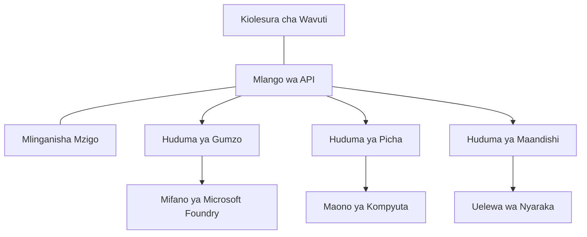

# Mbinu Bora za Kazi za AI za Uzalishaji na AZD

**Uvinjari wa Sura:**
- **📚 Nyumbani kwa Kozi**: [AZD For Beginners](../../README.md)
- **📖 Sura ya Sasa**: Chapter 8 - Production & Enterprise Patterns
- **⬅️ Sura Iliyopita**: [Chapter 7: Troubleshooting](../chapter-07-troubleshooting/debugging.md)
- **⬅️ Pia Inayohusiana**: [AI Workshop Lab](ai-workshop-lab.md)
- **🎯 Kozi Imekamilika**: [AZD For Beginners](../../README.md)

## Muhtasari

Mwongozo huu unatoa mbinu bora za kina kwa kusambaza mzigo wa kazi za AI ulio tayari kwa uzalishaji kwa kutumia Azure Developer CLI (AZD). Kulingana na maoni kutoka kwa jamii ya Microsoft Foundry kwenye Discord na utekelezaji halisi wa wateja, mbinu hizi zinashughulikia changamoto za kawaida zaidi katika mifumo ya AI ya uzalishaji.

## Changamoto Kuu Zinazoshughulikiwa

Kulingana na matokeo ya kura za jamii yetu, hizi ndizo changamoto kuu watengenezaji wanazokabiliana nazo:

- **45%** wanapata shida na uenezaji wa AI unaojumuisha huduma nyingi
- **38%** wana matatizo na usimamizi wa vitambulisho na siri  
- **35%** wanapata ugumu katika kuwa tayari kwa uzalishaji na upanuaji
- **32%** wanahitaji mikakati bora ya uboreshaji wa gharama
- **29%** wanahitaji ufuatiliaji na utatuzi wa matatizo ulioboreshwa

## Mifumo ya usanifu kwa AI wa uzalishaji

### Mfumo 1: Usanifu wa AI wa Microservices

**Wakati wa kutumia**: Maombi ya AI changamano yenye uwezo mbalimbali


**Utekelezaji wa AZD**:

```yaml
# azure.yaml
name: enterprise-ai-platform
services:
  web:
    project: ./web
    host: staticwebapp
  api-gateway:
    project: ./api-gateway
    host: containerapp
  chat-service:
    project: ./services/chat
    host: containerapp
  vision-service:
    project: ./services/vision
    host: containerapp
  text-service:
    project: ./services/text
    host: containerapp
```

### Mfumo 2: Uendeshaji wa Usindikaji wa AI unaotegemea Matukio

**Wakati wa kutumia**: Usindikaji wa kundi, uchambuzi wa hati, workflows zisizo za sinkroni

```bicep
// Event Hub for AI processing pipeline
resource eventHub 'Microsoft.EventHub/namespaces@2023-01-01-preview' = {
  name: eventHubNamespaceName
  location: location
  sku: {
    name: 'Standard'
    tier: 'Standard'
    capacity: 1
  }
}

// Service Bus for reliable message processing
resource serviceBus 'Microsoft.ServiceBus/namespaces@2022-10-01-preview' = {
  name: serviceBusNamespaceName
  location: location
  sku: {
    name: 'Premium'
    tier: 'Premium'
    capacity: 1
  }
}

// Function App for processing
resource functionApp 'Microsoft.Web/sites@2023-01-01' = {
  name: functionAppName
  location: location
  kind: 'functionapp,linux'
  properties: {
    siteConfig: {
      appSettings: [
        {
          name: 'FUNCTIONS_EXTENSION_VERSION'
          value: '~4'
        }
        {
          name: 'AZURE_OPENAI_ENDPOINT'
          value: '@Microsoft.KeyVault(VaultName=${keyVault.name};SecretName=openai-endpoint)'
        }
      ]
    }
  }
}
```

## Kufikiria Kuhusu Afya ya Wakala wa AI

Wakati programu ya wavuti ya jadi inapoanguka, dalili ni za kawaida: ukurasa haupaki, API inarudisha hitilafu, au uenezaji unashindwa. Maombi yanayoendeshwa na AI yanaweza kuvunjika kwa njia hizo zote—lakini pia yanaweza kutenda kwa njia zisizo wazi ambazo haziletei ujumbe wa wazi wa hitilafu.

Sehemu hii inakusaidia kujenga mfano wa akili kwa ufuatiliaji wa mizigo ya kazi za AI ili ujue wapi kuangalia unapoona mambo hayako sawa.

### Jinsi Afya ya Wakala Inavyotofautiana na Afya ya Programu ya Kawaida

Programu ya jadi inafanya kazi au haifanyi. Wakala wa AI anaweza kuonekana kufanya kazi lakini kutoa matokeo mabaya. Fikiria afya ya wakala kwa tabaka mbili:

| Tabaka | Kitu cha Kufuatilia | Mahali pa Kuangalia |
|-------|--------------|---------------|
| **Afya ya miundombinu** | Je, huduma inaendesha? Je, rasilimali zimepangwa? Je, ncha za huduma zinafikika? | `azd monitor`, afya ya rasilimali kwenye Azure Portal, logi za kontejina/aplikishaji |
| **Afya ya tabia** | Je, wakala anajibu kwa usahihi? Je, majibu yanapatikana kwa wakati? Je, modeli inaitwa kwa usahihi? | Application Insights traces, metriksi za ucheleweshaji wa miito ya modeli, logi za ubora wa majibu |

Afya ya miundombinu ni ya kawaida—ni ile ile kwa programu yoyote ya azd. Afya ya tabia ni tabaka jipya ambalo mizigo ya kazi za AI inaleta.

### Mahali pa Kuangalia Wakati Maombi ya AI Hayatafanya Kulingana na Inavyotarajiwa

Ikiwa programu yako ya AI haisemi matokeo unayoyatarajia, hapa kuna orodha ya kumbukumbu ya kimadhubuti:

1. **Anza na mambo ya msingi.** Je, programu inaendesha? Je, inaweza kufikia utegemezi wake? Angalia `azd monitor` na afya ya rasilimali kama ungefanya kwa programu yoyote.
2. **Angalia muunganisho wa modeli.** Je, programu yako inafanya miito kwa modeli kwa mafanikio? Miito ya modeli iliyoshindwa au iliyochelewa ndio chanzo cha kawaida cha matatizo ya programu za AI na itaonekana katika logi za programu yako.
3. **Angalia kile modeli ilipokea.** Majibu ya AI yanategemea pembejeo (prompt na muktadha uliorejeshwa). Ikiwa matokeo ni mabaya, kwa kawaida pembejeo ndizo zilizokosewa. Angalia ikiwa programu yako inatuma data sahihi kwa modeli.
4. **Kagua ucheleweshaji wa majibu.** Miito ya modeli ya AI ni polepole zaidi kuliko miito ya kawaida ya API. Ikiwa programu yako inaonekana kuchelewa, angalia ikiwa nyakati za majibu ya modeli zimeongezeka—hii inaweza kuashiria kudhibiti mzigo, mipaka ya uwezo, au msongamano wa kiwango cha eneo.
5. **Tazama ishara za gharama.** Mlipuko usiotarajiwa katika matumizi ya tokeni au miito ya API unaweza kuashiria mzunguko, prompt iliyosanidiwa vibaya, au majaribio ya ziada yasiyo ya lazima.

Hauhitaji kumiliki zana za uonekano (observability) mara moja. Muhimu ni kwamba maombi ya AI yana tabaka la ziada la tabia la kufuatilia, na ufuatiliaji uliopo wa azd (`azd monitor`) unakupa msingi wa kuchunguza tabaka zote mbili.

---

## Mbinu Bora za Usalama

### 1. Mfumo wa Usalama wa Zero-Trust

**Mkakati wa Utekelezaji**:
- Hakuna mawasiliano ya huduma kwa huduma bila uthibitisho
- Miito yote ya API itumie vitambulisho vinavyosimamiwa
- Kutengwa kwa mtandao kwa kutumia private endpoints
- Udhibiti wa upatikanaji kwa kanuni ya 'least privilege'

```bicep
// Managed Identity for each service
resource chatServiceIdentity 'Microsoft.ManagedIdentity/userAssignedIdentities@2023-01-31' = {
  name: 'chat-service-identity'
  location: location
}

// Role assignments with minimal permissions
resource openAIUserRole 'Microsoft.Authorization/roleAssignments@2022-04-01' = {
  scope: openAIAccount
  name: guid(openAIAccount.id, chatServiceIdentity.id, openAIUserRoleDefinitionId)
  properties: {
    roleDefinitionId: subscriptionResourceId('Microsoft.Authorization/roleDefinitions', '5e0bd9bd-7b93-4f28-af87-19fc36ad61bd')
    principalId: chatServiceIdentity.properties.principalId
    principalType: 'ServicePrincipal'
  }
}
```

### 2. Usimamizi Salama wa Siri

**Mfano wa Uunganisho wa Key Vault**:

```bicep
// Key Vault with proper access policies
resource keyVault 'Microsoft.KeyVault/vaults@2023-02-01' = {
  name: keyVaultName
  location: location
  properties: {
    tenantId: tenant().tenantId
    sku: {
      family: 'A'
      name: 'premium'  // Use premium for production
    }
    enableRbacAuthorization: true  // Use RBAC instead of access policies
    enablePurgeProtection: true    // Prevent accidental deletion
    enableSoftDelete: true
    softDeleteRetentionInDays: 90
  }
}

// Store all AI service credentials
resource openAIKeySecret 'Microsoft.KeyVault/vaults/secrets@2023-02-01' = {
  parent: keyVault
  name: 'openai-api-key'
  properties: {
    value: openAIAccount.listKeys().key1
    attributes: {
      enabled: true
    }
  }
}
```

### 3. Usalama wa Mtandao

**Usanidi wa Private Endpoint**:

```bicep
// Virtual Network for AI services
resource virtualNetwork 'Microsoft.Network/virtualNetworks@2023-04-01' = {
  name: vnetName
  location: location
  properties: {
    addressSpace: {
      addressPrefixes: ['10.0.0.0/16']
    }
    subnets: [
      {
        name: 'ai-services-subnet'
        properties: {
          addressPrefix: '10.0.1.0/24'
          privateEndpointNetworkPolicies: 'Disabled'
        }
      }
      {
        name: 'app-services-subnet'
        properties: {
          addressPrefix: '10.0.2.0/24'
          delegations: [
            {
              name: 'Microsoft.Web/serverFarms'
              properties: {
                serviceName: 'Microsoft.Web/serverFarms'
              }
            }
          ]
        }
      }
    ]
  }
}

// Private endpoints for all AI services
resource openAIPrivateEndpoint 'Microsoft.Network/privateEndpoints@2023-04-01' = {
  name: '${openAIAccountName}-pe'
  location: location
  properties: {
    subnet: {
      id: virtualNetwork.properties.subnets[0].id
    }
    privateLinkServiceConnections: [
      {
        name: 'openai-connection'
        properties: {
          privateLinkServiceId: openAIAccount.id
          groupIds: ['account']
        }
      }
    ]
  }
}
```

## Utendaji na Upanuaji

### 1. Mikakati ya Auto-Scaling

**Auto-scaling ya Container Apps**:

```bicep
resource containerApp 'Microsoft.App/containerApps@2023-05-01' = {
  name: containerAppName
  location: location
  properties: {
    configuration: {
      ingress: {
        external: true
        targetPort: 8000
        transport: 'http'
      }
    }
    template: {
      scale: {
        minReplicas: 2  // Always have 2 instances minimum
        maxReplicas: 50 // Scale up to 50 for high load
        rules: [
          {
            name: 'http-scaling'
            http: {
              metadata: {
                concurrentRequests: '20'  // Scale when >20 concurrent requests
              }
            }
          }
          {
            name: 'cpu-scaling'
            custom: {
              type: 'cpu'
              metadata: {
                type: 'Utilization'
                value: '70'  // Scale when CPU >70%
              }
            }
          }
        ]
      }
    }
  }
}
```

### 2. Mikakati ya Caching

**Redis Cache kwa Majibu ya AI**:

```bicep
// Redis Premium for production workloads
resource redisCache 'Microsoft.Cache/redis@2023-04-01' = {
  name: redisCacheName
  location: location
  properties: {
    sku: {
      name: 'Premium'
      family: 'P'
      capacity: 1
    }
    enableNonSslPort: false
    minimumTlsVersion: '1.2'
    redisConfiguration: {
      'maxmemory-policy': 'allkeys-lru'
    }
    // Enable clustering for high availability
    redisVersion: '6.0'
    shardCount: 2
  }
}

// Cache configuration in application
var cacheConnectionString = '${redisCache.properties.hostName}:6380,password=${redisCache.listKeys().primaryKey},ssl=True,abortConnect=False'
```

### 3. Kusawazisha Mzigo na Usimamizi wa Trafiki

**Application Gateway na WAF**:

```bicep
// Application Gateway with Web Application Firewall
resource applicationGateway 'Microsoft.Network/applicationGateways@2023-04-01' = {
  name: appGatewayName
  location: location
  properties: {
    sku: {
      name: 'WAF_v2'
      tier: 'WAF_v2'
      capacity: 2
    }
    webApplicationFirewallConfiguration: {
      enabled: true
      firewallMode: 'Prevention'
      ruleSetType: 'OWASP'
      ruleSetVersion: '3.2'
    }
    // Backend pools for AI services
    backendAddressPools: [
      {
        name: 'ai-services-pool'
        properties: {
          backendAddresses: [
            {
              fqdn: '${containerApp.properties.configuration.ingress.fqdn}'
            }
          ]
        }
      }
    ]
  }
}
```

## 💰 Uboreshaji wa Gharama

### 1. Resource Right-Sizing

**Mipangilio Maalum kwa Mazingira**:

```bash
# Mazingira ya maendeleo
azd env new development
azd env set AZURE_OPENAI_SKU "S0"
azd env set AZURE_OPENAI_CAPACITY 10
azd env set AZURE_SEARCH_SKU "basic"
azd env set CONTAINER_CPU 0.5
azd env set CONTAINER_MEMORY 1.0

# Mazingira ya uzalishaji
azd env new production
azd env set AZURE_OPENAI_SKU "S0"
azd env set AZURE_OPENAI_CAPACITY 100
azd env set AZURE_SEARCH_SKU "standard"
azd env set CONTAINER_CPU 2.0
azd env set CONTAINER_MEMORY 4.0
```

### 2. Ufuatiliaji wa Gharama na Bajeti

```bicep
// Cost management and budgets
resource budget 'Microsoft.Consumption/budgets@2023-05-01' = {
  name: 'ai-workload-budget'
  properties: {
    timePeriod: {
      startDate: '2024-01-01'
      endDate: '2024-12-31'
    }
    timeGrain: 'Monthly'
    amount: 2000  // $2000 monthly budget
    category: 'Cost'
    notifications: {
      warning: {
        enabled: true
        operator: 'GreaterThan'
        threshold: 80
        contactEmails: [
          'finance@company.com'
          'engineering@company.com'
        ]
        contactRoles: [
          'Owner'
          'Contributor'
        ]
      }
      critical: {
        enabled: true
        operator: 'GreaterThan'
        threshold: 95
        contactEmails: [
          'cto@company.com'
        ]
      }
    }
  }
}
```

### 3. Uboreshaji wa Matumizi ya Tokeni

**Usimamizi wa Gharama wa OpenAI**:

```typescript
// Uboreshaji wa tokeni kwa ngazi ya programu
class TokenOptimizer {
  private readonly maxTokens = 4000;
  private readonly reserveTokens = 500;
  
  optimizePrompt(userInput: string, context: string): string {
    const availableTokens = this.maxTokens - this.reserveTokens;
    const estimatedTokens = this.estimateTokens(userInput + context);
    
    if (estimatedTokens > availableTokens) {
      // Fupisha muktadha, si ingizo la mtumiaji
      context = this.truncateContext(context, availableTokens - this.estimateTokens(userInput));
    }
    
    return `${context}\n\nUser: ${userInput}`;
  }
  
  private estimateTokens(text: string): number {
    // Makadirio ya karibu: 1 tokeni ≈ 4 herufi
    return Math.ceil(text.length / 4);
  }
}
```

## Ufuatiliaji na Uwezo wa Kuonekana

### 1. Application Insights Kamili

```bicep
// Application Insights with advanced features
resource applicationInsights 'Microsoft.Insights/components@2020-02-02' = {
  name: applicationInsightsName
  location: location
  kind: 'web'
  properties: {
    Application_Type: 'web'
    WorkspaceResourceId: logAnalyticsWorkspace.id
    SamplingPercentage: 100  // Full sampling for AI apps
    DisableIpMasking: false  // Enable for security
  }
}

// Custom metrics for AI operations
resource aiMetricAlerts 'Microsoft.Insights/metricAlerts@2018-03-01' = {
  name: 'ai-high-error-rate'
  location: 'global'
  properties: {
    description: 'Alert when AI service error rate is high'
    severity: 2
    enabled: true
    scopes: [
      applicationInsights.id
    ]
    evaluationFrequency: 'PT1M'
    windowSize: 'PT5M'
    criteria: {
      'odata.type': 'Microsoft.Azure.Monitor.SingleResourceMultipleMetricCriteria'
      allOf: [
        {
          name: 'high-error-rate'
          metricName: 'requests/failed'
          operator: 'GreaterThan'
          threshold: 10
          timeAggregation: 'Count'
        }
      ]
    }
  }
}
```

### 2. Ufuatiliaji Maalum kwa AI

**Dashibodi Desturi za Metriki za AI**:

```json
// Dashboard configuration for AI workloads
{
  "dashboard": {
    "name": "AI Application Monitoring",
    "tiles": [
      {
        "name": "OpenAI Request Volume",
        "query": "requests | where name contains 'openai' | summarize count() by bin(timestamp, 5m)"
      },
      {
        "name": "AI Response Latency",
        "query": "requests | where name contains 'openai' | summarize avg(duration) by bin(timestamp, 5m)"
      },
      {
        "name": "Token Usage",
        "query": "customMetrics | where name == 'openai_tokens_used' | summarize sum(value) by bin(timestamp, 1h)"
      },
      {
        "name": "Cost per Hour",
        "query": "customMetrics | where name == 'openai_cost' | summarize sum(value) by bin(timestamp, 1h)"
      }
    ]
  }
}
```

### 3. Ukaguzi wa Afya na Ufuatiliaji wa Uptime

```bicep
// Application Insights availability tests
resource availabilityTest 'Microsoft.Insights/webtests@2022-06-15' = {
  name: 'ai-app-availability-test'
  location: location
  tags: {
    'hidden-link:${applicationInsights.id}': 'Resource'
  }
  properties: {
    SyntheticMonitorId: 'ai-app-availability-test'
    Name: 'AI Application Availability Test'
    Description: 'Tests AI application endpoints'
    Enabled: true
    Frequency: 300  // 5 minutes
    Timeout: 120    // 2 minutes
    Kind: 'ping'
    Locations: [
      {
        Id: 'us-east-2-azr'
      }
      {
        Id: 'us-west-2-azr'
      }
    ]
    Configuration: {
      WebTest: '''
        <WebTest Name="AI Health Check" 
                 Id="8d2de8d2-a2b0-4c2e-9a0d-8f9c9a0b8c8d" 
                 Enabled="True" 
                 CssProjectStructure="" 
                 CssIteration="" 
                 Timeout="120" 
                 WorkItemIds="" 
                 xmlns="http://microsoft.com/schemas/VisualStudio/TeamTest/2010" 
                 Description="" 
                 CredentialUserName="" 
                 CredentialPassword="" 
                 PreAuthenticate="True" 
                 Proxy="default" 
                 StopOnError="False" 
                 RecordedResultFile="" 
                 ResultsLocale="">
          <Items>
            <Request Method="GET" 
                     Guid="a5f10126-e4cd-570d-961c-cea43999a200" 
                     Version="1.1" 
                     Url="${webApp.properties.defaultHostName}/health" 
                     ThinkTime="0" 
                     Timeout="120" 
                     ParseDependentRequests="True" 
                     FollowRedirects="True" 
                     RecordResult="True" 
                     Cache="False" 
                     ResponseTimeGoal="0" 
                     Encoding="utf-8" 
                     ExpectedHttpStatusCode="200" 
                     ExpectedResponseUrl="" 
                     ReportingName="" 
                     IgnoreHttpStatusCode="False" />
          </Items>
        </WebTest>
      '''
    }
  }
}
```

## Ufufuaji wa Ajali na Upatikanaji wa Juu

### 1. Utekelezaji wa Mikoa Nyingi

```yaml
# azure.yaml - Multi-region configuration
name: ai-app-multiregion
services:
  api-primary:
    project: ./api
    host: containerapp
    env:
      - AZURE_REGION=eastus
  api-secondary:
    project: ./api
    host: containerapp
    env:
      - AZURE_REGION=westus2
```

```bicep
// Traffic Manager for global load balancing
resource trafficManager 'Microsoft.Network/trafficManagerProfiles@2022-04-01' = {
  name: trafficManagerProfileName
  location: 'global'
  properties: {
    profileStatus: 'Enabled'
    trafficRoutingMethod: 'Priority'
    dnsConfig: {
      relativeName: trafficManagerProfileName
      ttl: 30
    }
    monitorConfig: {
      protocol: 'HTTPS'
      port: 443
      path: '/health'
      intervalInSeconds: 30
      toleratedNumberOfFailures: 3
      timeoutInSeconds: 10
    }
    endpoints: [
      {
        name: 'primary-endpoint'
        type: 'Microsoft.Network/trafficManagerProfiles/azureEndpoints'
        properties: {
          targetResourceId: primaryAppService.id
          endpointStatus: 'Enabled'
          priority: 1
        }
      }
      {
        name: 'secondary-endpoint'
        type: 'Microsoft.Network/trafficManagerProfiles/azureEndpoints'
        properties: {
          targetResourceId: secondaryAppService.id
          endpointStatus: 'Enabled'
          priority: 2
        }
      }
    ]
  }
}
```

### 2. Nakala rudufu ya Data na Ufufuaji

```bicep
// Backup configuration for critical data
resource backupVault 'Microsoft.DataProtection/backupVaults@2023-05-01' = {
  name: backupVaultName
  location: location
  identity: {
    type: 'SystemAssigned'
  }
  properties: {
    storageSettings: [
      {
        datastoreType: 'VaultStore'
        type: 'LocallyRedundant'
      }
    ]
  }
}

// Backup policy for AI models and data
resource backupPolicy 'Microsoft.DataProtection/backupVaults/backupPolicies@2023-05-01' = {
  parent: backupVault
  name: 'ai-data-backup-policy'
  properties: {
    policyRules: [
      {
        backupParameters: {
          backupType: 'Full'
          objectType: 'AzureBackupParams'
        }
        trigger: {
          schedule: {
            repeatingTimeIntervals: [
              'R/2024-01-01T02:00:00+00:00/P1D'  // Daily at 2 AM
            ]
          }
          objectType: 'ScheduleBasedTriggerContext'
        }
        dataStore: {
          datastoreType: 'VaultStore'
          objectType: 'DataStoreInfoBase'
        }
        name: 'BackupDaily'
        objectType: 'AzureBackupRule'
      }
    ]
  }
}
```

## DevOps na Muunganisho wa CI/CD

### 1. Mtiririko wa GitHub Actions

```yaml
# .github/workflows/deploy-ai-app.yml
name: Deploy AI Application

on:
  push:
    branches: [main]
  pull_request:
    branches: [main]

jobs:
  test:
    runs-on: ubuntu-latest
    steps:
      - uses: actions/checkout@v4
      
      - name: Setup Python
        uses: actions/setup-python@v4
        with:
          python-version: '3.11'
          
      - name: Install dependencies
        run: |
          pip install -r requirements.txt
          pip install pytest
          
      - name: Run tests
        run: pytest tests/
        
      - name: AI Safety Tests
        run: |
          python scripts/test_ai_safety.py
          python scripts/validate_prompts.py

  deploy-staging:
    needs: test
    if: github.event_name == 'pull_request'
    runs-on: ubuntu-latest
    steps:
      - uses: actions/checkout@v4
      
      - name: Setup AZD
        uses: Azure/setup-azd@v2
        
      - name: Login to Azure
        uses: azure/login@v1
        with:
          creds: ${{ secrets.AZURE_CREDENTIALS }}
          
      - name: Deploy to Staging
        run: |
          azd env select staging
          azd deploy

  deploy-production:
    needs: test
    if: github.ref == 'refs/heads/main'
    runs-on: ubuntu-latest
    steps:
      - uses: actions/checkout@v4
      
      - name: Setup AZD
        uses: Azure/setup-azd@v2
        
      - name: Login to Azure
        uses: azure/login@v1
        with:
          creds: ${{ secrets.AZURE_CREDENTIALS }}
          
      - name: Deploy to Production
        run: |
          azd env select production
          azd deploy
          
      - name: Run Production Health Checks
        run: |
          python scripts/health_check.py --env production
```

### 2. Uthibitishaji wa Miundombinu

```bash
# scripts/validate_infrastructure.sh
#!/bin/bash

echo "Validating AI infrastructure deployment..."

# Angalia kama huduma zote zinazohitajika zinafanya kazi
services=("openai" "search" "storage" "keyvault")
for service in "${services[@]}"; do
    echo "Checking $service..."
    if ! az resource list --resource-type "Microsoft.CognitiveServices/accounts" --query "[?contains(name, '$service')]" -o tsv; then
        echo "ERROR: $service not found"
        exit 1
    fi
done

# Thibitisha uanzishaji wa modeli za OpenAI
echo "Validating OpenAI model deployments..."
models=$(az cognitiveservices account deployment list --name $AZURE_OPENAI_NAME --resource-group $AZURE_RESOURCE_GROUP --query "[].name" -o tsv)
if [[ ! $models == *"gpt-4.1-mini"* ]]; then
  echo "ERROR: Required model gpt-4.1-mini not deployed"
    exit 1
fi

# Jaribu muunganisho wa huduma ya AI
echo "Testing AI service connectivity..."
python scripts/test_connectivity.py

echo "Infrastructure validation completed successfully!"
```

## Orodha ya Ukaguzi ya Uko Tayari kwa Uzalishaji

### Usalama ✅
- [ ] Huduma zote zinatumia vitambulisho vinavyosimamiwa
- [ ] Siri zimehifadhiwa kwenye Key Vault
- [ ] Private endpoints zimesanidiwa
- [ ] Vikundi vya usalama wa mtandao vimetekelezwa
- [ ] RBAC na kanuni ya 'least privilege'
- [ ] WAF imewezeshwa kwenye ncha za umma

### Utendaji ✅
- [ ] Auto-scaling imesanidiwa
- [ ] Caching imetekelezwa
- [ ] Kusanidi kusawazisha mzigo
- [ ] CDN kwa yaliyomo yasiyobadilika
- [ ] Kupangilia pool za muunganisho wa hifadhidata
- [ ] Uboreshaji wa matumizi ya tokeni

### Ufuatiliaji ✅
- [ ] Application Insights imesanidiwa
- [ ] Metriki maalum zimetolewa
- [ ] Sheria za onyo zimesanidiwa
- [ ] Dashibodi imetengenezwa
- [ ] Taratibu za ukaguzi wa afya zimetekelezwa
- [ ] Sera za kuhifadhi logi

### Uthabiti ✅
- [ ] Utekelezaji wa mikoa mingi
- [ ] Mpango wa nakala rudufu na ufufuaji
- [ ] Circuit breakers zimetekelezwa
- [ ] Sera za kurudia zimesanidiwa
- [ ] Kupungua kwa huduma kwa taratibu (graceful degradation)
- [ ] Ncha za ukaguzi wa afya

### Usimamizi wa Gharama ✅
- [ ] Alama za bajeti zimesanidiwa
- [ ] Kuchagua ukubwa sahihi wa rasilimali
- [ ] Punguzo za dev/test zimetumika
- [ ] Instances zilizo na uhifadhi zimenunuliwa
- [ ] Dashibodi ya ufuatiliaji wa gharama
- [ ] Mapitio ya kawaida ya gharama

### Uzingatiaji wa Sheria ✅
- [ ] Mahitaji ya makazi ya data yametimizwa
- [ ] Kuchapisha logi za ukaguzi kumewezeshwa
- [ ] Sera za uyazingaji zimetumika
- [ ] Msingi wa usalama umetekelezwa
- [ ] Tathmini za usalama za kawaida
- [ ] Mpango wa majibu kwa matukio

## Viwango vya Utendaji

### Metriki za Kawaida za Uzalishaji

| Metriki | Lengo | Ufuatiliaji |
|--------|--------|------------|
| **Muda wa Majibu** | < 2 seconds | Application Insights |
| **Upatikanaji** | 99.9% | Uptime monitoring |
| **Kiwango cha Makosa** | < 0.1% | Application logs |
| **Matumizi ya Tokeni** | < $500/month | Cost management |
| **Watumiaji sambamba** | 1000+ | Load testing |
| **Muda wa Ufufuaji** | < 1 hour | Disaster recovery tests |

### Load Testing

```bash
# Skripti ya upimaji mzigo kwa programu za AI
python scripts/load_test.py \
  --endpoint https://your-ai-app.azurewebsites.net \
  --concurrent-users 100 \
  --duration 300 \
  --ramp-up 60
```

## 🤝 Mbinu Bora za Jamii

Kutokana na maoni ya jamii ya Microsoft Foundry kwenye Discord:

### Mapendekezo Muhimu kutoka Jamii:

1. **Anza Kidogo, Panua Polepole**: Anza na SKUs za msingi na panua kulingana na matumizi halisi
2. **Fuatilia Kila Kitu**: Sanidi ufuatiliaji kamili kuanzia siku ya kwanza
3. **Automatisha Usalama**: Tumia infrastructure kama msimbo kwa usalama unaolingana
4. **Jaribu kwa Kina**: Jumuisha majaribio maalum ya AI katika pipeline yako
5. **Panga kwa Gharama**: Fuatilia matumizi ya tokeni na sanidi arifa za bajeti mapema

### Makosa ya Kawaida ya Kuepuka:

- ❌ Kuweka API keys moja kwa moja kwenye msimbo
- ❌ Kutoanzisha ufuatiliaji unaofaa
- ❌ Kusahau uboreshaji wa gharama
- ❌ Kutojaribu hali za kushindwa
- ❌ Kuweka uzalishaji bila ukaguzi wa afya

## Amri za AZD AI CLI na Viendelezi

AZD inajumuisha seti inayokua ya amri maalum za AI na viendelezi vinavyoangamiza mtiririko wa kazi za AI wa uzalishaji. Zana hizi zinapunguza pengo kati ya ukuzaji wa ndani na uenezaji wa uzalishaji wa mizigo ya kazi za AI.

### Viendelezi vya AZD kwa AI

AZD inatumia mfumo wa viendelezi kuongeza uwezo maalum kwa AI. Sakinisha na simamia viendelezi kwa:

```bash
# Orodhesha viendelezi vyote vinavyopatikana (vikiwemo AI)
azd extension list

# Kagua maelezo ya viendelezi vilivyowekwa
azd extension show azure.ai.agents

# Sakinisha kiendelezaji cha mawakala wa Foundry
azd extension install azure.ai.agents

# Sakinisha kiendelezaji cha urekebishaji wa kina
azd extension install azure.ai.finetune

# Sakinisha kiendelezaji cha modeli zilizobinafsishwa
azd extension install azure.ai.models

# Sasisha viendelezi vyote vilivyowekwa
azd extension upgrade --all
```

**Viendelezi vya AI vinavyopatikana:**

| Kiendelezi | Madhumuni | Hali |
|-----------|---------|--------|
| `azure.ai.agents` | Usimamizi wa Foundry Agent Service | Preview |
| `azure.ai.finetune` | Urekebishaji wa modeli ya Foundry | Preview |
| `azure.ai.models` | Modeli maalum za Foundry | Preview |
| `azure.coding-agent` | Usanidi wa wakala wa kuandika msimbo | Available |

### Kuanza Miradi ya Wakala kwa `azd ai agent init`

Amri ya `azd ai agent init` hutengenezea mradi wa wakala wa AI ulio tayari kwa uzalishaji uliounganishwa na Microsoft Foundry Agent Service:

```bash
# Anzisha mradi mpya wa wakala kutoka kwenye manifesti ya wakala
azd ai agent init -m <manifest-path-or-uri>

# Anzisha na lenga mradi maalum wa Foundry
azd ai agent init -m agent-manifest.yaml --project-id <foundry-project-id>

# Anzisha na saraka ya chanzo iliyobinafsishwa
azd ai agent init -m agent-manifest.yaml --src ./agents/my-agent

# Lenga Container Apps kama mwenyeji
azd ai agent init -m agent-manifest.yaml --host containerapp
```

**Bendera muhimu:**

| Bendera | Maelezo |
|------|-------------|
| `-m, --manifest` | Njia au URI ya manifest ya wakala ya kuongezwa kwenye mradi wako |
| `-p, --project-id` | ID ya Mradi wa Microsoft Foundry uliopo kwa mazingira yako ya azd |
| `-s, --src` | Saraka ya kupakua ufafanuzi wa wakala (kwa chaguo-msingi `src/<agent-id>`) |
| `--host` | Badili mwenyeji wa chaguo-msingi (mfano, `containerapp`) |
| `-e, --environment` | Mazingira ya azd ya kutumia |

**Ushauri wa uzalishaji**: Tumia `--project-id` kuungana moja kwa moja kwa mradi wa Foundry uliopo, ukihifadhi msimbo wa wakala na rasilimali za wingu zikiwa zimeunganishwa tangu mwanzoni.

### Itifaki ya Muktadha wa Modeli (MCP) na `azd mcp`

AZD inajumuisha msaada wa seva ya MCP uliojengwa (Alpha), ukiwawezesha maagent na zana za AI kuingiliana na rasilimali zako za Azure kupitia itifaki iliyostandadishwa:

```bash
# Anzisha seva ya MCP kwa mradi wako
azd mcp start

# Kagua kanuni za ridhaa za Copilot za sasa kwa ajili ya utekelezaji wa zana
azd copilot consent list
```

Seva ya MCP inaonyesha muktadha wa mradi wako wa azd—mazingira, huduma, na rasilimali za Azure—kwa zana za ukuzaji zinazoendeshwa na AI. Hii inawawezesha:

- **Utekelezaji unaosaidiwa na AI**: Waachie maagent wa kuandika msimbo kuulizia hali ya mradi wako na kuamsha utekelezaji
- **Ugundaji wa rasilimali**: Zana za AI zinaweza kugundua rasilimali za Azure zinazotumika na mradi wako
- **Usimamizi wa mazingira**: Maagent yanaweza kubadilisha kati ya mazingira ya dev/staging/production

### Uundaji wa Miundombinu na `azd infra generate`

Kwa mizigo ya kazi za AI za uzalishaji, unaweza kuunda na kubinafsisha Infrastructure as Code badala ya kutegemea upatikanaji wa moja kwa moja:

```bash
# Tengeneza faili za Bicep/Terraform kutoka kwa ufafanuzi wa mradi wako
azd infra generate
```

Hii inaandika IaC kwa diski ili uweze:
- Kupitia na kukagua miundombinu kabla ya kuieneza
- Kuongeza sera za usalama za desturi (kanuni za mtandao, private endpoints)
- Kuunganishwa na michakato ya ukaguzi ya IaC iliyopo
- Kudhibiti mabadiliko ya miundombinu kwa toleo tofauti na msimbo wa programu

### Hooks za Mzunguko wa Maisha wa Uzalishaji

Hooks za AZD zinakuwezesha kuingiza mantiki maalum katika kila hatua ya mzunguko wa maisha ya uenezaji—muhimu kwa mitiririko ya kazi za AI za uzalishaji:

```yaml
# azure.yaml - Production hooks example
name: ai-production-app
hooks:
  preprovision:
    shell: sh
    run: scripts/validate-quotas.sh    # Check AI model quota before provisioning
  postprovision:
    shell: sh
    run: scripts/configure-networking.sh  # Set up private endpoints
  predeploy:
    shell: sh
    run: scripts/run-ai-safety-tests.sh  # Run prompt safety checks
  postdeploy:
    shell: sh
    run: scripts/smoke-test.sh           # Verify agent responses post-deploy
services:
  agent-api:
    project: ./src/agent
    host: containerapp
    hooks:
      predeploy:
        shell: sh
        run: scripts/validate-model-access.sh  # Per-service hook
```

```bash
# Endesha hook maalum kwa mkono wakati wa maendeleo
azd hooks run predeploy
```

**Hooks zinazopendekezwa kwa uzalishaji kwa kazi za AI:**

| Hook | Matumizi |
|------|----------|
| `preprovision` | Thibitisha vigezo vya usajili kwa uwezo wa modeli ya AI |
| `postprovision` | Sanidi private endpoints, tuma uzito wa modeli |
| `predeploy` | Endesha majaribio ya usalama wa AI, thibitisha templeti za prompt |
| `postdeploy` | Fanya mtihani wa msingi wa majibu ya wakala, hakiki muunganisho wa modeli |

### Usanidi wa Mstari wa CI/CD

Tumia `azd pipeline config` kuunganisha mradi wako na GitHub Actions au Azure Pipelines kwa uthibitisho salama wa Azure:

```bash
# Sanidi mchakato wa CI/CD (wa mwingiliano)
azd pipeline config

# Sanidi kwa mtoa huduma maalum
azd pipeline config --provider github
```

Amri hii:
- Inaunda service principal yenye upatikanaji wa 'least-privilege'
- Inasanidi federated credentials (hakuna siri zilizohifadhiwa)
- Inazalisha au kusasisha faili ya ufafanuzi wa pipeline yako
- Inapanga vigezo vinavyohitajika vya mazingira kwenye mfumo wako wa CI/CD

**Mtiririko wa uzalishaji na usanidi wa pipeline:**

```bash
# 1. Sanidi mazingira ya uzalishaji
azd env new production
azd env set AZURE_OPENAI_CAPACITY 100

# 2. Sanidi pipeline
azd pipeline config --provider github

# 3. Pipeline inaendesha azd deploy kila mara inapofanywa push kwenye tawi main
```

### Kuongeza Vipengele kwa `azd add`

Ongeza huduma za Azure hatua kwa hatua kwa mradi uliopo:

```bash
# Ongeza sehemu mpya ya huduma kwa njia ya mwingiliano
azd add
```

Hii ni muhimu hasa kwa kupanua programu za AI za uzalishaji—kwa mfano, kuongeza huduma ya utafutaji wa vector, ncha mpya ya wakala, au kipengele cha ufuatiliaji kwa uenezaji uliopo.

## Rasilimali Zaidi
- **Azure Well-Architected Framework**: [Uongozi wa mizigo ya AI](https://learn.microsoft.com/azure/well-architected/ai/)
- **Microsoft Foundry Documentation**: [Nyaraka rasmi](https://learn.microsoft.com/azure/ai-studio/)
- **Community Templates**: [Mifano za Azure](https://github.com/Azure-Samples)
- **Discord Community**: [chaneli ya #Azure](https://discord.gg/microsoft-azure)
- **Ujuzi za Agent kwa Azure**: [microsoft/github-copilot-for-azure kwenye skills.sh](https://skills.sh/microsoft/github-copilot-for-azure) - 37 ujuzi za agenti wazi kwa Azure AI, Foundry, utoaji, uboreshaji wa gharama, na uchunguzi. Sakinisha katika mhariri wako:
  ```bash
  npx skills add microsoft/github-copilot-for-azure
  ```

---

**Urambazaji wa Sura:**
- **📚 Nyumbani kwa Kozi**: [AZD For Beginners](../../README.md)
- **📖 Sura ya Sasa**: Sura 8 - Mifumo ya Uzalishaji na Kampuni
- **⬅️ Sura iliyopita**: [Sura 7: Utatuzi wa Matatizo](../chapter-07-troubleshooting/debugging.md)
- **⬅️ Pia Kuhusiana**: [Warsha ya AI](ai-workshop-lab.md)
- **� Kozi Imekamilika**: [AZD For Beginners](../../README.md)

**Kumbuka**: Mizigo ya kazi ya AI kwa uzalishaji inahitaji upangaji makini, ufuatiliaji, na uboreshaji endelevu. Anza na mifumo hii na irekebishe ili ifuatane na mahitaji yako maalum.

---

<!-- CO-OP TRANSLATOR DISCLAIMER START -->
**Tamko**:
Hati hii imetafsiriwa kwa kutumia huduma ya tafsiri ya AI [Co-op Translator](https://github.com/Azure/co-op-translator). Ingawa tunajitahidi kuhakikisha usahihi, tafadhali fahamu kwamba tafsiri za kiotomatiki zinaweza kuwa na makosa au kutokamilika. Nyaraka ya asili katika lugha yake ya asili inapaswa kuchukuliwa kuwa chanzo chenye mamlaka. Kwa taarifa muhimu, tunapendekeza kutumia tafsiri ya kitaalamu iliyofanywa na binadamu. Hatuna uwajibikaji kwa maelewano au tafsiri zisizo sahihi zinazotokana na matumizi ya tafsiri hii.
<!-- CO-OP TRANSLATOR DISCLAIMER END -->