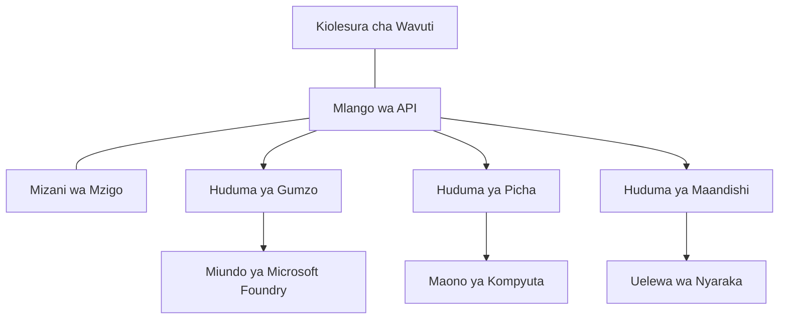

# Misingi Bora ya Mizigo ya AI kwa Uzalishaji na AZD

**Urambazaji wa Sura:**
- **📚 Nyumbani kwa Kozi**: [AZD For Beginners](../../README.md)
- **📖 Sura ya Sasa**: Sura 8 - Production & Enterprise Patterns
- **⬅️ Sura Iliyotangulia**: [Sura 7: Utatuzi wa Matatizo](../chapter-07-troubleshooting/debugging.md)
- **⬅️ Pia Inayohusiana**: [Maabara ya Mafunzo ya AI](ai-workshop-lab.md)
- **🎯 Kozi Imekamilika**: [AZD For Beginners](../../README.md)

## Muhtasari

Mwongozo huu unatoa mbinu bora za kikao kwa kupeleka mizigo ya AI iliyotayarishwa kwa uzalishaji kwa kutumia Azure Developer CLI (AZD). Kulingana na maoni kutoka kwa jamii ya Microsoft Foundry Discord na utekelezaji halisi wa wateja, mbinu hizi zinashughulikia changamoto zinazojitokeza zaidi katika mifumo ya AI za uzalishaji.

## Changamoto Muhimu Zinazoshughulikiwa

Kulingana na matokeo ya kura za jamii yetu, hizi ndizo changamoto kuu watengenezaji wanazokumbana nazo:

- **45%** wanapata ugumu katika kusambaza huduma nyingi za AI
- **38%** wana matatizo na usimamizi wa nywila na siri  
- **35%** wanapata ugumu na utayarishaji kwa uzalishaji na upanuzi
- **32%** wanahitaji mikakati bora ya uboreshaji wa gharama
- **29%** wanahitaji uboreshaji wa ufuatiliaji na utatuzi wa matatizo

## Mifumo ya Ubunifu kwa AI za Uzalishaji

### Mfumo 1: Miundombinu ya AI ya Microservices

**Wakati wa kutumia**: Programu ngumu za AI zenye uwezo mwingi


**Utekelezaji wa AZD**:

```yaml
# azure.yaml
name: enterprise-ai-platform
services:
  web:
    project: ./web
    host: staticwebapp
  api-gateway:
    project: ./api-gateway
    host: containerapp
  chat-service:
    project: ./services/chat
    host: containerapp
  vision-service:
    project: ./services/vision
    host: containerapp
  text-service:
    project: ./services/text
    host: containerapp
```

### Mfumo 2: Usindikaji wa AI Unaosababishwa na Matukio

**Wakati wa kutumia**: Usindikaji wa kundi, uchambuzi wa nyaraka, na taratibu zisizo za wakati (asynchronous)

```bicep
// Event Hub for AI processing pipeline
resource eventHub 'Microsoft.EventHub/namespaces@2023-01-01-preview' = {
  name: eventHubNamespaceName
  location: location
  sku: {
    name: 'Standard'
    tier: 'Standard'
    capacity: 1
  }
}

// Service Bus for reliable message processing
resource serviceBus 'Microsoft.ServiceBus/namespaces@2022-10-01-preview' = {
  name: serviceBusNamespaceName
  location: location
  sku: {
    name: 'Premium'
    tier: 'Premium'
    capacity: 1
  }
}

// Function App for processing
resource functionApp 'Microsoft.Web/sites@2023-01-01' = {
  name: functionAppName
  location: location
  kind: 'functionapp,linux'
  properties: {
    siteConfig: {
      appSettings: [
        {
          name: 'FUNCTIONS_EXTENSION_VERSION'
          value: '~4'
        }
        {
          name: 'AZURE_OPENAI_ENDPOINT'
          value: '@Microsoft.KeyVault(VaultName=${keyVault.name};SecretName=openai-endpoint)'
        }
      ]
    }
  }
}
```

## Kufikiria Kuhusu Afya ya Wakala wa AI

Wakati programu ya wavuti ya kawaida inapoharibika, dalili ni za kawaida: ukurasa haujapakia, API inarejea kosa, au uenezaji unashindikana. Programu zinazotumia AI zinaweza kuharibika kwa njia zote hizo—lakini pia zinaweza kufanya vibaya kwa njia laini ambazo hazionyeshi ujumbe wa kosa wazi.

Sehemu hii inakusaidia kujenga mfano wa akili kwa ufuatiliaji wa mizigo ya AI ili ujuwe wapi kuangalia wakati mambo hayako sawa.

### Jinsi Afya ya Wakala Inavyotofautiana na Afya ya Programu ya Kawaida

Programu ya kawaida au inafanya kazi au hairafiki. Wakala wa AI anaweza kuonekana kufanya kazi lakini kutoa matokeo duni. Fikiria afya ya wakala katika tabaka mbili:

| Tabaka | Kile cha Kuangalia | Wapi Kuangalia |
|-------|--------------|---------------|
| **Afya ya miundombinu** | Je, huduma inaendesha? Je, rasilimali zimepelekwa? Je, vituo vya mwisho vinapatikana? | `azd monitor`, Afya ya rasilimali kwenye Azure Portal, logi za container/app |
| **Afya ya tabia** | Je, wakala anajibu kwa usahihi? Je, majibu yanapatikana kwa wakati? Je, mfano unaitwa kwa usahihi? | Application Insights traces, vipimo vya ucheleweshaji wa miito ya mfano, logi za ubora wa majibu |

Afya ya miundombinu ni ya kawaida—ni ile ile kwa programu yoyote ya azd. Afya ya tabia ni tabaka jipya ambalo mizigo ya AI inaingiza.

### Wapi Kuangalia Wakati Programu za AI Hazitendeki Kulingana na Inavyotarajiwa

Ikiwa programu yako ya AI haisababisha matokeo unayotegemea, hapa kuna orodha ya kiteknolojia ya kuangalia:

1. **Anza na mambo ya msingi.** Je, programu inaendesha? Je, inaweza kufikia utegemezi wake? Angalia `azd monitor` na afya ya rasilimali kama unavyofanya kwa programu yoyote.
2. **Kagua muunganisho wa mfano.** Je, programu yako inaita mfano wa AI kwa mafanikio? Miito ya mfano iliyoshindikana au iliyochelewa ndiyo chanzo cha kawaida cha matatizo ya programu za AI na itaonekana katika logi za programu yako.
3. **Tazama kile kilichopokelewa na mfano.** Majibu ya AI yanategemea pembejeo (prompt na muktadha uliopatikana). Ikiwa toleo ni baya, kawaida pembejeo ni mbaya. Angalia kama programu yako inatuma data sahihi kwa mfano.
4. **Kagua ucheleweshaji wa majibu.** Miito ya mfano ya AI ni polepole kuliko miito ya kawaida ya API. Ikiwa programu yako inahisi polepole, angalia kama nyakati za majibu ya mfano zimeongezeka—hii inaweza kuashiria throttling, vizingiti vya uwezo, au msongamano kwa kiwango cha kanda.
5. **Angalia ishara za gharama.** Mlipuko usiotegemezwa katika matumizi ya tokeni au miito ya API unaweza kuashiria mzunguko, prompt isiyosanidiwa vizuri, au jaribio la kurudi kwa mara nyingi.

Hauhitaji kumiliki zana za ufuatiliaji mara moja. Muhimu ni kwamba programu za AI zina tabaka za ziada za tabia za kufuatilia, na ufuatiliaji uliyojengwa wa azd (`azd monitor`) unakupa sehemu ya kuanza kuchunguza tabaka zote mbili.

---

## Mambo Bora ya Usalama

### 1. Mfumo wa Usalama wa Zero-Trust

**Mikakati ya Utekelezaji**:
- Hakuna mawasiliano kati ya huduma bila uthibitisho
- Miito yote ya API itumie vitambulisho vilivosimamiwa
- Kutengwa kwa mtandao kwa kutumia private endpoints
- Udhibiti wa upatikanaji wa haki ndogo

```bicep
// Managed Identity for each service
resource chatServiceIdentity 'Microsoft.ManagedIdentity/userAssignedIdentities@2023-01-31' = {
  name: 'chat-service-identity'
  location: location
}

// Role assignments with minimal permissions
resource openAIUserRole 'Microsoft.Authorization/roleAssignments@2022-04-01' = {
  scope: openAIAccount
  name: guid(openAIAccount.id, chatServiceIdentity.id, openAIUserRoleDefinitionId)
  properties: {
    roleDefinitionId: subscriptionResourceId('Microsoft.Authorization/roleDefinitions', '5e0bd9bd-7b93-4f28-af87-19fc36ad61bd')
    principalId: chatServiceIdentity.properties.principalId
    principalType: 'ServicePrincipal'
  }
}
```

### 2. Usimamizi Salama wa Siri

**Mfumo wa Uunganisho wa Key Vault**:

```bicep
// Key Vault with proper access policies
resource keyVault 'Microsoft.KeyVault/vaults@2023-02-01' = {
  name: keyVaultName
  location: location
  properties: {
    tenantId: tenant().tenantId
    sku: {
      family: 'A'
      name: 'premium'  // Use premium for production
    }
    enableRbacAuthorization: true  // Use RBAC instead of access policies
    enablePurgeProtection: true    // Prevent accidental deletion
    enableSoftDelete: true
    softDeleteRetentionInDays: 90
  }
}

// Store all AI service credentials
resource openAIKeySecret 'Microsoft.KeyVault/vaults/secrets@2023-02-01' = {
  parent: keyVault
  name: 'openai-api-key'
  properties: {
    value: openAIAccount.listKeys().key1
    attributes: {
      enabled: true
    }
  }
}
```

### 3. Usalama wa Mtandao

**Usanidi wa Private Endpoint**:

```bicep
// Virtual Network for AI services
resource virtualNetwork 'Microsoft.Network/virtualNetworks@2023-04-01' = {
  name: vnetName
  location: location
  properties: {
    addressSpace: {
      addressPrefixes: ['10.0.0.0/16']
    }
    subnets: [
      {
        name: 'ai-services-subnet'
        properties: {
          addressPrefix: '10.0.1.0/24'
          privateEndpointNetworkPolicies: 'Disabled'
        }
      }
      {
        name: 'app-services-subnet'
        properties: {
          addressPrefix: '10.0.2.0/24'
          delegations: [
            {
              name: 'Microsoft.Web/serverFarms'
              properties: {
                serviceName: 'Microsoft.Web/serverFarms'
              }
            }
          ]
        }
      }
    ]
  }
}

// Private endpoints for all AI services
resource openAIPrivateEndpoint 'Microsoft.Network/privateEndpoints@2023-04-01' = {
  name: '${openAIAccountName}-pe'
  location: location
  properties: {
    subnet: {
      id: virtualNetwork.properties.subnets[0].id
    }
    privateLinkServiceConnections: [
      {
        name: 'openai-connection'
        properties: {
          privateLinkServiceId: openAIAccount.id
          groupIds: ['account']
        }
      }
    ]
  }
}
```

## Utendaji na Upanuzi

### 1. Mikakati ya Upanuzi Otomatiki

**Upanuzi Otomatiki wa Container Apps**:

```bicep
resource containerApp 'Microsoft.App/containerApps@2023-05-01' = {
  name: containerAppName
  location: location
  properties: {
    configuration: {
      ingress: {
        external: true
        targetPort: 8000
        transport: 'http'
      }
    }
    template: {
      scale: {
        minReplicas: 2  // Always have 2 instances minimum
        maxReplicas: 50 // Scale up to 50 for high load
        rules: [
          {
            name: 'http-scaling'
            http: {
              metadata: {
                concurrentRequests: '20'  // Scale when >20 concurrent requests
              }
            }
          }
          {
            name: 'cpu-scaling'
            custom: {
              type: 'cpu'
              metadata: {
                type: 'Utilization'
                value: '70'  // Scale when CPU >70%
              }
            }
          }
        ]
      }
    }
  }
}
```

### 2. Mikakati ya Caching

**Hifadhi ya Redis kwa Majibu ya AI**:

```bicep
// Redis Premium for production workloads
resource redisCache 'Microsoft.Cache/redis@2023-04-01' = {
  name: redisCacheName
  location: location
  properties: {
    sku: {
      name: 'Premium'
      family: 'P'
      capacity: 1
    }
    enableNonSslPort: false
    minimumTlsVersion: '1.2'
    redisConfiguration: {
      'maxmemory-policy': 'allkeys-lru'
    }
    // Enable clustering for high availability
    redisVersion: '6.0'
    shardCount: 2
  }
}

// Cache configuration in application
var cacheConnectionString = '${redisCache.properties.hostName}:6380,password=${redisCache.listKeys().primaryKey},ssl=True,abortConnect=False'
```

### 3. Ulinganifu wa Mzigo na Usimamizi wa Trafiki

**Application Gateway pamoja na WAF**:

```bicep
// Application Gateway with Web Application Firewall
resource applicationGateway 'Microsoft.Network/applicationGateways@2023-04-01' = {
  name: appGatewayName
  location: location
  properties: {
    sku: {
      name: 'WAF_v2'
      tier: 'WAF_v2'
      capacity: 2
    }
    webApplicationFirewallConfiguration: {
      enabled: true
      firewallMode: 'Prevention'
      ruleSetType: 'OWASP'
      ruleSetVersion: '3.2'
    }
    // Backend pools for AI services
    backendAddressPools: [
      {
        name: 'ai-services-pool'
        properties: {
          backendAddresses: [
            {
              fqdn: '${containerApp.properties.configuration.ingress.fqdn}'
            }
          ]
        }
      }
    ]
  }
}
```

## 💰 Uboreshaji wa Gharama

### 1. Kukokotoa Rasilimali kwa Usahihi

**Usanidi Maalum kwa Mazingira**:

```bash
# Mazingira ya maendeleo
azd env new development
azd env set AZURE_OPENAI_SKU "S0"
azd env set AZURE_OPENAI_CAPACITY 10
azd env set AZURE_SEARCH_SKU "basic"
azd env set CONTAINER_CPU 0.5
azd env set CONTAINER_MEMORY 1.0

# Mazingira ya uzalishaji
azd env new production
azd env set AZURE_OPENAI_SKU "S0"
azd env set AZURE_OPENAI_CAPACITY 100
azd env set AZURE_SEARCH_SKU "standard"
azd env set CONTAINER_CPU 2.0
azd env set CONTAINER_MEMORY 4.0
```

### 2. Ufuatiliaji wa Gharama na Bajeti

```bicep
// Cost management and budgets
resource budget 'Microsoft.Consumption/budgets@2023-05-01' = {
  name: 'ai-workload-budget'
  properties: {
    timePeriod: {
      startDate: '2024-01-01'
      endDate: '2024-12-31'
    }
    timeGrain: 'Monthly'
    amount: 2000  // $2000 monthly budget
    category: 'Cost'
    notifications: {
      warning: {
        enabled: true
        operator: 'GreaterThan'
        threshold: 80
        contactEmails: [
          'finance@company.com'
          'engineering@company.com'
        ]
        contactRoles: [
          'Owner'
          'Contributor'
        ]
      }
      critical: {
        enabled: true
        operator: 'GreaterThan'
        threshold: 95
        contactEmails: [
          'cto@company.com'
        ]
      }
    }
  }
}
```

### 3. Uboreshaji wa Matumizi ya Tokeni

**Usimamizi wa Gharama wa OpenAI**:

```typescript
// Uboreshaji wa tokeni kwa ngazi ya programu
class TokenOptimizer {
  private readonly maxTokens = 4000;
  private readonly reserveTokens = 500;
  
  optimizePrompt(userInput: string, context: string): string {
    const availableTokens = this.maxTokens - this.reserveTokens;
    const estimatedTokens = this.estimateTokens(userInput + context);
    
    if (estimatedTokens > availableTokens) {
      // Katisha muktadha, si ingizo la mtumiaji
      context = this.truncateContext(context, availableTokens - this.estimateTokens(userInput));
    }
    
    return `${context}\n\nUser: ${userInput}`;
  }
  
  private estimateTokens(text: string): number {
    // Makadirio ya karibu: 1 tokeni ≈ alama 4
    return Math.ceil(text.length / 4);
  }
}
```

## Ufuatiliaji na Uwezo wa Kuonekana

### 1. Application Insights Kamili

```bicep
// Application Insights with advanced features
resource applicationInsights 'Microsoft.Insights/components@2020-02-02' = {
  name: applicationInsightsName
  location: location
  kind: 'web'
  properties: {
    Application_Type: 'web'
    WorkspaceResourceId: logAnalyticsWorkspace.id
    SamplingPercentage: 100  // Full sampling for AI apps
    DisableIpMasking: false  // Enable for security
  }
}

// Custom metrics for AI operations
resource aiMetricAlerts 'Microsoft.Insights/metricAlerts@2018-03-01' = {
  name: 'ai-high-error-rate'
  location: 'global'
  properties: {
    description: 'Alert when AI service error rate is high'
    severity: 2
    enabled: true
    scopes: [
      applicationInsights.id
    ]
    evaluationFrequency: 'PT1M'
    windowSize: 'PT5M'
    criteria: {
      'odata.type': 'Microsoft.Azure.Monitor.SingleResourceMultipleMetricCriteria'
      allOf: [
        {
          name: 'high-error-rate'
          metricName: 'requests/failed'
          operator: 'GreaterThan'
          threshold: 10
          timeAggregation: 'Count'
        }
      ]
    }
  }
}
```

### 2. Ufuatiliaji Maalum kwa AI

**Dashibodi za Desturi kwa Vipimo vya AI**:

```json
// Dashboard configuration for AI workloads
{
  "dashboard": {
    "name": "AI Application Monitoring",
    "tiles": [
      {
        "name": "OpenAI Request Volume",
        "query": "requests | where name contains 'openai' | summarize count() by bin(timestamp, 5m)"
      },
      {
        "name": "AI Response Latency",
        "query": "requests | where name contains 'openai' | summarize avg(duration) by bin(timestamp, 5m)"
      },
      {
        "name": "Token Usage",
        "query": "customMetrics | where name == 'openai_tokens_used' | summarize sum(value) by bin(timestamp, 1h)"
      },
      {
        "name": "Cost per Hour",
        "query": "customMetrics | where name == 'openai_cost' | summarize sum(value) by bin(timestamp, 1h)"
      }
    ]
  }
}
```

### 3. Ukaguzi wa Afya na Ufuatiliaji wa Uptime

```bicep
// Application Insights availability tests
resource availabilityTest 'Microsoft.Insights/webtests@2022-06-15' = {
  name: 'ai-app-availability-test'
  location: location
  tags: {
    'hidden-link:${applicationInsights.id}': 'Resource'
  }
  properties: {
    SyntheticMonitorId: 'ai-app-availability-test'
    Name: 'AI Application Availability Test'
    Description: 'Tests AI application endpoints'
    Enabled: true
    Frequency: 300  // 5 minutes
    Timeout: 120    // 2 minutes
    Kind: 'ping'
    Locations: [
      {
        Id: 'us-east-2-azr'
      }
      {
        Id: 'us-west-2-azr'
      }
    ]
    Configuration: {
      WebTest: '''
        <WebTest Name="AI Health Check" 
                 Id="8d2de8d2-a2b0-4c2e-9a0d-8f9c9a0b8c8d" 
                 Enabled="True" 
                 CssProjectStructure="" 
                 CssIteration="" 
                 Timeout="120" 
                 WorkItemIds="" 
                 xmlns="http://microsoft.com/schemas/VisualStudio/TeamTest/2010" 
                 Description="" 
                 CredentialUserName="" 
                 CredentialPassword="" 
                 PreAuthenticate="True" 
                 Proxy="default" 
                 StopOnError="False" 
                 RecordedResultFile="" 
                 ResultsLocale="">
          <Items>
            <Request Method="GET" 
                     Guid="a5f10126-e4cd-570d-961c-cea43999a200" 
                     Version="1.1" 
                     Url="${webApp.properties.defaultHostName}/health" 
                     ThinkTime="0" 
                     Timeout="120" 
                     ParseDependentRequests="True" 
                     FollowRedirects="True" 
                     RecordResult="True" 
                     Cache="False" 
                     ResponseTimeGoal="0" 
                     Encoding="utf-8" 
                     ExpectedHttpStatusCode="200" 
                     ExpectedResponseUrl="" 
                     ReportingName="" 
                     IgnoreHttpStatusCode="False" />
          </Items>
        </WebTest>
      '''
    }
  }
}
```

## Urejeshaji wa Ajali na Upatikanaji wa Juu

### 1. Uenezaji kwa Mikoa Mingi

```yaml
# azure.yaml - Multi-region configuration
name: ai-app-multiregion
services:
  api-primary:
    project: ./api
    host: containerapp
    env:
      - AZURE_REGION=eastus
  api-secondary:
    project: ./api
    host: containerapp
    env:
      - AZURE_REGION=westus2
```

```bicep
// Traffic Manager for global load balancing
resource trafficManager 'Microsoft.Network/trafficManagerProfiles@2022-04-01' = {
  name: trafficManagerProfileName
  location: 'global'
  properties: {
    profileStatus: 'Enabled'
    trafficRoutingMethod: 'Priority'
    dnsConfig: {
      relativeName: trafficManagerProfileName
      ttl: 30
    }
    monitorConfig: {
      protocol: 'HTTPS'
      port: 443
      path: '/health'
      intervalInSeconds: 30
      toleratedNumberOfFailures: 3
      timeoutInSeconds: 10
    }
    endpoints: [
      {
        name: 'primary-endpoint'
        type: 'Microsoft.Network/trafficManagerProfiles/azureEndpoints'
        properties: {
          targetResourceId: primaryAppService.id
          endpointStatus: 'Enabled'
          priority: 1
        }
      }
      {
        name: 'secondary-endpoint'
        type: 'Microsoft.Network/trafficManagerProfiles/azureEndpoints'
        properties: {
          targetResourceId: secondaryAppService.id
          endpointStatus: 'Enabled'
          priority: 2
        }
      }
    ]
  }
}
```

### 2. Uhifadhi na Urejeshaji wa Data

```bicep
// Backup configuration for critical data
resource backupVault 'Microsoft.DataProtection/backupVaults@2023-05-01' = {
  name: backupVaultName
  location: location
  identity: {
    type: 'SystemAssigned'
  }
  properties: {
    storageSettings: [
      {
        datastoreType: 'VaultStore'
        type: 'LocallyRedundant'
      }
    ]
  }
}

// Backup policy for AI models and data
resource backupPolicy 'Microsoft.DataProtection/backupVaults/backupPolicies@2023-05-01' = {
  parent: backupVault
  name: 'ai-data-backup-policy'
  properties: {
    policyRules: [
      {
        backupParameters: {
          backupType: 'Full'
          objectType: 'AzureBackupParams'
        }
        trigger: {
          schedule: {
            repeatingTimeIntervals: [
              'R/2024-01-01T02:00:00+00:00/P1D'  // Daily at 2 AM
            ]
          }
          objectType: 'ScheduleBasedTriggerContext'
        }
        dataStore: {
          datastoreType: 'VaultStore'
          objectType: 'DataStoreInfoBase'
        }
        name: 'BackupDaily'
        objectType: 'AzureBackupRule'
      }
    ]
  }
}
```

## Ushirikianaji wa DevOps na CI/CD

### 1. Mtiririko wa Kazi wa GitHub Actions

```yaml
# .github/workflows/deploy-ai-app.yml
name: Deploy AI Application

on:
  push:
    branches: [main]
  pull_request:
    branches: [main]

jobs:
  test:
    runs-on: ubuntu-latest
    steps:
      - uses: actions/checkout@v4
      
      - name: Setup Python
        uses: actions/setup-python@v4
        with:
          python-version: '3.11'
          
      - name: Install dependencies
        run: |
          pip install -r requirements.txt
          pip install pytest
          
      - name: Run tests
        run: pytest tests/
        
      - name: AI Safety Tests
        run: |
          python scripts/test_ai_safety.py
          python scripts/validate_prompts.py

  deploy-staging:
    needs: test
    if: github.event_name == 'pull_request'
    runs-on: ubuntu-latest
    steps:
      - uses: actions/checkout@v4
      
      - name: Setup AZD
        uses: Azure/setup-azd@v1.0.0
        
      - name: Login to Azure
        uses: azure/login@v1
        with:
          creds: ${{ secrets.AZURE_CREDENTIALS }}
          
      - name: Deploy to Staging
        run: |
          azd env select staging
          azd deploy

  deploy-production:
    needs: test
    if: github.ref == 'refs/heads/main'
    runs-on: ubuntu-latest
    steps:
      - uses: actions/checkout@v4
      
      - name: Setup AZD
        uses: Azure/setup-azd@v1.0.0
        
      - name: Login to Azure
        uses: azure/login@v1
        with:
          creds: ${{ secrets.AZURE_CREDENTIALS }}
          
      - name: Deploy to Production
        run: |
          azd env select production
          azd deploy
          
      - name: Run Production Health Checks
        run: |
          python scripts/health_check.py --env production
```

### 2. Uthibitishaji wa Miundombinu

```bash
# scripts/validate_infrastructure.sh
#!/bin/bash

echo "Validating AI infrastructure deployment..."

# Angalia kama huduma zote zinazohitajika zinafanya kazi
services=("openai" "search" "storage" "keyvault")
for service in "${services[@]}"; do
    echo "Checking $service..."
    if ! az resource list --resource-type "Microsoft.CognitiveServices/accounts" --query "[?contains(name, '$service')]" -o tsv; then
        echo "ERROR: $service not found"
        exit 1
    fi
done

# Thibitisha uenezaji wa modeli za OpenAI
echo "Validating OpenAI model deployments..."
models=$(az cognitiveservices account deployment list --name $AZURE_OPENAI_NAME --resource-group $AZURE_RESOURCE_GROUP --query "[].name" -o tsv)
if [[ ! $models == *"gpt-35-turbo"* ]]; then
    echo "ERROR: Required model gpt-35-turbo not deployed"
    exit 1
fi

# Jaribu muunganisho wa huduma ya AI
echo "Testing AI service connectivity..."
python scripts/test_connectivity.py

echo "Infrastructure validation completed successfully!"
```

## Orodha ya Kujiandaa kwa Uzalishaji

### Security ✅
- [ ] Huduma zote zinatumia vitambulisho vilivosimamiwa
- [ ] Siri zimehifadhiwa ndani ya Key Vault
- [ ] Private endpoints zimesanidiwa
- [ ] Kundi za usalama wa mtandao (Network Security Groups) zimetekelezwa
- [ ] RBAC kwa haki ndogo
- [ ] WAF imewezeshwa kwenye endpoints za umma

### Performance ✅
- [ ] Upanuzi otomatiki umewekwa
- [ ] Caching imetekelezwa
- [ ] Ulinganifu wa mzigo umewekwa
- [ ] CDN kwa yaliyomo yasiyobadilika
- [ ] Pooli za muunganisho wa hifadhidata
- [ ] Uboreshaji wa matumizi ya tokeni

### Monitoring ✅
- [ ] Application Insights imesanidiwa
- [ ] Vipimo vya desturi vimefafanuliwa
- [ ] Sheria za alarm zimewekwa
- [ ] Dashibodi imeundwa
- [ ] Ukaguzi wa afya umetekelezwa
- [ ] Sera za uhifadhi wa logi

### Reliability ✅
- [ ] Uenezaji wa mikoa mingi
- [ ] Mpango wa kuhifadhi na kurejesha
- [ ] Circuit breakers zimetekelezwa
- [ ] Sera za kujaribu tena zimesanidiwa
- [ ] Kupungua kwa huduma kidogo kidogo (graceful degradation)
- [ ] Endpoints za ukaguzi wa afya

### Cost Management ✅
- [ ] Alarm za bajeti zimesanidiwa
- [ ] Kukokotoa kwa rasilimali kwa usahihi
- [ ] Punguzo za dev/test zimetumika
- [ ] Instances zilizohifadhiwa zimenunuliwa
- [ ] Dashibodi ya ufuatiliaji wa gharama
- [ ] Mapitio ya gharama mara kwa mara

### Compliance ✅
- [ ] Mahitaji ya kukaa kwa data yamezingatiwa
- [ ] Ufuatiliaji wa ukaguzi umewezeshwa
- [ ] Sera za uzingatia zimewekwa
- [ ] Misingi ya usalama imetekelezwa
- [ ] Tathmini za usalama za mara kwa mara
- [ ] Mpango wa majibu kwa matukio

## Viashiria vya Utendaji

### Vipimo vya Kawaida vya Uzalishaji

| Kipimo | Lengo | Ufuatiliaji |
|--------|--------|------------|
| **Muda wa Kujibu** | < 2 seconds | Application Insights |
| **Upatikanaji** | 99.9% | Ufuatiliaji wa uptime |
| **Kiwango cha Makosa** | < 0.1% | Logi za programu |
| **Matumizi ya Tokeni** | < $500/month | Usimamizi wa gharama |
| **Watumiaji Wanaofanya Kazi kwa Wakati Mmoja** | 1000+ | Majaribio ya mzigo |
| **Muda wa Urejeshaji** | < 1 hour | Majaribio ya urejeshaji wa ajali |

### Majaribio ya Mzigo

```bash
# Skripti ya upimaji wa mzigo kwa programu za AI
python scripts/load_test.py \
  --endpoint https://your-ai-app.azurewebsites.net \
  --concurrent-users 100 \
  --duration 300 \
  --ramp-up 60
```

## 🤝 Mazoea Bora ya Jamii

Kulingana na maoni ya jamii ya Microsoft Foundry kwenye Discord:

### Mapendekezo Muhimu kutoka kwa Jamii:

1. **Anza Kidogo, Panua Polepole**: Anza na SKU za msingi na pandisha kulingana na matumizi halisi
2. **Fuatilia Kila Kitu**: Sanidi ufuatiliaji kamili tangu siku ya kwanza
3. **Automatisha Usalama**: Tumia infrastructure as code kwa usalama thabiti
4. **Jaribu kwa Kina**: Jumuisha upimaji maalum kwa AI katika pipeline yako
5. **Panga Gharama**: Fuatilia matumizi ya tokeni na weka alarm za bajeti mapema

### Makosa ya Kawaida ya Kuepuka:

- ❌ Kuweka funguo za API ndani ya msimbo (hardcoding)
- ❌ Kutoanzisha ufuatiliaji sahihi
- ❌ Kupuuzia uboreshaji wa gharama
- ❌ Kutojaribu hali za kushindwa
- ❌ Kueneza bila ukaguzi wa afya

## Amri za AZD AI CLI na Upanuzi

AZD inajumuisha seti inayokua ya amri maalum za AI na upanuzi zinazoraidia mizigo ya AI ya uzalishaji. Zana hizi zinaunganisha pengo kati ya maendeleo ya ndani na uenezaji wa uzalishaji kwa mizigo ya AI.

### Upanuzi za AZD kwa AI

AZD inatumia mfumo wa upanuzi kuongeza uwezo maalum wa AI. Sakinisha na simamia upanuzi kwa:

```bash
# Orodhesha nyongeza zote zinazopatikana (ikiwa ni pamoja na AI)
azd extension list

# Sakinisha nyongeza ya mawakala wa Foundry
azd extension install azure.ai.agents

# Sakinisha nyongeza ya kurekebisha kwa kina
azd extension install azure.ai.finetune

# Sakinisha nyongeza ya mifano maalum
azd extension install azure.ai.models

# Sasisha nyongeza zote zilizosakinishwa
azd extension upgrade --all
```

**Upanuzi za AI Zinazopatikana:**

| Upanuzi | Madhumuni | Hali |
|-----------|---------|--------|
| `azure.ai.agents` | Usimamizi wa Foundry Agent Service | Matangulizi |
| `azure.ai.finetune` | Kurekebisha modeli za Foundry | Matangulizi |
| `azure.ai.models` | Modeli za desturi za Foundry | Matangulizi |
| `azure.coding-agent` | Usanidi wa wakala wa kuandika msimbo | Inapatikana |

### Kuzindua Miradi ya Wakala kwa `azd ai agent init`

Amri ya `azd ai agent init` inatengeneza muundo wa mradi wa wakala wa AI uliyoandaliwa kwa uzalishaji uliounganishwa na Microsoft Foundry Agent Service:

```bash
# Anzisha mradi mpya wa wakala kutoka kwenye manifesi ya wakala
azd ai agent init -m <manifest-path-or-uri>

# Anzisha na kulenga mradi maalum wa Foundry
azd ai agent init -m agent-manifest.yaml --project-id <foundry-project-id>

# Anzisha kwa katalogi ya chanzo iliyobinafsishwa
azd ai agent init -m agent-manifest.yaml --src ./agents/my-agent

# Lenga Container Apps kama mwenyeji
azd ai agent init -m agent-manifest.yaml --host containerapp
```

**Vigezo Muhimu:**

| Bendera | Maelezo |
|------|-------------|
| `-m, --manifest` | Njia au URI kwa manifest ya wakala ya kuongeza kwenye mradi wako |
| `-p, --project-id` | ID ya Mradi wa Microsoft Foundry uliopo kwa mazingira yako ya azd |
| `-s, --src` | Saraka ya kupakua ufafanuzi wa wakala (kwa kawaida `src/<agent-id>`) |
| `--host` | Kufanya override kwa mwenyeji wa chaguo-msingi (mfano, `containerapp`) |
| `-e, --environment` | Mazingira ya azd ya kutumia |

**Msemo wa uzalishaji**: Tumia `--project-id` kuunganishwa moja kwa moja na mradi wa Foundry uliopo, ukihifadhi msimbo wa wakala wako na rasilimali za wingu zikiwa zimeshikana tangu mwanzo.

### Model Context Protocol (MCP) na `azd mcp`

AZD inajumuisha msaada wa seva ya MCP uliyojengwa (Alpha), kuruhusu wakala wa AI na zana kuingiliana na rasilimali zako za Azure kupitia itifaki iliyo sanifu:

```bash
# Anzisha seva ya MCP kwa mradi wako
azd mcp start

# Dhibiti idhini ya zana kwa shughuli za MCP
azd mcp consent
```

Seva ya MCP inafichua muktadha wa mradi wako wa azd—mazingira, huduma, na rasilimali za Azure—kwa zana za maendeleo zinazotumia AI. Hii inaruhusu:

- **Uenezaji unaosaidiwa na AI**: Waruhusu mawakala wa kuandika msimbo kuulizia hali ya mradi wako na kuanzisha uenezaji
- **Ugunduzi wa rasilimali**: Zana za AI zinaweza kugundua rasilimali za Azure ambazo mradi wako unazitumia
- **Usimamizi wa mazingira**: Mawakala yanaweza kubadilisha kati ya mazingira ya dev/staging/production

### Uundaji wa Miundombinu kwa `azd infra generate`

Kwa mizigo ya AI ya uzalishaji, unaweza kutengeneza na kubinafsisha Infrastructure as Code badala ya kutegemea utoaji wa kiotomatiki:

```bash
# Tengeneza faili za Bicep/Terraform kutoka kwa ufafanuzi wa mradi wako
azd infra generate
```

Hii inaandika IaC kwenye diski ili uweze:
- Kukagua na kufanya ukaguzi wa miundombinu kabla ya kueneza
- Kuongeza sera za usalama za desturi (kanuni za mtandao, private endpoints)
- Kuunganisha na michakato ya ukaguzi ya IaC iliyopo
- Kudhibiti toleo za mabadiliko ya miundombinu tofauti na msimbo wa programu

### Hooks za Mzunguko wa Uzalishaji

AZD hooks zinakuwezesha kuingiza mantiki za desturi katika kila hatua ya mzunguko wa uenezaji—muhimu kwa taratibu za AI za uzalishaji:

```yaml
# azure.yaml - Production hooks example
name: ai-production-app
hooks:
  preprovision:
    shell: sh
    run: scripts/validate-quotas.sh    # Check AI model quota before provisioning
  postprovision:
    shell: sh
    run: scripts/configure-networking.sh  # Set up private endpoints
  predeploy:
    shell: sh
    run: scripts/run-ai-safety-tests.sh  # Run prompt safety checks
  postdeploy:
    shell: sh
    run: scripts/smoke-test.sh           # Verify agent responses post-deploy
services:
  agent-api:
    project: ./src/agent
    host: containerapp
    hooks:
      predeploy:
        shell: sh
        run: scripts/validate-model-access.sh  # Per-service hook
```

```bash
# Run a specific hook manually during development
azd hooks run predeploy
```

**Hooks za uzalishaji zinazopendekezwa kwa mizigo ya AI:**

| Hook | Matumizi |
|------|----------|
| `preprovision` | Thibitisha vigezo vya usajili kwa uwezo wa modeli ya AI |
| `postprovision` | Sanidi private endpoints, tuma uzito wa modeli |
| `predeploy` | Endesha majaribio ya usalama wa AI, thibitisha templeti za prompt |
| `postdeploy` | Fanya mtihani wa awali wa majibu ya wakala, thibitisha muunganisho wa modeli |

### Usanidi wa Mto wa CI/CD

Tumia `azd pipeline config` kuunganisha mradi wako na GitHub Actions au Azure Pipelines kwa uthibitisho salama wa Azure:

```bash
# Sanidi mchakato wa CI/CD (kwa njia ya mwingiliano)
azd pipeline config

# Sanidi kwa mtoa huduma maalum
azd pipeline config --provider github
```

Amri hii:
- Inaunda service principal na upatikanaji wa haki ndogo
- Inasanidi vibali vya muungano (hakuna siri zilizohifadhiwa)
- Inatengeneza au kusasisha faili la ufafanuzi wa pipeline yako
- Inasanidi vigezo vya mazingira vinavyohitajika katika mfumo wako wa CI/CD

**Mtiririko wa uzalishaji na usanidi wa pipeline:**

```bash
# 1. Sanidi mazingira ya uzalishaji
azd env new production
azd env set AZURE_OPENAI_CAPACITY 100

# 2. Sanidi mtiririko wa pipeline
azd pipeline config --provider github

# 3. Mtiririko unaendesha azd deploy kila inapofanywa push kwenye tawi main
```

### Kuongeza Vipengele kwa `azd add`

Ongeza huduma za Azure hatua kwa hatua kwenye mradi uliopo:

```bash
# Ongeza sehemu mpya ya huduma kwa kuingiliana
azd add
```

Hii ni muhimu hasa kwa kupanua programu za AI za uzalishaji—kwa mfano, kuongeza huduma ya utafutaji wa vector, endpoint mpya ya wakala, au kipengele cha ufuatiliaji kwenye uenezaji uliopo.

## Rasilimali Zaidi
- **Azure Well-Architected Framework**: [Mwongozo wa mzigo wa kazi wa AI](https://learn.microsoft.com/azure/well-architected/ai/)
- **Microsoft Foundry Documentation**: [Nyaraka rasmi](https://learn.microsoft.com/azure/ai-studio/)
- **Violezo vya Jamii**: [Azure Samples](https://github.com/Azure-Samples)
- **Jumuiya ya Discord**: [#Azure channel](https://discord.gg/microsoft-azure)
- **Ujuzi wa Mawakala kwa Azure**: [microsoft/github-copilot-for-azure on skills.sh](https://skills.sh/microsoft/github-copilot-for-azure) - ujuzi 37 za mawakala zilizo wazi kwa Azure AI, Foundry, utoaji, uboreshaji wa gharama, na uchunguzi. Sakinisha katika mhariri wako:
  ```bash
  npx skills add microsoft/github-copilot-for-azure
  ```

---

**Utaratibu wa Sura:**
- **📚 Nyumbani kwa Kozi**: [AZD Kwa Waanzilishi](../../README.md)
- **📖 Sura ya Sasa**: Sura 8 - Mifumo ya Uzalishaji na Biashara
- **⬅️ Sura Iliyopita**: [Sura 7: Kutatua Matatizo](../chapter-07-troubleshooting/debugging.md)
- **⬅️ Pia Kuhusiana**: [Maabara ya Warsha ya AI](ai-workshop-lab.md)
- **� Kozi Imekamilika**: [AZD Kwa Waanzilishi](../../README.md)

**Kumbuka**: Mzigo wa kazi wa AI wa uzalishaji unahitaji upangaji makini, ufuatiliaji, na uboreshaji unaoendelea. Anza na mifumo hii na uziboreshe ili ziendane na mahitaji yako maalum.

---

<!-- CO-OP TRANSLATOR DISCLAIMER START -->
**Disclaimer**:
Hati hii imekutafsiriwa kwa kutumia huduma ya utafsiri ya AI [Co-op Translator](https://github.com/Azure/co-op-translator). Ingawa tunajitahidi kupata usahihi, tafadhali fahamu kwamba utafsiri wa kiotomatiki unaweza kuwa na makosa au ukosefu wa usahihi. Hati ya awali katika lugha yake ya asili inapaswa kuchukuliwa kama chanzo chenye mamlaka. Kwa taarifa muhimu, inashauriwa kutumia utafsiri wa kitaalamu uliofanywa na binadamu. Hatubebei dhamana kwa kutoelewana au tafsiri zisizo sahihi zinazotokana na matumizi ya tafsiri hii.
<!-- CO-OP TRANSLATOR DISCLAIMER END -->