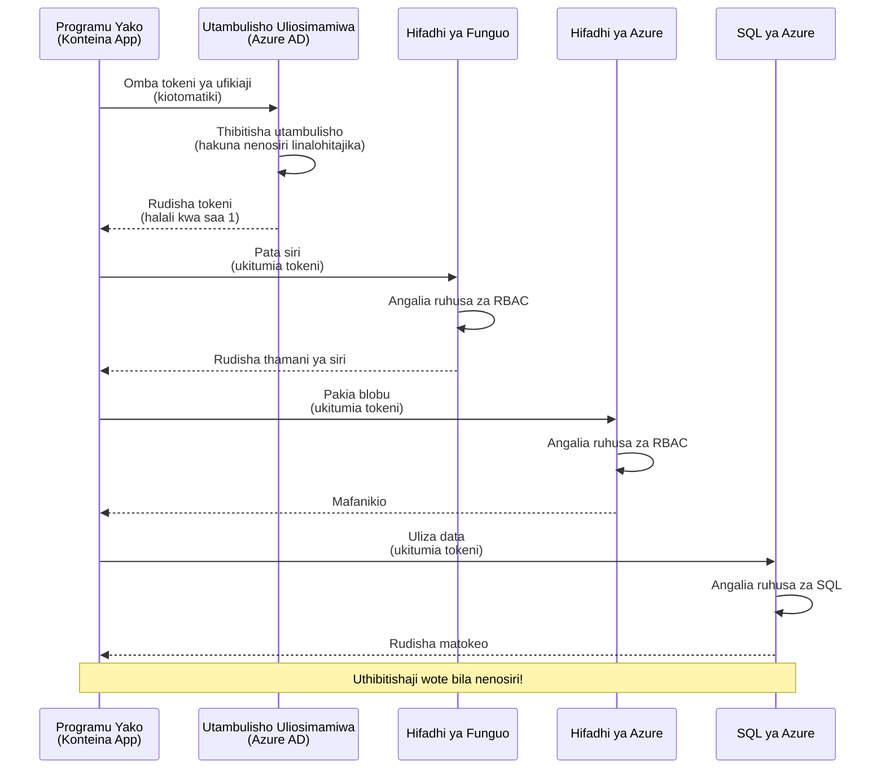
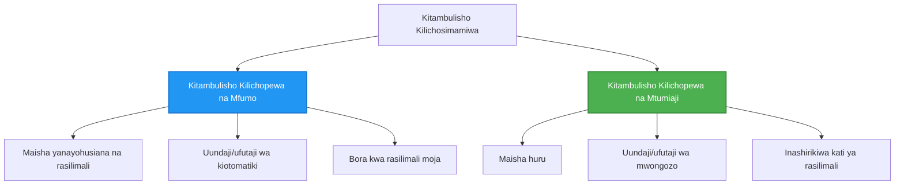

<!--
CO_OP_TRANSLATOR_METADATA:
{
  "original_hash": "e13ff6e1197e0a7462ed0aede7df9f23",
  "translation_date": "2025-11-23T13:19:22+00:00",
  "source_file": "docs/getting-started/authsecurity.md",
  "language_code": "sw"
}
-->
# Mifumo ya Uthibitishaji na Utambulisho Ulioendeshwa

⏱️ **Muda Unaokadiriwa**: Dakika 45-60 | 💰 **Athari ya Gharama**: Bure (hakuna gharama za ziada) | ⭐ **Ugumu**: Kati

**📚 Njia ya Kujifunza:**
- ← Awali: [Usimamizi wa Usanidi](configuration.md) - Kusimamia vigezo vya mazingira na siri
- 🎯 **Upo Hapa**: Uthibitishaji & Usalama (Utambulisho Ulioendeshwa, Key Vault, mifumo salama)
- → Ifuatayo: [Mradi wa Kwanza](first-project.md) - Jenga programu yako ya kwanza ya AZD
- 🏠 [Mwanzo wa Kozi](../../README.md)

---

## Utakayojifunza

Kwa kukamilisha somo hili, utaweza:
- Kuelewa mifumo ya uthibitishaji ya Azure (funguo, nyuzi za muunganisho, utambulisho ulioendeshwa)
- Kutekeleza **Utambulisho Ulioendeshwa** kwa uthibitishaji bila nywila
- Kulinda siri kwa ushirikiano wa **Azure Key Vault**
- Kusimamia **udhibiti wa ufikiaji wa msingi wa majukumu (RBAC)** kwa utekelezaji wa AZD
- Kutumia mbinu bora za usalama katika Programu za Kontena na huduma za Azure
- Kuhamisha kutoka uthibitishaji wa msingi wa funguo hadi wa msingi wa utambulisho

## Kwa Nini Utambulisho Ulioendeshwa Ni Muhimu

### Tatizo: Uthibitishaji wa Kawaida

**Kabla ya Utambulisho Ulioendeshwa:**
```javascript
// ❌ HATARI YA USALAMA: Siri zilizowekwa moja kwa moja kwenye msimbo
const connectionString = "Server=mydb.database.windows.net;User=admin;Password=P@ssw0rd123";
const storageKey = "xK7mN9pQ2wR5tY8uI0oP3aS6dF1gH4jK...";
const cosmosKey = "C2x7B9n4M1p8Q5w3E6r0T2y5U8i1O4p7...";
```

**Matatizo:**
- 🔴 **Siri zilizowekwa wazi** kwenye msimbo, faili za usanidi, vigezo vya mazingira
- 🔴 **Mzunguko wa nywila** unahitaji mabadiliko ya msimbo na utekelezaji upya
- 🔴 **Ndoto za ukaguzi** - nani alifikia nini, lini?
- 🔴 **Usambazaji** - siri zimetawanyika kwenye mifumo mingi
- 🔴 **Hatari za kufuata sheria** - kushindwa kufuata ukaguzi wa usalama

### Suluhisho: Utambulisho Ulioendeshwa

**Baada ya Utambulisho Ulioendeshwa:**
```javascript
// ✅ SALAMA: Hakuna siri kwenye msimbo
const credential = new DefaultAzureCredential();
const client = new BlobServiceClient(
  "https://mystorageaccount.blob.core.windows.net",
  credential  // Azure hushughulikia uthibitisho kiotomatiki
);
```

**Faida:**
- ✅ **Hakuna siri** kwenye msimbo au usanidi
- ✅ **Mzunguko wa kiotomatiki** - Azure inashughulikia
- ✅ **Njia kamili ya ukaguzi** kwenye kumbukumbu za Azure AD
- ✅ **Usalama wa kati** - simamia kwenye Azure Portal
- ✅ **Tayari kwa kufuata sheria** - inakidhi viwango vya usalama

**Mfano**: Uthibitishaji wa kawaida ni kama kubeba funguo nyingi za milango tofauti. Utambulisho Ulioendeshwa ni kama kuwa na kitambulisho cha usalama kinachokupa ufikiaji kiotomatiki kulingana na wewe ni nani—hakuna funguo za kupoteza, kunakili, au kubadilisha.

---

## Muhtasari wa Miundombinu

### Mtiririko wa Uthibitishaji na Utambulisho Ulioendeshwa


### Aina za Utambulisho Ulioendeshwa


| Kipengele | Kilichopewa Mfumo | Kilichopewa Mtumiaji |
|-----------|-------------------|---------------------|
| **Mzunguko wa Maisha** | Kimefungwa na rasilimali | Huru |
| **Uundaji** | Kiotomatiki na rasilimali | Uundaji wa mwongozo |
| **Ufutaji** | Hufutwa na rasilimali | Hubaki baada ya kufutwa kwa rasilimali |
| **Kushirikiana** | Rasilimali moja tu | Rasilimali nyingi |
| **Matumizi** | Matukio rahisi | Matukio magumu ya rasilimali nyingi |
| **Chaguo la AZD** | ✅ Inapendekezwa | Hiari |

---

## Mahitaji ya Awali

### Vifaa Vinavyohitajika

Unapaswa kuwa tayari na haya yamewekwa kutoka masomo ya awali:

```bash
# Thibitisha Azure Developer CLI
azd version
# ✅ Inatarajiwa: azd toleo 1.0.0 au juu

# Thibitisha Azure CLI
az --version
# ✅ Inatarajiwa: azure-cli 2.50.0 au juu
```

### Mahitaji ya Azure

- Usajili wa Azure ulio hai
- Ruhusa za:
  - Kuunda utambulisho ulioendeshwa
  - Kuteua majukumu ya RBAC
  - Kuunda rasilimali za Key Vault
  - Kuweka Programu za Kontena

### Maarifa ya Awali

Unapaswa kuwa umekamilisha:
- [Mwongozo wa Ufungaji](installation.md) - Usanidi wa AZD
- [Misingi ya AZD](azd-basics.md) - Dhana za msingi
- [Usimamizi wa Usanidi](configuration.md) - Vigezo vya mazingira

---

## Somo la 1: Kuelewa Mifumo ya Uthibitishaji

### Mfano 1: Nyuzi za Muunganisho (Zamani - Epuka)

**Jinsi inavyofanya kazi:**
```bash
# Mstari wa muunganisho una maelezo ya kuingia
STORAGE_CONNECTION_STRING="DefaultEndpointsProtocol=https;AccountName=myaccount;AccountKey=xK7mN9pQ2wR5..."
COSMOS_CONNECTION_STRING="AccountEndpoint=https://myaccount.documents.azure.com:443/;AccountKey=C2x7..."
SQL_CONNECTION_STRING="Server=myserver.database.windows.net;User=admin;Password=P@ssw0rd..."
```

**Matatizo:**
- ❌ Siri zinaonekana kwenye vigezo vya mazingira
- ❌ Zimeingia kwenye mifumo ya utekelezaji
- ❌ Ngumu kubadilisha
- ❌ Hakuna njia ya ukaguzi wa ufikiaji

**Wakati wa kutumia:** Kwa maendeleo ya ndani tu, kamwe si kwa uzalishaji.

---

### Mfano 2: Marejeleo ya Key Vault (Bora)

**Jinsi inavyofanya kazi:**
```bicep
// Store secret in Key Vault
resource keyVault 'Microsoft.KeyVault/vaults@2023-02-01' = {
  name: 'mykv'
  properties: {
    enableRbacAuthorization: true
  }
}

// Reference in Container App
env: [
  {
    name: 'STORAGE_KEY'
    secretRef: 'storage-key'  // References Key Vault
  }
]
```

**Faida:**
- ✅ Siri zimehifadhiwa salama kwenye Key Vault
- ✅ Usimamizi wa siri wa kati
- ✅ Mzunguko bila mabadiliko ya msimbo

**Mapungufu:**
- ⚠️ Bado unatumia funguo/nywila
- ⚠️ Unahitaji kusimamia ufikiaji wa Key Vault

**Wakati wa kutumia:** Hatua ya mpito kutoka nyuzi za muunganisho hadi utambulisho ulioendeshwa.

---

### Mfano 3: Utambulisho Ulioendeshwa (Mbinu Bora)

**Jinsi inavyofanya kazi:**
```bicep
// Enable managed identity
resource containerApp 'Microsoft.App/containerApps@2023-05-01' = {
  name: 'myapp'
  identity: {
    type: 'SystemAssigned'  // Automatically creates identity
  }
}

// Grant permissions
resource roleAssignment 'Microsoft.Authorization/roleAssignments@2022-04-01' = {
  scope: storageAccount
  properties: {
    roleDefinitionId: storageBlobDataContributorRole
    principalId: containerApp.identity.principalId
  }
}
```

**Msimbo wa programu:**
```javascript
// Hakuna siri zinazohitajika!
const { DefaultAzureCredential } = require('@azure/identity');
const { BlobServiceClient } = require('@azure/storage-blob');

const credential = new DefaultAzureCredential();
const blobServiceClient = new BlobServiceClient(
  'https://mystorageaccount.blob.core.windows.net',
  credential
);
```

**Faida:**
- ✅ Hakuna siri kwenye msimbo/usanidi
- ✅ Mzunguko wa kiotomatiki wa sifa
- ✅ Njia kamili ya ukaguzi
- ✅ Ruhusa za msingi wa RBAC
- ✅ Tayari kwa kufuata sheria

**Wakati wa kutumia:** Kila wakati, kwa programu za uzalishaji.

---

## Somo la 2: Kutekeleza Utambulisho Ulioendeshwa na AZD

### Hatua kwa Hatua

Tujenge Programu ya Kontena salama inayotumia utambulisho ulioendeshwa kufikia Hifadhi ya Azure na Key Vault.

### Muundo wa Mradi

```
secure-app/
├── azure.yaml                 # AZD configuration
├── infra/
│   ├── main.bicep            # Main infrastructure
│   ├── core/
│   │   ├── identity.bicep    # Managed identity setup
│   │   ├── keyvault.bicep    # Key Vault configuration
│   │   └── storage.bicep     # Storage with RBAC
│   └── app/
│       └── container-app.bicep
└── src/
    ├── app.js                # Application code
    ├── package.json
    └── Dockerfile
```

### 1. Sanidi AZD (azure.yaml)

```yaml
name: secure-app
metadata:
  template: secure-app@1.0.0

services:
  api:
    project: ./src
    language: js
    host: containerapp

# Enable managed identity (AZD handles this automatically)
```

### 2. Miundombinu: Washa Utambulisho Ulioendeshwa

**Faili: `infra/main.bicep`**

```bicep
targetScope = 'subscription'

param environmentName string
param location string = 'eastus'

var tags = { 'azd-env-name': environmentName }

// Resource group
resource rg 'Microsoft.Resources/resourceGroups@2021-04-01' = {
  name: 'rg-${environmentName}'
  location: location
  tags: tags
}

// Storage Account
module storage './core/storage.bicep' = {
  name: 'storage'
  scope: rg
  params: {
    name: 'st${uniqueString(rg.id)}'
    location: location
    tags: tags
  }
}

// Key Vault
module keyVault './core/keyvault.bicep' = {
  name: 'keyvault'
  scope: rg
  params: {
    name: 'kv-${uniqueString(rg.id)}'
    location: location
    tags: tags
  }
}

// Container App with Managed Identity
module containerApp './app/container-app.bicep' = {
  name: 'container-app'
  scope: rg
  params: {
    name: 'ca-${environmentName}'
    location: location
    tags: tags
    storageAccountName: storage.outputs.name
    keyVaultName: keyVault.outputs.name
  }
}

// Grant Container App access to Storage
module storageRoleAssignment './core/role-assignment.bicep' = {
  name: 'storage-role'
  scope: rg
  params: {
    principalId: containerApp.outputs.identityPrincipalId
    roleDefinitionId: 'ba92f5b4-2d11-453d-a403-e96b0029c9fe'  // Storage Blob Data Contributor
    targetResourceId: storage.outputs.id
  }
}

// Grant Container App access to Key Vault
module kvRoleAssignment './core/role-assignment.bicep' = {
  name: 'kv-role'
  scope: rg
  params: {
    principalId: containerApp.outputs.identityPrincipalId
    roleDefinitionId: '4633458b-17de-408a-b874-0445c86b69e6'  // Key Vault Secrets User
    targetResourceId: keyVault.outputs.id
  }
}

// Outputs
output AZURE_STORAGE_ACCOUNT_NAME string = storage.outputs.name
output AZURE_KEY_VAULT_NAME string = keyVault.outputs.name
output APP_URL string = containerApp.outputs.url
```

### 3. Programu ya Kontena na Utambulisho wa Mfumo

**Faili: `infra/app/container-app.bicep`**

```bicep
param name string
param location string
param tags object = {}
param storageAccountName string
param keyVaultName string

resource containerApp 'Microsoft.App/containerApps@2023-05-01' = {
  name: name
  location: location
  tags: tags
  identity: {
    type: 'SystemAssigned'  // 🔑 Enable managed identity
  }
  properties: {
    configuration: {
      ingress: {
        external: true
        targetPort: 3000
      }
    }
    template: {
      containers: [
        {
          name: 'api'
          image: 'myregistry.azurecr.io/api:latest'
          resources: {
            cpu: json('0.5')
            memory: '1Gi'
          }
          env: [
            {
              name: 'AZURE_STORAGE_ACCOUNT_NAME'
              value: storageAccountName
            }
            {
              name: 'AZURE_KEY_VAULT_NAME'
              value: keyVaultName
            }
            // 🔑 No secrets - managed identity handles authentication!
          ]
        }
      ]
    }
  }
}

// Output the identity for RBAC assignments
output identityPrincipalId string = containerApp.identity.principalId
output id string = containerApp.id
output url string = 'https://${containerApp.properties.configuration.ingress.fqdn}'
```

### 4. Moduli ya Kuteua Majukumu ya RBAC

**Faili: `infra/core/role-assignment.bicep`**

```bicep
param principalId string
param roleDefinitionId string  // Azure built-in role ID
param targetResourceId string

resource roleAssignment 'Microsoft.Authorization/roleAssignments@2022-04-01' = {
  name: guid(principalId, roleDefinitionId, targetResourceId)
  scope: resourceId('Microsoft.Resources/resourceGroups', resourceGroup().name)
  properties: {
    roleDefinitionId: subscriptionResourceId('Microsoft.Authorization/roleDefinitions', roleDefinitionId)
    principalId: principalId
    principalType: 'ServicePrincipal'
  }
}

output id string = roleAssignment.id
```

### 5. Msimbo wa Programu na Utambulisho Ulioendeshwa

**Faili: `src/app.js`**

```javascript
const express = require('express');
const { DefaultAzureCredential } = require('@azure/identity');
const { BlobServiceClient } = require('@azure/storage-blob');
const { SecretClient } = require('@azure/keyvault-secrets');

const app = express();
const PORT = process.env.PORT || 3000;

// 🔑 Anzisha kitambulisho (inafanya kazi kiotomatiki na utambulisho uliosimamiwa)
const credential = new DefaultAzureCredential();

// Usanidi wa Hifadhi ya Azure
const storageAccountName = process.env.AZURE_STORAGE_ACCOUNT_NAME;
const blobServiceClient = new BlobServiceClient(
  `https://${storageAccountName}.blob.core.windows.net`,
  credential  // Hakuna funguo zinazohitajika!
);

// Usanidi wa Hifadhi ya Funguo
const keyVaultName = process.env.AZURE_KEY_VAULT_NAME;
const secretClient = new SecretClient(
  `https://${keyVaultName}.vault.azure.net`,
  credential  // Hakuna funguo zinazohitajika!
);

// Ukaguzi wa afya
app.get('/health', (req, res) => {
  res.json({ status: 'healthy', authentication: 'managed-identity' });
});

// Pakia faili kwenye hifadhi ya blob
app.post('/upload', async (req, res) => {
  try {
    const containerClient = blobServiceClient.getContainerClient('uploads');
    await containerClient.createIfNotExists();
    
    const blobName = `file-${Date.now()}.txt`;
    const blockBlobClient = containerClient.getBlockBlobClient(blobName);
    
    await blockBlobClient.upload('Hello from managed identity!', 30);
    
    res.json({
      success: true,
      blobName: blobName,
      message: 'File uploaded using managed identity!'
    });
  } catch (error) {
    console.error('Upload error:', error);
    res.status(500).json({ error: error.message });
  }
});

// Pata siri kutoka Hifadhi ya Funguo
app.get('/secret/:name', async (req, res) => {
  try {
    const secretName = req.params.name;
    const secret = await secretClient.getSecret(secretName);
    
    res.json({
      name: secretName,
      value: secret.value,
      message: 'Secret retrieved using managed identity!'
    });
  } catch (error) {
    console.error('Secret error:', error);
    res.status(500).json({ error: error.message });
  }
});

// Orodhesha vyombo vya blob (inaonyesha ufikiaji wa kusoma)
app.get('/containers', async (req, res) => {
  try {
    const containers = [];
    for await (const container of blobServiceClient.listContainers()) {
      containers.push(container.name);
    }
    
    res.json({
      containers: containers,
      count: containers.length,
      message: 'Containers listed using managed identity!'
    });
  } catch (error) {
    console.error('List error:', error);
    res.status(500).json({ error: error.message });
  }
});

app.listen(PORT, () => {
  console.log(`Secure API listening on port ${PORT}`);
  console.log('Authentication: Managed Identity (passwordless)');
});
```

**Faili: `src/package.json`**

```json
{
  "name": "secure-app",
  "version": "1.0.0",
  "dependencies": {
    "express": "^4.18.2",
    "@azure/identity": "^4.0.0",
    "@azure/storage-blob": "^12.17.0",
    "@azure/keyvault-secrets": "^4.7.0"
  },
  "scripts": {
    "start": "node app.js"
  }
}
```

### 6. Tekeleza na Jaribu

```bash
# Anzisha mazingira ya AZD
azd init

# Weka miundombinu na programu
azd up

# Pata URL ya programu
APP_URL=$(azd env get-values | grep APP_URL | cut -d '=' -f2 | tr -d '"')

# Jaribu ukaguzi wa afya
curl $APP_URL/health
```

**✅ Matokeo Yanayotarajiwa:**
```json
{
  "status": "healthy",
  "authentication": "managed-identity"
}
```

**Jaribu kupakia faili:**
```bash
curl -X POST $APP_URL/upload
```

**✅ Matokeo Yanayotarajiwa:**
```json
{
  "success": true,
  "blobName": "file-1700404800000.txt",
  "message": "File uploaded using managed identity!"
}
```

**Jaribu orodha ya kontena:**
```bash
curl $APP_URL/containers
```

**✅ Matokeo Yanayotarajiwa:**
```json
{
  "containers": ["uploads"],
  "count": 1,
  "message": "Containers listed using managed identity!"
}
```

---

## Majukumu ya Kawaida ya Azure RBAC

### Vitambulisho vya Majukumu ya Ndani kwa Utambulisho Ulioendeshwa

| Huduma | Jina la Jukumu | Kitambulisho cha Jukumu | Ruhusa |
|--------|----------------|-------------------------|--------|
| **Hifadhi** | Msomaji wa Data ya Hifadhi ya Blob | `2a2b9908-6b94-4a3d-8e5a-a7d8f8cc8a12` | Soma blobs na kontena |
| **Hifadhi** | Mchangiaji wa Data ya Hifadhi ya Blob | `ba92f5b4-2d11-453d-a403-e96b0029c9fe` | Soma, andika, futa blobs |
| **Hifadhi** | Mchangiaji wa Data ya Foleni ya Hifadhi | `974c5e8b-45b9-4653-ba55-5f855dd0fb88` | Soma, andika, futa ujumbe wa foleni |
| **Key Vault** | Mtumiaji wa Siri za Key Vault | `4633458b-17de-408a-b874-0445c86b69e6` | Soma siri |
| **Key Vault** | Afisa wa Siri za Key Vault | `b86a8fe4-44ce-4948-aee5-eccb2c155cd7` | Soma, andika, futa siri |
| **Cosmos DB** | Msomaji wa Data ya Cosmos DB | `00000000-0000-0000-0000-000000000001` | Soma data ya Cosmos DB |
| **Cosmos DB** | Mchangiaji wa Data ya Cosmos DB | `00000000-0000-0000-0000-000000000002` | Soma, andika data ya Cosmos DB |
| **Hifadhidata ya SQL** | Mchangiaji wa Hifadhidata ya SQL | `9b7fa17d-e63e-47b0-bb0a-15c516ac86ec` | Simamia hifadhidata za SQL |
| **Service Bus** | Mmiliki wa Data ya Azure Service Bus | `090c5cfd-751d-490a-894a-3ce6f1109419` | Tuma, pokea, simamia ujumbe |

### Jinsi ya Kupata Vitambulisho vya Majukumu

```bash
# Orodhesha majukumu yote ya ndani
az role definition list --query "[].{Name:roleName, ID:name}" --output table

# Tafuta jukumu maalum
az role definition list --query "[?contains(roleName, 'Storage Blob')].{Name:roleName, ID:name}" --output table

# Pata maelezo ya jukumu
az role definition list --name "Storage Blob Data Contributor"
```

---

## Mazoezi ya Vitendo

### Zoezi 1: Washa Utambulisho Ulioendeshwa kwa Programu Iliyo Kuwepo ⭐⭐ (Kati)

**Lengo**: Ongeza utambulisho ulioendeshwa kwa utekelezaji wa Programu ya Kontena iliyopo

**Hali**: Una Programu ya Kontena inayotumia nyuzi za muunganisho. Ibadilishe kuwa utambulisho ulioendeshwa.

**Sehemu ya Kuanza**: Programu ya Kontena yenye usanidi huu:

```bicep
// ❌ Current: Using connection string
env: [
  {
    name: 'STORAGE_CONNECTION_STRING'
    secretRef: 'storage-connection'
  }
]
```

**Hatua:**

1. **Washa utambulisho ulioendeshwa kwenye Bicep:**

```bicep
resource containerApp 'Microsoft.App/containerApps@2023-05-01' = {
  name: 'myapp'
  identity: {
    type: 'SystemAssigned'  // Add this
  }
  // ... rest of configuration
}
```

2. **Toa ufikiaji wa Hifadhi:**

```bicep
// Get storage account reference
resource storageAccount 'Microsoft.Storage/storageAccounts@2023-01-01' existing = {
  name: storageAccountName
}

// Assign role
resource roleAssignment 'Microsoft.Authorization/roleAssignments@2022-04-01' = {
  name: guid(containerApp.id, 'ba92f5b4-2d11-453d-a403-e96b0029c9fe', storageAccount.id)
  scope: storageAccount
  properties: {
    roleDefinitionId: subscriptionResourceId('Microsoft.Authorization/roleDefinitions', 'ba92f5b4-2d11-453d-a403-e96b0029c9fe')
    principalId: containerApp.identity.principalId
    principalType: 'ServicePrincipal'
  }
}
```

3. **Sasisha msimbo wa programu:**

**Kabla (nyuzi za muunganisho):**
```javascript
const { BlobServiceClient } = require('@azure/storage-blob');

const blobServiceClient = BlobServiceClient.fromConnectionString(
  process.env.STORAGE_CONNECTION_STRING
);
```

**Baada (utambulisho ulioendeshwa):**
```javascript
const { DefaultAzureCredential } = require('@azure/identity');
const { BlobServiceClient } = require('@azure/storage-blob');

const credential = new DefaultAzureCredential();
const blobServiceClient = new BlobServiceClient(
  `https://${process.env.STORAGE_ACCOUNT_NAME}.blob.core.windows.net`,
  credential
);
```

4. **Sasisha vigezo vya mazingira:**

```bicep
env: [
  {
    name: 'STORAGE_ACCOUNT_NAME'
    value: storageAccountName  // Just the name, no secrets!
  }
  // Remove STORAGE_CONNECTION_STRING
]
```

5. **Tekeleza na jaribu:**

```bash
# Tuma tena
azd up

# Jaribu kama bado inafanya kazi
curl https://myapp.azurecontainerapps.io/upload
```

**✅ Vigezo vya Mafanikio:**
- ✅ Programu inatekelezwa bila makosa
- ✅ Operesheni za hifadhi zinafanya kazi (kupakia, kuorodhesha, kupakua)
- ✅ Hakuna nyuzi za muunganisho kwenye vigezo vya mazingira
- ✅ Utambulisho unaonekana kwenye Azure Portal chini ya sehemu ya "Identity"

**Uthibitisho:**

```bash
# Angalia utambulisho uliosimamiwa umewezeshwa
az containerapp show \
  --name myapp \
  --resource-group rg-myapp \
  --query "identity.type"
# ✅ Inatarajiwa: "SystemAssigned"

# Angalia ugawaji wa jukumu
az role assignment list \
  --assignee $(az containerapp show --name myapp --resource-group rg-myapp --query "identity.principalId" -o tsv) \
  --scope /subscriptions/{sub-id}/resourceGroups/rg-myapp/providers/Microsoft.Storage/storageAccounts/mystorageaccount
# ✅ Inatarajiwa: Inaonyesha jukumu la "Storage Blob Data Contributor"
```

**Muda**: Dakika 20-30

---

### Zoezi 2: Ufikiaji wa Huduma Nyingi na Utambulisho Uliopewa Mtumiaji ⭐⭐⭐ (Juu)

**Lengo**: Unda utambulisho uliopewa mtumiaji unaoshirikiwa kati ya Programu nyingi za Kontena

**Hali**: Una huduma ndogo 3 ambazo zote zinahitaji kufikia akaunti sawa ya Hifadhi na Key Vault.

**Hatua:**

1. **Unda utambulisho uliopewa mtumiaji:**

**Faili: `infra/core/identity.bicep`**

```bicep
param name string
param location string
param tags object = {}

resource userAssignedIdentity 'Microsoft.ManagedIdentity/userAssignedIdentities@2023-01-31' = {
  name: name
  location: location
  tags: tags
}

output id string = userAssignedIdentity.id
output principalId string = userAssignedIdentity.properties.principalId
output clientId string = userAssignedIdentity.properties.clientId
```

2. **Teua majukumu kwa utambulisho uliopewa mtumiaji:**

```bicep
// In main.bicep
module userIdentity './core/identity.bicep' = {
  name: 'user-identity'
  scope: rg
  params: {
    name: 'id-${environmentName}'
    location: location
    tags: tags
  }
}

// Grant Storage access
resource storageRoleAssignment 'Microsoft.Authorization/roleAssignments@2022-04-01' = {
  name: guid(userIdentity.outputs.principalId, 'storage-contributor')
  scope: storageAccount
  properties: {
    roleDefinitionId: subscriptionResourceId('Microsoft.Authorization/roleDefinitions', 'ba92f5b4-2d11-453d-a403-e96b0029c9fe')
    principalId: userIdentity.outputs.principalId
    principalType: 'ServicePrincipal'
  }
}

// Grant Key Vault access
resource kvRoleAssignment 'Microsoft.Authorization/roleAssignments@2022-04-01' = {
  name: guid(userIdentity.outputs.principalId, 'kv-secrets-user')
  scope: keyVault
  properties: {
    roleDefinitionId: subscriptionResourceId('Microsoft.Authorization/roleDefinitions', '4633458b-17de-408a-b874-0445c86b69e6')
    principalId: userIdentity.outputs.principalId
    principalType: 'ServicePrincipal'
  }
}
```

3. **Teua utambulisho kwa Programu nyingi za Kontena:**

```bicep
resource apiGateway 'Microsoft.App/containerApps@2023-05-01' = {
  name: 'api-gateway'
  identity: {
    type: 'UserAssigned'
    userAssignedIdentities: {
      '${userIdentity.outputs.id}': {}
    }
  }
  // ... rest of config
}

resource productService 'Microsoft.App/containerApps@2023-05-01' = {
  name: 'product-service'
  identity: {
    type: 'UserAssigned'
    userAssignedIdentities: {
      '${userIdentity.outputs.id}': {}
    }
  }
  // ... rest of config
}

resource orderService 'Microsoft.App/containerApps@2023-05-01' = {
  name: 'order-service'
  identity: {
    type: 'UserAssigned'
    userAssignedIdentities: {
      '${userIdentity.outputs.id}': {}
    }
  }
  // ... rest of config
}
```

4. **Msimbo wa programu (huduma zote hutumia muundo sawa):**

```javascript
const { DefaultAzureCredential, ManagedIdentityCredential } = require('@azure/identity');

// Kwa kitambulisho kilichopewa na mtumiaji, taja kitambulisho cha mteja
const credential = new ManagedIdentityCredential(
  process.env.AZURE_CLIENT_ID  // Kitambulisho cha mteja kilichopewa na mtumiaji
);

// Au tumia DefaultAzureCredential (inagundua kiotomatiki)
const credential = new DefaultAzureCredential();

const blobServiceClient = new BlobServiceClient(
  `https://${process.env.STORAGE_ACCOUNT_NAME}.blob.core.windows.net`,
  credential
);
```

5. **Tekeleza na thibitisha:**

```bash
azd up

# Jaribu huduma zote zinaweza kufikia hifadhi
curl https://api-gateway.azurecontainerapps.io/upload
curl https://product-service.azurecontainerapps.io/upload
curl https://order-service.azurecontainerapps.io/upload
```

**✅ Vigezo vya Mafanikio:**
- ✅ Utambulisho mmoja unashirikiwa kati ya huduma 3
- ✅ Huduma zote zinaweza kufikia Hifadhi na Key Vault
- ✅ Utambulisho hubaki hata ukifuta huduma moja
- ✅ Usimamizi wa ruhusa wa kati

**Faida za Utambulisho Uliopewa Mtumiaji:**
- Utambulisho mmoja wa kusimamia
- Ruhusa thabiti kati ya huduma
- Hubaki hata baada ya kufutwa kwa huduma
- Bora kwa miundombinu changamano

**Muda**: Dakika 30-40

---

### Zoezi 3: Tekeleza Mzunguko wa Siri za Key Vault ⭐⭐⭐ (Juu)

**Lengo**: Hifadhi funguo za API za wahusika wa tatu kwenye Key Vault na uzifikie kwa kutumia utambulisho ulioendeshwa

**Hali**: Programu yako inahitaji kupiga API ya nje (OpenAI, Stripe, SendGrid) inayohitaji funguo za API.

**Hatua:**

1. **Unda Key Vault na RBAC:**

**Faili: `infra/core/keyvault.bicep`**

```bicep
param name string
param location string
param tags object = {}

resource keyVault 'Microsoft.KeyVault/vaults@2023-02-01' = {
  name: name
  location: location
  tags: tags
  properties: {
    enableRbacAuthorization: true  // Use RBAC instead of access policies
    sku: {
      family: 'A'
      name: 'standard'
    }
    tenantId: subscription().tenantId
    enableSoftDelete: true
    softDeleteRetentionInDays: 90
  }
}

// Allow Container App to read secrets
output id string = keyVault.id
output name string = keyVault.name
output uri string = keyVault.properties.vaultUri
```

2. **Hifadhi siri kwenye Key Vault:**

```bash
# Pata jina la Key Vault
KV_NAME=$(azd env get-values | grep AZURE_KEY_VAULT_NAME | cut -d '=' -f2 | tr -d '"')

# Hifadhi funguo za API za watu wa tatu
az keyvault secret set \
  --vault-name $KV_NAME \
  --name "OpenAI-ApiKey" \
  --value "sk-proj-xxxxxxxxxxxxx"

az keyvault secret set \
  --vault-name $KV_NAME \
  --name "Stripe-ApiKey" \
  --value "sk_live_xxxxxxxxxxxxx"

az keyvault secret set \
  --vault-name $KV_NAME \
  --name "SendGrid-ApiKey" \
  --value "SG.xxxxxxxxxxxxx"
```

3. **Msimbo wa programu wa kurejesha siri:**

**Faili: `src/config.js`**

```javascript
const { DefaultAzureCredential } = require('@azure/identity');
const { SecretClient } = require('@azure/keyvault-secrets');

class Config {
  constructor() {
    this.credential = new DefaultAzureCredential();
    this.secretClient = new SecretClient(
      `https://${process.env.AZURE_KEY_VAULT_NAME}.vault.azure.net`,
      this.credential
    );
    this.cache = {};
  }

  async getSecret(secretName) {
    // Angalia akiba kwanza
    if (this.cache[secretName]) {
      return this.cache[secretName];
    }

    try {
      const secret = await this.secretClient.getSecret(secretName);
      this.cache[secretName] = secret.value;
      console.log(`✅ Retrieved secret: ${secretName}`);
      return secret.value;
    } catch (error) {
      console.error(`❌ Failed to get secret ${secretName}:`, error.message);
      throw error;
    }
  }

  async getOpenAIKey() {
    return this.getSecret('OpenAI-ApiKey');
  }

  async getStripeKey() {
    return this.getSecret('Stripe-ApiKey');
  }

  async getSendGridKey() {
    return this.getSecret('SendGrid-ApiKey');
  }
}

module.exports = new Config();
```

4. **Tumia siri kwenye programu:**

**Faili: `src/app.js`**

```javascript
const express = require('express');
const config = require('./config');
const { OpenAI } = require('openai');

const app = express();

// Anzisha OpenAI na ufunguo kutoka kwa Hifadhi ya Funguo
let openaiClient;

async function initializeServices() {
  const openaiKey = await config.getOpenAIKey();
  openaiClient = new OpenAI({ apiKey: openaiKey });
  console.log('✅ Services initialized with secrets from Key Vault');
}

// Piga simu wakati wa kuanza
initializeServices().catch(console.error);

app.post('/chat', async (req, res) => {
  try {
    const completion = await openaiClient.chat.completions.create({
      model: 'gpt-4',
      messages: [{ role: 'user', content: 'Hello!' }]
    });
    
    res.json({
      response: completion.choices[0].message.content,
      authentication: 'Key from Key Vault via Managed Identity'
    });
  } catch (error) {
    res.status(500).json({ error: error.message });
  }
});

app.listen(3000, () => {
  console.log('Secure API with Key Vault integration running');
});
```

5. **Tekeleza na jaribu:**

```bash
azd up

# Jaribu kwamba funguo za API zinafanya kazi
curl -X POST https://myapp.azurecontainerapps.io/chat \
  -H "Content-Type: application/json" \
  -d '{"message":"Hello AI"}'
```

**✅ Vigezo vya Mafanikio:**
- ✅ Hakuna funguo za API kwenye msimbo au vigezo vya mazingira
- ✅ Programu inarejesha funguo kutoka Key Vault
- ✅ API za wahusika wa tatu zinafanya kazi ipasavyo
- ✅ Unaweza kubadilisha funguo bila mabadiliko ya msimbo

**Badilisha siri:**

```bash
# Sasisha siri katika Key Vault
az keyvault secret set \
  --vault-name $KV_NAME \
  --name "OpenAI-ApiKey" \
  --value "sk-proj-NEW_KEY_HERE"

# Anzisha upya programu ili kuchukua ufunguo mpya
az containerapp revision restart \
  --name myapp \
  --resource-group rg-myapp
```

**Muda**: Dakika 25-35

---

## Kituo cha Maarifa

### 1. Mifumo ya Uthibitishaji ✓

Jaribu uelewa wako:

- [ ] **Q1**: Ni mifumo mitatu kuu ya uthibitishaji? 
  - **A**: Nyuzi za muunganisho (zamani), marejeleo ya Key Vault (mpito), Utambulisho Ulioendeshwa (bora)

- [ ] **Q2**: Kwa nini utambulisho ulioendeshwa ni bora kuliko nyuzi za muunganisho?
  - **A**: Hakuna siri kwenye msimbo, mzunguko wa kiotomatiki, njia kamili ya ukaguzi, ruhusa za RBAC

- [ ] **Q3**: Ni lini utatumia utambulisho uliopewa mtumiaji badala ya uliopewa mfumo?
  - **A**: Wakati wa kushirikiana utambulisho kati ya rasilimali nyingi au wakati mzunguko wa maisha ya utambulisho ni huru na rasilimali

**Uthibitisho wa Vitendo:**
```bash
# Angalia aina gani ya utambulisho programu yako inatumia
az containerapp show \
  --name myapp \
  --resource-group rg-myapp \
  --query "identity.type"

# Orodhesha majukumu yote yaliyotolewa kwa utambulisho
az role assignment list \
  --assignee $(az containerapp show --name myapp --resource-group rg-myapp --query "identity.principalId" -o tsv)
```

---

### 2. RBAC na Ruhusa ✓

Jaribu uelewa wako:

- [ ] **Q1**: Kitambulisho cha jukumu la "Mchangiaji wa Data ya Hifadhi ya Blob" ni nini?
  - **A**: `ba92f5b4-2d11-453d-a403-e96b0029c9fe`

- [ ] **Q2**: "Mtumiaji wa Siri za Key Vault" anatoa ruhusa gani?
  - **A**: Ufikiaji wa kusoma tu kwa siri (hawezi kuunda, kusasisha, au kufuta)

- [ ] **Q3**: Unafanyaje Programu ya Kontena kufikia Azure SQL?
  - **A**: Teua jukumu la "Mchangiaji wa SQL DB" au usanidi uthibitishaji wa Azure AD kwa SQL

**Uthibitisho wa Vitendo:**
```bash
# Tafuta jukumu maalum
az role definition list --name "Storage Blob Data Contributor"

# Angalia ni majukumu gani yamepewa utambulisho wako
PRINCIPAL_ID=$(az containerapp show --name myapp --resource-group rg-myapp --query "identity.principalId" -o tsv)
az role assignment list --assignee $PRINCIPAL_ID --output table
```

---

### 3. Ushirikiano wa Key Vault ✓

Jaribu uelewa wako:
- [ ] **Q1**: Je, unawashaje RBAC kwa Key Vault badala ya sera za ufikiaji?
  - **A**: Weka `enableRbacAuthorization: true` katika Bicep

- [ ] **Q2**: Ni maktaba gani ya Azure SDK inayoshughulikia uthibitisho wa managed identity?
  - **A**: `@azure/identity` na darasa la `DefaultAzureCredential`

- [ ] **Q3**: Siri za Key Vault zinakaa muda gani kwenye cache?
  - **A**: Inategemea programu; tekeleza mkakati wako wa cache

**Uthibitisho wa Vitendo:**
```bash
# Jaribu ufikiaji wa Key Vault
az keyvault secret show \
  --vault-name $KV_NAME \
  --name "OpenAI-ApiKey" \
  --query "value"

# Hakikisha RBAC imewezeshwa
az keyvault show \
  --name $KV_NAME \
  --query "properties.enableRbacAuthorization"
# ✅ Inatarajiwa: kweli
```

---

## Mazoezi Bora ya Usalama

### ✅ FANYA:

1. **Tumia managed identity kila mara katika uzalishaji**
   ```bicep
   identity: {
     type: 'SystemAssigned'
   }
   ```

2. **Tumia majukumu ya RBAC yenye ruhusa ndogo**
   - Tumia majukumu ya "Reader" inapowezekana
   - Epuka "Owner" au "Contributor" isipokuwa ni lazima

3. **Hifadhi funguo za watu wa tatu katika Key Vault**
   ```javascript
   const apiKey = await secretClient.getSecret('ThirdPartyApiKey');
   ```

4. **Washaje ukaguzi wa kumbukumbu**
   ```bicep
   diagnosticSettings: {
     logs: [{ category: 'AuditEvent', enabled: true }]
   }
   ```

5. **Tumia vitambulisho tofauti kwa dev/staging/prod**
   ```bash
   azd env new dev
   azd env new staging
   azd env new prod
   ```

6. **Geuza siri mara kwa mara**
   - Weka tarehe za kumalizika kwa siri za Key Vault
   - Automate mzunguko kwa kutumia Azure Functions

### ❌ USIFANYE:

1. **Usiwahi kuweka siri moja kwa moja kwenye msimbo**
   ```javascript
   // ❌ MBAYA
   const apiKey = "sk-proj-xxxxxxxxxxxxx";
   ```

2. **Usitumie connection strings katika uzalishaji**
   ```javascript
   // ❌ MBAYA
   BlobServiceClient.fromConnectionString(process.env.STORAGE_CONNECTION_STRING)
   ```

3. **Usipe ruhusa nyingi kupita kiasi**
   ```bicep
   // ❌ BAD - too much access
   roleDefinitionId: 'Owner'
   
   // ✅ GOOD - least privilege
   roleDefinitionId: 'Storage Blob Data Reader'
   ```

4. **Usirekodi siri**
   ```javascript
   // ❌ MBAYA
   console.log('API Key:', apiKey);
   
   // ✅ NZURI
   console.log('API Key retrieved successfully');
   ```

5. **Usishiriki vitambulisho vya uzalishaji kati ya mazingira**
   ```bicep
   // ❌ BAD - same identity for dev and prod
   // ✅ GOOD - separate identities per environment
   ```

---

## Mwongozo wa Kutatua Matatizo

### Tatizo: "Unauthorized" wakati wa kufikia Azure Storage

**Dalili:**
```
Error: Unauthorized (403)
AuthorizationPermissionMismatch: This request is not authorized to perform this operation
```

**Uchunguzi:**

```bash
# Angalia kama kitambulisho kilichosimamiwa kimewezeshwa
az containerapp show \
  --name myapp \
  --resource-group rg-myapp \
  --query "identity.type"
# ✅ Inatarajiwa: "SystemAssigned" au "UserAssigned"

# Angalia mgawanyo wa majukumu
PRINCIPAL_ID=$(az containerapp show --name myapp --resource-group rg-myapp --query "identity.principalId" -o tsv)
az role assignment list --assignee $PRINCIPAL_ID

# Inatarajiwa: Unapaswa kuona "Storage Blob Data Contributor" au jukumu linalofanana
```

**Suluhisho:**

1. **Peana jukumu sahihi la RBAC:**
```bash
STORAGE_ID=$(az storage account show --name mystorageaccount --resource-group rg-myapp --query "id" -o tsv)
az role assignment create \
  --assignee $PRINCIPAL_ID \
  --role "Storage Blob Data Contributor" \
  --scope $STORAGE_ID
```

2. **Subiri mabadiliko yaeneze (inaweza kuchukua dakika 5-10):**
```bash
# Angalia hali ya ugawaji wa jukumu
az role assignment list --assignee $PRINCIPAL_ID --scope $STORAGE_ID
```

3. **Hakikisha msimbo wa programu unatumia kitambulisho sahihi:**
```javascript
// Hakikisha unatumia DefaultAzureCredential
const credential = new DefaultAzureCredential();
```

---

### Tatizo: Ufikiaji wa Key Vault umekataliwa

**Dalili:**
```
Error: Forbidden (403)
The user, group or application does not have secrets get permission
```

**Uchunguzi:**

```bash
# Angalia RBAC ya Key Vault imewezeshwa
az keyvault show \
  --name $KV_NAME \
  --query "properties.enableRbacAuthorization"
# ✅ Inatarajiwa: kweli

# Angalia mgawanyo wa majukumu
az role assignment list \
  --assignee $PRINCIPAL_ID \
  --scope /subscriptions/{sub-id}/resourceGroups/rg-myapp/providers/Microsoft.KeyVault/vaults/$KV_NAME
```

**Suluhisho:**

1. **Washaje RBAC kwenye Key Vault:**
```bash
az keyvault update \
  --name $KV_NAME \
  --enable-rbac-authorization true
```

2. **Peana jukumu la Key Vault Secrets User:**
```bash
KV_ID=$(az keyvault show --name $KV_NAME --query "id" -o tsv)
az role assignment create \
  --assignee $PRINCIPAL_ID \
  --role "Key Vault Secrets User" \
  --scope $KV_ID
```

---

### Tatizo: DefaultAzureCredential inashindwa kufanya kazi ndani ya kompyuta ya ndani

**Dalili:**
```
Error: DefaultAzureCredential failed to retrieve a token
CredentialUnavailableError: No credential available
```

**Uchunguzi:**

```bash
# Angalia kama umeingia
az account show

# Angalia uthibitisho wa Azure CLI
az ad signed-in-user show
```

**Suluhisho:**

1. **Ingia kwenye Azure CLI:**
```bash
az login
```

2. **Weka usajili wa Azure:**
```bash
az account set --subscription "Your Subscription Name"
```

3. **Kwa maendeleo ya ndani, tumia vigezo vya mazingira:**
```bash
export AZURE_TENANT_ID="your-tenant-id"
export AZURE_CLIENT_ID="your-client-id"
export AZURE_CLIENT_SECRET="your-client-secret"
```

4. **Au tumia kitambulisho tofauti ndani ya kompyuta ya ndani:**
```javascript
const { DefaultAzureCredential, AzureCliCredential } = require('@azure/identity');

// Tumia AzureCliCredential kwa maendeleo ya ndani
const credential = process.env.NODE_ENV === 'production' 
  ? new DefaultAzureCredential()
  : new AzureCliCredential();
```

---

### Tatizo: Upeanaji wa jukumu unachukua muda mrefu kuenea

**Dalili:**
- Jukumu limepewa kwa mafanikio
- Bado unapata makosa ya 403
- Ufikiaji wa mara kwa mara (wakati mwingine unafanya kazi, wakati mwingine hauwezi)

**Maelezo:**
Mabadiliko ya RBAC ya Azure yanaweza kuchukua dakika 5-10 kuenea duniani.

**Suluhisho:**

```bash
# Subiri na jaribu tena
echo "Waiting for RBAC propagation..."
sleep 300  # Subiri dakika 5

# Jaribu ufikiaji
curl https://myapp.azurecontainerapps.io/upload

# Ikiwa bado inashindwa, anzisha upya programu
az containerapp revision restart \
  --name myapp \
  --resource-group rg-myapp
```

---

## Mazingatio ya Gharama

### Gharama za Managed Identity

| Rasilimali | Gharama |
|------------|---------|
| **Managed Identity** | 🆓 **BURE** - Hakuna malipo |
| **RBAC Role Assignments** | 🆓 **BURE** - Hakuna malipo |
| **Azure AD Token Requests** | 🆓 **BURE** - Imejumuishwa |
| **Key Vault Operations** | $0.03 kwa operesheni 10,000 |
| **Key Vault Storage** | $0.024 kwa siri kwa mwezi |

**Managed identity huokoa pesa kwa:**
- ✅ Kuondoa operesheni za Key Vault kwa uthibitisho wa huduma kwa huduma
- ✅ Kupunguza matukio ya usalama (hakuna vitambulisho vilivyovuja)
- ✅ Kupunguza mzigo wa kiutendaji (hakuna mzunguko wa mwongozo)

**Mfano wa Ulinganisho wa Gharama (kwa mwezi):**

| Hali | Connection Strings | Managed Identity | Akiba |
|------|--------------------|------------------|-------|
| Programu ndogo (maombi 1M) | ~$50 (Key Vault + ops) | ~$0 | $50/mwezi |
| Programu ya kati (maombi 10M) | ~$200 | ~$0 | $200/mwezi |
| Programu kubwa (maombi 100M) | ~$1,500 | ~$0 | $1,500/mwezi |

---

## Jifunze Zaidi

### Nyaraka Rasmi
- [Azure Managed Identity](https://learn.microsoft.com/entra/identity/managed-identities-azure-resources/overview)
- [Azure RBAC](https://learn.microsoft.com/azure/role-based-access-control/overview)
- [Azure Key Vault](https://learn.microsoft.com/azure/key-vault/general/overview)
- [DefaultAzureCredential](https://learn.microsoft.com/dotnet/api/azure.identity.defaultazurecredential)

### Nyaraka za SDK
- [@azure/identity (Node.js)](https://www.npmjs.com/package/@azure/identity)
- [Azure.Identity (C#)](https://www.nuget.org/packages/Azure.Identity/)
- [azure-identity (Python)](https://pypi.org/project/azure-identity/)

### Hatua Zifuatazo Katika Kozi Hii
- ← Awali: [Usimamizi wa Usanidi](configuration.md)
- → Ifuatayo: [Mradi wa Kwanza](first-project.md)
- 🏠 [Nyumbani kwa Kozi](../../README.md)

### Mifano Husika
- [Mfano wa Mazungumzo ya Azure OpenAI](../../../../examples/azure-openai-chat) - Inatumia managed identity kwa Azure OpenAI
- [Mfano wa Microservices](../../../../examples/microservices) - Mifumo ya uthibitisho wa huduma nyingi

---

## Muhtasari

**Umejifunza:**
- ✅ Mifumo mitatu ya uthibitisho (connection strings, Key Vault, managed identity)
- ✅ Jinsi ya kuwasha na kusanidi managed identity katika AZD
- ✅ Upeanaji wa majukumu ya RBAC kwa huduma za Azure
- ✅ Ushirikiano wa Key Vault kwa siri za watu wa tatu
- ✅ Vitambulisho vilivyotengwa na vilivyotolewa na mfumo
- ✅ Mazoezi bora ya usalama na utatuzi wa matatizo

**Mambo Muhimu ya Kuzingatia:**
1. **Tumia managed identity kila mara katika uzalishaji** - Hakuna siri, mzunguko wa kiotomatiki
2. **Tumia majukumu ya RBAC yenye ruhusa ndogo** - Peana ruhusa zinazohitajika tu
3. **Hifadhi funguo za watu wa tatu katika Key Vault** - Usimamizi wa siri ulio kati
4. **Tenganisha vitambulisho kwa kila mazingira** - Kutengwa kwa dev, staging, prod
5. **Washaje ukaguzi wa kumbukumbu** - Fuata nani alifikia nini

**Hatua Zifuatazo:**
1. Kamilisha mazoezi ya vitendo hapo juu
2. Hamisha programu iliyopo kutoka connection strings kwenda managed identity
3. Jenga mradi wako wa kwanza wa AZD ukiwa na usalama tangu mwanzo: [Mradi wa Kwanza](first-project.md)

---

<!-- CO-OP TRANSLATOR DISCLAIMER START -->
**Kanusho**:  
Hati hii imetafsiriwa kwa kutumia huduma ya tafsiri ya AI [Co-op Translator](https://github.com/Azure/co-op-translator). Ingawa tunajitahidi kwa usahihi, tafadhali fahamu kuwa tafsiri za kiotomatiki zinaweza kuwa na makosa au kutokuwa sahihi. Hati ya asili katika lugha yake ya awali inapaswa kuzingatiwa kama chanzo cha mamlaka. Kwa taarifa muhimu, tafsiri ya kitaalamu ya binadamu inapendekezwa. Hatutawajibika kwa kutoelewana au tafsiri zisizo sahihi zinazotokana na matumizi ya tafsiri hii.
<!-- CO-OP TRANSLATOR DISCLAIMER END -->