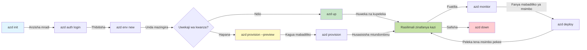
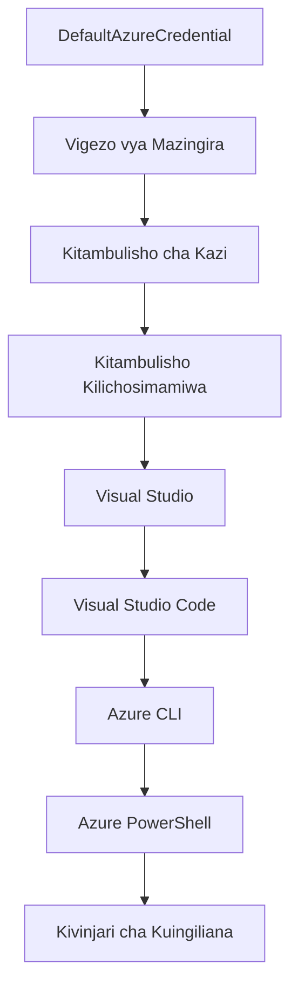

<!--
CO_OP_TRANSLATOR_METADATA:
{
  "original_hash": "e855e899d2705754fe85b04190edd0f0",
  "translation_date": "2025-11-23T10:00:09+00:00",
  "source_file": "docs/getting-started/azd-basics.md",
  "language_code": "sw"
}
-->
# AZD Msingi - Kuelewa Azure Developer CLI

# AZD Msingi - Dhana za Msingi na Misingi

**Ukurasa wa Sehemu:**
- **📚 Nyumbani kwa Kozi**: [AZD Kwa Wanaoanza](../../README.md)
- **📖 Sura ya Sasa**: Sura ya 1 - Msingi & Mwanzo wa Haraka
- **⬅️ Iliyopita**: [Muhtasari wa Kozi](../../README.md#-chapter-1-foundation--quick-start)
- **➡️ Inayofuata**: [Usakinishaji & Usanidi](installation.md)
- **🚀 Sura Inayofuata**: [Sura ya 2: Maendeleo ya AI-Kwanza](../microsoft-foundry/microsoft-foundry-integration.md)

## Utangulizi

Somo hili linakutambulisha kwa Azure Developer CLI (azd), zana yenye nguvu ya mstari wa amri inayoharakisha safari yako kutoka kwa maendeleo ya ndani hadi usambazaji wa Azure. Utajifunza dhana za msingi, vipengele vya msingi, na kuelewa jinsi azd inavyorahisisha usambazaji wa programu za wingu.

## Malengo ya Kujifunza

Mwisho wa somo hili, utaweza:
- Kuelewa Azure Developer CLI ni nini na madhumuni yake ya msingi
- Kujifunza dhana za msingi za templates, mazingira, na huduma
- Kuchunguza vipengele muhimu ikiwa ni pamoja na maendeleo yanayoendeshwa na templates na Miundombinu kama Kanuni
- Kuelewa muundo wa mradi wa azd na mtiririko wa kazi
- Kuwa tayari kusakinisha na kusanidi azd kwa mazingira yako ya maendeleo

## Matokeo ya Kujifunza

Baada ya kukamilisha somo hili, utaweza:
- Kuelezea jukumu la azd katika mtiririko wa kazi wa maendeleo ya wingu la kisasa
- Kutambua vipengele vya muundo wa mradi wa azd
- Kufafanua jinsi templates, mazingira, na huduma zinavyofanya kazi pamoja
- Kuelewa faida za Miundombinu kama Kanuni na azd
- Kutambua amri tofauti za azd na madhumuni yake

## Azure Developer CLI (azd) ni nini?

Azure Developer CLI (azd) ni zana ya mstari wa amri iliyoundwa kuharakisha safari yako kutoka kwa maendeleo ya ndani hadi usambazaji wa Azure. Inarahisisha mchakato wa kujenga, kusambaza, na kusimamia programu za wingu la Azure.

### 🎯 Kwa Nini Utumie AZD? Ulinganisho wa Ulimwengu Halisi

Tuchunguze kusambaza programu rahisi ya wavuti yenye hifadhidata:

#### ❌ BILA AZD: Usambazaji wa Azure wa Kawaida (dakika 30+)

```bash
# Hatua ya 1: Unda kikundi cha rasilimali
az group create --name myapp-rg --location eastus

# Hatua ya 2: Unda Mpango wa Huduma ya Programu
az appservice plan create --name myapp-plan \
  --resource-group myapp-rg \
  --sku B1 --is-linux

# Hatua ya 3: Unda Programu ya Wavuti
az webapp create --name myapp-web-unique123 \
  --resource-group myapp-rg \
  --plan myapp-plan \
  --runtime "NODE:18-lts"

# Hatua ya 4: Unda akaunti ya Cosmos DB (dakika 10-15)
az cosmosdb create --name myapp-cosmos-unique123 \
  --resource-group myapp-rg \
  --kind MongoDB

# Hatua ya 5: Unda hifadhidata
az cosmosdb mongodb database create \
  --account-name myapp-cosmos-unique123 \
  --resource-group myapp-rg \
  --name tododb

# Hatua ya 6: Unda mkusanyiko
az cosmosdb mongodb collection create \
  --account-name myapp-cosmos-unique123 \
  --resource-group myapp-rg \
  --database-name tododb \
  --name todos

# Hatua ya 7: Pata kamba ya muunganisho
CONN_STR=$(az cosmosdb keys list \
  --name myapp-cosmos-unique123 \
  --resource-group myapp-rg \
  --type connection-strings \
  --query "connectionStrings[0].connectionString" -o tsv)

# Hatua ya 8: Sanidi mipangilio ya programu
az webapp config appsettings set \
  --name myapp-web-unique123 \
  --resource-group myapp-rg \
  --settings MONGODB_URI="$CONN_STR"

# Hatua ya 9: Wezesha kumbukumbu
az webapp log config --name myapp-web-unique123 \
  --resource-group myapp-rg \
  --application-logging filesystem \
  --detailed-error-messages true

# Hatua ya 10: Sanidi Uelewa wa Maombi
az monitor app-insights component create \
  --app myapp-insights \
  --location eastus \
  --resource-group myapp-rg

# Hatua ya 11: Unganisha Uelewa wa Maombi na Programu ya Wavuti
INSTRUMENTATION_KEY=$(az monitor app-insights component show \
  --app myapp-insights \
  --resource-group myapp-rg \
  --query "instrumentationKey" -o tsv)

az webapp config appsettings set \
  --name myapp-web-unique123 \
  --resource-group myapp-rg \
  --settings APPINSIGHTS_INSTRUMENTATIONKEY="$INSTRUMENTATION_KEY"

# Hatua ya 12: Jenga programu ndani ya nchi
npm install
npm run build

# Hatua ya 13: Unda kifurushi cha upelekaji
zip -r app.zip . -x "*.git*" "node_modules/*"

# Hatua ya 14: Peleka programu
az webapp deployment source config-zip \
  --resource-group myapp-rg \
  --name myapp-web-unique123 \
  --src app.zip

# Hatua ya 15: Subiri na omba ifanye kazi 🙏
# (Hakuna uthibitisho wa kiotomatiki, majaribio ya mwongozo yanahitajika)
```

**Matatizo:**
- ❌ Amri 15+ za kukumbuka na kutekeleza kwa mpangilio
- ❌ Dakika 30-45 za kazi ya mikono
- ❌ Rahisi kufanya makosa (makosa ya herufi, vigezo visivyo sahihi)
- ❌ Mifumo ya muunganisho inaonekana katika historia ya terminal
- ❌ Hakuna kurudisha kiotomatiki ikiwa kitu kitashindwa
- ❌ Ngumu kurudia kwa wanachama wa timu
- ❌ Tofauti kila wakati (sio ya kurudiwa)

#### ✅ NA AZD: Usambazaji wa Kiotomatiki (amri 5, dakika 10-15)

```bash
# Hatua ya 1: Anzisha kutoka kwa kiolezo
azd init --template todo-nodejs-mongo

# Hatua ya 2: Thibitisha
azd auth login

# Hatua ya 3: Unda mazingira
azd env new dev

# Hatua ya 4: Angalia mabadiliko (hiari lakini inapendekezwa)
azd provision --preview

# Hatua ya 5: Peleka kila kitu
azd up

# ✨ Imekamilika! Kila kitu kimepelekwa, kimewekwa, na kinasimamiwa
```

**Faida:**
- ✅ **Amri 5** dhidi ya hatua 15+ za mikono
- ✅ **Dakika 10-15** muda wa jumla (zaidi ni kusubiri Azure)
- ✅ **Hakuna makosa** - kiotomatiki na kimejaribiwa
- ✅ **Siri zinadhibitiwa kwa usalama** kupitia Key Vault
- ✅ **Kurudisha kiotomatiki** kwa kushindwa
- ✅ **Inarudiwa kikamilifu** - matokeo sawa kila wakati
- ✅ **Timu tayari** - yeyote anaweza kusambaza kwa amri sawa
- ✅ **Miundombinu kama Kanuni** - templates za Bicep zinazodhibitiwa na toleo
- ✅ **Ufuatiliaji uliojengwa ndani** - Application Insights imewekwa kiotomatiki

### 📊 Kupunguza Muda & Makosa

| Kipimo | Usambazaji wa Kawaida | Usambazaji wa AZD | Uboreshaji |
|:-------|:----------------------|:------------------|:-----------|
| **Amri** | 15+ | 5 | 67% punguzo |
| **Muda** | Dakika 30-45 | Dakika 10-15 | 60% haraka |
| **Kiwango cha Makosa** | ~40% | <5% | 88% punguzo |
| **Uthabiti** | Chini (mikono) | 100% (kiotomatiki) | Kamili |
| **Kuingiza Timu** | Saa 2-4 | Dakika 30 | 75% haraka |
| **Muda wa Kurudisha** | Dakika 30+ (mikono) | Dakika 2 (kiotomatiki) | 93% haraka |

## Dhana za Msingi

### Templates
Templates ni msingi wa azd. Zinajumuisha:
- **Kanuni ya programu** - Kanuni yako ya chanzo na utegemezi
- **Ufafanuzi wa miundombinu** - Rasilimali za Azure zilizoainishwa katika Bicep au Terraform
- **Faili za usanidi** - Mipangilio na vigezo vya mazingira
- **Skripti za usambazaji** - Mtiririko wa kazi wa usambazaji wa kiotomatiki

### Mazingira
Mazingira yanawakilisha malengo tofauti ya usambazaji:
- **Maendeleo** - Kwa majaribio na maendeleo
- **Staging** - Mazingira ya kabla ya uzalishaji
- **Uzalishaji** - Mazingira ya uzalishaji wa moja kwa moja

Kila mazingira yanadumisha:
- Kikundi cha rasilimali za Azure
- Mipangilio ya usanidi
- Hali ya usambazaji

### Huduma
Huduma ni sehemu za kujenga za programu yako:
- **Frontend** - Programu za wavuti, SPAs
- **Backend** - APIs, huduma ndogo
- **Hifadhidata** - Suluhisho za uhifadhi wa data
- **Uhifadhi** - Uhifadhi wa faili na blob

## Vipengele Muhimu

### 1. Maendeleo Yanayoendeshwa na Templates
```bash
# Vinjari templeti zinazopatikana
azd template list

# Anzisha kutoka kwa templeti
azd init --template <template-name>
```

### 2. Miundombinu kama Kanuni
- **Bicep** - Lugha maalum ya Azure
- **Terraform** - Zana ya miundombinu ya wingu nyingi
- **ARM Templates** - Templates za Azure Resource Manager

### 3. Mtiririko wa Kazi Uliojumuishwa
```bash
# Kamilisha mtiririko wa kazi wa kupelekwa
azd up            # Kutoa + Kupeleka hii ni bila mikono kwa usanidi wa mara ya kwanza

# 🧪 MPYA: Onyesha mabadiliko ya miundombinu kabla ya kupelekwa (SALAMA)
azd provision --preview    # Simulia kupelekwa kwa miundombinu bila kufanya mabadiliko

azd provision     # Unda rasilimali za Azure ikiwa unasasisha miundombinu tumia hii
azd deploy        # Peleka msimbo wa programu au peleka tena msimbo wa programu mara moja sasisha
azd down          # Safisha rasilimali
```

#### 🛡️ Mipango Salama ya Miundombinu na Muhtasari
Amri ya `azd provision --preview` ni mabadiliko makubwa kwa usambazaji salama:
- **Uchambuzi wa majaribio** - Inaonyesha kitakachoundwa, kubadilishwa, au kufutwa
- **Hatari sifuri** - Hakuna mabadiliko halisi yanayofanywa kwa mazingira yako ya Azure
- **Ushirikiano wa timu** - Shiriki matokeo ya muhtasari kabla ya usambazaji
- **Makadirio ya gharama** - Elewa gharama za rasilimali kabla ya kujitolea

```bash
# Mfano wa mtiririko wa hakikisho
azd provision --preview           # Angalia kitakachobadilika
# Kagua matokeo, jadiliana na timu
azd provision                     # Tumia mabadiliko kwa ujasiri
```

### 📊 Picha: Mtiririko wa Kazi wa Maendeleo ya AZD


**Maelezo ya Mtiririko wa Kazi:**
1. **Init** - Anza na template au mradi mpya
2. **Auth** - Thibitisha na Azure
3. **Mazingira** - Unda mazingira ya usambazaji yaliyotengwa
4. **Preview** - 🆕 Daima angalia mabadiliko ya miundombinu kwanza (mazoea salama)
5. **Provision** - Unda/sasisha rasilimali za Azure
6. **Deploy** - Sukuma kanuni ya programu yako
7. **Monitor** - Angalia utendaji wa programu
8. **Iterate** - Fanya mabadiliko na usambaze tena kanuni
9. **Cleanup** - Ondoa rasilimali ukimaliza

### 4. Usimamizi wa Mazingira
```bash
# Unda na kusimamia mazingira
azd env new <environment-name>
azd env select <environment-name>
azd env list
```

## 📁 Muundo wa Mradi

Muundo wa kawaida wa mradi wa azd:
```
my-app/
├── .azd/                    # azd configuration
│   └── config.json
├── .azure/                  # Azure deployment artifacts
├── .devcontainer/          # Development container config
├── .github/workflows/      # GitHub Actions
├── .vscode/               # VS Code settings
├── infra/                 # Infrastructure code
│   ├── main.bicep        # Main infrastructure template
│   ├── main.parameters.json
│   └── modules/          # Reusable modules
├── src/                  # Application source code
│   ├── api/             # Backend services
│   └── web/             # Frontend application
├── azure.yaml           # azd project configuration
└── README.md
```

## 🔧 Faili za Usanidi

### azure.yaml
Faili kuu ya usanidi wa mradi:
```yaml
name: my-awesome-app
metadata:
  template: my-template@1.0.0

services:
  web:
    project: ./src/web
    language: js
    host: appservice
  api:
    project: ./src/api
    language: js
    host: appservice

hooks:
  preprovision:
    shell: pwsh
    run: echo "Preparing to provision..."
```

### .azure/config.json
Usanidi maalum wa mazingira:
```json
{
  "version": 1,
  "defaultEnvironment": "dev",
  "environments": {
    "dev": {
      "subscriptionId": "your-subscription-id",
      "location": "eastus"
    }
  }
}
```

## 🎪 Mtiririko wa Kazi wa Kawaida na Mazoezi ya Vitendo

> **💡 Kidokezo cha Kujifunza:** Fuata mazoezi haya kwa mpangilio ili kujenga ujuzi wako wa AZD hatua kwa hatua.

### 🎯 Zoezi 1: Anzisha Mradi Wako wa Kwanza

**Lengo:** Unda mradi wa AZD na uchunguze muundo wake

**Hatua:**
```bash
# Tumia kiolezo kilichothibitishwa
azd init --template todo-nodejs-mongo

# Chunguza faili zilizotengenezwa
ls -la  # Tazama faili zote ikiwa ni pamoja na zilizofichwa

# Faili kuu zilizoundwa:
# - azure.yaml (mipangilio kuu)
# - infra/ (msimbo wa miundombinu)
# - src/ (msimbo wa programu)
```

**✅ Mafanikio:** Una azure.yaml, infra/, na src/ directories

---

### 🎯 Zoezi 2: Sambaza kwa Azure

**Lengo:** Kamilisha usambazaji wa mwisho hadi mwisho

**Hatua:**
```bash
# 1. Thibitisha
az login && azd auth login

# 2. Unda mazingira
azd env new dev
azd env set AZURE_LOCATION eastus

# 3. Tazama mabadiliko (INAPENDEKEZWA)
azd provision --preview

# 4. Peleka kila kitu
azd up

# 5. Hakiki upelekaji
azd show    # Tazama URL ya programu yako
```

**Muda Unaotarajiwa:** Dakika 10-15  
**✅ Mafanikio:** URL ya programu inafunguka kwenye kivinjari

---

### 🎯 Zoezi 3: Mazingira Mengi

**Lengo:** Sambaza kwa maendeleo na staging

**Hatua:**
```bash
# Tayari una dev, unda staging
azd env new staging
azd env set AZURE_LOCATION westus2
azd up

# Badilisha kati yao
azd env list
azd env select dev
```

**✅ Mafanikio:** Vikundi viwili tofauti vya rasilimali katika Azure Portal

---

### 🛡️ Mwanzo Safi: `azd down --force --purge`

Unapohitaji kuweka upya kabisa:

```bash
azd down --force --purge
```

**Inachofanya:**
- `--force`: Hakuna vidokezo vya uthibitisho
- `--purge`: Inafuta hali yote ya ndani na rasilimali za Azure

**Tumia wakati:**
- Usambazaji ulishindwa katikati
- Kubadilisha miradi
- Unahitaji mwanzo mpya

---

## 🎪 Rejea ya Mtiririko wa Kazi wa Asili

### Kuanza Mradi Mpya
```bash
# Njia ya 1: Tumia kiolezo kilichopo
azd init --template todo-nodejs-mongo

# Njia ya 2: Anza kutoka mwanzo
azd init

# Njia ya 3: Tumia saraka ya sasa
azd init .
```

### Mzunguko wa Maendeleo
```bash
# Sanidi mazingira ya maendeleo
azd auth login
azd env new dev
azd env select dev

# Peleka kila kitu
azd up

# Fanya mabadiliko na upelekaji upya
azd deploy

# Safisha baada ya kumaliza
azd down --force --purge # amri katika Azure Developer CLI ni **reset ngumu** kwa mazingira yako—hasa muhimu unaposhughulikia matatizo ya upelekaji ulioshindwa, kusafisha rasilimali zisizo na uhusiano, au kujiandaa kwa upelekaji upya safi.
```

## Kuelewa `azd down --force --purge`
Amri ya `azd down --force --purge` ni njia yenye nguvu ya kuondoa kabisa mazingira yako ya azd na rasilimali zote zinazohusiana. Hapa kuna muhtasari wa kile kila bendera inafanya:
```
--force
```
- Inaruka vidokezo vya uthibitisho.
- Inafaa kwa kiotomatiki au maandishi ambapo pembejeo ya mikono haifai.
- Inahakikisha mchakato wa kuondoa unaendelea bila usumbufu, hata kama CLI inagundua kutofautiana.

```
--purge
```
Inafuta **metadata yote inayohusiana**, ikiwa ni pamoja na:
Hali ya mazingira
Folda ya ndani ya `.azure`
Taarifa ya usambazaji iliyohifadhiwa
Inazuia azd "kukumbuka" usambazaji wa awali, ambayo inaweza kusababisha masuala kama vikundi vya rasilimali visivyolingana au marejeleo ya rejista yaliyopitwa na wakati.


### Kwa nini utumie zote mbili?
Unapokutana na ukuta na `azd up` kutokana na hali iliyobaki au usambazaji wa sehemu, mchanganyiko huu unahakikisha **mwanzo safi**.

Ni muhimu hasa baada ya kufuta rasilimali kwa mikono katika Azure portal au wakati wa kubadilisha templates, mazingira, au mikataba ya jina la kikundi cha rasilimali.


### Kusimamia Mazingira Mengi
```bash
# Unda mazingira ya majaribio
azd env new staging
azd env select staging
azd up

# Rudi kwenye maendeleo
azd env select dev

# Linganisha mazingira
azd env list
```

## 🔐 Uthibitishaji na Hati

Kuelewa uthibitishaji ni muhimu kwa usambazaji wa azd uliofanikiwa. Azure hutumia mbinu nyingi za uthibitishaji, na azd hutumia mnyororo wa hati sawa unaotumiwa na zana nyingine za Azure.

### Uthibitishaji wa Azure CLI (`az login`)

Kabla ya kutumia azd, unahitaji kuthibitisha na Azure. Njia ya kawaida ni kutumia Azure CLI:

```bash
# Kuingia kwa maingiliano (kufungua kivinjari)
az login

# Kuingia na mpangaji maalum
az login --tenant <tenant-id>

# Kuingia na mkuu wa huduma
az login --service-principal -u <app-id> -p <password> --tenant <tenant-id>

# Angalia hali ya sasa ya kuingia
az account show

# Orodhesha usajili unaopatikana
az account list --output table

# Weka usajili wa chaguo-msingi
az account set --subscription <subscription-id>
```

### Mtiririko wa Uthibitishaji
1. **Kuingia kwa Maingiliano**: Inafungua kivinjari chako cha chaguo-msingi kwa uthibitishaji
2. **Mtiririko wa Nambari ya Kifaa**: Kwa mazingira bila ufikiaji wa kivinjari
3. **Service Principal**: Kwa hali za kiotomatiki na CI/CD
4. **Managed Identity**: Kwa programu zinazohifadhiwa Azure

### Mnyororo wa DefaultAzureCredential

`DefaultAzureCredential` ni aina ya hati inayotoa uzoefu rahisi wa uthibitishaji kwa kujaribu kiotomatiki vyanzo vingi vya hati kwa mpangilio maalum:

#### Mpangilio wa Mnyororo wa Hati

#### 1. Vigezo vya Mazingira
```bash
# Weka vigezo vya mazingira kwa wakala wa huduma
export AZURE_CLIENT_ID="<app-id>"
export AZURE_CLIENT_SECRET="<password>"
export AZURE_TENANT_ID="<tenant-id>"
```

#### 2. Utambulisho wa Kazi (Kubernetes/GitHub Actions)
Inatumika kiotomatiki katika:
- Azure Kubernetes Service (AKS) na Utambulisho wa Kazi
- GitHub Actions na muungano wa OIDC
- Hali nyingine za utambulisho wa muungano

#### 3. Managed Identity
Kwa rasilimali za Azure kama:
- Mashine za Virtual
- Huduma ya Programu
- Azure Functions
- Container Instances

```bash
# Angalia kama inaendesha kwenye rasilimali ya Azure yenye kitambulisho kilichosimamiwa
az account show --query "user.type" --output tsv
# Inarudisha: "servicePrincipal" ikiwa inatumia kitambulisho kilichosimamiwa
```

#### 4. Muunganisho wa Zana za Maendeleo
- **Visual Studio**: Hutumia akaunti iliyosainiwa kiotomatiki
- **VS Code**: Hutumia hati za kiendelezi cha Akaunti ya Azure
- **Azure CLI**: Hutumia hati za `az login` (za kawaida kwa maendeleo ya ndani)

### Usanidi wa Uthibitishaji wa AZD

```bash
# Njia ya 1: Tumia Azure CLI (Inapendekezwa kwa maendeleo)
az login
azd auth login  # Inatumia hati za Azure CLI zilizopo

# Njia ya 2: Uthibitishaji wa moja kwa moja wa azd
azd auth login --use-device-code  # Kwa mazingira yasiyo na kichwa

# Njia ya 3: Angalia hali ya uthibitishaji
azd auth login --check-status

# Njia ya 4: Ondoka na uthibitishe tena
azd auth logout
azd auth login
```

### Mazoea Bora ya Uthibitishaji

#### Kwa Maendeleo ya Ndani
```bash
# 1. Ingia na Azure CLI
az login

# 2. Thibitisha usajili sahihi
az account show
az account set --subscription "Your Subscription Name"

# 3. Tumia azd na hati zilizopo
azd auth login
```

#### Kwa Mipangilio ya CI/CD
```yaml
# GitHub Actions example
- name: Azure Login
  uses: azure/login@v1
  with:
    creds: ${{ secrets.AZURE_CREDENTIALS }}

- name: Deploy with azd
  run: |
    azd auth login --client-id ${{ secrets.AZURE_CLIENT_ID }} \
                    --client-secret ${{ secrets.AZURE_CLIENT_SECRET }} \
                    --tenant-id ${{ secrets.AZURE_TENANT_ID }}
    azd up --no-prompt
```

#### Kwa Mazingira ya Uzalishaji
- Tumia **Managed Identity** unapokimbia kwenye rasilimali za Azure
- Tumia **Service Principal** kwa hali za kiotomatiki
- Epuka kuhifadhi hati katika kanuni au faili za usanidi
- Tumia **Azure Key Vault** kwa usanidi nyeti

### Masuala ya Kawaida ya Uthibitishaji na Suluhisho

#### Tatizo: "Hakuna usajili uliopatikana"
```bash
# Suluhisho: Weka usajili wa chaguo-msingi
az account list --output table
az account set --subscription "<subscription-id>"
azd env set AZURE_SUBSCRIPTION_ID "<subscription-id>"
```

#### Tatizo: "Haki hazitoshi"
```bash
# Suluhisho: Angalia na upe majukumu yanayohitajika
az role assignment list --assignee $(az account show --query user.name --output tsv)

# Majukumu ya kawaida yanayohitajika:
# - Mchangiaji (kwa usimamizi wa rasilimali)
# - Msimamizi wa Ufikiaji wa Mtumiaji (kwa ugawaji wa majukumu)
```

#### Tatizo: "Token imeisha muda wake"
```bash
# Suluhisho: Thibitisha tena
az logout
az login
azd auth logout
azd auth login
```

### Uthibitishaji katika Hali Tofauti

#### Maendeleo ya Ndani
```bash
# Akaunti ya maendeleo ya kibinafsi
az login
azd auth login
```

#### Maendeleo ya Timu
```bash
# Tumia mpangaji maalum kwa shirika
az login --tenant contoso.onmicrosoft.com
azd auth login
```

#### Hali za Wateja Wengi
```bash
# Badilisha kati ya wapangaji
az login --tenant tenant1.onmicrosoft.com
# Peleka kwa mpangaji 1
azd up

az login --tenant tenant2.onmicrosoft.com  
# Peleka kwa mpangaji 2
azd up
```

### Masuala ya Usalama

1. **Uhifadhi wa Hati**: Kamwe usihifadhi hati katika kanuni ya chanzo
2. **Kizuizi cha Upeo**: Tumia kanuni ya upendeleo mdogo kwa service principals
3. **Mzunguko wa Token**: Badilisha siri za service principal mara kwa mara
4. **Njia ya Ukaguzi**: Fuatilia shughuli za uthibitishaji na usambazaji
5. **Usalama wa Mtandao**: Tumia endpoints za kibinafsi inapowezekana

### Kutatua Masuala ya Uthibitishaji

```bash
# Tatua masuala ya uthibitisho
azd auth login --check-status
az account show
az account get-access-token

# Amri za kawaida za uchunguzi
whoami                          # Muktadha wa mtumiaji wa sasa
az ad signed-in-user show      # Maelezo ya mtumiaji wa Azure AD
az group list                  # Jaribu ufikiaji wa rasilimali
```

## Kuelewa `azd down --force --purge`

### Ugunduzi
```bash
azd template list              # Vinjari templeti
azd template show <template>   # Maelezo ya templeti
azd init --help               # Chaguo za uanzishaji
```

### Usimamizi wa Mradi
```bash
azd show                     # Muhtasari wa mradi
azd env show                 # Mazingira ya sasa
azd config list             # Mipangilio ya usanidi
```

### Ufuatiliaji
```bash
azd monitor                  # Fungua portal ya Azure
azd pipeline config          # Sanidi CI/CD
azd logs                     # Tazama kumbukumbu za programu
```

## Mazoea Bora

### 1. Tumia Majina Yenye Maana
```bash
# Nzuri
azd env new production-east
azd init --template web-app-secure

# Epuka
azd env new env1
azd init --template template1
```

### 2. Tumia Templates
- Anza na templates zilizopo
- Badilisha kwa mahitaji yako
- Unda templates zinazoweza kutumika tena kwa shirika lako

### 3. Kutengwa kwa Mazingira
- Tumia mazingira tofauti kwa maendeleo/staging/uzalishaji
- Kamwe usambaze moja kwa moja kwa uzalishaji kutoka kwa mashine ya ndani
- Tumia mipangilio ya CI/CD kwa usambazaji wa uzalishaji

### 4. Usimamizi wa Usanidi
- Tumia vigezo vya mazingira kwa data nyeti
- Weka usanidi katika udhibiti wa toleo
- Andika mipangilio maalum ya mazingira

## Maendeleo ya Kujifunza

### Msingi (Wiki ya 1-2)
1. Sakinisha azd na uthibitishe
2. Sambaza template rahisi
3. Elewa muundo wa mradi
4. Jifunze amri za msingi (up, down, deploy)

### Kati (Wiki ya 3-4)
1. Badilisha templates
2. Simamia mazingira mengi
3. Elewa kanuni ya miundombinu
4. Sanidi mipangilio ya CI/CD

### Juu (Wiki ya 5+)
1. Unda templates
- [Usakinishaji na Usanidi](installation.md) - Jifunze jinsi ya kusakinisha na kusanidi azd
- [Mradi Wako wa Kwanza](first-project.md) - Mafunzo ya vitendo kamili
- [Mwongozo wa Usanidi](configuration.md) - Chaguo za usanidi wa hali ya juu

**🎯 Uko Tayari kwa Sura Inayofuata?**
- [Sura ya 2: Maendeleo ya Kwanza ya AI](../microsoft-foundry/microsoft-foundry-integration.md) - Anza kujenga programu za AI

## Rasilimali za Ziada

- [Muhtasari wa Azure Developer CLI](https://learn.microsoft.com/en-us/azure/developer/azure-developer-cli/)
- [Matunzio ya Violezo](https://azure.github.io/awesome-azd/)
- [Mifano ya Jamii](https://github.com/Azure-Samples)

---

## 🙋 Maswali Yanayoulizwa Mara kwa Mara

### Maswali ya Jumla

**Q: Tofauti kati ya AZD na Azure CLI ni ipi?**

A: Azure CLI (`az`) ni kwa ajili ya kusimamia rasilimali za Azure moja moja. AZD (`azd`) ni kwa ajili ya kusimamia programu nzima:

```bash
# Azure CLI - Usimamizi wa rasilimali wa kiwango cha chini
az webapp create --name myapp --resource-group rg
az sql server create --name myserver --resource-group rg
# ...amri nyingi zaidi zinahitajika

# AZD - Usimamizi wa kiwango cha programu
azd up  # Inapeleka programu nzima na rasilimali zote
```

**Fikiria hivi:**
- `az` = Kufanya kazi na vipande vya Lego moja moja
- `azd` = Kufanya kazi na seti kamili za Lego

---

**Q: Je, ninahitaji kujua Bicep au Terraform ili kutumia AZD?**

A: Hapana! Anza na violezo:
```bash
# Tumia kiolezo kilichopo - hakuna ujuzi wa IaC unaohitajika
azd init --template todo-nodejs-mongo
azd up
```

Unaweza kujifunza Bicep baadaye ili kubinafsisha miundombinu. Violezo vinatoa mifano ya kazi ya kujifunza.

---

**Q: Gharama ya kuendesha violezo vya AZD ni kiasi gani?**

A: Gharama hutofautiana kulingana na kiolezo. Violezo vingi vya maendeleo hugharimu $50-150/mwezi:

```bash
# Angalia gharama kabla ya kupeleka
azd provision --preview

# Safisha kila wakati usipotumia
azd down --force --purge  # Huondoa rasilimali zote
```

**Kidokezo cha kitaalamu:** Tumia viwango vya bure pale vinapopatikana:
- Huduma ya Programu: Kiwango cha F1 (Bure)
- Azure OpenAI: Tokeni 50,000/mwezi bure
- Cosmos DB: Kiwango cha bure cha 1000 RU/s

---

**Q: Je, ninaweza kutumia AZD na rasilimali zilizopo za Azure?**

A: Ndio, lakini ni rahisi kuanza upya. AZD hufanya kazi vizuri zaidi inapodhibiti mzunguko mzima wa maisha. Kwa rasilimali zilizopo:

```bash
# Chaguo la 1: Leta rasilimali zilizopo (kitaalamu)
azd init
# Kisha badilisha infra/ kurejelea rasilimali zilizopo

# Chaguo la 2: Anza upya (inapendekezwa)
azd init --template matching-your-stack
azd up  # Inaunda mazingira mapya
```

---

**Q: Ninawezaje kushiriki mradi wangu na wenzangu?**

A: Weka mradi wa AZD kwenye Git (lakini SI folda ya .azure):

```bash
# Tayari iko kwenye .gitignore kwa chaguo-msingi
.azure/        # Ina siri na data ya mazingira
*.env          # Vigezo vya mazingira

# Wanachama wa timu kisha:
git clone <your-repo>
azd auth login
azd env new <their-name>-dev
azd up
```

Kila mtu anapata miundombinu sawa kutoka kwa violezo sawa.

---

### Maswali ya Utatuzi

**Q: "azd up" imeshindwa katikati. Nifanye nini?**

A: Angalia kosa, rekebisha, kisha ujaribu tena:

```bash
# Tazama kumbukumbu za kina
azd show

# Marekebisho ya kawaida:

# 1. Ikiwa kiwango kimezidi:
azd env set AZURE_LOCATION "westus2"  # Jaribu eneo tofauti

# 2. Ikiwa mgongano wa jina la rasilimali:
azd down --force --purge  # Anza upya
azd up  # Jaribu tena

# 3. Ikiwa uthibitisho umeisha muda:
az login
azd auth login
azd up
```

**Tatizo la kawaida zaidi:** Usajili wa Azure usio sahihi umechaguliwa
```bash
az account list --output table
az account set --subscription "<correct-subscription>"
```

---

**Q: Ninawezaje kupeleka mabadiliko ya msimbo tu bila kuanzisha upya?**

A: Tumia `azd deploy` badala ya `azd up`:

```bash
azd up          # Mara ya kwanza: utoaji + kupeleka (polepole)

# Fanya mabadiliko ya msimbo...

azd deploy      # Mara zinazofuata: peleka tu (haraka)
```

Ulinganisho wa kasi:
- `azd up`: Dakika 10-15 (huanzisha miundombinu)
- `azd deploy`: Dakika 2-5 (msimbo tu)

---

**Q: Je, ninaweza kubinafsisha violezo vya miundombinu?**

A: Ndio! Hariri faili za Bicep kwenye `infra/`:

```bash
# Baada ya azd init
cd infra/
code main.bicep  # Hariri katika VS Code

# Onyesha mabadiliko
azd provision --preview

# Tumia mabadiliko
azd provision
```

**Kidokezo:** Anza kidogo - badilisha SKUs kwanza:
```bicep
// infra/main.bicep
sku: {
  name: 'B1'  // Change to 'P1V2' for production
}
```

---

**Q: Ninawezaje kufuta kila kitu kilichoundwa na AZD?**

A: Amri moja huondoa rasilimali zote:

```bash
azd down --force --purge

# Hii inafuta:
# - Rasilimali zote za Azure
# - Kikundi cha rasilimali
# - Hali ya mazingira ya ndani
# - Data ya usanidi iliyohifadhiwa
```

**Kila mara fanya hivi wakati:**
- Umemaliza kujaribu kiolezo
- Unabadilisha mradi tofauti
- Unataka kuanza upya

**Kuokoa gharama:** Kufuta rasilimali zisizotumika = Hakuna gharama

---

**Q: Nifanye nini ikiwa nilifuta rasilimali kwa bahati mbaya kwenye Azure Portal?**

A: Hali ya AZD inaweza kutoka kwenye usawazishaji. Njia ya kuanza upya:

```bash
# 1. Ondoa hali ya ndani
azd down --force --purge

# 2. Anza upya
azd up

# Njia mbadala: Ruhusu AZD kugundua na kurekebisha
azd provision  # Itaunda rasilimali zinazokosekana
```

---

### Maswali ya Juu

**Q: Je, ninaweza kutumia AZD katika njia za CI/CD?**

A: Ndio! Mfano wa GitHub Actions:

```yaml
# .github/workflows/deploy.yml
name: Deploy with AZD

on:
  push:
    branches: [main]

jobs:
  deploy:
    runs-on: ubuntu-latest
    steps:
      - uses: actions/checkout@v2
      
      - name: Install azd
        run: curl -fsSL https://aka.ms/install-azd.sh | bash
      
      - name: Azure Login
        run: |
          azd auth login \
            --client-id ${{ secrets.AZURE_CLIENT_ID }} \
            --client-secret ${{ secrets.AZURE_CLIENT_SECRET }} \
            --tenant-id ${{ secrets.AZURE_TENANT_ID }}
      
      - name: Deploy
        run: azd up --no-prompt
```

---

**Q: Ninawezaje kushughulikia siri na data nyeti?**

A: AZD huunganishwa moja kwa moja na Azure Key Vault:

```bash
# Siri zinahifadhiwa katika Key Vault, si katika msimbo
azd env set DATABASE_PASSWORD "$(openssl rand -base64 32)"

# AZD moja kwa moja:
# 1. Inaunda Key Vault
# 2. Inahifadhi siri
# 3. Inatoa ufikiaji wa programu kupitia Managed Identity
# 4. Inachomeka wakati wa utekelezaji
```

**Kamwe usiweke:**
- Folda ya `.azure/` (inayo data ya mazingira)
- Faili za `.env` (siri za ndani)
- Nyuzi za muunganisho

---

**Q: Je, ninaweza kupeleka kwenye maeneo mengi?**

A: Ndio, tengeneza mazingira kwa kila eneo:

```bash
# Mazingira ya Mashariki ya Marekani
azd env new prod-eastus
azd env set AZURE_LOCATION eastus
azd up

# Mazingira ya Magharibi ya Ulaya
azd env new prod-westeurope
azd env set AZURE_LOCATION westeurope
azd up

# Kila mazingira ni huru
azd env list
```

Kwa programu za kweli za maeneo mengi, buni violezo vya Bicep ili kupeleka kwenye maeneo mengi kwa wakati mmoja.

---

**Q: Ninaweza kupata msaada wapi ikiwa nimekwama?**

1. **Hati za AZD:** https://learn.microsoft.com/azure/developer/azure-developer-cli/
2. **Masuala ya GitHub:** https://github.com/Azure/azure-dev/issues
3. **Discord:** [Azure Discord](https://discord.gg/microsoft-azure) - Kituo cha #azure-developer-cli
4. **Stack Overflow:** Tumia lebo `azure-developer-cli`
5. **Kozi Hii:** [Mwongozo wa Utatuzi](../troubleshooting/common-issues.md)

**Kidokezo cha kitaalamu:** Kabla ya kuuliza, endesha:
```bash
azd show       # Inaonyesha hali ya sasa
azd version    # Inaonyesha toleo lako
```
Jumuisha taarifa hii katika swali lako kwa msaada wa haraka.

---

## 🎓 Nini Kifuatacho?

Sasa unaelewa misingi ya AZD. Chagua njia yako:

### 🎯 Kwa Wanaoanza:
1. **Ifuatayo:** [Usakinishaji na Usanidi](installation.md) - Sakinisha AZD kwenye mashine yako
2. **Kisha:** [Mradi Wako wa Kwanza](first-project.md) - Peleka programu yako ya kwanza
3. **Mazoezi:** Kamilisha mazoezi yote 3 katika somo hili

### 🚀 Kwa Waendelezaji wa AI:
1. **Ruka hadi:** [Sura ya 2: Maendeleo ya Kwanza ya AI](../microsoft-foundry/microsoft-foundry-integration.md)
2. **Peleka:** Anza na `azd init --template get-started-with-ai-chat`
3. **Jifunze:** Jenga wakati unapeleka

### 🏗️ Kwa Waendelezaji Wenye Uzoefu:
1. **Pitia:** [Mwongozo wa Usanidi](configuration.md) - Mipangilio ya hali ya juu
2. **Chunguza:** [Miundombinu kama Msimbo](../deployment/provisioning.md) - Uchambuzi wa kina wa Bicep
3. **Jenga:** Tengeneza violezo vya kawaida kwa mfumo wako

---

**Ukurasa wa Sura:**
- **📚 Nyumbani kwa Kozi**: [AZD Kwa Wanaoanza](../../README.md)
- **📖 Sura ya Sasa**: Sura ya 1 - Msingi & Kuanza Haraka  
- **⬅️ Iliyopita**: [Muhtasari wa Kozi](../../README.md#-chapter-1-foundation--quick-start)
- **➡️ Ifuatayo**: [Usakinishaji na Usanidi](installation.md)
- **🚀 Sura Inayofuata**: [Sura ya 2: Maendeleo ya Kwanza ya AI](../microsoft-foundry/microsoft-foundry-integration.md)

---

<!-- CO-OP TRANSLATOR DISCLAIMER START -->
**Kanusho**:  
Hati hii imetafsiriwa kwa kutumia huduma ya tafsiri ya AI [Co-op Translator](https://github.com/Azure/co-op-translator). Ingawa tunajitahidi kwa usahihi, tafadhali fahamu kuwa tafsiri za kiotomatiki zinaweza kuwa na makosa au kutokuwa sahihi. Hati ya asili katika lugha yake ya awali inapaswa kuzingatiwa kama chanzo cha mamlaka. Kwa taarifa muhimu, tafsiri ya kitaalamu ya binadamu inapendekezwa. Hatutawajibika kwa kutoelewana au tafsiri zisizo sahihi zinazotokana na matumizi ya tafsiri hii.
<!-- CO-OP TRANSLATOR DISCLAIMER END -->