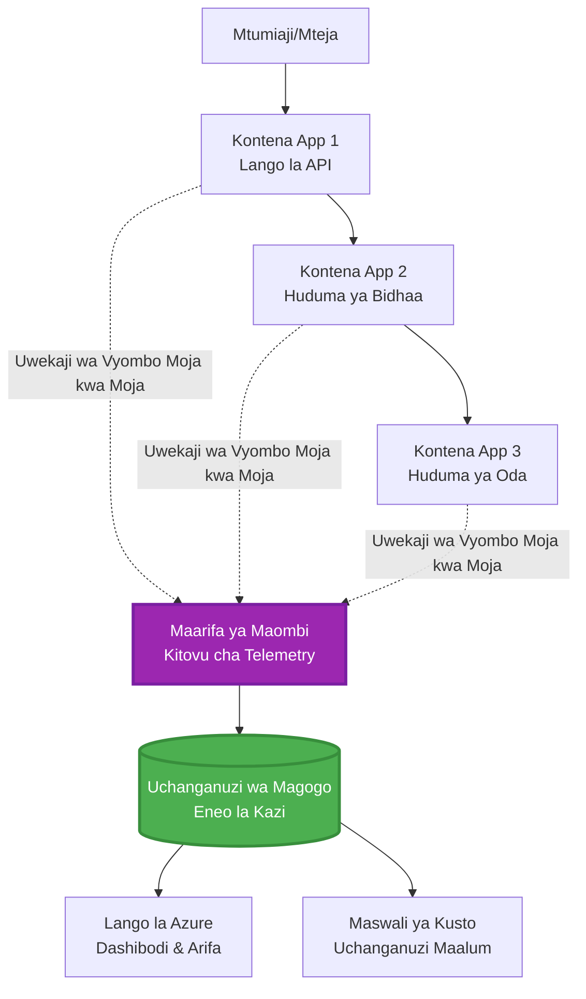
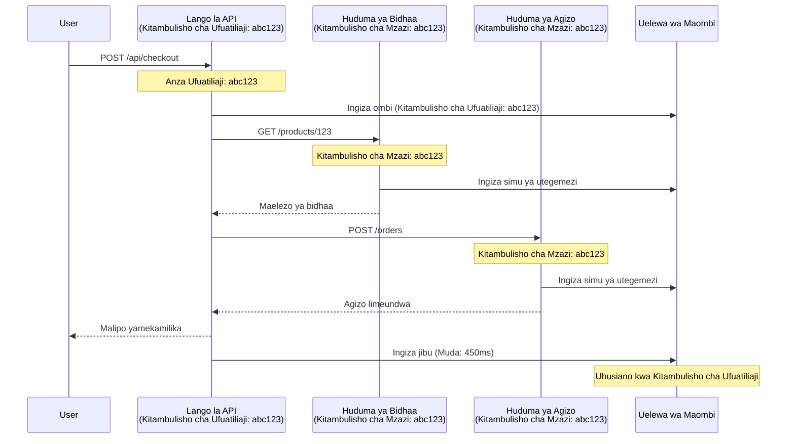

<!--
CO_OP_TRANSLATOR_METADATA:
{
  "original_hash": "e5aa37cdb6378c09099500ac31600b8c",
  "translation_date": "2025-11-23T12:56:53+00:00",
  "source_file": "docs/pre-deployment/application-insights.md",
  "language_code": "sw"
}
-->
# Ushirikiano wa Application Insights na AZD

⏱️ **Muda Unaokadiriwa**: Dakika 40-50 | 💰 **Athari ya Gharama**: ~$5-15/mwezi | ⭐ **Ugumu**: Kati

**📚 Njia ya Kujifunza:**
- ← Awali: [Ukaguzi wa Awali](preflight-checks.md) - Uthibitishaji kabla ya kupeleka
- 🎯 **Upo Hapa**: Ushirikiano wa Application Insights (Ufuatiliaji, telemetry, debugging)
- → Ifuatayo: [Mwongozo wa Utekelezaji](../deployment/deployment-guide.md) - Peleka kwenye Azure
- 🏠 [Nyumbani kwa Kozi](../../README.md)

---

## Utakachojifunza

Kwa kukamilisha somo hili, utaweza:
- Kuunganisha **Application Insights** kwenye miradi ya AZD kiotomatiki
- Kuseti **ufuatiliaji wa usambazaji** kwa huduma ndogo
- Kutekeleza **telemetry maalum** (vipimo, matukio, utegemezi)
- Kuseti **vipimo vya moja kwa moja** kwa ufuatiliaji wa wakati halisi
- Kuunda **arifa na dashibodi** kutoka kwa utekelezaji wa AZD
- Kutatua matatizo ya uzalishaji kwa **maswali ya telemetry**
- Kuboresha **gharama na mikakati ya sampuli**
- Kufuatilia **programu za AI/LLM** (tokeni, ucheleweshaji, gharama)

## Kwa Nini Application Insights na AZD Ni Muhimu

### Changamoto: Ufuatiliaji wa Uzalishaji

**Bila Application Insights:**
```
❌ No visibility into production behavior
❌ Manual log aggregation across services
❌ Reactive debugging (wait for customer complaints)
❌ No performance metrics
❌ Cannot trace requests across services
❌ Unknown failure rates and bottlenecks
```

**Na Application Insights + AZD:**
```
✅ Automatic telemetry collection
✅ Centralized logs from all services
✅ Proactive issue detection
✅ End-to-end request tracing
✅ Performance metrics and insights
✅ Real-time dashboards
✅ AZD provisions everything automatically
```

**Mfano**: Application Insights ni kama kuwa na "rekodi ya ndege" + dashibodi ya cockpit kwa programu yako. Unaona kila kitu kinachotokea kwa wakati halisi na unaweza kurudia tukio lolote.

---

## Muhtasari wa Usanifu

### Application Insights katika Usanifu wa AZD


### Kinachofuatiliwa Kiotomatiki

| Aina ya Telemetry | Kinachokamatwa | Matumizi |
|-------------------|----------------|----------|
| **Maombi** | Maombi ya HTTP, nambari za hali, muda | Ufuatiliaji wa utendaji wa API |
| **Utegemezi** | Simu za nje (DB, API, hifadhi) | Tambua vikwazo |
| **Isipokuwa** | Makosa yasiyoshughulikiwa na nyayo za stack | Kutatua matatizo |
| **Matukio Maalum** | Matukio ya biashara (kujisajili, kununua) | Takwimu na funnel |
| **Vipimo** | Vipimo vya utendaji, vipimo maalum | Mipango ya uwezo |
| **Mfuatano** | Ujumbe wa logi na ukali | Kutatua matatizo na ukaguzi |
| **Upatikanaji** | Vipimo vya muda wa juu na majibu | Ufuatiliaji wa SLA |

---

## Mahitaji

### Zana Zinazohitajika

```bash
# Thibitisha Azure Developer CLI
azd version
# ✅ Inatarajiwa: azd toleo 1.0.0 au juu

# Thibitisha Azure CLI
az --version
# ✅ Inatarajiwa: azure-cli 2.50.0 au juu
```

### Mahitaji ya Azure

- Usajili wa Azure ulio hai
- Ruhusa za kuunda:
  - Rasilimali za Application Insights
  - Sehemu za kazi za Log Analytics
  - Programu za Kontena
  - Vikundi vya rasilimali

### Maarifa Yanayohitajika

Unapaswa kuwa umekamilisha:
- [Misingi ya AZD](../getting-started/azd-basics.md) - Dhana za msingi za AZD
- [Usanidi](../getting-started/configuration.md) - Usanidi wa mazingira
- [Mradi wa Kwanza](../getting-started/first-project.md) - Utekelezaji wa msingi

---

## Somo la 1: Application Insights Kiotomatiki na AZD

### Jinsi AZD Inavyotayarisha Application Insights

AZD huunda na kusanidi Application Insights kiotomatiki unapopeleka. Hebu tuone jinsi inavyofanya kazi.

### Muundo wa Mradi

```
monitored-app/
├── azure.yaml                     # AZD configuration
├── infra/
│   ├── main.bicep                # Main infrastructure
│   ├── core/
│   │   └── monitoring.bicep      # Application Insights + Log Analytics
│   └── app/
│       └── api.bicep             # Container App with monitoring
└── src/
    ├── app.py                    # Application with telemetry
    ├── requirements.txt
    └── Dockerfile
```

---

### Hatua ya 1: Sanidi AZD (azure.yaml)

**Faili: `azure.yaml`**

```yaml
name: monitored-app
metadata:
  template: monitored-app@1.0.0

services:
  api:
    project: ./src
    language: python
    host: containerapp

# AZD automatically provisions monitoring!
```

**Hiyo ndiyo yote!** AZD itaunda Application Insights kwa chaguo-msingi. Hakuna usanidi wa ziada unaohitajika kwa ufuatiliaji wa msingi.

---

### Hatua ya 2: Miundombinu ya Ufuatiliaji (Bicep)

**Faili: `infra/core/monitoring.bicep`**

```bicep
param logAnalyticsName string
param applicationInsightsName string
param location string = resourceGroup().location
param tags object = {}

// Log Analytics Workspace (required for Application Insights)
resource logAnalytics 'Microsoft.OperationalInsights/workspaces@2022-10-01' = {
  name: logAnalyticsName
  location: location
  tags: tags
  properties: {
    sku: {
      name: 'PerGB2018'  // Pay-as-you-go pricing
    }
    retentionInDays: 30  // Keep logs for 30 days
    features: {
      enableLogAccessUsingOnlyResourcePermissions: true
    }
  }
}

// Application Insights
resource applicationInsights 'Microsoft.Insights/components@2020-02-02' = {
  name: applicationInsightsName
  location: location
  tags: tags
  kind: 'web'
  properties: {
    Application_Type: 'web'
    WorkspaceResourceId: logAnalytics.id
    IngestionMode: 'LogAnalytics'
    publicNetworkAccessForIngestion: 'Enabled'
    publicNetworkAccessForQuery: 'Enabled'
  }
}

// Outputs for Container Apps
output logAnalyticsWorkspaceId string = logAnalytics.id
output logAnalyticsWorkspaceName string = logAnalytics.name
output applicationInsightsConnectionString string = applicationInsights.properties.ConnectionString
output applicationInsightsInstrumentationKey string = applicationInsights.properties.InstrumentationKey
output applicationInsightsName string = applicationInsights.name
```

---

### Hatua ya 3: Unganisha Programu ya Kontena na Application Insights

**Faili: `infra/app/api.bicep`**

```bicep
param name string
param location string
param tags object = {}
param containerAppsEnvironmentName string
param applicationInsightsConnectionString string

resource containerApp 'Microsoft.App/containerApps@2023-05-01' = {
  name: name
  location: location
  tags: tags
  properties: {
    configuration: {
      ingress: {
        external: true
        targetPort: 8000
      }
      secrets: [
        {
          name: 'appinsights-connection-string'
          value: applicationInsightsConnectionString
        }
      ]
    }
    template: {
      containers: [
        {
          name: 'api'
          image: 'myregistry.azurecr.io/api:latest'
          resources: {
            cpu: json('0.5')
            memory: '1Gi'
          }
          env: [
            {
              name: 'APPLICATIONINSIGHTS_CONNECTION_STRING'
              secretRef: 'appinsights-connection-string'
            }
            {
              name: 'APPLICATIONINSIGHTS_ENABLED'
              value: 'true'
            }
          ]
        }
      ]
    }
  }
}

output uri string = 'https://${containerApp.properties.configuration.ingress.fqdn}'
```

---

### Hatua ya 4: Nambari ya Programu na Telemetry

**Faili: `src/app.py`**

```python
from flask import Flask, request, jsonify
from opencensus.ext.azure.log_exporter import AzureLogHandler
from opencensus.ext.azure.trace_exporter import AzureExporter
from opencensus.ext.flask.flask_middleware import FlaskMiddleware
from opencensus.trace.samplers import ProbabilitySampler
import logging
import os

app = Flask(__name__)

# Pata mnyororo wa muunganisho wa Application Insights
connection_string = os.environ.get('APPLICATIONINSIGHTS_CONNECTION_STRING')

if connection_string:
    # Sanidi ufuatiliaji uliosambazwa
    middleware = FlaskMiddleware(
        app,
        exporter=AzureExporter(connection_string=connection_string),
        sampler=ProbabilitySampler(rate=1.0)  # Sampuli 100% kwa maendeleo
    )
    
    # Sanidi uandishi wa kumbukumbu
    logger = logging.getLogger(__name__)
    logger.addHandler(AzureLogHandler(connection_string=connection_string))
    logger.setLevel(logging.INFO)
    
    print("✅ Application Insights enabled")
else:
    logger = logging.getLogger(__name__)
    logger.setLevel(logging.INFO)
    print("⚠️ Application Insights not configured")

@app.route('/health')
def health():
    logger.info('Health check endpoint called')
    return jsonify({'status': 'healthy', 'monitoring': 'enabled'})

@app.route('/api/products')
def get_products():
    logger.info('Fetching products')
    
    # Iga simu ya hifadhidata (inayofuatiliwa kiotomatiki kama utegemezi)
    products = [
        {'id': 1, 'name': 'Laptop', 'price': 999.99},
        {'id': 2, 'name': 'Mouse', 'price': 29.99},
        {'id': 3, 'name': 'Keyboard', 'price': 79.99}
    ]
    
    logger.info(f'Returned {len(products)} products')
    return jsonify(products)

@app.route('/api/error-test')
def error_test():
    """Test error tracking"""
    logger.error('Testing error tracking')
    try:
        raise ValueError('This is a test exception')
    except Exception as e:
        logger.exception('Exception occurred in error-test endpoint')
        return jsonify({'error': str(e)}), 500

@app.route('/api/slow')
def slow_endpoint():
    """Test performance tracking"""
    import time
    logger.info('Slow endpoint called')
    time.sleep(3)  # Iga operesheni polepole
    logger.warning('Endpoint took 3 seconds to respond')
    return jsonify({'message': 'Slow operation completed'})

if __name__ == '__main__':
    app.run(host='0.0.0.0', port=8000)
```

**Faili: `src/requirements.txt`**

```txt
Flask==3.0.0
opencensus-ext-azure==1.1.13
opencensus-ext-flask==0.8.1
gunicorn==21.2.0
```

---

### Hatua ya 5: Peleka na Thibitisha

```bash
# Anzisha AZD
azd init

# Weka (inatoa Application Insights kiotomatiki)
azd up

# Pata URL ya programu
APP_URL=$(azd env get-values | grep API_URL | cut -d '=' -f2 | tr -d '"')

# Tengeneza telemetry
curl $APP_URL/health
curl $APP_URL/api/products
curl $APP_URL/api/error-test
curl $APP_URL/api/slow
```

**✅ Matokeo Yanayotarajiwa:**
```json
{
  "status": "healthy",
  "monitoring": "enabled"
}
```

---

### Hatua ya 6: Tazama Telemetry katika Azure Portal

```bash
# Pata maelezo ya Application Insights
azd env get-values | grep APPLICATIONINSIGHTS

# Fungua katika Azure Portal
az monitor app-insights component show \
  --app $(azd env get-values | grep APPLICATIONINSIGHTS_NAME | cut -d '=' -f2 | tr -d '"') \
  --resource-group $(azd env get-values | grep AZURE_RESOURCE_GROUP | cut -d '=' -f2 | tr -d '"') \
  --query "appId" -o tsv
```

**Nenda kwenye Azure Portal → Application Insights → Utafutaji wa Muamala**

Unapaswa kuona:
- ✅ Maombi ya HTTP na nambari za hali
- ✅ Muda wa maombi (sekunde 3+ kwa `/api/slow`)
- ✅ Maelezo ya makosa kutoka `/api/error-test`
- ✅ Ujumbe maalum wa logi

---

## Somo la 2: Telemetry Maalum na Matukio

### Fuatilia Matukio ya Biashara

Hebu tuongeze telemetry maalum kwa matukio muhimu ya biashara.

**Faili: `src/telemetry.py`**

```python
from opencensus.ext.azure import metrics_exporter
from opencensus.stats import aggregation as aggregation_module
from opencensus.stats import measure as measure_module
from opencensus.stats import stats as stats_module
from opencensus.stats import view as view_module
from opencensus.tags import tag_map as tag_map_module
from opencensus.ext.azure.log_exporter import AzureLogHandler
from opencensus.ext.azure.trace_exporter import AzureExporter
from opencensus.trace import tracer as tracer_module
import logging
import os

class TelemetryClient:
    """Custom telemetry client for Application Insights"""
    
    def __init__(self, connection_string=None):
        self.connection_string = connection_string or os.environ.get('APPLICATIONINSIGHTS_CONNECTION_STRING')
        
        if not self.connection_string:
            print("⚠️ Application Insights connection string not found")
            return
        
        # Sanidi kinasa matukio
        self.logger = logging.getLogger(__name__)
        self.logger.addHandler(AzureLogHandler(connection_string=self.connection_string))
        self.logger.setLevel(logging.INFO)
        
        # Sanidi mtoa takwimu za vipimo
        self.stats = stats_module.stats
        self.view_manager = self.stats.view_manager
        self.stats_recorder = self.stats.stats_recorder
        
        exporter = metrics_exporter.new_metrics_exporter(
            connection_string=self.connection_string
        )
        self.view_manager.register_exporter(exporter)
        
        # Sanidi kifuatiliaji
        self.tracer = tracer_module.Tracer(
            exporter=AzureExporter(connection_string=self.connection_string)
        )
        
        print("✅ Custom telemetry client initialized")
    
    def track_event(self, event_name: str, properties: dict = None):
        """Track custom business event"""
        properties = properties or {}
        self.logger.info(
            f"CustomEvent: {event_name}",
            extra={
                'custom_dimensions': {
                    'event_name': event_name,
                    **properties
                }
            }
        )
    
    def track_metric(self, metric_name: str, value: float, properties: dict = None):
        """Track custom metric"""
        properties = properties or {}
        self.logger.info(
            f"CustomMetric: {metric_name} = {value}",
            extra={
                'custom_dimensions': {
                    'metric_name': metric_name,
                    'value': value,
                    **properties
                }
            }
        )
    
    def track_dependency(self, name: str, dependency_type: str, duration: float, success: bool):
        """Track external dependency call"""
        with self.tracer.span(name=name) as span:
            span.add_attribute('dependency.type', dependency_type)
            span.add_attribute('duration', duration)
            span.add_attribute('success', success)

# Mteja wa kimataifa wa telemetri
telemetry = TelemetryClient()
```

### Sasisha Programu na Matukio Maalum

**Faili: `src/app.py` (imeboreshwa)**

```python
from flask import Flask, request, jsonify
from telemetry import telemetry
import time
import random

app = Flask(__name__)

@app.route('/api/purchase', methods=['POST'])
def purchase():
    """Track purchase event with custom telemetry"""
    data = request.json
    product_id = data.get('product_id')
    quantity = data.get('quantity', 1)
    price = data.get('price', 0)
    
    # Fuatilia tukio la biashara
    telemetry.track_event('Purchase', {
        'product_id': product_id,
        'quantity': quantity,
        'total_amount': price * quantity,
        'user_id': request.headers.get('X-User-Id', 'anonymous')
    })
    
    # Fuatilia kipimo cha mapato
    telemetry.track_metric('Revenue', price * quantity, {
        'product_id': product_id,
        'currency': 'USD'
    })
    
    return jsonify({
        'order_id': f'ORD-{random.randint(1000, 9999)}',
        'status': 'confirmed',
        'total': price * quantity
    })

@app.route('/api/search')
def search():
    """Track search queries"""
    query = request.args.get('q', '')
    
    start_time = time.time()
    
    # Simulate utafutaji (ingekuwa swala halisi la hifadhidata)
    results = [{'id': 1, 'name': f'Result for {query}'}]
    
    duration = (time.time() - start_time) * 1000  # Badilisha kuwa ms
    
    # Fuatilia tukio la utafutaji
    telemetry.track_event('Search', {
        'query': query,
        'results_count': len(results),
        'duration_ms': duration
    })
    
    # Fuatilia kipimo cha utendaji wa utafutaji
    telemetry.track_metric('SearchDuration', duration, {
        'query_length': len(query)
    })
    
    return jsonify({'results': results, 'count': len(results)})

@app.route('/api/external-call')
def external_call():
    """Track external API dependency"""
    import requests
    
    start_time = time.time()
    success = True
    
    try:
        # Simulate wito wa API ya nje
        response = requests.get('https://api.example.com/data', timeout=5)
        result = response.json()
    except Exception as e:
        success = False
        result = {'error': str(e)}
    
    duration = (time.time() - start_time) * 1000
    
    # Fuatilia utegemezi
    telemetry.track_dependency(
        name='ExternalAPI',
        dependency_type='HTTP',
        duration=duration,
        success=success
    )
    
    return jsonify(result)

if __name__ == '__main__':
    app.run(host='0.0.0.0', port=8000)
```

### Jaribu Telemetry Maalum

```bash
# Fuatilia tukio la ununuzi
curl -X POST $APP_URL/api/purchase \
  -H "Content-Type: application/json" \
  -H "X-User-Id: user123" \
  -d '{"product_id": 1, "quantity": 2, "price": 29.99}'

# Fuatilia tukio la utafutaji
curl "$APP_URL/api/search?q=laptop"

# Fuatilia utegemezi wa nje
curl $APP_URL/api/external-call
```

**Tazama katika Azure Portal:**

Nenda kwenye Application Insights → Logs, kisha endesha:

```kusto
// View purchase events
traces
| where customDimensions.event_name == "Purchase"
| project 
    timestamp,
    product_id = tostring(customDimensions.product_id),
    total_amount = todouble(customDimensions.total_amount),
    user_id = tostring(customDimensions.user_id)
| order by timestamp desc

// View revenue metrics
traces
| where customDimensions.metric_name == "Revenue"
| summarize TotalRevenue = sum(todouble(customDimensions.value)) by bin(timestamp, 1h)
| render timechart

// View search performance
traces
| where customDimensions.event_name == "Search"
| summarize 
    AvgDuration = avg(todouble(customDimensions.duration_ms)),
    SearchCount = count()
  by bin(timestamp, 5m)
| render timechart
```

---

## Somo la 3: Ufuatiliaji wa Usambazaji kwa Huduma Ndogo

### Washa Ufuatiliaji wa Huduma Mbalimbali

Kwa huduma ndogo, Application Insights huunganisha maombi kiotomatiki kati ya huduma.

**Faili: `infra/main.bicep`**

```bicep
targetScope = 'subscription'

param environmentName string
param location string = 'eastus'

var tags = { 'azd-env-name': environmentName }

resource rg 'Microsoft.Resources/resourceGroups@2021-04-01' = {
  name: 'rg-${environmentName}'
  location: location
  tags: tags
}

// Monitoring (shared by all services)
module monitoring './core/monitoring.bicep' = {
  name: 'monitoring'
  scope: rg
  params: {
    logAnalyticsName: 'log-${environmentName}'
    applicationInsightsName: 'appi-${environmentName}'
    location: location
    tags: tags
  }
}

// API Gateway
module apiGateway './app/api-gateway.bicep' = {
  name: 'api-gateway'
  scope: rg
  params: {
    name: 'ca-gateway-${environmentName}'
    location: location
    tags: union(tags, { 'azd-service-name': 'gateway' })
    applicationInsightsConnectionString: monitoring.outputs.applicationInsightsConnectionString
  }
}

// Product Service
module productService './app/product-service.bicep' = {
  name: 'product-service'
  scope: rg
  params: {
    name: 'ca-products-${environmentName}'
    location: location
    tags: union(tags, { 'azd-service-name': 'products' })
    applicationInsightsConnectionString: monitoring.outputs.applicationInsightsConnectionString
  }
}

// Order Service
module orderService './app/order-service.bicep' = {
  name: 'order-service'
  scope: rg
  params: {
    name: 'ca-orders-${environmentName}'
    location: location
    tags: union(tags, { 'azd-service-name': 'orders' })
    applicationInsightsConnectionString: monitoring.outputs.applicationInsightsConnectionString
  }
}

output APPLICATIONINSIGHTS_CONNECTION_STRING string = monitoring.outputs.applicationInsightsConnectionString
output GATEWAY_URL string = apiGateway.outputs.uri
```

### Tazama Muamala wa Mwisho kwa Mwisho


**Maswali ya ufuatiliaji wa mwisho kwa mwisho:**

```kusto
// Find complete request flow
let traceId = "abc123...";  // Get from response header
dependencies
| union requests
| where operation_Id == traceId
| project 
    timestamp,
    type = itemType,
    name,
    duration,
    success,
    cloud_RoleName
| order by timestamp asc
```

---

## Somo la 4: Vipimo vya Moja kwa Moja na Ufuatiliaji wa Wakati Halisi

### Washa Mfululizo wa Vipimo vya Moja kwa Moja

Vipimo vya Moja kwa Moja vinatoa telemetry ya wakati halisi na latency ya chini ya sekunde 1.

**Fikia Vipimo vya Moja kwa Moja:**

```bash
# Pata rasilimali ya Application Insights
APPI_NAME=$(azd env get-values | grep APPLICATIONINSIGHTS_NAME | cut -d '=' -f2 | tr -d '"')

# Pata kikundi cha rasilimali
RG_NAME=$(azd env get-values | grep AZURE_RESOURCE_GROUP | cut -d '=' -f2 | tr -d '"')

echo "Navigate to: Azure Portal → Resource Groups → $RG_NAME → $APPI_NAME → Live Metrics"
```

**Unachokiona kwa wakati halisi:**
- ✅ Kiwango cha maombi yanayoingia (maombi/sec)
- ✅ Simu za utegemezi zinazotoka
- ✅ Idadi ya makosa
- ✅ Matumizi ya CPU na kumbukumbu
- ✅ Idadi ya seva zinazotumika
- ✅ Sampuli ya telemetry

### Tengeneza Mzigo kwa Jaribio

```bash
# Tengeneza mzigo ili kuona vipimo vya moja kwa moja
for i in {1..100}; do
  curl $APP_URL/api/products &
  curl $APP_URL/api/search?q=test$i &
done

# Tazama vipimo vya moja kwa moja katika Azure Portal
# Unapaswa kuona ongezeko la kiwango cha maombi
```

---

## Mazoezi ya Vitendo

### Zoezi 1: Sanidi Arifa ⭐⭐ (Kati)

**Lengo**: Unda arifa kwa viwango vya makosa ya juu na majibu ya polepole.

**Hatua:**

1. **Unda arifa kwa kiwango cha makosa:**

```bash
# Pata kitambulisho cha rasilimali cha Application Insights
APPI_ID=$(az monitor app-insights component show \
  --app $APPI_NAME \
  --resource-group $RG_NAME \
  --query "id" -o tsv)

# Unda tahadhari ya kipimo kwa maombi yaliyoshindwa
az monitor metrics alert create \
  --name "High-Error-Rate" \
  --resource-group $RG_NAME \
  --scopes $APPI_ID \
  --condition "count requests/failed > 10" \
  --window-size 5m \
  --evaluation-frequency 1m \
  --description "Alert when error rate exceeds 10 per 5 minutes"
```

2. **Unda arifa kwa majibu ya polepole:**

```bash
az monitor metrics alert create \
  --name "Slow-Responses" \
  --resource-group $RG_NAME \
  --scopes $APPI_ID \
  --condition "avg requests/duration > 3000" \
  --window-size 5m \
  --evaluation-frequency 1m \
  --description "Alert when average response time exceeds 3 seconds"
```

3. **Unda arifa kupitia Bicep (inapendekezwa kwa AZD):**

**Faili: `infra/core/alerts.bicep`**

```bicep
param applicationInsightsId string
param actionGroupId string = ''
param location string = resourceGroup().location

// High error rate alert
resource errorRateAlert 'Microsoft.Insights/metricAlerts@2018-03-01' = {
  name: 'high-error-rate'
  location: 'global'
  properties: {
    description: 'Alert when error rate exceeds threshold'
    severity: 2
    enabled: true
    scopes: [
      applicationInsightsId
    ]
    evaluationFrequency: 'PT1M'
    windowSize: 'PT5M'
    criteria: {
      'odata.type': 'Microsoft.Azure.Monitor.SingleResourceMultipleMetricCriteria'
      allOf: [
        {
          name: 'Error rate'
          metricName: 'requests/failed'
          operator: 'GreaterThan'
          threshold: 10
          timeAggregation: 'Count'
        }
      ]
    }
    actions: actionGroupId != '' ? [
      {
        actionGroupId: actionGroupId
      }
    ] : []
  }
}

// Slow response alert
resource slowResponseAlert 'Microsoft.Insights/metricAlerts@2018-03-01' = {
  name: 'slow-responses'
  location: 'global'
  properties: {
    description: 'Alert when response time is too high'
    severity: 3
    enabled: true
    scopes: [
      applicationInsightsId
    ]
    evaluationFrequency: 'PT1M'
    windowSize: 'PT5M'
    criteria: {
      'odata.type': 'Microsoft.Azure.Monitor.SingleResourceMultipleMetricCriteria'
      allOf: [
        {
          name: 'Response duration'
          metricName: 'requests/duration'
          operator: 'GreaterThan'
          threshold: 3000
          timeAggregation: 'Average'
        }
      ]
    }
  }
}

output errorAlertId string = errorRateAlert.id
output slowResponseAlertId string = slowResponseAlert.id
```

4. **Jaribu arifa:**

```bash
# Tengeneza makosa
for i in {1..20}; do
  curl $APP_URL/api/error-test
done

# Tengeneza majibu ya polepole
for i in {1..10}; do
  curl $APP_URL/api/slow
done

# Angalia hali ya tahadhari (subiri dakika 5-10)
az monitor metrics alert list \
  --resource-group $RG_NAME \
  --query "[].{Name:name, Enabled:enabled, State:properties.enabled}" \
  --output table
```

**✅ Vigezo vya Mafanikio:**
- ✅ Arifa zimeundwa kwa mafanikio
- ✅ Arifa zinawashwa wakati viwango vinazidi
- ✅ Unaweza kuona historia ya arifa katika Azure Portal
- ✅ Imeunganishwa na utekelezaji wa AZD

**Muda**: Dakika 20-25

---

### Zoezi 2: Unda Dashibodi Maalum ⭐⭐ (Kati)

**Lengo**: Tengeneza dashibodi inayoonyesha vipimo muhimu vya programu.

**Hatua:**

1. **Unda dashibodi kupitia Azure Portal:**

Nenda: Azure Portal → Dashboards → Dashibodi Mpya

2. **Ongeza vigae kwa vipimo muhimu:**

- Idadi ya maombi (saa 24 zilizopita)
- Muda wa majibu wa wastani
- Kiwango cha makosa
- Operesheni 5 za polepole zaidi
- Usambazaji wa kijiografia wa watumiaji

3. **Unda dashibodi kupitia Bicep:**

**Faili: `infra/core/dashboard.bicep`**

```bicep
param dashboardName string
param applicationInsightsId string
param location string = resourceGroup().location

resource dashboard 'Microsoft.Portal/dashboards@2020-09-01-preview' = {
  name: dashboardName
  location: location
  properties: {
    lenses: [
      {
        order: 0
        parts: [
          // Request count
          {
            position: { x: 0, y: 0, rowSpan: 4, colSpan: 6 }
            metadata: {
              type: 'Extension/Microsoft_OperationsManagementSuite_Workspace/PartType/LogsDashboardPart'
              inputs: [
                {
                  name: 'resourceId'
                  value: applicationInsightsId
                }
                {
                  name: 'query'
                  value: '''
                    requests
                    | summarize RequestCount = count() by bin(timestamp, 1h)
                    | render timechart
                  '''
                }
              ]
            }
          }
          // Error rate
          {
            position: { x: 6, y: 0, rowSpan: 4, colSpan: 6 }
            metadata: {
              type: 'Extension/Microsoft_OperationsManagementSuite_Workspace/PartType/LogsDashboardPart'
              inputs: [
                {
                  name: 'resourceId'
                  value: applicationInsightsId
                }
                {
                  name: 'query'
                  value: '''
                    requests
                    | summarize 
                        Total = count(),
                        Failed = countif(success == false)
                    | extend ErrorRate = (Failed * 100.0) / Total
                    | project ErrorRate
                  '''
                }
              ]
            }
          }
        ]
      }
    ]
  }
}

output dashboardId string = dashboard.id
```

4. **Peleka dashibodi:**

```bash
# Ongeza kwa main.bicep
module dashboard './core/dashboard.bicep' = {
  name: 'dashboard'
  scope: rg
  params: {
    dashboardName: 'dashboard-${environmentName}'
    applicationInsightsId: monitoring.outputs.applicationInsightsId
    location: location
  }
}

# Peleka
azd up
```

**✅ Vigezo vya Mafanikio:**
- ✅ Dashibodi inaonyesha vipimo muhimu
- ✅ Inaweza kupachikwa kwenye nyumbani ya Azure Portal
- ✅ Inasasishwa kwa wakati halisi
- ✅ Inaweza kutekelezwa kupitia AZD

**Muda**: Dakika 25-30

---

### Zoezi 3: Fuatilia Programu ya AI/LLM ⭐⭐⭐ (Juu)

**Lengo**: Fuatilia matumizi ya Azure OpenAI (tokeni, gharama, ucheleweshaji).

**Hatua:**

1. **Unda kifuniko cha ufuatiliaji wa AI:**

**Faili: `src/ai_telemetry.py`**

```python
from telemetry import telemetry
from openai import AzureOpenAI
import time

class MonitoredAzureOpenAI:
    """Azure OpenAI client with automatic telemetry"""
    
    def __init__(self, api_key, endpoint, api_version="2024-02-01"):
        self.client = AzureOpenAI(
            api_key=api_key,
            api_version=api_version,
            azure_endpoint=endpoint
        )
    
    def chat_completion(self, model: str, messages: list, **kwargs):
        """Track chat completion with telemetry"""
        start_time = time.time()
        
        try:
            # Piga Azure OpenAI
            response = self.client.chat.completions.create(
                model=model,
                messages=messages,
                **kwargs
            )
            
            duration = (time.time() - start_time) * 1000  # ms
            
            # Chukua matumizi
            usage = response.usage
            prompt_tokens = usage.prompt_tokens
            completion_tokens = usage.completion_tokens
            total_tokens = usage.total_tokens
            
            # Hesabu gharama (bei ya GPT-4)
            prompt_cost = (prompt_tokens / 1000) * 0.03  # $0.03 kwa tokeni 1K
            completion_cost = (completion_tokens / 1000) * 0.06  # $0.06 kwa tokeni 1K
            total_cost = prompt_cost + completion_cost
            
            # Fuatilia tukio maalum
            telemetry.track_event('OpenAI_Request', {
                'model': model,
                'prompt_tokens': prompt_tokens,
                'completion_tokens': completion_tokens,
                'total_tokens': total_tokens,
                'duration_ms': duration,
                'cost_usd': total_cost,
                'success': True
            })
            
            # Fuatilia vipimo
            telemetry.track_metric('OpenAI_Tokens', total_tokens, {
                'model': model,
                'type': 'total'
            })
            
            telemetry.track_metric('OpenAI_Cost', total_cost, {
                'model': model,
                'currency': 'USD'
            })
            
            telemetry.track_metric('OpenAI_Duration', duration, {
                'model': model
            })
            
            return response
            
        except Exception as e:
            duration = (time.time() - start_time) * 1000
            
            telemetry.track_event('OpenAI_Request', {
                'model': model,
                'duration_ms': duration,
                'success': False,
                'error': str(e)
            })
            
            raise
```

2. **Tumia mteja anayefuatiliwa:**

```python
from flask import Flask, request, jsonify
from ai_telemetry import MonitoredAzureOpenAI
import os

app = Flask(__name__)

# Anzisha mteja wa OpenAI anayefuatiliwa
openai_client = MonitoredAzureOpenAI(
    api_key=os.environ['AZURE_OPENAI_API_KEY'],
    endpoint=os.environ['AZURE_OPENAI_ENDPOINT']
)

@app.route('/api/chat', methods=['POST'])
def chat():
    data = request.json
    user_message = data.get('message')
    
    # Piga simu na ufuatiliaji wa moja kwa moja
    response = openai_client.chat_completion(
        model='gpt-4',
        messages=[
            {'role': 'user', 'content': user_message}
        ]
    )
    
    return jsonify({
        'response': response.choices[0].message.content,
        'tokens': response.usage.total_tokens
    })
```

3. **Maswali ya vipimo vya AI:**

```kusto
// Total AI spend over time
traces
| where customDimensions.event_name == "OpenAI_Request"
| where customDimensions.success == "True"
| summarize TotalCost = sum(todouble(customDimensions.cost_usd)) by bin(timestamp, 1h)
| render timechart

// Token usage by model
traces
| where customDimensions.event_name == "OpenAI_Request"
| summarize 
    TotalTokens = sum(toint(customDimensions.total_tokens)),
    RequestCount = count()
  by Model = tostring(customDimensions.model)

// Average latency
traces
| where customDimensions.event_name == "OpenAI_Request"
| summarize AvgDuration = avg(todouble(customDimensions.duration_ms))
| project AvgDurationSeconds = AvgDuration / 1000

// Cost per request
traces
| where customDimensions.event_name == "OpenAI_Request"
| extend Cost = todouble(customDimensions.cost_usd)
| summarize 
    TotalCost = sum(Cost),
    RequestCount = count(),
    AvgCostPerRequest = avg(Cost)
```

**✅ Vigezo vya Mafanikio:**
- ✅ Kila simu ya OpenAI inafuatiliwa kiotomatiki
- ✅ Matumizi ya tokeni na gharama zinaonekana
- ✅ Ucheleweshaji unafuatiliwa
- ✅ Unaweza kuseti arifa za bajeti

**Muda**: Dakika 35-45

---

## Uboreshaji wa Gharama

### Mikakati ya Sampuli

Dhibiti gharama kwa kusampuli telemetry:

```python
from opencensus.trace.samplers import ProbabilitySampler

# Maendeleo: Sampuli 100%
sampler = ProbabilitySampler(rate=1.0)

# Uzalishaji: Sampuli 10% (punguza gharama kwa 90%)
sampler = ProbabilitySampler(rate=0.1)

# Sampuli inayobadilika (inajirekebisha kiotomatiki)
from opencensus.trace.samplers import AdaptiveSampler
sampler = AdaptiveSampler()
```

**Katika Bicep:**

```bicep
resource applicationInsights 'Microsoft.Insights/components@2020-02-02' = {
  name: applicationInsightsName
  properties: {
    SamplingPercentage: 10  // 10% sampling
  }
}
```

### Uhifadhi wa Data

```bicep
resource logAnalytics 'Microsoft.OperationalInsights/workspaces@2022-10-01' = {
  name: logAnalyticsName
  properties: {
    retentionInDays: 30  // Minimum (cheapest)
    // Options: 30, 31, 60, 90, 120, 180, 270, 365, 550, 730
  }
}
```

### Makadirio ya Gharama ya Kila Mwezi

| Kiasi cha Data | Uhifadhi | Gharama ya Kila Mwezi |
|----------------|----------|-----------------------|
| 1 GB/mwezi | Siku 30 | ~$2-5 |
| 5 GB/mwezi | Siku 30 | ~$10-15 |
| 10 GB/mwezi | Siku 90 | ~$25-40 |
| 50 GB/mwezi | Siku 90 | ~$100-150 |

**Kiwango cha bure**: 5 GB/mwezi kimejumuishwa

---

## Kituo cha Maarifa

### 1. Ushirikiano wa Msingi ✓

Jaribu uelewa wako:

- [ ] **Q1**: AZD inatayarisha Application Insights vipi?
  - **A**: Kiotomatiki kupitia templeti za Bicep katika `infra/core/monitoring.bicep`

- [ ] **Q2**: Ni mazingira gani yanayowezesha Application Insights?
  - **A**: `APPLICATIONINSIGHTS_CONNECTION_STRING`

- [ ] **Q3**: Ni aina gani tatu kuu za telemetry?
  - **A**: Maombi (simu za HTTP), Utegemezi (simu za nje), Isipokuwa (makosa)

**Uthibitishaji wa Vitendo:**
```bash
# Angalia kama Application Insights imewekwa
azd env get-values | grep APPLICATIONINSIGHTS

# Hakikisha telemetry inatiririka
az monitor app-insights metrics show \
  --app $APPI_NAME \
  --resource-group $RG_NAME \
  --metric "requests/count"
```

---

### 2. Telemetry Maalum ✓

Jaribu uelewa wako:

- [ ] **Q1**: Unafuatiliaje matukio maalum ya biashara?
  - **A**: Tumia logger na `custom_dimensions` au `TelemetryClient.track_event()`

- [ ] **Q2**: Tofauti kati ya matukio na vipimo ni nini?
  - **A**: Matukio ni matukio ya pekee, vipimo ni vipimo vya nambari

- [ ] **Q3**: Unafuatiliaje telemetry kati ya huduma?
  - **A**: Application Insights hutumia `operation_Id` kiotomatiki kwa ufuatiliaji

**Uthibitishaji wa Vitendo:**
```kusto
// Verify custom events
traces
| where customDimensions.event_name != ""
| summarize count() by tostring(customDimensions.event_name)
```

---

### 3. Ufuatiliaji wa Uzalishaji ✓

Jaribu uelewa wako:

- [ ] **Q1**: Sampuli ni nini na kwa nini uitumie?
  - **A**: Sampuli hupunguza kiasi cha data (na gharama) kwa kunasa asilimia tu ya telemetry

- [ ] **Q2**: Unaseti vipi arifa?
  - **A**: Tumia arifa za vipimo katika Bicep au Azure Portal kulingana na vipimo vya Application Insights

- [ ] **Q3**: Tofauti kati ya Log Analytics na Application Insights ni nini?
  - **A**: Application Insights huhifadhi data katika sehemu ya kazi ya Log Analytics; App Insights hutoa maoni maalum ya programu

**Uthibitishaji wa Vitendo:**
```bash
# Angalia usanidi wa sampuli
az monitor app-insights component show \
  --app $APPI_NAME \
  --resource-group $RG_NAME \
  --query "properties.SamplingPercentage"
```

---

## Mazoezi Bora

### ✅ FANYA:

1. **Tumia ID za uhusiano**
   ```python
   logger.info('Processing order', extra={
       'custom_dimensions': {
           'order_id': order_id,
           'user_id': user_id
       }
   })
   ```

2. **Sanidi arifa kwa vipimo muhimu**
   ```bicep
   // Error rate, slow responses, availability
   ```

3. **Tumia logi zilizopangwa**
   ```python
   # ✅ NZURI: Iliyopangwa
   logger.info('User signup', extra={'custom_dimensions': {'user_id': 123}})
   
   # ❌ MBAYA: Isiyopangwa
   logger.info(f'User 123 signed up')
   ```

4. **Fuatilia utegemezi**
   ```python
   # Fuatilia kiotomatiki miito ya hifadhidata, maombi ya HTTP, nk.
   ```

5. **Tumia Vipimo vya Moja kwa Moja wakati wa utekelezaji**

### ❌ USIFANYE:

1. **Usilog data nyeti**
   ```python
   # ❌ MBAYA
   logger.info(f'Login: {username}:{password}')
   
   # ✅ NZURI
   logger.info('Login attempt', extra={'custom_dimensions': {'username': username}})
   ```

2. **Usitumie sampuli 100% katika uzalishaji**
   ```python
   # ❌ Ghali
   sampler = ProbabilitySampler(rate=1.0)
   
   # ✅ Ya gharama nafuu
   sampler = ProbabilitySampler(rate=0.1)
   ```

3. **Usipuuze foleni za barua zilizokufa**

4. **Usisahau kuweka mipaka ya uhifadhi wa data**

---

## Utatuzi wa Matatizo

### Tatizo: Hakuna telemetry inayoonekana

**Uchunguzi:**
```bash
# Angalia ikiwa mnyororo wa muunganisho umewekwa
azd env get-values | grep APPLICATIONINSIGHTS

# Angalia kumbukumbu za programu
azd logs api --tail 50
```

**Suluhisho:**
```bash
# Thibitisha mnyororo wa muunganisho katika Programu ya Kontena
az containerapp show \
  --name $APP_NAME \
  --resource-group $RG_NAME \
  --query "properties.template.containers[0].env" \
  | grep -i applicationinsights
```

---

### Tatizo: Gharama za juu

**Uchunguzi:**
```bash
# Angalia uingizaji wa data
az monitor app-insights metrics show \
  --app $APPI_NAME \
  --resource-group $RG_NAME \
  --metric "availabilityResults/count"
```

**Suluhisho:**
- Punguza kiwango cha sampuli
- Punguza kipindi cha uhifadhi
- Ondoa logi za kina

---

## Jifunze Zaidi

### Nyaraka Rasmi
- [Muhtasari wa Application Insights](https://learn.microsoft.com/azure/azure-monitor/app/app-insights-overview)
- [Application Insights kwa Python](https://learn.microsoft.com/azure/azure-monitor/app/opencensus-python)
- [Kusto Query Language](https://learn.microsoft.com/azure/data-explorer/kusto/query/)
- [Ufuatiliaji wa AZD](https://learn.microsoft.com/azure/developer/azure-developer-cli/monitor-your-app)

### Hatua Zifuatazo katika Kozi Hii
- ← Awali: [Ukaguzi wa Awali](preflight-checks.md)
- → Ifuatayo: [Mwongozo wa Utekelezaji](../deployment/deployment-guide.md)
- 🏠 [Nyumbani kwa Kozi](../../README.md)

### Mifano Inayohusiana
- [Mfano wa Azure OpenAI](../../../../examples/azure-openai-chat) - Telemetry ya AI
- [Mfano wa Huduma Ndogo](../../../../examples/microservices) - Ufuatiliaji wa usambazaji

---

## Muhtasari

**Umejifunza:**
- ✅ Uundaji wa Application Insights kiotomatiki na AZD
- ✅ Telemetry maalum (matukio, vipimo, utegemezi)
- ✅ Ufuatiliaji wa usambazaji kati ya huduma ndogo
- ✅ Vipimo vya moja kwa moja na ufuatiliaji wa wakati halisi
- ✅ Arifa na dashibodi
- ✅ Ufuatiliaji wa matumizi ya AI/LLM  
- ✅ Mikakati ya kuboresha gharama  

**Mambo Muhimu ya Kuzingatia:**  
1. **AZD huandaa ufuatiliaji kiotomatiki** - Hakuna mpangilio wa mwongozo  
2. **Tumia kumbukumbu zilizopangwa vizuri** - Hufanya uchunguzi kuwa rahisi  
3. **Fuatilia matukio ya kibiashara** - Sio tu vipimo vya kiufundi  
4. **Fuatilia gharama za AI** - Angalia tokeni na matumizi  
5. **Weka arifa** - Kuwa mtangulizi, sio mfuataji  
6. **Boresha gharama** - Tumia sampuli na mipaka ya uhifadhi  

**Hatua Zifuatazo:**  
1. Kamilisha mazoezi ya vitendo  
2. Ongeza Application Insights kwenye miradi yako ya AZD  
3. Tengeneza dashibodi maalum kwa timu yako  
4. Jifunze [Mwongozo wa Utekelezaji](../deployment/deployment-guide.md)  

---

<!-- CO-OP TRANSLATOR DISCLAIMER START -->
**Kanusho**:  
Hati hii imetafsiriwa kwa kutumia huduma ya tafsiri ya AI [Co-op Translator](https://github.com/Azure/co-op-translator). Ingawa tunajitahidi kwa usahihi, tafadhali fahamu kuwa tafsiri za kiotomatiki zinaweza kuwa na makosa au kutokuwa sahihi. Hati ya asili katika lugha yake ya awali inapaswa kuzingatiwa kama chanzo cha mamlaka. Kwa taarifa muhimu, tafsiri ya kitaalamu ya binadamu inapendekezwa. Hatutawajibika kwa kutoelewana au tafsiri zisizo sahihi zinazotokana na matumizi ya tafsiri hii.
<!-- CO-OP TRANSLATOR DISCLAIMER END -->