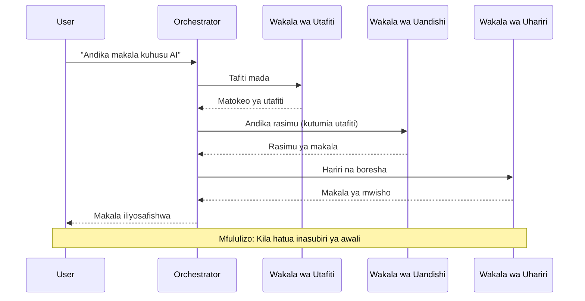
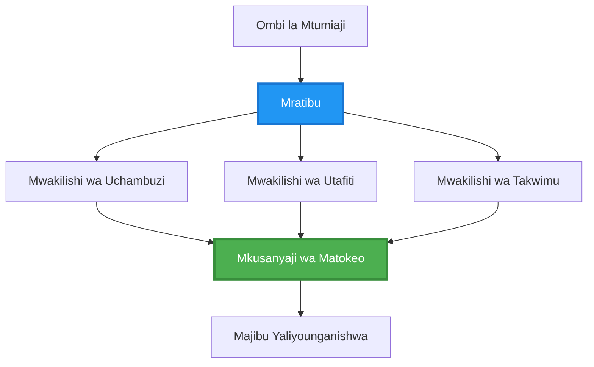
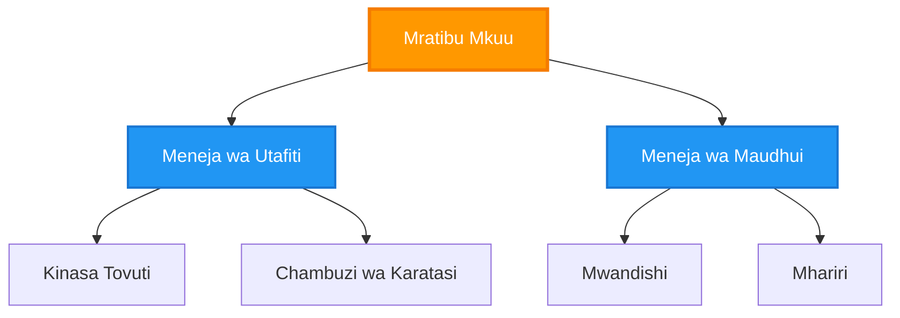
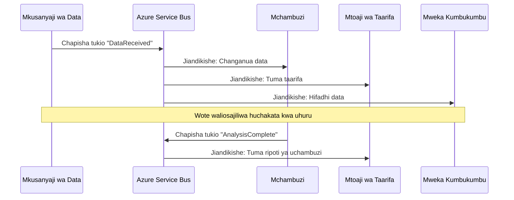
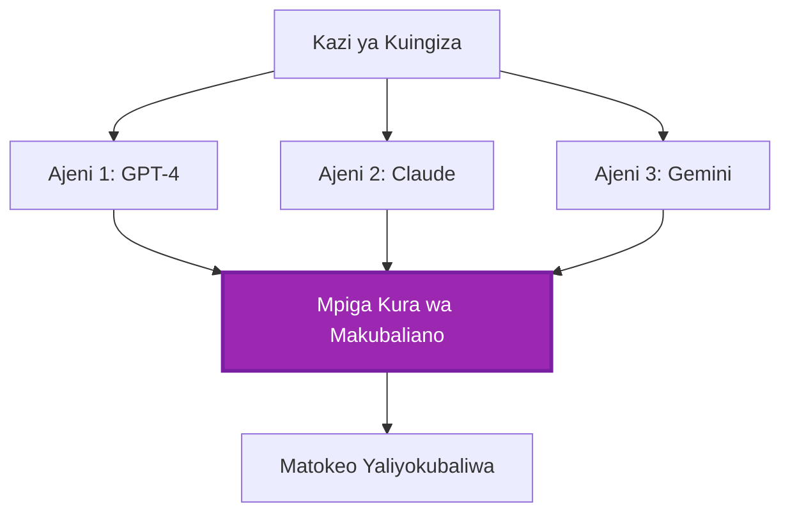
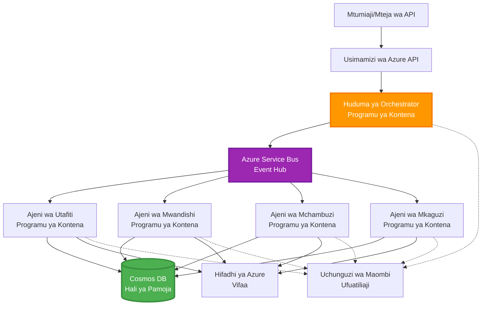

# Mifumo ya Uratibu wa Wakala Wengi

⏱️ **Muda Unaokadiriwa**: Dakika 60-75 | 💰 **Gharama Inayokadiriwa**: ~$100-300/mwezi | ⭐ **Ugumu**: Juu

**📚 Njia ya Kujifunza:**
- ← Iliyopita: [Mipango ya Uwezo](capacity-planning.md) - Mikakati ya ukubwa wa rasilimali na upanuzi
- 🎯 **Upo Hapa**: Mifumo ya Uratibu wa Wakala Wengi (Uratibu, mawasiliano, usimamizi wa hali)
- → Ifuatayo: [Uchaguzi wa SKU](sku-selection.md) - Kuchagua huduma sahihi za Azure
- 🏠 [Nyumbani kwa Kozi](../../README.md)

---

## Utakayojifunza

Kwa kukamilisha somo hili, utaweza:
- Kuelewa mifumo ya usanifu wa **wakala wengi** na wakati wa kuitumia
- Kutekeleza **mifumo ya uratibu** (ya kati, isiyo ya kati, ya kihierarkia)
- Kubuni mikakati ya **mawasiliano ya wakala** (ya wakati mmoja, ya wakati tofauti, inayotegemea matukio)
- Kusimamia **hali ya pamoja** kati ya mawakala waliotawanyika
- Kuweka **mifumo ya wakala wengi** kwenye Azure kwa AZD
- Kutumia **mifumo ya uratibu** kwa hali halisi za AI
- Kufuatilia na kurekebisha mifumo ya wakala waliotawanyika

## Kwa Nini Uratibu wa Wakala Wengi Ni Muhimu

### Mageuzi: Kutoka kwa Wakala Mmoja hadi Wakala Wengi

**Wakala Mmoja (Rahisi):**
```
User → Agent → Response
```
- ✅ Rahisi kuelewa na kutekeleza
- ✅ Haraka kwa kazi rahisi
- ❌ Uwezo mdogo wa mfano mmoja
- ❌ Haiwezi kugawanya kazi ngumu
- ❌ Hakuna utaalamu

**Mfumo wa Wakala Wengi (Juu):**
```
           ┌─────────────┐
           │ Orchestrator│
           └──────┬──────┘
        ┌─────────┼─────────┐
        │         │         │
    ┌───▼──┐  ┌──▼───┐  ┌──▼────┐
    │Agent1│  │Agent2│  │Agent3 │
    │(Plan)│  │(Code)│  │(Review)│
    └──────┘  └──────┘  └───────┘
```
- ✅ Mawakala maalum kwa kazi maalum
- ✅ Utekelezaji wa sambamba kwa kasi
- ✅ Modulari na rahisi kudumisha
- ✅ Bora kwa mchakato mgumu wa kazi
- ⚠️ Unahitaji mantiki ya uratibu

**Mfano**: Wakala mmoja ni kama mtu mmoja anayefanya kazi zote. Wakala wengi ni kama timu ambapo kila mshiriki ana ujuzi maalum (mtafiti, mweka msimbo, mkaguzi, mwandishi) wakifanya kazi pamoja.

---

## Mifumo ya Msingi ya Uratibu

### Mfano 1: Uratibu wa Mfululizo (Mlolongo wa Wajibu)

**Wakati wa kutumia**: Kazi lazima zikamilike kwa mpangilio maalum, kila wakala anajenga juu ya matokeo ya awali.


**Faida:**
- ✅ Mtiririko wa data wazi
- ✅ Rahisi kurekebisha
- ✅ Mpangilio wa utekelezaji unaotabirika

**Mapungufu:**
- ❌ Polepole (hakuna usambazaji)
- ❌ Kushindwa kwa moja kunazuia mlolongo mzima
- ❌ Haiwezi kushughulikia kazi zinazotegemeana

**Mifano ya Matumizi:**
- Mchakato wa uundaji wa maudhui (tafiti → andika → hariri → chapisha)
- Uundaji wa msimbo (panga → tekeleza → jaribu → peleka)
- Uundaji wa ripoti (ukusanyaji wa data → uchambuzi → uwasilishaji → muhtasari)

---

### Mfano 2: Uratibu wa Sambamba (Fan-Out/Fan-In)

**Wakati wa kutumia**: Kazi huru zinaweza kufanyika kwa wakati mmoja, matokeo yanajumuishwa mwishoni.


**Faida:**
- ✅ Haraka (utekelezaji wa sambamba)
- ✅ Inavumilia makosa (matokeo ya sehemu yanakubalika)
- ✅ Inapanuka kwa usawa

**Mapungufu:**
- ⚠️ Matokeo yanaweza kufika bila mpangilio
- ⚠️ Inahitaji mantiki ya ujumuishaji
- ⚠️ Usimamizi mgumu wa hali

**Mifano ya Matumizi:**
- Ukusanyaji wa data kutoka vyanzo vingi (APIs + hifadhidata + uchimbaji wa wavuti)
- Uchambuzi wa ushindani (miundo mingi inazalisha suluhisho, bora huchaguliwa)
- Huduma za tafsiri (kutafsiri kwa lugha nyingi kwa wakati mmoja)

---

### Mfano 3: Uratibu wa Kihierarkia (Msimamizi-Mfanyakazi)

**Wakati wa kutumia**: Mchakato mgumu wenye kazi ndogo, unahitaji kugawanya.


**Faida:**
- ✅ Hushughulikia michakato ngumu
- ✅ Modulari na rahisi kudumisha
- ✅ Mipaka ya uwajibikaji wazi

**Mapungufu:**
- ⚠️ Usanifu mgumu zaidi
- ⚠️ Muda mrefu wa kuchelewa (tabaka nyingi za uratibu)
- ⚠️ Inahitaji uratibu wa hali ya juu

**Mifano ya Matumizi:**
- Usindikaji wa nyaraka za biashara (ainisha → elekeza → shughulikia → hifadhi)
- Mifumo ya data ya hatua nyingi (kusanya → safisha → badilisha → chunguza → ripoti)
- Michakato tata ya kiotomatiki (kupanga → ugawaji wa rasilimali → utekelezaji → ufuatiliaji)

---

### Mfano 4: Uratibu Unaotegemea Matukio (Chapisha-Jiandikishe)

**Wakati wa kutumia**: Mawakala wanahitaji kuitikia matukio, unganisho huru linahitajika.


**Faida:**
- ✅ Uunganisho huru kati ya mawakala
- ✅ Rahisi kuongeza mawakala wapya (jiandikishe tu)
- ✅ Usindikaji wa wakati tofauti
- ✅ Inavumilia makosa (uhifadhi wa ujumbe)

**Mapungufu:**
- ⚠️ Ulinganifu wa matukio
- ⚠️ Ugumu wa kurekebisha
- ⚠️ Changamoto za mpangilio wa ujumbe

**Mifano ya Matumizi:**
- Mifumo ya ufuatiliaji wa wakati halisi (arifa, dashibodi, kumbukumbu)
- Arifa za njia nyingi (barua pepe, SMS, push, Slack)
- Mifumo ya usindikaji wa data (watumiaji wengi wa data ile ile)

---

### Mfano 5: Uratibu Unaotegemea Makubaliano (Kura/Quorum)

**Wakati wa kutumia**: Unahitaji makubaliano kutoka kwa mawakala wengi kabla ya kuendelea.


**Faida:**
- ✅ Usahihi wa juu (maoni mengi)
- ✅ Inavumilia makosa (kushindwa kwa wachache kunakubalika)
- ✅ Ubora umejengewa ndani

**Mapungufu:**
- ❌ Gharama kubwa (miito mingi ya mfano)
- ❌ Polepole (kusubiri mawakala wote)
- ⚠️ Inahitaji utatuzi wa migogoro

**Mifano ya Matumizi:**
- Udhibiti wa maudhui (miundo mingi inakagua maudhui)
- Ukaguzi wa msimbo (vifaa vingi vya ukaguzi/uchambuzi)
- Utambuzi wa matibabu (miundo mingi ya AI, uthibitisho wa mtaalamu)

---

## Muhtasari wa Usanifu

### Mfumo Kamili wa Wakala Wengi kwenye Azure


**Vipengele Muhimu:**

| Kipengele | Kusudi | Huduma ya Azure |
|-----------|---------|---------------|
| **API Gateway** | Kituo cha kuingilia, upunguzaji wa kiwango, uthibitishaji | API Management |
| **Orchestrator** | Huratibu michakato ya wakala | Container Apps |
| **Message Queue** | Mawasiliano ya wakati tofauti | Service Bus / Event Hubs |
| **Agents** | Wafanyakazi wa AI maalum | Container Apps / Functions |
| **State Store** | Hali ya pamoja, ufuatiliaji wa kazi | Cosmos DB |
| **Artifact Storage** | Nyaraka, matokeo, kumbukumbu | Blob Storage |
| **Monitoring** | Ufuatiliaji uliotawanyika, kumbukumbu | Application Insights |

---

## Mahitaji ya Awali

### Zana Zinazohitajika

```bash
# Thibitisha Azure Developer CLI
azd version
# ✅ Inatarajiwa: azd toleo 1.0.0 au juu

# Thibitisha Azure CLI
az --version
# ✅ Inatarajiwa: azure-cli 2.50.0 au juu

# Thibitisha Docker (kwa majaribio ya ndani)
docker --version
# ✅ Inatarajiwa: Toleo la Docker 20.10 au juu
```

### Mahitaji ya Azure

- Usajili wa Azure ulio hai
- Ruhusa za kuunda:
  - Container Apps
  - Majina ya Service Bus
  - Akaunti za Cosmos DB
  - Akaunti za Hifadhi
  - Application Insights

### Maarifa ya Awali

Unapaswa kuwa umekamilisha:
- [Usimamizi wa Usanidi](../getting-started/configuration.md)
- [Uthibitishaji na Usalama](../getting-started/authsecurity.md)
- [Mfano wa Huduma Ndogo](../../../../examples/microservices)

---

## Mwongozo wa Utekelezaji

### Muundo wa Mradi

```
multi-agent-system/
├── azure.yaml                    # AZD configuration
├── infra/
│   ├── main.bicep               # Main infrastructure
│   ├── core/
│   │   ├── servicebus.bicep     # Message queue
│   │   ├── cosmos.bicep         # State store
│   │   ├── storage.bicep        # Artifact storage
│   │   └── monitoring.bicep     # Application Insights
│   └── app/
│       ├── orchestrator.bicep   # Orchestrator service
│       └── agent.bicep          # Agent template
└── src/
    ├── orchestrator/            # Orchestration logic
    │   ├── app.py
    │   ├── workflows.py
    │   └── Dockerfile
    ├── agents/
    │   ├── research/            # Research agent
    │   ├── writer/              # Writer agent
    │   ├── analyst/             # Analyst agent
    │   └── reviewer/            # Reviewer agent
    └── shared/
        ├── state_manager.py     # Shared state logic
        └── message_handler.py   # Message handling
```

---

## Somo la 1: Mfano wa Uratibu wa Mfululizo

### Utekelezaji: Mchakato wa Uundaji wa Maudhui

Tujenge mlolongo wa mchakato: Tafiti → Andika → Hariri → Chapisha

### 1. Usanidi wa AZD

**Faili: `azure.yaml`**

```yaml
name: content-pipeline
metadata:
  template: multi-agent-sequential@1.0.0

services:
  orchestrator:
    project: ./src/orchestrator
    language: python
    host: containerapp
  
  research-agent:
    project: ./src/agents/research
    language: python
    host: containerapp
  
  writer-agent:
    project: ./src/agents/writer
    language: python
    host: containerapp
  
  editor-agent:
    project: ./src/agents/editor
    language: python
    host: containerapp
```

### 2. Miundombinu: Service Bus kwa Uratibu

**Faili: `infra/core/servicebus.bicep`**

```bicep
param name string
param location string
param tags object = {}

resource serviceBusNamespace 'Microsoft.ServiceBus/namespaces@2022-10-01-preview' = {
  name: name
  location: location
  tags: tags
  sku: {
    name: 'Standard'
    tier: 'Standard'
  }
  properties: {
    minimumTlsVersion: '1.2'
  }
}

// Queue for orchestrator → research agent
resource researchQueue 'Microsoft.ServiceBus/namespaces/queues@2022-10-01-preview' = {
  parent: serviceBusNamespace
  name: 'research-tasks'
  properties: {
    maxDeliveryCount: 3
    lockDuration: 'PT5M'
    deadLetteringOnMessageExpiration: true
  }
}

// Queue for research agent → writer agent
resource writerQueue 'Microsoft.ServiceBus/namespaces/queues@2022-10-01-preview' = {
  parent: serviceBusNamespace
  name: 'writer-tasks'
  properties: {
    maxDeliveryCount: 3
    lockDuration: 'PT5M'
  }
}

// Queue for writer agent → editor agent
resource editorQueue 'Microsoft.ServiceBus/namespaces/queues@2022-10-01-preview' = {
  parent: serviceBusNamespace
  name: 'editor-tasks'
  properties: {
    maxDeliveryCount: 3
    lockDuration: 'PT5M'
  }
}

output namespace string = serviceBusNamespace.name
output connectionString string = listKeys('${serviceBusNamespace.id}/AuthorizationRules/RootManageSharedAccessKey', serviceBusNamespace.apiVersion).primaryConnectionString
```

### 3. Meneja wa Hali ya Pamoja

**Faili: `src/shared/state_manager.py`**

```python
from azure.cosmos import CosmosClient, PartitionKey
from datetime import datetime
import os

class StateManager:
    """Manages shared state across agents using Cosmos DB"""
    
    def __init__(self):
        endpoint = os.environ['COSMOS_ENDPOINT']
        key = os.environ['COSMOS_KEY']
        
        self.client = CosmosClient(endpoint, key)
        self.database = self.client.get_database_client('agent-state')
        self.container = self.database.get_container_client('tasks')
    
    def create_task(self, task_id: str, task_type: str, input_data: dict):
        """Create a new task"""
        task = {
            'id': task_id,
            'type': task_type,
            'status': 'pending',
            'input': input_data,
            'created_at': datetime.utcnow().isoformat(),
            'steps': []
        }
        self.container.create_item(task)
        return task
    
    def update_task_step(self, task_id: str, step_name: str, result: dict):
        """Update task with completed step"""
        task = self.container.read_item(task_id, partition_key=task_id)
        
        task['steps'].append({
            'name': step_name,
            'completed_at': datetime.utcnow().isoformat(),
            'result': result
        })
        
        self.container.replace_item(task_id, task)
        return task
    
    def complete_task(self, task_id: str, final_result: dict):
        """Mark task as complete"""
        task = self.container.read_item(task_id, partition_key=task_id)
        task['status'] = 'completed'
        task['result'] = final_result
        task['completed_at'] = datetime.utcnow().isoformat()
        self.container.replace_item(task_id, task)
        return task
    
    def get_task(self, task_id: str):
        """Retrieve task state"""
        return self.container.read_item(task_id, partition_key=task_id)
```

### 4. Huduma ya Orchestrator

**Faili: `src/orchestrator/app.py`**

```python
from flask import Flask, request, jsonify
from azure.servicebus import ServiceBusClient, ServiceBusMessage
import json
import uuid
import os
from shared.state_manager import StateManager

app = Flask(__name__)
state_manager = StateManager()

# Muunganisho wa Service Bus
servicebus_connection_str = os.environ['SERVICEBUS_CONNECTION_STRING']
servicebus_client = ServiceBusClient.from_connection_string(servicebus_connection_str)

@app.route('/health', methods=['GET'])
def health():
    return jsonify({'status': 'healthy', 'service': 'orchestrator'})

@app.route('/create-content', methods=['POST'])
def create_content():
    """
    Sequential workflow: Research → Write → Edit → Publish
    """
    data = request.json
    topic = data.get('topic')
    
    if not topic:
        return jsonify({'error': 'Topic required'}), 400
    
    # Unda kazi katika hifadhi ya hali
    task_id = str(uuid.uuid4())
    task = state_manager.create_task(
        task_id=task_id,
        task_type='content_creation',
        input_data={'topic': topic}
    )
    
    # Tuma ujumbe kwa wakala wa utafiti (hatua ya kwanza)
    sender = servicebus_client.get_queue_sender('research-tasks')
    message = ServiceBusMessage(
        body=json.dumps({
            'task_id': task_id,
            'topic': topic,
            'next_queue': 'writer-tasks'  # Mahali pa kutuma matokeo
        }),
        content_type='application/json'
    )
    
    with sender:
        sender.send_messages(message)
    
    return jsonify({
        'task_id': task_id,
        'status': 'started',
        'workflow': 'sequential',
        'steps': ['research', 'write', 'edit', 'publish'],
        'message': 'Content creation pipeline initiated'
    }), 202

@app.route('/task/<task_id>', methods=['GET'])
def get_task_status(task_id):
    """Check task status"""
    try:
        task = state_manager.get_task(task_id)
        return jsonify(task)
    except Exception as e:
        return jsonify({'error': str(e)}), 404

if __name__ == '__main__':
    app.run(host='0.0.0.0', port=8080)
```

### 5. Wakala wa Utafiti

**Faili: `src/agents/research/app.py`**

```python
from azure.servicebus import ServiceBusClient, ServiceBusMessage
from openai import AzureOpenAI
import json
import os
import time
from shared.state_manager import StateManager

# Anzisha wateja
state_manager = StateManager()
servicebus_client = ServiceBusClient.from_connection_string(
    os.environ['SERVICEBUS_CONNECTION_STRING']
)

openai_client = AzureOpenAI(
    api_key=os.environ['AZURE_OPENAI_API_KEY'],
    api_version="2024-02-01",
    azure_endpoint=os.environ['AZURE_OPENAI_ENDPOINT']
)

def process_research_task(message_data):
    """Process research request and pass to writer"""
    task_id = message_data['task_id']
    topic = message_data['topic']
    next_queue = message_data['next_queue']
    
    print(f"🔬 Researching: {topic}")
    
    # Piga Azure OpenAI kwa utafiti
    response = openai_client.chat.completions.create(
        model="gpt-4",
        messages=[
            {"role": "system", "content": "You are a research assistant. Provide comprehensive research on the given topic."},
            {"role": "user", "content": f"Research this topic thoroughly: {topic}"}
        ],
        max_tokens=1500
    )
    
    research_results = response.choices[0].message.content
    
    # Sasisha hali
    state_manager.update_task_step(
        task_id=task_id,
        step_name='research',
        result={'research': research_results}
    )
    
    # Tuma kwa wakala anayefuata (mwandishi)
    sender = servicebus_client.get_queue_sender(next_queue)
    message = ServiceBusMessage(
        body=json.dumps({
            'task_id': task_id,
            'topic': topic,
            'research': research_results,
            'next_queue': 'editor-tasks'
        }),
        content_type='application/json'
    )
    
    with sender:
        sender.send_messages(message)
    
    print(f"✅ Research complete for task {task_id}")

def main():
    """Listen to research queue"""
    receiver = servicebus_client.get_queue_receiver('research-tasks')
    
    print("🔬 Research Agent started, listening for tasks...")
    
    with receiver:
        while True:
            messages = receiver.receive_messages(max_wait_time=5)
            for message in messages:
                try:
                    message_data = json.loads(str(message))
                    process_research_task(message_data)
                    receiver.complete_message(message)
                except Exception as e:
                    print(f"❌ Error processing message: {e}")
                    receiver.abandon_message(message)

if __name__ == '__main__':
    main()
```

### 6. Wakala wa Kuandika

**Faili: `src/agents/writer/app.py`**

```python
from azure.servicebus import ServiceBusClient, ServiceBusMessage
from openai import AzureOpenAI
import json
import os
from shared.state_manager import StateManager

state_manager = StateManager()
servicebus_client = ServiceBusClient.from_connection_string(
    os.environ['SERVICEBUS_CONNECTION_STRING']
)

openai_client = AzureOpenAI(
    api_key=os.environ['AZURE_OPENAI_API_KEY'],
    api_version="2024-02-01",
    azure_endpoint=os.environ['AZURE_OPENAI_ENDPOINT']
)

def process_writing_task(message_data):
    """Write article based on research"""
    task_id = message_data['task_id']
    topic = message_data['topic']
    research = message_data['research']
    next_queue = message_data['next_queue']
    
    print(f"✍️ Writing article: {topic}")
    
    # Piga Azure OpenAI kuandika makala
    response = openai_client.chat.completions.create(
        model="gpt-4",
        messages=[
            {"role": "system", "content": "You are a professional writer. Write engaging, well-structured articles."},
            {"role": "user", "content": f"Based on this research:\n\n{research}\n\nWrite a comprehensive article about: {topic}"}
        ],
        max_tokens=2000
    )
    
    article_draft = response.choices[0].message.content
    
    # Sasisha hali
    state_manager.update_task_step(
        task_id=task_id,
        step_name='writing',
        result={'draft': article_draft}
    )
    
    # Tuma kwa mhariri
    sender = servicebus_client.get_queue_sender(next_queue)
    message = ServiceBusMessage(
        body=json.dumps({
            'task_id': task_id,
            'topic': topic,
            'draft': article_draft
        }),
        content_type='application/json'
    )
    
    with sender:
        sender.send_messages(message)
    
    print(f"✅ Article draft complete for task {task_id}")

def main():
    """Listen to writer queue"""
    receiver = servicebus_client.get_queue_receiver('writer-tasks')
    
    print("✍️ Writer Agent started, listening for tasks...")
    
    with receiver:
        while True:
            messages = receiver.receive_messages(max_wait_time=5)
            for message in messages:
                try:
                    message_data = json.loads(str(message))
                    process_writing_task(message_data)
                    receiver.complete_message(message)
                except Exception as e:
                    print(f"❌ Error: {e}")
                    receiver.abandon_message(message)

if __name__ == '__main__':
    main()
```

### 7. Wakala wa Kuhariri

**Faili: `src/agents/editor/app.py`**

```python
from azure.servicebus import ServiceBusClient
from openai import AzureOpenAI
import json
import os
from shared.state_manager import StateManager

state_manager = StateManager()
servicebus_client = ServiceBusClient.from_connection_string(
    os.environ['SERVICEBUS_CONNECTION_STRING']
)

openai_client = AzureOpenAI(
    api_key=os.environ['AZURE_OPENAI_API_KEY'],
    api_version="2024-02-01",
    azure_endpoint=os.environ['AZURE_OPENAI_ENDPOINT']
)

def process_editing_task(message_data):
    """Edit and finalize article"""
    task_id = message_data['task_id']
    topic = message_data['topic']
    draft = message_data['draft']
    
    print(f"📝 Editing article: {topic}")
    
    # Piga Azure OpenAI ili kuhariri
    response = openai_client.chat.completions.create(
        model="gpt-4",
        messages=[
            {"role": "system", "content": "You are an expert editor. Improve grammar, clarity, and structure."},
            {"role": "user", "content": f"Edit and improve this article:\n\n{draft}"}
        ],
        max_tokens=2000
    )
    
    final_article = response.choices[0].message.content
    
    # Weka kazi kama imekamilika
    state_manager.complete_task(
        task_id=task_id,
        final_result={
            'topic': topic,
            'final_article': final_article,
            'word_count': len(final_article.split())
        }
    )
    
    print(f"✅ Article finalized for task {task_id}")

def main():
    """Listen to editor queue"""
    receiver = servicebus_client.get_queue_receiver('editor-tasks')
    
    print("📝 Editor Agent started, listening for tasks...")
    
    with receiver:
        while True:
            messages = receiver.receive_messages(max_wait_time=5)
            for message in messages:
                try:
                    message_data = json.loads(str(message))
                    process_editing_task(message_data)
                    receiver.complete_message(message)
                except Exception as e:
                    print(f"❌ Error: {e}")
                    receiver.abandon_message(message)

if __name__ == '__main__':
    main()
```

### 8. Peleka na Jaribu

```bash
# Anzisha na peleka
azd init
azd up

# Pata URL ya mpangaji
ORCHESTRATOR_URL=$(azd env get-values | grep ORCHESTRATOR_URL | cut -d '=' -f2 | tr -d '"')

# Unda maudhui
curl -X POST $ORCHESTRATOR_URL/create-content \
  -H "Content-Type: application/json" \
  -d '{"topic": "The Future of AI in Healthcare"}'
```

**✅ Matokeo Yanayotarajiwa:**
```json
{
  "task_id": "a1b2c3d4-e5f6-7890-abcd-ef1234567890",
  "status": "started",
  "workflow": "sequential",
  "steps": ["research", "write", "edit", "publish"],
  "message": "Content creation pipeline initiated"
}
```

**Angalia maendeleo ya kazi:**
```bash
TASK_ID="a1b2c3d4-e5f6-7890-abcd-ef1234567890"
curl $ORCHESTRATOR_URL/task/$TASK_ID
```

**✅ Matokeo Yanayotarajiwa (yamekamilika):**
```json
{
  "id": "a1b2c3d4-e5f6-7890-abcd-ef1234567890",
  "type": "content_creation",
  "status": "completed",
  "steps": [
    {
      "name": "research",
      "completed_at": "2025-11-19T10:30:00Z",
      "result": {"research": "..."}
    },
    {
      "name": "writing",
      "completed_at": "2025-11-19T10:32:00Z",
      "result": {"draft": "..."}
    }
  ],
  "result": {
    "topic": "The Future of AI in Healthcare",
    "final_article": "...",
    "word_count": 1500
  }
}
```

---

## Somo la 2: Mfano wa Uratibu wa Sambamba

### Utekelezaji: Mkusanyaji wa Utafiti wa Vyanzo Vingi

Tujenge mfumo wa sambamba unaokusanya taarifa kutoka vyanzo vingi kwa wakati mmoja.

### Orchestrator wa Sambamba

**Faili: `src/orchestrator/parallel_workflow.py`**

```python
from flask import Flask, request, jsonify
from azure.servicebus import ServiceBusClient, ServiceBusMessage
import json
import uuid
import os
from shared.state_manager import StateManager

app = Flask(__name__)
state_manager = StateManager()

servicebus_client = ServiceBusClient.from_connection_string(
    os.environ['SERVICEBUS_CONNECTION_STRING']
)

@app.route('/research-parallel', methods=['POST'])
def research_parallel():
    """
    Parallel workflow: Multiple agents work simultaneously
    """
    data = request.json
    query = data.get('query')
    
    task_id = str(uuid.uuid4())
    task = state_manager.create_task(
        task_id=task_id,
        task_type='parallel_research',
        input_data={
            'query': query,
            'agents': ['web', 'academic', 'news', 'social']
        }
    )
    
    # Fan-out: Tuma kwa mawakala wote kwa wakati mmoja
    agents = [
        ('web-research-queue', 'web'),
        ('academic-research-queue', 'academic'),
        ('news-research-queue', 'news'),
        ('social-research-queue', 'social')
    ]
    
    for queue_name, agent_type in agents:
        sender = servicebus_client.get_queue_sender(queue_name)
        message = ServiceBusMessage(
            body=json.dumps({
                'task_id': task_id,
                'query': query,
                'agent_type': agent_type,
                'result_queue': 'aggregation-queue'
            }),
            content_type='application/json'
        )
        
        with sender:
            sender.send_messages(message)
    
    return jsonify({
        'task_id': task_id,
        'status': 'started',
        'workflow': 'parallel',
        'agents_dispatched': 4,
        'message': 'Parallel research initiated'
    }), 202

if __name__ == '__main__':
    app.run(host='0.0.0.0', port=8080)
```

### Mantiki ya Ujumuishaji

**Faili: `src/agents/aggregator/app.py`**

```python
from azure.servicebus import ServiceBusClient
import json
import os
from collections import defaultdict
from shared.state_manager import StateManager

state_manager = StateManager()
servicebus_client = ServiceBusClient.from_connection_string(
    os.environ['SERVICEBUS_CONNECTION_STRING']
)

# Fuatilia matokeo kwa kila kazi
task_results = defaultdict(list)
expected_agents = 4  # wavuti, kitaaluma, habari, kijamii

def process_result(message_data):
    """Aggregate results from parallel agents"""
    task_id = message_data['task_id']
    agent_type = message_data['agent_type']
    result = message_data['result']
    
    # Hifadhi matokeo
    task_results[task_id].append({
        'agent': agent_type,
        'data': result
    })
    
    print(f"📊 Received result from {agent_type} agent ({len(task_results[task_id])}/{expected_agents})")
    
    # Angalia kama mawakala wote wamemaliza (fan-in)
    if len(task_results[task_id]) == expected_agents:
        print(f"✅ All agents completed for task {task_id}. Aggregating...")
        
        # Changanya matokeo
        aggregated = {
            'query': message_data['query'],
            'sources': task_results[task_id],
            'summary': generate_summary(task_results[task_id])
        }
        
        # Weka alama ya kukamilika
        state_manager.complete_task(task_id, aggregated)
        
        # Safisha
        del task_results[task_id]
        
        print(f"✅ Aggregation complete for task {task_id}")

def generate_summary(results):
    """Generate summary from all sources"""
    summaries = [r['data'].get('summary', '') for r in results]
    return '\n\n'.join(summaries)

def main():
    """Listen to aggregation queue"""
    receiver = servicebus_client.get_queue_receiver('aggregation-queue')
    
    print("📊 Aggregator started, listening for results...")
    
    with receiver:
        while True:
            messages = receiver.receive_messages(max_wait_time=5)
            for message in messages:
                try:
                    message_data = json.loads(str(message))
                    process_result(message_data)
                    receiver.complete_message(message)
                except Exception as e:
                    print(f"❌ Error: {e}")
                    receiver.abandon_message(message)

if __name__ == '__main__':
    main()
```

**Faida za Mfano wa Sambamba:**
- ⚡ **Mara 4 haraka zaidi** (mawakala hufanya kazi kwa wakati mmoja)
- 🔄 **Inavumilia makosa** (matokeo ya sehemu yanakubalika)
- 📈 **Inapanuka** (ongeza mawakala zaidi kwa urahisi)

---

## Mazoezi ya Vitendo

### Zoezi 1: Ongeza Ushughulikiaji wa Muda wa Kukatika ⭐⭐ (Kati)

**Lengo**: Tekeleza mantiki ya muda wa kukatika ili mkusanyaji asisubiri milele kwa mawakala wa polepole.

**Hatua**:

1. **Ongeza ufuatiliaji wa muda wa kukatika kwa mkusanyaji:**

```python
from datetime import datetime, timedelta

task_timeouts = {}  # kitambulisho_kazi -> muda wa kumalizika

def process_result(message_data):
    task_id = message_data['task_id']
    
    # Weka muda wa kusubiri matokeo ya kwanza
    if task_id not in task_timeouts:
        task_timeouts[task_id] = datetime.utcnow() + timedelta(seconds=30)
    
    task_results[task_id].append({
        'agent': message_data['agent_type'],
        'data': message_data['result']
    })
    
    # Angalia ikiwa imekamilika AU muda umeisha
    if len(task_results[task_id]) == expected_agents or \
       datetime.utcnow() > task_timeouts[task_id]:
        
        print(f"📊 Aggregating with {len(task_results[task_id])}/{expected_agents} results")
        
        aggregated = {
            'query': message_data['query'],
            'sources': task_results[task_id],
            'completed_agents': len(task_results[task_id]),
            'timed_out': len(task_results[task_id]) < expected_agents
        }
        
        state_manager.complete_task(task_id, aggregated)
        
        # Kusafisha
        del task_results[task_id]
        del task_timeouts[task_id]
```

2. **Jaribu kwa ucheleweshaji wa bandia:**

```python
# Katika wakala mmoja, ongeza kuchelewesha kuiga usindikaji polepole
import time
time.sleep(35)  # Inazidi muda wa kusubiri wa sekunde 30
```

3. **Peleka na thibitisha:**

```bash
azd deploy aggregator

# Tuma kazi
curl -X POST $ORCHESTRATOR_URL/research-parallel \
  -H "Content-Type: application/json" \
  -d '{"query": "AI safety research"}'

# Angalia matokeo baada ya sekunde 30
curl $ORCHESTRATOR_URL/task/$TASK_ID
```

**✅ Vigezo vya Mafanikio:**
- ✅ Kazi inakamilika baada ya sekunde 30 hata kama mawakala hawajakamilika
- ✅ Jibu linaonyesha matokeo ya sehemu (`"timed_out": true`)
- ✅ Matokeo yanayopatikana yanarudishwa (mawakala 3 kati ya 4)

**Muda**: Dakika 20-25

---

### Zoezi 2: Tekeleza Mantiki ya Jaribio Tena ⭐⭐⭐ (Juu)

**Lengo**: Jaribu tena kazi za wakala zilizoshindwa moja kwa moja kabla ya kuacha.

**Hatua**:

1. **Ongeza ufuatiliaji wa jaribio tena kwa orchestrator:**

```python
from dataclasses import dataclass
from typing import Dict

@dataclass
class RetryConfig:
    max_retries: int = 3
    backoff_seconds: int = 5

retry_counts: Dict[str, int] = {}  # ujumbe_id -> hesabu_jaribu

def send_with_retry(queue_name: str, message_data: dict, retry_config: RetryConfig):
    """Send message with retry metadata"""
    message_id = message_data.get('message_id', str(uuid.uuid4()))
    message_data['message_id'] = message_id
    message_data['retry_count'] = retry_counts.get(message_id, 0)
    message_data['max_retries'] = retry_config.max_retries
    
    sender = servicebus_client.get_queue_sender(queue_name)
    message = ServiceBusMessage(
        body=json.dumps(message_data),
        content_type='application/json',
        message_id=message_id
    )
    
    with sender:
        sender.send_messages(message)
```

2. **Ongeza mshughulikiaji wa jaribio tena kwa mawakala:**

```python
def process_with_retry(message, receiver, process_func):
    """Process message with automatic retry on failure"""
    try:
        message_data = json.loads(str(message))
        
        # Chakata ujumbe
        process_func(message_data)
        
        # Mafanikio - imekamilika
        receiver.complete_message(message)
        
    except Exception as e:
        message_id = message.message_id
        retry_count = message_data.get('retry_count', 0)
        max_retries = message_data.get('max_retries', 3)
        
        if retry_count < max_retries:
            # Jaribu tena: acha na weka tena kwenye foleni na hesabu iliyoongezeka
            print(f"⚠️ Retry {retry_count + 1}/{max_retries} for message {message_id}")
            
            message_data['retry_count'] = retry_count + 1
            
            # Tuma tena kwenye foleni ile ile na kuchelewesha
            time.sleep(5 * (retry_count + 1))  # Kuchelewesha kwa kuongezeka
            send_with_retry(queue_name, message_data, RetryConfig())
            
            receiver.complete_message(message)  # Ondoa asili
        else:
            # Jaribio la juu zaidi limezidi - hamisha kwenye foleni ya barua zilizokufa
            print(f"❌ Max retries exceeded for message {message_id}")
            receiver.dead_letter_message(
                message,
                reason="MaxRetriesExceeded",
                error_description=str(e)
            )
```

3. **Fuatilia foleni ya barua zilizokufa:**

```python
def monitor_dead_letters():
    """Check dead letter queue for failed messages"""
    receiver = servicebus_client.get_queue_receiver(
        'research-queue',
        sub_queue='deadletter'
    )
    
    with receiver:
        messages = receiver.receive_messages(max_wait_time=5)
        for message in messages:
            print(f"☠️ Dead letter: {message.message_id}")
            print(f"Reason: {message.dead_letter_reason}")
            print(f"Description: {message.dead_letter_error_description}")
```

**✅ Vigezo vya Mafanikio:**
- ✅ Kazi zilizoshindwa hujaribiwa tena moja kwa moja (hadi mara 3)
- ✅ Kipindi cha nyuma cha kielelezo kati ya majaribio (5s, 10s, 15s)
- ✅ Baada ya majaribio ya juu zaidi, ujumbe huenda kwenye foleni ya barua zilizokufa
- ✅ Foleni ya barua zilizokufa inaweza kufuatiliwa na kuchezwa tena

**Muda**: Dakika 30-40

---

### Zoezi 3: Tekeleza Kivunja Mzunguko ⭐⭐⭐ (Juu)

**Lengo**: Zuia kushindwa kwa mfululizo kwa kusimamisha maombi kwa mawakala wanaoshindwa.

**Hatua**:

1. **Unda darasa la kivunja mzunguko:**

```python
from enum import Enum
from datetime import datetime, timedelta

class CircuitState(Enum):
    CLOSED = "closed"      # Operesheni ya kawaida
    OPEN = "open"          # Inashindwa, kataa maombi
    HALF_OPEN = "half_open"  # Kupima kama imerejea

class CircuitBreaker:
    def __init__(self, failure_threshold=5, timeout_seconds=60):
        self.failure_threshold = failure_threshold
        self.timeout_seconds = timeout_seconds
        self.failure_count = 0
        self.last_failure_time = None
        self.state = CircuitState.CLOSED
    
    def call(self, func):
        """Execute function with circuit breaker protection"""
        if self.state == CircuitState.OPEN:
            # Angalia kama muda wa kusubiri umeisha
            if datetime.utcnow() - self.last_failure_time > timedelta(seconds=self.timeout_seconds):
                self.state = CircuitState.HALF_OPEN
                print("🔄 Circuit breaker: HALF_OPEN (testing)")
            else:
                raise Exception(f"Circuit breaker OPEN for agent. Try again in {self.timeout_seconds}s")
        
        try:
            result = func()
            
            # Mafanikio
            if self.state == CircuitState.HALF_OPEN:
                self.state = CircuitState.CLOSED
                self.failure_count = 0
                print("✅ Circuit breaker: CLOSED (recovered)")
            
            return result
            
        except Exception as e:
            self.failure_count += 1
            self.last_failure_time = datetime.utcnow()
            
            if self.failure_count >= self.failure_threshold:
                self.state = CircuitState.OPEN
                print(f"🔴 Circuit breaker: OPEN (too many failures)")
            
            raise e
```

2. **Tumia kwa miito ya wakala:**

```python
# Katika mpangaji
agent_circuits = {
    'web': CircuitBreaker(failure_threshold=5, timeout_seconds=60),
    'academic': CircuitBreaker(failure_threshold=5, timeout_seconds=60),
    'news': CircuitBreaker(failure_threshold=5, timeout_seconds=60),
    'social': CircuitBreaker(failure_threshold=5, timeout_seconds=60)
}

def send_to_agent(agent_type, message_data):
    """Send with circuit breaker protection"""
    circuit = agent_circuits[agent_type]
    
    try:
        circuit.call(lambda: send_message(agent_type, message_data))
    except Exception as e:
        print(f"⚠️ Skipping {agent_type} agent: {e}")
        # Endelea na mawakala wengine
```

3. **Jaribu kivunja mzunguko:**

```bash
# Simulate kushindwa mara kwa mara (simamisha wakala mmoja)
az containerapp stop --name web-research-agent --resource-group rg-agents

# Tuma maombi mengi
for i in {1..10}; do
  curl -X POST $ORCHESTRATOR_URL/research-parallel \
    -H "Content-Type: application/json" \
    -d '{"query": "test query '$i'"}'
  sleep 2
done

# Angalia kumbukumbu - unapaswa kuona mzunguko umefunguliwa baada ya kushindwa mara 5
azd logs orchestrator --tail 50
```

**✅ Vigezo vya Mafanikio:**
- ✅ Baada ya kushindwa mara 5, mzunguko unafunguka (unakataa maombi)
- ✅ Baada ya sekunde 60, mzunguko unakuwa nusu wazi (unajaribu urejeshaji)
- ✅ Mawakala wengine wanaendelea kufanya kazi kawaida
- ✅ Mzunguko unafungwa moja kwa moja wakala anapopona

**Muda**: Dakika 40-50

---

## Ufuatiliaji na Urekebishaji

### Ufuatiliaji Uliotawanyika na Application Insights

**Faili: `src/shared/tracing.py`**

```python
from opencensus.ext.azure.log_exporter import AzureLogHandler
from opencensus.ext.azure.trace_exporter import AzureExporter
from opencensus.trace import config_integration
from opencensus.trace.tracer import Tracer
from opencensus.trace.samplers import AlwaysOnSampler
import logging
import os

# Sanidi ufuatiliaji
config_integration.trace_integrations(['requests', 'logging'])

connection_string = os.environ.get('APPLICATIONINSIGHTS_CONNECTION_STRING')

# Unda kifuatiliaji
tracer = Tracer(
    exporter=AzureExporter(connection_string=connection_string),
    sampler=AlwaysOnSampler()
)

# Sanidi kumbukumbu
logger = logging.getLogger(__name__)
logger.addHandler(AzureLogHandler(connection_string=connection_string))
logger.setLevel(logging.INFO)

def trace_agent_call(agent_name, task_id, operation):
    """Trace agent operations"""
    with tracer.span(name=f'{agent_name}.{operation}') as span:
        span.add_attribute('agent', agent_name)
        span.add_attribute('task_id', task_id)
        span.add_attribute('operation', operation)
        
        try:
            result = operation()
            span.add_attribute('status', 'success')
            return result
        except Exception as e:
            span.add_attribute('status', 'error')
            span.add_attribute('error', str(e))
            raise
```

### Maswali ya Application Insights

**Fuatilia michakato ya wakala wengi:**

```kusto
// Trace complete workflow for a task
traces
| where customDimensions.task_id == "a1b2c3d4-..."
| project timestamp, message, customDimensions.agent, customDimensions.operation
| order by timestamp asc
```

**Ulinganisho wa utendaji wa wakala:**

```kusto
// Compare agent execution times
dependencies
| where name contains "agent"
| summarize 
    avg_duration = avg(duration),
    p95_duration = percentile(duration, 95),
    count = count()
  by agent = tostring(customDimensions.agent)
| order by avg_duration desc
```

**Uchambuzi wa kushindwa:**

```kusto
// Find which agents fail most
exceptions
| where customDimensions.agent != ""
| summarize 
    failure_count = count(),
    unique_errors = dcount(outerMessage)
  by agent = tostring(customDimensions.agent)
| order by failure_count desc
```

---

## Uchambuzi wa Gharama

### Gharama za Mfumo wa Wakala Wengi (Makadirio ya Kila Mwezi)

| Kipengele | Usanidi | Gharama |
|-----------|--------------|------|
| **Orchestrator** | 1 Container App (1 vCPU, 2GB) | $30-50 |
| **4 Mawakala** | 4 Container Apps (0.5 vCPU, 1GB kila moja) | $60-120 |
| **Service Bus** | Kiwango cha kawaida, ujumbe 10M | $10-20 |
| **Cosmos DB** | Serverless, hifadhi ya 5GB, 1M RUs | $25-50 |
| **Blob Storage** | Hifadhi ya 10GB, operesheni 100K | $5-10 |
| **Application Insights** | Uingizaji wa 5GB | $10-15 |
| **Azure OpenAI** | GPT-4, tokeni 10M | $100-300 |
| **Jumla** | | **$240-565/mwezi** |

### Mikakati ya Kupunguza Gharama

1. **Tumia serverless inapowezekana:**
   ```bicep
   // Cosmos DB serverless (no minimum cost)
   properties: {
     databaseAccountOfferType: 'Standard'
     capabilities: [{ name: 'EnableServerless' }]
   }
   ```

2. **Punguza mawakala hadi sifuri wanapokuwa hawatumiki:**
   ```bicep
   scale: {
     minReplicas: 0  // Scale to zero when no messages
     maxReplicas: 10
   }
   ```

3. **Tumia ujumuishaji wa ujumbe kwa Service Bus:**
   ```python
   # Tuma ujumbe kwa mafungu (gharama nafuu)
   sender.send_messages([message1, message2, message3])
   ```

4. **Hifadhi matokeo yanayotumika mara kwa mara:**
   ```python
   # Tumia Akiba ya Azure kwa Redis
   if cache.exists(query_hash):
       return cache.get(query_hash)
   ```

---

## Mazoezi Bora

### ✅ FANYA:

1. **Tumia operesheni zisizorudiarudiwa**
   ```python
   # Wakala anaweza kushughulikia ujumbe huo huo mara nyingi kwa usalama
   def process_task(task_id):
       if state_manager.task_exists(task_id):
           print(f"Task {task_id} already processed, skipping")
           return
       # Shughulikia kazi...
   ```

2. **Tekeleza kumbukumbu za kina**
   ```python
   logger.info(f"Agent: {agent_name}, Task: {task_id}, Action: {action}")
   ```

3. **Tumia vitambulisho vya uhusiano**
   ```python
   # Pitisha task_id kupitia mtiririko mzima wa kazi
   message_data = {
       'task_id': task_id,  # Kitambulisho cha Uhusiano
       'timestamp': datetime.utcnow().isoformat()
   }
   ```

4. **Weka muda wa kuishi kwa ujumbe (TTL)**
   ```bicep
   properties: {
     defaultMessageTimeToLive: 'PT1H'  // 1 hour max
   }
   ```

5. **Fuatilia foleni za barua zilizokufa**
   ```python
   # Ufuatiliaji wa kawaida wa ujumbe ulioshindwa
   monitor_dead_letters()
   ```

### ❌ USIFANYE:

1. **Usitenge utegemezi wa mzunguko**
   ```python
   # ❌ MBAYA: Wakala A → Wakala B → Wakala A (mzunguko usio na mwisho)
   # ✅ NZURI: Fafanua grafu ya mwelekeo isiyo na mzunguko (DAG)
   ```

2. **Usizuie nyuzi za wakala**
   ```python
   # ❌ MBAYA: Kusubiri kwa usawazishaji
   while not task_complete:
       time.sleep(1)
   
   # ✅ NZURI: Tumia callbacks za foleni ya ujumbe
   ```

3. **Usipuuze kushindwa kwa sehemu**
   ```python
   # ❌ MBAYA: Shindwa mchakato mzima ikiwa wakala mmoja atashindwa
   # ✅ NZURI: Rudisha matokeo ya sehemu na viashiria vya makosa
   ```

4. **Usitumie majaribio yasiyo na kikomo**
   ```python
   # ❌ MBAYA: jaribu tena milele
   # ✅ NZURI: jaribu tena mara 3, kisha barua ya wafu
   ```

---
## Mwongozo wa Utatuzi wa Shida

### Tatizo: Ujumbe umekwama kwenye foleni

**Dalili:**
- Ujumbe unajikusanya kwenye foleni
- Mawakala hawashughulikii
- Hali ya kazi imekwama kwenye "inasubiri"

**Uchunguzi:**
```bash
# Angalia kina cha foleni
az servicebus queue show \
  --namespace-name mybus \
  --name research-tasks \
  --query "countDetails"

# Angalia afya ya wakala
azd logs research-agent --tail 50
```

**Suluhisho:**

1. **Ongeza nakala za mawakala:**
   ```bash
   az containerapp update \
     --name research-agent \
     --min-replicas 3 \
     --max-replicas 10
   ```

2. **Angalia foleni ya barua zilizokufa:**
   ```bash
   az servicebus queue show \
     --namespace-name mybus \
     --name research-tasks \
     --query "countDetails.deadLetterMessageCount"
   ```

---

### Tatizo: Kazi inachukua muda mrefu au haimaliziki

**Dalili:**
- Hali ya kazi inabaki "inaendelea"
- Mawakala wengine wanamaliza, wengine hawamalizi
- Hakuna ujumbe wa makosa

**Uchunguzi:**
```bash
# Angalia hali ya kazi
curl $ORCHESTRATOR_URL/task/$TASK_ID

# Angalia Application Insights
# Endesha swala: traces | where customDimensions.task_id == "..."
```

**Suluhisho:**

1. **Tekeleza muda wa mwisho kwenye mkusanyaji (Zoezi la 1)**

2. **Angalia kushindwa kwa mawakala:**
   ```bash
   azd logs --follow | grep "ERROR\|FAIL"
   ```

3. **Hakikisha mawakala wote wanafanya kazi:**
   ```bash
   az containerapp list \
     --resource-group rg-agents \
     --query "[].{name:name, status:properties.runningStatus}"
   ```

---

## Jifunze Zaidi

### Nyaraka Rasmi
- [Azure Service Bus](https://learn.microsoft.com/azure/service-bus-messaging/service-bus-messaging-overview)
- [Cosmos DB](https://learn.microsoft.com/azure/cosmos-db/introduction)
- [Container Apps DAPR](https://learn.microsoft.com/azure/container-apps/dapr-overview)
- [Multi-Agent Design Patterns](https://learn.microsoft.com/azure/architecture/guide/ai/multi-agent-systems)

### Hatua Zifuatazo Katika Kozi Hii
- ← Awali: [Mipango ya Uwezo](capacity-planning.md)
- → Ifuatayo: [Uchaguzi wa SKU](sku-selection.md)
- 🏠 [Mwanzo wa Kozi](../../README.md)

### Mifano Inayohusiana
- [Mfano wa Huduma Ndogo](../../../../examples/microservices) - Mifumo ya mawasiliano ya huduma
- [Mfano wa Azure OpenAI](../../../../examples/azure-openai-chat) - Ujumuishaji wa AI

---

## Muhtasari

**Umejifunza:**
- ✅ Mifumo mitano ya uratibu (mfululizo, sambamba, kihierarkia, inayotegemea matukio, makubaliano)
- ✅ Miundombinu ya mawakala wengi kwenye Azure (Service Bus, Cosmos DB, Container Apps)
- ✅ Usimamizi wa hali katika mawakala waliotawanyika
- ✅ Kushughulikia muda wa mwisho, majaribio ya kurudia, na vizuizi vya mzunguko
- ✅ Ufuatiliaji na utatuzi wa mifumo iliyotawanyika
- ✅ Mikakati ya uboreshaji wa gharama

**Mambo Muhimu ya Kukumbuka:**
1. **Chagua mfumo sahihi** - Mfululizo kwa kazi za mpangilio, sambamba kwa kasi, inayotegemea matukio kwa kubadilika
2. **Simamia hali kwa makini** - Tumia Cosmos DB au sawa kwa hali ya pamoja
3. **Shughulikia kushindwa kwa busara** - Muda wa mwisho, majaribio ya kurudia, vizuizi vya mzunguko, foleni za barua zilizokufa
4. **Fuatilia kila kitu** - Ufuatiliaji uliotawanyika ni muhimu kwa utatuzi wa matatizo
5. **Boresha gharama** - Punguza hadi sifuri, tumia serverless, tekeleza uhifadhi wa muda mfupi

**Hatua Zifuatazo:**
1. Kamilisha mazoezi ya vitendo
2. Jenga mfumo wa mawakala wengi kwa ajili ya matumizi yako
3. Soma [Uchaguzi wa SKU](sku-selection.md) ili kuboresha utendaji na gharama

---

<!-- CO-OP TRANSLATOR DISCLAIMER START -->
**Kanusho**:  
Hati hii imetafsiriwa kwa kutumia huduma ya kutafsiri ya AI [Co-op Translator](https://github.com/Azure/co-op-translator). Ingawa tunajitahidi kwa usahihi, tafadhali fahamu kuwa tafsiri za kiotomatiki zinaweza kuwa na makosa au kutokuwa sahihi. Hati ya asili katika lugha yake ya awali inapaswa kuzingatiwa kama chanzo cha mamlaka. Kwa taarifa muhimu, tafsiri ya kitaalamu ya binadamu inapendekezwa. Hatutawajibika kwa kutoelewana au tafsiri zisizo sahihi zinazotokana na matumizi ya tafsiri hii.
<!-- CO-OP TRANSLATOR DISCLAIMER END -->