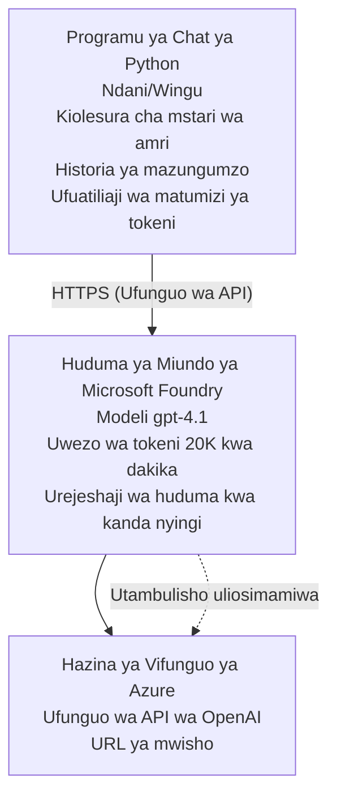

# Programu ya Mazungumzo ya Microsoft Foundry Models

**Njia ya Kujifunzia:** Wastani ⭐⭐ | **Muda:** 35-45 dakika | **Gharama:** $50-200/mwezi

Programu ya mazungumzo ya Microsoft Foundry Models iliyokamilika iliyowekwa kwa kutumia Azure Developer CLI (azd). Mfano huu unaonyesha uanzishaji wa gpt-4.1, ufikiaji salama wa API, na kiolesura rahisi cha mazungumzo.

## 🎯 Utakachojifunza

- Sambaza Microsoft Foundry Models Service na modeli gpt-4.1
- Linda funguo za OpenAI API kwa Key Vault
- Jenga kiolesura rahisi cha mazungumzo kwa Python
- Fuatilia matumizi ya tokeni na gharama
- Tekeleza ukomo wa kiwango na kushughulikia makosa

## 📦 Kile Kilichojumuishwa

✅ **Microsoft Foundry Models Service** - uanzishaji wa modeli gpt-4.1  
✅ **Python Chat App** - Kiolesura rahisi cha mazungumzo kwenye mstari wa amri  
✅ **Key Vault Integration** - Uhifadhi salama wa funguo za API  
✅ **ARM Templates** - Miundombinu kamili kama msimbo  
✅ **Cost Monitoring** - Ufuatiliaji wa matumizi ya tokeni  
✅ **Rate Limiting** - Kuzuia kumalizika kwa kiasi cha ruhusa  

## Usanifu


## Mahitaji

### Zinazohitajika

- **Azure Developer CLI (azd)** - [Mwongozo wa usakinishaji](https://learn.microsoft.com/azure/developer/azure-developer-cli/install-azd)
- **Azure subscription** with OpenAI access - [Omba ufikiaji](https://aka.ms/oai/access)
- **Python 3.9+** - [Sakinisha Python](https://www.python.org/downloads/)

### Thibitisha Mahitaji

```bash
# Angalia toleo la azd (linahitaji 1.5.0 au zaidi)
azd version

# Thibitisha kuingia kwa Azure
azd auth login

# Angalia toleo la Python
python --version  # au python3 --version

# Thibitisha upatikanaji wa OpenAI (angalia kwenye Azure Portal)
az cognitiveservices account list-skus \
  --kind OpenAI \
  --location eastus
```

> **⚠️ Muhimu:** Microsoft Foundry Models inahitaji idhini ya maombi. Ikiwa hujawaomba, tembelea [aka.ms/oai/access](https://aka.ms/oai/access). Uidhinishaji kawaida huchukua siku 1-2 za kazi.

## ⏱️ Muda wa Utekelezaji

| Awamu | Muda | Kinachotokea |
|-------|----------|--------------|
| Prerequisites check | 2-3 minutes | Thibitisha upatikanaji wa quota ya OpenAI |
| Deploy infrastructure | 8-12 minutes | Create OpenAI, Key Vault, model deployment |
| Configure application | 2-3 minutes | Set up environment and dependencies |
| **Total** | **12-18 minutes** | Ime tayari kuzungumza na gpt-4.1 |

**Kumbuka:** Utekelezaji wa OpenAI kwa mara ya kwanza unaweza kuchukua muda mrefu zaidi kutokana na upatikanaji wa modeli.

## Anza Haraka

```bash
# Nenda kwenye mfano
cd examples/azure-openai-chat

# Anzisha mazingira
azd env new myopenai

# Sambaza kila kitu (miundombinu + usanidi)
azd up
# Utaombwa kufanya:
# 1. Chagua usajili wa Azure
# 2. Chagua eneo lenye upatikanaji wa OpenAI (kwa mfano, eastus, eastus2, westus)
# 3. Subiri dakika 12–18 kwa ajili ya usambazaji

# Sakinisha utegemezi wa Python
pip install -r requirements.txt

# Anza kuzungumza!
python chat.py
```

**Matokeo Yanayotarajiwa:**
```
🤖 Microsoft Foundry Models Chat Application
Connected to: gpt-4.1 (eastus)
Type your message (or 'quit' to exit)

You: Hello! Tell me about Microsoft Foundry Models.
Assistant: Microsoft Foundry Models Service provides REST API access to OpenAI's powerful language models including gpt-4.1, GPT-3.5-Turbo, and Embeddings...

[Tokens used: 145 | Estimated cost: $0.0044]
```

## ✅ Thibitisha Utekelezaji

### Hatua 1: Angalia Rasilimali za Azure

```bash
# Tazama rasilimali zilizowekwa
azd show

# Matokeo yanayotarajiwa yanaonyesha:
# - Huduma ya OpenAI: (jina la rasilimali)
# - Hazina ya Funguo: (jina la rasilimali)
# - Uwekaji: gpt-4.1
# - Eneo: eastus (au eneo ulilochagua)
```

### Hatua 2: Jaribu API ya OpenAI

```bash
# Pata endpoint na ufunguo wa OpenAI
OPENAI_ENDPOINT=$(azd env get-value AZURE_OPENAI_ENDPOINT)
OPENAI_KEY=$(azd env get-value AZURE_OPENAI_API_KEY)

# Jaribu wito wa API
curl "$OPENAI_ENDPOINT/openai/deployments/gpt-4.1/chat/completions?api-version=2024-08-01-preview" \
  -H "Content-Type: application/json" \
  -H "api-key: $OPENAI_KEY" \
  -d '{
    "messages": [{"role": "user", "content": "Say hello!"}],
    "max_tokens": 50
  }'
```

**Majibu Yanayotarajiwa:**
```json
{
  "choices": [
    {
      "message": {
        "role": "assistant",
        "content": "Hello! How can I assist you today?"
      }
    }
  ],
  "usage": {
    "prompt_tokens": 8,
    "completion_tokens": 9,
    "total_tokens": 17
  }
}
```

### Hatua 3: Thibitisha Ufikiaji wa Key Vault

```bash
# Orodhesha siri katika Key Vault
KV_NAME=$(azd env get-value AZURE_KEY_VAULT_NAME)

az keyvault secret list \
  --vault-name $KV_NAME \
  --query "[].name" \
  --output table
```

**Siri Zinazotarajiwa:**
- `openai-api-key`
- `openai-endpoint`

**Vigezo vya Mafanikio:**
- ✅ Huduma ya OpenAI imesambazwa na gpt-4.1
- ✅ Mwito wa API unarudisha ukamilishaji halali
- ✅ Siri zimehifadhiwa katika Key Vault
- ✅ Ufuatiliaji wa matumizi ya tokeni unafanya kazi

## Muundo wa Mradi

```
azure-openai-chat/
├── README.md                   ✅ This guide
├── azure.yaml                  ✅ AZD configuration
├── infra/                      ✅ Infrastructure as Code
│   ├── main.bicep             ✅ Main Bicep template
│   ├── main.parameters.json   ✅ Parameters
│   └── openai.bicep           ✅ OpenAI resource definition
├── src/                        ✅ Application code
│   ├── chat.py                ✅ Chat interface
│   ├── config.py              ✅ Configuration loader
│   └── requirements.txt       ✅ Python dependencies
└── .gitignore                  ✅ Git ignore rules
```

## Vipengele vya Programu

### Kiolesura cha Mazungumzo (`chat.py`)

Programu ya mazungumzo inajumuisha:

- **Historia ya Mazungumzo** - Inadumisha muktadha kwenye ujumbe
- **Kuhesabu Tokeni** - Inafuatilia matumizi na kukadiria gharama
- **Kushughulikia Makosa** - Kushughulikia kwa utaratibu ukomo wa kiwango na makosa ya API
- **Kadiria Gharama** - Uhakiki wa gharama kwa wakati halisi kwa kila ujumbe
- **Msaada wa Mtiririko** - Majibu ya mtiririko ya hiari

### Amri

Wakati wa kuzungumza, unaweza kutumia:
- `quit` or `exit` - Maliza kikao
- `clear` - Futa historia ya mazungumzo
- `tokens` - Onyesha jumla ya matumizi ya tokeni
- `cost` - Onyesha gharama jumla inayokadiriwa

### Uwekaji Mipangilio (`config.py`)

Inapakia mipangilio kutoka kwa vigezo vya mazingira:
```python
AZURE_OPENAI_ENDPOINT  # Kutoka kwa Key Vault
AZURE_OPENAI_API_KEY   # Kutoka kwa Key Vault
AZURE_OPENAI_MODEL     # Chaguo-msingi: gpt-4.1
AZURE_OPENAI_MAX_TOKENS # Chaguo-msingi: 800
```

## Mifano ya Matumizi

### Basic Chat

```bash
python chat.py
```

### Chat with Custom Model

```bash
export AZURE_OPENAI_MODEL=gpt-35-turbo
python chat.py
```

### Chat with Streaming

```bash
python chat.py --stream
```

### Example Conversation

```
You: Explain Microsoft Foundry Models Service in 3 sentences.
Assistant: Microsoft Foundry Models Service is Microsoft Azure's cloud platform offering 
that provides access to OpenAI's powerful language models. It enables developers 
to integrate capabilities like gpt-4.1 into their applications with enterprise-grade 
security and compliance. The service includes features for content filtering, 
abuse monitoring, and responsible AI practices.

[Tokens used: 89 | Estimated cost: $0.0027]

You: What models are available?
Assistant: Microsoft Foundry Models Service offers several model families including gpt-4.1 
(most capable), GPT-3.5-Turbo (faster and cost-effective), and Embeddings models 
for vector search. Each model has different capabilities, pricing, and token limits.

[Tokens used: 67 | Estimated cost: $0.0020]

Total session: 156 tokens | $0.0047
```

## Usimamizi wa Gharama

### Bei za Tokeni (gpt-4.1)

| Modeli | Ingizo (kwa tokeni 1K) | Matokeo (kwa tokeni 1K) |
|-------|----------------------|------------------------|
| gpt-4.1 | $0.03 | $0.06 |
| GPT-3.5-Turbo | $0.0015 | $0.002 |

### Makisio ya Gharama za Mwezi

Kulingana na mifumo ya matumizi:

| Kiwango cha Matumizi | Ujumbe/Kila Siku | Tokeni/Kila Siku | Gharama ya Mwezi |
|-------------|--------------|------------|--------------|
| **Nyepesi** | 20 messages | 3,000 tokens | $3-5 |
| **Wastani** | 100 messages | 15,000 tokens | $15-25 |
| **Zito** | 500 messages | 75,000 tokens | $75-125 |

**Gharama ya Msingi ya Miundombinu:** $1-2/month (Key Vault + rasilimali ndogo za kompyuta)

### Vidokezo vya Kuongeza Ufanisi wa Gharama

```bash
# 1. Tumia GPT-3.5-Turbo kwa kazi rahisi (kwa gharama nafuu mara 20)
export AZURE_OPENAI_MODEL=gpt-35-turbo

# 2. Punguza idadi ya juu ya tokeni kwa majibu mafupi
export AZURE_OPENAI_MAX_TOKENS=400

# 3. Fuatilia matumizi ya tokeni
python chat.py --show-tokens

# 4. Sanidi arifa za bajeti
az consumption budget create \
  --budget-name "openai-budget" \
  --amount 50 \
  --time-grain Monthly
```

## Ufuatiliaji

### Tazama Matumizi ya Tokeni

```bash
# Katika Portal ya Azure:
# Rasilimali ya OpenAI → Metriki → Chagua "Token Transaction"

# Au kupitia Azure CLI:
az monitor metrics list \
  --resource $(azd env get-value AZURE_OPENAI_RESOURCE_ID) \
  --metric "TokenTransaction" \
  --start-time $(date -u -d '1 hour ago' '+%Y-%m-%dT%H:%M:%S') \
  --interval PT1M
```

### Tazama Rejista za API

```bash
# Tiririsha logi za uchunguzi
az monitor diagnostic-settings create \
  --resource $(azd env get-value AZURE_OPENAI_RESOURCE_ID) \
  --name openai-logs \
  --logs '[{"category": "Audit", "enabled": true}]' \
  --workspace $(azd env get-value LOG_ANALYTICS_WORKSPACE_ID)

# Logi za miulizo
az monitor log-analytics query \
  --workspace $(azd env get-value LOG_ANALYTICS_WORKSPACE_ID) \
  --analytics-query "AzureDiagnostics | where Category == 'Audit' | top 10 by TimeGenerated"
```

## Utatuzi wa Matatizo

### Tatizo: 'Access Denied'

**Dalili:** 403 Forbidden wakati wa kuita API

**Suluhisho:**
```bash
# 1. Thibitisha ufikiaji wa OpenAI umeidhinishwa
az cognitiveservices account show \
  --name $(azd env get-value AZURE_OPENAI_NAME) \
  --resource-group $(azd env get-value AZURE_RESOURCE_GROUP)

# 2. Angalia ufunguo wa API ni sahihi
azd env get-value AZURE_OPENAI_API_KEY

# 3. Thibitisha muundo wa URL ya endpoint
azd env get-value AZURE_OPENAI_ENDPOINT
# Inapaswa kuwa: https://[name].openai.azure.com/
```

### Tatizo: 'Rate Limit Exceeded'

**Dalili:** 429 Too Many Requests

**Suluhisho:**
```bash
# 1. Angalia kikomo cha sasa
az cognitiveservices account deployment show \
  --name $(azd env get-value AZURE_OPENAI_NAME) \
  --resource-group $(azd env get-value AZURE_RESOURCE_GROUP) \
  --deployment-name gpt-4.1

# 2. Omba ongezeko la kikomo (ikiwa inahitajika)
# Nenda kwenye Azure Portal → Rasilimali ya OpenAI → Vikomo → Omba Ongezeko

# 3. Tekeleza mantiki ya kujaribu tena (tayari ipo katika chat.py)
# Programu inajaribu tena kiotomatiki kwa kuchelewesha kwa idadi inayoongezeka
```

### Tatizo: 'Model Not Found'

**Dalili:** kosa la 404 kwa uanzishaji

**Suluhisho:**
```bash
# 1. Orodhesha utekelezaji yanayopatikana
az cognitiveservices account deployment list \
  --name $(azd env get-value AZURE_OPENAI_NAME) \
  --resource-group $(azd env get-value AZURE_RESOURCE_GROUP)

# 2. Thibitisha jina la modeli katika mazingira
echo $AZURE_OPENAI_MODEL

# 3. Sasisha hadi jina sahihi la utekelezaji
export AZURE_OPENAI_MODEL=gpt-4.1  # au gpt-35-turbo
```

### Tatizo: Ucheleweshaji Mkubwa

**Dalili:** Nyakati za majibu polepole (>5 sekunde)

**Suluhisho:**
```bash
# 1. Angalia ucheleweshaji wa kikanda
# Weka kwenye eneo lililo karibu zaidi na watumiaji

# 2. Punguza max_tokens ili kupata majibu ya haraka
export AZURE_OPENAI_MAX_TOKENS=400

# 3. Tumia utiririshaji kwa uzoefu bora wa mtumiaji
python chat.py --stream
```

## Mbinu Bora za Usalama

### 1. Linda Funguo za API

```bash
# Usiweka funguo kwenye udhibiti wa chanzo
# Tumia Key Vault (tayari imesanidiwa)

# Badilisha funguo mara kwa mara
az cognitiveservices account keys regenerate \
  --name $(azd env get-value AZURE_OPENAI_NAME) \
  --resource-group $(azd env get-value AZURE_RESOURCE_GROUP) \
  --key-name key1
```

### 2. Tekeleza Uchakataji wa Yaliyomo

```python
# Microsoft Foundry Models ina vichujio vya maudhui vilivyojengwa ndani
# Sanidi kwenye Azure Portal:
# Rasilimali ya OpenAI → Vichujio vya Maudhui → Unda Chujio Maalum

# Aina: Chuki, Ngono, Ukatili, Kujidhuru
# Viwango vya kuchuja: Chini, Kati, Juu
```

### 3. Tumia Managed Identity (uzalishaji)

```bash
# Kwa utoaji wa uzalishaji, tumia utambulisho uliosimamiwa
# Badala ya funguo za API (inahitaji programu kuendeshwa kwenye Azure)

# Sasisha infra/openai.bicep ili ijumuishe:
# identity: { type: 'SystemAssigned' }
```

## Uendelezaji

### Endesha Kwenye Kompyuta Yako

```bash
# Sakinisha mategemezi
pip install -r src/requirements.txt

# Weka vigezo vya mazingira
export AZURE_OPENAI_ENDPOINT="https://[name].openai.azure.com/"
export AZURE_OPENAI_API_KEY="your-api-key"
export AZURE_OPENAI_MODEL="gpt-4.1"

# Endesha programu
python src/chat.py
```

### Endesha Majaribio

```bash
# Sakinisha mategemeo ya mtihani
pip install pytest pytest-cov

# Endesha mitihani
pytest tests/ -v

# Kwa ufunikaji
pytest tests/ --cov=src --cov-report=html
```

### Sasisha Utekelezaji wa Modeli

```bash
# Weka toleo tofauti la modeli
az cognitiveservices account deployment create \
  --name $(azd env get-value AZURE_OPENAI_NAME) \
  --resource-group $(azd env get-value AZURE_RESOURCE_GROUP) \
  --deployment-name gpt-35-turbo \
  --model-name gpt-35-turbo \
  --model-version "0613" \
  --model-format OpenAI \
  --sku-capacity 20 \
  --sku-name "Standard"
```

## Kusafisha

```bash
# Futa rasilimali zote za Azure
azd down --force --purge

# Hii inaondoa:
# - Huduma ya OpenAI
# - Key Vault (na ufutaji mpole wa siku 90)
# - Kundi la Rasilimali
# - Utekelezaji wote na usanidi
```

## Hatua Zifuatazo

### Panua Mfano Huu

1. **Ongeza Kiolesura cha Wavuti** - Build React/Vue frontend
   ```bash
   # Ongeza huduma ya frontend kwenye azure.yaml
   # Weka kwenye Azure Static Web Apps
   ```

2. **Tekeleza RAG** - Ongeza utafutaji wa nyaraka kwa Azure AI Search
   ```python
   # Unganisha Azure Cognitive Search
   # Pakia nyaraka na unda indeksi ya vektri
   ```

3. **Ongeza Kuitwa kwa Funsi** - Wezesha matumizi ya zana
   ```python
   # Fafanua kazi ndani ya chat.py
   # Ruhusu gpt-4.1 kuita API za nje
   ```

4. **Msaada wa Modeli Nyingi** - Sambaza modeli nyingi
   ```bash
   # Ongeza gpt-35-turbo na modeli za embeddings
   # Tekeleza mantiki ya uelekezaji wa modeli
   ```

### Mifano Inayohusiana

- **[Retail Multi-Agent](../retail-scenario.md)** - Usanifu wa wakala wengi wa juu
- **[Database App](../../../../examples/database-app)** - Ongeza uhifadhi wa kudumu
- **[Container Apps](../../../../examples/container-app)** - Sambaza kama huduma ya kontena

### Rasilimali za Kujifunzia

- 📚 [AZD For Beginners Course](../../README.md) - ukurasa kuu wa kozi
- 📚 [Microsoft Foundry Models Documentation](https://learn.microsoft.com/azure/ai-services/openai/) - Nyaraka rasmi
- 📚 [OpenAI API Reference](https://platform.openai.com/docs/api-reference) - Maelezo ya API
- 📚 [Responsible AI](https://www.microsoft.com/ai/responsible-ai) - Mbinu bora

## Rasilimali Zaidi

### Nyaraka
- **[Microsoft Foundry Models Service](https://learn.microsoft.com/azure/ai-services/openai/)** - Mwongozo kamili
- **[gpt-4.1 Models](https://learn.microsoft.com/azure/ai-services/openai/concepts/models)** - Uwezo wa modeli
- **[Content Filtering](https://learn.microsoft.com/azure/ai-services/openai/concepts/content-filter)** - Vipengele vya usalama
- **[Azure Developer CLI](https://learn.microsoft.com/azure/developer/azure-developer-cli/)** - azd reference

### Mafunzo
- **[OpenAI Quickstart](https://learn.microsoft.com/azure/ai-services/openai/quickstart)** - Utekelezaji wa kwanza
- **[Chat Completions](https://learn.microsoft.com/azure/ai-services/openai/how-to/chatgpt)** - Kujenga programu za mazungumzo
- **[Function Calling](https://learn.microsoft.com/azure/ai-services/openai/how-to/function-calling)** - Vipengele vya juu

### Zana
- **[Microsoft Foundry Models Studio](https://oai.azure.com/)** - Uwanja wa majaribio wa wavuti
- **[Prompt Engineering Guide](https://platform.openai.com/docs/guides/prompt-engineering)** - Kuandika maagizo bora
- **[Token Calculator](https://platform.openai.com/tokenizer)** - Kadiria matumizi ya tokeni

### Jamii
- **[Azure AI Discord](https://discord.gg/azure)** - Pata msaada kutoka kwa jamii
- **[GitHub Discussions](https://github.com/Azure-Samples/openai/discussions)** - Jukwaa la maswali na majibu
- **[Azure Blog](https://azure.microsoft.com/blog/tag/azure-openai-service/)** - Sasisho za hivi karibuni

---

**🎉 Hongera!** Umesambaza Microsoft Foundry Models na kujenga programu ya mazungumzo inayofanya kazi. Anza kuchunguza uwezo wa gpt-4.1 na jaribu maagizo na matumizi tofauti.

**Maswali?** [Fungua tatizo](https://github.com/microsoft/AZD-for-beginners/issues) au angalia [FAQ](../../resources/faq.md)

**Onyo la Gharama:** Kumbuka kuendesha `azd down` ukimaliza majaribio ili kuepuka malipo yanayoendelea (~$50-100/mwezi kwa matumizi endelevu).

---

<!-- CO-OP TRANSLATOR DISCLAIMER START -->
**Disclaimer**:
Nyaraka hii imetafsiriwa kwa kutumia huduma ya tafsiri ya AI [Co-op Translator](https://github.com/Azure/co-op-translator). Wakati tunajitahidi kuwa sahihi, tafadhali fahamu kwamba tafsiri za kiotomatiki zinaweza kuwa na makosa au upungufu wa usahihi. Nyaraka ya asili katika lugha yake ya asili inapaswa kuchukuliwa kama chanzo cha mamlaka. Kwa taarifa muhimu, inapendekezwa kupata tafsiri ya kitaalamu ya binadamu. Hatuwajibiki kwa kutoelewana au tafsiri potofu zitokanazo na matumizi ya tafsiri hii.
<!-- CO-OP TRANSLATOR DISCLAIMER END -->