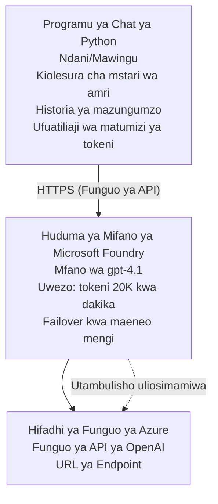

# Microsoft Foundry Models Programu ya Mazungumzo

**Njia ya Kujifunza:** Kati ⭐⭐ | **Muda:** 35-45 dakika | **Gharama:** $50-200/mwezi

Programu kamili ya mazungumzo ya Microsoft Foundry Models iliyosambazwa kwa kutumia Azure Developer CLI (azd). Mfano huu unaonyesha uanzishaji wa gpt-4.1, upatikanaji salama wa API, na kiolesura rahisi cha mazungumzo.

## 🎯 Utajifunza

- Sambaza huduma ya Microsoft Foundry Models na modeli gpt-4.1
- Linda funguo za OpenAI API kwa Key Vault
- Jenga kiolesura rahisi cha mazungumzo kwa Python
- Fuata matumizi ya tokeni na gharama
- Tekeleza ukomo wa viwango (rate limiting) na usimamizi wa makosa

## 📦 Kinachojumuishwa

✅ **Microsoft Foundry Models Service** - uanzishaji wa modeli gpt-4.1  
✅ **Python Chat App** - Kiolesura rahisi cha mazungumzo katika mstari wa amri  
✅ **Key Vault Integration** - Uhifadhi salama wa funguo za API  
✅ **ARM Templates** - Miundombinu kamili kama msimbo  
✅ **Cost Monitoring** - Ufuatiliaji wa matumizi ya tokeni  
✅ **Rate Limiting** - Kuzuia kumalizika kwa quota  

## Architecture



## Mahitaji

### Inahitajika

- **Azure Developer CLI (azd)** - [Mwongozo wa usakinishaji](https://learn.microsoft.com/azure/developer/azure-developer-cli/install-azd)
- **Azure subscription** yenye upatikanaji wa OpenAI - [Omba upatikanaji](https://aka.ms/oai/access)
- **Python 3.9+** - [Sakinisha Python](https://www.python.org/downloads/)

### Thibitisha Mahitaji

```bash
# Angalia toleo la azd (linahitaji 1.5.0 au zaidi)
azd version

# Thibitisha umeingia kwenye Azure
azd auth login

# Angalia toleo la Python
python --version  # au python3 --version

# Thibitisha ufikiaji wa OpenAI (angalia kwenye Azure Portal)
az cognitiveservices account list-skus \
  --kind OpenAI \
  --location eastus
```

> **⚠️ Muhimu:** Microsoft Foundry Models inahitaji idhini ya uteuzi. Ikiwa haujawaomba, tembelea [aka.ms/oai/access](https://aka.ms/oai/access). Idhini kwa kawaida huchukua siku 1-2 za biashara.

## ⏱️ Ratiba ya Uwekaji

| Awamu | Muda | Kinachotokea |
|-------|----------|--------------|
| Kukagua mahitaji | 2-3 dakika | Thibitisha upatikanaji wa quota ya OpenAI |
| Sambaza miundombinu | 8-12 dakika | Tengeneza huduma ya OpenAI, Key Vault, uanzishaji wa modeli |
| Sanidi programu | 2-3 dakika | Weka mazingira na utegemezi |
| **Jumla** | **12-18 dakika** | Tayari kuzungumza na gpt-4.1 |

**Kumbuka:** Uwekaji wa kwanza wa OpenAI unaweza kuchukua muda mrefu zaidi kutokana na upatanisho wa modeli.

## Anza Haraka

```bash
# Nenda kwenye mfano
cd examples/azure-openai-chat

# Anzisha mazingira
azd env new myopenai

# Sambaza kila kitu (miundombinu + usanidi)
azd up
# Utaulizwa kufanya:
# 1. Chagua usajili wa Azure
# 2. Chagua eneo lenye upatikanaji wa OpenAI (kwa mfano: eastus, eastus2, westus)
# 3. Subiri dakika 12-18 kwa ajili ya usambazaji

# Sakinisha utegemezi wa Python
pip install -r requirements.txt

# Anza kuzungumza!
python chat.py
```

**Matokeo Yanayotarajiwa:**
```
🤖 Microsoft Foundry Models Chat Application
Connected to: gpt-4.1 (eastus)
Type your message (or 'quit' to exit)

You: Hello! Tell me about Microsoft Foundry Models.
Assistant: Microsoft Foundry Models Service provides REST API access to OpenAI's powerful language models including gpt-4.1, GPT-3.5-Turbo, and Embeddings...

[Tokens used: 145 | Estimated cost: $0.0044]
```

## ✅ Thibitisha Uwekaji

### Hatua 1: Kagua Rasilimali za Azure

```bash
# Tazama rasilimali zilizowekwa
azd show

# Matokeo yanayotarajiwa yanaonyesha:
# - Huduma ya OpenAI: (jina la rasilimali)
# - Hazina ya Funguo: (jina la rasilimali)
# - Utekelezaji: gpt-4.1
# - Eneo: eastus (au eneo ulilochagua)
```

### Hatua 2: Jaribu API ya OpenAI

```bash
# Pata endpoint na ufunguo wa OpenAI
OPENAI_ENDPOINT=$(azd env get-value AZURE_OPENAI_ENDPOINT)
OPENAI_KEY=$(azd env get-value AZURE_OPENAI_API_KEY)

# Jaribu mwito wa API
curl "$OPENAI_ENDPOINT/openai/deployments/gpt-4.1/chat/completions?api-version=2024-08-01-preview" \
  -H "Content-Type: application/json" \
  -H "api-key: $OPENAI_KEY" \
  -d '{
    "messages": [{"role": "user", "content": "Say hello!"}],
    "max_tokens": 50
  }'
```

**Majibu Yanayotarajiwa:**
```json
{
  "choices": [
    {
      "message": {
        "role": "assistant",
        "content": "Hello! How can I assist you today?"
      }
    }
  ],
  "usage": {
    "prompt_tokens": 8,
    "completion_tokens": 9,
    "total_tokens": 17
  }
}
```

### Hatua 3: Thibitisha Upatikanaji wa Key Vault

```bash
# Orodhesha siri katika Key Vault
KV_NAME=$(azd env get-value AZURE_KEY_VAULT_NAME)

az keyvault secret list \
  --vault-name $KV_NAME \
  --query "[].name" \
  --output table
```

**Siri Zinazotarajiwa:**
- `openai-api-key`
- `openai-endpoint`

**Vigezo vya Mafanikio:**
- ✅ Huduma ya OpenAI imesambazwa na gpt-4.1
- ✅ Wito wa API hurejesha ukamilisho halali
- ✅ Siri zimehifadhiwa kwenye Key Vault
- ✅ Ufuatiliaji wa matumizi ya tokeni unafanya kazi

## Muundo wa Mradi

```
azure-openai-chat/
├── README.md                   ✅ This guide
├── azure.yaml                  ✅ AZD configuration
├── infra/                      ✅ Infrastructure as Code
│   ├── main.bicep             ✅ Main Bicep template
│   ├── main.parameters.json   ✅ Parameters
│   └── openai.bicep           ✅ OpenAI resource definition
├── src/                        ✅ Application code
│   ├── chat.py                ✅ Chat interface
│   ├── config.py              ✅ Configuration loader
│   └── requirements.txt       ✅ Python dependencies
└── .gitignore                  ✅ Git ignore rules
```

## Vipengele vya Programu

### Kiolesura cha Mazungumzo (`chat.py`)

Programu ya mazungumzo inajumuisha:

- **Historia ya Mazungumzo** - Inadumisha muktadha kati ya ujumbe
- **Uhesabu wa Tokeni** - Inafuata matumizi na kukadiria gharama
- **Usimamizi wa Makosa** - Usimamizi mzuri wa vikwazo vya viwango na makosa ya API
- **Kadirio la Gharama** - Mwenendo wa wakati halisi wa kuhesabu gharama kwa ujumbe
- **Msaada wa Streaming** - Majibu ya mtiririko ya hiari

### Amri

Wakati wa kuzungumza, unaweza kutumia:
- `quit` or `exit` - Maliza kikao
- `clear` - Futa historia ya mazungumzo
- `tokens` - Onyesha jumla ya matumizi ya tokeni
- `cost` - Onyesha gharama jumla inayokadiriwa

### Usanidi (`config.py`)

Inapakia usanidi kutoka kwa vigezo vya mazingira:
```python
AZURE_OPENAI_ENDPOINT  # Kutoka kwenye Key Vault
AZURE_OPENAI_API_KEY   # Kutoka kwenye Key Vault
AZURE_OPENAI_MODEL     # Chaguo-msingi: gpt-4.1
AZURE_OPENAI_MAX_TOKENS # Chaguo-msingi: 800
```

## Mifano ya Matumizi

### Mazungumzo Msingi

```bash
python chat.py
```

### Mazungumzo na Modeli ya Kibinafsi

```bash
export AZURE_OPENAI_MODEL=gpt-35-turbo
python chat.py
```

### Mazungumzo kwa Mtiririko

```bash
python chat.py --stream
```

### Mfano wa Mazungumzo

```
You: Explain Microsoft Foundry Models Service in 3 sentences.
Assistant: Microsoft Foundry Models Service is Microsoft Azure's cloud platform offering 
that provides access to OpenAI's powerful language models. It enables developers 
to integrate capabilities like gpt-4.1 into their applications with enterprise-grade 
security and compliance. The service includes features for content filtering, 
abuse monitoring, and responsible AI practices.

[Tokens used: 89 | Estimated cost: $0.0027]

You: What models are available?
Assistant: Microsoft Foundry Models Service offers several model families including gpt-4.1 
(most capable), GPT-3.5-Turbo (faster and cost-effective), and Embeddings models 
for vector search. Each model has different capabilities, pricing, and token limits.

[Tokens used: 67 | Estimated cost: $0.0020]

Total session: 156 tokens | $0.0047
```

## Usimamizi wa Gharama

### Bei za Tokeni (gpt-4.1)

| Model | Ingizo (kwa 1K tokeni) | Utoke (kwa 1K tokeni) |
|-------|----------------------|------------------------|
| gpt-4.1 | $0.03 | $0.06 |
| GPT-3.5-Turbo | $0.0015 | $0.002 |

### Makadirio ya Gharama za Mwezi

Kulingana na mifumo ya matumizi:

| Kiwango cha Matumizi | Ujumbe/Kwa Siku | Tokeni/Kwa Siku | Gharama ya Mwezi |
|-------------|--------------|------------|--------------|
| **Nyepesi** | 20 ujumbe | 3,000 tokeni | $3-5 |
| **Wastani** | 100 ujumbe | 15,000 tokeni | $15-25 |
| **Mzito** | 500 ujumbe | 75,000 tokeni | $75-125 |

**Gharama ya Miundombinu Msingi:** $1-2/mwezi (Key Vault + hesabu ndogo)

### Vidokezo vya Kupunguza Gharama

```bash
# 1. Tumia GPT-3.5-Turbo kwa kazi rahisi (nafuu mara 20)
export AZURE_OPENAI_MODEL=gpt-35-turbo

# 2. Punguza idadi ya juu ya tokeni kwa majibu mafupi
export AZURE_OPENAI_MAX_TOKENS=400

# 3. Fuatilia matumizi ya tokeni
python chat.py --show-tokens

# 4. Sanidi arifu za bajeti
az consumption budget create \
  --budget-name "openai-budget" \
  --amount 50 \
  --time-grain Monthly
```

## Ufuatiliaji

### Tazama Matumizi ya Tokeni

```bash
# Katika Portal ya Azure:
# Rasilimali ya OpenAI → Metriki → Chagua "Muamala wa Tokeni"

# Au kupitia Azure CLI:
az monitor metrics list \
  --resource $(azd env get-value AZURE_OPENAI_RESOURCE_ID) \
  --metric "TokenTransaction" \
  --start-time $(date -u -d '1 hour ago' '+%Y-%m-%dT%H:%M:%S') \
  --interval PT1M
```

### Tazama Rekodi za API

```bash
# Tiririsha kumbukumbu za uchunguzi
az monitor diagnostic-settings create \
  --resource $(azd env get-value AZURE_OPENAI_RESOURCE_ID) \
  --name openai-logs \
  --logs '[{"category": "Audit", "enabled": true}]' \
  --workspace $(azd env get-value LOG_ANALYTICS_WORKSPACE_ID)

# Kumbukumbu za maombi
az monitor log-analytics query \
  --workspace $(azd env get-value LOG_ANALYTICS_WORKSPACE_ID) \
  --analytics-query "AzureDiagnostics | where Category == 'Audit' | top 10 by TimeGenerated"
```

## Utatuzi wa Matatizo

### Tatizo: "Access Denied" Error

**Dalili:** 403 Forbidden wakati wa kuita API

**Suluhisho:**
```bash
# 1. Thibitisha kuwa ufikiaji wa OpenAI umeidhinishwa
az cognitiveservices account show \
  --name $(azd env get-value AZURE_OPENAI_NAME) \
  --resource-group $(azd env get-value AZURE_RESOURCE_GROUP)

# 2. Hakikisha ufunguo wa API ni sahihi
azd env get-value AZURE_OPENAI_API_KEY

# 3. Thibitisha muundo wa URL ya endpoint
azd env get-value AZURE_OPENAI_ENDPOINT
# Inapaswa kuwa: https://[name].openai.azure.com/
```

### Tatizo: "Rate Limit Exceeded"

**Dalili:** 429 Too Many Requests

**Suluhisho:**
```bash
# 1. Angalia ukomo wa sasa
az cognitiveservices account deployment show \
  --name $(azd env get-value AZURE_OPENAI_NAME) \
  --resource-group $(azd env get-value AZURE_RESOURCE_GROUP) \
  --deployment-name gpt-4.1

# 2. Omba ongezeko la ukomo (ikiwa inahitajika)
# Nenda kwenye Portal ya Azure → Rasilimali ya OpenAI → Vikomo → Omba Ongezeko

# 3. Tekeleza mantiki ya jaribu tena (tayari iko katika chat.py)
# Programu inajaribu tena kiotomatiki kwa kuchelewesha kwa namna ya eksponentiali
```

### Tatizo: "Model Not Found"

**Dalili:** hitilafu 404 kwa uanzishaji

**Suluhisho:**
```bash
# 1. Orodhesha uenezaji unaopatikana
az cognitiveservices account deployment list \
  --name $(azd env get-value AZURE_OPENAI_NAME) \
  --resource-group $(azd env get-value AZURE_RESOURCE_GROUP)

# 2. Thibitisha jina la modeli katika mazingira
echo $AZURE_OPENAI_MODEL

# 3. Sasisha hadi jina sahihi la uenezaji
export AZURE_OPENAI_MODEL=gpt-4.1  # au gpt-35-turbo
```

### Tatizo: Ucheleweshaji Mkubwa

**Dalili:** Nyakati za majibu polepole (>5 sekunde)

**Suluhisho:**
```bash
# 1. Angalia uchelewaji wa kikanda
# Sambaza kwenye kanda iliyo karibu zaidi na watumiaji

# 2. Punguza max_tokens ili kupata majibu ya haraka
export AZURE_OPENAI_MAX_TOKENS=400

# 3. Tumia mtiririko wa data kwa uzoefu bora wa mtumiaji
python chat.py --stream
```

## Mazoea Bora ya Usalama

### 1. Linda Funguo za API

```bash
# Usiwahi kufanya commit ya funguo katika udhibiti wa toleo
# Tumia Key Vault (imesanidiwa tayari)

# Badilisha funguo mara kwa mara
az cognitiveservices account keys regenerate \
  --name $(azd env get-value AZURE_OPENAI_NAME) \
  --resource-group $(azd env get-value AZURE_RESOURCE_GROUP) \
  --key-name key1
```

### 2. Tekeleza Uchanjuzi wa Maudhui

```python
# Microsoft Foundry Models inajumuisha uchujaji wa yaliyomo uliojengewa ndani
# Sanidi kwenye Portal ya Azure:
# Rasilimali ya OpenAI → Vichujio vya yaliyomo → Unda Chujio Maalum

# Makundi: Chuki, Ngono, Vurugu, Kujidhuru mwenyewe
# Viwango: Uchujaji mdogo, wa kati, wa juu
```

### 3. Tumia Managed Identity (Uzalisaji)

```bash
# Kwa utoaji wa uzalishaji, tumia kitambulisho kinachosimamiwa
# badala ya funguo za API (inahitaji kuendesha programu kwenye Azure)

# Sasisha infra/openai.bicep ili ijumuishe:
# identity: { type: 'SystemAssigned' }
```

## Maendeleo

### Endesha Kwenye Kifaa Chako

```bash
# Sakinisha utegemezi
pip install -r src/requirements.txt

# Weka vigezo vya mazingira
export AZURE_OPENAI_ENDPOINT="https://[name].openai.azure.com/"
export AZURE_OPENAI_API_KEY="your-api-key"
export AZURE_OPENAI_MODEL="gpt-4.1"

# Endesha programu
python src/chat.py
```

### Endesha Majaribio

```bash
# Sakinisha utegemezi wa mtihani
pip install pytest pytest-cov

# Endesha mitihani
pytest tests/ -v

# Kwa ufunikaji
pytest tests/ --cov=src --cov-report=html
```

### Sasisha Uwekaji wa Modeli

```bash
# Sambaza toleo tofauti la modeli
az cognitiveservices account deployment create \
  --name $(azd env get-value AZURE_OPENAI_NAME) \
  --resource-group $(azd env get-value AZURE_RESOURCE_GROUP) \
  --deployment-name gpt-35-turbo \
  --model-name gpt-35-turbo \
  --model-version "0613" \
  --model-format OpenAI \
  --sku-capacity 20 \
  --sku-name "Standard"
```

## Safisha

```bash
# Futa rasilimali zote za Azure
azd down --force --purge

# Hii inaondoa:
# - Huduma ya OpenAI
# - Key Vault (kufutwa kwa muda kwa siku 90)
# - Kundi la Rasilimali
# - Uzinduzi na usanidi vyote
```

## Hatua Zifuatazo

### Panua Mfano Huu

1. **Add Web Interface** - Build React/Vue frontend
   ```bash
   # Ongeza huduma ya frontend kwenye azure.yaml
   # Sambaza kwenye Azure Static Web Apps
   ```

2. **Implement RAG** - Add document search with Azure AI Search
   ```python
   # Unganisha Azure AI Search
   # Pakia nyaraka na tengeneza faharasa ya vekta
   ```

3. **Add Function Calling** - Enable tool use
   ```python
   # Fafanua kazi katika chat.py
   # Mruhusu gpt-4.1 kuita API za nje
   ```

4. **Multi-Model Support** - Deploy multiple models
   ```bash
   # Ongeza gpt-35-turbo, mifano ya embeddings
   # Tekeleza mantiki ya kuelekeza modeli
   ```

### Mifano Zinazohusiana

- **[Retail Multi-Agent](../retail-scenario.md)** - Mimariko ya multi-agent ya juu
- **[Database App](../../../../examples/database-app)** - Ongeza uhifadhi wa kudumu
- **[Container Apps](../../../../examples/container-app)** - Sambaza kama huduma iliyohifadhiwa ndani ya kontena

### Vyanzo vya Kujifunza

- 📚 [AZD For Beginners Course](../../README.md) - Nyumbani wa kozi kuu
- 📚 [Microsoft Foundry Models Documentation](https://learn.microsoft.com/azure/ai-services/openai/) - Nyaraka rasmi
- 📚 [OpenAI API Reference](https://platform.openai.com/docs/api-reference) - Maelezo ya API
- 📚 [Responsible AI](https://www.microsoft.com/ai/responsible-ai) - Vidokezo bora

## Rasilimali Zaidi

### Nyaraka
- **[Microsoft Foundry Models Service](https://learn.microsoft.com/azure/ai-services/openai/)** - Mwongozo kamili
- **[gpt-4.1 Models](https://learn.microsoft.com/azure/ai-services/openai/concepts/models)** - Uwezo wa modeli
- **[Content Filtering](https://learn.microsoft.com/azure/ai-services/openai/concepts/content-filter)** - Vipengele vya usalama
- **[Azure Developer CLI](https://learn.microsoft.com/azure/developer/azure-developer-cli/)** - Marejeleo ya azd

### Mafunzo
- **[OpenAI Quickstart](https://learn.microsoft.com/azure/ai-services/openai/quickstart)** - Uwekaji wa kwanza
- **[Chat Completions](https://learn.microsoft.com/azure/ai-services/openai/how-to/chatgpt)** - Kujenga programu za mazungumzo
- **[Function Calling](https://learn.microsoft.com/azure/ai-services/openai/how-to/function-calling)** - Vipengele vya juu

### Zana
- **[Microsoft Foundry Models Studio](https://oai.azure.com/)** - Uwanja wa mtandaoni
- **[Prompt Engineering Guide](https://platform.openai.com/docs/guides/prompt-engineering)** - Kuandika prompts bora
- **[Token Calculator](https://platform.openai.com/tokenizer)** - Kadiria matumizi ya tokeni

### Jamii
- **[Azure AI Discord](https://discord.gg/azure)** - Pata msaada kutoka kwa jamii
- **[GitHub Discussions](https://github.com/Azure-Samples/openai/discussions)** - Jukwaa la maswali na majibu
- **[Azure Blog](https://azure.microsoft.com/blog/tag/azure-openai-service/)** - Sasisho za hivi karibuni

---

**🎉 Mafanikio!** Umesambaza Microsoft Foundry Models na kujenga programu ya mazungumzo inayofanya kazi. Anza kuchunguza uwezo wa gpt-4.1 na jaribu prompts na matumizi tofauti.

**Maswali?** [Fungua tatizo](https://github.com/microsoft/AZD-for-beginners/issues) au angalia [FAQ](../../resources/faq.md)

**Onyo la Gharama:** Kumbuka kuendesha `azd down` baada ya kumaliza majaribio ili kuepuka malipo ya kuendelea (~$50-100/mwezi kwa matumizi ya kawaida).

---

<!-- CO-OP TRANSLATOR DISCLAIMER START -->
**Kionyozo**:
Hati hii imetafsiriwa kwa kutumia huduma ya tafsiri ya AI [Co-op Translator](https://github.com/Azure/co-op-translator). Ingawa tunajitahidi kupata usahihi, tafadhali fahamu kwamba tafsiri za kiotomatiki zinaweza kuwa na makosa au upungufu wa usahihi. Hati ya asili katika lugha yake halisi inapaswa kuchukuliwa kama chanzo cha mamlaka. Kwa taarifa muhimu, tafsiri ya kitaalamu inayofanywa na binadamu inapendekezwa. Hatutojibu kwa kuelewa vibaya au tafsiri potofu zinazotokea kutokana na matumizi ya tafsiri hii.
<!-- CO-OP TRANSLATOR DISCLAIMER END -->