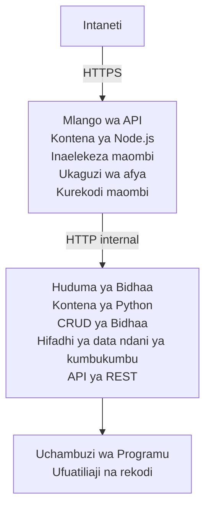

# Usanifu wa Microservices - Mfano wa Container App

⏱️ **Wakati Uliokadiriwa**: 25-35 dakika | 💰 **Gharama Iliyokadiriwa**: ~$50-100/mwezi | ⭐ **Ugumu**: Juu

Mfumo wa **microservices uliorahisishwa lakini unaofanya kazi** umewekwa kwenye Azure Container Apps kwa kutumia AZD CLI. Mfano huu unaonyesha mawasiliano kati ya huduma, upangaji wa kontena, na ufuatiliaji kwa usanidi wa vitendo wa huduma 2.

> **📚 Njia ya Kujifunza**: Mfano huu unaanza na usanifu mdogo wa huduma 2 (API Gateway + Backend Service) ambao unaweza kuutumia na kujifunza kutoka kwako. Baada ya kumiliki msingi huu, tunatoa mwongozo wa kupanua hadi ekosistimu kamili ya microservices.

## Unachotajifunza

Kwa kukamilisha mfano huu, utakapata:
- Zindua kontena nyingi kwenye Azure Container Apps
- Tekeleza mawasiliano kati ya huduma kwa mtandao wa ndani
- Sanidi upanuaji unaotegemea mazingira na ukaguzi wa afya
- Fuatilia programu zilizoenea kwa Application Insights
- Elewa mifumo ya upeleka microservices na mbinu bora
- Jifunze upanuaji wa hatua kwa hatua kutoka rahisi hadi tata

## Usanifu

### Awamu ya 1: Tunachojenga (Kimejumuishwa katika Mfano Huu)


**Kwanini Kuanzia Rahisi?**
- ✅ Zindua na kuelewa haraka (25-35 dakika)
- ✅ Jifunze mifumo ya msingi ya microservices bila ugumu
- ✅ Msimbo unaofanya kazi ambao unaweza kuubadilisha na kujaribu
- ✅ Gharama ya chini kwa kujifunza (~$50-100/mwezi dhidi ya $300-1400/mwezi)
- ✅ Jenga kujiamini kabla ya kuongeza hifadhidata na foleni za ujumbe

**Mfano**: Fikiria kama kujifunza kuendesha gari. Unaanza na uwanja wa kuegesha tupu (huduma 2), unatilia ujuzi wa msingi, kisha unasonga mbele hadi trafiki ya mji (huduma 5+ na hifadhidata).

### Awamu ya 2: Upanuzi wa Baadaye (Usanifu wa Marejeleo)

Mara utakapomiliki usanifu wa huduma 2, unaweza kupanua kwa:

```
Full Architecture (Not Included - For Reference)
├── API Gateway (✅ Included)
├── Product Service (✅ Included)
├── Order Service (🔜 Add next)
├── User Service (🔜 Add next)
├── Notification Service (🔜 Add last)
├── Azure Service Bus (🔜 For async communication)
├── Cosmos DB (🔜 For product persistence)
├── Azure SQL (🔜 For order management)
└── Azure Storage (🔜 For file storage)
```

Angalia sehemu "Expansion Guide" mwishoni kwa maelekezo ya hatua kwa hatua.

## Vipengele Vilivyomo

✅ **Ugunduzi wa Huduma**: Ugunduzi wa moja kwa moja kwa kutumia DNS kati ya kontena  
✅ **Kugawanya Mzigo**: Kugawanya mzigo kilichojengwa kwa replicas  
✅ **Kuongezeka kwa Kiotomatiki**: Kupanuka kwa huduma binafsi kulingana na ombi za HTTP  
✅ **Ufuatiliaji wa Afya**: Probes za liveness na readiness kwa huduma zote mbili  
✅ **Uandishi wa Matukio Ulioenea**: Uandishi wa matukio uliojitokeza kwa Application Insights  
✅ **Mtandao wa Ndani**: Mawasiliano salama kati ya huduma  
✅ **Upangaji wa Kontena**: Upeleka na upanuaji wa kiotomatiki  
✅ **Sasisho Bila Kusimamisha**: Sasisho za mizunguko na usimamizi wa matoleo  

## Mahitaji Kabla ya Kuanzia

### Zana Zinazohitajika

Kabla ya kuanza, thibitisha umeweka zana hizi:

1. **[Azure Developer CLI (azd)](https://learn.microsoft.com/azure/developer/azure-developer-cli/install-azd)** (toleo 1.0.0 au juu zaidi)
   ```bash
   azd version
   # Matokeo yaliyotarajiwa: toleo la azd 1.0.0 au la juu zaidi
   ```

2. **[Azure CLI](https://learn.microsoft.com/cli/azure/install-azure-cli)** (toleo 2.50.0 au juu zaidi)
   ```bash
   az --version
   # Matokeo yanayotarajiwa: azure-cli 2.50.0 au toleo la juu zaidi
   ```

3. **[Docker](https://www.docker.com/get-started)** (kwa maendeleo/majibu ya ndani - hiari)
   ```bash
   docker --version
   # Matokeo yanayotarajiwa: toleo la Docker 20.10 au zaidi
   ```

### Mahitaji ya Azure

- Usajili unaofanya kazi wa **Azure** ([unda akaunti bure](https://azure.microsoft.com/free/))
- Ruhusa za kuunda rasilimali ndani ya usajili wako
- Nafasi ya **Contributor** kwenye usajili au kikundi cha rasilimali

### Maarifa Yanayohitajika

Huu ni mfano wa **ngazi ya juu**. Unapaswa kuwa:
- Umefanya [Simple Flask API example](../../../../../examples/container-app/simple-flask-api) 
- Uelewa wa msingi wa usanifu wa microservices
- Uzoefu na REST APIs na HTTP
- Uelewa wa dhana za kontena

**Mpya kwa Container Apps?** Anza na [Simple Flask API example](../../../../../examples/container-app/simple-flask-api) kwanza ili kujifunza mambo ya msingi.

## Anza Haraka (Hatua kwa Hatua)

### Hatua 1: Clone na Elekea

```bash
git clone https://github.com/microsoft/AZD-for-beginners.git
cd AZD-for-beginners/examples/container-app/microservices
```

**✓ Ukaguzi wa Mafanikio**: Thibitisha unaona `azure.yaml`:
```bash
ls
# Inatarajiwa: README.md, azure.yaml, infra/, src/
```

### Hatua 2: Thibitisha Utambulisho na Azure

```bash
azd auth login
```

Hii itafungua kivinjari chako kwa ajili ya uthibitishaji wa Azure. Ingia kwa vitambulisho vyako vya Azure.

**✓ Ukaguzi wa Mafanikio**: Unapaswa kuona:
```
Logged in to Azure.
```

### Hatua 3: Anzisha Mazingira

```bash
azd init
```

**Maswali utakayoyaona**:
- **Environment name**: Weka jina fupi (mfano, `microservices-dev`)
- **Azure subscription**: Chagua usajili wako
- **Azure location**: Chagua eneo (mfano, `eastus`, `westeurope`)

**✓ Ukaguzi wa Mafanikio**: Unapaswa kuona:
```
SUCCESS: New project initialized!
```

### Hatua 4: Zeeka Miundombinu na Huduma

```bash
azd up
```

**Kinachotokea** (kinachochukua dakika 8-12):
1. Inaunda mazingira ya Container Apps
2. Inaunda Application Insights kwa ufuatiliaji
3. Inajenga kontena ya API Gateway (Node.js)
4. Inajenga kontena ya Product Service (Python)
5. Inapeleka kontena zote mbili kwenye Azure
6. Inasakinisha mtandao na ukaguzi wa afya
7. Inaweka ufuatiliaji na uandishi wa matukio

**✓ Ukaguzi wa Mafanikio**: Unapaswa kuona:
```
SUCCESS: Your application was deployed to Azure in X minutes Y seconds.
Endpoint: https://api-gateway-<unique-id>.azurecontainerapps.io
```

**⏱️ Wakati**: 8-12 dakika

### Hatua 5: Jaribu Uwekaji

```bash
# Pata mwisho wa lango
GATEWAY_URL=$(azd env get-values | grep API_GATEWAY_URL | cut -d '=' -f2 | tr -d '"')

# Jaribu afya ya lango la API
curl $GATEWAY_URL/health

# Matokeo yanayotarajiwa:
# {"hali":"yenye afya","huduma":"lango-la-api","wakati":"2025-11-19T10:30:00Z"}
```

**Jaribu huduma ya product kupitia gateway**:
```bash
# Orodhesha bidhaa
curl $GATEWAY_URL/api/products

# Matokeo yanayotarajiwa:
# [
#   {"id":1,"name":"Kompyuta mpakato","price":999.99,"stock":50},
#   {"id":2,"name":"Panya","price":29.99,"stock":200},
#   {"id":3,"name":"Kibodi","price":79.99,"stock":150}
# ]
```

**✓ Ukaguzi wa Mafanikio**: Mipaka yote miwili inarudisha data ya JSON bila makosa.

---

**🎉 Hongera!** Umepeleka usanifu wa microservices kwenye Azure!

## Muundo wa Mradi

Faili zote za utekelezaji zimo—huu ni mfano kamili unaofanya kazi:

```
microservices/
│
├── README.md                         # This file
├── azure.yaml                        # AZD configuration
├── .gitignore                        # Git ignore patterns
│
├── infra/                           # Infrastructure as Code (Bicep)
│   ├── main.bicep                   # Main orchestration
│   ├── abbreviations.json           # Naming conventions
│   ├── core/                        # Shared infrastructure
│   │   ├── container-apps-environment.bicep  # Container environment + registry
│   │   └── monitor.bicep            # Application Insights + Log Analytics
│   └── app/                         # Service definitions
│       ├── api-gateway.bicep        # API Gateway container app
│       └── product-service.bicep    # Product Service container app
│
└── src/                             # Application source code
    ├── api-gateway/                 # Node.js API Gateway
    │   ├── app.js                   # Express server with routing
    │   ├── package.json             # Node dependencies
    │   └── Dockerfile               # Container definition
    └── product-service/             # Python Product Service
        ├── main.py                  # Flask API with product data
        ├── requirements.txt         # Python dependencies
        └── Dockerfile               # Container definition
```

**Kila Kipengele Kinatenda Nini:**

**Infrastructure (infra/)**:
- `main.bicep`: Inapanga rasilimali zote za Azure na utegemezi wake
- `core/container-apps-environment.bicep`: Inaunda mazingira ya Container Apps na Azure Container Registry
- `core/monitor.bicep`: Inatengeneza Application Insights kwa uandishi wa matukio ulioenea
- `app/*.bicep`: Maelezo ya kila container app zenye upanuaji na ukaguzi wa afya

**API Gateway (src/api-gateway/)**:
- Huduma inayokabiliwa na umma inayopangisha mahitaji kwa huduma za nyuma
- Inatekeleza uandishi wa matukio, utatuzi wa makosa, na upitishaji wa ombi
- Inaonyesha mawasiliano ya HTTP kati ya huduma

**Product Service (src/product-service/)**:
- Huduma ya ndani yenye katalogi ya bidhaa (kwa kumbukumbu ya ndani kwa urahisi)
- REST API yenye ukaguzi wa afya
- Mfano wa muundo wa huduma za nyuma

## Muhtasari wa Huduma

### API Gateway (Node.js/Express)

**Port**: 8080  
**Ufikiaji**: Umma (ingress ya nje)  
**Madhumuni**: Inapanga maombi yanayoingia kwa huduma za nyuma zinazofaa  

**Endpoints**:
- `GET /` - Taarifa za huduma
- `GET /health` - Endpoint ya ukaguzi wa afya
- `GET /api/products` - Pitia kwa product service (orodhesha zote)
- `GET /api/products/:id` - Pitia kwa product service (pata kwa ID)

**Vipengele Vikuu**:
- Upangishaji wa maombi kwa kutumia axios
- Uandishi wa matukio uliojumlishwa
- Utatuzi wa makosa na usimamizi wa muda wa kusubiri
- Ugunduzi wa huduma kupitia vigezo vya mazingira
- Uunganisho wa Application Insights

**Mstari wa Msimbo** (`src/api-gateway/app.js`):
```javascript
// Mawasiliano ya ndani ya huduma
app.get('/api/products', async (req, res) => {
  const response = await axios.get(`${PRODUCT_SERVICE_URL}/products`);
  res.json(response.data);
});
```

### Product Service (Python/Flask)

**Port**: 8000  
**Ufikiaji**: Ndani pekee (hakuna ingress ya nje)  
**Madhumuni**: Inasimamia katalogi ya bidhaa kwa data ya kumbukumbu ya ndani  

**Endpoints**:
- `GET /` - Taarifa za huduma
- `GET /health` - Endpoint ya ukaguzi wa afya
- `GET /products` - Orodhesha bidhaa zote
- `GET /products/<id>` - Pata bidhaa kwa ID

**Vipengele Vikuu**:
- RESTful API kwa Flask
- Hazina ya bidhaa katika kumbukumbu ya ndani (rahisi, haina hifadhidata)
- Ufuatiliaji wa afya kwa probes
- Uandishi wa matukio uliopangwa
- Uunganisho wa Application Insights

**Mfano wa Data**:
```python
{
  "id": 1,
  "name": "Laptop",
  "description": "High-performance laptop",
  "price": 999.99,
  "stock": 50
}
```

**Kwanini Ndani Pekee?**
Huduma ya product haijafunguliwa kwa umma. Maombi yote lazima yapitie kupitia API Gateway, ambayo hutoa:
- Usalama: Sehemu ya udhibiti wa upatikanaji
- Uwezo wa kubadilisha: Inaweza kubadilisha backend bila kuathiri wateja
- Ufuatiliaji: Uandishi wa ombi uliokusanywa katikati

## Kuelewa Mawasiliano ya Huduma

### Huduma Zinasemekana Vipi

Katika mfano huu, API Gateway inawasiliana na Product Service kwa kutumia **miito ya HTTP ya ndani**:

```javascript
// Mlango wa API (src/api-gateway/app.js)
const PRODUCT_SERVICE_URL = process.env.PRODUCT_SERVICE_URL;

// Fanya ombi la HTTP la ndani
const response = await axios.get(`${PRODUCT_SERVICE_URL}/products`);
```

**Mambo Muhimu**:

1. **Ugunduzi unaotegemea DNS**: Container Apps hutoa kwa moja DNS kwa huduma za ndani
   - Product Service FQDN: `product-service.internal.<environment>.azurecontainerapps.io`
   - Imefanywa rahisi kama: `http://product-service` (Container Apps inaiamua)

2. **Hakuna Ufuniko wa Umma**: Product Service ina `external: false` katika Bicep
   - Inapatikana tu ndani ya mazingira ya Container Apps
   - Haiwezi kufikiwa kutoka intaneti

3. **Vigezo vya Mazingira**: URL za huduma zinaingizwa wakati wa upeleka
   - Bicep hupitisha FQDN ya ndani kwa gateway
   - Hakuna URL zilioandikwa moja kwa moja katika msimbo wa programu

**Mfano**: Fikiria hii kama chumba za ofisi. API Gateway ni dawati la mapokezi (linakabiliwa na umma), na Product Service ni chumba cha ofisi (ndani pekee). Wageni lazima wapitie mapokezi kufika ofisini.

## Chaguzi za Upelekaji

### Upelekaji Kamili (Inayopendekezwa)

```bash
# Weka miundombinu na huduma zote mbili
azd up
```

Hii inaweka:
1. Mazingira ya Container Apps
2. Application Insights
3. Container Registry
4. Kontena ya API Gateway
5. Kontena ya Product Service

**Wakati**: 8-12 dakika

### Zeeka Huduma Pamoja

```bash
# Sambaza huduma moja tu (baada ya azd up ya awali)
azd deploy api-gateway

# Au sambaza huduma ya bidhaa
azd deploy product-service
```

**Matumizi**: Unapotengeneza msimbo katika huduma moja na unataka kupeleka tena tu huduma hiyo.

### Sasisha Usanidi

```bash
# Badilisha vigezo vya upanuzi
azd env set GATEWAY_MAX_REPLICAS 30

# Weka tena kwa usanidi mpya
azd up
```

## Usanidi

### Usanidi wa Upanuaji

Huduma zote zimewekwa na upanuaji wa kiotomatiki unaotegemea HTTP katika faili zao za Bicep:

**API Gateway**:
- Nakala ndogo: 2 (daima angalau 2 kwa upatikanaji)
- Nakala kubwa: 20
- Kichocheo cha upanuaji: maombi 50 sambamba kwa replica

**Product Service**:
- Nakala ndogo: 1 (inaweza kupanuka hadi sifuri ikiwa inahitajika)
- Nakala kubwa: 10
- Kichocheo cha upanuaji: maombi 100 sambamba kwa replica

**Binafsisha Upanuaji** (katika `infra/app/*.bicep`):
```bicep
scale: {
  minReplicas: 1
  maxReplicas: 10
  rules: [
    {
      name: 'http-scale-rule'
      http: {
        metadata: {
          concurrentRequests: '100'  // Adjust this
        }
      }
    }
  ]
}
```

### Ugawaji wa Rasilimali

**API Gateway**:
- CPU: 1.0 vCPU
- Memory: 2 GiB
- Sababu: Inashughulikia trafiki yote ya nje

**Product Service**:
- CPU: 0.5 vCPU
- Memory: 1 GiB
- Sababu: Operesheni nyepesi kwenye kumbukumbu ya ndani

### Ukaguzi wa Afya

Huduma zote mbili zinajumuisha probes za liveness na readiness:

```bicep
probes: [
  {
    type: 'Liveness'
    httpGet: {
      path: '/health'
      port: 8080
    }
    initialDelaySeconds: 10
    periodSeconds: 30
  }
  {
    type: 'Readiness'
    httpGet: {
      path: '/health'
      port: 8080
    }
    initialDelaySeconds: 5
    periodSeconds: 10
  }
]
```

**Hii Inamaanisha Nini**:
- **Liveness**: Ikiwa ukaguzi wa afya unashindwa, Container Apps inarejesha tena kontena
- **Readiness**: Ikiwa haijatayarishwa, Container Apps haitapanga tena trafiki kwa replica hiyo


## Ufuatiliaji & Uwezo wa Kuonekana

### Tazama Logi za Huduma

```bash
# Tazama logi kwa kutumia azd monitor
azd monitor --logs

# Au tumia Azure CLI kwa ajili ya Container Apps maalum:
# Tiririsha logi kutoka kwa API Gateway
az containerapp logs show --name api-gateway --resource-group $RG_NAME --follow

# Tazama logi za hivi karibuni za huduma ya bidhaa
az containerapp logs show --name product-service --resource-group $RG_NAME --tail 100
```

**Matokeo Yanayotarajiwa**:
```
[api-gateway] API Gateway listening on port 8080
[api-gateway] Product Service URL: http://product-service
[api-gateway] GET /api/products 200 - 45ms
[product-service] Retrieved 5 products
```

### Maswali ya Application Insights

Fikia Application Insights kwenye Azure Portal, kisha endesha maswali haya:

**Pata Maombi Polepole**:
```kusto
requests
| where timestamp > ago(1h)
| where duration > 1000  // Requests taking >1 second
| summarize count() by name, cloud_RoleName
| order by count_ desc
```

**Fuata Miito kati ya Huduma**:
```kusto
dependencies
| where timestamp > ago(1h)
| where type == "Http"
| project timestamp, name, target, duration, success
| order by timestamp desc
```

**Kiwango cha Makosa kwa Huduma**:
```kusto
exceptions
| where timestamp > ago(24h)
| summarize errorCount = count() by cloud_RoleName, type
| order by errorCount desc
```

**Kiasi cha Maombi Kwa Muda**:
```kusto
requests
| where timestamp > ago(1h)
| summarize requestCount = count() by bin(timestamp, 5m), cloud_RoleName
| render timechart
```

### Fikia Dashibodi ya Ufuatiliaji

```bash
# Pata maelezo ya Application Insights
azd env get-values | grep APPLICATIONINSIGHTS

# Fungua ufuatiliaji wa Portal ya Azure
az monitor app-insights component show \
  --app $(azd env get-values | grep APPLICATIONINSIGHTS_CONNECTION_STRING | cut -d '=' -f2) \
  --resource-group $(azd env get-values | grep AZURE_RESOURCE_GROUP | cut -d '=' -f2) \
  --query "appId" -o tsv
```

### Metrics za Moja kwa Moja

1. Elekea Application Insights kwenye Azure Portal
2. Bonyeza "Live Metrics"
3. Tazama maombi ya wakati halisi, kushindwa, na utendaji
4. Jaribu kwa kuendesha: `curl $(azd env get-values | grep API_GATEWAY_URL | cut -d '=' -f2 | tr -d '"')/api/products`

## Mazoezi ya Vitendo

[Note: See full exercises above in the "Practical Exercises" section for detailed step-by-step exercises including deployment verification, data modification, autoscaling tests, error handling, and adding a third service.]

## Uchambuzi wa Gharama

### Gharama Zinazokadiriwa za Mwezi (Kwa Mfano Huu wa Huduma 2)

| Resource | Configuration | Estimated Cost |
|----------|--------------|----------------|
| API Gateway | 2-20 replicas, 1 vCPU, 2GB RAM | $30-150 |
| Product Service | 1-10 replicas, 0.5 vCPU, 1GB RAM | $15-75 |
| Container Registry | Basic tier | $5 |
| Application Insights | 1-2 GB/month | $5-10 |
| Log Analytics | 1 GB/month | $3 |
| **Total** | | **$58-243/month** |

**Ugbaaji wa Gharama kwa Matumizi**:
- **Trafiki ya chini** (majaribio/kujifunza): ~$60/mwezi
- **Trafiki ya wastani** (uzalishaji mdogo): ~$120/mwezi
- **Trafiki ya juu** (nyakati za shughuli nyingi): ~$240/mwezi

### Vidokezo vya Kupunguza Gharama

1. **Punguza hadi Sifuri kwa Maendeleo**:
   ```bicep
   scale: {
     minReplicas: 0  // Save $30-40/month when not in use
     maxReplicas: 10
   }
   ```

2. **Tumia Mpango wa Consumption kwa Cosmos DB** (unapoiweka):
   - Lipa tu kwa unachotumia
   - Hakuna malipo ya chini

3. **Weka Sampuli ya Application Insights**:
   ```javascript
   appInsights.defaultClient.config.samplingPercentage = 50; // Chagua sampuli ya 50% ya maombi
   ```

4. **Futa Unapotohitaji**:
   ```bash
   azd down
   ```

### Chaguzi za Tier ya Bure

Kwa kujifunza/kujaribu, fikiria:
- Tumia mikopo ya bure ya Azure (siku 30 za kwanza)
- Weka nakala kwa kiwango cha chini
- Futa baada ya upimaji (hakuna malipo yanayoendelea)

---

## Usafishaji

Ili kuepuka malipo yanayoendelea, futa rasilimali zote:

```bash
azd down --force --purge
```

**Ombi la Uthibitisho**:
```
? Total resources to delete: 6, are you sure you want to continue? (y/N)
```

Andika `y` ili kuthibitisha.

**Vinavyofutwa**:
- Container Apps Environment
- Both Container Apps (gateway & product service)
- Container Registry
- Application Insights
- Log Analytics Workspace
- Resource Group

**✓ Thibitisha Usafishaji**:
```bash
az group list --query "[?starts_with(name,'rg-microservices')]" --output table
```

Inapaswa kurudisha tupu.

---

## Mwongozo wa Upanuzi: Kutoka Huduma 2 hadi 5+

Mara tu utakapojifunza usanifu huu wa huduma 2, hapa ni jinsi ya kupanua:

### Awamu ya 1: Ongeza Uhifadhi wa Database (Hatua Inayofuata)

**Ongeza Cosmos DB kwa Huduma ya Bidhaa**:

1. Tengeneza `infra/core/cosmos.bicep`:
   ```bicep
   resource cosmosAccount 'Microsoft.DocumentDB/databaseAccounts@2023-04-15' = {
     name: name
     location: location
     kind: 'GlobalDocumentDB'
     properties: {
       databaseAccountOfferType: 'Standard'
       locations: [{ locationName: location, failoverPriority: 0 }]
     }
   }
   ```

2. Sasisha huduma ya bidhaa ili itumie Cosmos DB badala ya data iliyo kwenye kumbukumbu ya muda (in-memory)

3. Gharama ya ziada inayokadiriwa: ~$25/mwezi (serverless)

### Awamu ya 2: Ongeza Huduma ya Tatu (Usimamizi wa Oda)

**Tengeneza Huduma ya Oda**:

1. Folda mpya: `src/order-service/` (Python/Node.js/C#)
2. Bicep mpya: `infra/app/order-service.bicep`
3. Sasisha API Gateway ili iweze kuelekeza `/api/orders`
4. Ongeza Azure SQL Database kwa ajili ya uhifadhi wa oda

**Usanifu unakuwa**:
```
API Gateway → Product Service (Cosmos DB)
           → Order Service (Azure SQL)
```

### Awamu ya 3: Ongeza Mawasiliano Asynchronous (Service Bus)

**Tekeleza Usanifu unaotegemea Matukio**:

1. Ongeza Azure Service Bus: `infra/core/servicebus.bicep`
2. Huduma ya Bidhaa inachapisha matukio ya "ProductCreated"
3. Huduma ya Oda inajiandikisha kwa matukio ya bidhaa
4. Ongeza Huduma ya Arifa ili kusindika matukio

**Mfumo**: Ombi/Jawabu (HTTP) + Unaotegemea Matukio (Service Bus)

### Awamu ya 4: Ongeza Uthibitishaji wa Mtumiaji

**Tekeleza Huduma ya Mtumiaji**:

1. Tengeneza `src/user-service/` (Go/Node.js)
2. Ongeza Azure AD B2C au uthibitishaji wa JWT uliofanywa kwa desturi
3. API Gateway inathibitisha tokeni
4. Huduma zinakagua ruhusa za mtumiaji

### Awamu ya 5: Kujiandaa kwa Uzalishaji

**Ongeza Vipengele Hivi**:
- Azure Front Door (usawazishaji wa mzigo wa kimataifa)
- Azure Key Vault (usimamizi wa siri)
- Azure Monitor Workbooks (dashibodi za desturi)
- Mtiririko wa CI/CD (GitHub Actions)
- Uwekaji wa Blue-Green
- Utambulisho uliosimamiwa kwa huduma zote

**Gharama ya Usanifu Kamili wa Uzalishaji**: ~$300-1,400/mwezi

---

## Jifunze Zaidi

### Nyaraka Zinazohusiana
- [Nyaraka za Azure Container Apps](https://learn.microsoft.com/azure/container-apps/)
- [Mwongozo wa Usanifu wa Microservices](https://learn.microsoft.com/azure/architecture/guide/architecture-styles/microservices)
- [Application Insights kwa Ufuatiliaji Uliosambazwa](https://learn.microsoft.com/azure/azure-monitor/app/distributed-tracing)
- [Nyaraka za Azure Developer CLI](https://learn.microsoft.com/azure/developer/azure-developer-cli/)

### Hatua Zifuatazo katika Kozi Hii
- ← Iliyotangulia: [API Rahisi ya Flask](../../../../../examples/container-app/simple-flask-api) - Mfano wa mwanzo wa kontena moja
- → Ifuatayo: [Mwongozo wa Uunganishaji wa AI](../../../../../examples/docs/ai-foundry) - Ongeza uwezo wa AI
- 🏠 [Nyumbani kwa Kozi](../../README.md)

### Ulinganisho: Wakati wa Kutumia Nini

**App ya Kontena Moja** (Mfano wa Simple Flask API):
- ✅ Programu rahisi
- ✅ Usanifu wa monolithic
- ✅ Haraka kupeleka
- ❌ Uwezo mdogo wa kupanuka
- **Gharama**: ~$15-50/mwezi

**Microservices** (Mfano huu):
- ✅ Programu ngumu
- ✅ Kupanuliwa kwa kujitegemea kwa kila huduma
- ✅ Uhuru wa timu (huduma tofauti, timu tofauti)
- ❌ Inazidi kuwa ngumu kusimamia
- **Gharama**: ~$60-250/mwezi

**Kubernetes (AKS)**:
- ✅ Udhibiti na unyumbufu wa juu zaidi
- ✅ Uwezo wa kubebeka kwa mazingira mengi ya wingu (multi-cloud)
- ✅ Mitandao ya hali ya juu
- ❌ Inahitaji utaalamu wa Kubernetes
- **Gharama**: ~$150-500/mwezi (chini kabisa)

**Ushauri**: Anza na Container Apps (mfano huu), hamisha kwenda AKS tu ikiwa unahitaji vipengele maalum vya Kubernetes.

---

## Maswali Yanayoulizwa Mara kwa Mara

**Q: Kwa nini huduma 2 tu badala ya 5+?**  
A: Mchakato wa kielimu. Jifunze misingi (mawasiliano ya huduma, ufuatiliaji, kupanuka) kwa mfano rahisi kabla ya kuongeza ugumu. Mifumo unayoijifunza hapa inatumika kwa usanifu wa huduma 100.

**Q: Je, naweza kuongeza huduma zaidi mwenyewe?**  
A: Kabisa! Fuata mwongozo wa upanuzi hapo juu. Huduma mpya kila moja hufuata muundo ule ule: tengeneza folda ya src, tengeneza faili la Bicep, sasisha azure.yaml, na peleka.

**Q: Je, hii iko tayari kwa uzalishaji?**  
A: Ni msingi imara. Kwa uzalishaji, ongeza: utambulisho uliosimamiwa, Key Vault, hifadhidata za kudumu, mtiririko wa CI/CD, arifu za ufuatiliaji, na mkakati wa nakala ya akiba.

**Q: Kwa nini usitumie Dapr au service mesh nyingine?**  
A: Weka rahisi kwa ajili ya kujifunza. Ukisahau mitandao ya asili ya Container Apps, unaweza kuongeza Dapr kwa matukio ya hali ya juu.

**Q: Ninawezaje kusugua (debug) mahali hapa ndani?**  
A: Endesha huduma ndani ya eneo lako kwa kutumia Docker:
```bash
cd src/api-gateway
docker build -t local-gateway .
docker run -p 8080:8080 -e PRODUCT_SERVICE_URL=http://localhost:8000 local-gateway
```

**Q: Je, naweza kutumia lugha tofauti za programu?**  
A: Ndiyo! Mfano huu unaonyesha Node.js (gateway) + Python (product service). Unaweza kuchanganya lugha zozote zinazoweza kuendesha ndani ya kontena.

**Q: Nikiwa sina mikopo ya Azure?**  
A: Tumia kiwango cha bure cha Azure (siku 30 za kwanza kwa akaunti mpya) au weka kwa ajili ya vipimo vya muda mfupi na faka mara moja.

---

> **🎓 Muhtasari wa Njia ya Kujifunza**: Umejifunza kupeleka usanifu wa huduma nyingi ukiwa na upanuaji wa moja kwa moja, mtandao wa ndani, ufuatiliaji wa katikati, na mifumo inayokaribia uzalishaji. Msingi huu unakuandaa kwa mifumo tata iliyosambazwa na usanifu wa microservices wa kibiashara.

**📚 Urambazaji wa Kozi:**
- ← Iliyotangulia: [API Rahisi ya Flask](../../../../../examples/container-app/simple-flask-api)
- → Ifuatayo: [Mfano wa Muunganisho wa Database](../../../../../examples/database-app)
- 🏠 [Nyumbani kwa Kozi](../../../README.md)
- 📖 [Mbinu Bora za Container Apps](../../../docs/chapter-04-infrastructure/deployment-guide.md)

---

<!-- CO-OP TRANSLATOR DISCLAIMER START -->
**Taarifa ya kutokuwa na dhamana**:
Waraka huu umetafsiriwa kwa kutumia huduma ya tafsiri ya AI [Co-op Translator](https://github.com/Azure/co-op-translator). Ingawa tunajitahidi kuhakikisha usahihi, tafadhali fahamu kwamba tafsiri za kiotomatiki zinaweza kuwa na makosa au kutokuwa sahihi. Waraka asili kwa lugha yake ya asili unapaswa kuzingatiwa kama chanzo cha mamlaka. Kwa taarifa muhimu, inapendekezwa kutumia tafsiri ya mtaalamu wa kibinadamu. Sisi hatuwajibiki kwa kutokuelewana au ufafanuzi usio sahihi unaotokana na matumizi ya tafsiri hii.
<!-- CO-OP TRANSLATOR DISCLAIMER END -->