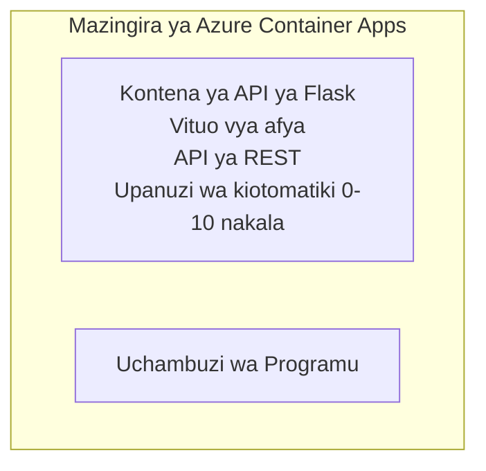

# Simple Flask API - Container App Example

**Njia ya Kujifunza:** Mwanzo ⭐ | **Wakati:** 25-35 dakika | **Gharama:** $0-15/mwezi

API kamili ya Python Flask REST inayofanya kazi iliyowekwa kwenye Azure Container Apps kwa kutumia Azure Developer CLI (azd). Mfano huu unaonyesha uenezaji wa kontena, utofautishaji wa ukubwa kiotomatiki, na misingi ya ufuatiliaji.

## 🎯 Kile Utakachojifunza

- Tumia programu ya Python iliyowekwa ndani ya kontena kwenye Azure
- Sanidi utofautishaji wa ukubwa kiotomatiki na kuskalia hadi sifuri
- Tekeleza vipimo vya afya na ukaguzi wa usomaji
- Fuata kumbukumbu za programu na vipimo
- Tumia Azure Developer CLI kwa uenezaji wa haraka

## 📦 Kile Kilicho Jumuishwa

✅ **Programu ya Flask** - REST API kamili yenye operesheni za CRUD (`src/app.py`)  
✅ **Dockerfile** - Usanidi wa kontena kwa uzalishaji  
✅ **Bicep Infrastructure** - Mazingira ya Container Apps na uenezaji wa API  
✅ **AZD Configuration** - Usanidi wa uenezaji kwa amri moja  
✅ **Health Probes** - Ukaguzi wa uhai na usomaji umewekwa  
✅ **Auto-scaling** - nakala 0-10 kulingana na mzigo wa HTTP  

## Architecture


## Mahitaji

### Inahitajika
- **Azure Developer CLI (azd)** - [Mwongozo wa usakinishaji](https://learn.microsoft.com/azure/developer/azure-developer-cli/install-azd)
- **Usajili wa Azure** - [Akaunti ya bure](https://azure.microsoft.com/free/)
- **Docker Desktop** - [Sakinisha Docker](https://www.docker.com/products/docker-desktop/) (kwa majaribio ya ndani)

### Thibitisha Mahitaji

```bash
# Angalia toleo la azd (inahitaji 1.5.0 au juu zaidi)
azd version

# Thibitisha kuingia kwa Azure
azd auth login

# Angalia Docker (hiari, kwa majaribio ya ndani)
docker --version
```

## ⏱️ Muda wa Uenezaji

| Phase | Duration | What Happens |
|-------|----------|--------------||
| Environment setup | 30 seconds | Create azd environment |
| Build container | 2-3 minutes | Docker build Flask app |
| Provision infrastructure | 3-5 minutes | Create Container Apps, registry, monitoring |
| Deploy application | 2-3 minutes | Push image and deploy to Container Apps |
| **Total** | **8-12 minutes** | Complete deployment ready |

## Hatua za Haraka

```bash
# Nenda kwenye mfano
cd examples/container-app/simple-flask-api

# Anzisha mazingira (chagua jina la kipekee)
azd env new myflaskapi

# Sambaza kila kitu (miundombinu + programu)
azd up
# Utaombwa kufanya:
# 1. Chagua usajili wa Azure
# 2. Chagua eneo (kwa mfano, eastus2)
# 3. Subiri dakika 8-12 kwa ajili ya usambazaji

# Pata kiungo cha API yako
azd env get-values

# Jaribu API yako
curl $(azd env get-value API_ENDPOINT)/health
```

**Matokeo Yanayotarajiwa:**
```json
{
  "status": "healthy",
  "timestamp": "2025-11-19T10:30:00Z",
  "service": "simple-flask-api",
  "version": "1.0.0"
}
```

## ✅ Thibitisha Uenezaji

### Hatua 1: Angalia Hali ya Uenezaji

```bash
# Tazama huduma zilizowekwa
azd show

# Matokeo yanayotarajiwa yanaonyesha:
# - Huduma: api
# - Nukta ya mwisho: https://ca-api-[env].xxx.azurecontainerapps.io
# - Hali: Inafanya kazi
```

### Hatua 2: Jaribu Mipaka ya API

```bash
# Pata endpoint ya API
API_URL=$(azd env get-value API_ENDPOINT)

# Jaribu hali ya afya
curl $API_URL/health

# Jaribu endpoint ya mzizi
curl $API_URL/

# Unda kipengee
curl -X POST $API_URL/api/items \
  -H "Content-Type: application/json" \
  -d '{"name": "Test Item", "description": "My first item"}'

# Pata vipengee vyote
curl $API_URL/api/items
```

**Vigezo vya Mafanikio:**
- ✅ Endpoint ya afya inarudisha HTTP 200
- ✅ Endpoint ya mzizi inaonyesha habari za API
- ✅ POST inaunda kipengee na kurudisha HTTP 201
- ✅ GET inarudisha vitu vilivyoundwa

### Hatua 3: Tazama Kumbukumbu

```bash
# Tiririsha kumbukumbu za moja kwa moja kwa kutumia azd monitor
azd monitor --logs

# Au tumia Azure CLI:
az containerapp logs show --name api --resource-group $RG_NAME --follow

# Unapaswa kuona:
# - Ujumbe za kuanzishwa za Gunicorn
# - Kumbukumbu za maombi ya HTTP
# - Kumbukumbu za taarifa za programu
```

## Muundo wa Mradi

```
simple-flask-api/
├── azure.yaml              # AZD configuration
├── infra/
│   ├── main.bicep         # Main infrastructure
│   ├── main.parameters.json
│   └── app/
│       ├── container-env.bicep
│       └── api.bicep
└── src/
    ├── app.py             # Flask application
    ├── requirements.txt
    └── Dockerfile
```

## Mipaka ya API

| Endpoint | Method | Description |
|----------|--------|-------------|
| `/health` | GET | Ukaguzi wa afya |
| `/api/items` | GET | Orodhesha vitu vyote |
| `/api/items` | POST | Tengeneza kipengee kipya |
| `/api/items/{id}` | GET | Pata kipengee maalum |
| `/api/items/{id}` | PUT | Sasisha kipengee |
| `/api/items/{id}` | DELETE | Futa kipengee |

## Uundaji

### Mabadiliko ya Mazingira

```bash
# Weka usanidi maalum
azd env set PORT 8000
azd env set LOG_LEVEL info
azd env set MAX_REPLICAS 20
```

### Usanidi wa Utofautishaji wa Ukubwa

API inajisalia inaweza kubadilika kiotomatiki kulingana na trafiki ya HTTP:
- **Min Replicas**: 0 (inaskalia hadi sifuri wakati pasipo shughuli)
- **Max Replicas**: 10
- **Concurrent Requests per Replica**: 50

## Maendeleo

### Endesha Kwenye Mashine Yako

```bash
# Sakinisha utegemezi
cd src
pip install -r requirements.txt

# Endesha programu
python app.py

# Jaribu kwa kompyuta ya ndani
curl http://localhost:8000/health
```

### Jenga na Jaribu Kontena

```bash
# Jenga picha ya Docker
docker build -t flask-api:local ./src

# Endesha kontena kwenye mashine ya ndani
docker run -p 8000:8000 flask-api:local

# Jaribu kontena
curl http://localhost:8000/health
```

## Uenezaji

### Uenezaji Kamili

```bash
# Sambaza miundombinu na programu
azd up
```

### Uenezaji wa Msimbo Pekee

```bash
# Weka tu msimbo wa programu (miundombinu haijabadilika)
azd deploy api
```

### Sasisha Usanidi

```bash
# Sasisha vigezo vya mazingira
azd env set API_KEY "new-api-key"

# Zindua upya kwa usanidi mpya
azd deploy api
```

## Ufuatiliaji

### Tazama Kumbukumbu

```bash
# Tiririsha kumbukumbu za wakati halisi ukitumia azd monitor
azd monitor --logs

# Au tumia Azure CLI kwa Container Apps:
az containerapp logs show --name api --resource-group $RG_NAME --follow

# Tazama mistari 100 ya mwisho
az containerapp logs show --name api --resource-group $RG_NAME --tail 100
```

### Fuatilia Vipimo

```bash
# Fungua dashibodi ya Azure Monitor
azd monitor --overview

# Tazama vipimo maalum
az monitor metrics list \
  --resource $(azd show --output json | jq -r '.services.api.resourceId') \
  --metric "Requests,ResponseTime"
```

## Kupima

### Ukaguzi wa Afya

```bash
curl $(azd show --output json | jq -r '.services.api.endpoint')/health
```

Jibu linalotarajiwa:
```json
{
  "status": "healthy",
  "timestamp": "2025-11-19T10:30:00Z"
}
```

### Tengeneza Kipengee

```bash
curl -X POST $(azd show --output json | jq -r '.services.api.endpoint')/api/items \
  -H "Content-Type: application/json" \
  -d '{"name": "Test Item", "description": "A test item"}'
```

### Pata Vitu Vyote

```bash
curl $(azd show --output json | jq -r '.services.api.endpoint')/api/items
```

## Uboreshaji wa Gharama

Uenezaji huu unatumia kuskalia hadi sifuri, hivyo unalipa tu wakati API inashughulikia maombi:

- **Gharama wakati kutokuwepo kwa shughuli**: ~$0/mwezi (imeskalia hadi sifuri)
- **Gharama wakati inafanya kazi**: ~$0.000024/sekunde kwa replica
- **Gharama inayotarajiwa kwa mwezi** (matumizi mepesi): $5-15

### Punguza Gharama Zaidi

```bash
# Punguza idadi ya nakala za juu kwa ajili ya mazingira ya maendeleo
azd env set MAX_REPLICAS 3

# Tumia muda mfupi wa kutokuwa na shughuli
azd env set SCALE_TO_ZERO_TIMEOUT 300  # Dakika 5
```

## Utatuzi wa Matatizo

### Kontena Haianzi

```bash
# Angalia majarida ya kontena ukitumia Azure CLI
az containerapp logs show --name api --resource-group $RG_NAME --tail 100

# Thibitisha kwamba picha za Docker zinaweza kujengwa kwenye kompyuta yako
docker build -t test ./src
```

### API Haipatikani

```bash
# Thibitisha kwamba ingress ni ya nje
az containerapp show --name api --resource-group rg-simple-flask-api \
  --query properties.configuration.ingress.external
```

### Muda wa Majibu Mrefu

```bash
# Kagua matumizi ya CPU na kumbukumbu
az monitor metrics list \
  --resource $(azd show --output json | jq -r '.services.api.resourceId') \
  --metric "CPUPercentage,MemoryPercentage"

# Ongeza rasilimali ikiwa zinahitajika
az containerapp update --name api --resource-group rg-simple-flask-api \
  --cpu 1.0 --memory 2Gi
```

## Usafishaji

```bash
# Futa rasilimali zote
azd down --force --purge
```

## Hatua Zifuatazo

### Panua Mfano Huu

1. **Ongeza Hifadhidata** - Unganisha Azure Cosmos DB au SQL Database
   ```bash
   # Ongeza moduli ya Cosmos DB kwenye infra/main.bicep
   # Sasisha app.py ili kuongeza muunganisho wa hifadhidata
   ```

2. **Ongeza Uthibitishaji** - Tekeleza Azure AD au vitufe vya API
   ```python
   # Ongeza middleware ya uthibitishaji kwenye app.py
   from functools import wraps
   ```

3. **Sanidi CI/CD** - workflow ya GitHub Actions
   ```yaml
   # Create .github/workflows/deploy.yml
   name: Deploy to Azure
   on: [push]
   ```

4. **Ongeza Kitambulisho Kilichosimamiwa** - Limeshe ufikiaji kwa huduma za Azure
   ```bicep
   # Update infra/app/api.bicep
   identity: { type: 'SystemAssigned' }
   ```

### Mifano Inayohusiana

- **[Database App](../../../../../examples/database-app)** - Mfano kamili na SQL Database
- **[Microservices](../../../../../examples/container-app/microservices)** - Mimaribano ya huduma nyingi
- **[Container Apps Master Guide](../README.md)** - Mifumo yote ya kontena

### Vyanzo vya Kujifunza

- 📚 [AZD For Beginners Course](../../../README.md) - Ukurasa mkuu wa kozi
- 📚 [Container Apps Patterns](../README.md) - Mifano zaidi ya uenezaji
- 📚 [AZD Templates Gallery](https://azure.github.io/awesome-azd/) - Violezo vya jamii

## Rasilimali Zaidi

### Nyaraka
- **[Flask Documentation](https://flask.palletsprojects.com/)** - Mwongozo wa fremu ya Flask
- **[Azure Container Apps](https://learn.microsoft.com/azure/container-apps/)** - Nyaraka rasmi za Azure
- **[Azure Developer CLI](https://learn.microsoft.com/azure/developer/azure-developer-cli/)** - Marejeleo ya amri za azd

### Mafunzo
- **[Container Apps Quickstart](https://learn.microsoft.com/azure/container-apps/quickstart-portal)** - Elekezo la kueneza programu yako ya kwanza
- **[Python on Azure](https://learn.microsoft.com/azure/developer/python/)** - Mwongozo wa ukuzaji wa Python
- **[Bicep Language](https://learn.microsoft.com/azure/azure-resource-manager/bicep/)** - Miundombinu kama msimbo

### Vifaa
- **[Azure Portal](https://portal.azure.com)** - Dhibiti rasilimali kwa njia ya picha
- **[VS Code Azure Extension](https://marketplace.visualstudio.com/items?itemName=ms-azuretools.vscode-azurecontainerapps)** - Uingiliano wa IDE

---

**🎉 Hongera!** Umewekeza API ya Flask inayoweza kutumika uzalishaji kwenye Azure Container Apps ukiwa na utofautishaji wa ukubwa kiotomatiki na ufuatiliaji.

**Maswali?** [Fungua tatizo](https://github.com/microsoft/AZD-for-beginners/issues) au angalia [FAQ](../../../resources/faq.md)

---

<!-- CO-OP TRANSLATOR DISCLAIMER START -->
**Taarifa ya kutokuwajibika**:
Hati hii imetafsiriwa kwa kutumia huduma ya tafsiri ya AI [Co-op Translator](https://github.com/Azure/co-op-translator). Ingawa tunajitahidi kufikia usahihi, tafadhali fahamu kwamba tafsiri za kiotomatiki zinaweza kuwa na makosa au uzembe wa usahihi. Hati asili katika lugha yake ya asili inapaswa kuchukuliwa kama chanzo chenye mamlaka. Kwa habari muhimu, inashauriwa kutumia tafsiri ya kitaalamu iliyofanywa na binadamu. Hatuwajibiki kwa kutokuelewana au tafsiri mbaya zozote zitokanazo na matumizi ya tafsiri hii.
<!-- CO-OP TRANSLATOR DISCLAIMER END -->