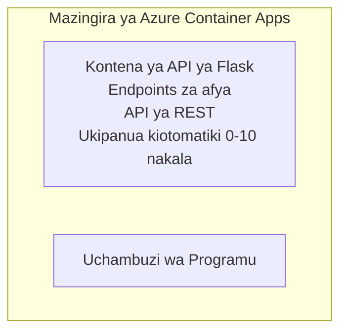

# Simple Flask API - Mfano wa Container App

**Njia ya Kujifunza:** Mwanzo ⭐ | **Muda:** 25-35 dakika | **Gharama:** $0-15/mwezi

API kamili, inayoenda kazi ya Python Flask REST iliyowekwa kwenye Azure Container Apps kwa kutumia Azure Developer CLI (azd). Mfano huu unaonyesha uwasilishwaji wa kontena, upanuzi wa moja kwa moja (auto-scaling), na misingi ya ufuatiliaji.

## 🎯 Utajifunza

- Weka programu ya Python iliyopakiwa katika kontena kwenye Azure
- Sanidi upanuzi wa moja kwa moja (auto-scaling) na scale-to-zero
- Tekeleza probes za afya na ukaguzi wa usomaji (readiness)
- Fuatilia logi na vipimo vya programu
- Tumia Azure Developer CLI kwa utekelezaji wa haraka

## 📦 Kinachojumuishwa

✅ **Flask Application** - API kamili ya REST yenye operesheni za CRUD (`src/app.py`)  
✅ **Dockerfile** - Usanidi wa kontena tayari kwa uzalishaji  
✅ **Bicep Infrastructure** - Mazingira ya Container Apps na uwasilishwaji wa API  
✅ **AZD Configuration** - Usanidi wa utekelezaji kwa amri moja  
✅ **Health Probes** - Uhakiki wa liveness na readiness umewekwa  
✅ **Auto-scaling** - replikani 0-10 kulingana na mzigo wa HTTP  

## Miundombinu



## Mahitaji

### Inahitajika
- **Azure Developer CLI (azd)** - [Install guide](https://learn.microsoft.com/azure/developer/azure-developer-cli/install-azd)
- **Azure subscription** - [Free account](https://azure.microsoft.com/free/)
- **Docker Desktop** - [Install Docker](https://www.docker.com/products/docker-desktop/) (kwa upimaji wa ndani)

### Thibitisha Mahitaji

```bash
# Angalia toleo la azd (inahitaji 1.5.0 au zaidi)
azd version

# Thibitisha kuingia kwenye Azure
azd auth login

# Angalia Docker (hiari, kwa majaribio ya ndani)
docker --version
```

## ⏱️ Muda wa Utekelezaji

| Phase | Duration | What Happens |
|-------|----------|--------------||
| Environment setup | 30 seconds | Create azd environment |
| Build container | 2-3 minutes | Docker build Flask app |
| Provision infrastructure | 3-5 minutes | Create Container Apps, registry, monitoring |
| Deploy application | 2-3 minutes | Push image and deploy to Container Apps |
| **Total** | **8-12 minutes** | Complete deployment ready |

## Anza Haraka

```bash
# Nenda kwenye mfano
cd examples/container-app/simple-flask-api

# Anzisha mazingira (chagua jina la kipekee)
azd env new myflaskapi

# Sambaza kila kitu (miundombinu + programu)
azd up
# Utaombwa kufanya:
# 1. Chagua usajili wa Azure
# 2. Chagua eneo (kwa mfano, eastus2)
# 3. Subiri dakika 8-12 kwa ajili ya usambazaji

# Pata anwani ya mwisho ya API yako
azd env get-values

# Jaribu API yako
curl $(azd env get-value API_ENDPOINT)/health
```

**Matokeo Yanayotarajiwa:**
```json
{
  "status": "healthy",
  "timestamp": "2025-11-19T10:30:00Z",
  "service": "simple-flask-api",
  "version": "1.0.0"
}
```

## ✅ Thibitisha Utekelezaji

### Hatua 1: Angalia Hali ya Utekelezaji

```bash
# Tazama huduma zilizowekwa
azd show

# Matokeo yanayotarajiwa yanaonyesha:
# - Huduma: api
# - Anwani ya mwisho: https://ca-api-[env].xxx.azurecontainerapps.io
# - Hali: Inafanya kazi
```

### Hatua 2: Jaribu Viunganisho vya API

```bash
# Pata mwisho wa API
API_URL=$(azd env get-value API_ENDPOINT)

# Jaribu afya
curl $API_URL/health

# Jaribu mwisho wa mzizi
curl $API_URL/

# Unda kipengee
curl -X POST $API_URL/api/items \
  -H "Content-Type: application/json" \
  -d '{"name": "Test Item", "description": "My first item"}'

# Pata vipengee vyote
curl $API_URL/api/items
```

**Vigezo vya Mafanikio:**
- ✅ Kiungo cha afya kinarudisha HTTP 200
- ✅ Kiungo cha root kinaonyesha habari za API
- ✅ POST inaunda kipengee na inarudisha HTTP 201
- ✅ GET inarudisha vitu vilivyoundwa

### Hatua 3: Angalia Logi

```bash
# Tiririsha rekodi za moja kwa moja kwa kutumia azd monitor
azd monitor --logs

# Au tumia Azure CLI:
az containerapp logs show --name api --resource-group $RG_NAME --follow

# Unapaswa kuona:
# - Ujumbe za kuanzishaji za Gunicorn
# - Rekodi za maombi ya HTTP
# - Rekodi za taarifa za programu
```

## Muundo wa Mradi

```
simple-flask-api/
├── azure.yaml              # AZD configuration
├── infra/
│   ├── main.bicep         # Main infrastructure
│   ├── main.parameters.json
│   └── app/
│       ├── container-env.bicep
│       └── api.bicep
└── src/
    ├── app.py             # Flask application
    ├── requirements.txt
    └── Dockerfile
```

## Viunganisho vya API

| Kiungo | Mbinu | Maelezo |
|----------|--------|-------------|
| `/health` | GET | Uhakiki wa afya |
| `/api/items` | GET | Orodhesha vitu vyote |
| `/api/items` | POST | Unda kipengeo kipya |
| `/api/items/{id}` | GET | Pata kipengee maalum |
| `/api/items/{id}` | PUT | Sasisha kipengee |
| `/api/items/{id}` | DELETE | Futa kipengee |

## Usanidi

### Vigezo vya Mazingira

```bash
# Weka usanidi maalum
azd env set PORT 8000
azd env set LOG_LEVEL info
azd env set MAX_REPLICAS 20
```

### Usanidi wa Upanuzi

API inapanuka moja kwa moja kulingana na trafiki ya HTTP:
- **Min Replicas**: 0 (inapanua hadi sifuri wakati haifanyi kazi)
- **Max Replicas**: 10
- **Concurrent Requests per Replica**: 50

## Maendeleo

### Endesha Kwenye Kompyuta (lokali)

```bash
# Sakinisha utegemezi
cd src
pip install -r requirements.txt

# Endesha programu
python app.py

# Jaribu kwa ndani
curl http://localhost:8000/health
```

### Jenga na Jaribu Kontena

```bash
# Jenga picha ya Docker
docker build -t flask-api:local ./src

# Endesha kontena kwenye mashine ya ndani
docker run -p 8000:8000 flask-api:local

# Jaribu kontena
curl http://localhost:8000/health
```

## Utekelezaji

### Utekelezaji Kamili

```bash
# Tekeleza miundombinu na programu
azd up
```

### Utekelezaji kwa Msimbo Pekee

```bash
# Sambaza tu msimbo wa programu (miundombinu haibadiliki)
azd deploy api
```

### Sasisha Usanidi

```bash
# Sasisha vigezo vya mazingira
azd env set API_KEY "new-api-key"

# Sambaza upya kwa usanidi mpya
azd deploy api
```

## Ufuatiliaji

### Angalia Logi

```bash
# Tiririsha logi za moja kwa moja ukitumia azd monitor
azd monitor --logs

# Au tumia Azure CLI kwa Container Apps:
az containerapp logs show --name api --resource-group $RG_NAME --follow

# Tazama mistari 100 ya mwisho
az containerapp logs show --name api --resource-group $RG_NAME --tail 100
```

### Fuatilia Vipimo

```bash
# Fungua dashibodi ya Azure Monitor
azd monitor --overview

# Tazama vipimo maalum
az monitor metrics list \
  --resource $(azd show --output json | jq -r '.services.api.resourceId') \
  --metric "Requests,ResponseTime"
```

## Kupima

### Kukagua Afya

```bash
curl $(azd show --output json | jq -r '.services.api.endpoint')/health
```

Majoibu yanayotarajiwa:
```json
{
  "status": "healthy",
  "timestamp": "2025-11-19T10:30:00Z"
}
```

### Unda Kipengee

```bash
curl -X POST $(azd show --output json | jq -r '.services.api.endpoint')/api/items \
  -H "Content-Type: application/json" \
  -d '{"name": "Test Item", "description": "A test item"}'
```

### Pata Vitu Vyote

```bash
curl $(azd show --output json | jq -r '.services.api.endpoint')/api/items
```

## Kuboresha Gharama

Utekelezaji huu unatumia scale-to-zero, hivyo unalipa tu wakati API inashughulikia maombi:

- **Gharama wakati haifanyi kazi**: ~$0/mwezi (inapimwa hadi sifuri)
- **Gharama wakati inafanya kazi**: ~$0.000024/sekunde kwa replikani
- **Gharama inayotarajiwa ya kila mwezi** (matumizi mepesi): $5-15

### Punguza Gharama Zaidi

```bash
# Punguza idadi ya juu ya nakala kwa mazingira ya maendeleo
azd env set MAX_REPLICAS 3

# Tumia muda mfupi zaidi wa ukimya
azd env set SCALE_TO_ZERO_TIMEOUT 300  # Dakika 5
```

## Utatuzi wa Matatizo

### Kontena Haianzi

```bash
# Kagua logi za kontena kwa kutumia Azure CLI
az containerapp logs show --name api --resource-group $RG_NAME --tail 100

# Thibitisha ujenzi wa picha ya Docker kwenye mashine ya ndani
docker build -t test ./src
```

### API Haipatikani

```bash
# Thibitisha kuwa ingress ni ya nje
az containerapp show --name api --resource-group rg-simple-flask-api \
  --query properties.configuration.ingress.external
```

### Muda Mrefu wa Majibu

```bash
# Angalia matumizi ya CPU na kumbukumbu
az monitor metrics list \
  --resource $(azd show --output json | jq -r '.services.api.resourceId') \
  --metric "CPUPercentage,MemoryPercentage"

# Ongeza rasilimali ikiwa zinahitajika
az containerapp update --name api --resource-group rg-simple-flask-api \
  --cpu 1.0 --memory 2Gi
```

## Safisha

```bash
# Futa rasilimali zote
azd down --force --purge
```

## Hatua Zifuatazo

### Panua Mfano Huyu

1. **Ongeza Database** - Unganisha Azure Cosmos DB au Hifadhidata ya SQL
   ```bash
   # Ongeza moduli ya Cosmos DB kwenye infra/main.bicep
   # Sasisha app.py na muunganisho wa hifadhidata
   ```

2. **Ongeza Uthibitisho** - Tekeleza Microsoft Entra ID au funguo za API
   ```python
   # Ongeza middleware ya uthibitishaji kwenye app.py
   from functools import wraps
   ```

3. **Anzisha CI/CD** - mtiririko wa GitHub Actions
   ```yaml
   # Create .github/workflows/deploy.yml
   name: Deploy to Azure
   on: [push]
   ```

4. **Ongeza Kitambulisho Kilichosimamiwa** - Lihifadhi upatikanaji wa huduma za Azure
   ```bicep
   # Update infra/app/api.bicep
   identity: { type: 'SystemAssigned' }
   ```

### Mifano Inayohusiana

- **[Programu ya Hifadhidata](../../../../../examples/database-app)** - Mfano kamili na Hifadhidata ya SQL
- **[Huduma Ndogo (Microservices)](../../../../../examples/container-app/microservices)** - Uso wa usanifu wa huduma nyingi
- **[Mwongozo Mkuu wa Container Apps](../README.md)** - Mifumo yote ya container

### Rasilimali za Kujifunzia

- 📚 [Kozi ya AZD kwa Waanzilishi](../../../README.md) - Nyumbani kwa kozi kuu
- 📚 [Mfumo za Container Apps](../README.md) - Mifumo zaidi ya uwasilishwaji
- 📚 [Mkusanyiko wa Violezo za AZD](https://azure.github.io/awesome-azd/) - Violezo vya jamii

## Rasilimali Zaidi

### Nyaraka
- **[Nyaraka za Flask](https://flask.palletsprojects.com/)** - Mwongozo wa fremu ya Flask
- **[Azure Container Apps](https://learn.microsoft.com/azure/container-apps/)** - Nyaraka rasmi za Azure
- **[Azure Developer CLI](https://learn.microsoft.com/azure/developer/azure-developer-cli/)** - Marejeleo ya amri za azd

### Mafunzo
- **[Container Apps Quickstart](https://learn.microsoft.com/azure/container-apps/quickstart-portal)** - Weka programu yako ya kwanza
- **[Python on Azure](https://learn.microsoft.com/azure/developer/python/)** - Mwongozo wa ukuzaji wa Python
- **[Bicep Language](https://learn.microsoft.com/azure/azure-resource-manager/bicep/)** - Miundombinu kama msimbo

### Zana
- **[Azure Portal](https://portal.azure.com)** - Simamia rasilimali kwa mtazamo wa kuona
- **[VS Code Azure Extension](https://marketplace.visualstudio.com/items?itemName=ms-azuretools.vscode-azurecontainerapps)** - Uunganisho wa IDE

---

**🎉 Hongera!** Umetekeleza Flask API inayostahili uzalishaji kwenye Azure Container Apps yenye auto-scaling na ufuatiliaji.

**Maswali?** [Fungua shida](https://github.com/microsoft/AZD-for-beginners/issues) au angalia [FAQ](../../../resources/faq.md)

---

<!-- CO-OP TRANSLATOR DISCLAIMER START -->
**Kionyozo**:
Hati hii imetafsiriwa kwa kutumia huduma ya tafsiri ya AI [Co-op Translator](https://github.com/Azure/co-op-translator). Ingawa tunajitahidi kupata usahihi, tafadhali fahamu kwamba tafsiri za kiotomatiki zinaweza kuwa na makosa au upungufu wa usahihi. Hati ya asili katika lugha yake halisi inapaswa kuchukuliwa kama chanzo cha mamlaka. Kwa taarifa muhimu, tafsiri ya kitaalamu inayofanywa na binadamu inapendekezwa. Hatutojibu kwa kuelewa vibaya au tafsiri potofu zinazotokea kutokana na matumizi ya tafsiri hii.
<!-- CO-OP TRANSLATOR DISCLAIMER END -->