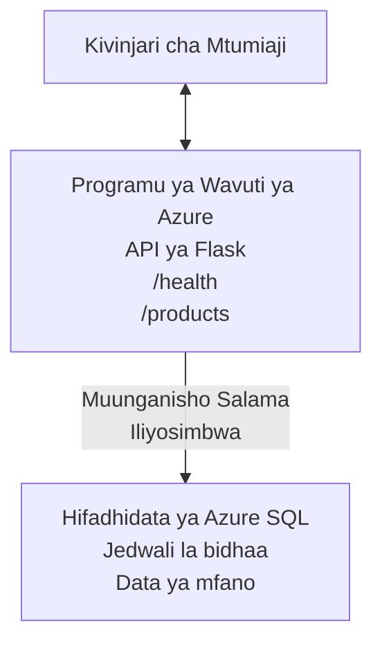

# Kuweka Hifadhidata ya Microsoft SQL na Programu ya Wavuti kwa kutumia AZD

⏱️ **Muda Unaokadiriwa**: 20-30 dakika | 💰 **Gharama Inayokadiriwa**: ~$15-25/mwezi | ⭐ **Ugumu**: Kati

Huu ni mfano kamili na unaofanya kazi unaoonyesha jinsi ya kutumia [Azure Developer CLI (azd)](https://learn.microsoft.com/azure/developer/azure-developer-cli/) kuweka programu ya wavuti ya Python Flask pamoja na Hifadhidata ya Microsoft SQL kwenye Azure. Msimbo wote umejumuishwa na umejaribiwa—hakuna utegemezi wa nje unaohitajika.

## Utakachojifunza

Kwa kumaliza mfano huu, utakuwa umejifunza:
- Kuweka programu yenye tabaka nyingi (programu ya wavuti + hifadhidata) kwa kutumia miundombinu-kama-msimbo
- Kusanidi muunganisho salama wa hifadhidata bila kuweka siri moja kwa moja katika msimbo
- Kufuatilia afya ya programu kwa Application Insights
- Kudhibiti rasilimali za Azure kwa ufanisi kwa kutumia AZD CLI
- Kufuata mbinu bora za Azure kwa ajili ya usalama, uboreshaji wa gharama, na uonekano

## Muhtasari wa Senario
- **Programu ya Wavuti**: API ya REST ya Python Flask yenye uunganishaji wa hifadhidata
- **Hifadhidata**: Azure SQL Database yenye data ya mfano
- **Miundombinu**: Imetayarishwa kwa kutumia Bicep (mitayarisho ya moduli, inayoweza kutumika tena)
- **Uwekaji**: Umeendeshwa kikamilifu kwa amri za `azd`
- **Ufuatiliaji**: Application Insights kwa logi na telemetry

## Mahitaji

### Vifaa Vinavyohitajika

Kabla ya kuanza, hakikisha umeweka zana hizi:

1. **[Azure CLI](https://learn.microsoft.com/cli/azure/install-azure-cli)** (toleo 2.50.0 au zaidi)
   ```sh
   az --version
   # Matokeo yanayotarajiwa: azure-cli 2.50.0 au toleo la juu zaidi
   ```

2. **[Azure Developer CLI (azd)](https://learn.microsoft.com/azure/developer/azure-developer-cli/install-azd)** (toleo 1.0.0 au zaidi)
   ```sh
   azd version
   # Matokeo yanayotarajiwa: toleo la azd 1.0.0 au zaidi
   ```

3. **[Python 3.8+](https://www.python.org/downloads/)** (kwa maendeleo ya ndani)
   ```sh
   python --version
   # Matokeo yanayotarajiwa: Python 3.8 au toleo la juu zaidi
   ```

4. **[Docker](https://www.docker.com/get-started)** (hiari, kwa maendeleo ya ndani kwa kutumia kontena)
   ```sh
   docker --version
   # Matokeo yanayotarajiwa: Toleo la Docker 20.10 au zaidi
   ```

### Mahitaji ya Azure

- Usaidizi wa **usajili wa Azure** unaofanya kazi ([unda akaunti ya bure](https://azure.microsoft.com/free/))
- Ruhusa za kuunda rasilimali ndani ya usajili wako
- Nafasi ya **Owner** au **Contributor** kwenye usajili au kikundi cha rasilimali

### Maarifa Yanayohitajika

Huu ni mfano wa ngazi ya **kati**. Unapaswa kuwa na uelewa wa:
- Uendeshaji wa amri za msingi kwenye laini ya amri
- Dhana za msingi za wingu (rasilimali, makundi ya rasilimali)
- Ufahamu wa msingi wa programu za wavuti na hifadhidata

**Mpya kwa AZD?** Anza na mwongozo wa [Getting Started](../../docs/chapter-01-foundation/azd-basics.md) kwanza.

## Muundo wa Mfumo

Mfano huu unaweka muundo wa tabaka mbili unaojumuisha programu ya wavuti na hifadhidata ya SQL:



**Uwekaji wa Rasilimali:**
- **Resource Group**: Chombo cha kuhifadhi rasilimali zote
- **App Service Plan**: Ukaribishaji unaotumia Linux (tabaka B1 kwa ufanisi wa gharama)
- **Web App**: Muda wa utekelezaji wa Python 3.11 na programu ya Flask
- **SQL Server**: Seva ya hifadhidata iliyosimamiwa na TLS 1.2 angalau
- **SQL Database**: Tabaka la Basic (2GB, linalofaa kwa maendeleo/upimaji)
- **Application Insights**: Ufuatiliaji na uandishi wa kumbukumbu
- **Log Analytics Workspace**: Uhifadhi wa logi uliounganishwa

**Ulinganisho**: Fikiria hii kama mkahawa (programu ya wavuti) kwa freezer ya kuingilia (hifadhidata). Wateja wanaagiza kutoka kwenye menyu (vituo vya API), na jikoni (app ya Flask) inachukua viungo (data) kutoka kwa freezer. Meneja wa mkahawa (Application Insights) anafuatilia kila kitu kinachotokea.

## Muundo wa Folda

Faili zote zimetolewa katika mfano huu—hakuna utegemezi wa nje unaohitajika:

```
examples/database-app/
│
├── README.md                    # This file
├── azure.yaml                   # AZD configuration file
├── .env.sample                  # Sample environment variables
├── .gitignore                   # Git ignore patterns
│
├── infra/                       # Infrastructure as Code (Bicep)
│   ├── main.bicep              # Main orchestration template
│   ├── abbreviations.json      # Azure naming conventions
│   └── resources/              # Modular resource templates
│       ├── sql-server.bicep    # SQL Server configuration
│       ├── sql-database.bicep  # Database configuration
│       ├── app-service-plan.bicep  # Hosting plan
│       ├── app-insights.bicep  # Monitoring setup
│       └── web-app.bicep       # Web application
│
└── src/
    └── web/                    # Application source code
        ├── app.py              # Flask REST API
        ├── requirements.txt    # Python dependencies
        └── Dockerfile          # Container definition
```

**Kila Faili Inafanya Nini:**
- **azure.yaml**: Inaambia AZD nini kueneza na wapi
- **infra/main.bicep**: Inaratibu rasilimali zote za Azure
- **infra/resources/*.bicep**: Ufafanuzi wa rasilimali binafsi (moduli kwa ajili ya matumizi tena)
- **src/web/app.py**: Programu ya Flask yenye mantiki ya hifadhidata
- **requirements.txt**: Viambatanisho vya pakiti za Python
- **Dockerfile**: Maelekezo ya kuweka ndani ya kontena kwa ajili ya uenezaji

## Mwongozo wa Haraka (Hatua kwa Hatua)

### Hatua ya 1: Nakili na Ingia

```sh
git clone https://github.com/microsoft/AZD-for-beginners.git
cd AZD-for-beginners/examples/database-app
```

**✓ Ukaguzi wa Mafanikio**: Thibitisha unaona `azure.yaml` na folda infra/:
```sh
ls
# Inatarajiwa: README.md, azure.yaml, infra/, src/
```

### Hatua ya 2: Thibitisha Utambulisho na Azure

```sh
azd auth login
```

Hii itafungua kivinjari chako kwa ajili ya uthibitishaji wa Azure. Ingia kwa kutumia taarifa zako za Azure.

**✓ Ukaguzi wa Mafanikio**: Unapaswa kuona:
```
Logged in to Azure.
```

### Hatua ya 3: Anzisha Mazingira

```sh
azd init
```

**Nini kinatokea**: AZD inaunda usanidi wa ndani kwa ajili ya uenezaji wako.

**Maswali utakayoyaona**:
- **Jina la mazingira**: Weka jina fupi (mf., `dev`, `myapp`)
- **Azure subscription**: Chagua usajili wako kutoka kwenye orodha
- **Azure location**: Chagua eneo (mf., `eastus`, `westeurope`)

**✓ Ukaguzi wa Mafanikio**: Unapaswa kuona:
```
SUCCESS: New project initialized!
```

### Hatua ya 4: Tayarisha Rasilimali za Azure

```sh
azd provision
```

**Nini kinatokea**: AZD inaunda miundombinu yote (huchukua dakika 5-8):
1. Inaunda resource group
2. Inaunda SQL Server na Database
3. Inaunda App Service Plan
4. Inaunda Web App
5. Inaunda Application Insights
6. Inasanidi mtandao na usalama

**Utatazamiwa unapoombwa**:
- **SQL admin username**: Weka jina la mtumiaji (mf., `sqladmin`)
- **SQL admin password**: Weka nywila yenye nguvu (ihifadhi!)

**✓ Ukaguzi wa Mafanikio**: Unapaswa kuona:
```
SUCCESS: Your application was provisioned in Azure in X minutes Y seconds.
You can view the resources created under the resource group rg-<env-name> in Azure Portal:
https://portal.azure.com/#@/resource/subscriptions/.../resourceGroups/rg-<env-name>
```

**⏱️ Muda**: 5-8 dakika

### Hatua ya 5: Weka Programu

```sh
azd deploy
```

**Nini kinatokea**: AZD inajenga na kueneza programu yako ya Flask:
1. Inapakua programu ya Python
2. Inajenga kontena la Docker
3. Inaleta kwenye Azure Web App
4. Inanzisha hifadhidata na data ya mfano
5. Inaendesha programu

**✓ Ukaguzi wa Mafanikio**: Unapaswa kuona:
```
SUCCESS: Your application was deployed to Azure in X minutes Y seconds.
You can view the resources created under the resource group rg-<env-name> in Azure Portal:
https://portal.azure.com/#@/resource/subscriptions/.../resourceGroups/rg-<env-name>
```

**⏱️ Muda**: 3-5 dakika

### Hatua ya 6: Vinjari Programu

```sh
azd browse
```

Hii itafungua programu yako iliyowekwa katika kivinjari kwa `https://app-<unique-id>.azurewebsites.net`

**✓ Ukaguzi wa Mafanikio**: Unapaswa kuona pato la JSON:
```json
{
  "message": "Welcome to the Database App API",
  "endpoints": {
    "/": "This help message",
    "/health": "Health check endpoint",
    "/products": "List all products",
    "/products/<id>": "Get product by ID"
  }
}
```

### Hatua ya 7: Jaribu Vituo vya API

**Ukaguzi wa Afya** (thibitisha muunganisho wa hifadhidata):
```sh
curl https://app-<your-id>.azurewebsites.net/health
```

**Majibu Yanayotarajiwa**:
```json
{
  "status": "healthy",
  "database": "connected"
}
```

**Orodha ya Bidhaa** (data ya mfano):
```sh
curl https://app-<your-id>.azurewebsites.net/products
```

**Majibu Yanayotarajiwa**:
```json
[
  {
    "id": 1,
    "name": "Laptop",
    "description": "High-performance laptop",
    "price": 1299.99,
    "created_at": "2025-11-19T10:30:00"
  },
  ...
]
```

**Pata Bidhaa Moja**:
```sh
curl https://app-<your-id>.azurewebsites.net/products/1
```

**✓ Ukaguzi wa Mafanikio**: Vituo vyote vinarejesha data ya JSON bila makosa.

---

**🎉 Hongera!** Umeweza kuweka programu ya wavuti pamoja na hifadhidata kwenye Azure ukitumia AZD.

## Uchunguzi wa Undani wa Mipangilio

### Vigezo vya Mazingira

Siri zinadhibitiwa kwa usalama kupitia usanidi wa Azure App Service—**zitawahi kuwekwa moja kwa moja katika msimbo wa chanzo**.

**Imewekwa Kiotomatiki na AZD**:
- `SQL_CONNECTION_STRING`: Muunganisho wa hifadhidata una sifa zilizofichwa
- `APPLICATIONINSIGHTS_CONNECTION_STRING`: Mwisho wa telemetry ya ufuatiliaji
- `SCM_DO_BUILD_DURING_DEPLOYMENT`: Inawezesha ufungaji wa utegemezi kiotomatiki wakati wa uenezaji

**Siri zinahifadhiwa wapi**:
1. Wakati wa `azd provision`, unatoa nywila za SQL kupitia maswali salama
2. AZD inazihifadhi kwenye faili yako ya ndani `.azure/<env-name>/.env` (imechanganywa na git)
3. AZD inaziingiza kwenye usanidi wa Azure App Service (zilifichwa katika hatua ya kupumzika)
4. Programu inazisoma kupitia `os.getenv()` wakati wa utekelezaji

### Maendeleo ya Kijijini

Kwa upimaji wa ndani, tengeneza faili `.env` kutoka kwa sampuli:

```sh
cp .env.sample .env
# Hariri .env na muunganisho wa hifadhidata ya eneo lako.
```

**Mtiririko wa Kazi kwa Maendeleo ya Kijijini**:
```sh
# Sakinisha mategemeo
cd src/web
pip install -r requirements.txt

# Weka vigezo vya mazingira
export SQL_CONNECTION_STRING="your-local-connection-string"

# Endesha programu
python app.py
```

**Jaribu kwa Kijijini**:
```sh
curl http://localhost:8000/health
# Inatarajiwa: {"status": "hai", "database": "imeunganishwa"}
```

### Miundombinu kama Msimbo

Rasilimali zote za Azure zimefafanuliwa katika **mitayarisho ya Bicep** (kabrasha `infra/`):

- **Muundo wa Moduli**: Kila aina ya rasilimali ina faili yake kwa matumizi ya urudia
- **Ina Vigezo**: Rekebisha SKU, mikoa, kanuni za uwanja wa majina
- **Mbinu Bora**: Inafuata viwango vya majina na chaguo-msingi za usalama za Azure
- **Imegawanywa Katika Toleo**: Mabadiliko ya miundombinu yanadhibitiwa kwa Git

**Mfano wa Urekebishaji**:
Ili kubadilisha tabaka la hifadhidata, hariri `infra/resources/sql-database.bicep`:
```bicep
sku: {
  name: 'Standard'  // Changed from 'Basic'
  tier: 'Standard'
  capacity: 10
}
```

## Mbinu Bora za Usalama

Mfano huu unafuata mbinu bora za usalama za Azure:

### 1. **Hakuna Siri ndani ya Msimbo wa Chanzo**
- ✅ Nywila zimehifadhiwa katika usanidi wa Azure App Service (zilifichwa)
- ✅ Faili `.env` zimeachwa nje ya Git kupitia `.gitignore`
- ✅ Siri zinapitishwa kupitia vigezo salama wakati wa utoaji

### 2. **Muunganisho Uliofichwa**
- ✅ TLS 1.2 angalau kwa SQL Server
- ✅ HTTPS pekee imekataa kwa Web App
- ✅ Muunganisho wa hifadhidata unatumia njia zilizofichwa

### 3. **Usalama wa Mtandao**
- ✅ Firewall ya SQL Server imesanidiwa kuruhusu huduma za Azure pekee
- ✅ Upatikanaji wa mtandao wa umma umewekewa mipaka (inaweza kufungwa zaidi kwa Private Endpoints)
- ✅ FTPS imezimwa kwenye Web App

### 4. **Uthibitishaji & Uidhinishaji**
- ⚠️ **Sasa**: Uthibitishaji wa SQL (jina la mtumiaji/nywila)
- ✅ **Mapendekezo kwa Uzalishaji**: Tumia Azure Managed Identity kwa uthibitishaji bila nywila

**Ili Kusasisha hadi Managed Identity** (kwa uzalishaji):
1. Washa managed identity kwenye Web App
2. Mpe ruhusa identity kwenye SQL
3. Sasisha connection string kutumia managed identity
4. Ondoa uthibitishaji unaotegemea nywila

### 5. **Ukaguzi & Uzingatiaji**
- ✅ Application Insights inaandika maombi yote na makosa
- ✅ Ukaguzi wa SQL Database umewezeshwa (unaweza kusanidi kwa ajili ya utekelezaji wa uzingatiaji)
- ✅ Rasilimali zote zimewekewa tagi kwa ajili ya usimamizi

**Orodha ya Usalama Kabla ya Uzalishaji**:
- [ ] Washa Azure Defender kwa SQL
- [ ] Sanidi Private Endpoints kwa SQL Database
- [ ] Washa Web Application Firewall (WAF)
- [ ] Tekeleza Azure Key Vault kwa mzunguko wa siri
- [ ] Sanidi uthibitishaji wa Microsoft Entra ID
- [ ] Washa uandishi wa uchunguzi kwa rasilimali zote

## Uboreshaji wa Gharama

**Gharama Zinazokadiriwa za Kila Mwezi** (kama Novemba 2025):

| Rasilimali | SKU/Tabaka | Gharama Inayokadiriwa |
|----------|----------|----------------|
| App Service Plan | B1 (Basic) | ~$13/month |
| SQL Database | Basic (2GB) | ~$5/month |
| Application Insights | Pay-as-you-go | ~$2/month (trafiki ndogo) |
| **Jumla** | | **~$20/month** |

**💡 Vidokezo vya Kuokoa Gharama**:

1. **Tumia Tabaka la Bure kwa Kujifunza**:
   - App Service: tabaka F1 (bure, masaa yaliyopunguzwa)
   - SQL Database: Tumia Azure SQL Database serverless
   - Application Insights: 5GB/mwezi usomaji wa bure

2. **Zima Rasilimali Usizohitaji**:
   ```sh
   # Simamisha programu ya wavuti (hifadhidata bado inatoza)
   az webapp stop --name <app-name> --resource-group <rg-name>
   
   # Anzisha upya inapohitajika
   az webapp start --name <app-name> --resource-group <rg-name>
   ```

3. **Futa Kila Kitu Baada ya Kupima**:
   ```sh
   azd down
   ```
   Hii inafuta rasilimali ZOTE na kusitisha malipo.

4. **SKU za Maendeleo dhidi ya Uzalishaji**:
   - **Maendeleo**: Tabaka la Basic (lilitumika katika mfano huu)
   - **Uzalishaji**: Tabaka la Standard/Premium lenye upendeleo

**Ufuatiliaji wa Gharama**:
- Angalia gharama katika [Azure Cost Management](https://portal.azure.com/#view/Microsoft_Azure_CostManagement)
- Sanidi arifa za gharama ili kuepuka mshangao
- Weka tagi kwa rasilimali zote kwa `azd-env-name` kwa ufuatiliaji

**Chaguo la Tabaka la Bure**:
Kwa madhumuni ya kujifunza, unaweza kubadilisha `infra/resources/app-service-plan.bicep`:
```bicep
sku: {
  name: 'F1'  // Free tier
  tier: 'Free'
}
```
**Kumbuka**: Tabaka la bure lina vizuizi (60 min/siku CPU, hakuna aina ya always-on).

## Ufuatiliaji na Uonekano

### Uunganisho wa Application Insights

Mfano huu unajumuisha **Application Insights** kwa ufuatiliaji mpana:

**Vinavyofuatiliwa**:
- ✅ Maombi ya HTTP (vichelezo, nambari za hali, vituo)
- ✅ Makosa na exceptions za programu
- ✅ Uandishi wa logi maalum kutoka kwa app ya Flask
- ✅ Afya ya muunganisho wa hifadhidata
- ✅ Vipimo vya utendaji (CPU, kumbukumbu)

**Kupata Application Insights**:
1. Fungua [Azure Portal](https://portal.azure.com)
2. Elekea kwenye resource group yako (`rg-<env-name>`)
3. Bofya kwenye rasilimali ya Application Insights (`appi-<unique-id>`)

**Maswali Yanayofaa** (Application Insights → Logi):

**Angalia Maombi Yote**:
```kusto
requests
| where timestamp > ago(1h)
| order by timestamp desc
| project timestamp, name, url, resultCode, duration
```

**Tafuta Makosa**:
```kusto
exceptions
| where timestamp > ago(24h)
| order by timestamp desc
| project timestamp, type, outerMessage, operation_Name
```

**Kagua Endpoint ya Afya**:
```kusto
requests
| where name contains "health"
| summarize count() by resultCode, bin(timestamp, 1h)
```

### Ukaguzi wa SQL Database

**Ukaguzi wa SQL Database umewezeshwa** kufuatilia:
- Vigezo vya upatikanaji wa hifadhidata
- Jaribio la kuingia lililoshindwa
- Mabadiliko ya skimu
- Upatikanaji wa data (kwa uzingatiaji)

**Kupata Logi za Ukaguzi**:
1. Azure Portal → SQL Database → Auditing
2. Tazama logi katika Log Analytics workspace

### Ufuatiliaji wa Wakati Halisi

**Tazama Vipimo vya Moja kwa Moja**:
1. Application Insights → Live Metrics
2. Tazama maombi, kushindwa, na utendaji kwa wakati halisi

**Sanidi Arifa**:
Unda arifa kwa matukio muhimu:
- Makosa ya HTTP 500 > 5 ndani ya dakika 5
- Kushindwa kwa muunganisho wa hifadhidata
- Wakati wa majibu mrefu (>2 sekundi)

**Mfano wa Kuunda Arifa**:
```sh
az monitor metrics alert create \
  --name "High-Response-Time" \
  --resource-group <rg-name> \
  --scopes <app-insights-resource-id> \
  --condition "avg requests/duration > 2000" \
  --description "Alert when response time exceeds 2 seconds"
```

## Utatuzi wa Tatizo
### Masuala ya Kawaida na Suluhisho

#### 1. `azd provision` inashindwa na "Location not available"

**Dalili**:
```
Error: The subscription is not registered for the resource type 'components' in the location 'centralus'.
```

**Suluhisho**:
Chagua eneo tofauti la Azure au jisajili kwa mtoa rasilimali:
```sh
az provider register --namespace Microsoft.Insights
```

#### 2. SQL Connection Fails During Deployment

**Dalili**:
```
pyodbc.OperationalError: ('08001', '[08001] [Microsoft][ODBC Driver 18 for SQL Server]TCP Provider...')
```

**Suluhisho**:
- Thibitisha firewall ya SQL Server inaruhusu huduma za Azure (imewekwa moja kwa moja)
- Angalia nywila ya msimamizi wa SQL iliyoingizwa kwa usahihi wakati wa `azd provision`
- Hakikisha SQL Server imewekwa kabisa (inaweza kuchukua dakika 2-3)

**Thibitisha Muunganisho**:
```sh
# Kutoka kwenye Azure Portal, nenda kwenye SQL Database → Mhariri wa maswali
# Jaribu kuungana kwa kutumia vitambulisho vyako
```

#### 3. Web App Shows "Application Error"

**Dalili**:
Kivinjari kinaonyesha ukurasa wa hitilafu wa jumla.

**Suluhisho**:
Kagua logi za programu:
```sh
# Tazama kumbukumbu za hivi karibuni
az webapp log tail --name <app-name> --resource-group <rg-name>
```

**Sababu za kawaida**:
- Vigezo vya mazingira vinakosekana (angalia App Service → Configuration)
- Usakinishaji wa kifurushi cha Python umefeli (angalia logi za utekelezaji)
- Hitilafu ya kuanzisha hifadhidata (angalia uunganishaji wa SQL)

#### 4. `azd deploy` Fails with "Build Error"

**Dalili**:
```
Error: Failed to build project
```

**Suluhisho**:
- Hakikisha `requirements.txt` hana makosa ya sintaksia
- Angalia kwamba Python 3.11 imeteuliwa katika `infra/resources/web-app.bicep`
- Thibitisha Dockerfile ina picha ya msingi sahihi

**Fanyia uchunguzi kwa ndani**:
```sh
cd src/web
docker build -t test-app .
docker run -p 8000:8000 test-app
```

#### 5. "Unauthorized" When Running AZD Commands

**Dalili**:
```
ERROR: (Unauthorized) The client '<id>' with object id '<id>' does not have authorization
```

**Suluhisho**:
Wasilisha upya uthibitishaji kwa Azure:
```sh
# Inahitajika kwa michakato ya AZD
azd auth login

# Hiari ikiwa pia unatumia amri za Azure CLI moja kwa moja
az login
```

Thibitisha una ruhusa sahihi (cheo cha Contributor) kwenye subscription.

#### 6. High Database Costs

**Dalili**:
Bili isiyotegemewa ya Azure.

**Suluhisho**:
- Angalia kama ulisahau kuendesha `azd down` baada ya kupima
- Thibitisha SQL Database inatumia tier ya Basic (si Premium)
- Pitia gharama katika Azure Cost Management
- Weka arifa za gharama

### Kupata Msaada

**Tazama Vigezo Vyote vya Mazingira vya AZD**:
```sh
azd env get-values
```

**Angalia Hali ya Utekelezaji**:
```sh
az webapp show --name <app-name> --resource-group <rg-name> --query state
```

**Pata Logi za Programu**:
```sh
az webapp log download --name <app-name> --resource-group <rg-name> --log-file app-logs.zip
```

**Unahitaji Msaada Zaidi?**
- [Mwongozo wa Utatuzi wa AZD](../../docs/chapter-07-troubleshooting/common-issues.md)
- [Utatuzi wa Azure App Service](https://learn.microsoft.com/azure/app-service/troubleshoot-diagnostic-logs)
- [Utatuzi wa Azure SQL](https://learn.microsoft.com/azure/azure-sql/database/troubleshoot-common-errors-issues)

## Mazoezi ya Vitendo

### Mazoezi 1: Thibitisha Utekelezaji Wako (Mwanzo)

**Lengo**: Thibitisha rasilimali zote zimetumika na programu inafanya kazi.

**Hatua**:
1. Orodhesha rasilimali zote katika resource group yako:
   ```sh
   az resource list --resource-group rg-<env-name> --output table
   ```
   **Inatarajiwa**: 6-7 rasilimali (Web App, SQL Server, SQL Database, App Service Plan, Application Insights, Log Analytics)

2. Jaribu endpoints zote za API:
   ```sh
   curl https://app-<your-id>.azurewebsites.net/
   curl https://app-<your-id>.azurewebsites.net/health
   curl https://app-<your-id>.azurewebsites.net/products
   curl https://app-<your-id>.azurewebsites.net/products/1
   ```
   **Inatarajiwa**: Zote zirejee JSON halali bila makosa

3. Angalia Application Insights:
   - Nenda kwenye Application Insights katika Azure Portal
   - Nenda kwenye "Live Metrics"
   - Sasisha kivinjari chako kwenye web app
   **Inatarajiwa**: Ona maombi yakionekana kwa wakati halisi

**Vigezo vya Mafanikio**: Rasilimali zote 6-7 zipo, endpoints zote zinarudisha data, Live Metrics inaonyesha shughuli.

---

### Mazoezi 2: Ongeza Endpoint Mpya wa API (Wastani)

**Lengo**: Panua programu ya Flask kwa endpoint mpya.

**Starter Code**: Endpoints za sasa katika `src/web/app.py`

**Hatua**:
1. Hariri `src/web/app.py` na ongeza endpoint mpya baada ya kazi ya `get_product()`:
   ```python
   @app.route('/products/search/<keyword>')
   def search_products(keyword):
       """Search products by name or description."""
       try:
           conn = get_db_connection()
           cursor = conn.cursor()
           cursor.execute(
               "SELECT id, name, description, price, created_at FROM products WHERE name LIKE ? OR description LIKE ?",
               (f'%{keyword}%', f'%{keyword}%')
           )
           
           products = []
           for row in cursor.fetchall():
               products.append({
                   'id': row[0],
                   'name': row[1],
                   'description': row[2],
                   'price': float(row[3]) if row[3] else None,
                   'created_at': row[4].isoformat() if row[4] else None
               })
           
           cursor.close()
           conn.close()
           
           logger.info(f"Search for '{keyword}' returned {len(products)} results")
           return jsonify(products), 200
           
       except Exception as e:
           logger.error(f"Error searching products: {str(e)}")
           return jsonify({'error': str(e)}), 500
   ```

2. Weka programu iliyosasishwa:
   ```sh
   azd deploy
   ```

3. Jaribu endpoint mpya:
   ```sh
   curl https://app-<your-id>.azurewebsites.net/products/search/laptop
   ```
   **Inatarajiwa**: Inarudisha bidhaa zinazolingana na "laptop"

**Vigezo vya Mafanikio**: Endpoint mpya inafanya kazi, inarudisha matokeo yaliyochanwa, inaonekana kwenye logi za Application Insights.

---

### Mazoezi 3: Ongeza Ufuatiliaji na Arifa (Kiwango cha Juu)

**Lengo**: Weka ufuatiliaji wa kinga na arifa.

**Hatua**:
1. Unda arifa kwa makosa ya HTTP 500:
   ```sh
   # Pata ID ya rasilimali ya Application Insights
   AI_ID=$(az monitor app-insights component show \
     --app appi-<your-id> \
     --resource-group rg-<env-name> \
     --query id -o tsv)
   
   # Unda onyo
   az monitor metrics alert create \
     --name "High-Error-Rate" \
     --resource-group rg-<env-name> \
     --scopes $AI_ID \
     --condition "count requests/failed > 5" \
     --window-size 5m \
     --evaluation-frequency 1m \
     --description "Alert when >5 failed requests in 5 minutes"
   ```

2. Sababisha arifa kwa kusababisha makosa:
   ```sh
   # Omba bidhaa isiyokuwepo
   for i in {1..10}; do curl https://app-<your-id>.azurewebsites.net/products/999; done
   ```

3. Angalia kama arifa ilishika:
   - Azure Portal → Alerts → Alert Rules
   - Angalia barua pepe yako (ikiwa imewekwa)

**Vigezo vya Mafanikio**: Kanuni ya arifa imeundwa, inachomeka kwenye makosa, arifa zinapokelewa.

---

### Mazoezi 4: Mabadiliko ya Mchoro wa Hifadhidata (Kiwango cha Juu)

**Lengo**: Ongeza jedwali jipya na ubadilishe programu kuitumia.

**Hatua**:
1. Unganisha kwenye SQL Database kupitia Azure Portal Query Editor

2. Unda jedwali jipya la `categories`:
   ```sql
   CREATE TABLE categories (
       id INT PRIMARY KEY IDENTITY(1,1),
       name NVARCHAR(50) NOT NULL,
       description NVARCHAR(200)
   );
   
   INSERT INTO categories (name, description) VALUES
   ('Electronics', 'Electronic devices and accessories'),
   ('Office Supplies', 'Office equipment and supplies');
   
   -- Add category to products table
   ALTER TABLE products ADD category_id INT;
   UPDATE products SET category_id = 1; -- Set all to Electronics
   ```

3. Sasisha `src/web/app.py` ili kujumuisha taarifa za kategoria kwenye majibu

4. Weka na jaribu

**Vigezo vya Mafanikio**: Jedwali jipya lipo, bidhaa zinaonyesha taarifa za kategoria, programu bado inafanya kazi.

---

### Mazoezi 5: Tekeleza Caching (Mtaalamu)

**Lengo**: Ongeza Azure Redis Cache kuboresha utendaji.

**Hatua**:
1. Ongeza Redis Cache kwa `infra/main.bicep`
2. Sasisha `src/web/app.py` kuweka cache kwa maswali ya bidhaa
3. Pima uboreshaji wa utendaji kwa Application Insights
4. Linganisha nyakati za majibu kabla/baada ya caching

**Vigezo vya Mafanikio**: Redis imetumika, caching inafanya kazi, nyakati za majibu zinaboreka kwa >50%.

**Kidokezo**: Anza na [Azure Cache for Redis documentation](https://learn.microsoft.com/azure/azure-cache-for-redis/).

---

## Usafishaji

Ili kuepuka malipo yanayoendelea, futa rasilimali zote baada ya kumaliza:

```sh
azd down
```

**Omba uthibitisho**:
```
? Total resources to delete: 7, are you sure you want to continue? (y/N)
```

Andika `y` kuthibitisha.

**✓ Ukaguzi wa Mafanikio**: 
- Rasilimali zote zimefutwa kutoka Azure Portal
- Hakuna malipo yanayoendelea
- Folda ya ndani `.azure/<env-name>` inaweza kufutwa

**Mbadala** (hifadhi miundombinu, futa data):
```sh
# Futa tu kikundi cha rasilimali (hifadhi usanidi wa AZD)
az group delete --name rg-<env-name> --yes
```
## Jifunze Zaidi

### Nyaraka Zinazohusiana
- [Azure Developer CLI Documentation](https://learn.microsoft.com/azure/developer/azure-developer-cli/)
- [Azure SQL Database Documentation](https://learn.microsoft.com/azure/azure-sql/database/)
- [Azure App Service Documentation](https://learn.microsoft.com/azure/app-service/)
- [Application Insights Documentation](https://learn.microsoft.com/azure/azure-monitor/app/app-insights-overview)
- [Bicep Language Reference](https://learn.microsoft.com/azure/azure-resource-manager/bicep/)

### Hatua Zifuatazo Katika Kozi Hii
- **[Container Apps Example](../../../../examples/container-app)**: Weka microservices kwa kutumia Azure Container Apps
- **[AI Integration Guide](../../../../docs/ai-foundry)**: Ongeza uwezo wa AI kwenye app yako
- **[Deployment Best Practices](../../docs/chapter-04-infrastructure/deployment-guide.md)**: Mifumo ya uenezaji kwa uzalishaji

### Mada za Juu
- **Managed Identity**: Ondoa nywila na tumia uthibitishaji wa Microsoft Entra ID
- **Private Endpoints**: Linda uunganisho wa hifadhidata ndani ya virtual network
- **CI/CD Integration**: Panga uenezaji wa moja kwa moja na GitHub Actions au Azure DevOps
- **Multi-Environment**: Weka mazingira ya dev, staging, na production
- **Database Migrations**: Tumia Alembic au Entity Framework kwa uthibitisaji wa toleo la skima

### Ulinganisho na Mbinu Nyingine

**AZD vs. ARM Templates**:
- ✅ AZD: Ufafanuzi wa ngazi ya juu, amri rahisi
- ⚠️ ARM: Maelezo mengi zaidi, udhibiti wa kina

**AZD vs. Terraform**:
- ✅ AZD: Azure-native, umeunganishwa na huduma za Azure
- ⚠️ Terraform: Msaada wa multi-cloud, jamii kubwa

**AZD vs. Azure Portal**:
- ✅ AZD: Inarudiwa, iko kwenye udhibiti wa toleo, inaweza kuendeshwa kiotomatiki
- ⚠️ Portal: Bonyeza kwa mkono, ngumu kuzalisha upya

**Fikiria AZD kama**: Docker Compose kwa Azure—usanidi uliorahisishwa kwa uenezaji tata.

---

## Maswali Yanayoulizwa Mara kwa Mara

**Q: Je, ninaweza kutumia lugha tofauti ya programu?**  
A: Ndio! Badilisha `src/web/` na Node.js, C#, Go, au lugha yoyote. Sasisha `azure.yaml` na Bicep kuendana.

**Q: Ninaongeza vianzio vingine vya hifadhidata?**  
A: Ongeza module nyingine ya SQL Database katika `infra/main.bicep` au tumia PostgreSQL/MySQL kutoka kwa Azure Database services.

**Q: Je, ninaweza kutumia hii kwa uzalishaji?**  
A: Hii ni mwanzo. Kwa uzalishaji, ongeza: managed identity, private endpoints, redundancy, strategy ya backup, WAF, na ufuatiliaji ulioboreshwa.

**Q: Nifanye nini nikitaka kutumia containers badala ya upakiaji wa kodi?**  
A: Angalia [Container Apps Example](../../../../examples/container-app) inayotumia Docker containers kote.

**Q: Nitakuaje kuunganishwa na hifadhidata kutoka kwenye mashine yangu ya ndani?**  
A: Ongeza IP yako kwenye firewall ya SQL Server:
```sh
az sql server firewall-rule create \
  --resource-group rg-<env-name> \
  --server sql-<unique-id> \
  --name AllowMyIP \
  --start-ip-address <your-ip> \
  --end-ip-address <your-ip>
```

**Q: Je, nitaweza kutumia hifadhidata iliyopo badala ya kuunda mpya?**  
A: Ndio, rekebisha `infra/main.bicep` kurejelea SQL Server iliyopo na sasisha vigezo vya connection string.

---

> **Kumbuka:** Mfano huu unaonyesha mbinu bora za kuweka web app yenye hifadhidata kwa kutumia AZD. Unajumuisha msimbo unaofanya kazi, nyaraka za kina, na mazoezi ya vitendo ili kuimarisha ujifunzaji. Kwa uenezaji wa uzalishaji, pitia usalama, upanuzi, uzingatiaji, na mahitaji ya gharama maalum kwa shirika lako.

**📚 Uabiri wa Kozi:**
- ← Iliyopita: [Mfano wa Container Apps](../../../../examples/container-app)
- → Ijayo: [Mwongozo wa Uunganisho wa AI](../../../../docs/ai-foundry)
- 🏠 [Nyumbani kwa Kozi](../../README.md)

---

<!-- CO-OP TRANSLATOR DISCLAIMER START -->
**Kionyozo**:
Hati hii imetafsiriwa kwa kutumia huduma ya tafsiri ya AI [Co-op Translator](https://github.com/Azure/co-op-translator). Ingawa tunajitahidi kupata usahihi, tafadhali fahamu kwamba tafsiri za kiotomatiki zinaweza kuwa na makosa au upungufu wa usahihi. Hati ya asili katika lugha yake halisi inapaswa kuchukuliwa kama chanzo cha mamlaka. Kwa taarifa muhimu, tafsiri ya kitaalamu inayofanywa na binadamu inapendekezwa. Hatutojibu kwa kuelewa vibaya au tafsiri potofu zinazotokea kutokana na matumizi ya tafsiri hii.
<!-- CO-OP TRANSLATOR DISCLAIMER END -->