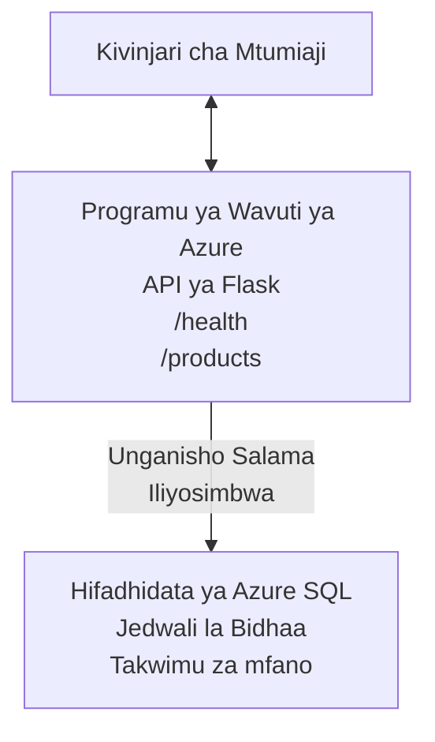

# Kuweka Database ya Microsoft SQL na Web App kwa AZD

⏱️ **Muda Unaokadiriwa**: 20-30 dakika | 💰 **Gharama Inayokadiriwa**: ~$15-25/mwezi | ⭐ **Ugumu**: Wastani

Mfano huu **kamili, unaofanya kazi** unaonyesha jinsi ya kutumia [Azure Developer CLI (azd)](https://learn.microsoft.com/azure/developer/azure-developer-cli/) kupeleka programu ya wavuti ya Python Flask pamoja na Database ya Microsoft SQL kwenye Azure. Msimbo wote umejumuishwa na umejaribiwa—hakuna utegemezi wa nje unaohitajika.

## Utakachojifunza

Kwa kukamilisha mfano huu, utatekeleza:
- Kuweka programu yenye tabaka nyingi (web app + database) kwa kutumia miundombinu-kama-msimbo
- Kusanidi muunganisho salama wa database bila kuweka siri moja kwa moja kwenye msimbo
- Kufuatilia afya ya programu kwa Application Insights
- Kudhibiti rasilimali za Azure kwa ufanisi kwa AZD CLI
- Kufuata mbinu bora za Azure kwa usalama, uboreshaji wa gharama, na ufuatiliaji

## Muhtasari wa Mfano
- **Web App**: API ya Python Flask REST yenye muunganisho wa database
- **Database**: Azure SQL Database yenye data za mfano
- **Miundombinu**: Imetolewa kwa kutumia Bicep (kiolezo kinachoweza kutumika tena, kivyake)
- **Uwasilishaji**: Umeendeshwa kikamilifu kwa amri za `azd`
- **Ufuatiliaji**: Application Insights kwa kumbukumbu na telemetry

## Mahitaji

### Zana Zinazohitajika

Kabla ya kuanza, hakikisha umeweka zana hizi:

1. **[Azure CLI](https://learn.microsoft.com/cli/azure/install-azure-cli)** (toleo 2.50.0 au zaidi)
   ```sh
   az --version
   # Matokeo yanayotarajiwa: azure-cli 2.50.0 au juu zaidi
   ```

2. **[Azure Developer CLI (azd)](https://learn.microsoft.com/azure/developer/azure-developer-cli/install-azd)** (toleo 1.0.0 au zaidi)
   ```sh
   azd version
   # Matokeo yanayotarajiwa: azd toleo 1.0.0 au ya juu zaidi
   ```

3. **[Python 3.8+](https://www.python.org/downloads/)** (kwa maendeleo ya eneo)
   ```sh
   python --version
   # Matokeo yanayotarajiwa: Python 3.8 au toleo la juu zaidi
   ```

4. **[Docker](https://www.docker.com/get-started)** (hiari, kwa maendeleo ya kontena mahali)
   ```sh
   docker --version
   # Matokeo yanayotarajiwa: toleo la Docker 20.10 au la juu zaidi
   ```

### Mahitaji ya Azure

- Usajili wa **Azure** unaofanya kazi ([unda akaunti ya bure](https://azure.microsoft.com/free/))
- Ruhusa za kuunda rasilimali katika usajili wako
- Nafasi ya **Owner** au **Contributor** kwenye usajili au kundi la rasilimali

### Maarifa Yanayohitajika

Huu ni mfano wa kiwango cha **wastani**. Unapaswa kuwa unafahamu:
- Utendakazi wa msingi wa laini ya amri
- Misingi ya dhana za wingu (rasilimali, makundi ya rasilimali)
- Uelewa wa msingi wa programu za wavuti na database

**Mpya kwa AZD?** Anza na [Mwongozo wa Kuanzia](../../docs/chapter-01-foundation/azd-basics.md) kwanza.

## Muundo

Mfano huu unaweka muundo wa tabaka mbili na programu ya wavuti na database:


**Resource Deployment:**
- **Resource Group**: Chombo cha kuhifadhia rasilimali zote
- **App Service Plan**: Ukarabati wa mwenyeji wa Linux (ngazi B1 kwa ufanisi wa gharama)
- **Web App**: Muda wa kuendesha Python 3.11 na programu ya Flask
- **SQL Server**: Server iliyosimamiwa ya database yenye TLS 1.2 angalau
- **SQL Database**: Ngazi ya Basic (2GB, inayofaa kwa maendeleo/majaribio)
- **Application Insights**: Ufuatiliaji na kumbukumbu
- **Log Analytics Workspace**: Hifadhi ya kumbukumbu ya kati

**Mfanano**: Fikiria hii kama mgahawa (web app) mwenye sakafu ya kuhifadhi baridi (database). Wateja wanaagiza kutoka kwenye menyu (vituo vya API), na jikoni (app ya Flask) inachukua viungo (data) kutoka kwenye sakafu ya baridi. Meneja wa mgahawa (Application Insights) anafuatilia kila kitu kinachotokea.

## Muundo wa Folda

Faili zote zimetangazwa katika mfano huu—hakuna utegemezi wa nje unaohitajika:

```
examples/database-app/
│
├── README.md                    # This file
├── azure.yaml                   # AZD configuration file
├── .env.sample                  # Sample environment variables
├── .gitignore                   # Git ignore patterns
│
├── infra/                       # Infrastructure as Code (Bicep)
│   ├── main.bicep              # Main orchestration template
│   ├── abbreviations.json      # Azure naming conventions
│   └── resources/              # Modular resource templates
│       ├── sql-server.bicep    # SQL Server configuration
│       ├── sql-database.bicep  # Database configuration
│       ├── app-service-plan.bicep  # Hosting plan
│       ├── app-insights.bicep  # Monitoring setup
│       └── web-app.bicep       # Web application
│
└── src/
    └── web/                    # Application source code
        ├── app.py              # Flask REST API
        ├── requirements.txt    # Python dependencies
        └── Dockerfile          # Container definition
```

**Kazi ya Kila Faili:**
- **azure.yaml**: Inamwambia AZD nini cha kupeleka na wapi
- **infra/main.bicep**: Inaandaa rasilimali zote za Azure
- **infra/resources/*.bicep**: Ufafanuzi wa rasilimali kwa kila mmoja (modulari kwa matumizi tena)
- **src/web/app.py**: Programu ya Flask yenye mantiki ya database
- **requirements.txt**: Mipangilio ya vifurushi vya Python
- **Dockerfile**: Maelekezo ya kukontena kwa uwasilishaji

## Mwongozo wa Haraka (Hatua kwa Hatua)

### Hatua 1: Nakili na Uelekeze

```sh
git clone https://github.com/microsoft/AZD-for-beginners.git
cd AZD-for-beginners/examples/database-app
```

**✓ Ukaguzi wa Mafanikio**: Hakikisha unaona `azure.yaml` na folda `infra/`:
```sh
ls
# Inatarajiwa: README.md, azure.yaml, infra/, src/
```

### Hatua 2: Thibitisha Utambulisho na Azure

```sh
azd auth login
```

Hii itafungua kivinjari chako kwa ajili ya uthibitishaji wa Azure. Ingia kwa vitambulisho vyako vya Azure.

**✓ Ukaguzi wa Mafanikio**: Unapaswa kuona:
```
Logged in to Azure.
```

### Hatua 3: Anzisha Mazingira

```sh
azd init
```

**Kinachotokea**: AZD inaunda usanidi wa eneo kwa ajili ya uwasilishaji wako.

**Maswali utakayoyaona**:
- **Environment name**: Ingiza jina fupi (mfano, `dev`, `myapp`)
- **Azure subscription**: Chagua usajili wako kutoka kwenye orodha
- **Azure location**: Chagua eneo (mfano, `eastus`, `westeurope`)

**✓ Ukaguzi wa Mafanikio**: Unapaswa kuona:
```
SUCCESS: New project initialized!
```

### Hatua 4: Toa Rasilimali za Azure

```sh
azd provision
```

**Kinachotokea**: AZD inasambaza miundombinu yote (inachukua dakika 5-8):
1. Inaunda resource group
2. Inaunda SQL Server na Database
3. Inaunda App Service Plan
4. Inaunda Web App
5. Inaunda Application Insights
6. Inasanidi mtandao na usalama

**Utaulizwa kwa**:
- **SQL admin username**: Ingiza jina la mtumiaji (mfano, `sqladmin`)
- **SQL admin password**: Ingiza nenosiri imara (ihifadhi!)

**✓ Ukaguzi wa Mafanikio**: Unapaswa kuona:
```
SUCCESS: Your application was provisioned in Azure in X minutes Y seconds.
You can view the resources created under the resource group rg-<env-name> in Azure Portal:
https://portal.azure.com/#@/resource/subscriptions/.../resourceGroups/rg-<env-name>
```

**⏱️ Muda**: 5-8 dakika

### Hatua 5: Tuma Programu

```sh
azd deploy
```

**Kinachotokea**: AZD inajenga na kupeleka programu yako ya Flask:
1. Inapakisha programu ya Python
2. Inajenga kontena la Docker
3. Inalipusha kwenye Azure Web App
4. Inanzisha database na data za mfano
5. Inaendesha programu

**✓ Ukaguzi wa Mafanikio**: Unapaswa kuona:
```
SUCCESS: Your application was deployed to Azure in X minutes Y seconds.
You can view the resources created under the resource group rg-<env-name> in Azure Portal:
https://portal.azure.com/#@/resource/subscriptions/.../resourceGroups/rg-<env-name>
```

**⏱️ Muda**: 3-5 dakika

### Hatua 6: Tazama Programu

```sh
azd browse
```

Hii itafungua web app yako iliyowekwa kwenye kivinjari kwa `https://app-<unique-id>.azurewebsites.net`

**✓ Ukaguzi wa Mafanikio**: Unapaswa kuona toleo la JSON:
```json
{
  "message": "Welcome to the Database App API",
  "endpoints": {
    "/": "This help message",
    "/health": "Health check endpoint",
    "/products": "List all products",
    "/products/<id>": "Get product by ID"
  }
}
```

### Hatua 7: Jaribu Vituo vya API

**Ukaguzi wa Afya** (thibitisha muunganisho wa database):
```sh
curl https://app-<your-id>.azurewebsites.net/health
```

**Majibu Yanayotarajiwa**:
```json
{
  "status": "healthy",
  "database": "connected"
}
```

**Orodha ya Bidhaa** (data za mfano):
```sh
curl https://app-<your-id>.azurewebsites.net/products
```

**Majibu Yanayotarajiwa**:
```json
[
  {
    "id": 1,
    "name": "Laptop",
    "description": "High-performance laptop",
    "price": 1299.99,
    "created_at": "2025-11-19T10:30:00"
  },
  ...
]
```

**Pata Bidhaa Moja**:
```sh
curl https://app-<your-id>.azurewebsites.net/products/1
```

**✓ Ukaguzi wa Mafanikio**: Vituo vyote vinarejesha data za JSON bila makosa.

---

**🎉 Hongera!** Umefanikiwa kuweka programu ya wavuti pamoja na database kwenye Azure kwa kutumia AZD.

## Uchunguzi wa Mipangilio kwa Kina

### Vigezo vya Mazingira

Siri zinadhibitiwa kwa usalama kupitia usanidi wa Azure App Service—**zisitokee kwenye msimbo wa chanzo**.

**Zinasanidiwa Kiotomatiki na AZD**:
- `SQL_CONNECTION_STRING`: Muunganisho wa database wenye vitambulisho vilivyosenywa
- `APPLICATIONINSIGHTS_CONNECTION_STRING`: Mwisho wa telemetry ya ufuatiliaji
- `SCM_DO_BUILD_DURING_DEPLOYMENT`: Inaruhusu ufungaji wa utegemezi kiotomatiki wakati wa uwasilishaji

**Mahali Siri Zinapohifadhiwa**:
1. Wakati wa `azd provision`, unatoa vitambulisho vya SQL kupitia maulizo salama
2. AZD inaweka haya kwenye faili lako la ndani `.azure/<env-name>/.env` (limejumuishwa katika .gitignore)
3. AZD inayaingiza kwenye usanidi wa Azure App Service (yamehifadhiwa kimefumwa)
4. Programu inayasoma kupitia `os.getenv()` wakati wa utekelezaji

### Maendeleo ya Kienyeji

Kwa upimaji wa eneo, tengeneza faili `.env` kutoka kwa mfano:

```sh
cp .env.sample .env
# Hariri .env ili kuweka muunganisho wako wa hifadhidata ya ndani
```

**Mtiririko wa Maendeleo ya Kienyeji**:
```sh
# Sakinisha utegemezi
cd src/web
pip install -r requirements.txt

# Weka vigezo vya mazingira
export SQL_CONNECTION_STRING="your-local-connection-string"

# Endesha programu
python app.py
```

**Jaribu kwa ndani**:
```sh
curl http://localhost:8000/health
# Inatarajiwa: {"status": "healthy", "database": "connected"}
```

### Miundombinu kama Msimbo

Rasilimali zote za Azure zimefafanuliwa katika **kiolezo za Bicep** (`infra/` folda):

- **Muundo wa Modular**: Kila aina ya rasilimali ina faili yake kwa matumizi tena
- **Inakarabatiwa kwa Parameta**: Badilisha SKU, maeneo, na kanuni za kuweka majina
- **Mbinu Bora**: Inafuata viwango vya majina na vipaumbele vya usalama vya Azure
- **Inadhibitiwa kwa Toleo**: Mabadiliko ya miundombinu yanafuatiliwa katika Git

**Mfano wa Ubinafsishaji**:
Ili kubadilisha ngazi ya database, hariri `infra/resources/sql-database.bicep`:
```bicep
sku: {
  name: 'Standard'  // Changed from 'Basic'
  tier: 'Standard'
  capacity: 10
}
```

## Mbinu Bora za Usalama

Mfano huu unafuata mbinu bora za usalama za Azure:

### 1. **Hakuna Siri kwenye Msimbo wa Chanzo**
- ✅ Vitambulisho vinahifadhiwa katika usanidi wa Azure App Service (vimefichwa)
- ✅ Faili za `.env` zimetengwa kutoka Git kupitia `.gitignore`
- ✅ Siri hupitishwa kupitia parameta salama wakati wa utoaji

### 2. **Muunganisho Umefichwa**
- ✅ TLS 1.2 angalau kwa SQL Server
- ✅ HTTPS pekee imelazimishwa kwa Web App
- ✅ Muunganisho wa database unatumia njia zilizoenyeangwa

### 3. **Usalama wa Mtandao**
- ✅ Firewall ya SQL Server imesanidiwa kuruhusu huduma za Azure pekee
- ✅ Ufikiaji wa mtandao wa umma umewekewa kikomo (unaweza kuufunga zaidi kwa Private Endpoints)
- ✅ FTPS imezimwa kwenye Web App

### 4. **Uthibitishaji & Ruhusa**
- ⚠️ **Kwa sasa**: Uthibitishaji wa SQL (jina la mtumiaji/nenosiri)
- ✅ **Mapendekezo kwa Uzalishaji**: Tumia Azure Managed Identity kwa uthibitishaji bila nywila

**Ili Kuboresha hadi Managed Identity** (kwa uzalishaji):
1. Washa managed identity kwenye Web App
2. Mpe identity ruhusa za SQL
3. Sasisha connection string ili itumie managed identity
4. Ondoa uthibitishaji unaotegemea nenosiri

### 5. **Ukaguzi & Uzingatiaji**
- ✅ Application Insights inaandika maombi yote na makosa
- ✅ Ukaguzi wa SQL Database umewezeshwa (unaweza kusanidi kwa uzingatiaji)
- ✅ Rasilimali zote zimepewa tag kwa ajili ya utawala

**Orodha ya Usalama Kabla ya Uzalishaji**:
- [ ] Washa Azure Defender kwa SQL
- [ ] Sanidi Private Endpoints kwa SQL Database
- [ ] Washa Web Application Firewall (WAF)
- [ ] Tumia Azure Key Vault kwa mzunguko wa siri
- [ ] Sanidi uthibitishaji wa Azure AD
- [ ] Washa upigaji kumbukumbu wa utambuzi kwa rasilimali zote

## Uboreshaji wa Gharama

**Gharama Zilizokadiriwa kwa Mwezi** (kama ya Novemba 2025):

| Mali | SKU/Tier | Gharama Inayokadiriwa |
|----------|----------|----------------|
| App Service Plan | B1 (Basic) | ~$13/month |
| SQL Database | Basic (2GB) | ~$5/month |
| Application Insights | Pay-as-you-go | ~$2/month (trafiki ndogo) |
| **Jumla** | | **~$20/month** |

**💡 Vidokezo vya Kuokoa Gharama**:

1. **Tumia Ngazi ya Bure kwa Kujifunza**:
   - App Service: ngazi F1 (bure, masaa maalum)
   - SQL Database: Tumia Azure SQL Database serverless
   - Application Insights: 5GB/mwezi ingizo la bure

2. **Zima Rasilimali Usizotumia**:
   ```sh
   # Zima programu ya wavuti (hifadhidata bado inagharimu)
   az webapp stop --name <app-name> --resource-group <rg-name>
   
   # Anzisha tena inapohitajika
   az webapp start --name <app-name> --resource-group <rg-name>
   ```

3. **Futa Kila Kitu Baada ya Kupima**:
   ```sh
   azd down
   ```
   Hii inafuta rasilimali ZOTE na kuacha malipo.

4. **SKU za Maendeleo dhidi ya Uzalishaji**:
   - **Maendeleo**: Ngazi ya Basic (inayotumika katika mfano huu)
   - **Uzalishaji**: Ngazi ya Standard/Premium yenye uraia

**Ufuatiliaji wa Gharama**:
- Tazama gharama katika [Azure Cost Management](https://portal.azure.com/#view/Microsoft_Azure_CostManagement)
- Sanidi arifa za gharama ili kuepuka mshangao
- Oka rasilimali zote kwa `azd-env-name` kwa ajili ya ufuatiliaji

**Mbadala wa Ngazi ya Bure**:
Kwa madhumuni ya kujifunza, unaweza kubadilisha `infra/resources/app-service-plan.bicep`:
```bicep
sku: {
  name: 'F1'  // Free tier
  tier: 'Free'
}
```
**Kumbuka**: Ngazi ya bure ina vikwazo (60 min/siku CPU, hakuna always-on).

## Ufuatiliaji & Uwezo wa Kuonekana

### Ujumuishaji wa Application Insights

Mfano huu unajumuisha **Application Insights** kwa ufuatiliaji wa kina:

**Kinachofuatiliwa**:
- ✅ Maombi ya HTTP (usitawi, nambari za hali, vituo)
- ✅ Makosa ya programu na ubaguzi
- ✅ Uandishi wa log maalum kutoka app ya Flask
- ✅ Afya ya muunganisho wa database
- ✅ Vipimo vya utendaji (CPU, kumbukumbu)

**Jinsi ya Kupata Application Insights**:
1. Fungua [Azure Portal](https://portal.azure.com)
2. Elekea kwenye resource group yako (`rg-<env-name>`)
3. Bofya kwenye rasilimali ya Application Insights (`appi-<unique-id>`)

**Maswali Muhimu** (Application Insights → Logs):

**Tazama Maombi Yote**:
```kusto
requests
| where timestamp > ago(1h)
| order by timestamp desc
| project timestamp, name, url, resultCode, duration
```

**Tafuta Makosa**:
```kusto
exceptions
| where timestamp > ago(24h)
| order by timestamp desc
| project timestamp, type, outerMessage, operation_Name
```

**Kagua Kiungo cha Afya**:
```kusto
requests
| where name contains "health"
| summarize count() by resultCode, bin(timestamp, 1h)
```

### Ukaguzi wa SQL Database

**Ukaguzi wa SQL Database umewezeshwa** kufuatilia:
- Mfano wa upatikanaji wa database
- Jaribio la kuingia lililoshindwa
- Mabadiliko ya skima
- Upataji wa data (kwa uzingatiaji)

**Pata Log za Ukaguzi**:
1. Azure Portal → SQL Database → Auditing
2. Tazama log katika Log Analytics workspace

### Ufuatiliaji wa Wakati Halisi

**Tazama Vipimo Moja kwa Moja**:
1. Application Insights → Live Metrics
2. Ona maombi, kushindwa, na utendaji kwa wakati halisi

**Sanidi Arifa**:
Tengeneza arifa kwa matukio muhimu:
- Makosa ya HTTP 500 > 5 ndani ya dakika 5
- Kushindwa kwa muunganisho wa database
- Muda mrefu wa majibu (>2 sekunde)

**Mfano wa Uundaji wa Arifa**:
```sh
az monitor metrics alert create \
  --name "High-Response-Time" \
  --resource-group <rg-name> \
  --scopes <app-insights-resource-id> \
  --condition "avg requests/duration > 2000" \
  --description "Alert when response time exceeds 2 seconds"
```

## Utatuzi wa Matatizo
### Masuala ya Kawaida na Suluhisho

#### 1. `azd provision` fails with "Location not available"

**Symptom**:
```
Error: The subscription is not registered for the resource type 'components' in the location 'centralus'.
```

**Solution**:
Chagua eneo tofauti la Azure au jisajili kwa muuzaji wa rasilimali:
```sh
az provider register --namespace Microsoft.Insights
```

#### 2. SQL Connection Fails During Deployment

**Symptom**:
```
pyodbc.OperationalError: ('08001', '[08001] [Microsoft][ODBC Driver 18 for SQL Server]TCP Provider...')
```

**Solution**:
- Thibitisha kwamba ukuta wa moto wa SQL Server unaruhusu huduma za Azure (imewekwa kiotomatiki)
- Hakiki kuwa nenosiri la msimamizi wa SQL liliingizwa kwa usahihi wakati wa `azd provision`
- Hakikisha SQL Server imekamilika kabisa (inaweza kuchukua dakika 2-3)

**Verify Connection**:
```sh
# Kutoka kwenye Azure Portal, nenda kwenye SQL Database → Mhariri wa maswali
# Jaribu kuungana kwa kutumia taarifa zako za kuingia
```

#### 3. Web App Shows "Application Error"

**Symptom**:
Kivinjari kinaonyesha ukurasa wa kosa wa jumla.

**Solution**:
Angalia kumbukumbu za programu:
```sh
# Tazama kumbukumbu za hivi karibuni
az webapp log tail --name <app-name> --resource-group <rg-name>
```

**Common causes**:
- Vigezo vya mazingira vimetoweka (angalia App Service → Configuration)
- Usakinishaji wa kifurushi cha Python ulishindwa (angalia kumbukumbu za utekelezaji)
- Hitilafu ya awali ya hifadhidata (angalia muunganisho wa SQL)

#### 4. `azd deploy` Fails with "Build Error"

**Symptom**:
```
Error: Failed to build project
```

**Solution**:
- Hakikisha `requirements.txt` haina makosa ya sentensi
- Angalia kwamba Python 3.11 imeainishwa katika `infra/resources/web-app.bicep`
- Thibitisha Dockerfile ina picha ya msingi sahihi

**Debug locally**:
```sh
cd src/web
docker build -t test-app .
docker run -p 8000:8000 test-app
```

#### 5. "Unauthorized" When Running AZD Commands

**Symptom**:
```
ERROR: (Unauthorized) The client '<id>' with object id '<id>' does not have authorization
```

**Solution**:
Fanya uthibitisho upya na Azure:
```sh
azd auth login
az login
```

Thibitisha kuwa una ruhusa sahihi (Contributor role) kwenye usajili.

#### 6. High Database Costs

**Symptom**:
Ankara ya Azure isiyotarajiwa.

**Solution**:
- Angalia kama uliisahau kuendesha `azd down` baada ya kujaribu
- Hakiki kuwa SQL Database inatumia tier ya Basic (si Premium)
- Pitia gharama katika Azure Cost Management
- Weka arifu za gharama

### Kupata Msaada

**View All AZD Environment Variables**:
```sh
azd env get-values
```

**Check Deployment Status**:
```sh
az webapp show --name <app-name> --resource-group <rg-name> --query state
```

**Access Application Logs**:
```sh
az webapp log download --name <app-name> --resource-group <rg-name> --log-file app-logs.zip
```

**Need More Help?**
- [Mwongozo wa Utatuzi wa AZD](../../docs/chapter-07-troubleshooting/common-issues.md)
- [Azure App Service Troubleshooting](https://learn.microsoft.com/azure/app-service/troubleshoot-diagnostic-logs)
- [Azure SQL Troubleshooting](https://learn.microsoft.com/azure/azure-sql/database/troubleshoot-common-errors-issues)

## Mazoezi ya Vitendo

### Mazoezi 1: Thibitisha Utekelezaji Wako (Mwanzo)

**Lengo**: Thibitisha rasilimali zote zimewekwa na programu inafanya kazi.

**Hatua**:
1. Orodhesha rasilimali zote katika resource group yako:
   ```sh
   az resource list --resource-group rg-<env-name> --output table
   ```
   **Inayotarajiwa**: 6-7 rasilimali (Web App, SQL Server, SQL Database, App Service Plan, Application Insights, Log Analytics)

2. Jaribu miisho yote ya API:
   ```sh
   curl https://app-<your-id>.azurewebsites.net/
   curl https://app-<your-id>.azurewebsites.net/health
   curl https://app-<your-id>.azurewebsites.net/products
   curl https://app-<your-id>.azurewebsites.net/products/1
   ```
   **Inayotarajiwa**: Zote zitarudisha JSON halali bila makosa

3. Angalia Application Insights:
   - Nenda kwenye Application Insights katika Azure Portal
   - Nenda kwenye "Live Metrics"
   - Sasisha kivinjari chako kwenye programu ya wavuti
   **Inayotarajiwa**: Ona maombi yakionekana kwa wakati halisi

**Vigezo vya Mafanikio**: Rasilimali zote 6-7 zipo, miisho yote inarudisha data, Live Metrics inaonyesha shughuli.

---

### Mazoezi 2: Ongeza Mwisho Mpya wa API (Wa Kati)

**Lengo**: Panua programu ya Flask na mwisho mpya.

**Starter Code**: Miisho ya sasa katika `src/web/app.py`

**Hatua**:
1. Hariri `src/web/app.py` na ongeza mwisho mpya baada ya kazi ya `get_product()`:
   ```python
   @app.route('/products/search/<keyword>')
   def search_products(keyword):
       """Search products by name or description."""
       try:
           conn = get_db_connection()
           cursor = conn.cursor()
           cursor.execute(
               "SELECT id, name, description, price, created_at FROM products WHERE name LIKE ? OR description LIKE ?",
               (f'%{keyword}%', f'%{keyword}%')
           )
           
           products = []
           for row in cursor.fetchall():
               products.append({
                   'id': row[0],
                   'name': row[1],
                   'description': row[2],
                   'price': float(row[3]) if row[3] else None,
                   'created_at': row[4].isoformat() if row[4] else None
               })
           
           cursor.close()
           conn.close()
           
           logger.info(f"Search for '{keyword}' returned {len(products)} results")
           return jsonify(products), 200
           
       except Exception as e:
           logger.error(f"Error searching products: {str(e)}")
           return jsonify({'error': str(e)}), 500
   ```

2. Sambaza programu iliyosasishwa:
   ```sh
   azd deploy
   ```

3. Jaribu mwisho mpya:
   ```sh
   curl https://app-<your-id>.azurewebsites.net/products/search/laptop
   ```
   **Inayotarajiwa**: Inarudisha bidhaa zinazolingana na "laptop"

**Vigezo vya Mafanikio**: Mwisho mpya unafanya kazi, unarudisha matokeo yaliyosisitizwa, unaonekana katika kumbukumbu za Application Insights.

---

### Mazoezi 3: Ongeza Ufuatiliaji na Arifa (Kiwango cha Juu)

**Lengo**: Sanidi ufuatiliaji wa kinara na arifa.

**Hatua**:
1. Unda arifa kwa makosa ya HTTP 500:
   ```sh
   # Pata ID ya rasilimali ya Application Insights
   AI_ID=$(az monitor app-insights component show \
     --app appi-<your-id> \
     --resource-group rg-<env-name> \
     --query id -o tsv)
   
   # Unda tahadhari
   az monitor metrics alert create \
     --name "High-Error-Rate" \
     --resource-group rg-<env-name> \
     --scopes $AI_ID \
     --condition "count requests/failed > 5" \
     --window-size 5m \
     --evaluation-frequency 1m \
     --description "Alert when >5 failed requests in 5 minutes"
   ```

2. Washa arifa kwa kusababisha makosa:
   ```sh
   # Omba bidhaa isiyopo
   for i in {1..10}; do curl https://app-<your-id>.azurewebsites.net/products/999; done
   ```

3. Angalia kama arifa ilipigwa:
   - Azure Portal → Alerts → Alert Rules
   - Angalia barua pepe yako (ikiwa imewekwa)

**Vigezo vya Mafanikio**: Sheria ya arifa imeundwa, inawasababisha makosa, arifa zinapokelewa.

---

### Mazoezi 4: Mabadiliko ya Muundo wa Hifadhidata (Kiwango cha Juu)

**Lengo**: Ongeza jedwali jipya na ubadilishe programu kuitumia.

**Hatua**:
1. Unganisha na SQL Database kupitia Azure Portal Query Editor

2. Unda jedwali jipya `categories`:
   ```sql
   CREATE TABLE categories (
       id INT PRIMARY KEY IDENTITY(1,1),
       name NVARCHAR(50) NOT NULL,
       description NVARCHAR(200)
   );
   
   INSERT INTO categories (name, description) VALUES
   ('Electronics', 'Electronic devices and accessories'),
   ('Office Supplies', 'Office equipment and supplies');
   
   -- Add category to products table
   ALTER TABLE products ADD category_id INT;
   UPDATE products SET category_id = 1; -- Set all to Electronics
   ```

3. Sasisha `src/web/app.py` kujumuisha taarifa za kategoria katika majibu

4. Sambaza na jaribu

**Vigezo vya Mafanikio**: Jedwali jipya lipo, bidhaa zinaonyesha taarifa za kategoria, programu bado inafanya kazi.

---

### Mazoezi 5: Tekeleza Kache (Mtaalamu)

**Lengo**: Ongeza Azure Redis Cache kuboresha utendaji.

**Hatua**:
1. Ongeza Redis Cache katika `infra/main.bicep`
2. Sasisha `src/web/app.py` kuweka kache kwa maswali ya bidhaa
3. Pima uboreshaji wa utendaji kwa Application Insights
4. Linganisha nyakati za majibu kabla/baada ya kache

**Vigezo vya Mafanikio**: Redis imesambazwa, kache inafanya kazi, nyakati za majibu zinaongezeka kwa >50%.

**Hint**: Anza na [nyaraka za Azure Cache for Redis](https://learn.microsoft.com/azure/azure-cache-for-redis/).

---

## Usafishaji

Ili kuepuka malipo yanayoendelea, futa rasilimali zote baada ya kumaliza:

```sh
azd down
```

**Utaarifu wa uthibitisho**:
```
? Total resources to delete: 7, are you sure you want to continue? (y/N)
```

Andika `y` kuthibitisha.

**✓ Ukaguzi wa Mafanikio**: 
- Rasilimali zote zimefutwa kutoka Azure Portal
- Hakuna malipo yanayoendelea
- Folda ya ndani `.azure/<env-name>` inaweza kufutwa

**Mbadala** (hifadhi miundombinu, futa data):
```sh
# Futa kikundi cha rasilimali tu (hifadhi usanidi wa AZD)
az group delete --name rg-<env-name> --yes
```
## Jifunze Zaidi

### Nyaraka Zinazohusiana
- [Azure Developer CLI Documentation](https://learn.microsoft.com/azure/developer/azure-developer-cli/)
- [Azure SQL Database Documentation](https://learn.microsoft.com/azure/azure-sql/database/)
- [Azure App Service Documentation](https://learn.microsoft.com/azure/app-service/)
- [Application Insights Documentation](https://learn.microsoft.com/azure/azure-monitor/app/app-insights-overview)
- [Bicep Language Reference](https://learn.microsoft.com/azure/azure-resource-manager/bicep/)

### Hatua Zifuatazo Katika Kozi Hii
- **[Mfano wa Container Apps](../../../../examples/container-app)**: Sambaza microservices na Azure Container Apps
- **[Mwongozo wa Ujumuishaji wa AI](../../../../docs/ai-foundry)**: Ongeza uwezo wa AI kwenye programu yako
- **[Mwongozo wa Mazoea Bora ya Utekelezaji](../../docs/chapter-04-infrastructure/deployment-guide.md)**: Mifumo ya utekelezaji wa uzalishaji

### Mada za Juu
- **Managed Identity**: Ondoa nywila na tumia uthibitisho wa Azure AD
- **Private Endpoints**: Salama muunganisho wa hifadhidata ndani ya mtandao wa virtual
- **CI/CD Integration**: Panga utolewaji kiotomatiki na GitHub Actions au Azure DevOps
- **Multi-Environment**: Sanidi mazingira ya dev, staging, na production
- **Database Migrations**: Tumia Alembic au Entity Framework kwa udhibiti wa toleo la skema

### Ulinganisho na Mbinu Nyingine

**AZD vs. ARM Templates**:
- ✅ AZD: Ufafanuzi wa juu zaidi, amri rahisi
- ⚠️ ARM: Maelezo mengi, udhibiti wa kina

**AZD vs. Terraform**:
- ✅ AZD: Azure-native, imejumuishwa na huduma za Azure
- ⚠️ Terraform: Inasaidia multi-cloud, mazingira makubwa

**AZD vs. Azure Portal**:
- ✅ AZD: Inarudiwa, iko chini ya udhibiti wa toleo, inaweza kuendeshwa kiotomatiki
- ⚠️ Portal: Bonyeza kwa mkono, vigumu kurudia

**Fikiria AZD kama**: Docker Compose kwa Azure—usanidi uliorahisishwa kwa utekelezaji tata.

---

## Maswali Yanayoulizwa Mara kwa Mara

**Q: Can I use a different programming language?**  
A: Ndiyo! Badilisha `src/web/` na Node.js, C#, Go, au lugha yoyote. Sasisha `azure.yaml` na Bicep ipasavyo.

**Q: How do I add more databases?**  
A: Ongeza moduli nyingine ya SQL Database katika `infra/main.bicep` au tumia PostgreSQL/MySQL kutoka kwa huduma za Azure Database.

**Q: Can I use this for production?**  
A: Hii ni msingi wa kuanzia. Kwa uzalishaji, ongeza: managed identity, private endpoints, redundancy, mkakati wa backup, WAF, na ufuatiliaji ulioboreshwa.

**Q: What if I want to use containers instead of code deployment?**  
A: Angalia [Mfano wa Container Apps](../../../../examples/container-app) ambayo inatumia kontena za Docker kote.

**Q: How do I connect to the database from my local machine?**  
A: Ongeza IP yako kwenye ukuta wa moto wa SQL Server:
```sh
az sql server firewall-rule create \
  --resource-group rg-<env-name> \
  --server sql-<unique-id> \
  --name AllowMyIP \
  --start-ip-address <your-ip> \
  --end-ip-address <your-ip>
```

**Q: Can I use an existing database instead of creating a new one?**  
A: Ndiyo, rekebisha `infra/main.bicep` kurejea SQL Server iliyopo na sasisha vigezo vya connection string.

---

> **Kumbuka:** Mfano huu unaonyesha mbinu bora za kusambaza programu ya wavuti yenye hifadhidata kwa kutumia AZD. Unajumuisha msimbo unaofanya kazi, nyaraka za kina, na mazoezi ya vitendo ili kuimarisha kujifunza. Kwa utekelezaji wa uzalishaji, pitia mahitaji ya usalama, upanuaji, uzingatiaji, na gharama za shirika lako.

**📚 Course Navigation:**
- ← Previous: [Mfano wa Container Apps](../../../../examples/container-app)
- → Next: [Mwongozo wa Ujumuishaji wa AI](../../../../docs/ai-foundry)
- 🏠 [Nyumbani ya Kozi](../../README.md)

---

<!-- CO-OP TRANSLATOR DISCLAIMER START -->
**Kukanusha**:
Nyaraka hii imetafsiriwa kwa kutumia huduma ya tafsiri ya AI [Co-op Translator](https://github.com/Azure/co-op-translator). Ingawa tunajitahidi kufikia usahihi, tafadhali fahamu kuwa tafsiri za kiotomatiki zinaweza kuwa na makosa au kutokukamilika. Nyaraka ya asili katika lugha yake inapaswa kuzingatiwa kama chanzo chenye mamlaka. Kwa taarifa muhimu, tafsiri ya kitaalamu ya binadamu inapendekezwa. Hatuwajibiki kwa kutokuelewana au tafsiri zisizo sahihi zinazotokana na matumizi ya tafsiri hii.
<!-- CO-OP TRANSLATOR DISCLAIMER END -->